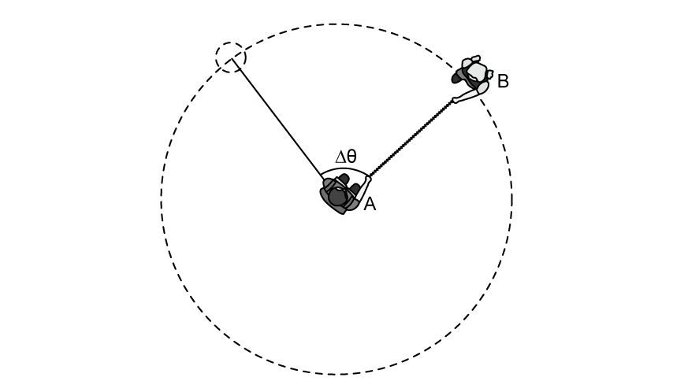
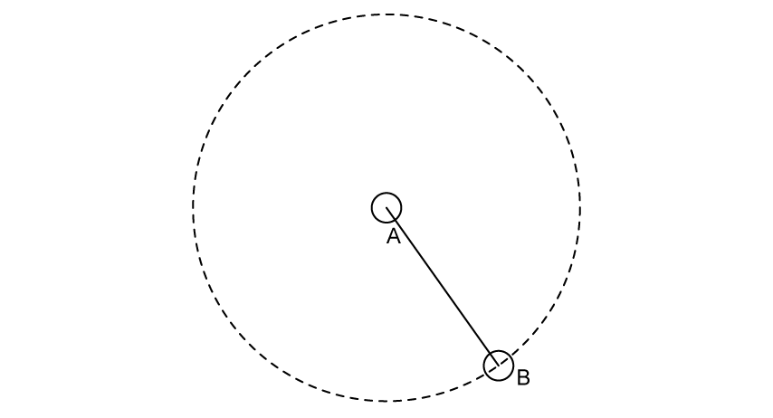
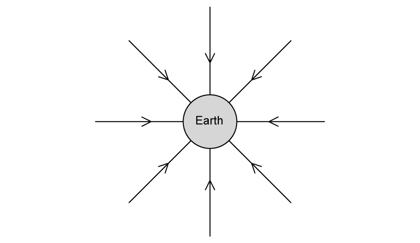
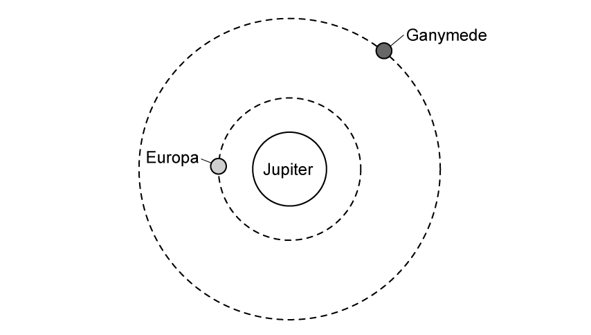
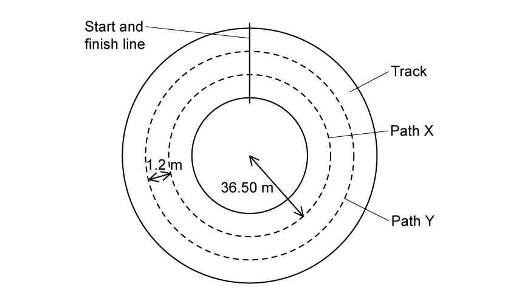
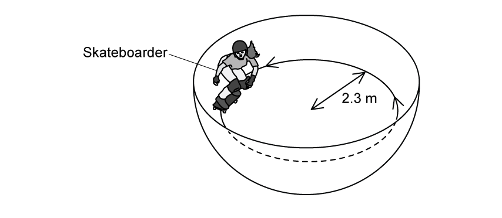
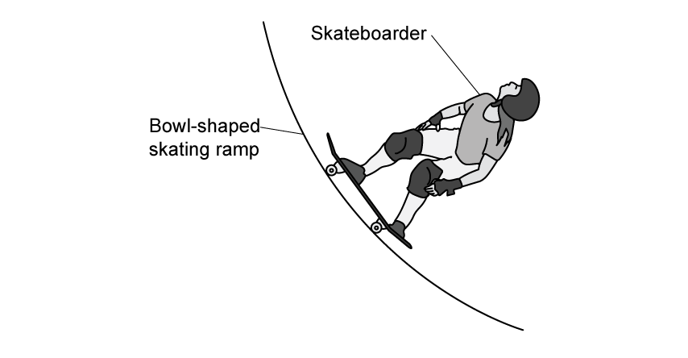

### 12.1 Kinematics of Uniform Circular Motion - Medium

::: {.question-card}
### Example 1 · Angular displacement and frequency · 12.1 SQ Medium Q1

**(a)** Explain why one complete revolution is equivalent to an angular displacement of $2\pi\ \mathrm{rad}$. `[1 mark]`

**(b)** A particle following a circular path is observed to have an angular displacement of $0.22\ \mathrm{rad}$. Express this angle in degrees ($^\circ$). Show your working and give your answer to an appropriate number of significant figures. `[1 mark]`

**(c)** Calculate the percentage error that is made when the angle $0.22\ \mathrm{rad}$, as measured in degrees ($\theta^\circ$), is assumed to be equal to $\tan(\theta^\circ)$ to four significant figures. Give your final answer to two significant figures. `[2 marks]`

**(d)** The particle travels the angle in part **(b)** in $60\ \mathrm{ms}$. Calculate the frequency of the particle. `[3 marks]`

Show mark scheme / model answer

**(a)**

- For one revolution, $s=2\pi r$ and $\theta=s/r$, so $\theta=2\pi\ \mathrm{rad}$. `[1]`

**(b)**

- $\theta=0.22\times180/\pi=12.605^\circ\approx13^\circ$ to two significant figures. `[1]`

**(c)**

- $\tan(12.605^\circ)=0.2236$. `[1]`
- Percentage error $=(0.2236-0.2200)/0.2200\times100=1.6\%$. `[1]`

**(d)**

- Convert $60\ \mathrm{ms}=60\times10^{-3}\ \mathrm{s}$ and calculate $\omega=\Delta\theta/\Delta t=0.22/(60\times10^{-3})=3.667\ \mathrm{rad\,s^{-1}}$. `[2]`
- $f=\omega/(2\pi)=0.58\ \mathrm{Hz}$. `[1]`

:::
::: {.question-card}
### Example 2 · Angular and linear velocity in orbits · 12.1 SQ Medium Q2

**(a)** State the difference between angular velocity and linear velocity. `[2 marks]`

**(b)** A moon is in a circular orbit of radius $r$ about a planet. The angular speed of the moon in its orbit is $\omega$. The planet and its moon may be considered to be point masses that are isolated in space.

$r$ and $\omega$ are related by the expression

$$r^3\omega^2=\text{constant}.$$

Io and Europa are moons that are in circular orbits around the planet Jupiter. Data for Io and Europa are shown in Fig. 1.1.

| moon | radius of orbit / km | period of rotation around Jupiter / hours |
|---|---:|---:|
| Io | $422\,000$ | $42.5$ |
| Europa | $670\,900$ | |

Use the data from Fig. 1.1 to determine the angular speed of Europa in its orbit around Jupiter. `[3 marks]`

**(c)** Calculate the time period of Europa.

$$T=\underline{\hspace{3cm}}\ \text{years}$$

`[2 marks]`

**(d)** Determine the radius of the orbit of a moon that had double the linear speed of Io but a third of its time period. `[2 marks]`

Show mark scheme / model answer

**(a)**

- Angular velocity is the rate of change of angular displacement swept out by a radius. `[1]`
- Linear velocity is the rate of change of linear displacement; for circular motion it is tangential to the path. `[1]`

**(b)**

- $\omega_{\mathrm{Io}}=2\pi/(42.5\times3600)=4.1\times10^{-5}\ \mathrm{rad\,s^{-1}}$. `[1]`
- Use $r_{\mathrm{Io}}^3\omega_{\mathrm{Io}}^2=r_{\mathrm{Europa}}^3\omega_{\mathrm{Europa}}^2$. `[1]`
- $\omega_{\mathrm{Europa}}\approx2.0\times10^{-5}\ \mathrm{rad\,s^{-1}}$. `[1]`

**(c)**

- $T=2\pi/\omega=2\pi/(2.0\times10^{-5})=3.14159\times10^5\ \mathrm{s}$. `[1]`
- $T=(3.14159\times10^5)/(365\times24\times60\times60)=9.96\times10^{-3}\ \mathrm{years}$. `[1]`

**(d)**

- From $v=2\pi r/T$, $r=vT/(2\pi)$. Doubling $v$ and reducing $T$ to one third makes the new radius $2/3$ of Io's radius. `[1]`
- $r=(2/3)(422\,000)=2.8\times10^5\ \mathrm{km}$. `[1]`

:::

::: {.question-card}
### Example 3 · Children rotating with a rope · 12.1 SQ Medium Q3

Two children A and B hold both sides of a rope $70\ \mathrm{cm}$ long. Child A swings child B in a circular path, as shown in Fig. 1.1.

{.question-figure fig-alt="Children A and B rotating with a 70 cm rope"}

**(a)** Child B travels a full rotation in $1.5\ \mathrm{s}$. Calculate the time taken for child B to travel a distance of $0.45\ \mathrm{m}$. `[3 marks]`

**(b)** Show that the angular displacement $\Delta\theta$ in this time is $37^\circ$. `[3 marks]`

**(c)** Child A now swings child B round till they are making $5$ revolutions every $2$ seconds. Calculate the linear speed of child B. `[3 marks]`

**(d)** As the children are spinning anti-clockwise, the rope suddenly snaps at the position of child A and B shown in Fig. 1.2.

{.question-figure fig-alt="Position of children A and B when the rope snaps"}

Draw the direction child B will continue to travel in the instance the rope is snapped. `[1 mark]`

Show mark scheme / model answer

**(a)**

- $\omega=2\pi/T=2\pi/1.5=4.189\ \mathrm{rad\,s^{-1}}$. `[1]`
- Use $\Delta s=r\omega\Delta t$, so $\Delta t=0.45/(0.70\times4.189)$. `[1]`
- $\Delta t=0.1545\ \mathrm{s}\approx0.15\ \mathrm{s}$. `[1]`

**(b)**

- $\Delta\theta=\omega\Delta t=4.189\times0.1545=0.647\ \mathrm{rad}$. `[2]`
- $\Delta\theta=0.647\times180/\pi=37^\circ$. `[1]`

**(c)**

- $f=5/2=2.5\ \mathrm{Hz}$. `[1]`
- $v=\omega r=(2\pi f)r=2\pi\times2.5\times0.70$. `[1]`
- $v=11\ \mathrm{m\,s^{-1}}$. `[1]`

**(d)**

- Draw an arrow from B tangent to the circle and pointing in the anti-clockwise direction (upwards and to the right in Fig. 1.2). `[1]`

:::

### 12.2 Centripetal Acceleration - Easy

::: {.question-card}
### Example 4 · Centripetal acceleration and a geostationary satellite · 12.2 SQ Easy Q1

**(a)** A centripetal force causes a centripetal acceleration. State two properties of the centripetal force that is required for this. `[2 marks]`

**(b)**

**(i)** State the equation for centripetal acceleration. `[1 mark]`

**(ii)** State the definition and unit of each variable in part **(i)**. `[3 marks]`

**(c)** Calculate the angular speed of a satellite in a geostationary orbit. `[3 marks]`

**(d)** The satellite has an altitude of $36\,000\ \mathrm{km}$. Calculate the centripetal acceleration of the satellite.

Radius of Earth $=6400\ \mathrm{km}$. `[3 marks]`

Show mark scheme / model answer

**(a)**

- The force has constant magnitude. `[1]`
- It is perpendicular to the direction of motion, or directed towards the centre of the circle. `[1]`

**(b)**

- **(i)** $a=v^2/r$ (the source also accepts $a=r\omega^2$). `[1]`
- **(ii)** $a$ is centripetal acceleration in $\mathrm{m\,s^{-2}}$; $r$ is the radius of the circular orbit in m; $v$ is the linear speed in $\mathrm{m\,s^{-1}}$. `[3]`

**(c)**

- A geostationary satellite has $T=24\ \mathrm{h}=86\,400\ \mathrm{s}$. `[1]`
- $\omega=2\pi/T=2\pi/86\,400$. `[1]`
- $\omega=7.3\times10^{-5}\ \mathrm{rad\,s^{-1}}$. `[1]`

**(d)**

- Orbital radius $r=(6400+36\,000)\ \mathrm{km}=42.4\times10^6\ \mathrm{m}$. `[1]`
- $a=r\omega^2=(42.4\times10^6)(7.272\times10^{-5})^2$. `[1]`
- $a=0.22\ \mathrm{m\,s^{-2}}$. `[1]`

:::

::: {.question-card}
### Example 5 · Identifying centripetal forces · 12.2 SQ Easy Q2

**(a)** State what is meant by centripetal force. `[2 marks]`

**(b)** State the centripetal force in each of the following situations:

**(i)** Venus orbiting the Sun; `[1 mark]`

**(ii)** a car driving around a roundabout; `[1 mark]`

**(iii)** rotating a ball tied to the end of a piece of string. `[1 mark]`

**(c)** The Moon orbits the Earth in a circular path. Explain, with reference to Fig. 1.1, why the path of the Moon is circular.

{.question-figure fig-alt="Gravitational field lines directed towards Earth"}

`[2 marks]`

**(d)** The centripetal force of the Moon is $2.21\times10^{20}\ \mathrm{N}$. Calculate the distance of the Moon from the surface of the Earth.

Mass of the Moon $=7.35\times10^{22}\ \mathrm{kg}$

Radius of Earth $=6.4\times10^6\ \mathrm{m}$

Linear speed of the Moon $=1023\ \mathrm{m\,s^{-1}}$ `[4 marks]`

Show mark scheme / model answer

**(a)**

- It is the resultant force required to keep a body moving in a circular path. `[1]`
- It is directed towards the centre of the circle. `[1]`

**(b)**

- **(i)** gravitational force; `[1]`
- **(ii)** frictional force; `[1]`
- **(iii)** tension in the string. `[1]`

**(c)**

- The field lines show that the gravitational force acts towards the centre of Earth, or the Moon's velocity is perpendicular to the field lines. `[1]`
- The force perpendicular to the velocity produces centripetal acceleration and hence a circular path. `[1]`

**(d)**

- $F=mv^2/r$, so $r=mv^2/F$. `[1]`
- $r=(7.35\times10^{22})(1023)^2/(2.21\times10^{20})$. `[1]`
- $r=3.4815\times10^8\ \mathrm{m}$. `[1]`
- Distance from the surface $h=r-R=3.4815\times10^8-6.4\times10^6=3.42\times10^8\ \mathrm{m}$. `[1]`

::: {.small-note}
Arithmetic correction: the source model-answer line prints $3.42\times10^6\ \mathrm{m}$, but its preceding values give $3.42\times10^8\ \mathrm{m}$.
:::

:::

::: {.question-card}
### Example 6 · Jupiter's moons · 12.2 SQ Easy Q3

Two of Jupiter's moons, Ganymede and Callisto, orbit around Jupiter in a circular path as shown in Fig. 1.1. Fig. 1.1 shows the North pole of Jupiter, where both moons orbit counter-clockwise.

{.question-figure fig-alt="Circular orbits of Ganymede and Europa around Jupiter"}

::: {.small-note}
Source note: the original wording names Callisto, while the original figure labels the inner moon Europa.
:::

**(a)** Identify, by drawing arrows, the following:

**(i)** the centripetal force on each moon. Label this $F$; `[2 marks]`

**(ii)** the linear velocity of each moon. Label this $v$. `[2 marks]`

**(b)** Both of Jupiter's moons travel at a speed of roughly $10\,000\ \mathrm{m\,s^{-1}}$. State which moon will have a longer time period. Explain your answer. `[3 marks]`

**(c)** The centripetal acceleration of Ganymede is $0.11\ \mathrm{m\,s^{-2}}$. The mass of Ganymede is $1.48\times10^{23}\ \mathrm{kg}$. Determine the centripetal force on Ganymede. `[2 marks]`

**(d)** Explain how the centripetal force of an object with the same mass and orbit as Ganymede would compare if it travelled with twice the angular speed. `[1 mark]`

Show mark scheme / model answer

**(a)**

- **(i)** Draw an arrow from the centre of each moon towards the centre of Jupiter and label it $F$. `[2]`
- **(ii)** Draw an arrow from each moon perpendicular to $F$, tangent to the orbit and pointing counter-clockwise; label it $v$. `[2]`

**(b)**

- Ganymede has the longer time period. `[1]`
- From $v=2\pi r/T$, for the same $v$, $T$ is directly proportional to $r$. `[1]`
- Ganymede has the larger orbital radius, so it has the longer period. `[1]`

**(c)**

- $F=ma=(1.48\times10^{23})(0.11)$. `[1]`
- $F=1.6\times10^{22}\ \mathrm{N}$. `[1]`

**(d)**

- $F=mr\omega^2$, so doubling $\omega$ makes the force four times greater. `[1]`

:::

### 12.2 Centripetal Acceleration - Medium

::: {.question-card}
### Example 7 · Runners on a circular track · 12.2 SQ Medium Q1

Two runners are running around a circular track. One runner follows path X and the other follows path Y, as shown in Fig. 1.1.

{.question-figure fig-alt="Circular running track with paths X and Y"}

The radius of path X is $36.50\ \mathrm{m}$. Path Y is parallel to, and $1.2\ \mathrm{m}$ outside, path X. Both runners have mass $75\ \mathrm{kg}$. The maximum lateral (sideways) friction force $F$ that the runners can experience without sliding is $57\ \mathrm{mN}$.

**(a)** Show that the maximum speed at which the runner on path Y can move is $0.17\ \mathrm{m\,s^{-1}}$. `[2 marks]`

**(b)** Compare the centripetal acceleration and maximum speed of the runner on path X compared to path Y. `[2 marks]`

**(c)** Calculate the time taken for the runner in path X to complete 1 lap.

$$T=\underline{\hspace{3cm}}\ \text{minutes}$$

`[2 marks]`

**(d)** The runner on path Y has an ankle injury that has come back with a vengeance, so it takes them twice as long to complete 1 lap. Determine their new centripetal acceleration. `[3 marks]`

Show mark scheme / model answer

**(a)**

- $r_Y=36.50+1.2=37.7\ \mathrm{m}$ and $v=\sqrt{Fr/m}$. `[1]`
- $v=\sqrt{(57\times10^{-3})(37.7)/75}=0.169\ \mathrm{m\,s^{-1}}\approx0.17\ \mathrm{m\,s^{-1}}$. `[1]`

**(b)**

- Both runners have the same maximum centripetal acceleration because $a=F/m$ and $F$ and $m$ are the same. `[1]`
- The runner on path X has the smaller maximum speed because $v=\sqrt{Fr/m}$ and $r_X<r_Y$. `[1]`

**(c)**

- $F=m\omega^2r=m(2\pi/T)^2r$, so $T=\sqrt{4\pi^2mr/F}$. Substitution gives $T=1376.95\ \mathrm{s}$. `[1]`
- $T=1376.95/60=22.95\ \mathrm{min}\approx23\ \mathrm{min}$. `[1]`

**(d)**

- Previous acceleration $a_p=F/m=(57\times10^{-3})/75=7.6\times10^{-4}\ \mathrm{m\,s^{-2}}$. `[1]`
- Since $a=4\pi^2r/T^2$, doubling $T$ reduces $a$ by a factor of four. `[1]`
- New $a=(7.6\times10^{-4})/4=1.9\times10^{-4}\ \mathrm{m\,s^{-2}}$. `[1]`

:::

::: {.question-card}
### Example 8 · Skateboarder in a bowl-shaped ramp · 12.2 SQ Medium Q2

A bowl-shaped skating ramp can be modelled as a hollow sphere. A skateboarder with a horizontal speed follows a circular path inside the bowl of radius $2.3\ \mathrm{m}$, as shown in Fig. 1.1.

{.question-figure fig-alt="Skateboarder following a circular path inside a bowl-shaped ramp"}

The forces acting on the skateboarder are their weight $W$ and the normal reaction force $R$ of the ramp on the skateboarder. $R$ is at an angle $\theta$ to the horizontal.

**(a)** Sketch $W$, $R$ and $\theta$ on Fig. 1.2.

{.question-figure fig-alt="Side view of skateboarder on the bowl-shaped ramp"}

`[3 marks]`

**(b)** Determine an equation for $W$ in terms of $\theta$ and the resultant force $F$ on the skateboarder. `[3 marks]`

**(c)** Explain why force $F$ is significant to the motion of the skateboarder. `[2 marks]`

**(d)** For the radius of the ramp in Fig. 1.1, the skateboarder travels at a speed of $6.0\ \mathrm{m\,s^{-1}}$. Show that the angle $\theta$ is $32^\circ$. `[3 marks]`

Show mark scheme / model answer

**(a)**

- Draw $R$ from the point of contact, normal to the ramp. `[1]`
- Draw $W$ vertically downwards from the skateboarder's centre of mass. `[1]`
- Label $\theta$ between $R$ and a horizontal line. `[1]`

**(b)**

- Resolve $R$: $F=R\cos\theta$. `[1]`
- Vertical equilibrium gives $W=R\sin\theta$. `[1]`
- Hence $W/F=\tan\theta$ and $W=F\tan\theta$. `[1]`

**(c)**

- $F$ provides the centripetal force. `[1]`
- It keeps the skateboarder moving in a circle. `[1]`

**(d)**

- Use $W=F\tan\theta$, with $W=mg$ and $F=mv^2/r$, giving $\tan\theta=rg/v^2$. `[1]`
- $\theta=\tan^{-1}[(2.3\times9.81)/(6.0)^2]$. `[1]`
- $\theta=32^\circ$. `[1]`

:::
