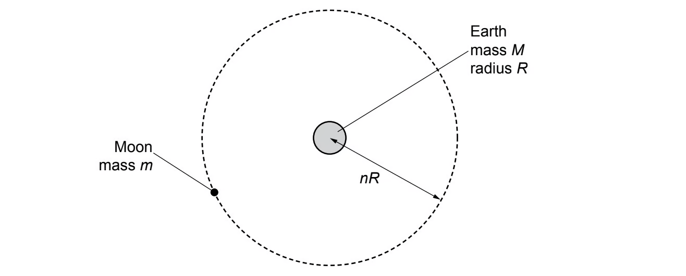
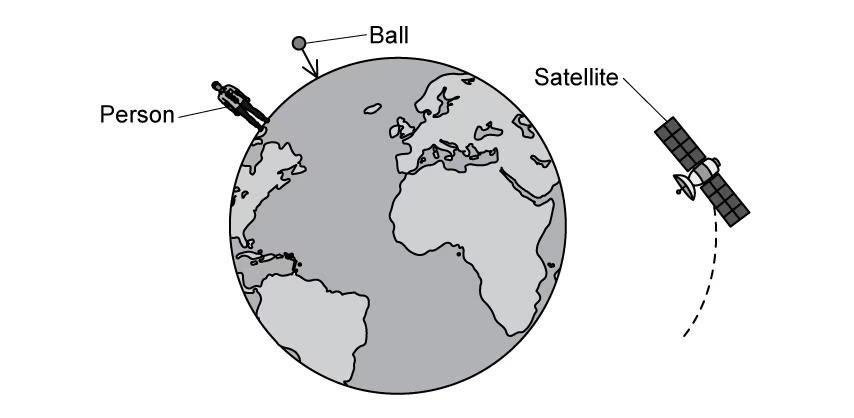
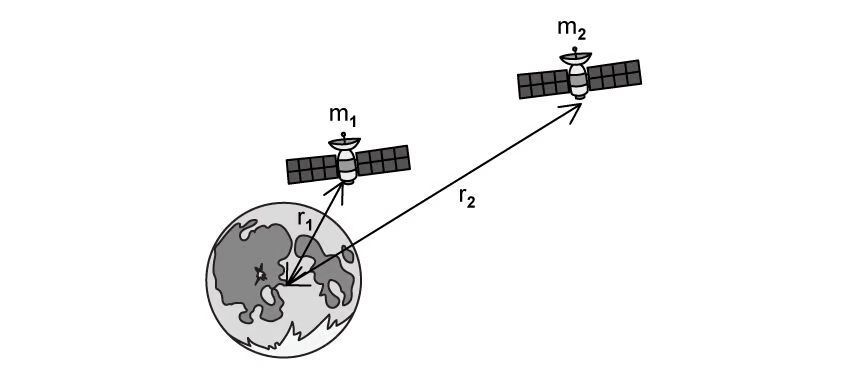
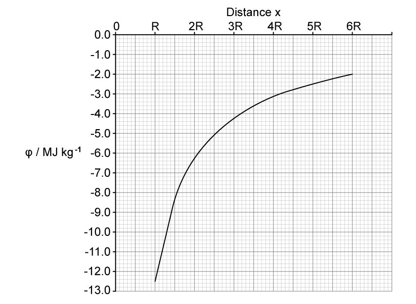
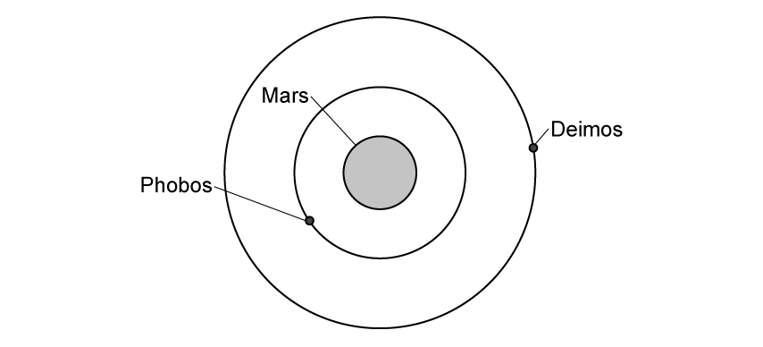
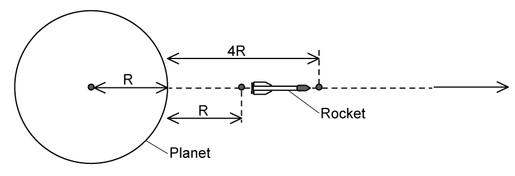
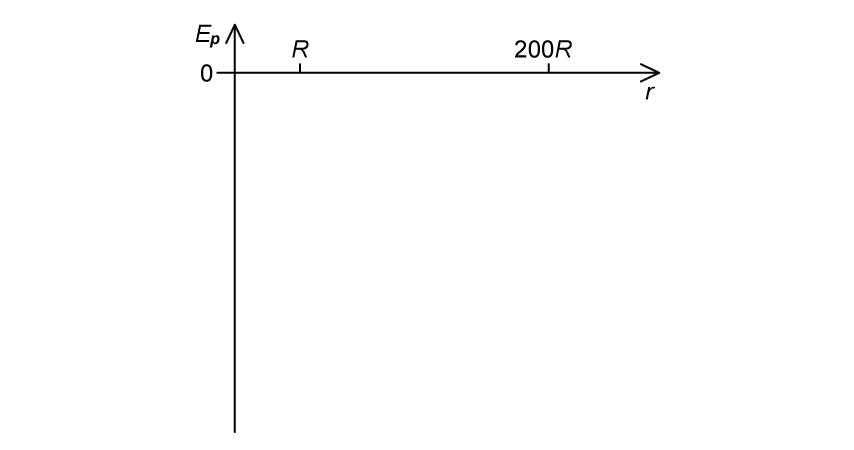

### 13.1 Universal Gravitation - Easy

::: {.question-card}
### Example 1 · Gravitational field and Saturn · 13.1 SQ Easy Q1

**(a)** Planets create large gravitational fields.

State what is meant by a gravitational field. `[2 marks]`

**(b)** The Earth has a larger gravitational field strength than the moon.

State what is meant by gravitational field strength. `[1 mark]`

**(c)** Saturn has a gravitational field strength of $10.5\ \mathrm{N\,kg^{-1}}$ on its surface and a radius of $58\,000\ \mathrm{km}$.

**(i)** State the acceleration due to gravity of an object on Saturn. `[1 mark]`

**(ii)** Calculate the mass of Saturn. `[3 marks]`

**(d)** Fig. 1.1 represents Saturn as an isolated uniform sphere.

{.question-figure fig-alt="Blank circular outline representing Saturn"}

Sketch the lines to represent the gravitational field outside the sphere. `[2 marks]`

Show mark scheme / model answer

**(a)**

- A region, area or volume of space `[1]`
- in which a mass experiences a force. `[1]`

**(b)**

- The force per unit mass on an object. `[1]`

**(c)**

- **(i)** $10.5\ \mathrm{m\,s^{-2}}$. `[1]`
- **(ii)** Use $g=GM/r^2$, so $M=gr^2/G$. `[1]`
- $M=10.5(58\,000\times10^3)^2/(6.67\times10^{-11})$. `[1]`
- $M=5.3\times10^{26}\ \mathrm{kg}$. `[1]`

**(d)**

- Draw radial lines around the sphere. `[1]`
- Put arrows on the lines pointing towards the centre. `[1]`

:::
::: {.question-card}
### Example 2 · Newton's law and the Earth–Sun system · 13.1 SQ Easy Q2

**(a)** State Newton's law of gravitation. `[2 marks]`

**(b)** Newton's law of gravitation assumes the masses are point masses.

The planets in our Solar System and the Sun are not point masses.

Explain why the law still applies to the planets in our Solar System. `[2 marks]`

**(c)** Explain why $g$ is approximately constant for small changes in height near the Earth's surface. `[1 mark]`

**(d)** The gravitational force between the Earth and the Sun is $3.52\times10^{22}\ \mathrm{N}$.

Calculate the radius of the Earth's orbit around the Sun.

Mass of Earth $=6.0\times10^{24}\ \mathrm{kg}$

Mass of Sun $=2.0\times10^{30}\ \mathrm{kg}$ `[3 marks]`

Show mark scheme / model answer

**(a)**

- The gravitational force is proportional to the product of the two masses. `[1]`
- It is inversely proportional to the square of their separation. `[1]`

**(b)**

- The planets orbit the Sun and may be treated as spherically symmetric bodies. `[1]`
- Their separations are much greater than the radii of the Sun and planets, so each body's mass may be treated as concentrated at its centre. `[1]`

**(c)**

- A small change in height is much smaller than Earth's radius, so the centre-to-centre distance changes negligibly. `[1]`

**(d)**

- From $F=Gm_1m_2/r^2$, $r=\sqrt{Gm_1m_2/F}$. `[1]`
- $r=\sqrt{(6.67\times10^{-11})(6.0\times10^{24})(2.0\times10^{30})/(3.52\times10^{22})}$. `[1]`
- $r=1.5\times10^{11}\ \mathrm{m}$. `[1]`

:::

::: {.question-card}
### Example 3 · Geostationary orbit and planetary mass · 13.1 SQ Easy Q3

**(a)** Explain what is meant by a geostationary orbit. `[3 marks]`

**(b)** A satellite of mass $m$ is in a circular orbit around a planet of mass $M$ with linear speed $v$.

Show that $M$ is given by the expression

$$M=\frac{v^2r}{G}.$$ `[2 marks]`

**(c)** Show that the mass $M$ can also be written in terms of the time period of the satellite $T$ as

$$M=\frac{4\pi^2r^3}{T^2G}.$$ `[2 marks]`

**(d)** Calculate the radius of a geostationary orbit around Earth.

Mass of Earth $=6.0\times10^{24}\ \mathrm{kg}$ `[4 marks]`

Show mark scheme / model answer

**(a)**

- The orbit is in the equatorial plane. `[1]`
- The satellite travels west to east, in the same direction as Earth's rotation. `[1]`
- Its period is 24 hours, so it remains above the same point on Earth. `[1]`

**(b)**

- Equate gravitational and centripetal forces: $GMm/r^2=mv^2/r$. `[1]`
- Cancel $m$ and rearrange to obtain $M=v^2r/G$. `[1]`

**(c)**

- Use $v=2\pi r/T$. `[1]`
- Substitution into $M=v^2r/G$ gives $M=4\pi^2r^3/(T^2G)$. `[1]`

**(d)**

- $T=24\times60\times60=86\,400\ \mathrm{s}$. `[1]`
- Rearrange: $r^3=GMT^2/(4\pi^2)$. `[1]`
- Substitute $G=6.67\times10^{-11}\ \mathrm{N\,m^2\,kg^{-2}}$ and $M=6.0\times10^{24}\ \mathrm{kg}$. `[1]`
- $r=4.2\times10^7\ \mathrm{m}$. `[1]`

:::

### 13.1 Universal Gravitation - Medium

::: {.question-card}
### Example 4 · Earth density from the Moon's orbit · 13.1 SQ Medium Q1

**(a)** Explain how the force(s) on a satellite can result in the satellite being in a circular orbit around a planet. `[2 marks]`

**(b)** The Earth and the Moon may be considered to be uniform spheres that are isolated in space. The Earth has mass $M$, radius $R$ and mean density $\rho$.

The Moon, mass $m$, is in a circular orbit about the Earth with radius $nR$, as illustrated in Fig. 1.1.

{.question-figure fig-alt="Moon of mass m orbiting Earth at radius nR"}

The Moon makes one complete orbit of the Earth in time $T$.

Show that the mean density $\rho$ of the Earth is given by the expression

$$\rho=\frac{3\pi n^3}{GT^2},$$

where $G$ is the gravitational constant. `[4 marks]`

**(c)** The radius $R$ of the Earth is $6.38\times10^6\ \mathrm{m}$ and the distance between the centre of the Earth and the centre of the Moon is $3.84\times10^8\ \mathrm{m}$.

The period $T$ of the orbit of the Moon about the Earth is 27.3 days.

Use the expression in **(b)** to calculate $\rho$. `[3 marks]`

Show mark scheme / model answer

**(a)**

- The gravitational attraction between the satellite and planet acts towards the planet. `[1]`
- This force produces the centripetal acceleration required for a circular orbit. `[1]`

**(b)**

- Equate forces: $GMm/(nR)^2=m(2\pi/T)^2(nR)$. `[1]`
- Rearranging gives $M=4\pi^2n^3R^3/(GT^2)$. `[1]`
- For Earth, $M=\rho(4\pi R^3/3)$. `[1]`
- Equating the expressions for $M$ and cancelling gives $\rho=3\pi n^3/(GT^2)$. `[1]`

**(c)**

- $n=(3.84\times10^8)/(6.38\times10^6)=60.2$. `[1]`
- $T=27.3\times24\times3600=2.36\times10^6\ \mathrm{s}$. `[1]`
- $\rho=3\pi(60.2)^3/[6.67\times10^{-11}(2.36\times10^6)^2]=5.5\times10^3\ \mathrm{kg\,m^{-3}}$. `[1]`

:::

::: {.question-card}
### Example 5 · Gravity and rotation on Olympus Mons · 13.1 SQ Medium Q2

Mars may be considered to be a uniform sphere of radius $3400\ \mathrm{km}$ with its mass $M$ concentrated at its centre. A stone of mass $3.67\ \mathrm{kg}$ rests on top of Olympus Mons, the largest volcano on Mars, which is $25\ \mathrm{km}$ high.

The gravitational force on the stone is $13.3\ \mathrm{N}$.

Mars spins on its axis with a period of 1 day and 37 mins.

**(a)** Calculate $M$. `[2 marks]`

**(b)** Determine the force required to maintain the stone in its circular path. `[3 marks]`

**(c)** Derive the equation

$$g=\frac{GM}{r^2},$$

where $G$ is Newton's gravitational constant, $M$ is the mass and $r$ is the distance from the mass for the gravitational field strength due to a point mass. `[2 marks]`

**(d)** Olympus Mons is an active volcano.

Calculate the acceleration due to gravity of the stone if it was thrown upwards to twice the height of Olympus Mons. `[2 marks]`

Show mark scheme / model answer

**(a)**

- With $r=(3400+25)\times10^3\ \mathrm{m}$, use $F=GMm/r^2$, so $M=Fr^2/(Gm)$. `[1]`
- $M=6.37\times10^{23}\ \mathrm{kg}$. `[1]`

**(b)**

- $T=(24\times60\times60)+(37\times60)=88\,620\ \mathrm{s}$. `[1]`
- $F=mr\omega^2=mr(2\pi/T)^2$. `[1]`
- $F=6.3\times10^{-2}\ \mathrm{N}$. `[1]`

**(c)**

- Use $F=GMm/r^2$ and $g=F/m$. `[1]`
- Therefore $g=GM/r^2$. `[1]`

**(d)**

- At the stated position, use $r=(3400+25+50)\times10^3\ \mathrm{m}$ in $g=GM/r^2$. `[1]`
- $g\approx3.5\ \mathrm{m\,s^{-2}}$. `[1]`

:::

::: {.question-card}
### Example 6 · Geostationary orbit derivation · 13.1 SQ Medium Q3

**(a)** Explain:

**(i)** what is meant by a geostationary orbit; `[3 marks]`

**(ii)** why it is preferable to have a satellite in this orbit for TV and telephone signals. `[2 marks]`

**(b)** A satellite of mass $m$ is in orbit around a planet.

The mass $M$ of the planet may be considered to be concentrated at its centre.

Show that the time period $T$ of the orbit of the satellite is given by the expression

$$T^2=\frac{4\pi^2R^3}{GM},$$

where $R$ is the radius of the orbit of the satellite and $G$ is the gravitational constant.

Explain your working. `[4 marks]`

**(c)** The radius of a geostationary orbit around Earth is $4.2\times10^7\ \mathrm{m}$.

Calculate the mass of the Earth. `[2 marks]`

**(d)** The radius of the Earth is $6400\ \mathrm{km}$.

Determine the ratio

$$\frac{\text{gravitational field strength of satellite on the Earth's surface}}{\text{gravitational field strength of the satellite at the geostationary orbit}}.$$ `[3 marks]`

Show mark scheme / model answer

**(a)**

- **(i)** It is a circular orbit above the equator; the satellite moves in the same direction as Earth's rotation; and its period is 24 hours. `[3]`
- **(ii)** The satellite remains at a fixed position above Earth's surface, so the receiving antenna does not need to be moved. `[2]`

**(b)**

- Gravitational force provides centripetal force. `[1]`
- $GMm/R^2=mR\omega^2$. `[1]`
- Substitute $\omega=2\pi/T$. `[1]`
- Rearrangement gives $T^2=4\pi^2R^3/(GM)$. `[1]`

**(c)**

- $M=4\pi^2R^3/(GT^2)$ with $T=86\,400\ \mathrm{s}$. `[1]`
- $M=5.9\times10^{24}\ \mathrm{kg}$. `[1]`

**(d)**

- Since $g=GM/r^2$, $g_1/g_2=(r_2/r_1)^2$. `[1]`
- $g_1/g_2=(4.2\times10^7/6.4\times10^6)^2$. `[1]`
- Ratio $=43$. `[1]`

:::
### 13.2 Gravitational Potential - Easy

::: {.question-card}
### Example 7 · Potential, energy and objects near Earth · 13.2 SQ Easy Q1

**(a)** State the physical quantity defined as the energy possessed by an object due to its position in a gravitational field. `[1 mark]`

**(b)** Define gravitational potential at a point. `[2 marks]`

**(c)** Gravitational potential, $\phi$, is also defined by the equation

$$\phi=-\frac{GM}{r}.$$

**(i)** Identify each quantity in the equation. `[3 marks]`

**(ii)** State the significance of the negative sign in the equation. `[2 marks]`

**(d)** Fig. 1.1 shows a person on the surface of the Earth, a ball falling towards the centre of the Earth and a satellite in orbit around the Earth.

{.question-figure fig-alt="Person and falling ball near Earth with a satellite in orbit"}

Identify the object which experiences the largest gravitational potential. `[1 mark]`

Show mark scheme / model answer

**(a)**

- Gravitational potential energy. `[1]`

**(b)**

- The work done per unit mass `[1]`
- in bringing a test mass from infinity to the point. `[1]`

**(c)**

- **(i)** $G$ is Newton's gravitational constant; $M$ is the mass producing the field; $r$ is the distance from its centre of mass. `[3]`
- **(ii)** The gravitational force is attractive, and the field does work as masses move together, so the potential at a finite distance is below the zero value at infinity. `[2]`

**(d)**

- The satellite. `[1]`

:::

::: {.question-card}
### Example 8 · Satellite potential energy around the Moon · 13.2 SQ Easy Q2

**(a)** Place a tick ($\checkmark$) next to the equation in Table 1.1 which represents the gravitational potential energy of two point masses $m$ and $M$ separated by a distance $r$. `[1 mark]`

| Equation | Tick |
|---|:---:|
| $\phi=-GM/r$ | |
| $E_p=-GMm/r$ | |
| $E_p=mgh$ | |
| $g=GM/r^2$ | |

**(b)** The diagram in Fig. 1.2 shows two satellites $m_1$ and $m_2$ in orbit around the moon.

{.question-figure fig-alt="Two satellites m1 and m2 orbiting the Moon at radii r1 and r2"}

Satellite $m_1$ is in orbit at a distance of $r_1$ from the centre of the moon and satellite $m_2$ is in orbit at a distance of $r_2$ from the centre of the moon.

State which of the satellites has the higher gravitational potential energy. `[1 mark]`

**(c)** Satellite $m_1$ has a mass of $300\ \mathrm{kg}$ and orbits above the centre of the moon at a radius $r_1$ of $500\ \mathrm{m}$.

The mass of the moon is $7\times10^{22}\ \mathrm{kg}$.

Calculate the gravitational potential energy of the satellite in this position. Newton's gravitational constant, $G=6.67\times10^{-11}\ \mathrm{N\,m^2\,kg^{-2}}$. `[2 marks]`

**(d)** State why the equation for gravitational potential energy in **(a)** has a negative sign and why your answer to **(c)** is negative. `[3 marks]`

Show mark scheme / model answer

**(a)**

- Tick $E_p=-GMm/r$. `[1]`

**(b)**

- Satellite $m_2$. `[1]`

**(c)**

- $E_p=-(6.67\times10^{-11})(7\times10^{22})(300)/500$. `[1]`
- $E_p=-2.8\times10^{12}\ \mathrm{J}$. `[1]`

**(d)**

- Gravitational potential energy is defined as zero at infinity. `[1]`
- Gravitational forces are attractive. `[1]`
- Potential energy decreases and becomes negative as the masses are brought closer together. `[1]`

:::

::: {.question-card}
### Example 9 · Potential difference and orbital radius · 13.2 SQ Easy Q3

**(a)** Explain why gravitational potential is always negative. `[2 marks]`

**(b)** Fig. 1.1 shows a satellite orbiting Mars, $M$. The satellite moves from orbit X to orbit Y.

{.question-figure fig-alt="Two circular satellite orbits X and Y around Mars"}

The gravitational potential due to Mars in each of these orbits is:

Orbit X: $-3.56\ \mathrm{MJ\,kg^{-1}}$

Orbit Y: $-1.23\ \mathrm{MJ\,kg^{-1}}$

Calculate the gravitational potential difference as the satellite moves from orbit X to orbit Y. `[3 marks]`

**(c)** The gravitational potential energy at a particular point is given by the equation

$$E_p=-\frac{GMm}{r}.$$

Define each of the terms in the equation. `[4 marks]`

**(d)** A satellite is in orbit at $2\times10^6\ \mathrm{m}$ above the surface of the Earth. The Earth has a radius of $6.4\times10^6\ \mathrm{m}$.

Calculate the orbital radius of the satellite. `[3 marks]`

Show mark scheme / model answer

**(a)**

- Gravitational potential is defined as zero at infinity. `[1]`
- Because gravity is attractive, work must be done to move a mass from a finite point to infinity; hence its potential at the finite point is negative. `[1]`

**(b)**

- $\Delta\phi=\phi_Y-\phi_X$. `[1]`
- $\Delta\phi=(-1.23)-(-3.56)$. `[1]`
- $\Delta\phi=2.33\ \mathrm{MJ\,kg^{-1}}$. `[1]`

**(c)**

- $G$ is the gravitational constant. `[1]`
- $M$ is the mass producing the gravitational field. `[1]`
- $m$ is the mass of the object in the field. `[1]`
- $r$ is the distance between the centres of mass. `[1]`

**(d)**

- Orbital radius is measured from Earth's centre. `[1]`
- $r=(6.4\times10^6)+(2.0\times10^6)$. `[1]`
- $r=8.4\times10^6\ \mathrm{m}$. `[1]`

:::

### 13.2 Gravitational Potential - Medium

::: {.question-card}
### Example 10 · Potential graph and the moons of Mars · 13.2 SQ Medium Q1

**(a)** Mars is considered to be an isolated sphere of radius $R$ with its mass concentrated at its centre.

The variation of the gravitational potential $\phi$ with distance $x$ from the centre of Mars is shown in Fig. 1.1.

{.question-figure fig-alt="Gravitational potential against distance from the centre of Mars"}

Explain why the values for $\phi$ in Fig. 1.1 are negative. `[2 marks]`

**(b)** The radius $R$ of Mars is $3400\ \mathrm{km}$.

By considering the gravitational potential at Mars' surface, determine a value for its mass. `[3 marks]`

**(c)** A meteorite is at rest at infinity. The meteorite travels from infinity towards Mars.

Calculate the speed of the meteorite when it is at a distance of $3R$ above Mars' surface. Explain your working. `[4 marks]`

**(d)** Mars has two moons, Phobos and Deimos, as shown in Fig. 1.2.

{.question-figure fig-alt="Phobos and Deimos in circular orbits around Mars"}

Calculate the work done to move a satellite of $210\ \mathrm{kg}$ from the orbit of Deimos to the orbit of Phobos.

Orbital radius of Phobos $=9400\ \mathrm{km}$

Orbital radius of Deimos $=2.3\times10^4\ \mathrm{km}$

Give your answer in MJ. `[3 marks]`

Show mark scheme / model answer

**(a)**

- Gravitational potential is defined as zero at infinity. `[1]`
- Gravity is attractive, so the field does work as a mass moves inwards; the potential at every finite distance is negative. `[1]`

**(b)**

- Read $\phi\approx-12.5\ \mathrm{MJ\,kg^{-1}}$ at $x=R$ from the graph. `[1]`
- From $\phi=-GM/R$, $M=-\phi R/G$. `[1]`
- $M\approx6.4\times10^{23}\ \mathrm{kg}$. `[1]`

**(c)**

- At $3R$ above the surface, the distance from the centre is $4R$. `[1]`
- From the graph, $\phi(4R)\approx-3.1\ \mathrm{MJ\,kg^{-1}}$. `[1]`
- Conservation of energy per unit mass gives $\tfrac12v^2+\phi=0$. `[1]`
- $v=\sqrt{-2\phi}\approx2.5\times10^3\ \mathrm{m\,s^{-1}}$. `[1]`

**(d)**

- $\Delta E_p=GMm(1/r_D-1/r_P)$. `[1]`
- Substitute $M=6.4\times10^{23}\ \mathrm{kg}$, $r_D=2.3\times10^7\ \mathrm{m}$ and $r_P=9.4\times10^6\ \mathrm{m}$. `[1]`
- $\Delta E_p=-5.6\times10^8\ \mathrm{J}=-560\ \mathrm{MJ}$. `[1]`

:::

::: {.question-card}
### Example 11 · Potential at two points and a Mercury rocket · 13.2 SQ Medium Q2

**(a)** The gravitational potential at a point A above the surface of a planet is $-7.2\ \mathrm{MJ\,kg^{-1}}$.

For a point B above the surface of the planet, the gravitational potential is $-9.1\ \mathrm{MJ\,kg^{-1}}$.

State, with a reason, whether point A or B is further away from the planet. `[2 marks]`

**(b)** A rocket is landing onto the surface of Mercury.

Table 1.1 gives data for the speed of the rocket at two heights above the surface of Mercury, after the rocket engine has been switched off.

| height / km | speed / $\mathrm{m\,s^{-1}}$ |
|---:|---:|
| $h_1=15\times10^3$ | $v_1=7215$ |
| $h_2=3.7\times10^3$ | $v_2=7020$ |

Mercury may be assumed to be a uniform sphere of radius $R$, with its mass $M$ concentrated at its centre. The rocket, after the engine has been switched off, has mass $m$. The change in gravitational potential energy of the rocket between the two heights is $\Delta E_p$.

Show that the mass $M$ of Mercury is given by the expression

$$M=\frac{\Delta E_p}{Gm\left(\dfrac{1}{R+h_1}-\dfrac{1}{R+h_2}\right)}.$$ `[3 marks]`

**(c)** Write an expression for the change in kinetic energy of the rocket. `[1 mark]`

Show mark scheme / model answer

**(a)**

- Point A is further away. `[1]`
- Potential approaches zero as distance increases, and $-7.2\ \mathrm{MJ\,kg^{-1}}$ is less negative than $-9.1\ \mathrm{MJ\,kg^{-1}}$. `[1]`

**(b)**

- At height $h$, $E_p=-GMm/(R+h)$. `[1]`
- $\Delta E_p=-GMm/(R+h_2)+GMm/(R+h_1)=GMm[1/(R+h_1)-1/(R+h_2)]$. `[1]`
- Rearrangement gives the stated expression for $M$. `[1]`

**(c)**

- $\Delta E_k=\tfrac12m(v_2^2-v_1^2)$. `[1]`

:::

::: {.question-card}
### Example 12 · Projection from the surface of Venus · 13.2 SQ Medium Q3

**(a)** Venus may be assumed to be an isolated sphere of radius $6100\ \mathrm{km}$ with its mass, $M$, at $4.9\times10^{24}\ \mathrm{kg}$ concentrated at its centre.

An object is projected vertically from the surface of Venus so that it reaches an altitude of $7.2\times10^4\ \mathrm{km}$.

Explain why the equation $Mg\Delta h$, where $g$ is the gravitational field strength of Venus and $\Delta h$ is the height of the object, cannot be used to calculate the object's gravitational potential energy. `[1 mark]`

**(b)** The change in the gravitational potential of a different object is $4.2\ \mathrm{MJ\,kg^{-1}}$. This object ends up in orbit around Venus.

Calculate the radius of orbit of this object. `[3 marks]`

**(c)** Calculate the change in work done per unit mass of the object projected vertically in part **(a)**. `[2 marks]`

**(d)** Show that the initial speed of the object in **(a)** is $1.1\ \mathrm{km\,s^{-1}}$, assuming air resistance is negligible. `[3 marks]`

Show mark scheme / model answer

**(a)**

- The gravitational field strength $g$ is not constant over this change in altitude. `[1]`

**(b)**

- $\Delta\phi=GM(1/R-1/r)$. `[1]`
- Hence $r=[1/R-\Delta\phi/(GM)]^{-1}$. `[1]`
- $r=6.6\times10^6\ \mathrm{m}$. `[1]`

**(c)**

- The source answer substitutes the printed height as $7.2\times10^4\ \mathrm{m}$ in $\Delta\phi=GM[1/R-1/(R+h)]$. `[1]`
- This gives $\Delta\phi=0.63\ \mathrm{MJ\,kg^{-1}}$. `[1]`

**(d)**

- With negligible air resistance, $\tfrac12mv^2=m\Delta\phi$. `[1]`
- $v=\sqrt{2\Delta\phi}$. `[1]`
- Using the source value from **(c)** gives $v=1.1\ \mathrm{km\,s^{-1}}$. `[1]`

> **Source-unit note:** the question prints $7.2\times10^4\ \mathrm{km}$, but the supplied PDF answer treats the value as metres. The numerical results in **(c)** and **(d)** reproduce the supplied answer.

:::

### 13.2 Gravitational Potential - Hard

::: {.question-card}
### Example 13 · Rocket travelling from a planet towards its moon · 13.2 SQ Hard Q1

A spherical planet has a mass $M$ and radius $R$. The planet may be considered to have all its mass concentrated at its centre.

A rocket, of mass $m$, is launched from the surface of the planet.

The rocket engines are stopped when the rocket is at a height $R$ above the surface of the planet, as shown in Fig. 1.1.

{.question-figure fig-alt="Rocket moving from height R to height 4R above a spherical planet"}

**(a)** The change in gravitational potential energy of the rocket as it travels from a height $R$ to a height $4R$ above the planet's surface is equal to

$$\Delta E_p=x\left(\frac{GMm}{R}\right).$$

Determine the value of $x$. `[3 marks]`

**(b)** At a distance $R$ away from the surface of the planet the rocket has a velocity $2v$ and at a distance of $4R$ away from the planet a velocity $v$.

Show that the expression for the thermal energy lost $\Delta Q$ to the atmosphere of the planet as the rocket moves from $R$ to $4R$ is given by

$$\Delta Q=\frac{3m}{2}\left(v^2-\frac{GM}{5R}\right).$$ `[4 marks]`

**(c)** The rocket travels towards a moon orbiting the planet.

The distance from the centre of the planet to the centre of the moon is $200R$. The moon has a mass $M/16$, where $M$ is the mass of the planet.

Determine the distance, in terms of $R$, from the centre of the planet at which

$$\frac{\Delta E_p}{\Delta r}=0.$$

Give your answer to the nearest whole number. `[4 marks]`

**(d)** On the axes of Fig. 1.2, sketch a graph to show the variation of the gravitational potential with distance along a line between the surface of the planet and the surface of the moon.

{.question-figure fig-alt="Blank axes for potential energy against distance from R to 200R"}

`[3 marks]`

Show mark scheme / model answer

**(a)**

- Initial distance from the centre is $2R$ and final distance is $5R$. `[1]`
- $\Delta E_p=-GMm/(5R)-[-GMm/(2R)]=3GMm/(10R)$. `[1]`
- $x=3/10$. `[1]`

**(b)**

- $\Delta E_k=\tfrac12mv^2-\tfrac12m(2v)^2=-\tfrac32mv^2$. `[1]`
- Apply conservation of energy: $\Delta E_p+\Delta E_k+\Delta Q=0$. `[1]`
- Substitute $\Delta E_p=3GMm/(10R)$ and rearrange. `[1]`
- $\Delta Q=(3m/2)[v^2-GM/(5R)]$. `[1]`

**(c)**

- Zero potential gradient corresponds to zero resultant field strength. `[1]`
- At distance $x$ from the planet centre, equate $GM/x^2=G(M/16)/(200R-x)^2$. `[2]`
- $x=4(200R-x)$, hence $x=160R$. `[1]`

**(d)**

- Draw a negative curve rising away from the planet's surface. `[1]`
- Give it a maximum below zero at about $160R$. `[1]`
- Draw it falling again towards the moon's surface at $200R$, with the endpoint only slightly below the maximum. `[1]`

:::

::: {.question-card}
### Example 14 · Energy of an Earth satellite · 13.2 SQ Hard Q2

The Earth may be assumed to be a uniform sphere of radius $R=6.38\times10^6\ \mathrm{m}$, with its mass $M$ concentrated at its centre.

A satellite of mass $m$ orbits the Earth at a height $h_1$ above the Earth's surface.

**(a)** Derive an expression for the total energy of the satellite in terms of $G$, $M$, $m$, $h_1$ and $R$. `[4 marks]`

**(b)** The satellite moves to a distance $h_2$ away from the surface of the Earth.

Derive an expression for the change in gravitational potential energy as the satellite moves from $h_1$ to $h_2$. `[2 marks]`

**(c)** When the satellite reaches a height $h_2$ above the surface of the Earth, it begins to drift out of its orbit.

Determine the distance moved by the satellite once it has drifted to the point the gravitational potential energy has increased by 20% of its initial value at $h_1$.

Assume that the satellite moves along the same line connecting points $h_1$, $h_2$ and the centre of the Earth.

Mass of the Earth $=5.97\times10^{24}\ \mathrm{kg}$

Mass of the satellite $=1720\ \mathrm{kg}$

Height $h_1=2.23\times10^6\ \mathrm{m}$

Height $h_2=3.05\times10^6\ \mathrm{m}$ `[4 marks]`

Show mark scheme / model answer

**(a)**

- For a circular orbit, $GMm/r^2=mv^2/r$, so $v^2=GM/r$. `[1]`
- $E_k=\tfrac12mv^2=GMm/(2r)$. `[1]`
- $E_p=-GMm/r$. `[1]`
- With $r=R+h_1$, $E_{\text{total}}=-GMm/[2(R+h_1)]$. `[1]`

**(b)**

- $\Delta E_p=E_{p2}-E_{p1}=-GMm/(R+h_2)+GMm/(R+h_1)$. `[1]`
- $\Delta E_p=GMm[1/(R+h_1)-1/(R+h_2)]$. `[1]`

**(c)**

- Initial radius $r_i=R+h_1=8.61\times10^6\ \mathrm{m}$; the radius after drifting is $r_f=R+h_2+x=9.43\times10^6+x$. `[1]`
- Since $|E_p|\propto1/r$, a 20% reduction in the magnitude of the initial potential energy gives $r_f=r_i/0.8=1.25r_i$. `[1]`
- $9.43\times10^6+x=1.25(8.61\times10^6)$. `[1]`
- $x=1.33\times10^6\ \mathrm{m}$. `[1]`

:::

::: {.question-card}
### Example 15 · Work done leaving the Moon and comparing potentials · 13.2 SQ Hard Q3

**(a)** A space shuttle of mass $3\times10^6\ \mathrm{kg}$ is travelling from the moon back to Earth. It accelerates uniformly from launch at $2.3\ \mathrm{m\,s^{-2}}$. It has enough propellant to provide thrust for the first 155 seconds.

The mass of the moon is $7.35\times10^{22}\ \mathrm{kg}$ and the mean radius is $1740\ \mathrm{km}$.

Calculate the work done by the rocket during the first 155 seconds after launch. State any assumptions you have made. `[3 marks]`

**(b)** The Moon has a radius of approximately 27% that of the Earth, and a mass of 1.2% that of the Earth.

Show that the gravitational potential at the surface of the Earth is about 24 times greater than the gravitational potential at the surface of the moon. `[3 marks]`

Show mark scheme / model answer

**(a)**

- Assuming launch from rest and uniform radial acceleration, $s=\tfrac12at^2=\tfrac12(2.3)(155)^2=2.76\times10^4\ \mathrm{m}$. `[1]`
- The supplied PDF answer evaluates the potential change using $\Delta\phi=GM_M[1/r_M-1/(r_M+s)]$. `[1]`
- It reports the work as $W=m\Delta\phi=5.25\times10^{14}\ \mathrm{J}$. `[1]`

**(b)**

- $|\phi|=GM/R$. `[1]`
- $M_M=0.012M_E$ and $R_M=0.27R_E$. `[1]`
- $|\phi_E|/|\phi_M|=(M_E/R_E)/(0.012M_E/0.27R_E)=0.27/0.012=22.5\approx24$. `[1]`

> **Source-calculation note:** the numerical work quoted for **(a)** is reproduced from the supplied PDF answer. Direct substitution of the printed data gives a different value, so this source item should be treated cautiously.

:::
