### 14.1 Measuring Temperature - Easy

::: {.question-card}
### Example 1 · Thermal energy transfer · 14.1 SQ Easy Q1

**(a)** Use the words in the box to complete the gaps in the definition of thermal energy.

`higher` &nbsp; `possessed` &nbsp; `lower` &nbsp; `gained` &nbsp; `temperature` &nbsp; `heat` &nbsp; `movement`

Thermal energy is defined as the energy __________ by an object due to its __________. Thermal energy is transferred from a region of __________ temperature to a region of __________ temperature. `[4 marks]`

**(b)** Identify, by placing a tick ($\checkmark$) next to the correct statements in Table 1.1 about energy and thermal energy. `[2 marks]`

| Statements | Tick if correct |
|---|:---:|
| The conservation of energy states that energy is never created or destroyed, only transferred from one form to another. | |
| When a thermometer is placed in a beaker of boiling water, the thermometer reading increases. This is because the liquid in the thermometer is a lot warmer than the water. | |
| Temperature tells us the magnitude of energy flow when two regions are in contact. | |
| The mechanism by which the thermal energy is transferred is by either conduction, convection or radiation. | |

**(c)** Add an arrow to Fig. 1.1 to indicate the direction of energy flow between the $100\ ^\circ\mathrm{C}$ and the $0\ ^\circ\mathrm{C}$ region.

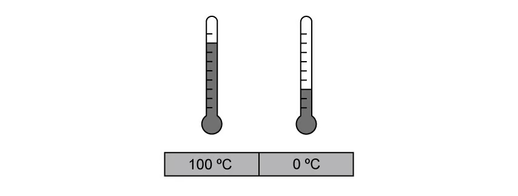{.question-figure fig-alt="Regions at 100 degrees Celsius and 0 degrees Celsius"}

`[1 mark]`

**(d)** The sentences in Table 1.2 below describe the process of thermal energy transfer from a hotter region to a lower region.

Order the sentences chronologically, by writing numbers 1-4 in the right column, to describe this process. `[4 marks]`

| Statements about thermal energy transfer | Stage |
|---|:---:|
| Two regions need to be in contact for thermal energy transfer to occur. | |
| The final temperature when two regions are in thermal equilibrium depends on the initial temperature difference between them. | |
| Thermal energy is transferred from the hot region to the cold region. | |
| The hotter region will cool down and the cooler region will heat up until they reach the same temperature. | |

Show mark scheme / model answer

**(a)**

- `possessed`; `[1]`
- `temperature`; `[1]`
- `higher`; `[1]`
- `lower`. `[1]`

**(b)**

- Tick the conservation-of-energy statement. `[1]`
- Tick the conduction, convection or radiation statement. `[1]`

**(c)**

- Draw the arrow from the $100\ ^\circ\mathrm{C}$ region towards the $0\ ^\circ\mathrm{C}$ region. `[1]`

**(d)**

- Two regions need to be in contact: **1**. `[1]`
- Thermal energy is transferred from hot to cold: **2**. `[1]`
- The hotter region cools and the cooler region heats until their temperatures are equal: **3**. `[1]`
- The final equilibrium temperature depends on the initial temperature difference: **4**. `[1]`

:::

::: {.question-card}
### Example 2 · Thermometric properties and a thermistor · 14.1 SQ Easy Q2

**(a)** There are several properties that can be used to measure temperature.

Identify, by placing ticks ($\checkmark$) in Table 1.1, next to the properties that can be used to measure temperature. `[4 marks]`

| Property | Tick |
|---|:---:|
| The colour of an object | |
| The density of a liquid | |
| The resistance of a metal | |
| The change in position of a solid | |
| The volume of a gas at constant pressure | |
| The e.m.f. of a thermocouple | |

**(b)** The density of a liquid can be used to measure the temperature of a fluid.

Use the words in the box below to complete the sentences.

`density` &nbsp; `volume` &nbsp; `expands` &nbsp; `contracts` &nbsp; `measured` &nbsp; `counted` &nbsp; `length` &nbsp; `colour`

A liquid-in-glass thermometer depends on the __________ change of a liquid. It consists of a thin glass capillary tube containing a liquid that __________ with temperature. A scale along the side of the tube allows the temperature to be __________ based on the __________ of liquid within the tube. `[4 marks]`

**(c)** Temperature can be measured by observing the volume of a gas at a constant pressure.

State the correct relationship for Charles' law that shows this. `[1 mark]`

**(d)** The resistance of a metal in a device such as a thermistor can be used to measure temperature.

Sketch on Fig. 1.1 the correct shape of the resistance-temperature graph for a thermistor.

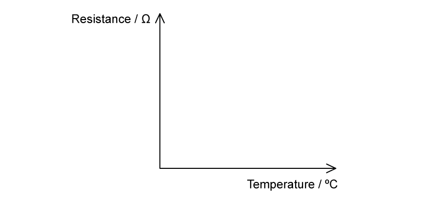{.question-figure fig-alt="Blank axes of resistance against temperature"}

`[2 marks]`

Show mark scheme / model answer

**(a)**

- Tick density of a liquid. `[1]`
- Tick resistance of a metal. `[1]`
- Tick volume of a gas at constant pressure. `[1]`
- Tick e.m.f. of a thermocouple. `[1]`

**(b)**

- `density`; `[1]`
- `expands`; `[1]`
- `measured`; `[1]`
- `length`. `[1]`

**(c)**

- At constant pressure, $V\propto T$, where $T$ is thermodynamic temperature. `[1]`

**(d)**

- Draw a non-linear decreasing curve. `[1]`
- Show high resistance at low temperature and low resistance at high temperature. `[1]`

:::

### 14.1 Measuring Temperature - Medium

::: {.question-card}
### Example 3 · Thermal equilibrium and thermodynamic temperature · 14.1 SQ Medium Q1

A metal plate is heated for a few minutes until it reaches thermal equilibrium.

**(a)** State and explain what is meant by thermal equilibrium in this context. `[2 marks]`

**(b)** The temperature of the metal plate rises from $25\ ^\circ\mathrm{C}$ to $450\ ^\circ\mathrm{C}$.

On the thermodynamic scale of temperature, calculate:

**(i)** the temperature of $450\ ^\circ\mathrm{C}$; `[2 marks]`

**(ii)** the temperature rise of the block. `[1 mark]`

**(c)** Describe, in terms of particles, the transfer of energy as the metal plate reaches thermal equilibrium. `[2 marks]`

**(d)** A student states, incorrectly, that temperature measures the amount of thermal energy (heat) in a body.

State and explain two observations that show why this statement is incorrect. `[4 marks]`

Show mark scheme / model answer

**(a)**

- The temperature of the metal plate is the same at all points. `[1]`
- There is no net transfer of energy within the plate. `[1]`

**(b)**

- **(i)** $T=\theta+273=450+273=723\ \mathrm{K}$. `[2]`
- **(ii)** Temperature rise $=450-25=425\ \mathrm{K}$. `[1]`

**(c)** Any two:

- Particles vibrate more strongly in the hotter region and less strongly in the cooler region. `[1]`
- Vibrations are passed through the lattice to neighbouring particles. `[1]`
- Mobile electrons transfer energy through the metal. `[1]`
- Energy moves from higher to lower temperature until it is distributed evenly. `[1]`

**(d)** Any two explained observations:

- Two bodies with different masses can have the same temperature but contain different amounts of thermal energy. `[2]`
- Temperature indicates the direction of energy transfer, from higher to lower temperature, rather than the amount transferred. `[2]`
- During melting or boiling, energy is supplied but temperature does not change. `[2]`

:::

::: {.question-card}
### Example 4 · Comparing temperature instruments · 14.1 SQ Medium Q3

**(a)**

**(i)** Suggest two instruments that can be used to measure the temperature of a water bath. `[2 marks]`

**(ii)** State two reasons why they may record different temperatures. `[2 marks]`

**(b)** The e.m.f. generated in a thermocouple thermometer may be used for the measurement of temperature.

Fig. 1.1 shows the variation with temperature $T$ of the e.m.f. $E$.

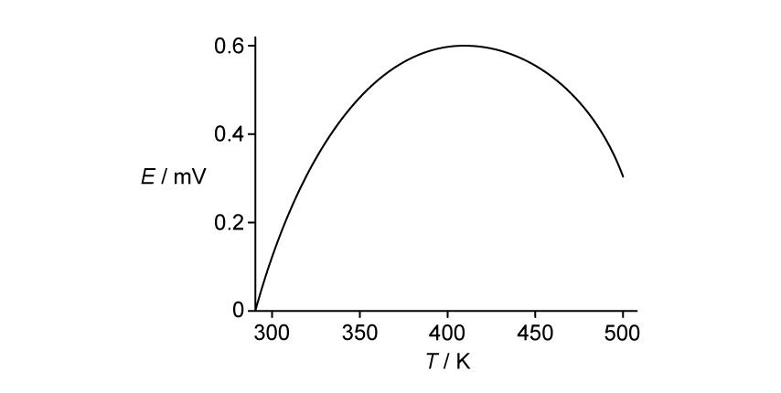{.question-figure fig-alt="Thermocouple e.m.f. against thermodynamic temperature"}

By reference to Fig. 1.1, explain why this thermocouple would not be suitable to measure temperature. `[3 marks]`

**(c)** State two advantages and two disadvantages of using a resistance thermometer over a thermocouple thermometer to measure the temperature of an object. `[4 marks]`

Show mark scheme / model answer

**(a)**

- **(i)** A resistance thermometer and a thermocouple. `[2]`
- **(ii)** They may not have been calibrated; they may not be in thermal equilibrium with the water; or their thermometric properties may not vary linearly with temperature. Award any two. `[2]`

**(b)**

- Above about $0.4\ \mathrm{mV}$, the graph is non-linear and turns over. `[1]`
- The same e.m.f. can correspond to two different temperatures. `[1]`
- The temperature is therefore not uniquely determined from the reading. `[1]`

**(c)** Any two advantages and any two disadvantages:

- Advantages: greater sensitivity; greater accuracy; suitable for measuring small temperature differences; small thermal capacity or point measurement. `[2]`
- Disadvantages: more expensive; smaller temperature range; slower response time. `[2]`

:::

### 14.1 Measuring Temperature - Hard

::: {.question-card}
### Example 5 · Selecting a sensor for steel manufacture · 14.1 SQ Hard Q1

A steel manufacturer needs to decide which temperature sensor would be the most appropriate for their manufacturing process.

Fig. 1.1 shows the process of iron and steel manufacturing.

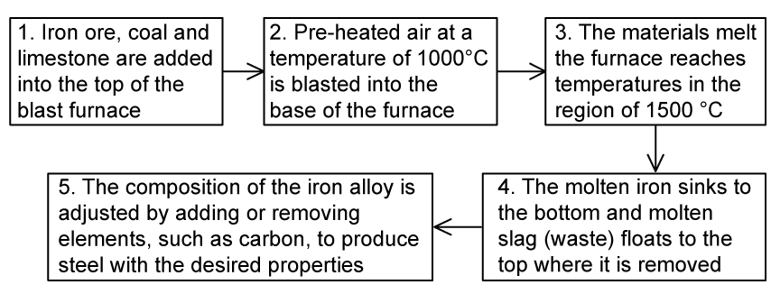{.question-figure fig-alt="Five stages of iron and steel manufacturing"}

**(a)** Using Fig. 1.1, suggest the requirements of a temperature sensor a steel manufacturer might look for. `[2 marks]`

Table 1.1 contains information about a resistance temperature detector (RTD), thermocouple and thermistor.

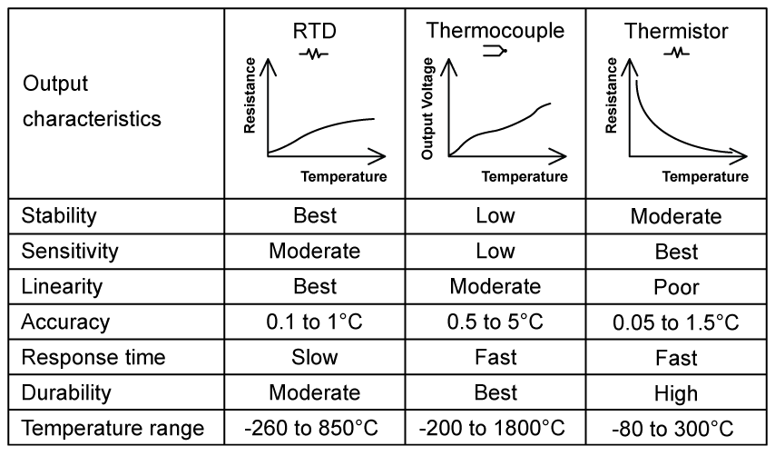{.question-figure fig-alt="Comparison table for RTD, thermocouple and thermistor"}

A thermocouple contains two junctions, a hot junction and a cold junction, sometimes referred to as a reference junction.

**(b)**

**(i)** Describe the working principle of a thermocouple to measure temperature. `[4 marks]`

**(ii)** Explain, using your knowledge of physics, the purpose of the reference junction. `[2 marks]`

**(c)** The manufacturer decides the best temperature sensor would be a thermocouple.

Using Table 1.1 and your answers to **(a)** and **(b)**, justify the use of a thermocouple in monitoring the temperature of steel throughout the manufacturing process. `[4 marks]`

**(d)** Suggest some ideal uses of a thermistor compared to a thermocouple. `[2 marks]`

Show mark scheme / model answer

**(a)** Any two:

- detect a wide range of temperatures; `[1]`
- withstand temperatures up to about $1500\ ^\circ\mathrm{C}$; `[1]`
- measure several areas of the furnace; `[1]`
- withstand a harsh or hazardous environment. `[1]`

**(b)**

- **(i)** Two dissimilar metal wires are joined to form a sensing junction; the other ends are connected to a voltmeter; a temperature difference produces an e.m.f.; the e.m.f. is converted to temperature using calibration data. `[4]`
- **(ii)** A thermocouple responds to the temperature difference between its junctions. The reference junction is held at a known temperature so the sensing-junction temperature can be determined. `[2]`

**(c)** Any four:

- Its range extends above $1500\ ^\circ\mathrm{C}$. `[1]`
- Its accuracy and sensitivity are adequate for monitoring the process. `[1]`
- Long wires permit remote measurement. `[1]`
- It has a fast response time. `[1]`
- It is the most durable or robust of the three devices. `[1]`

**(d)** Any two:

- measuring temperature in small appliances; `[1]`
- measuring temperatures below about $300\ ^\circ\mathrm{C}$; `[1]`
- measuring over a relatively narrow temperature range. `[1]`

:::

::: {.question-card}
### Example 6 · Thermistor graph and uncertainty · 14.1 SQ Hard Q3

An NTC thermistor is used to measure the temperature of water in an engine. The thermistor and multimeter are shown in Fig. 1.1.

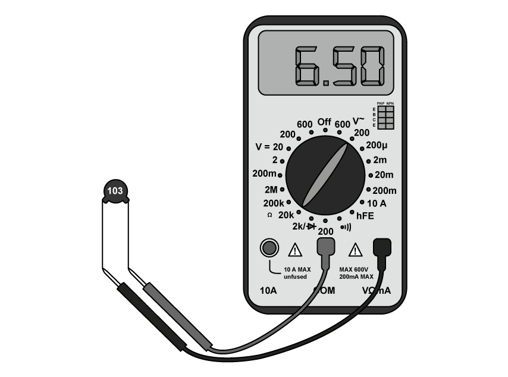{.question-figure fig-alt="NTC thermistor connected to a digital multimeter reading 6.50"}

**(a)** State the value of the resistance shown on the multimeter. Include the magnitude of the uncertainty in your answer. `[3 marks]`

**(b)** Table 1.1 shows the resistance of the thermistor for different temperatures of the water in the engine.

Using this data, plot the variation of temperature with resistance on the axes in Fig. 1.2.

Assume that the resistance of the thermistor varies linearly with temperature.

Include error bars on your graph from the uncertainty of the multimeter. `[3 marks]`

| Resistance / $\mathrm{k\Omega}$ | Temperature / $^\circ\mathrm{C}$ |
|---:|---:|
| 5.80 | 36.6 |
| 5.90 | 35.7 |
| 6.10 | 34.4 |
| 6.50 | 32.6 |

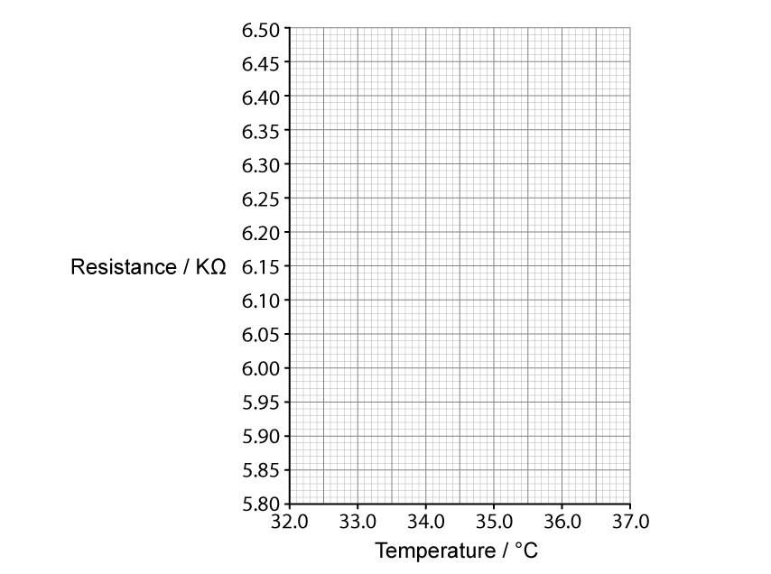{.question-figure fig-alt="Graph axes for resistance against temperature"}

**(c)** Use the graph in Fig. 1.2 to obtain the minimum possible temperature of the water at a resistance of $6.00\ \mathrm{k\Omega}$. `[2 marks]`

Show mark scheme / model answer

**(a)**

- Resistance $=6.50\ \mathrm{k\Omega}$. `[1]`
- Resolution $=0.01\ \mathrm{k\Omega}$. `[1]`
- Reading $=(6.500\pm0.005)\ \mathrm{k\Omega}$. `[1]`

**(b)**

- Plot all four points accurately. `[1]`
- Draw vertical resistance error bars of $\pm0.005\ \mathrm{k\Omega}$. `[1]`
- Draw a straight line of best fit with negative gradient. `[1]`

**(c)**

- Draw the limiting line of worst fit through the appropriate ends of the error bars. `[1]`
- Read the minimum temperature at $6.00\ \mathrm{k\Omega}$, approximately $35.1\ ^\circ\mathrm{C}$. `[1]`

:::

### 14.2 Phase Changes - Easy

::: {.question-card}
### Example 7 · Heat capacity and latent heat definitions · 14.2 SQ Easy Q1

**(a)** Specific heat capacity and latent heat capacity are described in Table 1.1.

Determine the correct definitions and equations by placing them in the correct boxes in Fig. 1.1. `[4 marks]`

- $\Delta Q=mc\Delta\theta$
- $Q=Lm$
- The thermal energy required to change the state of $1\ \mathrm{kg}$ of mass of a substance without any change of temperature.
- The amount of thermal energy required to raise the temperature of $1\ \mathrm{kg}$ of a substance by $1\ ^\circ\mathrm{C}$.

| Quantity | Equation | Definition |
|---|---|---|
| Specific Latent Heat Capacity | | |
| Specific Heat Capacity | | |

**(b)** A student is trying to explain specific heat capacity to a friend.

Identify, by placing a tick ($\checkmark$) next to the correct statements about specific heat capacity. `[2 marks]`

| Statement | Tick if correct |
|---|:---:|
| All substances have the same specific heat capacity. | |
| The heavier the material, the more thermal energy is required to raise its temperature. | |
| The larger the change in temperature, the higher the thermal energy will be required to achieve this change. | |
| Specific heat capacity is mainly used in gases. | |

**(c)** Identify, by circling the best option, the explanations that correctly describe specific latent heat capacity.

**(i)** When a substance changes state there is a **temperature change / no temperature change**. `[1 mark]`

**(ii)** There are **two / three** types of specific latent heat. `[1 mark]`

**(iii)** The specific latent heat of fusion is present during the **melting / condensing** of a substance. `[1 mark]`

**(iv)** The specific latent heat of vapourisation is present during the **freezing / boiling** of a substance. `[1 mark]`

**(d)** The student has three substances, aluminium, copper and water set up for an experiment in his laboratory where the room temperature is initially $20\ ^\circ\mathrm{C}$. $500\ \mathrm{J}$ of heat energy is applied to each substance.

The temperature of aluminium increases to $30\ ^\circ\mathrm{C}$, the temperature of the copper to $25\ ^\circ\mathrm{C}$ and the water to $100\ ^\circ\mathrm{C}$.

Write the numbers 1, 2 and 3 next to the correct substances with 1 being the lowest and 3 being the higher specific heat capacity. `[3 marks]`

Show mark scheme / model answer

**(a)**

- Specific latent heat capacity: $Q=Lm$. `[1]`
- It is the thermal energy required to change the state of $1\ \mathrm{kg}$ without a temperature change. `[1]`
- Specific heat capacity: $\Delta Q=mc\Delta\theta$. `[1]`
- It is the thermal energy required to raise the temperature of $1\ \mathrm{kg}$ by $1\ ^\circ\mathrm{C}$ or $1\ \mathrm{K}$. `[1]`

**(b)**

- Tick the statement that a heavier mass requires more thermal energy. `[1]`
- Tick the statement that a larger temperature change requires more thermal energy. `[1]`

**(c)**

- **(i)** no temperature change; `[1]`
- **(ii)** two; `[1]`
- **(iii)** melting; `[1]`
- **(iv)** boiling. `[1]`

**(d)**

- Aluminium: 2. `[1]`
- Copper: 1. `[1]`
- Water: 3. `[1]`

:::

::: {.question-card}
### Example 8 · Changes of state and heating curves · 14.2 SQ Easy Q2

**(a)** The diagram in Fig. 1.1 shows the changes of state between solids, liquids and gases.

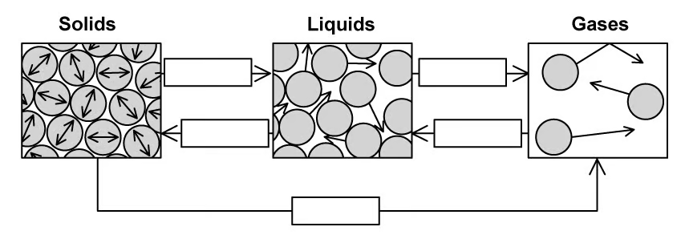{.question-figure fig-alt="Unlabelled changes of state between solids, liquids and gases"}

Complete the gaps in Fig. 1.1 with the names of these changes of state. `[5 marks]`

**(b)** Fig. 1.2 shows a graph of temperature against heat supplied for a substance as it goes through phase changes.

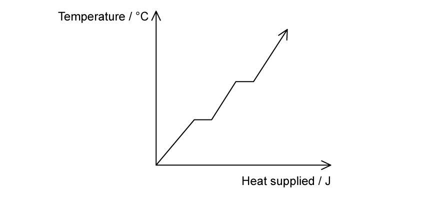{.question-figure fig-alt="Heating curve with two horizontal sections"}

Identify, by placing the letters in the correct location on the diagram, the parts of the graph that indicate:

**(i)** latent heat of fusion. Label this A. `[1 mark]`

**(ii)** latent heat of vapourisation. Label this B. `[1 mark]`

**(c)** Define the specific latent heat of vapourisation. `[2 marks]`

**(d)** Define the specific latent heat of fusion. `[2 marks]`

Show mark scheme / model answer

**(a)**

- Solid to liquid: melting. `[1]`
- Liquid to solid: freezing. `[1]`
- Liquid to gas: vaporisation or boiling. `[1]`
- Gas to liquid: condensation. `[1]`
- Solid to gas: sublimation. `[1]`

**(b)**

- Put A on the first horizontal section. `[1]`
- Put B on the second horizontal section. `[1]`

**(c)**

- The thermal energy required to convert $1\ \mathrm{kg}$ of liquid to gas `[1]`
- without a change in temperature. `[1]`

**(d)**

- The thermal energy required to convert $1\ \mathrm{kg}$ of solid to liquid `[1]`
- without a change in temperature. `[1]`

:::

### 14.2 Phase Changes - Medium

::: {.question-card}
### Example 9 · Heating water in an oven · 14.2 SQ Medium Q1

**(a)** Compare freezing and condensation. `[2 marks]`

**(b)** The effective power of an oven is $1500\ \mathrm{W}$.

The temperature of a mass of $160\ \mathrm{g}$ of water inside some food rises from $15\ ^\circ\mathrm{C}$ to $90\ ^\circ\mathrm{C}$.

Calculate the time taken to heat the food to this temperature.

Specific heat capacity of water $=4200\ \mathrm{J\,kg^{-1}\,K^{-1}}$.

Give your answer in minutes. `[3 marks]`

**(c)** A student conducts an experiment into the heating of water inside food in an oven.

They calculate the specific heat capacity of water and obtain a higher value than that given in part **(b)**.

Suggest a reason for this difference. `[1 mark]`

Show mark scheme / model answer

**(a)**

- Freezing is a change from liquid to solid at a specific temperature. `[1]`
- Condensation is a change from vapour to liquid. `[1]`

**(b)**

- $Q=mc\Delta T=(0.160)(4200)(90-15)=50\,400\ \mathrm{J}$. `[1]`
- $t=Q/P=50\,400/1500=33.6\ \mathrm{s}$. `[1]`
- $t=0.56\ \mathrm{min}$. `[1]`

**(c)**

- Some of the supplied energy heats the food, oven or surroundings rather than only the water, so attributing all the energy to the water gives an overestimate. `[1]`

:::

::: {.question-card}
### Example 10 · Latent heats from a heating curve · 14.2 SQ Medium Q3

**(a)** The energy required to boil water at $100\ ^\circ\mathrm{C}$ to steam at $100\ ^\circ\mathrm{C}$ is much greater than the energy required to melt ice at $0\ ^\circ\mathrm{C}$ to water at $0\ ^\circ\mathrm{C}$.

Explain this, in terms of the spacing of the molecules. `[1 mark]`

**(b)** A heater supplies energy at a constant rate to $64\ \mathrm{g}$ of a substance. The variation with time of the temperature of the substance is shown in Fig. 1.1. The substance is perfectly insulated from its surroundings.

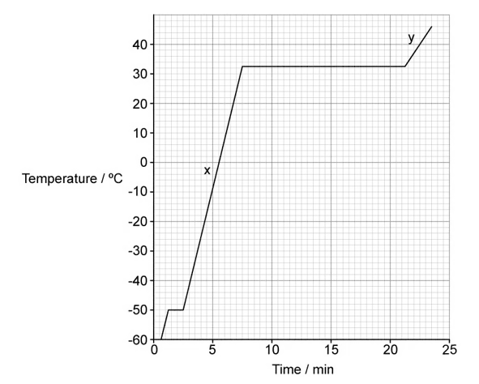{.question-figure fig-alt="Temperature-time heating curve with fusion and vaporisation plateaus"}

The power of the heater is $230\ \mathrm{W}$.

Use data from Fig. 1.1 to calculate, in $\mathrm{MJ\,kg^{-1}}$, the specific latent heat of vaporisation, $L$, of the substance. `[3 marks]`

**(c)** Calculate the ratio

$$\frac{\text{specific latent heat of vaporisation}}{\text{specific latent heat of fusion}}.$$ `[3 marks]`

**(d)** Suggest what can be deduced from the fact that section X on the graph is steeper than section Y in Fig. 1.1. `[1 mark]`

Show mark scheme / model answer

**(a)**

- Vaporisation produces a much greater increase in molecular separation than melting. `[1]`

**(b)**

- Vaporisation lasts from about $7.5$ to $21.25\ \mathrm{min}$, so $\Delta t=13.75\times60=825\ \mathrm{s}$. `[1]`
- $L=Pt/m=(230)(825)/(64\times10^{-3})$. `[1]`
- $L=2.96\times10^6\ \mathrm{J\,kg^{-1}}\approx3.0\ \mathrm{MJ\,kg^{-1}}$. `[1]`

**(c)**

- Fusion lasts about $1.25\ \mathrm{min}=75\ \mathrm{s}$. `[1]`
- $L_f=(230)(75)/(64\times10^{-3})=2.96\times10^5\ \mathrm{J\,kg^{-1}}$. `[1]`
- $L_v/L_f=10$. `[1]`

**(d)**

- The liquid at X has a lower specific heat capacity than the gas at Y. `[1]`

:::

::: {.question-card}
### Example 11 · Energy removed by an ice-making machine · 14.2 SQ Medium Q5

**(a)** Explain the meaning of the statement *the specific heat capacity of water is $4200\ \mathrm{J\,kg^{-1}\,K^{-1}}$*. `[2 marks]`

**(b)** An engineer is designing an ice-making machine. Water will enter the device at $15\ ^\circ\mathrm{C}$ and the ice cubes are to be cooled to $-6\ ^\circ\mathrm{C}$ before release.

Show that about $0.3\ \mathrm{MJ}$ of energy must be removed from $0.75\ \mathrm{kg}$ of water at $15\ ^\circ\mathrm{C}$ to change it into ice at $-6\ ^\circ\mathrm{C}$.

Specific heat capacity of water $=4.2\times10^3\ \mathrm{J\,kg^{-1}\,K^{-1}}$

Specific heat capacity of ice $=2.1\times10^3\ \mathrm{J\,kg^{-1}\,K^{-1}}$

Specific latent heat of fusion of ice $=3.3\times10^5\ \mathrm{J\,kg^{-1}}$ `[4 marks]`

**(c)** The design brief requires that $1.25\ \mathrm{kg}$ of water is frozen in $240\ \mathrm{s}$.

Calculate the rate at which energy must be removed from the machine. `[2 marks]`

**(d)** The specific latent heat of vaporisation of water is $2.3\times10^6\ \mathrm{J\,kg^{-1}}$.

Suggest why the specific latent heat of vaporisation of water is much greater than the specific latent heat of fusion of water. `[2 marks]`

Show mark scheme / model answer

**(a)**

- $4200\ \mathrm{J}$ of energy is required `[1]`
- to raise the temperature of $1\ \mathrm{kg}$ of water by $1\ \mathrm{K}$. `[1]`

**(b)**

- Cool water to $0\ ^\circ\mathrm{C}$: $Q_1=(0.75)(4.2\times10^3)(15)=47\,250\ \mathrm{J}$. `[1]`
- Freeze it: $Q_2=(0.75)(3.3\times10^5)=247\,500\ \mathrm{J}$. `[1]`
- Cool ice to $-6\ ^\circ\mathrm{C}$: $Q_3=(0.75)(2.1\times10^3)(6)=9450\ \mathrm{J}$. `[1]`
- Total $=304\,200\ \mathrm{J}\approx0.3\ \mathrm{MJ}$. `[1]`

**(c)**

- Energy for $1.25\ \mathrm{kg}=(1.25/0.75)(304\,200)=507\,000\ \mathrm{J}$. `[1]`
- Rate $=507\,000/240=2.1\times10^3\ \mathrm{W}$. `[1]`

**(d)** Any two:

- More energy is needed to separate molecules into a gas than to loosen the solid structure into a liquid. `[1]`
- Work is done against atmospheric pressure during vaporisation. `[1]`
- The increase in molecular potential energy is greater for liquid-gas separation. `[1]`

:::

### 14.2 Phase Changes - Hard

::: {.question-card}
### Example 12 · Ice spheres reaching equilibrium with water · 14.2 SQ Hard Q1

Four identical ice spheres are dropped into a thermally isolated cylinder containing water.

The specific heat capacity of the ice is $1.9\ \mathrm{kJ\,kg^{-1}\,K^{-1}}$ and the specific heat capacity of water is $5.7\ \mathrm{kJ\,kg^{-1}\,K^{-1}}$.

**(a)** Sketch a graph on Fig. 1.1 to show the changes in temperature of the molecules within the ice cubes with time, from the point they are added to the water until they are in thermal equilibrium with the water molecules.

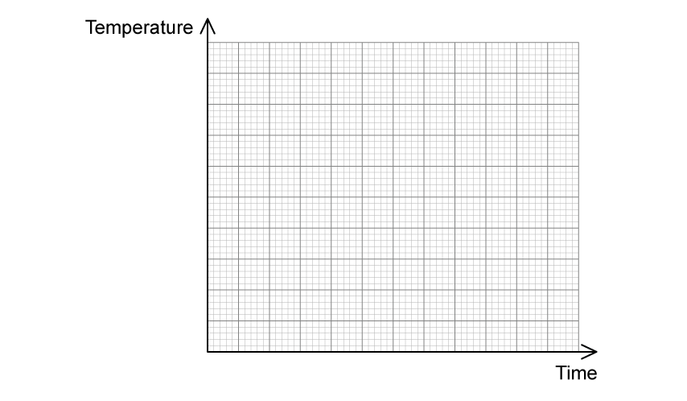{.question-figure fig-alt="Blank axes of temperature against time"}

`[4 marks]`

**(b)** The ice spheres have a radius of $20\ \mathrm{mm}$ and a density of $870\ \mathrm{kg\,m^{-3}}$. Their initial temperature is $-7.2\ ^\circ\mathrm{C}$. The specific latent heat of fusion of ice is $442\ \mathrm{kJ\,kg^{-1}}$. The water has an initial temperature of $22.2\ ^\circ\mathrm{C}$ and a mass of $0.75\ \mathrm{kg}$.

Determine the final temperature of the water. `[5 marks]`

**(c)** The experiment is repeated with four identical cubes of ice. The cubes have equal volume, mass and density to the spheres from parts **(a)** and **(b)**.

Determine through calculation whether the final temperature would be obtained quicker when using the cubes instead of the spheres. `[5 marks]`

Show mark scheme / model answer

**(a)**

- Draw a rising line from the initial sub-zero temperature to the melting point. `[1]`
- Draw a horizontal section at the melting point while the ice melts. `[1]`
- Draw a second rising line after melting. `[1]`
- Because $c_{water}=3c_{ice}$, make the final rising gradient one third of the initial gradient, ending at the equilibrium temperature. `[1]`

**(b)**

- Total volume of four spheres $=4(4\pi r^3/3)=1.34\times10^{-4}\ \mathrm{m^3}$. `[1]`
- Ice mass $=\rho V=(870)(1.34\times10^{-4})\approx0.12\ \mathrm{kg}$. `[1]`
- Energy gained by ice and resulting water:
  $Q_i=(0.12)(1.9\times10^3)(7.2)+(0.12)(442\times10^3)+(0.12)(5.7\times10^3)T_f$. `[1]`
- Energy lost by the original water:
  $Q_w=(0.75)(5.7\times10^3)(22.2-T_f)$. `[1]`
- Equating $Q_i=Q_w$ gives $T_f=8.11\ ^\circ\mathrm{C}$. `[1]`

**(c)**

- A greater surface-area-to-volume ratio produces faster thermal transfer. `[1]`
- Sphere: $A/V=4\pi r^2/(4\pi r^3/3)=150\ \mathrm{m^{-1}}$. `[1]`
- For equal volume, cube side $l=(3.35\times10^{-5})^{1/3}=0.032\ \mathrm{m}$. `[1]`
- Cube: $A/V=6l^2/l^3\approx183\ \mathrm{m^{-1}}$. `[1]`
- The cubes have the larger ratio, so equilibrium is reached more quickly with cubes. `[1]`

:::
