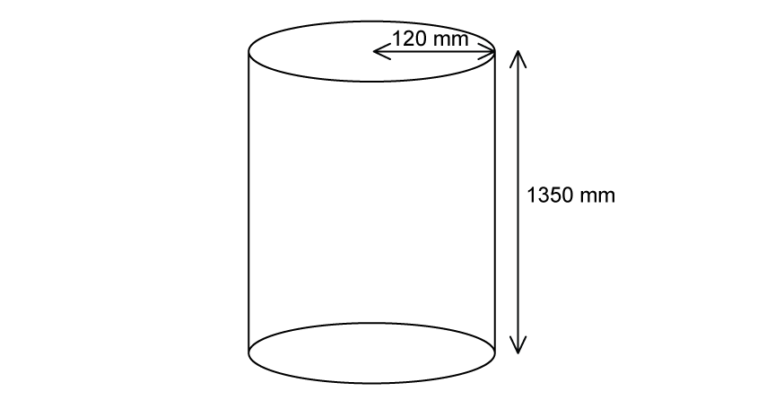
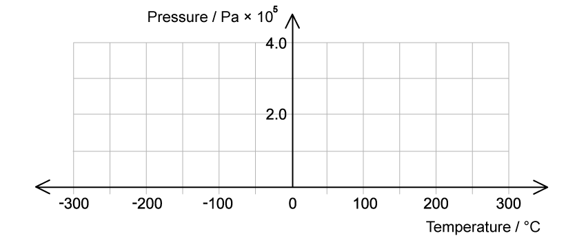
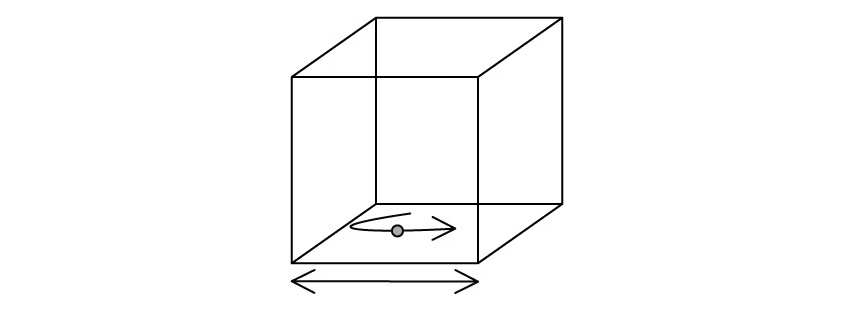
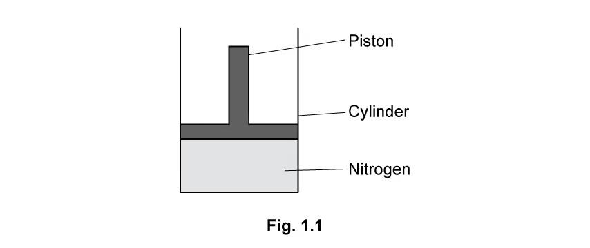
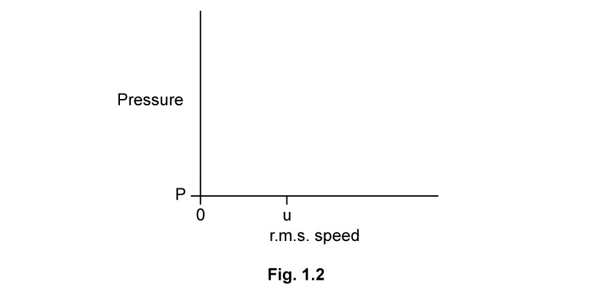
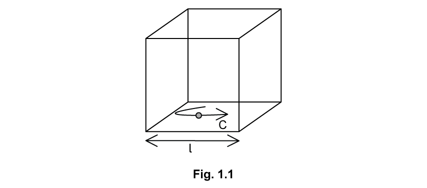
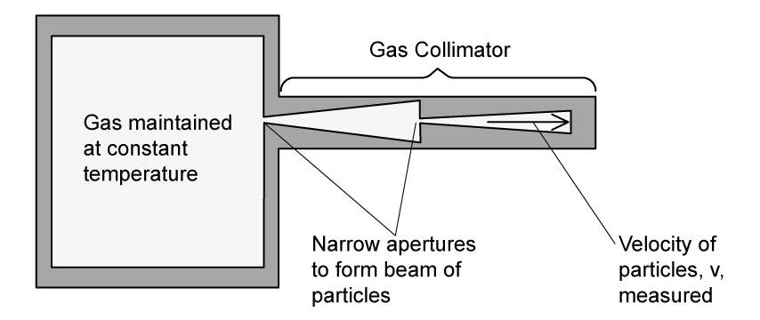

### 15.1 Ideal Gas Law - Easy

::: {.question-card}
### Example 1 · The mole and Avogadro constant · 15.1 SQ Easy Q1

**(a)** Define the mole. `[2 marks]`

**(b)** It is possible to calculate the number of moles, $n$, using the number of molecules and Avogadro's constant.

Identify by placing a tick ($\checkmark$) in the box next to the correct arrangement of this equation. `[1 mark]`

| Possible equation | Tick |
|---|:---:|
| $n=N_A/N$ | |
| $n=N/N_A$ | |
| $nN=N_A$ | |
| $n=NN_A$ | |

**(c)** Define the Avogadro constant. `[2 marks]`

**(d)** The molar mass equation is shown below:

$$n=\frac{m}{M_r}.$$

State the meaning of the quantities $m$ and $M_r$. `[2 marks]`

Show mark scheme / model answer

**(a)**

- The mole is the SI base unit of amount of substance. `[1]`
- One mole contains as many particles as there are atoms in $12\ \mathrm{g}$ of carbon-12. `[1]`

**(b)**

- Tick $n=N/N_A$. `[1]`

**(c)**

- The number of atoms in $12\ \mathrm{g}$ of carbon-12. `[1]`
- $N_A=6.02\times10^{23}\ \mathrm{mol^{-1}}$. `[1]`

**(d)**

- $m$ is the mass of the substance. `[1]`
- $M_r$ is the molar mass of the substance. `[1]`

:::
### 15.1 Ideal Gas Law - Medium

::: {.question-card}
### Example 2 · Molecular form of the gas equation and gas leakage · 15.1 SQ Medium Q1

**(a)** The ideal gas equation is written as

$$pV=nRT,$$

where $k$ is the Boltzmann constant.

Show that the ideal gas equation can also be written as

$$pV=NkT.$$ `[2 marks]`

**(b)** A cylinder for an ideal gas has a radius of $120\ \mathrm{mm}$ and a height of $1350\ \mathrm{mm}$. The gas is at a temperature of $14\ ^\circ\mathrm{C}$ and a pressure of $1.7\times10^7\ \mathrm{Pa}$.

{.question-figure fig-alt="Gas cylinder with radius 120 mm and height 1350 mm"}

Show that the amount of gas in the cylinder is $430\ \mathrm{mol}$. `[3 marks]`

**(c)** The gas leaks slowly from the cylinder at an average rate of $8.3\times10^{15}$ atoms $\mathrm{s^{-1}}$ so that, after a time of 51 days, the pressure reduces. The temperature remains constant.

Calculate the percentage of the number of moles lost from the cylinder. `[3 marks]`

Show mark scheme / model answer

**(a)**

- Use $n=N/N_A$ and $k=R/N_A$. `[1]`
- $pV=(N/N_A)RT=NkT$. `[1]`

**(b)**

- $V=\pi r^2h=\pi(0.120)^2(1.350)=0.061\ \mathrm{m^3}$. `[1]`
- $n=pV/(RT)=(1.7\times10^7)(0.061)/[8.31(287)]$. `[1]`
- $n=4.35\times10^2\ \mathrm{mol}\approx430\ \mathrm{mol}$. `[1]`

**(c)**

- Number lost $=(8.3\times10^{15})(51\times24\times3600)=3.66\times10^{22}$. `[1]`
- Moles lost $=3.66\times10^{22}/(6.02\times10^{23})\approx0.060\ \mathrm{mol}$. `[1]`
- Percentage lost $=(0.060/434.8)\times100\approx0.014\%$. `[1]`

:::

::: {.question-card}
### Example 3 · Pressure law, absolute zero and a release valve · 15.1 SQ Medium Q4

**(a)** State the pressure law of ideal gases. `[2 marks]`

**(b)** The pressure exerted by an ideal gas of $8.4\times10^{20}$ molecules in a container of volume $1.6\times10^{-5}\ \mathrm{m^3}$ is $3.2\times10^5\ \mathrm{Pa}$.

Calculate the temperature of the gas in the container in $^\circ\mathrm{C}$. `[3 marks]`

**(c)** The pressure of the gas is measured at different temperatures whilst the volume of the container and the mass of the gas remain constant.

{.question-figure fig-alt="Blank axes of gas pressure against Celsius temperature"}

Draw a graph on the grid in Fig. 1.1 to show how the pressure varies with the temperature. `[3 marks]`

**(d)** The container described in part **(b)** has a release valve that allows gas to escape when the pressure exceeds $4.0\times10^5\ \mathrm{Pa}$.

Calculate the number of gas molecules that escape when the temperature of the gas is raised to $520\ ^\circ\mathrm{C}$. `[3 marks]`

Show mark scheme / model answer

**(a)**

- For a fixed mass of gas at constant volume, pressure is directly proportional to thermodynamic temperature. `[1]`
- $p/T=\text{constant}$. `[1]`

**(b)**

- Use $pV=NkT$, so $T=pV/(Nk)$. `[1]`
- $T=(3.2\times10^5)(1.6\times10^{-5})/[(8.4\times10^{20})(1.38\times10^{-23})]\approx442\ \mathrm{K}$. `[1]`
- $\theta=442-273.15\approx167\ ^\circ\mathrm{C}$. `[1]`

**(c)**

- Draw a straight line with positive gradient. `[1]`
- Make it pass through approximately $(167\ ^\circ\mathrm{C},3.2\times10^5\ \mathrm{Pa})$. `[1]`
- Extrapolate it to zero pressure at about $-273\ ^\circ\mathrm{C}$. `[1]`

**(d)**

- At the valve pressure, $N=pV/(kT)=(4.0\times10^5)(1.6\times10^{-5})/[1.38\times10^{-23}(793.15)]$. `[1]`
- $N=5.85\times10^{20}$ molecules remain. `[1]`
- Number escaping $=8.4\times10^{20}-5.85\times10^{20}=2.55\times10^{20}$. `[1]`

:::

::: {.question-card}
### Example 4 · Moles, mass, density and tyre pressure · 15.1 SQ Medium Q5

**(a)** State two equations or laws which ideal gases obey. `[2 marks]`

**(b)** A car tyre of volume $4.2\times10^{-2}\ \mathrm{m^3}$ contains air at a pressure of $300\ \mathrm{kPa}$ and a temperature of $290\ \mathrm{K}$. The mass of one mole of air is $3.1\times10^{-2}\ \mathrm{kg}$.

Assuming that the air behaves as an ideal gas, calculate:

**(i)** the amount of moles of air; `[3 marks]`

**(ii)** the mass of the air; `[1 mark]`

**(iii)** the density of the air. `[1 mark]`

**(c)** A bicycle tyre with $0.47$ moles of air has a volume of $1.90\times10^{-3}\ \mathrm{m^3}$ when the temperature is $252\ \mathrm{K}$.

Calculate the pressure inside the bicycle tyre. `[2 marks]`

**(d)** After the bicycle has been ridden, the temperature of the air in the tyre is $301\ \mathrm{K}$.

Calculate the new pressure in the tyre assuming the volume is unchanged.

Give your answer to an appropriate number of significant figures. `[3 marks]`

Show mark scheme / model answer

**(a)** Any two:

- $pV=nRT$; `[1]`
- $pV=NkT$; `[1]`
- Boyle's law, Charles's law or the pressure law stated with the correct fixed condition. `[1]`

**(b)**

- **(i)** $n=pV/(RT)=(300\times10^3)(4.2\times10^{-2})/[8.31(290)]=5.23\ \mathrm{mol}$. `[3]`
- **(ii)** $m=nM=(5.23)(3.1\times10^{-2})=0.162\ \mathrm{kg}$. `[1]`
- **(iii)** $\rho=m/V=0.162/(4.2\times10^{-2})=3.86\ \mathrm{kg\,m^{-3}}$. `[1]`

**(c)**

- $p=nRT/V$. `[1]`
- $p=(0.47)(8.31)(252)/(1.90\times10^{-3})=5.18\times10^5\ \mathrm{Pa}$. `[1]`

**(d)**

- At constant volume, $p_1/T_1=p_2/T_2$. `[1]`
- $p_2=(5.18\times10^5)(301/252)$. `[1]`
- $p_2=6.2\times10^5\ \mathrm{Pa}$ to two significant figures. `[1]`

:::

### 15.2 Kinetic Theory - Easy

::: {.question-card}
### Example 5 · Assumptions and r.m.s. speed · 15.2 SQ Easy Q1

**(a)** The kinetic theory of gases is based upon a number of assumptions.

Place ticks ($\checkmark$) next to the correct assumptions in Table 1.1. `[5 marks]`

| Possible statement | Tick |
|---|:---:|
| The time of a collision is equal to the time between collisions. | |
| The molecules are mostly stationary but move upon collision with another molecule. | |
| Molecules of gas behave as identical, hard, perfectly elastic spheres. | |
| The volume of molecules is significant compared to the volume of the container. | |
| The time of a collision is negligible compared to the time between collisions. | |
| There are no forces of attraction or repulsion between the molecules. | |
| The molecules are in continuous random motion. | |
| The molecules all have mass, so are attracted towards each other. | |
| The volume of the molecules is negligible compared to the volume of the container. | |

**(b)** Draw a circle around the correct symbol for the mean square speed of molecules in an ideal gas. `[1 mark]`

**(c)** State the units for the mean square speed of the molecules in an ideal gas. `[1 mark]`

**(d)** Calculate the average root mean square speed of the particles travelling at the following velocities:

$$350,\ -356,\ 346,\ -351,\ 339\ \mathrm{m\,s^{-1}}.$$ `[3 marks]`

Show mark scheme / model answer

**(a)** Tick:

- identical, hard, perfectly elastic spheres; `[1]`
- collision time negligible compared with time between collisions; `[1]`
- no forces of attraction or repulsion; `[1]`
- continuous random motion; `[1]`
- molecular volume negligible compared with container volume. `[1]`

**(b)**

- $\langle c^2\rangle$. `[1]`

**(c)**

- $\mathrm{m^2\,s^{-2}}$. `[1]`

**(d)**

- Sum of squares $=350^2+(-356)^2+346^2+(-351)^2+339^2=607\,074$. `[1]`
- Mean square speed $=607\,074/5=121\,415\ \mathrm{m^2\,s^{-2}}$. `[1]`
- $c_{\mathrm{rms}}=\sqrt{121\,415}=348\ \mathrm{m\,s^{-1}}$. `[1]`

:::

::: {.question-card}
### Example 6 · Kinetic energy and gas pressure · 15.2 SQ Easy Q2

**(a)** State the kinetic theory of gases equation. `[2 marks]`

**(b)** A tank of volume $20\ \mathrm{m^3}$ contains $6.0$ moles of an ideal monatomic gas. The temperature of the gas is $38\ ^\circ\mathrm{C}$.

Calculate the average kinetic energy of the particles in the gas. `[4 marks]`

**(c)** The following paragraph is an explanation of the relationship between the temperature of a gas and its pressure in terms of the kinetic model of an ideal gas.

Use the words in the box below to complete the sentences in the paragraph. They can be used once, more than once or not at all.

`higher` &nbsp; `lower` &nbsp; `more` &nbsp; `kinetic energy` &nbsp; `force` &nbsp; `momentum` &nbsp; `pressure` &nbsp; `less`

1. A __________ temperature implies __________ average speed and therefore higher __________.
2. This causes an increase in the __________ transferred to the walls from __________ frequent collisions.
3. This increased __________ per collision leads to an increased __________. `[3 marks]`

**(d)** State the type of collision assumed between the molecules and the walls of the container in the kinetic theory of gases. `[1 mark]`

Show mark scheme / model answer

**(a)**

- $pV=\tfrac13Nm\langle c^2\rangle$. `[2]`

**(b)**

- Convert $T=38+273.15=311.15\ \mathrm{K}$. `[1]`
- Use $\langle E_k\rangle=\tfrac32kT$. `[1]`
- $\langle E_k\rangle=\tfrac32(1.38\times10^{-23})(311.15)$. `[1]`
- $\langle E_k\rangle=6.44\times10^{-21}\ \mathrm{J}$ per molecule. `[1]`

**(c)**

- A **higher** temperature implies **higher** average speed and therefore higher **kinetic energy**. `[1]`
- This causes an increase in **momentum** transferred to the walls from **more** frequent collisions. `[1]`
- This increased **force** per collision leads to increased **pressure**. `[1]`

**(d)**

- Perfectly elastic. `[1]`

:::

::: {.question-card}
### Example 7 · Building the kinetic-theory derivation · 15.2 SQ Easy Q3

This question is about the derivation of the kinetic theory of gases equation.

The derivation is based on a particle inside a cube, as shown in Fig. 1.1.

{.question-figure fig-alt="Particle moving inside an unlabelled cube"}

**(a)** Identify the following by adding the indicated letter to the correct arrow on the diagram:

**(i)** the length $l$ of the side of the cube; `[1 mark]`

**(ii)** the speed $c$ of the molecule. `[1 mark]`

**(b)** Step two of the derivation of the kinetic theory of gases is explained by the statements in Table 1.1.

Place ticks ($\checkmark$) next to the phrases that correctly explain step two. `[3 marks]`

| Phrase | Tick |
|---|:---:|
| $c$ is the specific heat capacity of the particles of the gas. | |
| $c$ is not the speed of light. | |
| Time between particle collisions with the container walls $=2\times\text{length of cube}/\text{speed of molecule}$. | |
| Time between particle collisions $=\text{distance}/\text{speed}$. | |
| Time to travel length of cube $=\text{length of cube}\times\text{speed of molecule}$. | |

**(c)** Step four of the derivation of the kinetic theory of gases equation is explained in the sentences below.

Identify the correct words from the box to complete the sentences. You can use each word once, more than once or not at all.

`velocity` &nbsp; `mean` &nbsp; `speed` &nbsp; `number` &nbsp; `amount` &nbsp; `area` &nbsp; `force` &nbsp; `exerted` &nbsp; `molecule`

1. Pressure is defined as the force per unit __________. This is the pressure exerted by one __________. The __________ of one wall is $l^2$.
2. The gas contains a large __________ of molecules. Each molecule has a different __________ and they all contribute to the pressure.
3. The __________ squared speed of $c^2$ is written with left and right-angled brackets $\langle c^2\rangle$. `[3 marks]`

**(d)** For the final step of the derivation of the kinetic theory of gases equation, state:

**(i)** the number of dimensions the molecules are moving in; `[1 mark]`

**(ii)** the volume of the cube in terms of its side length; `[1 mark]`

**(iii)** the equation for the density of the cube. `[1 mark]`

Show mark scheme / model answer

**(a)**

- Put $l$ on the horizontal double-headed arrow below the cube. `[1]`
- Put $c$ on the arrow showing the molecule's motion. `[1]`

**(b)** Tick:

- $c$ is not the speed of light; `[1]`
- time between wall collisions $=2l/c$; `[1]`
- time $=\text{distance}/\text{speed}$. `[1]`

**(c)**

- `area`, `molecule`, `area`; `[1]`
- `number`, `velocity`; `[1]`
- `mean`. `[1]`

**(d)**

- **(i)** three dimensions; `[1]`
- **(ii)** $V=l^3$; `[1]`
- **(iii)** $\rho=\text{mass}/\text{volume}=Nm/V$. `[1]`

:::
### 15.2 Kinetic Theory - Medium

::: {.question-card}
### Example 8 · Molecular kinetic energy and nitrogen r.m.s. speed · 15.2 SQ Medium Q2

**(a)** The kinetic theory of gases equation can be written as

$$pV=\frac13Nm\langle c^2\rangle.$$

State the meaning of each of the symbols in this equation. `[3 marks]`

**(b)** Use the equation in **(a)** to show that the average translational kinetic energy $E_k$ of a molecule of an ideal gas is given by

$$E_k=\frac32kT.$$ `[2 marks]`

**(c)** The mass of a nitrogen molecule is $4.65\times10^{-26}\ \mathrm{kg}$.

Use the equation in **(b)** to determine the root-mean-square (r.m.s.) speed $u$ of a nitrogen molecule at $20\ ^\circ\mathrm{C}$.

Assume that nitrogen behaves as an ideal gas. `[3 marks]`

**(d)** A fixed mass of nitrogen gas at initial pressure $P$ is sealed in a cylindrical container by a moveable piston at one end, as shown in Fig. 1.1.

{.question-figure fig-alt="Nitrogen sealed in a cylinder by a movable piston"}

The temperature of the gas is $20\ ^\circ\mathrm{C}$.

At all times, the gas and the container remain in thermal equilibrium with the surroundings. The piston is slowly moved out of the cylinder so that the nitrogen gas is decompressed.

On Fig. 1.2, sketch the variation of pressure with the r.m.s. speed of the nitrogen molecules as the pressure decreases.

{.question-figure fig-alt="Blank graph of pressure against r.m.s. speed with initial point P and u"}

`[2 marks]`

Show mark scheme / model answer

**(a)**

- $p$ is gas pressure and $V$ is gas volume. `[1]`
- $N$ is the number of molecules and $m$ is the mass of one molecule. `[1]`
- $\langle c^2\rangle$ is the mean-square speed of the molecules. `[1]`

**(b)**

- Equate $pV=NkT$ and $pV=\tfrac13Nm\langle c^2\rangle$. `[1]`
- Cancelling $N$ and dividing by two gives $\tfrac12m\langle c^2\rangle=\tfrac32kT$. `[1]`

**(c)**

- Convert $T=20+273=293\ \mathrm{K}$. `[1]`
- $u=\sqrt{3kT/m}=\sqrt{3(1.38\times10^{-23})(293)/(4.65\times10^{-26})}$. `[1]`
- $u=511\ \mathrm{m\,s^{-1}}$. `[1]`

**(d)**

- Draw a vertical line through $u$. `[1]`
- Start at $(u,P)$ and extend downwards as pressure decreases, because constant temperature means constant r.m.s. speed. `[1]`

:::

::: {.question-card}
### Example 9 · Moles and r.m.s. speed after heating · 15.2 SQ Medium Q3

**(a)** A fixed mass of an ideal gas is at a temperature of $24\ ^\circ\mathrm{C}$. The volume of the gas is $3.3\times10^{-3}\ \mathrm{m^3}$ and the pressure is $2.1\times10^5\ \mathrm{Pa}$.

Calculate the number $n$ of moles in the gas. `[2 marks]`

**(b)** The mass of one molecule of the gas is $30\ \mathrm{u}$.

Determine the r.m.s. speed of the gas molecules. `[3 marks]`

**(c)** The temperature of the gas is increased by $72\ ^\circ\mathrm{C}$.

Calculate the value of the ratio

$$\frac{\text{original r.m.s. speed of molecules}}{\text{new r.m.s. speed of molecules}}.$$ `[2 marks]`

Show mark scheme / model answer

**(a)**

- $T=24+273=297\ \mathrm{K}$ and $n=pV/(RT)$. `[1]`
- $n=(2.1\times10^5)(3.3\times10^{-3})/[8.31(297)]=0.28\ \mathrm{mol}$. `[1]`

**(b)**

- Molecular mass $m=30(1.66\times10^{-27})=4.98\times10^{-26}\ \mathrm{kg}$. `[1]`
- $c_{\mathrm{rms}}=\sqrt{3kT/m}$. `[1]`
- $c_{\mathrm{rms}}=497\ \mathrm{m\,s^{-1}}$. `[1]`

**(c)**

- New temperature $T_2=297+72=369\ \mathrm{K}$ and $c_{\mathrm{rms}}\propto\sqrt{T}$. `[1]`
- $c_1/c_2=\sqrt{297/369}=0.897$. `[1]`

:::

::: {.question-card}
### Example 10 · Assumptions, pressure and an r.m.s. calculation · 15.2 SQ Medium Q4

**(a)** State two assumptions of the simple kinetic model of a gas. `[2 marks]`

**(b)** Use the kinetic model of gases and Newton's laws of motion to explain how a gas exerts a pressure on the sides of its container. `[3 marks]`

**(c)** In a sample of gas at room temperature, four of the atoms have the following speeds:

$$1.42\times10^3,\quad1.51\times10^3,\quad1.56\times10^3,\quad1.54\times10^3\ \mathrm{m\,s^{-1}}.$$

For these four atoms, calculate the r.m.s. speed to three significant figures. `[4 marks]`

Show mark scheme / model answer

**(a)** Any two:

- molecules move randomly; `[1]`
- collisions are elastic; `[1]`
- there are no intermolecular forces; `[1]`
- collision time is negligible; `[1]`
- molecular volume is negligible compared with container volume; `[1]`
- the gas contains a very large number of molecules. `[1]`

**(b)** Any three:

- Molecules collide with the walls. `[1]`
- Their momentum changes, so the walls exert forces on them. `[1]`
- By Newton's third law, molecules exert equal and opposite forces on the walls. `[1]`
- The average force per unit wall area is the gas pressure. `[1]`

**(c)**

- $\langle c^2\rangle=[1420^2+1510^2+1560^2+1540^2]/4$. `[1]`
- $\langle c^2\rangle=2.275\times10^6\ \mathrm{m^2\,s^{-2}}$. `[1]`
- Take the square root. `[1]`
- $c_{\mathrm{rms}}=1.51\times10^3\ \mathrm{m\,s^{-1}}$. `[1]`

:::

::: {.question-card}
### Example 11 · Full derivation of the kinetic-theory equation · 15.2 SQ Medium Q5

A single molecule is in a cube-shaped box with sides of equal length $l$, as shown in Fig. 1.1.

{.question-figure fig-alt="Molecule moving at speed c in a cube of side l"}

The molecule has a mass $m$ and moves with a speed $c$ parallel to one side of the box. It collides at regular intervals with the ends of the box, exerting a force and contributing to the pressure of the gas.

The collisions the particle has with the container walls are elastic.

**(a)** Determine an expression for the change in momentum of the molecule as it hits a wall perpendicularly. `[1 mark]`

**(b)**

**(i)** Show that the time between collisions of the molecule on the container wall is given by

$$\text{time between collisions}=\frac{2l}{c}.$$ `[2 marks]`

**(ii)** Determine an expression for the change in momentum per second. `[2 marks]`

**(c)** Consider $N$ molecules identical to the single molecule in parts **(a)** and **(b)** in the same cube-shaped box.

Each molecule has a different velocity that contributes to the pressure.

Calculate the total pressure from the $N$ particles in the box. `[4 marks]`

**(d)** Hence, show that the kinetic theory of gases equation is

$$pV=\frac13Nm\langle c^2\rangle.$$ `[3 marks]`

Show mark scheme / model answer

**(a)**

- $\Delta p=-mc-(+mc)=-2mc$; magnitude $2mc$. `[1]`

**(b)**

- **(i)** The molecule travels from one wall to the opposite wall and back, a distance $2l$. `[1]`
- Therefore $\Delta t=2l/c$. `[1]`
- **(ii)** $\Delta p/\Delta t=(2mc)/(2l/c)=mc^2/l$. `[2]`

**(c)**

- The area of one wall is $l^2$. `[1]`
- For one molecule, $p=F/A=(mc^2/l)/l^2=mc^2/l^3$. `[1]`
- For $N$ molecules, sum their contributions. `[1]`
- $p=Nm\langle c_x^2\rangle/l^3$. `[1]`

**(d)**

- In random three-dimensional motion, $\langle c_x^2\rangle=\tfrac13\langle c^2\rangle$. `[1]`
- The cube volume is $V=l^3$. `[1]`
- Hence $p=(1/3)Nm\langle c^2\rangle/V$, so $pV=\tfrac13Nm\langle c^2\rangle$. `[1]`

:::

### 15.2 Kinetic Theory - Hard

::: {.question-card}
### Example 12 · Collisions, a gas collimator and propane · 15.2 SQ Hard Q2

**(a)** The kinetic theory of gases assumes that collisions between particles and between particles and the walls of their container are perfectly elastic.

**(i)** Describe what is meant by a perfectly elastic collision. `[1 mark]`

**(ii)** Describe the nature of the forces between the molecules. `[1 mark]`

**(iii)** Describe, with a reason, the type of speed of the molecules considered in the kinetic theory. `[2 marks]`

**(b)** A gas collimator is used to measure the average velocity of particles in a gas.

The collimator in Fig. 1.1 controls the pressure and the volume and it maintains a gas at a constant temperature.

{.question-figure fig-alt="Gas collimator with two narrow apertures producing a particle beam"}

Explain why two narrow apertures are required in the collimator to measure the velocity of the particles inside. `[3 marks]`

**(c)** A paint manufacturer is measuring the average velocity of a sample of propane particles used to make spray paint. At a temperature of $9\ ^\circ\mathrm{C}$ the propane molecules have a velocity of $399.00\ \mathrm{m\,s^{-1}}$ with an uncertainty of $0.5\%$.

Propane has a molecular mass of $44.097\ \mathrm{g\,mol^{-1}}$.

Determine whether the propane sample behaves as an ideal gas. `[6 marks]`

Show mark scheme / model answer

**(a)**

- **(i)** Kinetic energy is conserved in a perfectly elastic collision. `[1]`
- **(ii)** There are no forces of attraction or repulsion between molecules except during collision. `[1]`
- **(iii)** The average or r.m.s. speed is considered because the sample contains a very large number of molecules moving randomly. `[2]`

**(b)**

- Gas particles move continuously in random directions. `[1]`
- Two apertures select particles travelling along the direction of the beam. `[1]`
- This prevents transverse motion from introducing an error into the measured velocity. `[1]`

**(c)**

- Convert molar mass: $M=44.097\times10^{-3}\ \mathrm{kg\,mol^{-1}}$. `[1]`
- Mass of one molecule $m=M/N_A=7.33\times10^{-26}\ \mathrm{kg}$. `[1]`
- Convert temperature: $T=9+273.15=282.15\ \mathrm{K}$. `[1]`
- For an ideal gas, $c_{\mathrm{rms}}=\sqrt{3kT/m}$. `[1]`
- $c_{\mathrm{rms}}=399.20\ \mathrm{m\,s^{-1}}$, differing from the measured value by about $0.05\%$. `[1]`
- This is within the stated $0.5\%$ uncertainty, so the sample is consistent with ideal-gas behaviour. `[1]`

:::
