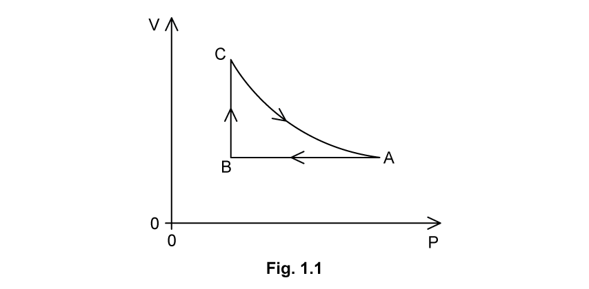
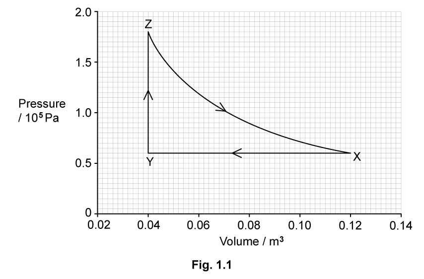

### 16.1 The First Law of Thermodynamics - Medium

::: {.question-card}
### Example 1 · Ideal-gas cycle ABCA · 16.1 SQ Medium Q1

A fixed mass of an ideal gas has a pressure $p$ and a volume $V$.

The gas undergoes a cycle of changes, A to B to C, as shown in Fig. 1.1.

{.question-figure fig-alt="Cycle ABCA on a graph of volume against pressure"}

Table 1.1 shows data for $p$, $V$ and $T$ for points A, B and C.

| Point | $p/10^5\ \mathrm{Pa}$ | $V/10^{-3}\ \mathrm{m^3}$ | $T/\mathrm{K}$ |
|:---:|---:|---:|---:|
| A | | | 680 |
| B | 1.6 | 4.4 | 451 |
| C | | | 698 |

**(a)** State the change in internal energy $\Delta U$ for one complete cycle, ABCA. `[1 mark]`

**(b)** Calculate the number of particles $N$ in the gas. `[2 marks]`

**(c)** Complete Table 1.1 by filling in the missing pressures and volumes at A, B and C. `[2 marks]`

**(d)**

**(i)** The first law of thermodynamics of a system can be represented by the equation

$$\Delta U=q+W.$$

State, with reference to the system, what is meant by $\Delta U$, $q$ and $W$. `[3 marks]`

**(ii)** Explain how the first law of thermodynamics applies to the change C to A. `[2 marks]`

Show mark scheme / model answer

**(a)**

- $\Delta U=0\ \mathrm{J}$ because the gas returns to its initial state. `[1]`

**(b)**

- At B, use $pV=NkT$, so $N=pV/(kT)$. `[1]`
- $N=(1.6\times10^5)(4.4\times10^{-3})/[(1.38\times10^{-23})(451)]=1.13\times10^{23}$. `[1]`

**(c)**

| Point | $p/10^5\ \mathrm{Pa}$ | $V/10^{-3}\ \mathrm{m^3}$ | $T/\mathrm{K}$ |
|:---:|---:|---:|---:|
| A | 2.4 | 4.4 | 680 |
| B | 1.6 | 4.4 | 451 |
| C | 1.6 | 6.8 | 698 |

- Read $V_A=V_B=4.4\times10^{-3}\ \mathrm{m^3}$ and $p_C=p_B=1.6\times10^5\ \mathrm{Pa}$ from the graph. `[1]`
- Use $pV=NkT$ or $pV\propto T$ to obtain $p_A=2.4\times10^5\ \mathrm{Pa}$ and $V_C=6.8\times10^{-3}\ \mathrm{m^3}$. `[1]`

**(d)**

- **(i)** $\Delta U$ is the increase in internal energy of the system; $q$ is energy transferred to the system by heating; $W$ is work done on the system. `[3]`
- **(ii)** From C to A, volume decreases, so positive work is done on the gas. `[1]`
- Temperature decreases, so internal energy decreases; the energy removed by cooling must exceed the work done on the gas. `[1]`

:::

::: {.question-card}
### Example 2 · A three-stage ideal-gas process · 16.1 SQ Medium Q2

**(a)** A fixed mass of an ideal gas is initially at a temperature of $20\ ^\circ\mathrm{C}$.

The gas has a volume of $0.12\ \mathrm{m^3}$ and a pressure of $0.6\times10^5\ \mathrm{Pa}$.

State what is meant by an ideal gas. `[2 marks]`

**(b)** The gas undergoes three successive changes, as shown in Fig. 1.1.

{.question-figure fig-alt="Pressure-volume cycle XYZ"}

The initial state is represented by point X. The gas is cooled at constant pressure to point X by the removal of $24.0\ \mathrm{kJ}$ of thermal energy.

The gas is then heated at constant volume to point Z.

Finally, the gas expands at constant temperature back to its original pressure and volume at point Z. During the expansion, the gas does $15.8\ \mathrm{kJ}$ of work.

Calculate the magnitude of the work done in kJ during the change XY. `[2 marks]`

> **Source-label note:** the original text prints “to point X” and “at point Z”. The diagram and the later table identify the three paths as XY, YZ and ZX.

**(c)** Complete Table 1.1 to show the work done on the gas, the thermal energy supplied to the gas and the increase in internal energy of the gas, for each of the changes XY, YZ and ZX. `[3 marks]`

| change | increase in internal energy of gas / kJ | thermal energy supplied to gas / kJ | work done on gas / kJ |
|:---:|---:|---:|---:|
| XY | | -24.0 | |
| YZ | | | |
| ZX | | | -15.8 |

Show mark scheme / model answer

**(a)**

- An ideal gas obeys $pV\propto T$. `[1]`
- Here $p$ is pressure, $V$ is volume and $T$ is thermodynamic temperature. `[1]`

**(b)**

- At constant pressure, $|W|=p|\Delta V|=(0.6\times10^5)(0.12-0.04)$. `[1]`
- $|W|=4.8\times10^3\ \mathrm{J}=4.8\ \mathrm{kJ}$. `[1]`

**(c)** The supplied PDF answer gives:

| change | $\Delta U$/kJ | $q$/kJ | $W_{\mathrm{on}}$/kJ |
|:---:|---:|---:|---:|
| XY | +24.0 | -24.0 | +48.0 |
| YZ | -24.0 | +24.0 | 0 |
| ZX | 0 | +15.8 | -15.8 |

- One mark is allocated for each completed row. `[3]`

> **Source-consistency warning:** the printed graph, the stated $0.6\times10^5\ \mathrm{Pa}$ pressure, and the supplied table are not mutually consistent. In particular, $p\Delta V$ for XY is $4.8\ \mathrm{kJ}$, not $48\ \mathrm{kJ}$, and the supplied YZ row does not satisfy $\Delta U=q+W$. The table above reproduces the PDF answer as requested; do not use this item as a reliable numerical model of the first law.

:::

::: {.question-card}
### Example 3 · Vaporising water against atmospheric pressure · 16.1 SQ Medium Q3

**(a)** Define the work done by a gas. `[2 marks]`

**(b)** A mass of water with negligible volume is vapourised into water vapour of volume $0.82\ \mathrm{m^3}$ at a temperature of $100\ ^\circ\mathrm{C}$ and atmospheric pressure $1.0\times10^5\ \mathrm{Pa}$. The thermal energy supplied to the water is $9.5\times10^5\ \mathrm{J}$.

Calculate the magnitude of the work done by the water in expanding against the atmosphere when it vapourises. `[2 marks]`

**(c)** Determine the increase in internal energy of the water when it vapourises at $100\ ^\circ\mathrm{C}$. Explain your reasoning. `[2 marks]`

**(d)** Suggest, with a reason, how the specific latent heat of vapourisation of water at a pressure greater than atmospheric pressure compares with its value at atmospheric pressure. `[3 marks]`

Show mark scheme / model answer

**(a)**

- It is the work associated with a change in gas volume at constant pressure. `[1]`
- Its magnitude is $W=p\Delta V$. `[1]`

**(b)**

- $|W|=p\Delta V=(1.0\times10^5)(0.82)$. `[1]`
- $|W|=8.2\times10^4\ \mathrm{J}$. `[1]`

**(c)**

- The vapour expands and does work, so work done **on** the water is $W=-8.2\times10^4\ \mathrm{J}$. `[1]`
- $\Delta U=q+W=9.5\times10^5-8.2\times10^4=8.68\times10^5\ \mathrm{J}$. `[1]`

**(d)** Following the supplied PDF answer:

- Greater pressure produces a higher boiling temperature. `[1]`
- More thermal energy is then required to separate the molecules and expand against the surroundings. `[1]`
- The answer therefore states that the specific latent heat of vapourisation is greater. `[1]`

> **Physical-data note:** for real water, the latent heat of vaporisation generally decreases as saturation pressure and boiling temperature rise, approaching zero at the critical point. The conclusion above records the supplied PDF answer and should not be treated as a general steam-table result.

:::

::: {.question-card}
### Example 4 · First-law sign conventions for heated water · 16.1 SQ Medium Q4

**(a)** State the first law of thermodynamics and include any relevant units. `[2 marks]`

**(b)** A fixed mass of water is in a beaker at atmospheric pressure. The initial temperature of the water is $0\ ^\circ\mathrm{C}$. The water is supplied with thermal energy $q$, so that its temperature increases to $10\ ^\circ\mathrm{C}$. There is no net change in the volume of the water.

Determine the work done and the increase in internal energy of the water by completing Table 1.1, considering the first law of thermodynamics. `[2 marks]`

| work done on water | thermal energy supplied to water | increase in internal energy of water |
|---:|---:|---:|
| | $+q$ | |

**(c)** The water from part **(b)** is now heated so its temperature increases by a further $10\ ^\circ\mathrm{C}$ to a final temperature of $20\ ^\circ\mathrm{C}$. This process causes the volume of the water to increase so that work $W$ is done.

Assume that the change in internal energy is the same as in part **(b)**.

Determine the work done, thermal energy supplied and the increase in internal energy of the water by completing Table 1.2, considering the first law of thermodynamics. `[2 marks]`

| work done on water | thermal energy supplied to water | increase in internal energy of water |
|---:|---:|---:|
| | | |

**(d)** Explain how the average specific heat capacity of the water, in parts **(b)** and **(c)**, between $10\ ^\circ\mathrm{C}$ and $20\ ^\circ\mathrm{C}$ compares with its average value between $0\ ^\circ\mathrm{C}$ and $10\ ^\circ\mathrm{C}$. `[2 marks]`

Show mark scheme / model answer

**(a)**

- $\Delta U=q+W$: increase in internal energy equals energy supplied by heating plus work done on the system. `[1]`
- All quantities are measured in joules. `[1]`

**(b)**

| work done on water | thermal energy supplied | increase in internal energy |
|---:|---:|---:|
| $0$ | $+q$ | $+q$ |

- No volume change means no work is done. `[1]`
- Hence $\Delta U=q$. `[1]`

**(c)**

| work done on water | thermal energy supplied | increase in internal energy |
|---:|---:|---:|
| $-W$ | $q+W$ | $+q$ |

- Expansion means the water does work, so work done on it is negative. `[1]`
- To produce the same $\Delta U=q$, the heating supplied must also provide the expansion work, giving $q_{\mathrm{supplied}}=q+W$. `[1]`

**(d)**

- More thermal energy is supplied for the same $10\ ^\circ\mathrm{C}$ temperature rise between $10\ ^\circ\mathrm{C}$ and $20\ ^\circ\mathrm{C}$. `[1]`
- Since $c=\Delta Q/(m\Delta T)$, the average specific heat capacity is greater over this interval. `[1]`

:::

::: {.question-card}
### Example 5 · Molecular interpretation of internal energy · 16.1 SQ Medium Q5

**(a)** Define internal energy. `[1 mark]`

**(b)** State and explain, in molecular terms, whether the internal energy of the following increases, decreases or does not change.

**(i)** A lump of copper as it is cooled. `[3 marks]`

**(ii)** Some water as it evaporates at a constant temperature. `[3 marks]`

Show mark scheme / model answer

**(a)**

- The sum of the random distribution of kinetic and potential energies within a system of molecules. `[1]`

**(b)**

- **(i)** The atoms remain in approximately the same lattice positions, so potential energy is unchanged. `[1]`
- Their vibrational kinetic energy decreases as temperature falls. `[1]`
- Therefore the internal energy decreases. `[1]`
- **(ii)** Molecular potential energy increases because molecular separation increases during evaporation. `[1]`
- Average kinetic energy remains constant because temperature is constant. `[1]`
- Therefore the internal energy increases. `[1]`

:::
