### 17.1 Simple Harmonic Motion - Easy

::: {.question-card}
### Example 1 · Definitions and the oscillating pendulum · 17.1 SQ Easy Q1

**(a)** Define an oscillation. `[2 marks]`

**(b)** Identify the correct definition by drawing lines between the properties of oscillations and their definition. `[5 marks]`

| Properties of oscillations | Definition of properties |
|---|---|
| Displacement | The rate of change of angular displacement with respect to time |
| Amplitude | The distance of an oscillator from its equilibrium position |
| Angular frequency | The time taken for one complete oscillation |
| Frequency | The maximum displacement of an oscillator from its equilibrium position |
| Time period | The number of oscillations per unit time |

**(c)** Define simple harmonic oscillation. `[3 marks]`

**(d)** Use the words in the box below to correctly label the diagram of an oscillating pendulum in Fig. 1.1. `[4 marks]`

`displacement of mass` · `mass` · `acceleration` · `restoring force` · `equilibrium position`

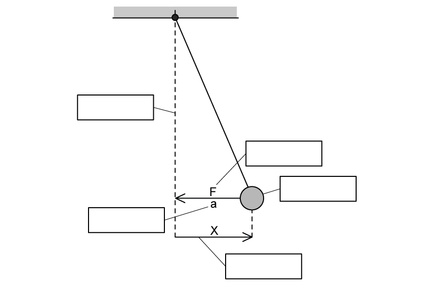{.question-figure fig-alt="Unlabelled pendulum showing displacement, acceleration and restoring force"}

Show mark scheme / model answer

**(a)**

- Repeated back-and-forth movements `[1]`
- on either side of an equilibrium position. `[1]`

**(b)**

| Property | Correct definition |
|---|---|
| Displacement | The distance of an oscillator from its equilibrium position |
| Amplitude | The maximum displacement of an oscillator from its equilibrium position |
| Angular frequency | The rate of change of angular displacement with respect to time |
| Frequency | The number of oscillations per unit time |
| Time period | The time taken for one complete oscillation |

- One mark for each correct match. `[5]`

**(c)**

- A type of oscillation in which the acceleration of a body `[1]`
- is proportional to its displacement `[1]`
- but acts in the opposite direction. `[1]`

**(d)**

- **Equilibrium position:** the central vertical dashed line.
- **Mass:** the pendulum bob.
- **Restoring force:** the arrow labelled $F$ directed towards equilibrium.
- **Acceleration:** the arrow labelled $a$ directed towards equilibrium.
- **Displacement of mass:** the horizontal distance labelled $x$ from equilibrium to the bob. `[4 marks in the supplied PDF]`

:::

::: {.question-card}
### Example 2 · Equations and graphs of SHM · 17.1 SQ Easy Q2

**(a)** Identify by drawing a circle around the equation that defines simple harmonic motion and its two solutions. `[3 marks]`

|  |  |  |
|---:|---:|---:|
| $v=f\lambda$ | $\omega=\dfrac{2\pi}{T}$ | $x=x_0\sin(\omega t)$ |
| $x=x_0\cos(\omega t)$ | $a=-\omega^2x$ | $f=\dfrac{1}{T}$ |

**(b)** The graph in Fig. 1.1 shows that the acceleration of an object is directly proportional to the negative displacement.

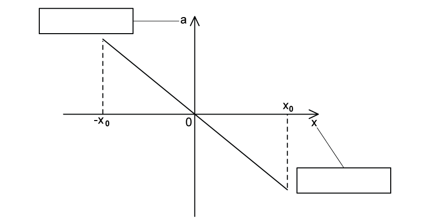{.question-figure fig-alt="Straight-line graph with negative gradient and unlabelled axes"}

Label the two axes of the graph on Fig. 1.1. `[2 marks]`

**(c)** The graphs in Fig. 1.3 show an oscillator starting at the equilibrium position and an oscillator starting at the maximum displacement.

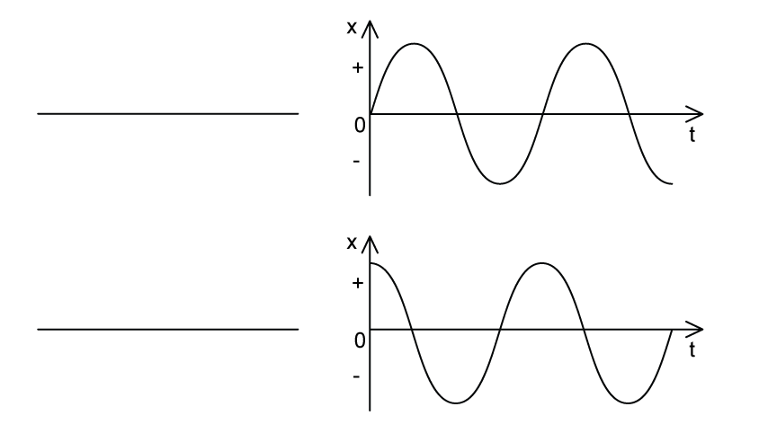{.question-figure fig-alt="Two displacement-time graphs with blank spaces for starting-position labels"}

Identify by writing next to the graphs on Fig. 1.3 the correct name of the starting position of the oscillator. `[2 marks]`

**(d)** The equation below defines how the speed of an oscillator changes with the displacement of the oscillator.

$$v=\pm\omega\sqrt{x_0^2-x^2}$$

Identify the variables in the equation by stating the variable and the quantity it represents in the space below. `[4 marks]`

Show mark scheme / model answer

**(a)** Circle:

- $a=-\omega^2x$ — the defining equation. `[1]`
- $x=x_0\sin(\omega t)$. `[1]`
- $x=x_0\cos(\omega t)$. `[1]`

**(b)**

- Horizontal axis: displacement. `[1]`
- Vertical axis: acceleration. `[1]`

**(c)**

- Top graph: starting at the equilibrium position. `[1]`
- Bottom graph: starting at the maximum displacement. `[1]`

**(d)**

- $v$: speed of the oscillator. `[1]`
- $\omega$: angular frequency of oscillation. `[1]`
- $x_0$: amplitude of oscillation. `[1]`
- $x$: displacement of the oscillator. `[1]`

:::

::: {.question-card}
### Example 3 · SHM graph relationships and energy · 17.1 SQ Easy Q3

**(a)** Complete the gaps, using the words from the box, in the sentences that describe the relationship between the simple harmonic motion graphs. `[5 marks]`

`cosine` · `sine` · `identical` · `motion` · `displacement` · $45^\circ$ · $90^\circ$ · `velocity`

The displacement-time graph is a curve identical to a __________ graph when the oscillator starts from its equilibrium position.

Velocity is the rate of change of __________.

The velocity-time graph is __________ out of phase with the displacement-time graph.

Acceleration is the rate of change of __________.

The acceleration-time graph is __________ to the displacement graph except reflected on the $x$-axis.

**(b)** State the equation for the total energy of a simple harmonic system. `[1 mark]`

**(c)** Fig. 1.1 shows the graph of potential, kinetic and total energy of a simple harmonic system for half a period of simple harmonic oscillation.

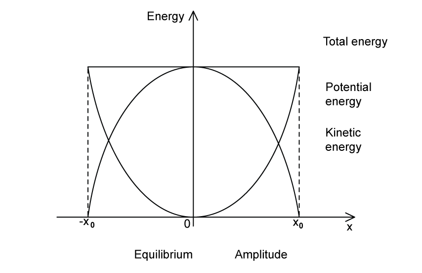{.question-figure fig-alt="Unmatched labels beside total, potential and kinetic energy curves against displacement"}

Match the labels to the correct place on the graph by drawing a line between them. `[5 marks]`

**(d)** Identify, by placing a tick ($\checkmark$) next to, the correct statements about the key features of the displacement-time graph. `[2 marks]`

| Possible statements about the displacement-time graphs | Tick if correct |
|---|:---:|
| The amplitude of oscillations $x_0$ can be found from the maximum value of $x$. | |
| If the oscillations start at the positive or negative amplitude, the displacement will be at its minimum. | |
| The time period of oscillations $T$ can be found from reading the time taken for one full cycle. | |
| The graph always starts at 0. | |

Show mark scheme / model answer

**(a)**

- sine `[1]`
- displacement `[1]`
- $90^\circ$ `[1]`
- velocity `[1]`
- identical `[1]`

**(b)**

- $E=\dfrac12m\omega^2x_0^2$. `[1]`

**(c)**

- Total energy: the horizontal line. `[1]`
- Potential energy: the U-shaped curve. `[1]`
- Kinetic energy: the inverted U-shaped curve. `[1]`
- Equilibrium: $x=0$. `[1]`
- Amplitude: $x=x_0$ or $x=-x_0$. `[1]`

**(d)** Tick:

- The amplitude of oscillations $x_0$ can be found from the maximum value of $x$. `[1]`
- The time period $T$ can be found from the time taken for one full cycle. `[1]`

The other statements are false: an oscillator starting at an amplitude has maximum displacement, and a displacement-time graph does not have to start at zero.

:::

### 17.1 Simple Harmonic Motion - Medium

::: {.question-card}
### Example 4 · Pendulum acceleration-displacement graph · 17.1 SQ Medium Q1

A pendulum consists of a bob (small plastic sphere) attached to the end of a piece of wire. The other end of the wire is attached to a fixed point. The bob oscillates with small oscillations about its equilibrium position, as shown in Fig. 1.1.

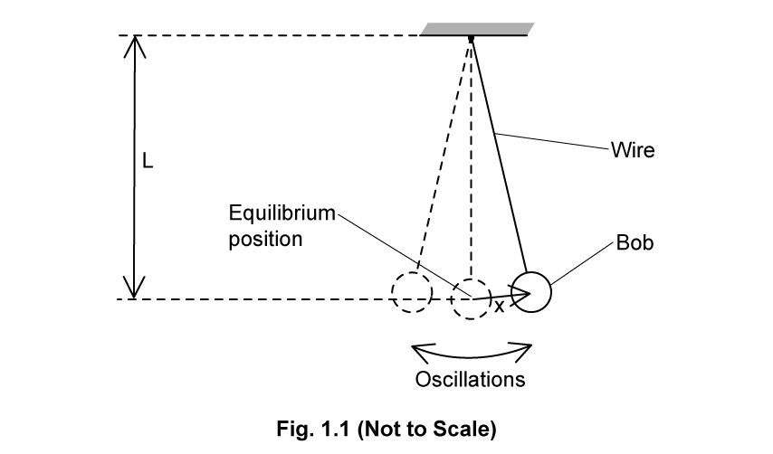{.question-figure fig-alt="Pendulum of length L oscillating about its equilibrium position"}

The length $L$ of the pendulum, measured from the fixed point to the centre of the bob, is $1.56\ \mathrm{m}$.

The acceleration $a$ of the bob varies with its displacement $x$ from the equilibrium position as shown in Fig. 1.2.

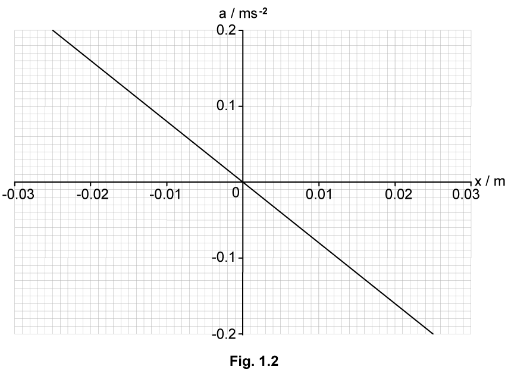{.question-figure fig-alt="Acceleration-displacement graph for the pendulum"}

**(a)** State how Fig. 1.2 shows that the motion of the pendulum is simple harmonic. `[2 marks]`

**(b)** Use Fig. 1.2 from **(a)** to calculate the angular frequency $\omega$ of the oscillations. `[2 marks]`

**(c)** The angular frequency $\omega$ is related to the length $L$ of the pendulum by

$$\omega=\sqrt{\frac{k}{L}}$$

where $k$ is a constant.

Use your answer from **(b)** to determine $k$. Give a unit for your answer. `[2 marks]`

**(d)** Whilst the pendulum is oscillating, the length of the string is decreased in such a way that the total energy of the oscillations remains constant.

Suggest and explain the qualitative effect of this change on the amplitude of the oscillations. `[2 marks]`

Show mark scheme / model answer

**(a)**

- The graph is a straight line through the origin, so $a$ is proportional to $x$. `[1]`
- Its gradient is negative, so acceleration acts in the opposite direction to displacement. `[1]`

**(b)**

- Using $(0,0)$ and $(0.025,-0.20)$, the gradient is $-0.20/0.025=-8.0\ \mathrm{s^{-2}}$. Since gradient $=-\omega^2$, `[1]`
- $\omega=\sqrt{8.0}=2.83\ \mathrm{rad\ s^{-1}}$. `[1]`

**(c)**

- $k=\omega^2L$. `[1]`
- $k=(2.83)^2(1.56)=12.5\ \mathrm{m\ s^{-2}}$. `[1]`

**(d)**

- Decreasing $L$ causes $\omega$ to increase. `[1]`
- Since $E=\tfrac12m\omega^2x_0^2$ remains constant, the amplitude $x_0$ decreases. `[1]`

:::

::: {.question-card}
### Example 5 · Spring oscillator velocity-displacement graph · 17.1 SQ Medium Q2

**(a)** An object is suspended from a spring that is attached to a fixed point as shown in Fig. 1.1.

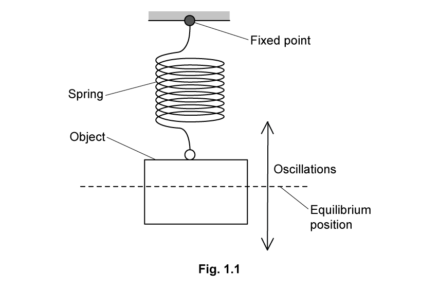{.question-figure fig-alt="Object suspended from a spring and oscillating vertically"}

The object oscillates vertically with simple harmonic motion about its equilibrium position.

State the defining equation for simple harmonic motion. Identify the meaning of each of the symbols used to represent physical quantities. `[2 marks]`

**(b)** The variation with displacement $x$ from the equilibrium position of the velocity $v$ of the object is shown in Fig. 1.2.

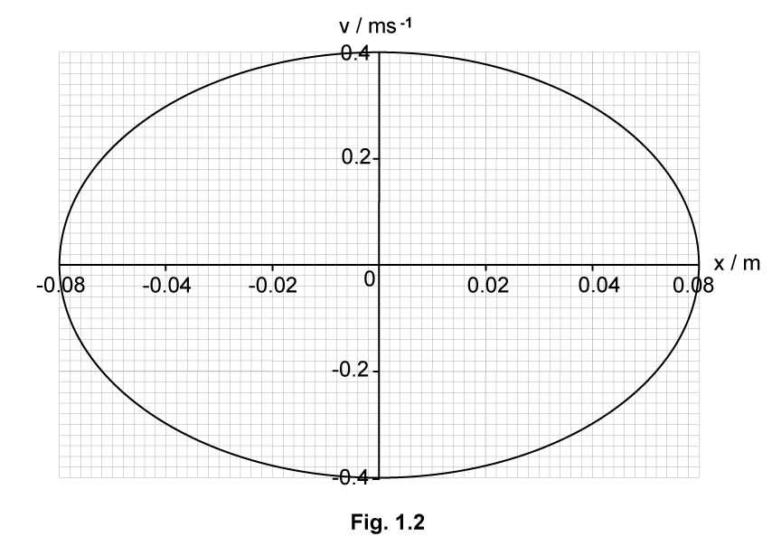{.question-figure fig-alt="Elliptical velocity-displacement graph for a spring oscillator"}

Use Fig. 1.2 to:

**(i)** determine the amplitude $x_0$ of the oscillations; `[1]`

**(ii)** determine the angular frequency $\omega$ of the oscillations. `[2]`

`[3 marks]`

**(c)** The oscillations of the object are now heavily damped.

**(i)** State what is meant by damping. `[2]`

**(ii)** Assume that the damping does not change the angular frequency of the oscillations.

On Fig. 1.2, sketch the variation with $x$ of $v$ when the amplitude of the oscillations is $0.03\ \mathrm{m}$. `[2]`

`[4 marks]`

Show mark scheme / model answer

**(a)**

- $a=-\omega^2x$ is the defining equation. `[1]`
- $a$ is acceleration, $x$ is displacement from equilibrium and $\omega$ is angular frequency. `[1]`

**(b)**

- **(i)** $x_0=0.08\ \mathrm{m}$. `[1]`
- **(ii)** The supplied PDF answer selects $(x,v)=(0.08,0)$ and $(0,0.40)$ and states $\omega=2.24\ \mathrm{rad\ s^{-1}}$. `[2]`

> **Source-consistency warning:** using the syllabus equation $v=\omega\sqrt{x_0^2-x^2}$ at $x=0$ gives $\omega=v_{\max}/x_0=0.40/0.08=5.0\ \mathrm{rad\ s^{-1}}$. The value $2.24\ \mathrm{rad\ s^{-1}}$ printed in the supplied answer is not consistent with the graph or equation.

**(c)**

- **(i)** Damping is the loss of total energy of a system `[1]` due to resistive forces. `[1]`
- **(ii)** Following the supplied answer, calculate $v_{\max}=\omega x_0=2.24(0.03)=0.0672\ \mathrm{m\ s^{-1}}$.
- Draw an open loop starting at either $x=+0.03\ \mathrm{m}$ or $x=-0.03\ \mathrm{m}$ and passing through the corresponding maximum speed. `[1]`
- For heavy damping, the object does not reach the same displacement on the other side; the path returns towards rest at equilibrium with a smaller speed. `[1]`

:::

### 17.2 Damped Oscillations - Medium

::: {.question-card}
### Example 6 · Electromagnetic damping of a spring-magnet system · 17.2 SQ Medium Q1

A bar magnet of mass $250\ \mathrm{g}$ is suspended from the free end of a spring, as illustrated in Fig. 3.1.

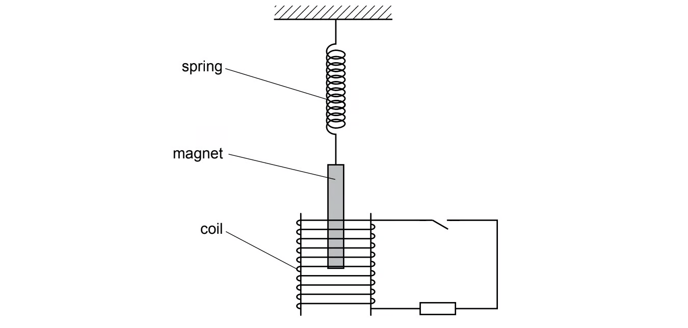{.question-figure fig-alt="Magnet suspended from a spring with one pole inside a coil circuit"}

The magnet hangs so that one pole is near the centre of a coil of wire. The coil is connected in series with a resistor and a switch. The switch is open.

The magnet is displaced vertically and then allowed to oscillate.

At time $t=0$, the magnet is oscillating freely. At time $t=6.0\ \mathrm{s}$, the switch in the circuit is closed.

The variation with time $t$ of the vertical displacement $y$ of the magnet is shown in Fig. 3.2.

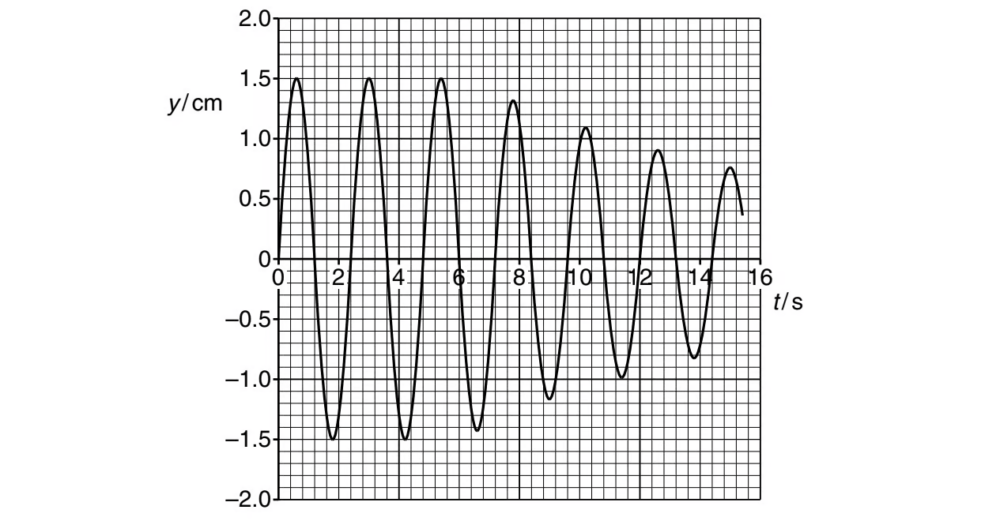{.question-figure fig-alt="Displacement-time graph of the magnet before and after the switch is closed"}

**(a)** For the oscillating magnet, use data from Fig. 3.2 to determine, to two significant figures:

**(i)** the frequency $f$; `[2]`

**(ii)** the energy of the oscillations during the time interval $t=0$ to $t=6.0\ \mathrm{s}$. `[3]`

`[5 marks]`

**(b)** When the switch is closed, the oscillations are damped.

Explain, with reference to Fig. 3.2, whether this damping is light, critical or heavy. `[1 mark]`

Show mark scheme / model answer

**(a)**

- **(i)** From the graph, $T=2.4\ \mathrm{s}$. `[1]`
- $f=1/T=1/2.4=0.42\ \mathrm{Hz}$. `[1]`
- **(ii)** Before $6.0\ \mathrm{s}$, $y_0=1.5\ \mathrm{cm}=1.5\times10^{-2}\ \mathrm{m}$.
- Use $E=\tfrac12m(2\pi f)^2y_0^2$. `[1]`
- $E=\tfrac12(250\times10^{-3})(2\pi\times0.42)^2(1.5\times10^{-2})^2$. `[1]`
- $E=1.96\times10^{-4}\ \mathrm{J}=2.0\times10^{-4}\ \mathrm{J}$ to two significant figures. `[1]`

**(b)**

- The damping is light because the magnet continues to oscillate while its amplitude gradually decreases. `[1]`

:::

::: {.question-card}
### Example 7 · Coupled pendulums, resonance and phase difference · 17.2 SQ Medium Q2

**(a)** Fig. 1.1 shows a light pendulum and a heavy pendulum, both suspended from the same piece of copper wire. This copper wire is secured at each end to fixed points.

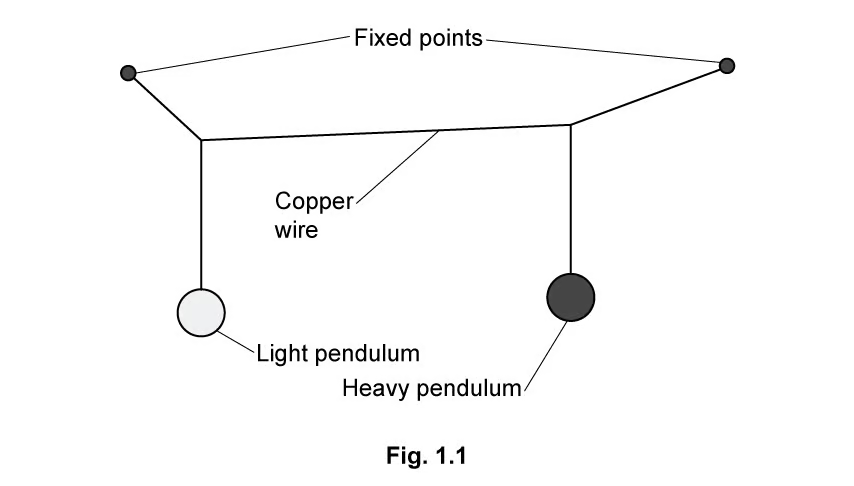{.question-figure fig-alt="Light and heavy pendulums suspended from the same copper wire"}

Both pendulums have the same natural frequency.

The heavy pendulum is set to oscillate perpendicular to the plane of the diagram. As it oscillates, it causes the light pendulum to oscillate.

State what is meant by resonance. `[2 marks]`

**(b)** Fig. 1.2 shows the variation with time $t$ of the displacements of the two pendulums for three oscillations.

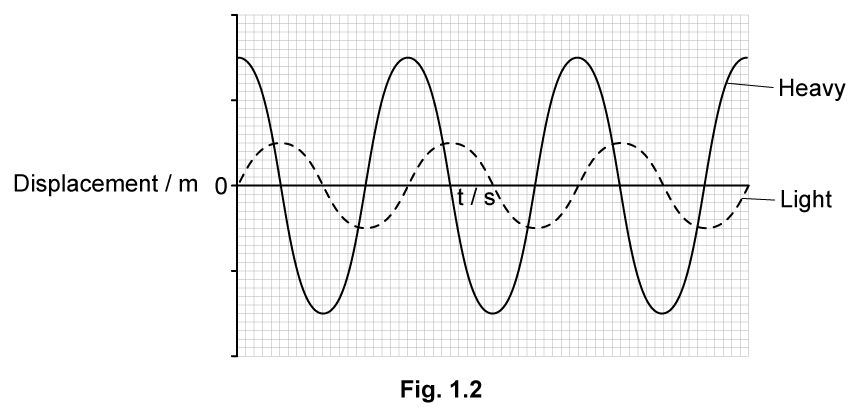{.question-figure fig-alt="Unscaled displacement-time curves for the light and heavy pendulums"}

The variation with $t$ of the displacement $x$ of the light pendulum is given by

$$x=0.5\sin(2.5\pi t)$$

where $x$ is in metres and $t$ is in seconds.

Calculate the frequency, $f$ of the oscillations. `[3 marks]`

**(c)** On Fig. 1.2, label both axes with the correct scales. Use the space below for any additional working that you need. `[2 marks]`

**(d)**

**(i)** Define phase difference, $\Phi$. `[1]`

**(ii)** Determine the magnitude of the phase difference $\Phi$ between the oscillations of the light and heavy pendulums. Give a unit with your answer. `[2]`

`[3 marks]`

Show mark scheme / model answer

**(a)**

- Resonance is oscillation of an object at maximum amplitude `[1]`
- when the driving frequency equals the natural frequency of the object. `[1]`

**(b)**

- Comparing with $x=A\sin(\omega t)$ gives $\omega=2.5\pi\ \mathrm{rad\ s^{-1}}$. `[1]`
- $T=2\pi/\omega=2\pi/(2.5\pi)=0.80\ \mathrm{s}$. `[1]`
- $f=1/T=1.25\ \mathrm{Hz}$. `[1]`

**(c)**

- Displacement scale: $0.5$, $1.0$, $1.5$, $2.0\ \mathrm{m}$. `[1]`
- Time scale: $0.4$, $0.8$, $1.2$, $1.6$, $2.0$, $2.4\ \mathrm{s}$. `[1]`

**(d)**

- **(i)** Phase difference describes how far one oscillation is in front of or behind another. `[1]`
- **(ii)** $T=0.80\ \mathrm{s}$ and the graph gives $\Delta t=0.20\ \mathrm{s}$.
- $\Phi=2\pi\Delta t/T=2\pi(0.20)/0.80=\pi/2=1.57\ \mathrm{rad}$. `[2]`

:::

::: {.question-card}
### Example 8 · Forced frequency, natural frequency and resonance · 17.2 SQ Medium Q3

**(a)** For an oscillating body, state what is meant by:

**(i)** forced frequency; `[1]`

**(ii)** natural frequency of vibration; `[1]`

**(iii)** resonance. `[2]`

`[4 marks]`

**(b)** State and explain one situation where resonance is useful. `[2 marks]`

**(c)** In some situations, resonance should be avoided.

State one such situation and suggest how the effects of resonance are reduced. `[2 marks]`

Show mark scheme / model answer

**(a)**

- **(i)** Forced frequency is the frequency at which an object is made to vibrate or oscillate. `[1]`
- **(ii)** Natural frequency is the frequency at which an object vibrates when free to do so. `[1]`
- **(iii)** Resonance is maximum-amplitude vibration `[1]` when the forced frequency equals the natural frequency. `[1]`

**(b)** One answer given in the supplied PDF is:

- A piezoelectric crystal is made to vibrate at resonance. `[1]`
- This maximises the amplitude of the ultrasound waves produced. `[1]`

Other valid examples require both the vibrating system and an explanation of why resonance is useful.

**(c)** One answer given in the supplied PDF is:

- Metal panels in a building may vibrate at resonance. `[1]`
- Strengthening struts can be placed across the panel to reduce the vibrations. `[1]`

:::
