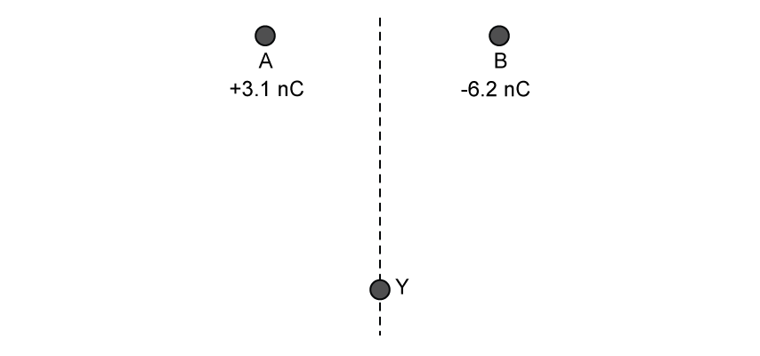
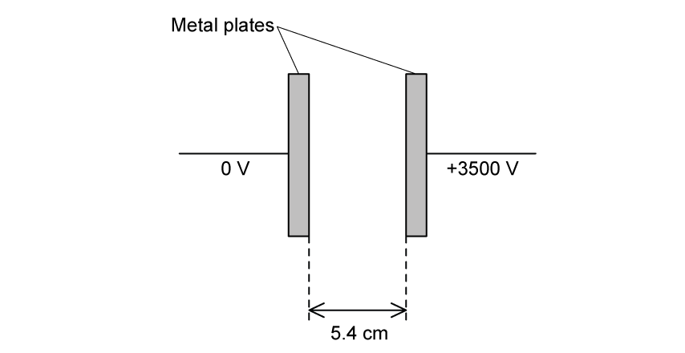
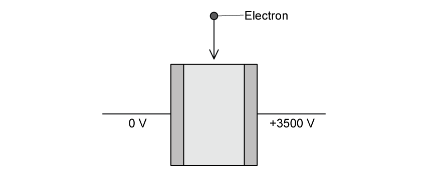
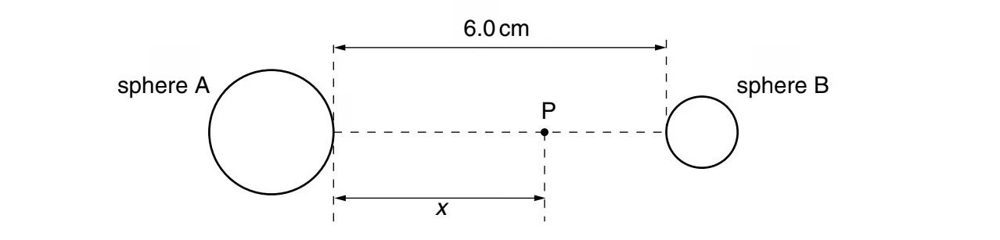
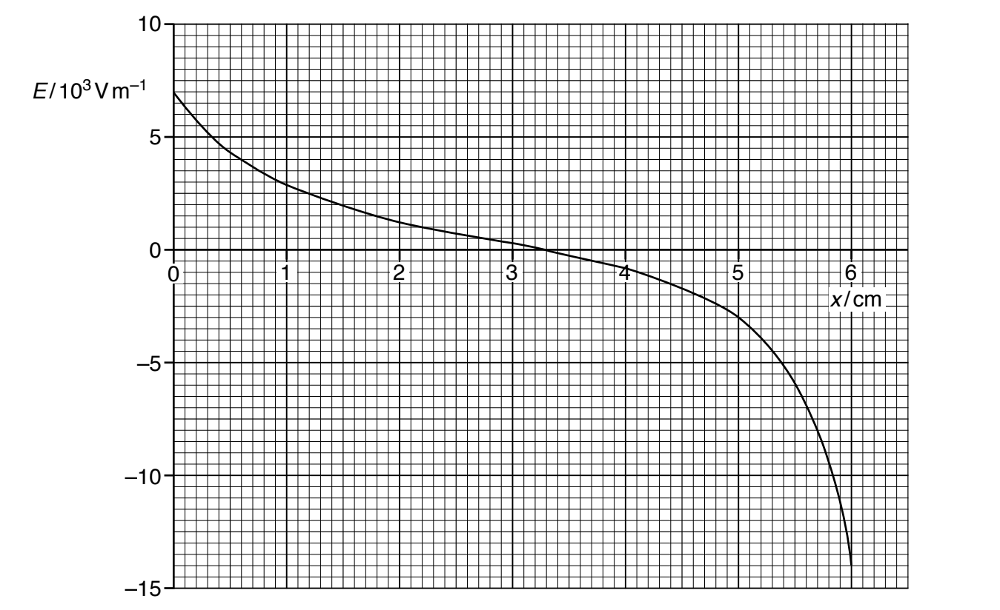
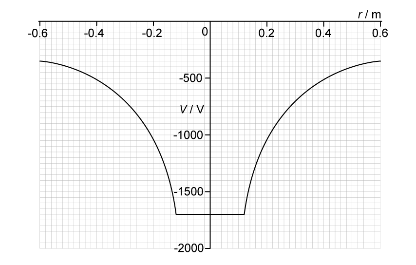
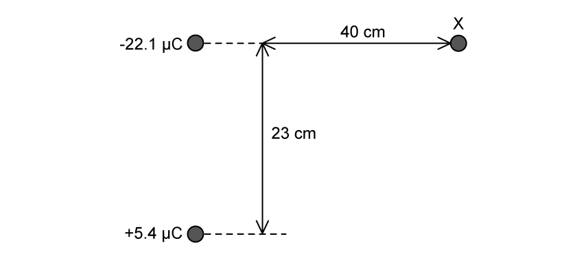
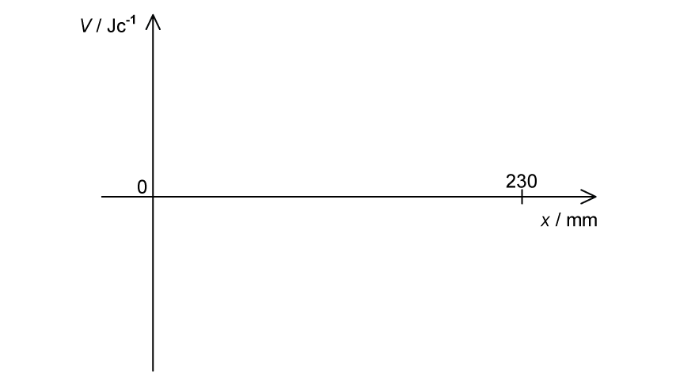

### 18.1 Electric Fields - Medium

::: {.question-card}
### Example 1 · Coulomb's law · 18.1 SQ Medium Q1

State Coulomb's law. `[2 marks]`

Show mark scheme / model answer

- The electrostatic force between two point charges `[1]`
- is proportional to the product of the charges and inversely proportional to the square of their separation. `[1]`

Equivalently,

$$F=\frac{|Q_1Q_2|}{4\pi\varepsilon_0r^2}.$$

:::
::: {.question-card}
### Example 2 · Forces between point charges · 18.1 SQ Medium Q2

**(a)** State what is represented by an electric field line. `[2 marks]`

**(b)** Two point charges A and B are placed $0.014\ \mathrm{mm}$ apart as shown in Fig. 1.1.

{.question-figure fig-alt="Positive charge A and negative charge B separated by 0.014 mm"}

The charge of A is $+3.1\ \mathrm{nC}$ and the charge of B is $-6.2\ \mathrm{nC}$. The charges have the following radii:

$$r_A=3.2\ \mathrm{pm}$$

$$r_B=4.1\ \mathrm{pm}$$

Determine the magnitude of the force between the two charges. `[3 marks]`

**(c)** The magnitude of the electric forces between the charges is very high.

State and explain why this is the case. `[2 marks]`

**(d)**

**(i)** Draw arrows on Fig. 1.1 to show the direction of the electrostatic force coming from charges A and B. `[2]`

**(ii)** Particle B is replaced by particle C. Particle C has a charge of $+6.2\ \mathrm{nC}$.

Describe how the electrostatic force between charges A and C will be different to that between A and B. `[2]`

**(iii)** A positron is placed at point Y, equidistant from both A and B, as shown in Fig. 1.2.

{.question-figure fig-alt="Positron at Y equidistant from positive A and negative B"}

On Fig. 1.2 draw an arrow representing the direction of the resultant force acting on the positron. `[1]`

`[5 marks]`

Show mark scheme / model answer

**(a)**

- The line represents the direction of the electric force `[1]`
- acting on a positive charge. `[1]`

**(b)**

- The centre-to-centre separation is

  $$r=r_A+r_B+R=(3.2\times10^{-12})+(4.1\times10^{-12})+(0.014\times10^{-3})\approx1.4\times10^{-5}\ \mathrm{m}.$$ `[1]`

- Apply Coulomb's law using charge magnitudes:

  $$F=(8.99\times10^9)\frac{(3.1\times10^{-9})(6.2\times10^{-9})}{(1.4\times10^{-5})^2}.$$ `[1]`

- $F=881.6\ \mathrm{N}\approx880\ \mathrm{N}$ to two significant figures. `[1]`

**(c)**

- The charges are very close together, so $r$ is very small. `[1]`
- Electrostatic force follows an inverse-square law, $F\propto1/r^2$. `[1]`

**(d)**

- **(i)** Draw two equal-length arrows along AB, both labelled $F$ or force. `[1]`
- The arrows point towards each other because the opposite charges attract. `[1]`
- **(ii)** A and C are both positive, so the force is repulsive. `[1]`
- The forces are directed away from the other particle rather than towards it. `[1]`
- **(iii)** Draw the resultant-force arrow diagonally upwards and to the right of Y, towards the side of B. `[1]`

:::

::: {.question-card}
### Example 3 · Parallel plates and electron deflection · 18.1 SQ Medium Q3

**(a)** State what is indicated by the direction of the electric field line. `[2 marks]`

**(b)** Fig. 1.1 shows a pair of parallel metal plates with a potential difference (p.d.) of $3500\ \mathrm{V}$ between them.

{.question-figure fig-alt="Parallel plates at 0 V and +3500 V with a labelled separation of 5.4 cm"}

The plates are separated by a distance of $4.6\ \mathrm{cm}$. The plates are in a vacuum.

On Fig. 1.1, draw five lines to represent the electric field in the region between the plates. `[3 marks]`

**(c)** Calculate the strength of the electric field between the plates. `[2 marks]`

**(d)** A moving electron eneters the region between the plates from the left, as shown in Fig. 1.2.

{.question-figure fig-alt="Electron entering vertically between plates at 0 V and +3500 V"}

The electron is deflected by the electric field.

On Fig. 1.2, draw a line to show the path of the electron as it moves through and out of the region of the electric field. `[2 marks]`

Show mark scheme / model answer

**(a)**

- The direction of a field line indicates the direction of the electrostatic force `[1]`
- on a positive charge. `[1]`

**(b)**

- Draw one straight line perpendicular to both plates, starting on one plate and finishing on the other. `[1]`
- Draw five parallel, uniformly spaced straight lines. `[1]`
- Add arrows from the $+3500\ \mathrm{V}$ plate towards the $0\ \mathrm{V}$ plate. `[1]`

**(c)** Following the supplied PDF answer:

- Use $E=\Delta V/\Delta d$. `[1]`
- $E=3500/0.054=6.48\times10^4\ \mathrm{N\ C^{-1}}\approx6.5\times10^4\ \mathrm{N\ C^{-1}}$. `[1]`

> **Source-consistency warning:** the original sentence states a separation of $4.6\ \mathrm{cm}$, but Fig. 1.1 shows $5.4\ \mathrm{cm}$ and the supplied answer uses $5.4\ \mathrm{cm}$. The result above reproduces the PDF answer. Using the sentence value would give $7.6\times10^4\ \mathrm{N\ C^{-1}}$.

**(d)**

- The electron path is straight before entering the field, curves smoothly while between the plates, and is straight again after leaving the field. `[1]`
- The curve deflects towards the positive plate on the right; the outgoing straight path is tangent to the curve at the exit. `[1]`

:::

### 18.2 Electric Potential - Medium

::: {.question-card}
### Example 4 · Electric field and potential gradient between spheres · 18.2 SQ Medium Q1

**(a)** Two charged metal spheres A and B are situated in a vacuum, as illustrated in Fig. 4.1.

{.question-figure fig-alt="Point P between two charged metal spheres separated by 6.0 cm"}

The shortest distance between the surfaces of the spheres is $6.0\ \mathrm{cm}$.

A movable point P lies along the line joining the centres of the two spheres, a distance $x$ from the surface of sphere A.

The variation with distance $x$ of the electric field $E$ at point P is shown in Fig. 4.2.

{.question-figure fig-alt="Electric field against distance between charged spheres A and B"}

**(i)** Use Fig. 4.2 to explain whether the two spheres have charges of the same, or opposite, sign. `[2]`

**(ii)** A proton is at point P where $x=5.0\ \mathrm{cm}$.

Use data from Fig. 4.2 to determine the magnitude of the acceleration of the proton. `[3]`

`[5 marks]`

**(b)** The electric potential gradient is related to the electric field.

Use data from Fig. 4.2 to state the value of $x$ at which the magnitude of the electric potential gradient is maximum. Give a reason for the value you have chosen. `[2 marks]`

Show mark scheme / model answer

**(a)**

- **(i)** The field close to A is positive while the field close to B is negative, so the fields are in opposite directions. Alternatively, there is a point between the spheres where the resultant field is zero. `[1]`
- The spheres therefore have charges of the same sign. `[1]`
- **(ii)** At $x=5.0\ \mathrm{cm}$, Fig. 4.2 gives $E=-3.0\times10^3\ \mathrm{V\ m^{-1}}$, so $|E|=3.0\times10^3\ \mathrm{V\ m^{-1}}$. `[1]`
- Combining $F=Eq$ and $F=ma$ gives $a=Eq/m$. `[1]`
- $a=(3.0\times10^3)(1.60\times10^{-19})/(1.67\times10^{-27})=2.9\times10^{11}\ \mathrm{m\ s^{-2}}$. `[1]`

**(b)**

- The magnitude of electric field strength is equal to the magnitude of the potential gradient. `[1]`
- The greatest magnitude of $E$ on Fig. 4.2 occurs at $x=6.0\ \mathrm{cm}$, so the magnitude of the potential gradient is maximum there. `[1]`

:::

::: {.question-card}
### Example 5 · Charged sphere and electric potential energy · 18.2 SQ Medium Q2

**(a)** Define electric potential at a point. `[2 marks]`

**(b)** An isolated conducting sphere is charged. Fig. 1.1 shows the variation of the potential $V$ due to the sphere with displacement $r$ from its centre.

{.question-figure fig-alt="Electric potential against displacement from the centre of a negatively charged sphere"}

Use Fig. 1.1 to determine:

**(i)** the radius of the sphere; `[1]`

**(ii)** the charge on the sphere. `[2]`

`[3 marks]`

**(c)** Two spheres are identical to the sphere in **(b)** with the same charge.

The spheres are held in a vacuum so that their centres are separated by a distance of $0.52\ \mathrm{m}$.

Assume that the charge on each sphere is a point charge at the centre of the sphere.

Calculate the electric potential energy $E_{\mathrm{P}}$ of the two spheres. `[2 marks]`

**(d)** The two spheres are now released simultaneously so that they are free to move.

Describe and explain the subsequent motion of the spheres. `[3 marks]`

Show mark scheme / model answer

**(a)**

- Electric potential is the work done per unit charge `[1]`
- in moving a positive charge from infinity to the point. `[1]`

**(b)**

- **(i)** The flat-potential region extends from $r=-0.12\ \mathrm{m}$ to $r=+0.12\ \mathrm{m}$, so the radius is $0.12\ \mathrm{m}$. `[1]`
- **(ii)** The surface potential is approximately $-1700\ \mathrm{V}$. Using $V=kQ/r$, `[1]`
- $Q=Vr/k=(-1700)(0.12)/(8.99\times10^9)=-2.27\times10^{-8}\ \mathrm{C}$. `[1]`

**(c)**

- $E_{\mathrm{P}}=kQ^2/r=(8.99\times10^9)(-2.27\times10^{-8})^2/0.52$. `[1]`
- $E_{\mathrm{P}}=8.9\times10^{-6}\ \mathrm{J}$. `[1]`

**(d)** Any three:

- The spheres have charges of the same sign, so the force is repulsive and they move apart. `[1]`
- The force acts in the direction of motion, so their speeds increase. `[1]`
- Electric potential energy is converted into kinetic energy. `[1]`
- As separation increases, the force and acceleration decrease. `[1]`
- Momentum remains zero overall; since the spheres have equal mass, their velocities are equal in magnitude and opposite in direction. `[1]`

:::

::: {.question-card}
### Example 6 · Potential due to two point charges · 18.2 SQ Medium Q3

**(a)** Two charges are separated by a distance of $23\ \mathrm{cm}$, as shown in Fig. 1.1.

{.question-figure fig-alt="Negative and positive point charges separated vertically by 23 cm, with point X 40 cm to the right"}

Calculate the distance, in mm, from the $-22.1\ \mathrm{\mu C}$ to the point between the two charges, where the resultant electric potential is zero. `[3 marks]`

**(b)** Fig. 1.2 shows the axis of an electric potential against distance graph from the $-22.1\ \mathrm{\mu C}$ charge to the $+5.4\ \mathrm{\mu C}$ charge.

{.question-figure fig-alt="Blank electric-potential axis from zero to 230 mm"}

Draw the graph on Fig. 1.2 and label any relevant points. `[4 marks]`

**(c)** Point X lies $40\ \mathrm{cm}$ to the right of the $-22.1\ \mathrm{\mu C}$ charge, as shown in Fig. 1.3.

{.question-figure fig-alt="Point X and two point charges used to calculate electric potential"}

Calculate the electric potential at point X due to the $+5.4\ \mathrm{\mu C}$. `[3 marks]`

**(d)** Calculate the total electric potential at point X. `[3 marks]`

Show mark scheme / model answer

**(a)**

- Let $x$ be the distance from the $-22.1\ \mathrm{\mu C}$ charge. Since potential is scalar,

  $$k\frac{-22.1\times10^{-6}}{x}+k\frac{5.4\times10^{-6}}{0.23-x}=0.$$ `[1]`

- Rearranging gives $(-22.1\times10^{-6})(0.23-x)=(-5.4\times10^{-6})x$. `[1]`
- $x=0.184\ \mathrm{m}=184\ \mathrm{mm}$. `[1]`

**(b)**

- Draw negative potential for $0<x<184\ \mathrm{mm}$. `[1]`
- Draw positive potential for $184<x<230\ \mathrm{mm}$. `[1]`
- Show vertical asymptotes at $x=0$ and $x=230\ \mathrm{mm}$. `[1]`
- Label the zero-potential crossing at $x=184\ \mathrm{mm}$. `[1]`

**(c)**

- The distance from the $+5.4\ \mathrm{\mu C}$ charge to X is

  $$r=\sqrt{0.40^2+0.23^2}=0.46\ \mathrm{m}.$$ `[1]`

- $V=kQ/r=(8.99\times10^9)(5.4\times10^{-6})/0.46$. `[1]`
- $V=1.06\times10^5\ \mathrm{J\ C^{-1}}$. `[1]`

**(d)**

- Potential at X due to the negative charge is

  $$V_1=(8.99\times10^9)\frac{-22.1\times10^{-6}}{0.40}=-4.97\times10^5\ \mathrm{J\ C^{-1}}.$$ `[1]`

- Add the potentials algebraically: $V_{\mathrm{total}}=V_1+V_2$. `[1]`
- $V_{\mathrm{total}}=-4.97\times10^5+1.06\times10^5=-3.91\times10^5\ \mathrm{J\ C^{-1}}$. `[1]`

:::
