### 19.1 Capacitors - Medium

::: {.question-card}
### Example 1 · Capacitor combinations and stored energy · 19.1 SQ Medium Q1

**(a)** Define the capacitance of a parallel plate capacitor. `[2 marks]`

**(b)** Two capacitors, of capacitances $C_A$ and $C_B$, are connected in parallel to a power supply of electromotive force (e.m.f.) $E$, as shown in Fig. 1.1.

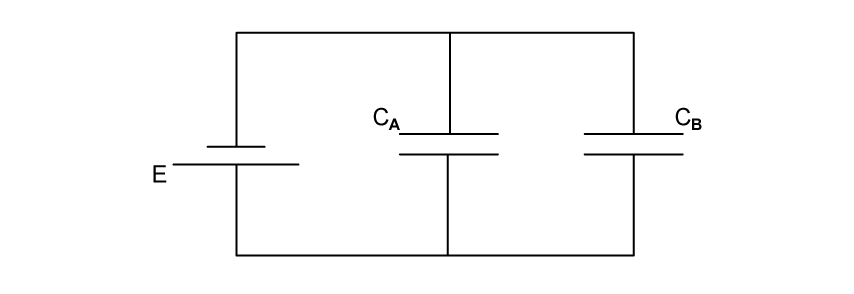{.question-figure fig-alt="Capacitors CA and CB connected in parallel across a supply E"}

Determine an expression for the combined capacitance $C_C$ of the two capacitors. `[3 marks]`

**(c)** Two capacitors of capacitances $18\ \mathrm{\mu F}$ and $51\ \mathrm{\mu F}$, and a resistor of resistance $4.5\ \mathrm{k\Omega}$, are connected into the circuit of Fig. 1.2.

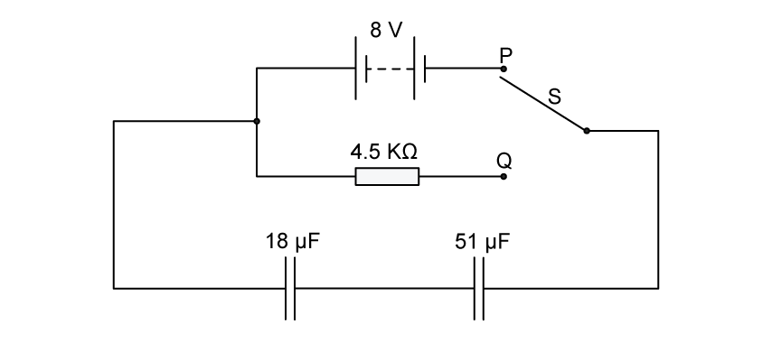{.question-figure fig-alt="Two series capacitors connected to an 8 V battery and discharge resistor by a two-way switch"}

The battery has an e.m.f. of $8\ \mathrm{V}$.

**(i)** Calculate the combined capacitance of the two capacitors. `[1]`

**(ii)** The two-way switch S is initially at position P, so that the capacitors are fully charged.

Use the information in **(c)(i)** to calculate the total energy stored in the two capacitors. `[2]`

`[3 marks]`

Show mark scheme / model answer

**(a)**

- Capacitance is charge divided by potential difference. `[1]`
- The charge is the magnitude on one plate and the potential difference is across the two plates. `[1]`

**(b)**

- Both capacitors have p.d. $E$. `[1]`
- Total charge is $Q_C=Q_A+Q_B$. `[1]`
- Hence $EC_C=EC_A+EC_B$, so $C_C=C_A+C_B$. `[1]`

**(c)**

- **(i)** For the series capacitors,

  $$\frac{1}{C}=\frac{1}{18}+\frac{1}{51},$$

  giving $C=13\ \mathrm{\mu F}$ to two significant figures. `[1]`

- **(ii)** $W=\tfrac12CV^2$. `[1]`
- $W=\tfrac12(13\times10^{-6})(8^2)=4.16\times10^{-4}\ \mathrm{J}$. `[1]`

:::

::: {.question-card}
### Example 2 · Mixed capacitor network and Q-V graph · 19.1 SQ Medium Q2

**(a)** Three capacitors, each of capacitance $27\ \mathrm{\mu F}$, are connected as shown in Fig. 1.1.

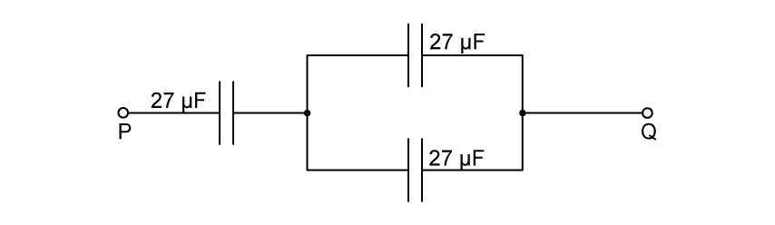{.question-figure fig-alt="One 27 microfarad capacitor in series with two parallel 27 microfarad capacitors"}

Calculate the total capacitance between points P and Q. `[2 marks]`

**(b)** The maximum safe potential difference that can be applied across any one capacitor is $4\ \mathrm{V}$.

Determine the maximum safe potential difference that can be applied between points P and Q. `[2 marks]`

**(c)** A capacitor consists of an insulator separating two metal plates, as shown in Fig. 1.3.

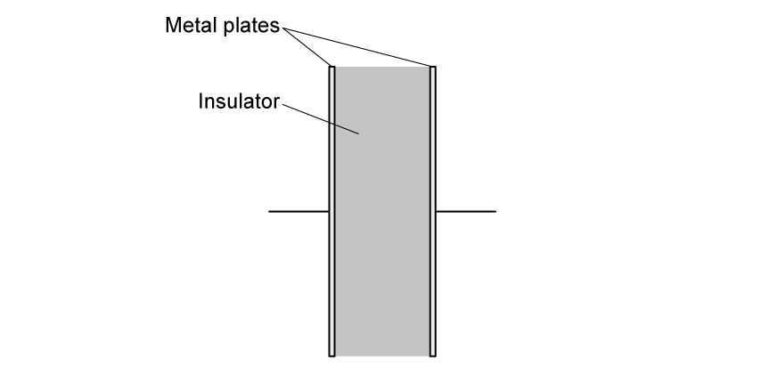{.question-figure fig-alt="Two metal capacitor plates separated by an insulator"}

The potential difference between the plates is $V$. The variation with $V$ of the magnitude of the charge $Q$ on one plate is shown in Fig. 1.4.

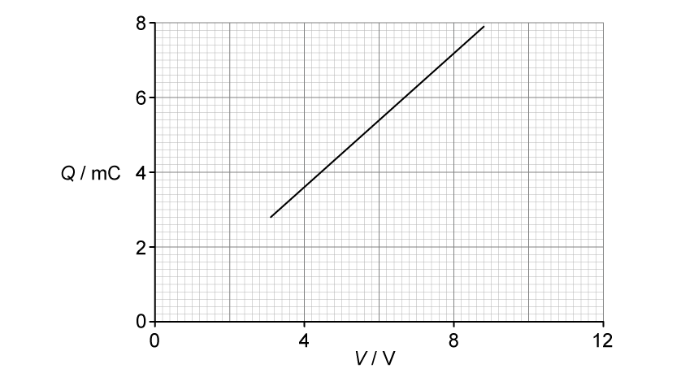{.question-figure fig-alt="Charge in millicoulombs against potential difference for a capacitor"}

Explain why the capacitor stores energy but not charge. `[3 marks]`

**(d)** Use Fig. 1.4 to determine:

**(i)** the capacitance of the capacitor; `[2]`

**(ii)** the loss in energy stored in the capacitor when the potential difference $V$ is reduced from $8\ \mathrm{V}$ to $6\ \mathrm{V}$. `[2]`

`[4 marks]`

Show mark scheme / model answer

**(a)**

- The two parallel capacitors give $C_P=27+27=54\ \mathrm{\mu F}$. `[1]`
- The $54\ \mathrm{\mu F}$ combination is in series with $27\ \mathrm{\mu F}$, so $1/C=1/54+1/27$ and $C=18\ \mathrm{\mu F}$. `[1]`

**(b)**

- At $4\ \mathrm{V}$ across the single $27\ \mathrm{\mu F}$ capacitor, $Q=CV=1.08\times10^{-4}\ \mathrm{C}$. The same charge is on the series equivalent, so the p.d. across the $54\ \mathrm{\mu F}$ parallel group is $V=Q/C=2\ \mathrm{V}$. `[1]`
- Maximum p.d. from P to Q is $4+2=6\ \mathrm{V}$. `[1]`

**(c)**

- The charges on the two plates are equal and opposite. `[1]`
- The resultant charge on the complete capacitor is therefore zero. `[1]`
- Energy is stored because the charges are separated. `[1]`

**(d)**

- **(i)** From the graph at $V=8\ \mathrm{V}$, $Q=7.2\ \mathrm{mC}$. `[1]`
- $C=Q/V=(7.2\times10^{-3})/8=9.0\times10^{-4}\ \mathrm{F}=900\ \mathrm{\mu F}$. `[1]`
- **(ii)** The supplied PDF answer identifies $Q_8=7.2\ \mathrm{mC}$ and $Q_6=5.4\ \mathrm{mC}$, then gives the energy loss as $38\ \mathrm{mJ}$. `[2]`

> **Source-consistency warning:** the area between $6\ \mathrm{V}$ and $8\ \mathrm{V}$ is a trapezium of width $2\ \mathrm{V}$, so the graph and $\Delta W=\tfrac12C(8^2-6^2)$ give $12.6\ \mathrm{mJ}$, not $38\ \mathrm{mJ}$. The PDF answer substitutes a width of $6\ \mathrm{V}$ after stating $2\ \mathrm{V}$.

:::

::: {.question-card}
### Example 3 · Functions and arrangements of capacitors · 19.1 SQ Medium Q3

**(a)** State two functions of capacitors connected in electrical circuits. `[2 marks]`

**(b)** Three capacitors are connected in parallel to a power supply as shown in Fig. 1.1.

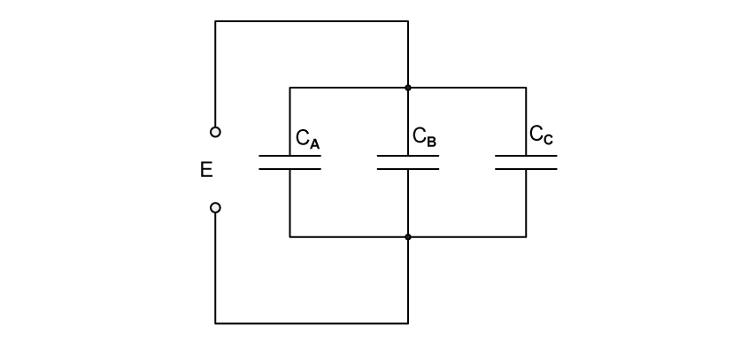{.question-figure fig-alt="Three capacitors CA, CB and CC connected in parallel across a supply E"}

The capacitors have a capacitance $C_A$, $C_B$ and $C_C$. The power supply provides a potential difference $E$.

**(i)** Explain why the charge on the positive plate of each capacitor is different. `[1]`

**(ii)** Use your answer in **(i)** to show that the combined capacitance $C_T$ of the three capacitors is given by the expression

$$C_T=C_A+C_B+C_C.$$ `[2]`

`[3 marks]`

**(c)** A student has available three capacitors, each of capacitance $24\ \mathrm{\mu F}$.

Draw circuit diagrams, one in each case, to show how the student connects the three capacitors to provide a combined capacitance of:

**(i)** $36\ \mathrm{\mu F}$; `[1]`

**(ii)** $16\ \mathrm{\mu F}$. `[1]`

`[2 marks]`

Show mark scheme / model answer

**(a)** Any two:

- storing energy; `[1]`
- smoothing rectified outputs; `[1]`
- blocking direct current; `[1]`
- use in oscillators. `[1]`

**(b)**

- **(i)** All three capacitors have p.d. $E$, but their capacitances differ, so $Q=CE$ gives a different charge for each. `[1]`
- **(ii)** Total charge is $Q_T=Q_A+Q_B+Q_C$. `[1]`
- Therefore $C_TE=C_AE+C_BE+C_CE$, giving $C_T=C_A+C_B+C_C$. `[1]`

**(c)**

- **(i)** Connect two $24\ \mathrm{\mu F}$ capacitors in series, giving $12\ \mathrm{\mu F}$, and connect this pair in parallel with the third: $12+24=36\ \mathrm{\mu F}$. `[1]`
- **(ii)** Connect two capacitors in parallel, giving $48\ \mathrm{\mu F}$, and connect this pair in series with the third: $1/C=1/48+1/24$, so $C=16\ \mathrm{\mu F}$. `[1]`

:::

### 19.2 Charging and Discharging - Medium

::: {.question-card}
### Example 4 · Rectification and capacitor smoothing · 19.2 SQ Medium Q1

**(a)** A sinusoidal alternating potential difference (p.d.) from a supply is rectified using a single diode. The variation with time $t$ of the rectified potential difference $V$ is shown in Fig. 5.1.

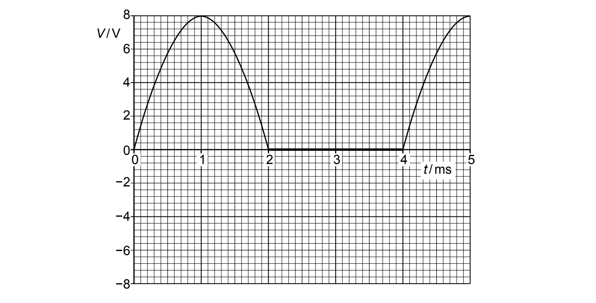{.question-figure fig-alt="Half-wave rectified potential difference against time"}

**(i)** Determine the root-mean-square (r.m.s.) value of the supply potential difference before rectification. `[2]`

**(ii)** State the type of rectification shown in Fig. 5.1. `[1]`

`[3 marks]`

**(b)** The alternating potential difference is rectified and smoothed using the circuit in Fig. 5.2.

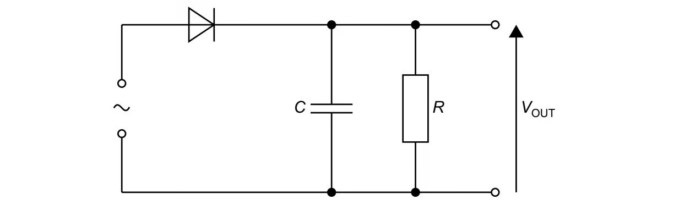{.question-figure fig-alt="Single-diode smoothing circuit with capacitor C and load resistor R"}

The capacitor has capacitance $C$ of $85\ \mathrm{\mu F}$ and the resistor has resistance $R$.

The effect of the capacitor and the resistor is to produce a smoothed output potential difference $V_{\mathrm{OUT}}$. The difference between maximum and minimum values of $V_{\mathrm{OUT}}$ is $2.0\ \mathrm{V}$.

**(i)** On Fig. 5.1, draw a line to show $V_{\mathrm{OUT}}$ between times $t=1.0\ \mathrm{ms}$ and $t=5.0\ \mathrm{ms}$. `[3]`

**(ii)** Determine the time, in s, for which the capacitor is discharging between times $t=1.0\ \mathrm{ms}$ and $t=5.0\ \mathrm{ms}$. `[1]`

**(iii)** Use your answers in **(b)(i)** and **(b)(ii)** to calculate the resistance $R$. `[2]`

`[6 marks]`

Show mark scheme / model answer

**(a)**

- **(i)** The peak potential difference is $V_0=8.0\ \mathrm{V}$. Using $V_{\mathrm{rms}}=V_0/\sqrt2$, `[1]`
- $V_{\mathrm{rms}}=8.0/\sqrt2=5.7\ \mathrm{V}$. `[1]`
- **(ii)** Half-wave rectification. `[1]`

**(b)**

- **(i)** Minimum output is $8.0-2.0=6.0\ \mathrm{V}$. `[1]`
- Draw a decreasing line from $8.0\ \mathrm{V}$ at $1.0\ \mathrm{ms}$ to $6.0\ \mathrm{V}$ where it meets the next rising input curve after $4.0\ \mathrm{ms}$. `[1]`
- Follow the printed curve from that meeting point to the peak at $5.0\ \mathrm{ms}$. `[1]`
- **(ii)** The capacitor discharges from $1.0\ \mathrm{ms}$ to about $4.5\ \mathrm{ms}$, so $t=3.5\ \mathrm{ms}=3.5\times10^{-3}\ \mathrm{s}$. `[1]`
- **(iii)** Use $V=V_0e^{-t/(RC)}$. `[1]`
- $R=-t/[C\ln(V/V_0)]=-(3.5\times10^{-3})/[(85\times10^{-6})\ln(6/8)]=1.4\times10^2\ \mathrm{\Omega}$. `[1]`

:::

::: {.question-card}
### Example 5 · Discharge time and stored energy · 19.2 SQ Medium Q2

**(a)** The variation with potential difference $V$ of the charge $Q$ on one of the plates of a capacitor is shown in Fig. 1.1.

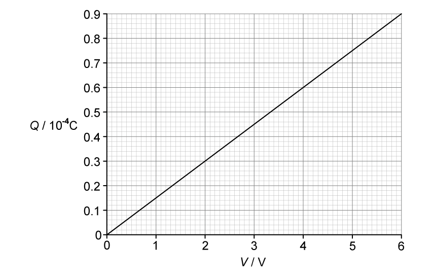{.question-figure fig-alt="Charge against potential difference from zero to 6 V"}

The capacitor is connected to a $12.0\ \mathrm{V}$ power supply and two resistors P and Q are shown in Fig. 1.2.

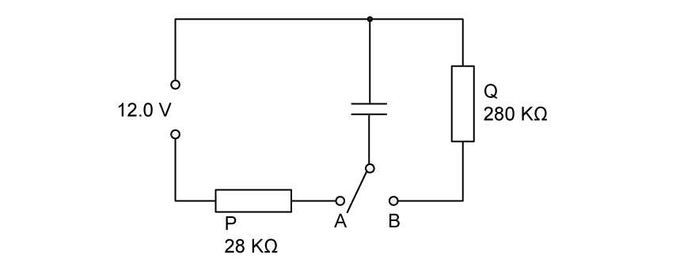{.question-figure fig-alt="Capacitor switched between a 12 V supply through 28 kiloohms and a 280 kiloohm discharge resistor"}

The resistance of P is $28\ \mathrm{k\Omega}$ and the resistance of Q is $280\ \mathrm{k\Omega}$.

The switch can be in either position A or position B.

The switch is in position A so that the capacitor is fully charged.

Calculate the energy $E$ stored in the capacitor. `[2 marks]`

**(b)** The switch is now moved to position B.

Show that the time constant of the charge circuit is $4.2\ \mathrm{s}$. `[2 marks]`

**(c)** The fully charged capacitor in **(a)** stores energy $E$.

Determine the time $t$ taken for the stored energy to decrease from $E$ to $E/4$. `[4 marks]`

Show mark scheme / model answer

**(a)** Following the supplied PDF answer:

- From Fig. 1.1, use the triangular area under the line up to $V=6\ \mathrm{V}$ and $Q=0.9\times10^{-4}\ \mathrm{C}$. `[1]`
- $E=\tfrac12QV=\tfrac12(0.9\times10^{-4})(6)=2.7\times10^{-4}\ \mathrm{J}$. `[1]`

> **Source-consistency warning:** the question states a $12.0\ \mathrm{V}$ supply while the graph and supplied answer use $6\ \mathrm{V}$. The graph gradient gives $C=15\ \mathrm{\mu F}$; extrapolating to $12.0\ \mathrm{V}$ would give $E=\tfrac12C(12.0)^2=1.08\times10^{-3}\ \mathrm{J}$.

**(b)**

- From the graph, $C=Q/V=(0.9\times10^{-4})/6=15\ \mathrm{\mu F}$. `[1]`
- $\tau=RC=(280\times10^3)(15\times10^{-6})=4.2\ \mathrm{s}$. `[1]`

**(c)**

- Since $E=\tfrac12CV^2$ and $C$ is constant, $E\propto V^2$. `[1]`
- Reducing energy to $E/4$ requires $V=V_0/2$. `[1]`
- Use $V=V_0e^{-t/(RC)}$, so $1/2=e^{-t/4.2}$. `[1]`
- $t=4.2\ln2=2.9\ \mathrm{s}$. `[1]`

:::

::: {.question-card}
### Example 6 · Capacitor discharge and electromagnetic induction · 19.2 SQ Medium Q3

**(a)** A capacitor of capacitance $520\ \mathrm{\mu F}$ is connected to a battery of electromotive force (e.m.f.) $36\ \mathrm{V}$ in the circuit of Fig. 1.1.

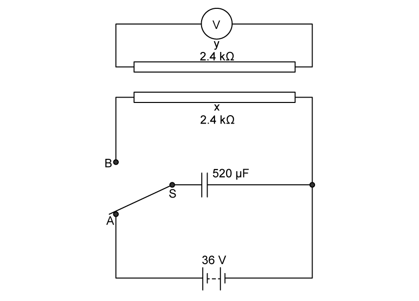{.question-figure fig-alt="Discharge circuit containing nearby parallel wires X and Y"}

The two-way switch is initially at position X.

X and Y are identical long straight wires, each with a resistance of $2.4\ \mathrm{k\Omega}$. These wires are placed near to and parallel to each other. Wire Y is connected to a voltmeter.

At time $t=0$, switch S is moved to position B so that the capacitor discharges through wire X.

**(i)** Calculate the charge $Q_0$ on the capacitor at time $t=0$. `[2]`

**(ii)** Calculate the current $I_0$ in wire P at time $t=0$. `[1]`

`[3 marks]`

> **Source-label note:** Fig. 1.1 labels switch positions A and B and wires X and Y. The original text nevertheless prints “position X” and “wire P”; these labels are retained above exactly as printed.

**(b)** Calculate the time constant $\tau$ of the discharge circuit. `[2 marks]`

**(c)**

**(i)** On Fig. 1.2, sketch a line to show the variation with $t$ of the current $I$ in wire X as the capacitor discharges. `[2]`

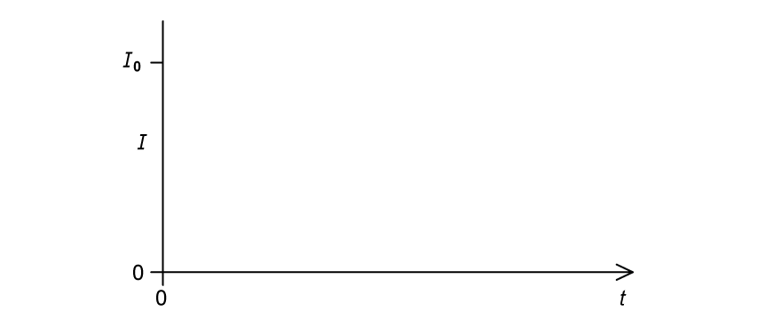{.question-figure fig-alt="Blank current-time axes starting at I0"}

**(ii)** On Fig. 1.3, sketch a line to suggest the variation with $t$ of the voltmeter reading $V$. `[1]`

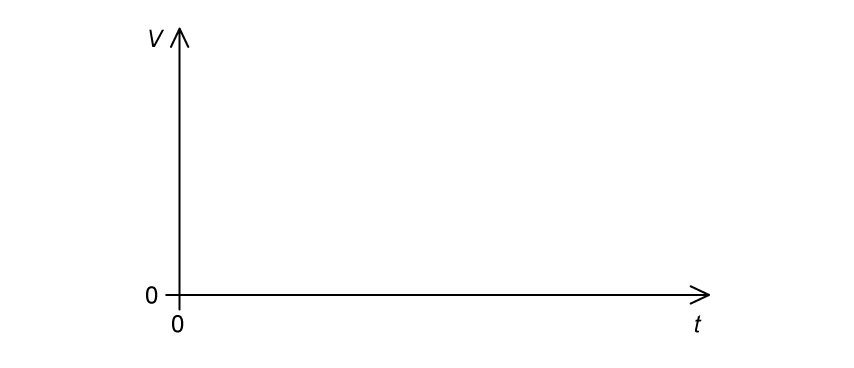{.question-figure fig-alt="Blank voltmeter-reading against time axes"}

`[3 marks]`

**(d)** Explain why there is an induced e.m.f. across wire Y during the discharge of the capacitor. `[3 marks]`

Show mark scheme / model answer

**(a)**

- **(i)** $Q_0=CV_0$. `[1]`
- $Q_0=(520\times10^{-6})(36)=0.019\ \mathrm{C}$. `[1]`
- **(ii)** Interpreting “wire P” as discharge wire X, $I_0=V_0/R=36/2400=0.015\ \mathrm{A}$. `[1]`

**(b)**

- $\tau=RC$. `[1]`
- $\tau=(2400)(520\times10^{-6})=1.25\ \mathrm{s}$. `[1]`

**(c)**

- **(i)** Draw an exponential decay starting at $(0,I_0)$ with negative gradient and approaching the time axis asymptotically. `[2]`
- **(ii)** Draw a positive pulse/decay with negative gradient, approaching zero as the discharge current stops changing. `[1]`

**(d)**

- Current in wire X produces a magnetic field. `[1]`
- As the discharge current changes, the magnetic flux linking wire Y changes. `[1]`
- The changing flux linkage induces an e.m.f. across wire Y. `[1]`

:::
