### 20.1 Magnetic Fields - Easy

::: {.question-card}
### Example 1 · Fields around wires and force on a conductor · 20.1 SQ Easy Q1

**(a)** A long straight wire passes through a piece of card. There is a current in the wire, as shown in Fig. 1.1a.

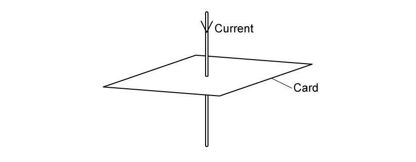{.question-figure fig-alt="Current passing downwards through a card"}

The current in the wire produces a magnetic field around the wire.

**(i)** On Fig. 1.1b, draw the magnetic field around the wire. Show the direction by drawing an arrow on each field line. `[2]`

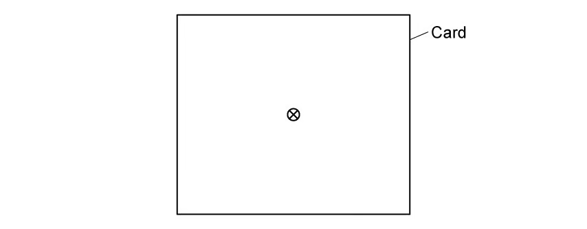{.question-figure fig-alt="Top view of current into a card"}

**(ii)** Two identical wires with the same current pass through a different piece of card. On Fig. 1.1c, draw the magnetic field around the wires. `[2]`

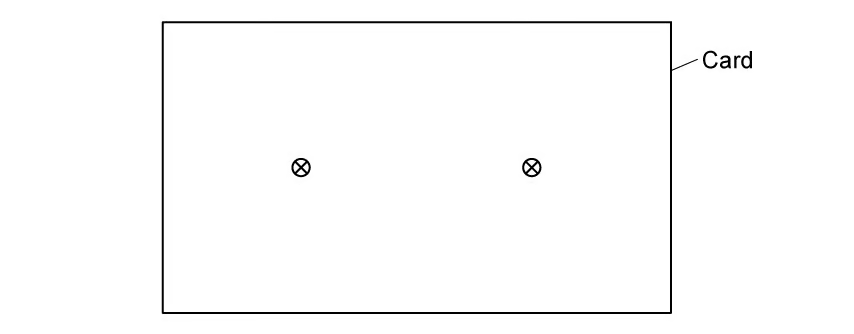{.question-figure fig-alt="Two equal currents into a card"}

`[4 marks]`

**(b)** The current-carrying wire is placed in a uniform magnetic field.

**(i)** State the equation, and define all the variables, for the force on a current-carrying wire in a uniform magnetic field at different angles. `[2]`

**(ii)** Describe how the wire should be placed to experience 1. the maximum force and 2. no force. `[2]`

`[4 marks]`

**(c)** A current-carrying conductor is placed at right angles to a uniform magnetic field of flux density $15\times10^{-3}\ \mathrm{T}$. Its length is $1.2\ \mathrm{m}$ and current is $1.5\ \mathrm{A}$. Calculate the magnetic force. `[2 marks]`

**(d)** The conductor is rotated to $30^\circ$ to the magnetic field. Calculate the new force. `[2 marks]`

Show mark scheme / model answer

- **(a)(i)** Draw concentric circles centred on the wire `[1]`, clockwise because current is into the card. `[1]`
- **(a)(ii)** Draw clockwise circular fields around both wires, with the fields opposing between the wires and reinforcing outside. `[2]`
- **(b)(i)** $F=BIL\sin\theta$, where $B$ is flux density, $I$ current, $L$ active length and $\theta$ the angle between current and field. `[2]`
- **(b)(ii)** Maximum force: wire perpendicular to the field. No force: wire parallel to the field. `[2]`
- **(c)** $F=(15\times10^{-3})(1.5)(1.2)=2.7\times10^{-2}\ \mathrm{N}$. `[2]`
- **(d)** $F=BIL\sin30^\circ=1.35\times10^{-2}\ \mathrm{N}$. `[2]`

:::

::: {.question-card}
### Example 2 · Fleming's rule and electron circular motion · 20.1 SQ Easy Q2

**(a)** Fleming's left-hand rule is shown in Fig. 1.1.

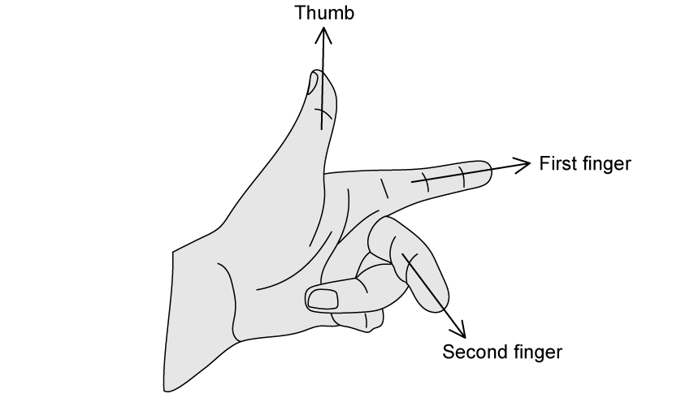{.question-figure fig-alt="Fleming's left-hand rule"}

State what is represented by the direction of **(i)** the thumb, **(ii)** the first finger and **(iii)** the second finger. `[3 marks]`

**(b)** Fig. 1.2 shows a magnetic field.

{.question-figure fig-alt="Crosses representing a field into the page"}

**(i)** State whether the field acts into or out of the page. `[1]`

**(ii)** An electron enters at A. Draw 1. the force arrow and 2. its path. `[4]`

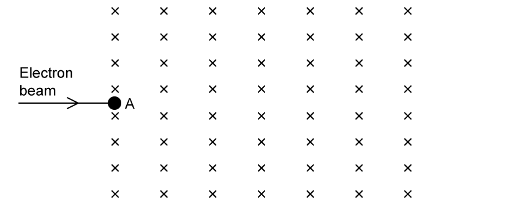{.question-figure fig-alt="Electron beam entering a field into the page"}

`[5 marks]`

**(c)** For $F=Bqv$, **(i)** state the meanings of $B$, $q$ and $v$; **(ii)** state the name and equation of the force causing circular motion. `[6 marks]`

**(d)** The electron speed is $3.0\times10^6\ \mathrm{m\ s^{-1}}$ and $B=3.2\times10^{-3}\ \mathrm{T}$.

**(i)** Show that $r=mv/(Bq)$. `[3]`

**(ii)** Calculate $r$. Use $m_e=9.11\times10^{-31}\ \mathrm{kg}$ and $|e|=1.60\times10^{-19}\ \mathrm{C}$. `[2]`

`[5 marks]`

Show mark scheme / model answer

- **(a)** Thumb: force/motion; first finger: magnetic field; second finger: conventional current. `[3]`
- **(b)(i)** Into the page. `[1]`
- **(b)(ii)** A positive charge moving right would be forced upwards, so the electron force is downwards. Draw a downward force arrow and a circular path curving downwards. `[4]`
- **(c)(i)** $B$: magnetic flux density; $q$: charge; $v$: speed perpendicular to the field. `[3]`
- **(c)(ii)** Centripetal force, $F=mv^2/r$. `[3]`
- **(d)(i)** Equate $Bqv=mv^2/r$ and rearrange to obtain $r=mv/(Bq)$. `[3]`
- **(d)(ii)** $r=(9.11\times10^{-31})(3.0\times10^6)/[(3.2\times10^{-3})(1.60\times10^{-19})]=5.3\times10^{-3}\ \mathrm{m}$. `[2]`

:::

::: {.question-card}
### Example 3 · Magnetic directions and a rectangular loop · 20.1 SQ Easy Q3

**(a)** Positive charges pass through different magnetic fields. State the missing direction between $B$, $v$ and $F$ in each scenario in Table 1.1. `[5 marks]`

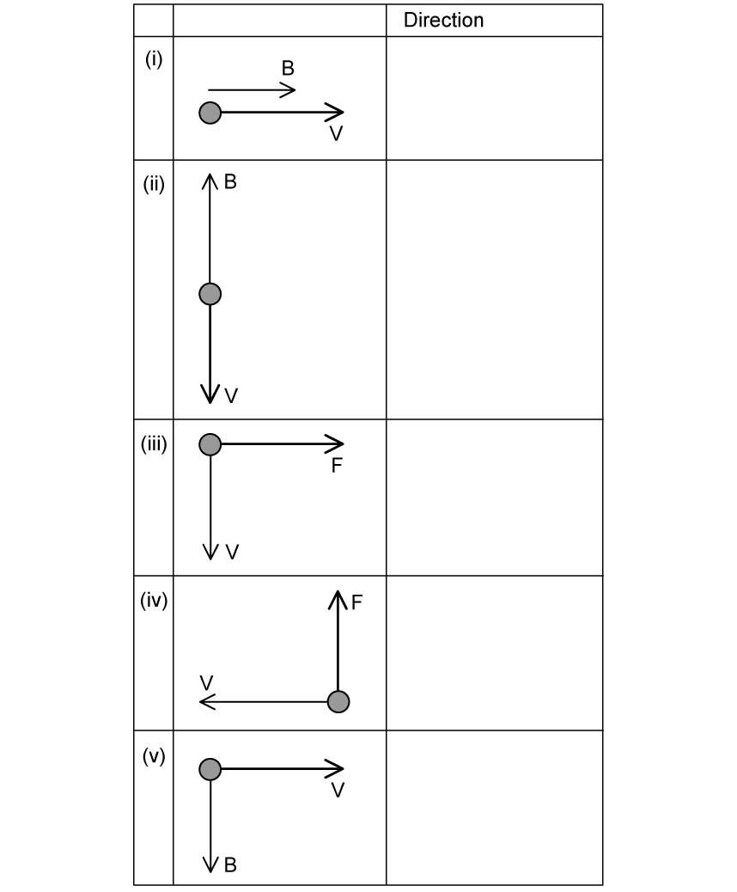{.question-figure fig-alt="Five magnetic force direction scenarios"}

**(b)** A rectangular loop ABCD, width $6.0\ \mathrm{cm}$ and length $9.0\ \mathrm{cm}$, carries $3.5\ \mathrm{A}$ in a uniform $0.75\ \mathrm{T}$ field.

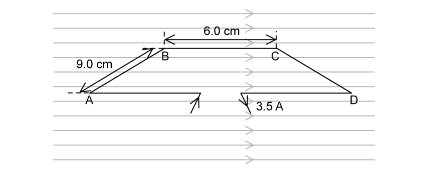{.question-figure fig-alt="Rectangular current loop in a horizontal magnetic field"}

Draw force arrows on **(i)** AB and **(ii)** CD. `[2 marks]`

**(c)** Calculate the force on **(i)** AB `[2]` and **(ii)** BC `[1]`. `[3 marks]`

**(d)(i)** Describe the motion after current is switched on. `[1]`

**(ii)** State the effect on force on CD if 1. $B$ is halved, 2. length is multiplied by 4, 3. current is reduced by 20%. `[3]`

`[4 marks]`

Show mark scheme / model answer

- **(a)** (i) $F=0$; (ii) $F=0$; (iii) $B$ into the page; (iv) $B$ out of the page; (v) $F$ into the page. `[5]`
- **(b)** Force on AB points down; force on CD points up. `[2]`
- **(c)(i)** $F=BIL=(0.75)(3.5)(0.090)=0.24\ \mathrm{N}$. `[2]`
- **(c)(ii)** BC is parallel to the field, so $F=0$. `[1]`
- **(d)(i)** The loop rotates anticlockwise. `[1]`
- **(d)(ii)** Force is halved; multiplied by 4; reduced to $0.80$ of its original value. `[3]`

:::

### 20.1 Magnetic Fields - Medium

::: {.question-card}
### Example 4 · Planning an induction experiment · 20.1 SQ Medium Q1

A circular coil P carrying alternating current produces a changing magnetic field. Similar coil Q is coaxial with P, with centre separation $x$. An e.m.f. $E$ is induced in Q.

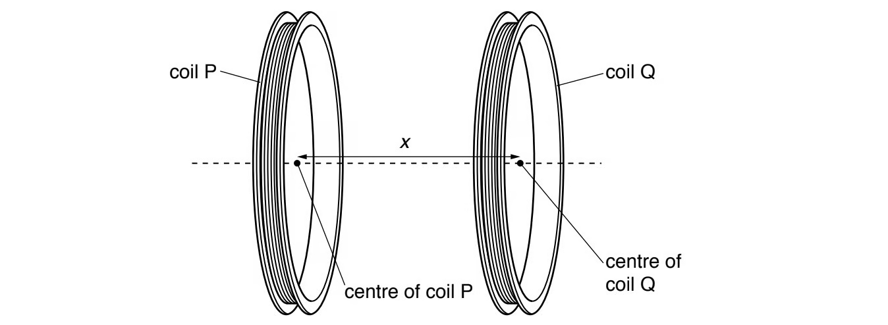{.question-figure fig-alt="Two coaxial coils P and Q separated by x"}

It is suggested that

$$E=IZe^{-kx},$$

where $I$ is current in P and $k$, $Z$ are constants.

Plan a laboratory experiment to test the relationship. Draw the arrangement and explain how results determine $k$ and $Z$. Include procedure, measurements, control variables, analysis and safety. `[15 marks]`

Show mark scheme / model answer

- Connect P to a sinusoidal signal generator/a.c. supply in series with an ammeter; connect Q to an a.c. voltmeter or oscilloscope. Support the coils coaxially on stands. `[3]`
- Measure centre-to-centre $x$ with a ruler; account for half the width of each coil. `[2]`
- Vary $x$ and record induced r.m.s. e.m.f. $E$. Repeat and average. `[2]`
- Keep $I$, supply frequency, coil turns, coil geometry and relative orientation constant; use a variable resistor to maintain $I$. `[3]`
- Take logarithms: $\ln E=-kx+\ln(IZ)$. Plot $\ln E$ against $x$; a straight line supports the model. `[2]`
- $k=-$gradient and $Z=e^{\text{intercept}}/I$. `[2]`
- Avoid touching a hot coil/use a modest current or switch off between readings. `[1]`

:::

::: {.question-card}
### Example 5 · Hall voltage in a conducting slice · 20.1 SQ Medium Q2

A thin conducting slice has labelled faces and is normal to a uniform field $B$. Electrons enter at right angles to face SRXY.

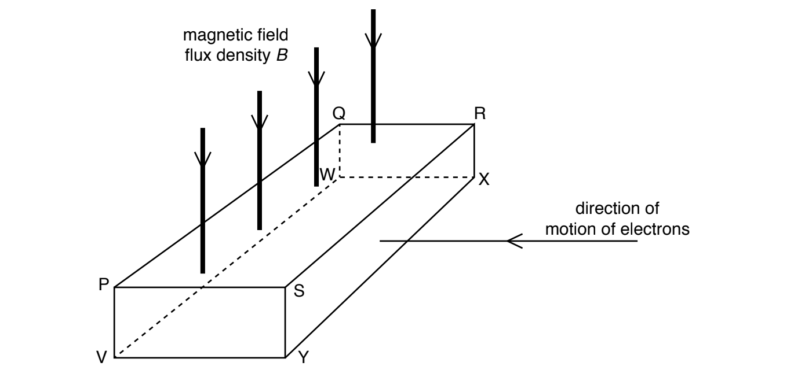{.question-figure fig-alt="Hall-effect conducting slice with labelled vertices"}

**(a)(i)** Identify the two faces between which Hall voltage is produced. `[1]`

**(ii)** State and explain which face is more positive. `[2]`

`[3 marks]`

**(b)** $V_H=BI/(ntq)$.

**(i)** Use letters to identify distance $t$. `[1]`

**(ii)** Electrons are replaced by positive carriers moving in the same direction. State and explain the effect on Hall-voltage polarity. `[2]`

`[3 marks]`

Show mark scheme / model answer

- **(a)(i)** Faces PSVY and QRWX. `[1]`
- **(a)(ii)** Electrons are deflected towards QRXW, which becomes negative; PSVY is more positive. `[2]`
- **(b)(i)** $t$ may be PV, SY, RX or QW. `[1]`
- **(b)(ii)** Positive and negative carriers are deflected in opposite directions for the same velocity, so charge sign and deflection both reverse; Hall polarity is unchanged. `[2]`

:::

::: {.question-card}
### Example 6 · Parallel wires and solenoid field · 20.1 SQ Medium Q3

**(a)** State and describe the conditions for a copper wire in a magnetic field to experience a magnetic force. `[2 marks]`

**(b)** Two long parallel current-carrying wires are near each other in a vacuum. Explain why they exert magnetic forces on each other. `[3 marks]`

**(c)** A long air-cored solenoid produces the field shown. Draw field-direction arrows at B, C and D. `[3 marks]`

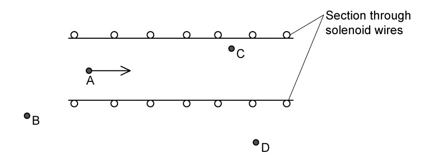{.question-figure fig-alt="Cross-section of a solenoid with field points A to D"}

**(d)** Compare flux density **(i)** at A and C and **(ii)** at A and D. `[2 marks]`

Show mark scheme / model answer

- **(a)** The wire must carry current and have a component of current perpendicular to the magnetic field. `[2]`
- **(b)** Each wire produces a circular magnetic field; the other current lies in this field and experiences $F=BIL$. The forces are equal and opposite; same-direction currents attract and opposite-direction currents repel. `[3]`
- **(c)** C points right like A; B and D are in the external return field and point left. `[3]`
- **(d)(i)** A and C have approximately equal flux density in the uniform interior. `[1]`
- **(d)(ii)** Flux density at A is greater than at D because the external field is weaker. `[1]`

:::

### 20.2 Electromagnetic Induction - Easy

::: {.question-card}
### Example 7 · Faraday's law and Lenz's law · 20.2 SQ Easy Q1

**(a)** State Faraday's law **(i)** in words `[2]` and **(ii)** as an equation, defining all quantities `[2]`. `[4 marks]`

**(b)** Complete: “The ______ of an induced e.m.f. is always set up in a way such that it ______ the change in magnetic flux ______ that causes it.” Use: `attracts opposes density direction linkage magnitude`. `[3 marks]`

**(c)** Rewrite the equation in **(a)(ii)** to include Lenz's law. `[1 mark]`

**(d)** A small coil connected to a sensitive voltmeter is near a current-carrying solenoid. State two different ways to induce an e.m.f. in the coil. `[2 marks]`

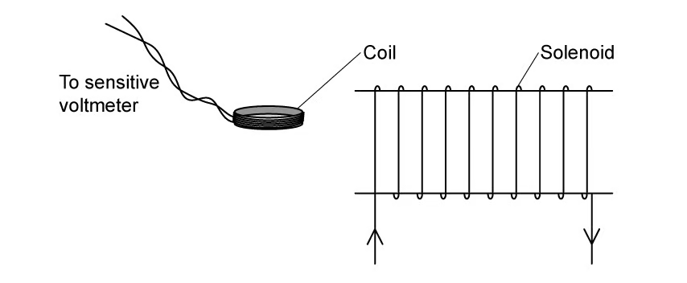{.question-figure fig-alt="Coil connected to a voltmeter beside a solenoid"}

Show mark scheme / model answer

- **(a)(i)** Induced e.m.f. is proportional to the rate of change of magnetic flux linkage. `[2]`
- **(a)(ii)** $|\mathcal E|=\Delta(N\Phi)/\Delta t$; define e.m.f., turns, flux and time. `[2]`
- **(b)** direction; opposes; linkage. `[3]`
- **(c)** $\mathcal E=-d(N\Phi)/dt$. `[1]`
- **(d)** Move coil/solenoid relative to the other; change or switch the solenoid current. `[2]`

:::

::: {.question-card}
### Example 8 · Flux, flux linkage and rotating coil · 20.2 SQ Easy Q2

**(a)(i)** Define magnetic flux. `[2]` **(ii)** Write its equation when $B$ is not perpendicular to the area. `[1]` `[3 marks]`

**(b)** A 500-turn circular coil of area $0.1\ \mathrm{m^2}$ has its plane perpendicular to a uniform $80\ \mathrm{mT}$ field. Calculate magnetic flux through the coil, with unit. `[3 marks]`

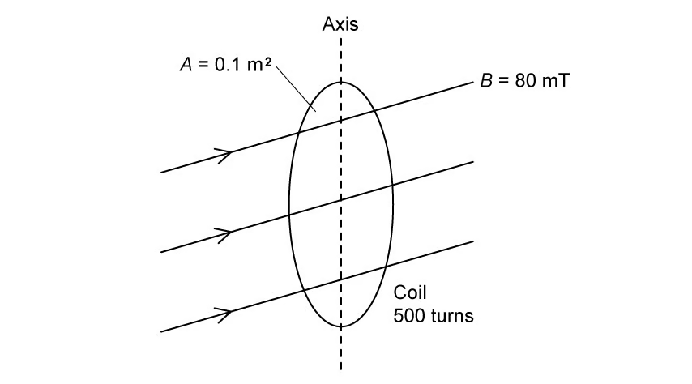{.question-figure fig-alt="Circular coil in a horizontal uniform magnetic field"}

**(c)(i)** Define magnetic flux linkage. `[1]` **(ii)** Calculate its change when the coil rotates through $90^\circ$. `[2]` `[3 marks]`

**(d)** The rotation takes $300\ \mathrm{ms}$. Calculate average induced e.m.f. `[3 marks]`

Show mark scheme / model answer

- **(a)** Flux is the product of flux density and area perpendicular to the field; $\Phi=BA\cos\theta$. `[3]`
- **(b)** $\Phi=(0.080)(0.10)=8.0\times10^{-3}\ \mathrm{Wb}$. `[3]`
- **(c)** Flux linkage is $N\Phi$; change $=500(8.0\times10^{-3})=4.0\ \mathrm{Wb\ turns}$. `[3]`
- **(d)** $|\mathcal E|=4.0/0.300=13\ \mathrm{V}$. `[3]`

:::

::: {.question-card}
### Example 9 · Magnet and coil observations · 20.2 SQ Easy Q3

**(a)** Complete the SI table for magnetic flux, magnetic flux linkage, e.m.f. and magnetic flux density. `[4 marks]`

**(b)** A magnet lowered into a coil deflects a centre-zero voltmeter to the right.

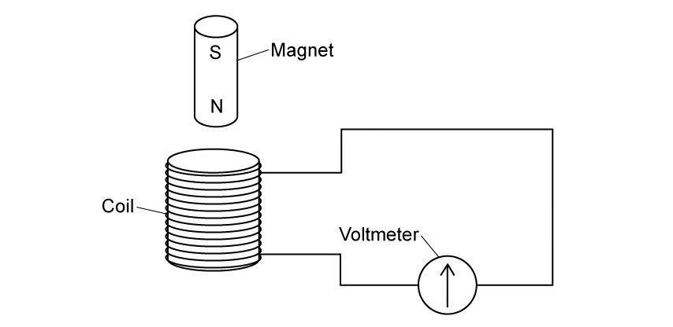{.question-figure fig-alt="Magnet entering a coil connected to a voltmeter"}

{.question-figure fig-alt="Initial voltmeter deflection"}

Sketch the needle when **(i)** the magnet is held at rest and **(ii)** removed faster than it entered. `[4 marks]`

{.question-figure fig-alt="Blank voltmeter observations"}

**(c)** A magnet moves towards and away at steady rate. Explain why **(i)** there is a reading, **(ii)** magnitude varies and **(iii)** values are positive and negative. `[5 marks]`

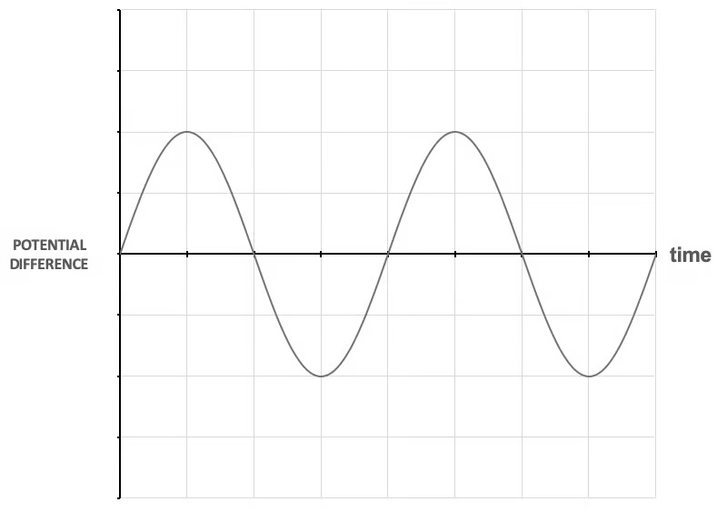{.question-figure fig-alt="Alternating induced potential difference against time"}

**(d)** The reading is $1.5\ \mathrm{mV}$ for $2.0\ \mathrm{s}$. Calculate change in flux linkage. `[3 marks]`

Show mark scheme / model answer

- **(a)** $\Phi$: Wb; $N\Phi$: Wb turns; $\mathcal E$: V; $B$: T. `[4]`
- **(b)(i)** Needle at zero. `[1]` **(ii)** Deflection to the left with greater magnitude. `[3]`
- **(c)(i)** Movement changes flux linkage, inducing e.m.f. `[1]`
- **(c)(ii)** Rate of change varies with position, so e.m.f. magnitude varies. `[2]`
- **(c)(iii)** Direction of flux change reverses between approach and withdrawal, so induced polarity reverses. `[2]`
- **(d)** $\Delta(N\Phi)=\mathcal E\Delta t=(1.5\times10^{-3})(2.0)=3.0\times10^{-3}\ \mathrm{Wb\ turns}$. `[3]`

:::

### 20.2 Electromagnetic Induction - Medium

::: {.question-card}
### Example 10 · Reversing current in a solenoid · 20.2 SQ Medium Q1

**(a)(i)** Define magnetic flux. `[2]` **(ii)** State Faraday's law. `[2]` `[4 marks]`

**(b)** A 96-turn coil C surrounds a solenoid.

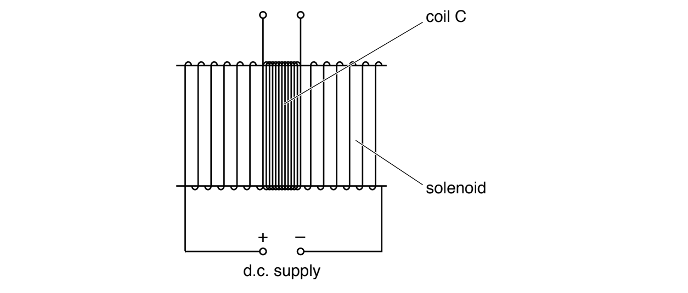{.question-figure fig-alt="Coil C wound around the centre of a solenoid"}

Flux is $\Phi=6.8\times10^{-6}I$ Wb. Calculate average induced e.m.f. when $3.5\ \mathrm{A}$ is reversed in $2.4\ \mathrm{ms}$. `[2 marks]`

**(c)** The d.c. supply is replaced by a sinusoidal alternating supply. Describe qualitatively the e.m.f. induced in C. `[2 marks]`

Show mark scheme / model answer

- **(a)** Flux is $BA$ normal to the field; Faraday's law states induced e.m.f. equals rate of change of flux linkage. `[4]`
- **(b)** $\Delta I=7.0\ \mathrm{A}$, so $\Delta(N\Phi)=96(6.8\times10^{-6})(7.0)$. Divide by $2.4\times10^{-3}$ to obtain $1.9\ \mathrm{V}$. `[2]`
- **(c)** A sinusoidal alternating e.m.f. is induced at the same frequency, with a quarter-cycle phase difference from current/flux. `[2]`

:::

::: {.question-card}
### Example 11 · Nested solenoids and Lenz's law · 20.2 SQ Medium Q2

A 2000-turn smaller solenoid of area $1.2\times10^{-3}\ \mathrm{m^2}$ is inside an 800-turn larger solenoid of area $7.8\times10^{-3}\ \mathrm{m^2}$.

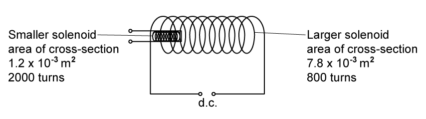{.question-figure fig-alt="Smaller solenoid inside a larger powered solenoid"}

**(a)** Compare magnetic flux in the two solenoids. `[1]`

**(b)** Compare magnetic flux linkage. `[1]`

**(c)** State Lenz's law. `[2]`

**(d)** The smaller solenoid terminals are connected and it is removed. Explain why a force is needed. `[3 marks]`

Show mark scheme / model answer

- **(a)** The larger solenoid has greater flux because $\Phi=BA$ and its area is larger. `[1]`
- **(b)** Larger linkage is also greater: $800(7.8)>2000(1.2)$ in common factors. `[1]`
- **(c)** Induced current acts in a direction that opposes the change causing it. `[2]`
- **(d)** Removal changes linkage and induces e.m.f./current in the smaller solenoid; its magnetic field interacts with the original field to produce an attractive force opposing removal. `[3]`

:::

::: {.question-card}
### Example 12 · Changing flux density through a square coil · 20.2 SQ Medium Q3

**(a)** Define magnetic flux linkage. `[2 marks]`

**(b)** A stationary square coil, side $10\ \mathrm{cm}$ and 5 turns, has its plane perpendicular to the field.

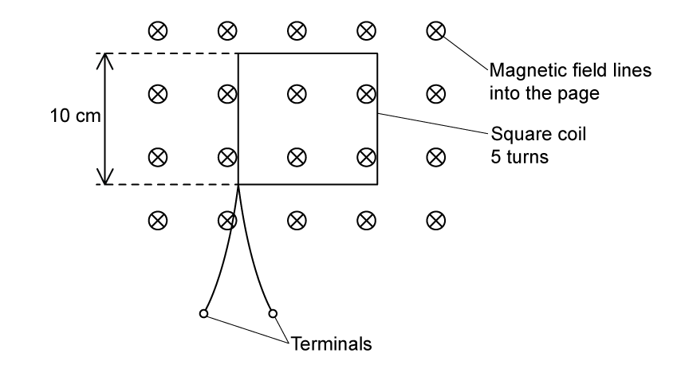{.question-figure fig-alt="Five-turn square coil in a field into the page"}

Flux density varies as shown.

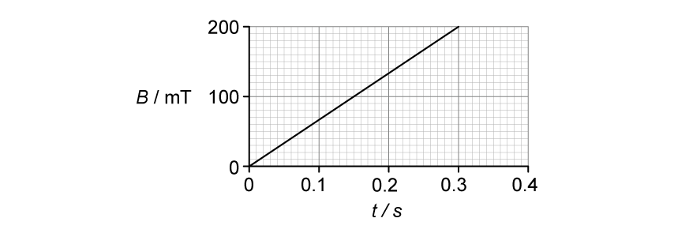{.question-figure fig-alt="Flux density rising linearly to 200 mT at 0.30 s"}

Determine flux linkage at $t=0.30\ \mathrm{s}$, with unit. `[3 marks]`

**(c)(i)** State how the graph shows induced e.m.f. is constant from 0 to $0.30\ \mathrm{s}$. `[1]` **(ii)** Calculate its magnitude. `[2]` `[3 marks]`

**(d)** The procedure is repeated with coil terminals connected. State and explain the effect on the coil. `[3 marks]`

Show mark scheme / model answer

- **(a)** Product of magnetic flux through one turn and number of turns. `[2]`
- **(b)** $N\Phi=NBA=5(0.200)(0.10^2)=1.0\times10^{-2}\ \mathrm{Wb\ turns}$. `[3]`
- **(c)(i)** $B$ and hence linkage change linearly, so their gradient is constant. `[1]`
- **(c)(ii)** $|\mathcal E|=\Delta(N\Phi)/\Delta t=0.010/0.30=3.3\times10^{-2}\ \mathrm{V}$. `[2]`
- **(d)** Induced e.m.f. drives current. Forces act on current-carrying sides in the field, forcing opposite sides inward; alternatively, resistive heating raises coil temperature. `[3]`

:::
