## Learning objectives

By the end of this chapter, you should be able to:

- represent magnetic fields using directed field lines;
- use $F=BIL\sin\theta$ and Fleming's left-hand rule;
- use $F=BQv\sin\theta$ for moving charges;
- explain circular motion of charges in uniform magnetic fields;
- derive and use the Hall-voltage equation;
- sketch fields due to straight wires, coils and solenoids;
- explain forces between parallel current-carrying conductors;
- define magnetic flux and flux linkage;
- apply Faraday's and Lenz's laws.

## 20.1 Concept of a magnetic field

::: {.study-card}
### Meaning of a magnetic field

A magnetic field is a region in which a moving charge, a current-carrying conductor or a magnetic pole experiences a force. The magnetic flux density $B$ describes the strength of the field and is measured in tesla (T).

Magnetic field lines are a visual model:

- the arrow gives the direction in which a north pole would be pushed;
- outside a bar magnet, field lines run from north to south and inside the magnet they return from south to north;
- closer spacing represents a stronger field;
- field lines do not cross, because the field has only one direction at a point.
:::

::: {.knowledge-figure}
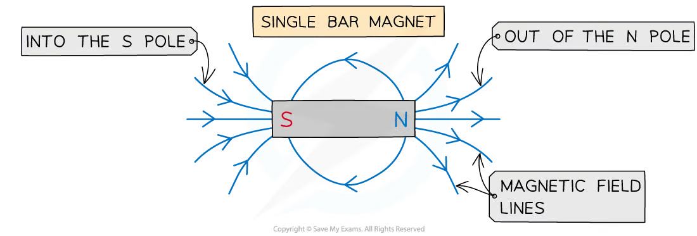{fig-alt="Magnetic field lines around a bar magnet, directed out of the north pole and into the south pole"}

The tangent to a field line gives the local field direction. The lines are most closely spaced near the poles, where the field is strongest.
:::

::: {.study-card}
### Common notation

- $\odot$ represents a vector out of the page, like the tip of an arrow.
- $\otimes$ represents a vector into the page, like the tail feathers of an arrow.

Use the right-hand grip rule for a current: thumb in the direction of conventional current, curled fingers in the direction of the magnetic field.
:::

::: {.knowledge-figure}
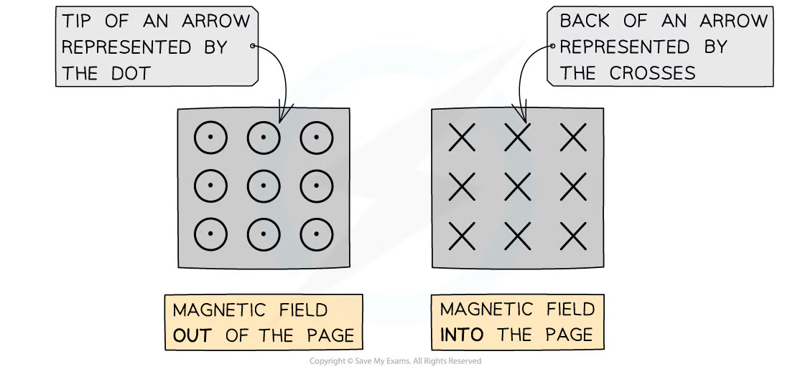{fig-alt="Dot and cross notation for magnetic fields out of and into the page"}

Dots represent arrowheads coming towards the observer; crosses represent the tails of arrows going away from the observer.
:::

::: {.example-card}
### Worked Example 1 · Field-line interpretation

A field-line diagram around a bar magnet shows the lines packed more closely near the north pole than near the middle of the magnet. State what this tells you about the field and give the field direction at a point just outside the north pole.

**Solution**

1. The closer spacing means that the magnetic flux density is greater near the north pole.
2. The field direction is the tangent to the line at that point, directed away from the north pole.

**Answer:** the field is stronger near the pole, and a north test pole would be pushed away from the north pole.
:::

## 20.2 Force on a current-carrying conductor

::: {.formula-panel}
### Magnetic force on a straight wire

For a straight conductor of active length $L$ carrying current $I$ in a uniform field of flux density $B$,

$$F=BIL\sin\theta,$$

where $\theta$ is the angle between the conventional current and the magnetic field. Only the component of length perpendicular to the field contributes. Force is maximum at $90^\circ$ and zero when the wire is parallel to the field.
:::

::: {.knowledge-figure}
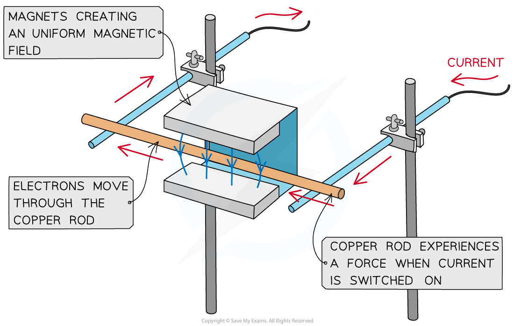{fig-alt="Copper rod carrying current between magnets and experiencing a magnetic force"}

The force appears when current flows through the part of the conductor inside the magnetic field. Reversing the current or reversing the field reverses the force.
:::

::: {.study-card}
### Direction and flux-density definition

Fleming's left-hand rule gives mutually perpendicular directions:

- first finger: magnetic **field**;
- second finger: conventional **current**;
- thumb: **force** or motion.

Magnetic flux density is the force per unit current per unit length on a wire placed perpendicular to the field:

$$B=\frac{F}{IL}.$$

Thus $1\ \mathrm{T}=1\ \mathrm{N\ A^{-1}\ m^{-1}}$.
:::

::: {.knowledge-figure}
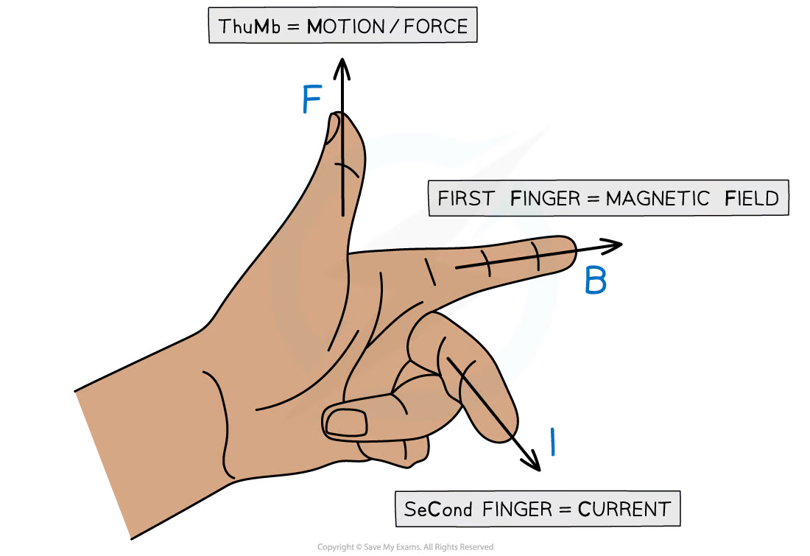{fig-alt="Fleming's left-hand rule showing field, current and force as mutually perpendicular directions"}

Keep the three directions mutually perpendicular: first finger is field $B$, second finger is conventional current $I$, and thumb is force $F$.
:::

::: {.example-card}
### Worked Example 2 · Force on a current-carrying wire

A $0.080\ \mathrm{m}$ wire carries a current of $3.0\ \mathrm{A}$ in a uniform magnetic field of $0.40\ \mathrm{T}$. The wire is at $60^\circ$ to the field. Calculate the force on the wire.

**Solution**

$$F=BIL\sin\theta
  =(0.40)(3.0)(0.080)\sin60^\circ
  =8.3\times10^{-2}\ \mathrm{N}.$$

**Answer:** $F=0.083\ \mathrm{N}$. The direction is found with Fleming's left-hand rule.
:::

## 20.3 Force on a moving charge

::: {.formula-panel}
### Magnetic force on a moving charge

For charge $Q$ moving at speed $v$,

$$F=BQv\sin\theta.$$

The force direction for a positive charge follows the conventional-current direction in Fleming's rule; reverse it for a negative charge. If the charge is stationary or moves parallel to the field, the magnetic force is zero. Magnetic force is perpendicular to velocity, so it changes direction but does no work and does not change speed.
:::

::: {.study-card}
### Circular motion

When $\vec v\perp\vec B$, magnetic force supplies centripetal force:

$$BQv=\frac{mv^2}{r}, \qquad r=\frac{mv}{|Q|B}.$$

The angular speed and period are

$$\omega=\frac{|Q|B}{m}, \qquad T=\frac{2\pi m}{|Q|B}.$$

A velocity component parallel to the field is unchanged, producing a helical path.
:::

::: {.knowledge-figure}
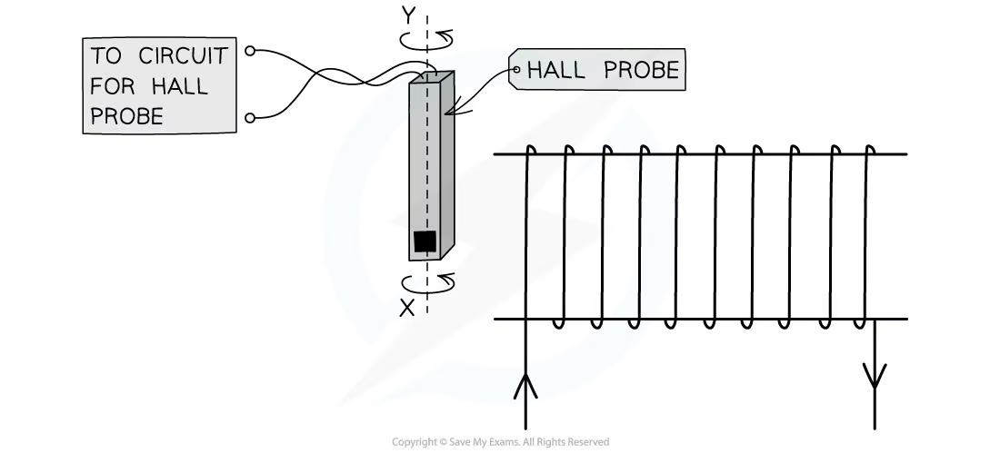{fig-alt="Positive charge moving in a circle in a magnetic field into the page, with magnetic force directed towards the centre"}

For $v\perp B$, the magnetic force is always radial and supplies the centripetal force. The speed stays constant even though the velocity direction changes continuously.
:::

::: {.example-card}
### Worked Example 3 · Radius of a charged-particle path

A proton moves at $2.0\times10^6\ \mathrm{m\ s^{-1}}$ perpendicular to a magnetic field of $0.30\ \mathrm{T}$. Calculate the radius of its circular path. Take the proton mass as $1.67\times10^{-27}\ \mathrm{kg}$ and charge as $1.60\times10^{-19}\ \mathrm{C}$.

**Solution**

Since $v\perp B$,

$$r=\frac{mv}{|Q|B}
  =\frac{(1.67\times10^{-27})(2.0\times10^6)}{(1.60\times10^{-19})(0.30)}
  =6.96\times10^{-2}\ \mathrm{m}.$$

**Answer:** $r=0.070\ \mathrm{m}$, or approximately $7.0\ \mathrm{cm}$.
:::

::: {.formula-panel}
### Hall effect

Charge carriers moving through a conductor in a perpendicular magnetic field are deflected, producing a transverse Hall voltage. At equilibrium, electric and magnetic forces balance.

For carrier number density $n$, charge magnitude $q$, current $I$ and sample thickness $t$,

$$V_H=\frac{BI}{ntq}.$$

Hall polarity identifies the sign of charge carriers, while a calibrated Hall probe measures $B$.
:::

::: {.knowledge-figure}
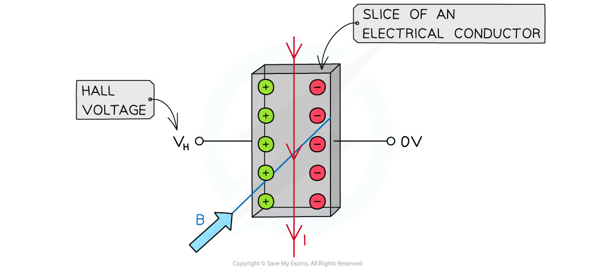{fig-alt="Hall effect in a conductor showing charge separation and the transverse Hall voltage"}

Charge separation continues until the electric force due to the Hall field balances the sideways magnetic force. The measured voltage is across the sample, perpendicular to the current.
:::

::: {.study-card}
### Velocity selection

In crossed electric and magnetic fields, forces can oppose:

$$QE=BQv.$$

Particles pass undeflected only when

$$v=\frac{E}{B}.$$
:::

::: {.example-card}
### Worked Example 4 · Hall voltage

A Hall probe has carrier density $n=5.0\times10^{28}\ \mathrm{m^{-3}}$, thickness $t=1.0\ \mathrm{mm}$ and carries a current of $2.0\ \mathrm{A}$. It is placed in a field of $0.25\ \mathrm{T}$. The carrier charge magnitude is $1.60\times10^{-19}\ \mathrm{C}$. Calculate the Hall voltage.

**Solution**

$$V_H=\frac{BI}{ntq}
  =\frac{(0.25)(2.0)}{(5.0\times10^{28})(1.0\times10^{-3})(1.60\times10^{-19})}
  =6.25\times10^{-8}\ \mathrm{V}.$$

**Answer:** $V_H=6.3\times10^{-8}\ \mathrm{V}$, or $63\ \mathrm{nV}$.
:::

## 20.4 Magnetic fields due to currents

::: {.study-card}
### Field patterns and the right-hand grip rule

- Long straight wire: concentric circular field lines.
- Flat circular coil: a dipole-like pattern, strongest through the centre.
- Long solenoid: strong, nearly uniform parallel field inside and weak return field outside.

For a long straight wire, point the right thumb in the direction of conventional current; the curled fingers give the field direction. A ferrous core increases the field in a solenoid because it becomes magnetised and adds to the field produced by the current.
:::

::: {.knowledge-figure}
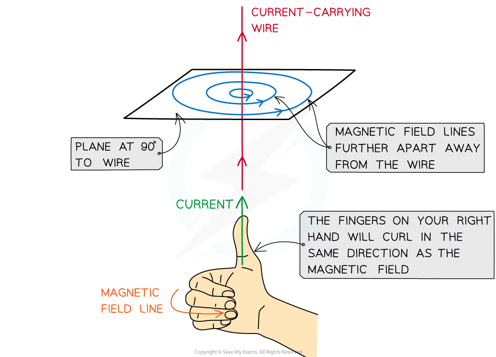{fig-alt="Circular magnetic field lines around a straight current-carrying wire"}

The field lines are circles in planes perpendicular to the wire. Their spacing increases with distance, so the field becomes weaker farther from the wire.
:::

::: {.knowledge-figure}
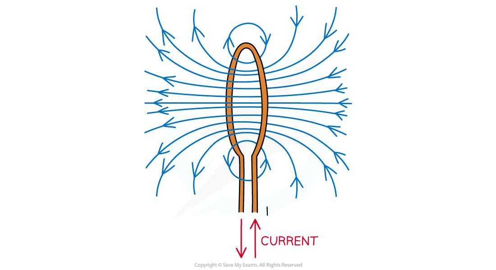{fig-alt="Magnetic field lines around a current-carrying solenoid, with a strong field inside"}

Inside a long solenoid the field is approximately uniform and parallel to its axis. The solenoid behaves like a bar magnet, with its north pole determined by the current direction.
:::

::: {.formula-panel}
### Useful field equations

For a long straight wire in free space,

$$B=\frac{\mu_0 I}{2\pi r},$$

where $r$ is the perpendicular distance from the wire and $\mu_0$ is the permeability of free space. For a long solenoid,

$$B=\mu_0 nI,$$

where $n$ is the number of turns per unit length. These equations apply to the idealised cases stated.
:::

::: {.study-card}
### Parallel currents

Each current-carrying wire lies in the magnetic field produced by the other. Currents in the same direction attract; currents in opposite directions repel. Newton's third law gives equal and opposite forces on the two wires.
:::

::: {.example-card}
### Worked Example 5 · Field around a straight wire

A long straight wire carries a current of $8.0\ \mathrm{A}$. Calculate the magnetic flux density at a point $4.0\ \mathrm{cm}$ from the wire. Take $\mu_0=4\pi\times10^{-7}\ \mathrm{H\ m^{-1}}$.

**Solution**

$$B=\frac{\mu_0I}{2\pi r}
  =\frac{(4\pi\times10^{-7})(8.0)}{2\pi(0.040)}
  =4.0\times10^{-5}\ \mathrm{T}.$$

**Answer:** $B=4.0\times10^{-5}\ \mathrm{T}$, with direction given by the right-hand grip rule.
:::

::: {.formula-panel}
### Force between parallel wires

For two long parallel wires carrying currents $I_1$ and $I_2$ separated by distance $d$, the force per unit length is

$$\frac{F}{L}=\frac{\mu_0I_1I_2}{2\pi d}.$$

The force is attractive when the currents are in the same direction and repulsive when they are in opposite directions.
:::

::: {.example-card}
### Worked Example 6 · Parallel current-carrying wires

Two long parallel wires carry currents of $5.0\ \mathrm{A}$ and $8.0\ \mathrm{A}$ in the same direction. They are separated by $0.12\ \mathrm{m}$. Calculate the force per unit length between them.

**Solution**

$$\frac{F}{L}=\frac{\mu_0I_1I_2}{2\pi d}
  =\frac{(4\pi\times10^{-7})(5.0)(8.0)}{2\pi(0.12)}
  =1.33\times10^{-4}\ \mathrm{N\ m^{-1}}.$$

**Answer:** $F/L=1.3\times10^{-4}\ \mathrm{N\ m^{-1}}$, and the force is attractive.
:::

## 20.5 Electromagnetic induction

::: {.formula-panel}
### Magnetic flux and flux linkage

Magnetic flux through area $A$ is

$$\Phi=BA\cos\theta,$$

where $\theta$ is the angle between $\vec B$ and the normal to the area. Its unit is the weber (Wb).

For a coil of $N$ turns, magnetic flux linkage is

$$N\Phi.$$
:::

::: {.knowledge-figure}
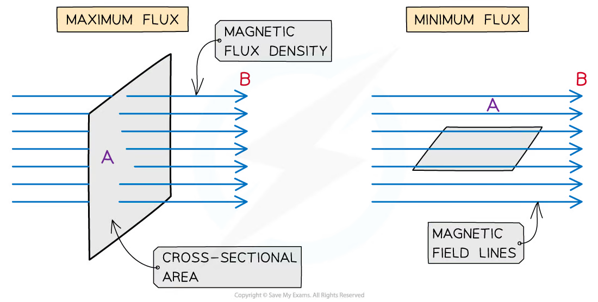{fig-alt="Magnetic flux through a flat area, showing that the angle is measured between the field and the area normal"}

The angle in $\Phi=BA\cos\theta$ is measured from the normal, not from the plane of the coil. Thus the flux is maximum when the field is perpendicular to the coil and zero when the field is parallel to the coil.
:::

::: {.formula-panel}
### Faraday's law

The magnitude of induced e.m.f. equals the rate of change of magnetic flux linkage:

$$|\mathcal E|=\left|\frac{\Delta(N\Phi)}{\Delta t}\right|.$$

A larger number of turns, stronger field, larger area or faster change produces a larger induced e.m.f.
:::

::: {.knowledge-figure}
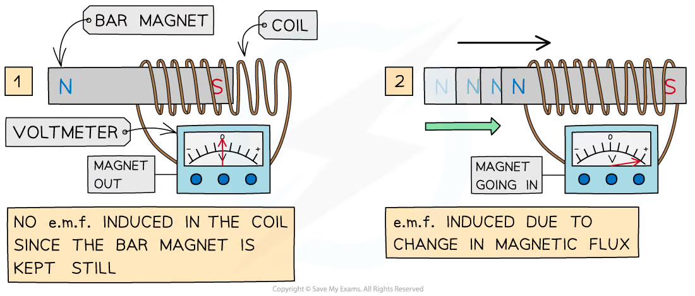{fig-alt="Bar magnet moving into and out of a coil connected to a voltmeter, producing an induced e.m.f."}

No e.m.f. is induced when the magnet and coil are both stationary, even if the magnetic flux is large. An e.m.f. requires a change in flux linkage.
:::

::: {.study-card}
### Lenz's law

The induced current is in a direction that opposes the change producing it. Including direction,

$$\mathcal E=-\frac{d(N\Phi)}{dt}.$$

The minus sign expresses energy conservation: an induced current cannot reinforce the change that created it without external work.
:::

::: {.knowledge-figure}
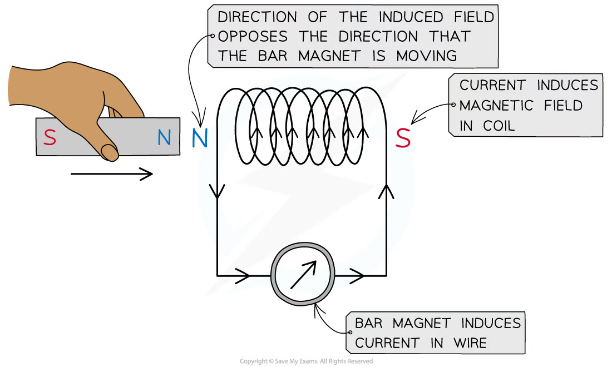{fig-alt="Lenz's law showing an induced magnetic field opposing the motion of an approaching bar magnet"}

The induced field opposes the change in flux: it is not necessarily opposite to the external field itself. This opposition requires mechanical work and is consistent with conservation of energy.
:::

::: {.study-card}
### Ways to change flux linkage

An e.m.f. can be induced by changing magnetic flux density, coil area, coil orientation, number of linked turns, or relative position of magnet and coil. A stationary magnet and stationary coil produce no e.m.f. even when the flux is large; the flux linkage must change.
:::

::: {.example-card}
### Worked Example 7 · Magnetic flux and induced e.m.f.

A coil has $200$ turns and area $3.0\times10^{-3}\ \mathrm{m^2}$. It is initially in a uniform field of $0.40\ \mathrm{T}$ with the field perpendicular to the coil. The coil is rotated so that the field is parallel to the coil in $0.050\ \mathrm{s}$. Calculate the average induced e.m.f.

**Solution**

Initially, $\theta=0^\circ$ because the field is along the normal:

$$\Phi_1=BA\cos0^\circ=(0.40)(3.0\times10^{-3})=1.2\times10^{-3}\ \mathrm{Wb}.$$

Finally, $\theta=90^\circ$:

$$\Phi_2=BA\cos90^\circ=0.$$

Therefore,

$$|\mathcal E|=\frac{|N\Phi_2-N\Phi_1|}{\Delta t}
  =\frac{(200)(1.2\times10^{-3})}{0.050}
  =4.8\ \mathrm{V}.$$

**Answer:** the average induced e.m.f. is $4.8\ \mathrm{V}$.
:::

::: {.example-card}
### Worked Example 8 · Applying Lenz's law

The north pole of a bar magnet is moved towards the left-hand end of a coil. State the pole induced at the left-hand end of the coil and explain the direction of the induced current.

**Solution**

The left-hand end of the coil becomes a north pole. It repels the approaching north pole, so the induced magnetic field opposes the increase in flux caused by the magnet's motion. The induced current direction is then found using the right-hand grip rule for the coil.

**Answer:** the near end becomes north, and the current produces a field that opposes the approach of the magnet.
:::

## Structured Questions



## Chapter self-check

- Can you use both hand rules without confusing conventional current and electron flow?
- Can you identify when magnetic force is zero or maximum?
- Can you derive the radius of a charged particle's circular path?
- Can you explain Hall voltage from charge separation?
- Can you sketch wire, coil and solenoid field patterns?
- Can you distinguish magnetic flux from flux linkage?
- Can you use the area and the correct angle in $\Phi=BA\cos\theta$?
- Can you explain the minus sign in Faraday-Lenz law?

### Original topic PDFs

- [20.1 Magnetic Fields - Easy](https://raw.githubusercontent.com/nanoxsj/CIE-Physics-Study/main/resources/original-papers/magnetic-fields/20.1%20Magnetic%20Fields%20-%20Easy.pdf.pdf)
- [20.1 Magnetic Fields - Medium](https://raw.githubusercontent.com/nanoxsj/CIE-Physics-Study/main/resources/original-papers/magnetic-fields/20.1%20Magnetic%20Fields%20-%20Medium.pdf.pdf)
- [20.2 Electromagnetic Induction - Easy](https://raw.githubusercontent.com/nanoxsj/CIE-Physics-Study/main/resources/original-papers/magnetic-fields/20.2%20Electromagnetic%20Induction%20-%20Easy.pdf.pdf)
- [20.2 Electromagnetic Induction - Medium](https://raw.githubusercontent.com/nanoxsj/CIE-Physics-Study/main/resources/original-papers/magnetic-fields/20.2%20Electromagnetic%20Induction%20-%20Medium.pdf.pdf)
