### 21.1 Properties and Uses of Alternating Current — Easy

::: {.question-card}
### Example 1 · Peak and r.m.s. values, frequency and power · 21.1 SQ Easy Q1

**(a)** For an alternating voltage, state what is meant by

**(i)** the peak voltage, `[1]`

**(ii)** the root mean square voltage. `[2]`

`[3 marks]`

**(b)** A generator produces an alternating voltage which can be described by the equation

$$V=150\sin(200\pi t)$$

where $V$ is measured in volts and $t$ is in seconds.

For this alternating voltage, determine

**(i)** the peak voltage, `[1]`

**(ii)** the r.m.s. voltage, `[1]`

**(iii)** the frequency. `[1]`

`[3 marks]`

**(c)** The alternating voltage is supplied across a $100\ \Omega$ resistor.

Calculate

**(i)** the peak current and hence the r.m.s. current in the resistor, `[2]`

**(ii)** the mean power dissipated in the resistor, `[2]`

**(iii)** the peak power dissipated in the resistor. `[2]`

`[6 marks]`

**(d)** State the effect on the output voltage if the frequency of the generator is increased. `[1 mark]`

Show mark scheme / model answer

- **(a)(i)** Peak voltage is the maximum value of the alternating voltage. `[1]`
- **(a)(ii)** It is the value of a steady voltage that produces the same power in a resistor as the alternating voltage. `[2]` Alternatively: square the alternating voltage, find its mean and take the square root.
- **(b)(i)** Comparing with $V=V_0\sin\omega t$ gives $V_0=150\ \mathrm{V}$. `[1]`
- **(b)(ii)** $V_{\mathrm{rms}}=150/\sqrt2=106\ \mathrm{V}$. `[1]`
- **(b)(iii)** $\omega=200\pi=2\pi f$, so $f=100\ \mathrm{Hz}$. `[1]`
- **(c)(i)** $I_0=V_0/R=150/100=1.5\ \mathrm{A}$; $I_{\mathrm{rms}}=I_0/\sqrt2=1.06\ \mathrm{A}$. `[2]`
- **(c)(ii)** $P_{\mathrm{mean}}=V_{\mathrm{rms}}I_{\mathrm{rms}}=(106)(1.06)=112\ \mathrm{W}$. `[2]`
- **(c)(iii)** $P_0=2P_{\mathrm{mean}}=224\ \mathrm{W}$. `[2]`
- **(d)** The output voltage increases. A greater rotation frequency gives a greater rate of change of flux linkage. `[1]`

:::

::: {.question-card}
### Example 2 · Alternating generator output and r.m.s. quantities · 21.1 SQ Easy Q2

**(a)** Fig. 1.1a shows an alternating current generator with a rectangular coil rotating at a constant frequency in a uniform magnetic field.

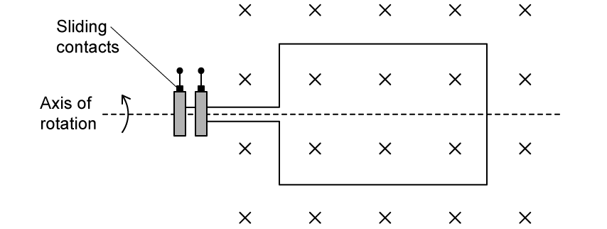{.question-figure fig-alt="Rectangular generator coil rotating in a uniform magnetic field"}

The graph in Fig. 1.1b shows how the output voltage $V$ from the generator varies with time $t$.

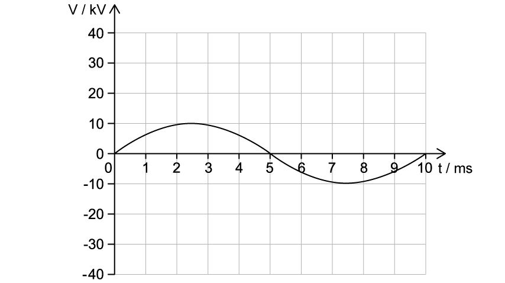{.question-figure fig-alt="Generator output voltage against time"}

Using Fig. 1.1b, state the peak output voltage $V_0$ of the generator. `[1 mark]`

**(b)** Calculate the root mean squared voltage $V_{\mathrm{rms}}$. `[2 marks]`

**(c)** The mean power output of the generator is $35\ \mathrm{kW}$.

Calculate the root mean squared current $I_{\mathrm{rms}}$. `[3 marks]`

**(d)** Draw a line on the graph in Fig. 1.1b to show the $V_{\mathrm{rms}}$. `[2 marks]`

Show mark scheme / model answer

- **(a)** Read the amplitude from the graph: $V_0=10\ \mathrm{kV}$. `[1]`
- **(b)** $V_{\mathrm{rms}}=V_0/\sqrt2=(10\times10^3)/\sqrt2=7.1\times10^3\ \mathrm{V}=7.1\ \mathrm{kV}$. `[2]`
- **(c)** Use $P_{\mathrm{mean}}=I_{\mathrm{rms}}V_{\mathrm{rms}}$. Hence $I_{\mathrm{rms}}=(35\times10^3)/(7.1\times10^3)=4.9\ \mathrm{A}$. `[3]`
- **(d)** Draw a straight horizontal line at $+7.1\ \mathrm{kV}$ and label it $V_{\mathrm{rms}}$. `[2]`

:::

::: {.question-card}
### Example 3 · Rectification, smoothing and bridge-current paths · 21.1 SQ Easy Q3

**(a)** In rectification, a smoothing capacitor is often necessary.

State the meaning of

**(i)** rectification, `[1]`

**(ii)** smoothing. `[1]`

`[2 marks]`

**(b)** Fig. 1.1a shows the voltage output from an alternating current supply.

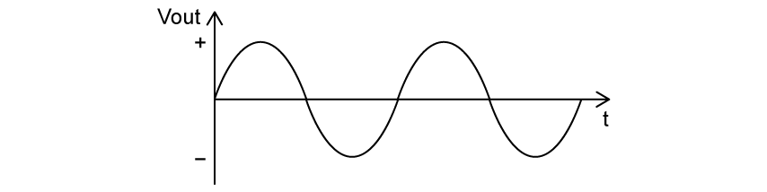{.question-figure fig-alt="Alternating input voltage"}

Sketch the variation of time with output voltage during

**(i)** half-wave rectification on Fig. 1.1b `[2]`

{.question-figure fig-alt="Axes for half-wave rectified output"}

**(ii)** full-wave rectification on Fig. 1.1c `[2]`

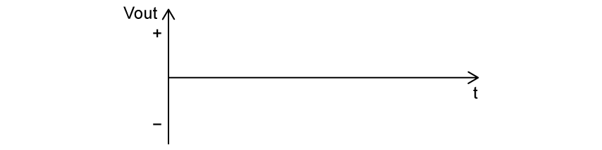{.question-figure fig-alt="Axes for full-wave rectified output"}

`[4 marks]`

**(c)** A capacitor is placed in parallel with a resistive load to smooth the rectified voltage. The graph of the smoothed output voltage against time gives a ‘ripple’ shape as shown in Fig. 1.2.

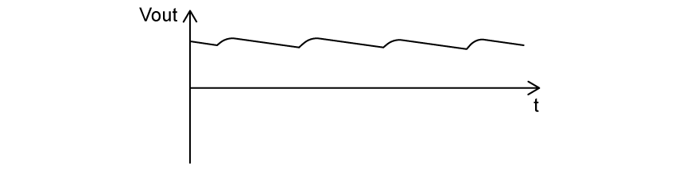{.question-figure fig-alt="Ripple in a smoothed rectified voltage"}

State how the ‘ripples’ in the graph can be reduced. `[2 marks]`

**(d)** Fig. 1.3a shows a diode bridge circuit. It is designed to allow current to flow in certain pathways depending on the input direction of the current.

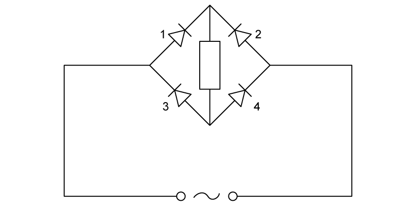{.question-figure fig-alt="Bridge rectifier with diodes numbered 1 to 4"}

Draw the path of the current

**(i)** on Fig. 1.3b `[1]`

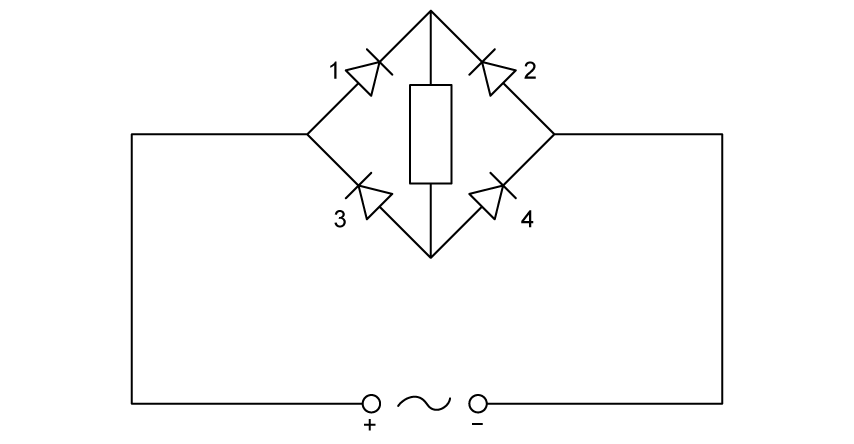{.question-figure fig-alt="Bridge rectifier with left input positive"}

**(ii)** on Fig. 1.3c `[1]`

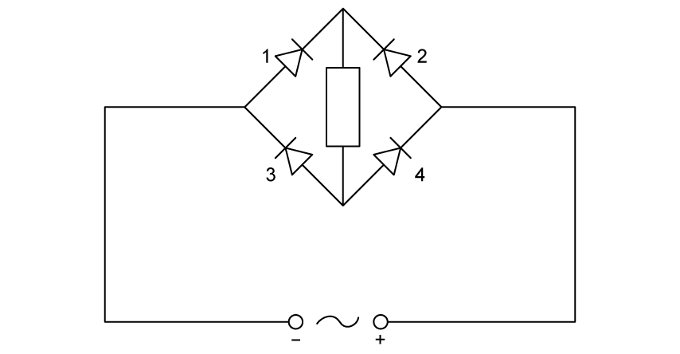{.question-figure fig-alt="Bridge rectifier with right input positive"}

`[2 marks]`

Show mark scheme / model answer

- **(a)(i)** Rectification is the conversion of a.c. into d.c. `[1]`
- **(a)(ii)** Smoothing is the reduction in variation of the output current or voltage. `[1]`
- **(b)(i)** Draw equal positive half-sine pulses and a zero output throughout every negative half-cycle. `[2]`
- **(b)(ii)** Reflect every negative half-cycle above the time axis, giving equal positive half-sine pulses with no missing half-cycles. `[2]`
- **(c)** Use a capacitor with greater capacitance `[1]` and a load resistor with greater resistance. `[1]`
- **(d)(i)** With the left input positive, current passes through diodes 1 and 4 only and through the load from top to bottom. `[1]`
- **(d)(ii)** With the right input positive, current passes through diodes 2 and 3 only and still through the load from top to bottom. `[1]`

:::

### 21.1 Properties and Uses of Alternating Current — Medium

::: {.question-card}
### Example 4 · Completing a bridge rectifier and analysing a sinusoidal supply · 21.1 SQ Medium Q1

**(a)** Alternating current (a.c.) is converted into direct current (d.c.) using a full-wave rectification circuit. Part of the diagram of this circuit is shown in Fig. 1.1.

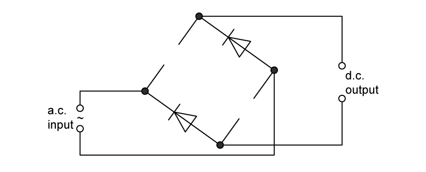{.question-figure fig-alt="Incomplete full-wave bridge rectifier"}

**(i)** On Fig. 1.1, identify the negative output terminal of the rectifier with a $(-)$. `[1]`

**(ii)** Complete the circuit in Fig. 1.1 by adding the necessary components in the gaps. `[1]`

`[2 marks]`

**(b)** The output voltage $V$ of an a.c. power supply varies sinusoidally with time $t$ as shown in Fig. 1.2.

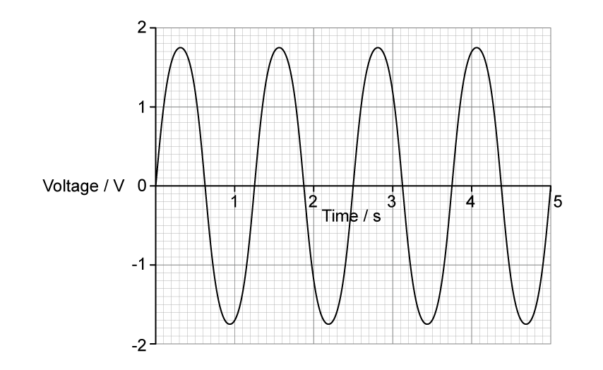{.question-figure fig-alt="Sinusoidal voltage against time from zero to five seconds"}

Determine the equation for $V$ in terms of $t$, where $V$ is in volts and $t$ is in seconds. `[2 marks]`

**(c)** The supply is connected to a $25\ \Omega$ resistor. Calculate the mean power dissipated in the resistor.

$$\text{mean power}=\ ........................................\ \mathrm{W}$$

`[2 marks]`

Show mark scheme / model answer

- **(a)(i)** Mark the upper d.c. output terminal as negative. `[1]`
- **(a)(ii)** Add one diode in each empty diagonal gap, both oriented diagonally upwards to the right as shown by the existing pair. `[1]`
- **(b)** From the graph, $V_0=1.7\ \mathrm{V}$ and $T=1.25\ \mathrm{s}$. Thus $\omega=2\pi/T=5.03\ \mathrm{rad\ s^{-1}}$ and $V=1.7\sin(5.03t)$. `[2]`
- **(c)** $P_0=V_0^2/R=1.7^2/25=0.116\ \mathrm{W}$ `[1]`; $P_{\mathrm{mean}}=P_0/2=0.058\ \mathrm{W}$. `[1]`

:::

::: {.question-card}
### Example 5 · Full-wave bridge output and capacitor smoothing · 21.1 SQ Medium Q2

**(a)** Fig. 1.1 shows four diodes and a load resistor of resistance $2.4\ \mathrm{k\Omega}$, connected in a circuit that is used to produce rectification of an alternating voltage.

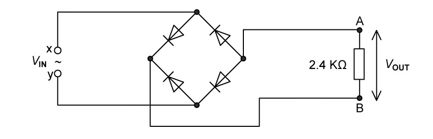{.question-figure fig-alt="Four-diode bridge rectifier connected to a 2.4 kilo-ohm load"}

**(i)** State what is meant by rectification. `[1]`

**(ii)** State the type of rectification produced by the circuit in Fig. 1.1. `[1]`

`[2 marks]`

**(b)** A sinusoidal alternating voltage $V_{\mathrm{IN}}$ is applied across the input terminals X and Y. The variation with time $t$ of $V_{\mathrm{IN}}$ is given by the equation

$$V_{\mathrm{IN}}=3.0\sin(20\pi t)$$

where $V_{\mathrm{IN}}$ is in volts and $t$ is in seconds.

**(i)** Label the output terminals A and B, on Fig. 1.1, with the appropriate symbols to indicate the polarity of the output voltage $V_{\mathrm{OUT}}$. `[1]`

**(ii)** The magnitude of the output voltage $V_{\mathrm{OUT}}$ varies with $t$ as shown in Fig. 1.2.

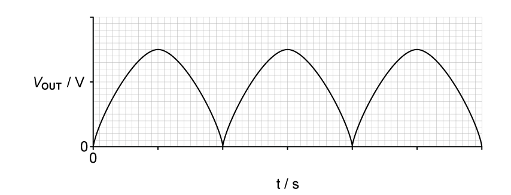{.question-figure fig-alt="Unlabelled full-wave rectified output graph"}

Label both the axes with the correct scales on Fig. 1.2. Use the space below for any working that you need. `[4 marks]`

**(c)** The output voltage in **(b)** is smoothed by adding a capacitor to the circuit in Fig. 1.1.

The difference between the maximum and minimum values of the smoothed output voltage is 15% of the peak voltage.

**(i)** On Fig. 1.1, draw the circuit symbol for a capacitor showing the capacitor correctly connected into the circuit. `[1]`

**(ii)** On Fig. 1.2, sketch the variation with $t$ of the smoothed output voltage. `[2]`

`[3 marks]`

Show mark scheme / model answer

- **(a)(i)** Rectification is conversion from a.c. to d.c. `[1]`
- **(a)(ii)** Full-wave rectification. `[1]`
- **(b)(i)** A is negative and B is positive. `[1]`
- **(b)(ii)** The vertical maximum is $3.0\ \mathrm{V}$; suitable labels include $2$ and $3\ \mathrm{V}$. Since $\omega=20\pi$, the input period is $T=2\pi/\omega=0.10\ \mathrm{s}$ and the full-wave peaks are $0.050\ \mathrm{s}$ apart. Label the time ticks $0.025$, $0.050$, $0.075$, $0.100$, $0.125$ and $0.150\ \mathrm{s}$. `[4]`
- **(c)(i)** Draw a capacitor in parallel with the $2.4\ \mathrm{k\Omega}$ load resistor. `[1]`
- **(c)(ii)** $15\%$ of $3.0\ \mathrm{V}$ is $0.45\ \mathrm{V}$, so each ripple falls from $3.0\ \mathrm{V}$ to approximately $2.55\ \mathrm{V}$ before recharging at the next peak. Draw repeated downward-sloping discharge sections joined to the rectified peaks. `[2]`

:::

::: {.question-card}
### Example 6 · Mean power, power waveform and a piezoelectric crystal · 21.1 SQ Medium Q3

**(a)** A sinusoidal alternating voltage has a root-mean-square (r.m.s.) potential difference (p.d.) of $5.1\ \mathrm{V}$ and a frequency of $40\ \mathrm{Hz}$.

The alternating voltage is applied across a resistor of resistance $1430\ \Omega$.

Calculate the mean power dissipated by the resistor in mW. `[2 marks]`

**(b)** On Fig. 1.1, draw a smooth curve to show how the power $P$ dissipated in the resistor varies with time $t$ between $t=0$ and $t=100\ \mathrm{ms}$.

Assume that $P=0$ when $t=0$.

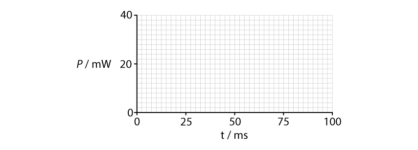{.question-figure fig-alt="Blank power-time graph from zero to 100 milliseconds"}

`[4 marks]`

**(c)** The alternating voltage in **(a)** is now applied to a piezoelectric crystal in air.

Explain what happens to the air surrounding the crystal. `[3 marks]`

Show mark scheme / model answer

- **(a)** $P_{\mathrm{mean}}=V_{\mathrm{rms}}^2/R=5.1^2/1430=0.018\ \mathrm{W}=18\ \mathrm{mW}$. `[2]`
- **(b)** $P_0=2P_{\mathrm{mean}}=36\ \mathrm{mW}$. `[1]` The PDF model answer shows four positive sinusoidal peaks reaching $36\ \mathrm{mW}$ `[1]`, with the curve on the time axis `[1]` and $P=0$ at $0$, $25$, $50$, $75$ and $100\ \mathrm{ms}$. `[1]`
- **(c)** The alternating p.d. makes the crystal vibrate. `[1]` Its vibrations make the surrounding air vibrate. `[1]` The PDF model answer states that the vibration is in the ultrasound range. `[1]`

> **Source check:** the original question states $40\ \mathrm{Hz}$, but the supplied PDF answer calls this ultrasound; these two statements are inconsistent because $40\ \mathrm{Hz}$ is audible. The power curve supplied in the PDF also follows the $40\ \mathrm{Hz}$ waveform rather than the expected doubled power frequency. The question wording and the PDF answer have both been retained above.

:::
