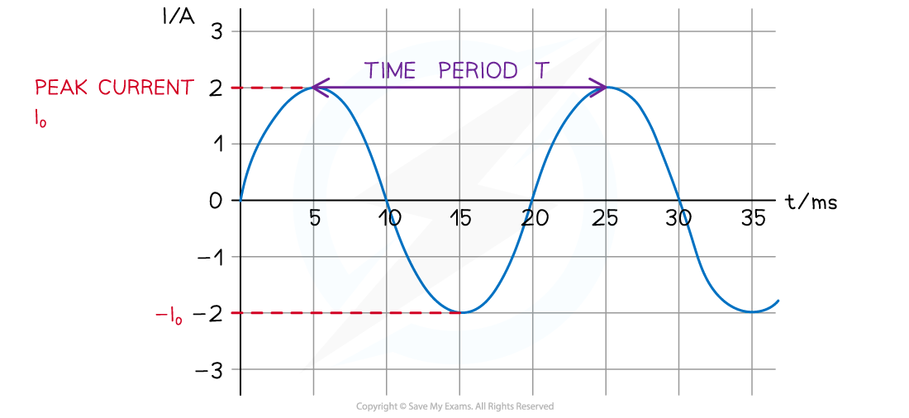
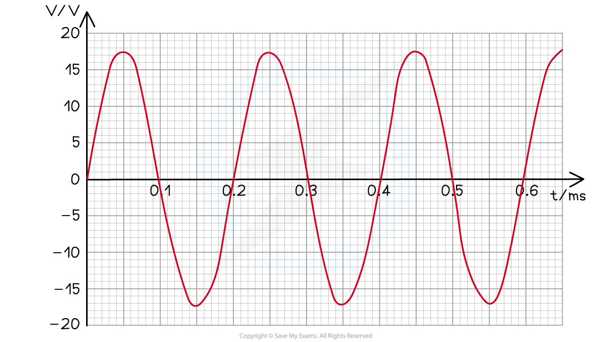
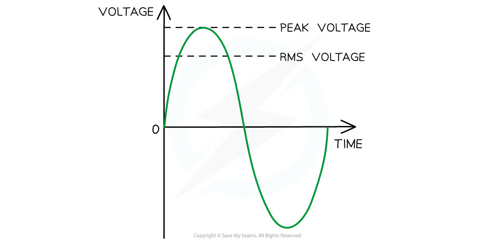
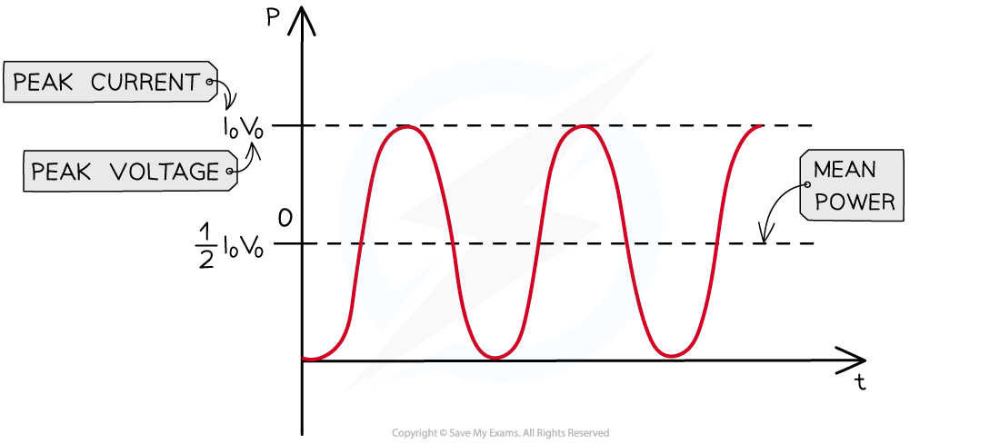
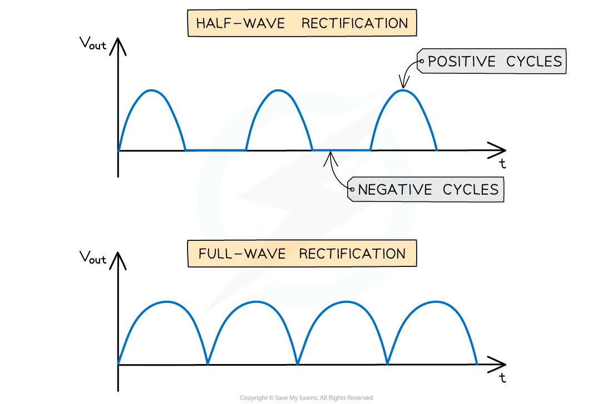
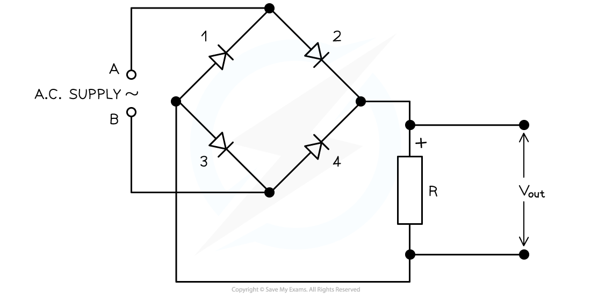
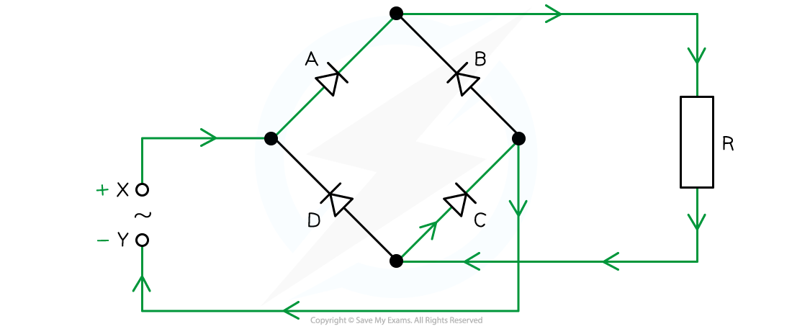
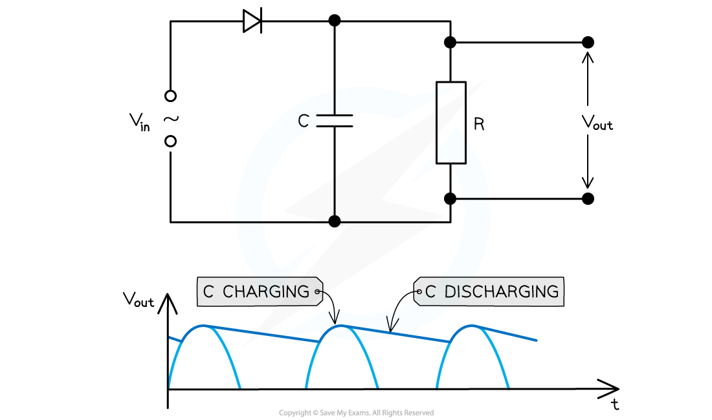

## Learning objectives

By the end of this chapter, you should be able to:

- identify the period, frequency and peak value of an alternating current or voltage;
- use $x=x_0\sin\omega t$ and $\omega=2\pi f$;
- distinguish peak and root-mean-square values;
- calculate mean and peak power in a resistive load;
- recognise and sketch half-wave and full-wave rectified outputs;
- explain the operation of a single-diode rectifier and a bridge rectifier;
- explain capacitor smoothing and the effects of capacitance and load resistance.

## 21.1 Characteristics of alternating currents

::: {.study-card}
### Alternating current and voltage

An alternating current (a.c.) changes continuously in magnitude and reverses direction every half-cycle. An alternating voltage reverses polarity in the same way. A sinusoidal supply is represented by a sine curve centred on zero.

The **peak value** $I_0$ or $V_0$ is the maximum magnitude. The **period** $T$ is the time for one complete cycle, and the **frequency** $f$ is the number of cycles per second:

$$f=\frac{1}{T}.$$

The period is measured between equivalent points on successive cycles, such as peak to peak or zero crossing to zero crossing in the same direction. Always convert graph time units to seconds before calculating frequency.
:::

::: {.knowledge-figure}
{fig-alt="Alternating current waveform showing peak current and the time period between successive peaks"}

The amplitude is the distance from the zero line to a peak. The period is the horizontal distance between matching points on neighbouring cycles.
:::

::: {.formula-panel}
### Sinusoidal representation

For a sinusoidal current or voltage,

$$I=I_0\sin(\omega t), \qquad V=V_0\sin(\omega t),$$

where $\omega$ is angular frequency in $\mathrm{rad\ s^{-1}}$:

$$\omega=2\pi f=\frac{2\pi}{T}.$$

The sign gives the instantaneous direction or polarity. At $t=0$, the form above starts at zero and initially increases. A phase shift can be included when the waveform does not start at a zero crossing. Use radians when evaluating the sine function.
:::

::: {.knowledge-figure}
{fig-alt="Sinusoidal alternating voltage waveform plotted against time"}

For a sinusoidal waveform, the maximum value is the amplitude and the angular frequency controls how rapidly the cycles repeat.
:::

::: {.example-card}
### Worked Example 1 · Reading a sinusoidal waveform

An alternating current graph has a peak current of $2.0\ \mathrm{A}$. Successive positive peaks are $20\ \mathrm{ms}$ apart. Determine the period and frequency.

**Solution**

The peak-to-peak separation is one complete cycle:

$$T=20\times10^{-3}=2.0\times10^{-2}\ \mathrm{s}.$$

Therefore,

$$f=\frac{1}{T}=\frac{1}{2.0\times10^{-2}}=50\ \mathrm{Hz}.$$

**Answer:** $T=20\ \mathrm{ms}$ and $f=50\ \mathrm{Hz}$.
:::

::: {.example-card}
### Worked Example 2 · Using a sinusoidal equation

The current in a circuit is

$$I=4.0\sin(100\pi t),$$

where $I$ is in amperes and $t$ is in seconds. Find the peak current, frequency and current at $t=3.0\ \mathrm{ms}$.

**Solution**

Comparing with $I=I_0\sin(\omega t)$ gives

$$I_0=4.0\ \mathrm{A},\qquad \omega=100\pi\ \mathrm{rad\ s^{-1}}.$$

Hence,

$$f=\frac{\omega}{2\pi}=50\ \mathrm{Hz}.$$

At $t=3.0\times10^{-3}\ \mathrm{s}$,

$$I=4.0\sin(100\pi\times3.0\times10^{-3})
  =4.0\sin(0.3\pi)
  =3.2\ \mathrm{A}.$$

**Answer:** $I_0=4.0\ \mathrm{A}$, $f=50\ \mathrm{Hz}$ and $I\approx3.2\ \mathrm{A}$.
:::

::: {.study-card}
### Root-mean-square values

The r.m.s. value of an alternating current is the value of a steady direct current that produces the same mean power in a resistor. The corresponding definition applies to voltage.

For a sinusoidal waveform,

$$I_{\mathrm{rms}}=\frac{I_0}{\sqrt2}, \qquad V_{\mathrm{rms}}=\frac{V_0}{\sqrt2}.$$

Thus an r.m.s. value is approximately $0.707$ of its peak value. It is not the simple arithmetic mean of the positive and negative values, which would be zero over a complete cycle.
:::

::: {.knowledge-figure}
{fig-alt="Sinusoidal voltage waveform showing peak voltage and root-mean-square voltage"}

The r.m.s. level is below the peak level but represents the equivalent steady d.c. value for heating or power calculations in a resistor.
:::

::: {.formula-panel}
### Power in a resistive load

The instantaneous power is always non-negative because $P=I^2R=V^2/R$. For a sinusoidal supply,

$$P_{\mathrm{mean}}=I_{\mathrm{rms}}^2R
=V_{\mathrm{rms}}I_{\mathrm{rms}}
=\frac{V_{\mathrm{rms}}^2}{R}.$$

Since $I_{\mathrm{rms}}=I_0/\sqrt2$ and $V_{\mathrm{rms}}=V_0/\sqrt2$,

$$P_{\mathrm{mean}}=\frac12P_0.$$

The power waveform has twice the frequency of the current or voltage waveform because $I^2$ and $V^2$ are unchanged when the current or voltage reverses direction. It reaches zero twice in each electrical cycle.
:::

::: {.knowledge-figure}
{fig-alt="Instantaneous power waveform for an alternating supply showing peak and mean power"}

Power is never negative in a purely resistive load. The mean power is the average height of the power waveform over a complete cycle.
:::

::: {.example-card}
### Worked Example 3 · r.m.s. voltage and mean power

A sinusoidal supply has a peak voltage of $325\ \mathrm{V}$ and is connected to a $50\ \Omega$ resistor. Calculate the r.m.s. voltage, mean power and peak power.

**Solution**

$$V_{\mathrm{rms}}=\frac{V_0}{\sqrt2}
  =\frac{325}{\sqrt2}=230\ \mathrm{V}.$$

The mean power is

$$P_{\mathrm{mean}}=\frac{V_{\mathrm{rms}}^2}{R}
  =\frac{230^2}{50}=1.06\times10^3\ \mathrm{W}.$$

The peak power is

$$P_0=\frac{V_0^2}{R}=\frac{325^2}{50}=2.11\times10^3\ \mathrm{W}.$$

**Answer:** $V_{\mathrm{rms}}=230\ \mathrm{V}$, $P_{\mathrm{mean}}=1.06\ \mathrm{kW}$ and $P_0=2.11\ \mathrm{kW}$.
:::

## 21.2 Rectification and smoothing

::: {.study-card}
### Rectification

Rectification is the conversion of alternating current or voltage into direct current or voltage.

- **Half-wave rectification:** one diode conducts during one half-cycle and blocks the other. The load receives separated pulses at the input frequency.
- **Full-wave rectification:** both half-cycles produce current through the load in the same direction. The output pulse frequency is twice the input frequency, so more mean power is available.

A rectified output is unidirectional but is not yet a steady d.c. supply. The diode is forward biased when its anode is at a higher potential than its cathode, and reverse biased in the opposite half-cycle.
:::

::: {.knowledge-figure}
{fig-alt="Half-wave and full-wave rectified voltage waveforms"}

Half-wave rectification removes one half-cycle. Full-wave rectification flips the negative half-cycle so that both halves produce output of the same polarity.
:::

::: {.example-card}
### Worked Example 4 · Rectified frequency

An a.c. supply has frequency $50\ \mathrm{Hz}$. What is the pulse frequency after half-wave rectification and after full-wave rectification?

**Solution**

- In half-wave rectification, one output pulse appears per input cycle, so

  $$f_{\mathrm{half}}=50\ \mathrm{Hz}.$$

- In full-wave rectification, both half-cycles are used, so two output pulses appear per input cycle:

  $$f_{\mathrm{full}}=2f=100\ \mathrm{Hz}.$$

**Answer:** $50\ \mathrm{Hz}$ for half-wave and $100\ \mathrm{Hz}$ for full-wave rectification.
:::

::: {.study-card}
### Bridge rectifier

A bridge rectifier uses four diodes. During each half-cycle, one diagonally opposite pair is forward biased while the other pair is reverse biased. On the next half-cycle the conducting pair changes, but current through the load remains in the same direction.

To analyse a bridge, mark the instantaneous positive input terminal, follow conventional current only through forward-biased diodes, and verify that it crosses the load in the required direction. Two diodes conduct in each half-cycle, so an ideal bridge has two diode drops in series with the load when the diodes are not ideal.
:::

::: {.knowledge-figure}
{fig-alt="Four-diode bridge rectifier connected to an alternating supply and load resistor"}

The bridge arrangement makes the current through the load have the same direction during both half-cycles of the input.
:::

::: {.knowledge-figure}
{fig-alt="Conventional current path through the conducting pair of a bridge rectifier"}

For a particular half-cycle, trace the path from the positive input terminal through one forward-biased diode, the load, the second forward-biased diode and back to the negative input terminal. The other two diodes are reverse biased.
:::

::: {.example-card}
### Worked Example 5 · Current in an ideal bridge rectifier

An ideal bridge rectifier is supplied by a sinusoidal secondary voltage of $12\ \mathrm{V}$ r.m.s. and is connected to a $100\ \Omega$ resistor. Find the peak current in the load.

**Solution**

The peak input voltage is

$$V_0=\sqrt2V_{\mathrm{rms}}=\sqrt2(12)=17.0\ \mathrm{V}.$$

For ideal diodes, the peak load voltage is also $17.0\ \mathrm{V}$. Therefore,

$$I_0=\frac{V_0}{R}=\frac{17.0}{100}=0.170\ \mathrm{A}.$$

**Answer:** the peak load current is $0.170\ \mathrm{A}$. The current direction through the resistor is the same for both half-cycles.
:::

::: {.study-card}
### Capacitor smoothing

A smoothing capacitor is connected in parallel with the load. It charges when the rectified input rises towards a peak and discharges through the load while the input falls. The output therefore stays positive but contains a ripple.

Smoothing improves when the discharge is slower:

- increase capacitance $C$;
- increase load resistance $R$;
- use full-wave rather than half-wave rectification, reducing the time between peaks.

The relevant time constant is $\tau=RC$. Small ripple requires $\tau$ to be large compared with the interval between adjacent rectified peaks. Greater smoothing reduces ripple but does not make the output perfectly constant. For the same input frequency, full-wave rectification gives twice as many charging opportunities and usually produces less ripple than half-wave rectification.
:::

::: {.knowledge-figure}
{fig-alt="Bridge rectifier with a capacitor connected across the load and a smoothed output waveform"}

The capacitor charges rapidly near each input peak and discharges more slowly through the load between peaks. The remaining variation is the ripple voltage.
:::

::: {.example-card}
### Worked Example 6 · Choosing a smoothing capacitor

A rectifier supplies a $2.6\ \mathrm{k\Omega}$ load. A $800\ \mathrm{\mu F}$ capacitor is connected across the load. Calculate the time constant and explain whether the capacitor discharges substantially between full-wave peaks of a $50\ \mathrm{Hz}$ supply.

**Solution**

$$\tau=RC=(2.6\times10^3)(800\times10^{-6})=2.08\ \mathrm{s}.$$

For full-wave rectification, the ripple frequency is

$$f_{\mathrm{ripple}}=2(50)=100\ \mathrm{Hz},$$

so the time between charging peaks is

$$\Delta t=\frac{1}{100}=0.010\ \mathrm{s}.$$

Since $\tau=2.08\ \mathrm{s}$ is much greater than $\Delta t=0.010\ \mathrm{s}$, the voltage falls only a small amount between peaks. The output is therefore well smoothed, although not perfectly steady.
:::

::: {.example-card}
### Worked Example 7 · Improving the smoothing

A smoothed output has excessive ripple. State the effect of each change:

1. doubling the capacitance;
2. doubling the load resistance;
3. changing from half-wave to full-wave rectification.

**Solution**

1. Doubling $C$ doubles $\tau=RC$, so the capacitor discharges more slowly and the ripple decreases.
2. Doubling $R$ also doubles $\tau$, so the load current is smaller and the ripple decreases.
3. Full-wave rectification halves the time between successive peaks, giving the capacitor more frequent charging opportunities and reducing the ripple.

In every case, the output remains pulsating d.c.; smoothing does not create a perfectly constant voltage.
:::

## Structured Questions



## Chapter checklist

- [ ] I can read $V_0$, $T$ and $f$ from a graph.
- [ ] I can obtain amplitude and angular frequency from a sinusoidal equation.
- [ ] I can convert between peak and r.m.s. values.
- [ ] I can calculate mean and peak power in a resistor.
- [ ] I can sketch half-wave, full-wave and smoothed outputs.
- [ ] I can trace both conducting paths through a bridge rectifier.
- [ ] I can explain how $C$ and load $R$ affect ripple.

### Original question PDFs

- [21.1 Properties and Uses of Alternating Current — Easy](https://raw.githubusercontent.com/nanoxsj/CIE-Physics-Study/main/resources/original-papers/alternating-currents/21.1-properties-and-uses-easy.pdf)
- [21.1 Properties and Uses of Alternating Current — Medium](https://raw.githubusercontent.com/nanoxsj/CIE-Physics-Study/main/resources/original-papers/alternating-currents/21.1-properties-and-uses-medium.pdf)
