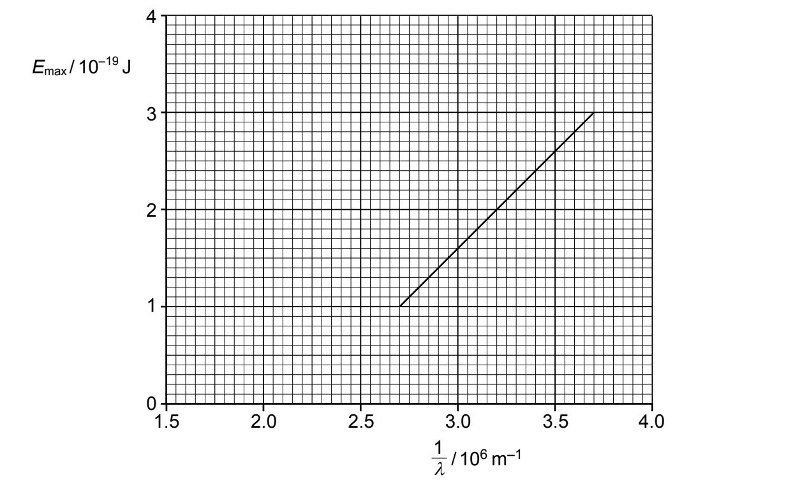
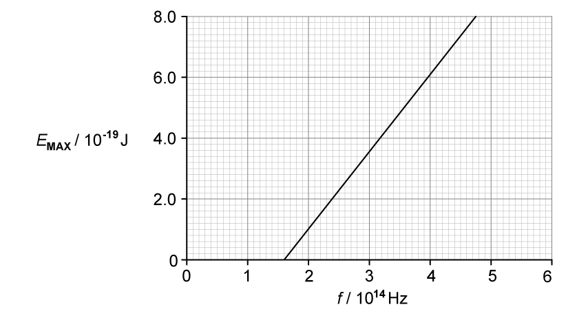
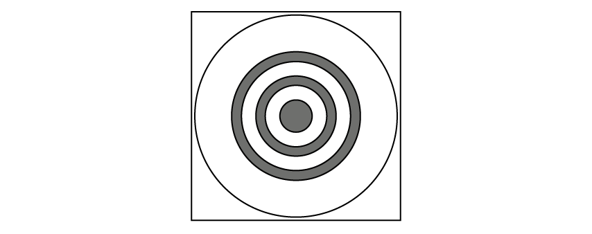
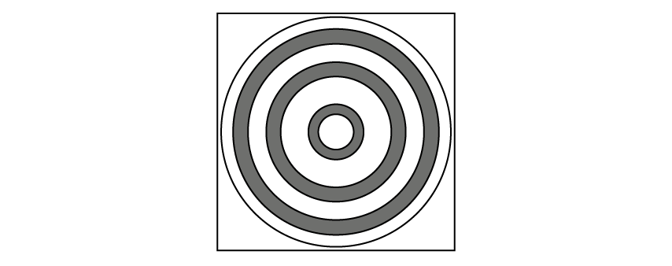
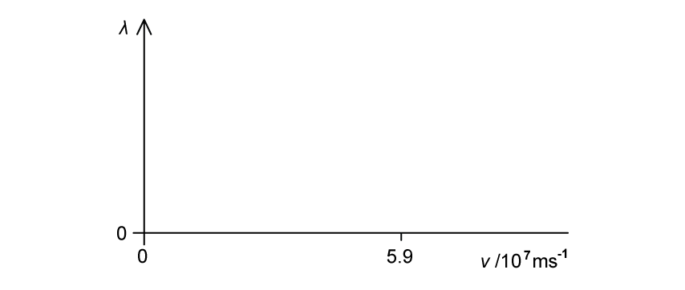
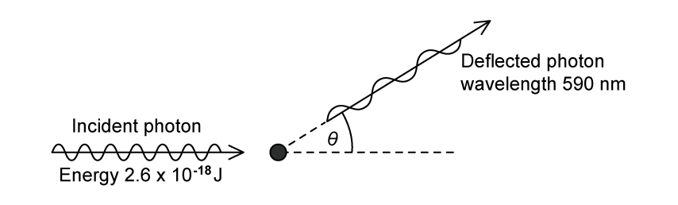
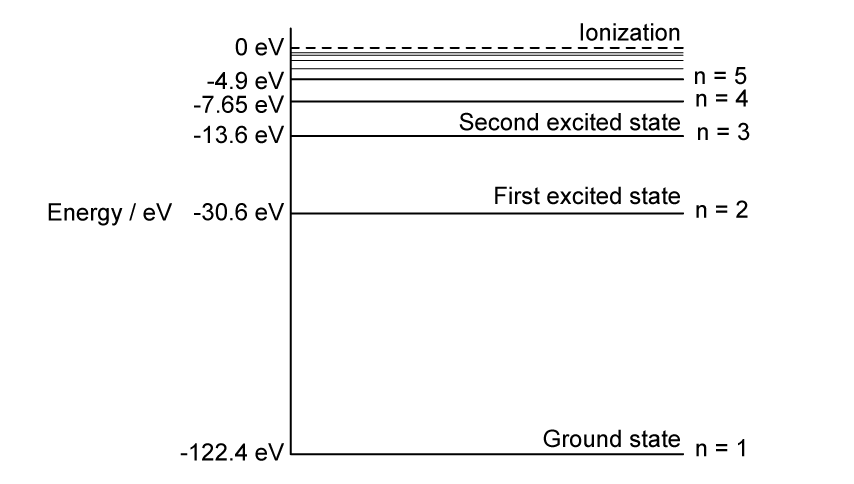
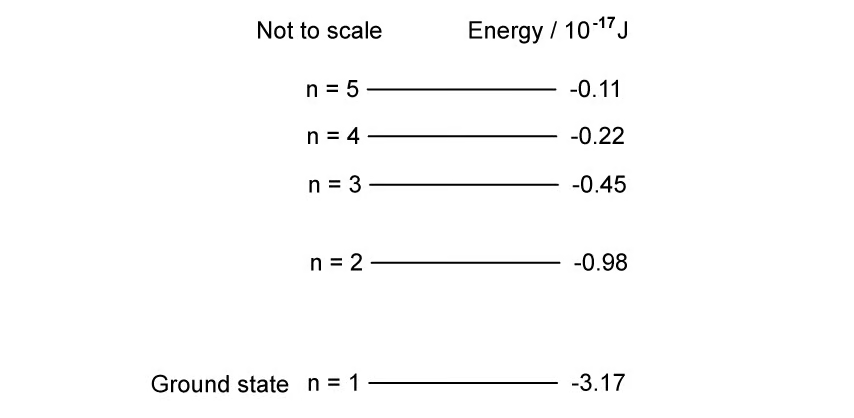
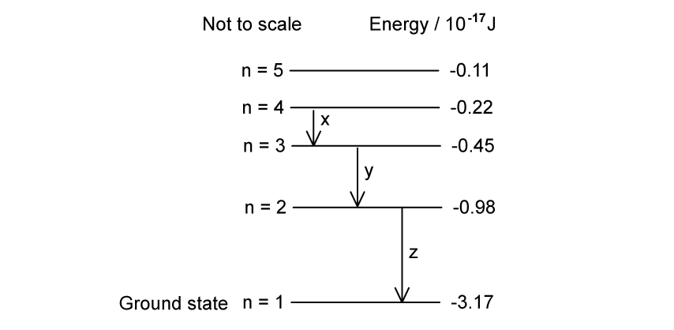
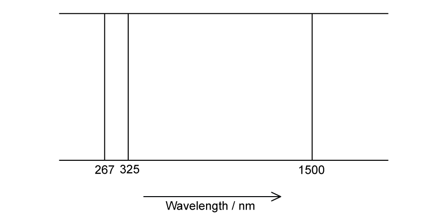

### 22.1 The Photoelectric Effect — Medium

::: {.question-card}
### Example 1 · Photoelectric evidence and a reciprocal-wavelength graph · 22.1 SQ Medium Q1

**(a)** Describe two phenomena associated with the photoelectric effect that cannot be explained using a wave theory of light. `[2 marks]`

**(b)** The maximum energy $E_{\max}$ of electrons emitted from a metal surface when illuminated by light of wavelength $\lambda$ is given by the expression

$$E_{\max}=hc\left(\frac{1}{\lambda}-\frac{1}{\lambda_0}\right)$$

where $h$ is the Planck constant and $c$ is the speed of light.

**(i)** Identify the symbol $\lambda_0$. `[1]`

**(ii)** The variation with $1/\lambda$ of $E_{\max}$ for the metal surface is shown in Fig. 8.1.

{.question-figure fig-alt="Maximum photoelectron energy against reciprocal wavelength"}

Use Fig. 8.1 to determine the magnitude of $\lambda_0$. `[1]`

**(iii)** Use the gradient of Fig. 8.1 to determine a value for the Planck constant $h$. Show your working. `[3]`

`[5 marks]`

**(c)** The metal surface in **(b)** becomes oxidised.

Photoelectric emission is still observed but the work function energy is increased.

On Fig. 8.1, draw a line to show the variation with $1/\lambda$ of $E_{\max}$ for the oxidised surface. `[2 marks]`

Show mark scheme / model answer

- **(a)** Any two: no emission below the threshold frequency; maximum electron energy depends on incident frequency; maximum electron energy does not depend on intensity; emission is instantaneous. `[2]`
- **(b)(i)** $\lambda_0$ is the threshold wavelength, the maximum incident wavelength that causes photoelectric emission. `[1]`
- **(b)(ii)** Extrapolation gives $1/\lambda_0\approx2.2\times10^6\ \mathrm{m^{-1}}$, so $\lambda_0\approx4.5\times10^{-7}\ \mathrm{m}$. `[1]`
- **(b)(iii)** Gradient $=hc$. Using $(3.7\times10^6,3.0\times10^{-19})$ and $(2.7\times10^6,1.0\times10^{-19})$ gives a gradient of $2.0\times10^{-25}\ \mathrm{J\,m}$. `[2]` Hence $h=(2.0\times10^{-25})/(3.00\times10^8)=6.7\times10^{-34}\ \mathrm{J\,s}$. `[1]`
- **(c)** Draw a straight line with the same positive gradient `[1]`, but with its extrapolated $1/\lambda$ intercept greater than $2.2\times10^6\ \mathrm{m^{-1}}$. `[1]`

:::

::: {.question-card}
### Example 2 · Photon definition and maximum-energy graph · 22.1 SQ Medium Q2

**(a)** State what is meant by a photon. `[2 marks]`

**(b)** Electromagnetic radiation of a varying frequency $f$ and constant intensity $I$ is used to illuminate a metal surface. At certain frequencies, electrons are emitted from the surface of the metal.

**(i)** State the name of this phenomenon. `[1]`

**(ii)** The variation with $f$ of the maximum kinetic energy $E_{\mathrm{MAX}}$ of the emitted electrons is shown in Fig. 1.1.

{.question-figure fig-alt="Maximum photoelectron kinetic energy against frequency"}

Describe four conclusions that can be drawn from the graph in Fig. 1.1. The conclusions may be qualitative or quantitative. `[4]`

`[5 marks]`

**(c)** The experiment in **(b)** is carried out twice more. Each time one change is made to the method used.

State, and explain, how the graph obtained would compare with Fig. 1.1 when:

**(i)** the same metal is used, but with electromagnetic radiation of intensity $\frac12I$; `[2]`

**(ii)** a different metal is used, but the intensity $I$ of the radiation is the same. `[2]`

`[4 marks]`

Show mark scheme / model answer

- **(a)** A photon is a quantum or packet of energy `[1]` of electromagnetic radiation. `[1]`
- **(b)(i)** The photoelectric effect. `[1]`
- **(b)(ii)** The threshold frequency is approximately $1.6\times10^{14}\ \mathrm{Hz}$. `[1]` The gradient is Planck's constant, approximately $6.7\times10^{-34}\ \mathrm{J\,s}$. `[1]` The work function is approximately $1.06\times10^{-19}\ \mathrm{J}$. `[1]` $E_{\mathrm{MAX}}$ increases linearly with frequency. `[1]`
- **(c)(i)** The line is unchanged `[1]` because halving intensity changes photon rate, not the energy $hf$ of each photon or the maximum electron kinetic energy. `[1]`
- **(c)(ii)** The line has the same gradient but a different frequency-axis intercept `[1]` because a different metal has a different work function and threshold frequency. `[1]`

:::

::: {.question-card}
### Example 3 · Work function, photon rate and changing frequency · 22.1 SQ Medium Q3

**(a)** State what is meant by the work function energy of a metal. `[2 marks]`

**(b)** Ultraviolet radiation of frequency $8.5\times10^{14}\ \mathrm{Hz}$ is incident, in a vacuum, on a metal surface. The power of the radiation incident on the surface is $9.45\ \mathrm{mW}$. Photoelectrons are emitted with a maximum kinetic energy of $2.1\times10^{-19}\ \mathrm{J}$.

Determine the number of photons incident on the surface per unit time.

$$\text{number per unit time}=\ ........................................\ \mathrm{s^{-1}}$$

`[2 marks]`

**(c)** Calculate the work function energy $\Phi$ of the metal.

$$\Phi=\ ........................................\ \mathrm{J}$$

`[2 marks]`

**(d)** The frequency of the radiation incident on the surface in **(b)** is decreased while the power remains constant.

State and explain the effect of this change on:

**(i)** the maximum kinetic energy of the photoelectron; `[2]`

**(ii)** the rate of emission of the photoelectron. `[1]`

`[3 marks]`

Show mark scheme / model answer

- **(a)** The work function is the minimum photon energy required to remove an electron `[1]` from the metal surface with zero kinetic energy. `[1]`
- **(b)** One photon has energy $hf=(6.63\times10^{-34})(8.5\times10^{14})=5.64\times10^{-19}\ \mathrm{J}$. `[1]` Photon rate $=P/(hf)=(9.45\times10^{-3})/(5.64\times10^{-19})=1.68\times10^{16}\ \mathrm{s^{-1}}$. `[1]`
- **(c)** $hf=\Phi+E_{k\max}$, so $\Phi=5.64\times10^{-19}-2.1\times10^{-19}=3.54\times10^{-19}\ \mathrm{J}$. `[2]`
- **(d)(i)** Photon energy decreases for the same work function `[1]`, so maximum photoelectron kinetic energy decreases. `[1]`
- **(d)(ii)** At constant power, lower energy per photon means more photons per unit time, so the emission rate increases, provided the frequency remains above threshold. `[1]`

:::

### 22.2 Wave-Particle Duality — Medium

::: {.question-card}
### Example 4 · Electron diffraction and accelerating potential difference · 22.2 SQ Medium Q1

**(a)** State the formula for the de Broglie wavelength $\lambda$ of a moving particle.

State the meaning of any other symbol used. `[2 marks]`

**(b)** Electrons accelerate through a potential difference, pass through a thin crystal and are then incident on a fluorescent screen.

The pattern in Fig. 1.1 is observed on the fluorescent screen.

{.question-figure fig-alt="Concentric electron diffraction rings on a fluorescent screen"}

**(i)** State the name of the phenomenon shown by the electrons at the crystal. `[1]`

**(ii)** State what this phenomenon shows about the nature of electrons. `[1]`

**(iii)** Suggest why the thin crystal causes the phenomenon in **(b)(i)**. `[1]`

`[3 marks]`

**(c)** The potential difference used to accelerate the electron is changed.

The new pattern observed on the screen is shown in Fig. 1.2.

{.question-figure fig-alt="Electron diffraction rings with greater spacing"}

State and explain the change that has been made to the potential difference to create the pattern shown in Fig. 1.2. `[2 marks]`

Show mark scheme / model answer

- **(a)** $\lambda=h/p$ `[1]`, where $h$ is the Planck constant and $p$ is particle momentum. `[1]` Equivalently, $\lambda=h/(mv)$ with $m$ as mass and $v$ as velocity.
- **(b)(i)** Electron diffraction. `[1]`
- **(b)(ii)** Moving electrons have wave properties. `[1]`
- **(b)(iii)** The spacing between atoms or atomic planes is comparable with the electron wavelength. `[1]`
- **(c)** The accelerating p.d. is decreased. `[1]` The electrons have lower momentum and therefore a longer de Broglie wavelength, producing greater diffraction-ring spacing. `[1]`

:::

::: {.question-card}
### Example 5 · Evidence for duality and an alpha-particle wavelength · 22.2 SQ Medium Q2

**(a)** State one piece of experimental evidence for:

**(i)** the wave nature of matter; `[1]`

**(ii)** the particulate nature of electromagnetic radiation. `[1]`

`[2 marks]`

**(b)** Calculate the de Broglie wavelength $\lambda$ of an alpha-particle moving at a speed of $5.9\times10^7\ \mathrm{m\,s^{-1}}$.

$$\lambda=\ ........................................\ \mathrm{m}$$

`[3 marks]`

**(c)** The speed $v$ of the alpha-particles in **(b)(i)** is gradually reduced to zero.

On Fig. 1.1, sketch the variation with $v$ of $\lambda$.

{.question-figure fig-alt="Blank graph of de Broglie wavelength against alpha-particle speed"}

`[2 marks]`

Show mark scheme / model answer

- **(a)(i)** Electron diffraction. `[1]`
- **(a)(ii)** The photoelectric effect. `[1]`
- **(b)** $m_\alpha=4u=4(1.66\times10^{-27})=6.64\times10^{-27}\ \mathrm{kg}$. Momentum $p=mv=(6.64\times10^{-27})(5.9\times10^7)=3.92\times10^{-19}\ \mathrm{N\,s}$. `[1]` Use $\lambda=h/p$. `[1]` Hence $\lambda=(6.63\times10^{-34})/(3.92\times10^{-19})=1.69\times10^{-15}\ \mathrm{m}$. `[1]`
- **(c)** Draw a decreasing reciprocal curve with negative gradient throughout. `[1]` It does not touch either axis: $\lambda$ remains positive at $5.9\times10^7\ \mathrm{m\,s^{-1}}$ and tends to infinity as $v\to0$. `[1]`

:::

::: {.question-card}
### Example 6 · Photon scattering from an electron · 22.2 SQ Medium Q3

**(a)** Explain what is meant by the de Broglie wavelength. `[1 mark]`

**(b)** A gamma-ray photon of energy $2.6\times10^{-18}\ \mathrm{J}$ is incident on an isolated stationary electron, as illustrated in Fig. 1.1.

{.question-figure fig-alt="Gamma-ray photon scattering from a stationary electron"}

The photon is deflected elastically by the electron through angle $\theta$. The deflected photon has a wavelength of $590\ \mathrm{nm}$.

**(i)** On Fig. 1.1, draw an arrow to indicate a possible initial direction of motion of the electron after the photon has been deflected. `[1]`

**(ii)** Calculate the energy of the deflected photon.

$$\text{photon energy}=\ ........................................\ \mathrm{J}$$

`[2]`

`[3 marks]`

**(c)** Calculate the speed of the electron after the photon has been deflected.

$$\text{speed}=\ ........................................\ \mathrm{m\,s^{-1}}$$

`[3 marks]`

**(d)** Explain why the magnitude of the final momentum of the electron is not equal to the change in magnitude of the momentum of the photon. `[2 marks]`

Show mark scheme / model answer

- **(a)** The de Broglie wavelength is the wavelength associated with a moving particle. `[1]`
- **(b)(i)** Draw the electron arrow below the original horizontal photon direction and pointing to the right, so its vertical momentum balances that of the deflected photon. `[1]`
- **(b)(ii)** $E=hc/\lambda=(6.63\times10^{-34})(3.00\times10^8)/(590\times10^{-9})=3.37\times10^{-19}\ \mathrm{J}$. `[2]`
- **(c)** Energy transferred to the electron is $2.6\times10^{-18}-3.37\times10^{-19}=2.26\times10^{-18}\ \mathrm{J}$. `[1]` Using $E_k=\frac12m_ev^2$ `[1]` gives $v=\sqrt{2E_k/m_e}=2.23\times10^6\ \mathrm{m\,s^{-1}}$. `[1]`
- **(d)** Momentum is a vector quantity `[1]`, so conservation must be applied to horizontal and vertical components; changes in direction mean that magnitudes alone cannot be subtracted. `[1]`

:::

### 22.3 Quantisation of Energy — Medium

::: {.question-card}
### Example 7 · Hydrogen transitions and emitted wavelengths · 22.3 SQ Medium Q1

**(a)** The energy levels of a hydrogen atom are shown in Fig. 1.1.

{.question-figure fig-alt="Hydrogen atom energy levels from ground state to ionisation"}

Calculate the wavelength of radiation emitted when an electron falls from level $n=4$ to the ground state in the hydrogen atom. `[4 marks]`

**(b)** When an electron of energy $1.84\times10^{-17}\ \mathrm{J}$ collides with a hydrogen atom, photons of six different energies are emitted.

Sketch arrows on Fig. 1.1 to show the transitions responsible for these photons. `[3 marks]`

**(c)** Calculate the wavelength of the photon with the smallest energy. Give your answer to an appropriate number of significant figures. `[3 marks]`

**(d)** One way to excite a hydrogen atom is by the absorption of a photon.

Explain why, for a particular transition, the photon must have an exact amount of energy. `[2 marks]`

Show mark scheme / model answer

- **(a)** $\Delta E=(-7.65)-(-122.4)=114.75\ \mathrm{eV}=1.84\times10^{-17}\ \mathrm{J}$. `[1]` $f=\Delta E/h=2.78\times10^{16}\ \mathrm{Hz}$. `[1]` Use $c=f\lambda$. `[1]` Hence $\lambda=3.00\times10^8/(2.78\times10^{16})=1.08\times10^{-8}\ \mathrm{m}$. `[1]`
- **(b)** Draw all six downward transitions among levels 1 to 4: $4\to3$, $4\to2$, $4\to1$ `[1]`; $3\to2$, $3\to1$ `[1]`; and $2\to1$. `[1]`
- **(c)** The smallest gap is $4\to3$: $\Delta E=(-7.65)-(-13.6)=5.95\ \mathrm{eV}=9.53\times10^{-19}\ \mathrm{J}$. `[1]` Use $\lambda=hc/\Delta E$. `[1]` $\lambda=2.09\times10^{-7}\ \mathrm{m}$ to 3 s.f. `[1]`
- **(d)** Energy levels are discrete and excitation requires an exact energy difference. `[1]` A photon is absorbed in a one-to-one interaction, so all its energy must equal that level difference. `[1]`

:::

::: {.question-card}
### Example 8 · Energy-level transitions, spectral regions and ionisation · 22.3 SQ Medium Q2

**(a)** The lowest energy levels of a hydrogen atom are represented in Fig. 1.1.

{.question-figure fig-alt="Five lowest hydrogen energy levels in joules"}

Identify the transition that produces a photon with frequency of $3.3\times10^{16}\ \mathrm{Hz}$. `[2 marks]`

**(b)** An excited hydrogen atom can emit photons of certain discrete frequencies in various regions of the electromagnetic spectrum. Three possible transitions are shown in Fig. 1.2.

{.question-figure fig-alt="Hydrogen energy-level transitions x, y and z"}

Identify the transitions in Fig. 1.2 which produce a photon in the following regions of the electromagnetic spectrum:

**(i)** Ultraviolet `[1]`

**(ii)** Visible `[1]`

**(iii)** Infrared `[1]`

`[3 marks]`

**(c)** Explain why the emitted photons in part **(b)** have certain discrete frequencies. `[3 marks]`

**(d)** An electron in the hydrogen atom is ionised by a photon of light with frequency $5.2\times10^{16}\ \mathrm{Hz}$.

Calculate the kinetic energy of the ionised electron.

$$\text{kinetic energy}=\ ........................................\ \mathrm{J}$$

`[3 marks]`

Show mark scheme / model answer

- **(a)** Photon energy $hf=(6.63\times10^{-34})(3.3\times10^{16})=2.19\times10^{-17}\ \mathrm{J}$. `[1]` This equals $(-0.98-(-3.17))\times10^{-17}\ \mathrm{J}$, so the transition is $n=2\to n=1$. `[1]`
- **(b)(i)** Ultraviolet: transition z. `[1]`
- **(b)(ii)** Visible: transition y. `[1]`
- **(b)(iii)** Infrared: transition x. `[1]`
- **(c)** An electron moves from one fixed energy level to a lower fixed level. `[1]` The photon therefore receives a discrete energy equal to the level difference. `[1]` Since $\Delta E=hf$, discrete energies produce discrete frequencies. `[1]`
- **(d)** Ionisation energy from the ground state is $3.17\times10^{-17}\ \mathrm{J}$. `[1]` Photon energy is $hf=(6.63\times10^{-34})(5.2\times10^{16})=3.44\times10^{-17}\ \mathrm{J}$. `[1]` Hence $E_k=3.44\times10^{-17}-3.17\times10^{-17}=2.7\times10^{-18}\ \mathrm{J}$. `[1]`

:::

::: {.question-card}
### Example 9 · Three-level wavelength relation and an emission spectrum · 22.3 SQ Medium Q3

**(a)** Transitions between three energy levels in a particular atom give rise to three spectral lines.

In decreasing magnitudes, these are related to the wavelengths, $\lambda_1$, $\lambda_2$, and $\lambda_3$.

Use a diagram to show that the equation that relates $\lambda_1$, $\lambda_2$, and $\lambda_3$ is:

$$\frac{1}{\lambda_1}=\frac{1}{\lambda_2}+\frac{1}{\lambda_3}$$

`[5 marks]`

**(b)** An atom has a ground state energy of $-8.80\ \mathrm{eV}$. The complete line emission spectra for this atom is shown in Fig. 1.1.

{.question-figure fig-alt="Atomic emission lines at 267, 325 and 1500 nanometres"}

Sketch a diagram of the possible energy levels for the atomic line spectra shown in Fig. 1.1. Label each energy level with the value of its energy. `[6 marks]`

Show mark scheme / model answer

- **(a)** Draw three energy levels with the upper gap smaller than the total lower-to-upper gap. `[1]` Show the three possible downward transitions and label the largest-energy transition $\lambda_1$, with the other two $\lambda_2$ and $\lambda_3$. `[2]` Energy conservation gives $E_1=E_2+E_3$. `[1]` Substituting $E=hc/\lambda$ and cancelling $hc$ gives $1/\lambda_1=1/\lambda_2+1/\lambda_3$. `[1]`
- **(b)** For $1500\ \mathrm{nm}$, $E=hc/\lambda=1.33\times10^{-19}\ \mathrm{J}=0.83\ \mathrm{eV}$. `[1]` Hence the first excited level is $-8.80+0.83=-7.97\ \mathrm{eV}$. `[1]`
- For $325\ \mathrm{nm}$, the transition energy is $3.83\ \mathrm{eV}$. `[1]` Hence the next level is $-7.97+3.83=-4.14\ \mathrm{eV}$. `[1]`
- For $267\ \mathrm{nm}$, the transition energy is $4.66\ \mathrm{eV}$, consistent with $-8.80+4.66=-4.14\ \mathrm{eV}$. `[1]`
- Draw and label three horizontal levels at $-8.80\ \mathrm{eV}$, $-7.97\ \mathrm{eV}$ and $-4.14\ \mathrm{eV}$, with the three corresponding transitions. `[1]`

:::
