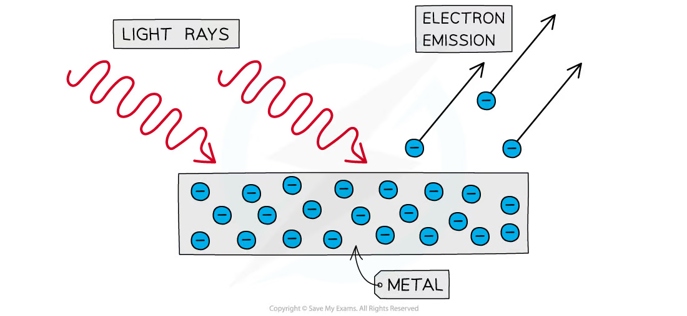
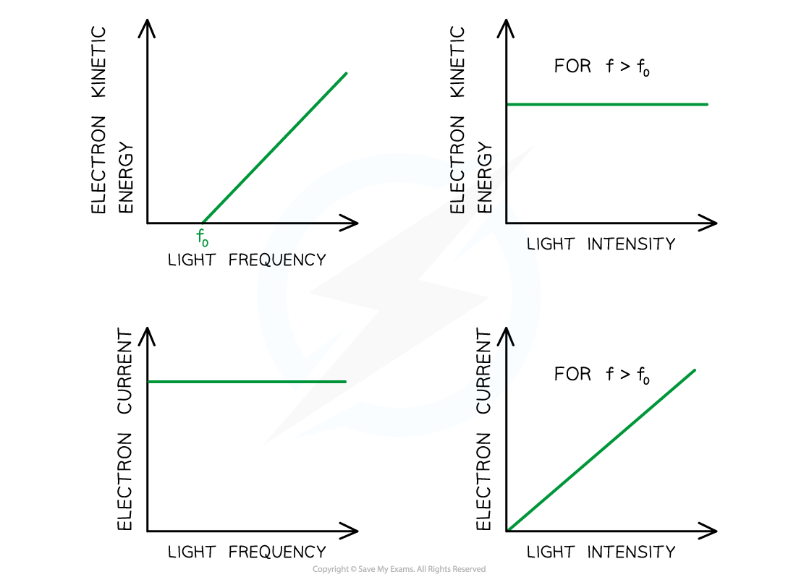
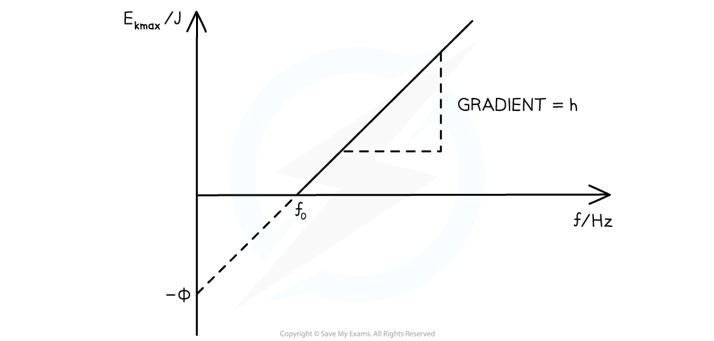
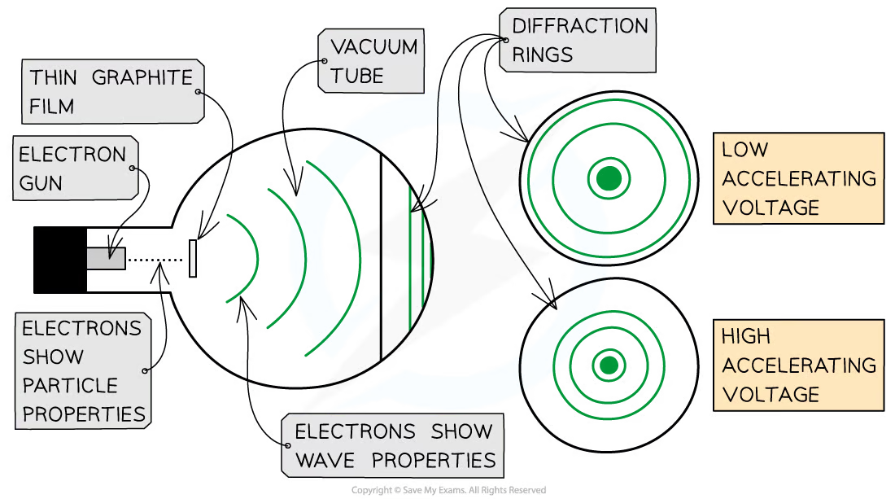
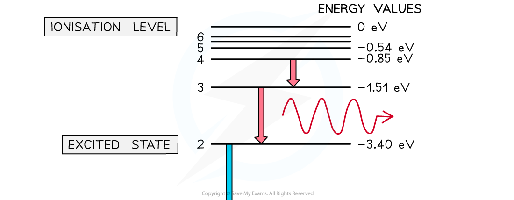
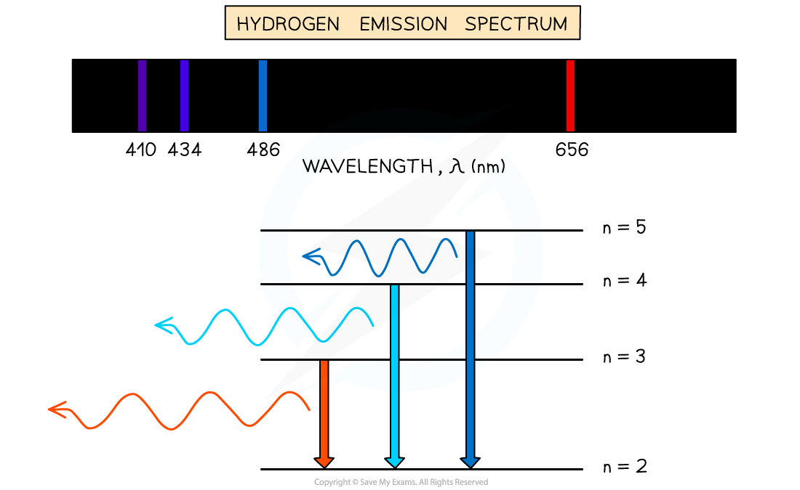
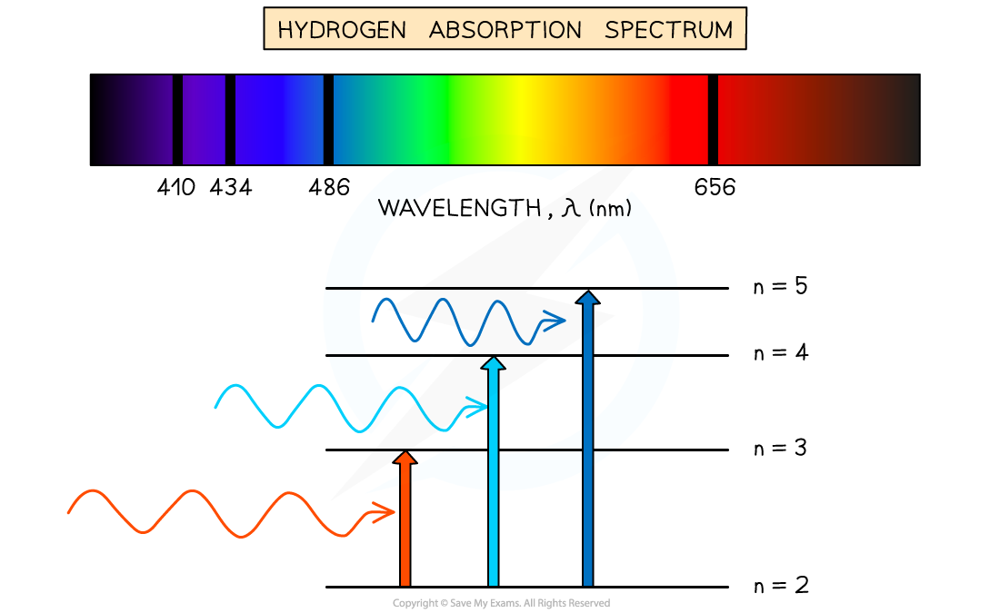

## Learning objectives

By the end of this chapter, you should be able to:

- explain the particulate nature of electromagnetic radiation;
- use $E=hf$, $E=hc/\lambda$ and $p=E/c$ for photons;
- convert between joules and electronvolts;
- explain photoelectric emission using photons and work function energy;
- use the photoelectric equation and interpret maximum-energy graphs;
- explain how frequency and intensity affect photoelectric emission;
- describe electron diffraction as evidence for matter waves;
- use the de Broglie relation $\lambda=h/p$;
- interpret atomic energy-level diagrams and line spectra;
- use $hf=E_1-E_2$ for transitions between discrete levels.

## 22.1 Energy and momentum of a photon

::: {.study-card}
### Photons and quantised energy

Electromagnetic radiation transfers energy in discrete packets called **photons**. A photon is one quantum of electromagnetic energy. Its energy depends only on frequency:

$$E=hf,$$

where $h=6.63\times10^{-34}\ \mathrm{J\,s}$. Since $c=f\lambda$,

$$E=\frac{hc}{\lambda}.$$

Higher-frequency, shorter-wavelength radiation therefore consists of more energetic photons. Intensity does not change the energy of each photon when the frequency is fixed; it changes the number of photons arriving per unit area per unit time.
:::

::: {.knowledge-figure}
{fig-alt="Electromagnetic wave labelled with the photon energy equation E equals hf"}

The photon model assigns energy to each quantum of radiation. Increasing frequency increases the energy of each photon; increasing intensity at fixed frequency increases the number of photons.
:::

::: {.formula-panel}
### Photon rate and intensity

If radiation of power $P$ is monochromatic, the number of photons emitted or incident per unit time is

$$\frac{N}{t}=\frac{P}{hf}=\frac{P\lambda}{hc}.$$

For a beam spread uniformly over area $A$, intensity is $I=P/A$. At fixed frequency, doubling intensity doubles the photon arrival rate but does not change the energy of an individual photon.
:::

::: {.study-card}
### The electronvolt

One electronvolt is the energy transferred when a charge equal to the elementary charge moves through a potential difference of one volt:

$$1\ \mathrm{eV}=1.60\times10^{-19}\ \mathrm{J}.$$

To convert eV to J, multiply by $1.60\times10^{-19}$. To convert J to eV, divide by this value. Energy-level data are often given in eV, but $E=hf$ requires consistent SI units unless all quantities are converted carefully.
:::

::: {.formula-panel}
### Photon momentum

A photon has zero rest mass but carries momentum:

$$p=\frac{E}{c}=\frac{hf}{c}=\frac{h}{\lambda}.$$

Absorption or reflection changes momentum and can produce radiation pressure. Momentum is a vector, so scattering problems require conservation in perpendicular directions, not just comparison of magnitudes.
:::

::: {.example-card}
### Worked Example 1 · Photon energy and photon rate

Monochromatic green light of wavelength $490\ \mathrm{nm}$ is emitted by a lamp of power $3.6\ \mathrm{mW}$. Calculate the energy of one photon and the number of photons emitted per second.

**Solution**

The energy of one photon is

$$E=\frac{hc}{\lambda}
  =\frac{(6.63\times10^{-34})(3.00\times10^8)}{490\times10^{-9}}
  =4.06\times10^{-19}\ \mathrm{J}.$$

The photon rate is

$$\frac{N}{t}=\frac{P}{E}
  =\frac{3.6\times10^{-3}}{4.06\times10^{-19}}
  =8.9\times10^{15}\ \mathrm{s^{-1}}.$$

**Answer:** each photon has energy $4.06\times10^{-19}\ \mathrm{J}$ and the lamp emits approximately $8.9\times10^{15}$ photons per second.
:::

::: {.example-card}
### Worked Example 2 · Photon momentum and electronvolts

Calculate the momentum and energy in eV of a photon of wavelength $700\ \mathrm{nm}$.

**Solution**

The photon energy is

$$E=\frac{hc}{\lambda}
  =\frac{(6.63\times10^{-34})(3.00\times10^8)}{700\times10^{-9}}
  =2.84\times10^{-19}\ \mathrm{J}.$$

Converting to eV,

$$E=\frac{2.84\times10^{-19}}{1.60\times10^{-19}}=1.78\ \mathrm{eV}.$$

The photon momentum is

$$p=\frac{E}{c}=\frac{2.84\times10^{-19}}{3.00\times10^8}
  =9.47\times10^{-28}\ \mathrm{kg\,m\,s^{-1}}.$$

**Answer:** $E=1.78\ \mathrm{eV}$ and $p=9.47\times10^{-28}\ \mathrm{kg\,m\,s^{-1}}$.
:::

## 22.2 Photoelectric effect

::: {.study-card}
### Photoelectric emission

Photoelectric emission is the release of electrons from a metal surface when electromagnetic radiation of sufficiently high frequency is incident on it. Each surface electron absorbs one photon in a one-to-one interaction.

The **work function energy** $\Phi$ is the minimum energy required to remove an electron from the surface with zero kinetic energy. Different metals have different work functions. The energy transferred to one electron is not shared across many photons.
:::

::: {.knowledge-figure}
{fig-alt="Light shining on a metal surface and ejecting photoelectrons"}

One photon can transfer its energy to one electron. If the photon energy exceeds the work function, the excess appears as the kinetic energy of the emitted electron.
:::

::: {.formula-panel}
### Einstein's photoelectric equation

Energy conservation for the most energetic emitted electron gives

$$hf=\Phi+E_{k\max}
=\Phi+\frac12m_ev_{\max}^2.$$

Some electrons have less kinetic energy because they lose energy before leaving the metal. No electron can have kinetic energy greater than $E_{k\max}$.
:::

::: {.study-card}
### Threshold frequency and wavelength

At the threshold frequency $f_0$, the emitted electron has zero maximum kinetic energy:

$$\Phi=hf_0=\frac{hc}{\lambda_0},$$

where $\lambda_0$ is the threshold wavelength. Emission occurs for $f\ge f_0$, equivalently $\lambda\le\lambda_0$.

Below threshold frequency, increasing intensity cannot cause emission because no individual photon has enough energy.
:::

::: {.study-card}
### Frequency and intensity effects

The photon model explains the key observations:

- emission is effectively instantaneous when $f\ge f_0$;
- there is no emission below $f_0$, regardless of intensity;
- $E_{k\max}$ and the stopping potential depend on frequency, not intensity;
- at fixed frequency above threshold, photoelectric current increases with intensity because more photons arrive each second;
- increasing intensity does not increase the maximum kinetic energy of individual electrons.
:::

::: {.knowledge-figure}
{fig-alt="Photoelectric effect comparison showing electron kinetic energy and current depend differently on frequency and intensity"}

Above threshold frequency, increasing light frequency raises the maximum electron kinetic energy. Increasing intensity at fixed frequency raises the photoelectric current, but not the maximum kinetic energy.
:::

::: {.formula-panel}
### Photoelectric graphs

From

$$E_{k\max}=hf-\Phi,$$

a graph of $E_{k\max}$ against $f$ is a straight line with gradient $h$, vertical intercept $-\Phi$ and horizontal intercept $f_0$.

::: {.knowledge-figure}
{fig-alt="Graph of maximum photoelectron kinetic energy against light frequency with gradient h and threshold frequency intercept"}
:::

Using $f=c/\lambda$,

$$E_{k\max}=hc\left(\frac1\lambda-\frac1{\lambda_0}\right).$$

A graph of $E_{k\max}$ against $1/\lambda$ has gradient $hc$ and horizontal intercept $1/\lambda_0$. Changing the metal changes $\Phi$ and the intercept, but not the gradient.
:::

::: {.example-card}
### Worked Example 3 · Work function and maximum kinetic energy

A metal has threshold frequency $4.0\times10^{14}\ \mathrm{Hz}$. Light of frequency $8.0\times10^{14}\ \mathrm{Hz}$ shines on the surface. Calculate the work function and the maximum kinetic energy of an emitted electron.

**Solution**

The work function is

$$\Phi=hf_0=(6.63\times10^{-34})(4.0\times10^{14})
  =2.65\times10^{-19}\ \mathrm{J}.$$

The incident photon energy is

$$hf=(6.63\times10^{-34})(8.0\times10^{14})
  =5.30\times10^{-19}\ \mathrm{J}.$$

Therefore,

$$E_{k\max}=hf-\Phi
  =2.65\times10^{-19}\ \mathrm{J}.$$

In eV,

$$E_{k\max}=\frac{2.65\times10^{-19}}{1.60\times10^{-19}}=1.66\ \mathrm{eV}.$$

**Answer:** $\Phi=2.65\times10^{-19}\ \mathrm{J}$ and $E_{k\max}=2.65\times10^{-19}\ \mathrm{J}=1.66\ \mathrm{eV}$.
:::

## 22.3 Wave-particle duality

::: {.study-card}
### Two complementary models

The photoelectric effect demonstrates the particulate nature of electromagnetic radiation. Interference and diffraction demonstrate its wave nature. Matter also shows dual behaviour: particles have localised impacts and momentum, but moving particles can diffract and interfere.
:::

::: {.formula-panel}
### de Broglie wavelength

The wavelength associated with a moving particle is

$$\lambda=\frac{h}{p}.$$

For a non-relativistic particle, $p=mv$, so

$$\lambda=\frac{h}{mv}.$$

Using $E_k=p^2/(2m)$ gives

$$\lambda=\frac{h}{\sqrt{2mE_k}}.$$

If a particle of charge magnitude $q$ is accelerated through a p.d. $V$, then $E_k=qV$ and

$$\lambda=\frac{h}{\sqrt{2mqV}}.$$

Increasing momentum or accelerating potential difference decreases wavelength. As $v\to0$, the non-relativistic expression predicts $\lambda\to\infty$.
:::

::: {.study-card}
### Electron diffraction

Electrons accelerated through a potential difference produce diffraction rings after passing through a thin crystalline target. The regular atomic planes act like a diffraction grating because their spacing is comparable to the electron de Broglie wavelength.

The diffraction pattern is evidence that electrons have wave properties. A lower accelerating p.d. gives lower momentum, a longer wavelength and wider diffraction-ring spacing.
:::

::: {.knowledge-figure}
{fig-alt="Electron gun and thin graphite target producing diffraction rings at different accelerating voltages"}

The rings become larger when the accelerating voltage is reduced because the electron wavelength is longer. The observation confirms the wave nature of electrons.
:::

::: {.example-card}
### Worked Example 4 · de Broglie wavelength of an electron

An electron is accelerated through a p.d. of $150\ \mathrm{V}$. Calculate its de Broglie wavelength. Take $m_e=9.11\times10^{-31}\ \mathrm{kg}$ and $e=1.60\times10^{-19}\ \mathrm{C}$.

**Solution**

The electron gains kinetic energy $E_k=eV$. Therefore,

$$\lambda=\frac{h}{\sqrt{2m_e eV}}
  =\frac{6.63\times10^{-34}}
  {\sqrt{2(9.11\times10^{-31})(1.60\times10^{-19})(150)}}
  =1.00\times10^{-10}\ \mathrm{m}.$$

**Answer:** $\lambda\approx1.0\times10^{-10}\ \mathrm{m}$, comparable with atomic spacing, so diffraction is observable.
:::

## 22.4 Energy levels in atoms and line spectra

::: {.study-card}
### Discrete energy levels

Electrons in isolated atoms can occupy only certain discrete energy levels. The lowest is the **ground state**; higher allowed levels are **excited states**. The ionisation level is conventionally assigned zero energy, so bound-state energies are negative.

An electron cannot remain between permitted levels. Excitation requires exactly the energy difference between two levels when a photon is absorbed.
:::

::: {.knowledge-figure}
{fig-alt="Atomic energy-level diagram showing excitation and photon emission between discrete levels"}

Downward transitions release photons. A transition between levels with a larger energy separation produces a higher-frequency photon and a shorter wavelength.
:::

::: {.formula-panel}
### Photon emission and absorption

For a transition between levels $E_1$ and $E_2$,

$$\Delta E=|E_1-E_2|=hf=\frac{hc}{\lambda}.$$

- Downward transition: a photon is emitted.
- Upward transition: a photon of exactly the required energy is absorbed.
- Photon energy greater than the ionisation energy: the electron is freed and the excess becomes kinetic energy.
:::

::: {.study-card}
### Line spectra

Each allowed energy difference produces one discrete photon frequency and wavelength. A hot, low-pressure gas produces bright **emission lines** when excited electrons fall to lower levels. A continuous spectrum passing through a cooler gas produces dark **absorption lines** when photons matching upward transitions are removed.

Because each element has a unique set of energy levels, its line spectrum acts as a fingerprint. The largest energy gap produces the highest frequency and shortest wavelength.
:::

::: {.knowledge-figure}
{fig-alt="Hydrogen energy-level transitions and the corresponding emission spectrum"}

The bright lines in an emission spectrum correspond to particular downward transitions. Their wavelengths can be used to identify the element.
:::

::: {.knowledge-figure}
{fig-alt="Hydrogen energy-level transitions and the corresponding absorption spectrum"}

Absorption lines occur at the same wavelengths as the corresponding emission lines because the same energy differences are involved, but the transitions are upward rather than downward.
:::

::: {.example-card}
### Worked Example 5 · Wavelength from an energy-level transition

An electron in an atom falls from an energy level of $-0.54\ \mathrm{eV}$ to a level of $-3.40\ \mathrm{eV}$. Calculate the wavelength of the emitted photon.

**Solution**

The photon energy is

$$\Delta E=(-0.54-(-3.40))\ \mathrm{eV}=2.86\ \mathrm{eV}.$$

Convert to joules:

$$\Delta E=(2.86)(1.60\times10^{-19})
  =4.58\times10^{-19}\ \mathrm{J}.$$

Using $\lambda=hc/\Delta E$,

$$\lambda=\frac{(6.63\times10^{-34})(3.00\times10^8)}{4.58\times10^{-19}}
  =4.35\times10^{-7}\ \mathrm{m}.$$

**Answer:** $\lambda\approx435\ \mathrm{nm}$, in the visible region of the electromagnetic spectrum.
:::

## Structured Questions



## Chapter checklist

- [ ] I can calculate photon energy, momentum and photon arrival rate.
- [ ] I can convert accurately between eV and J.
- [ ] I can use and explain the photoelectric equation.
- [ ] I can interpret $E_{k\max}$ graphs and distinguish frequency from intensity effects.
- [ ] I can calculate and interpret de Broglie wavelength.
- [ ] I can use energy-level diagrams to identify transitions and spectral lines.
- [ ] I can distinguish excitation, emission, absorption and ionisation.

### Original question PDFs

- [22.1 The Photoelectric Effect — Medium](https://raw.githubusercontent.com/nanoxsj/CIE-Physics-Study/main/resources/original-papers/quantum-physics/22.1-photoelectric-effect-medium.pdf)
- [22.2 Wave-Particle Duality — Medium](https://raw.githubusercontent.com/nanoxsj/CIE-Physics-Study/main/resources/original-papers/quantum-physics/22.2-wave-particle-duality-medium.pdf)
- [22.3 Quantisation of Energy — Medium](https://raw.githubusercontent.com/nanoxsj/CIE-Physics-Study/main/resources/original-papers/quantum-physics/22.3-quantisation-of-energy-medium.pdf)
