### 23.1 Mass Defect and Nuclear Binding Energy - Easy

::: {.question-card}
### Example 1 · Atomic mass unit and mass-energy equivalence · 23.1 SQ Easy Q1

**(a)** Define atomic mass unit. `[2 marks]`

**(b)** The unified atomic mass unit u is roughly equal to $1.66\times10^{-27}\ \mathrm{kg}$, which is the mass of one nucleon.

Calculate the mass, in kg, of a nucleus of uranium-238. Give your answer to 3 significant figures. `[3 marks]`

**(c)** Einstein's Theory of Relativity showed that mass could be converted into energy, and energy into mass. This is summarised by the following equation

$$\Delta E=\Delta mc^2$$

Define the terms in the equation and give the units:

**(i)** $E$ `[1]`

**(ii)** $m$ `[1]`

**(iii)** $c$ `[1]`

`[3 marks]`

**(d)** Calculate the energy released, in J, if all of the mass in the nucleus of uranium-238 were converted into energy. `[2 marks]`

Show mark scheme / model answer

- **(a)** One atomic mass unit is one twelfth of the mass `[1]` of a neutral carbon-12 atom. `[1]`
- **(b)** $m=238u=238(1.661\times10^{-27})=3.95318\times10^{-25}\ \mathrm{kg}$ `[2]`, so $m=3.95\times10^{-25}\ \mathrm{kg}$ to 3 s.f. `[1]`
- **(c)(i)** $\Delta E$ is the energy change, measured in joules. `[1]`
- **(c)(ii)** $\Delta m$ is the mass change, measured in kilograms. `[1]`
- **(c)(iii)** $c$ is the speed of light, measured in $\mathrm{m\,s^{-1}}$. `[1]`
- **(d)** $E=mc^2=(3.95\times10^{-25})(3.00\times10^8)^2=3.56\times10^{-8}\ \mathrm{J}$. `[2]`

:::

::: {.question-card}
### Example 2 · Oxygen-16 mass defect and binding energy · 23.1 SQ Easy Q2

**(a)** State the meaning of the terms:

**(i)** binding energy; `[1]`

**(ii)** mass defect. `[1]`

`[2 marks]`

**(b)** The nuclear rest mass $m_{\text{total}}$ of oxygen-16 $({}^{16}_{8}\mathrm{O})$ is $15.994914\ \mathrm{u}$.

The following equation describes the relationship between mass defect $\Delta m$ and the mass of the constituents of a nucleus:

$$\Delta m=Zm_p+Nm_n-m_{\text{total}}$$

**(i)** State the meaning of the terms $Zm_p$ and $Nm_n$. `[2]`

**(ii)** Calculate the mass defect of oxygen-16.

$$m_p=1.007276\ \mathrm{u}, \qquad m_n=1.008665\ \mathrm{u}$$

`[3]`

`[5 marks]`

**(c)** Use the mass defect from **(b)** to show that the total binding energy of a nucleus of oxygen-16 is about $2\times10^{-11}\ \mathrm{J}$. `[3 marks]`

**(d)** Determine the binding energy per nucleon, in MeV, of oxygen-16. `[4 marks]`

Show mark scheme / model answer

- **(a)(i)** Binding energy is the energy required to separate all nucleons of a nucleus, or the energy released when the nucleus forms. `[1]`
- **(a)(ii)** Mass defect is the difference between the mass of a nucleus and the sum of the masses of its separate nucleons. `[1]`
- **(b)(i)** $Zm_p$ is the total rest mass of the $Z$ protons `[1]`; $Nm_n$ is the total rest mass of the $N$ neutrons. `[1]`
- **(b)(ii)** Oxygen-16 has 8 protons and 8 neutrons. `[1]` $\Delta m=8(1.007276)+8(1.008665)-15.994914$ `[1]` $=0.132614\ \mathrm{u}$. `[1]`
- **(c)** $\Delta m=0.132614(1.66\times10^{-27})\ \mathrm{kg}$. `[1]` $E_b=\Delta mc^2$ `[1]` $=1.981\times10^{-11}\ \mathrm{J}$, approximately $2\times10^{-11}\ \mathrm{J}$. `[1]`
- **(d)** Energy per nucleon $=(1.981\times10^{-11})/16=1.238\times10^{-12}\ \mathrm{J}$. `[2]` Dividing by $1.60\times10^{-13}\ \mathrm{J\,MeV^{-1}}$ gives $7.74\ \mathrm{MeV}$. `[2]`

:::

::: {.question-card}
### Example 3 · Binding-energy curve, fusion and fission · 23.1 SQ Easy Q3

**(a)** Fig. 1.1 shows the binding energy per nucleon for a number of nuclei.

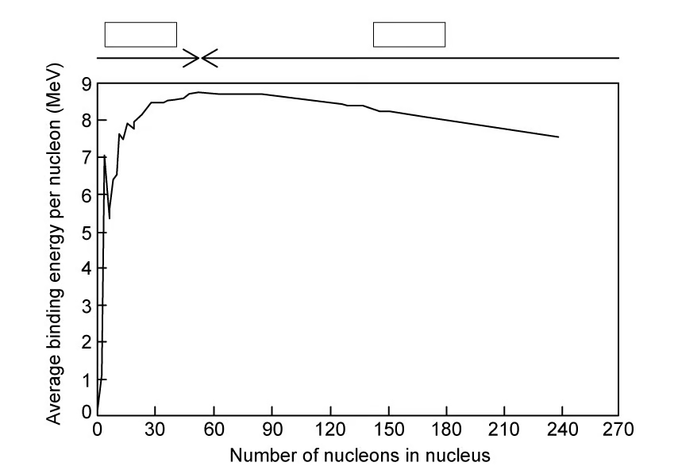{.question-figure fig-alt="Binding energy per nucleon curve with spaces for fusion and fission labels"}

On Fig. 1.1, mark:

- the region in which fusion occurs;
- the region in which fission occurs;
- an X to show the location of iron-56 $({}^{56}_{26}\mathrm{Fe})$.

`[3 marks]`

**(b)** In terms of the forces acting within the nucleus, explain why:

**(i)** fusion occurs for nuclides with low nucleon numbers; `[2]`

**(ii)** fission occurs for nuclides with high nucleon numbers. `[2]`

`[4 marks]`

**(c)** In both fission and fusion, there is a mass defect between the original nuclei and the daughter nuclei.

Complete the sentences by circling the correct word.

In fusion, the mass of the nucleus that is created is slightly **more / less** than the total mass of the original nuclei and the daughter nucleus is **more / less** stable.

In fission, an unstable nucleus is converted into more stable nuclei with a **larger / smaller** total mass. In both cases, this difference in mass, the mass defect, is equal to the binding energy that is released.

**Fission / Fusion** releases much more energy per kg than **fission / fusion**. The greater the increase in binding energy, the **more / less** energy is released. `[4 marks]`

**(d)** The graph in Fig. 1.2 shows the binding energy per nucleon in MeV plotted against nucleon number, $A$.

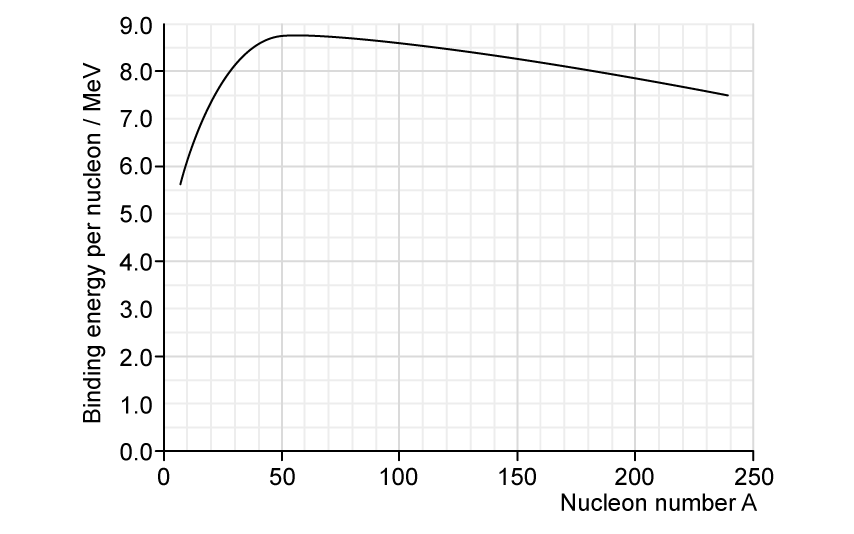{.question-figure fig-alt="Binding energy per nucleon against nucleon number"}

Use Fig. 1.2 to find the binding energy of the following nuclei:

**(i)** platinum-190; `[1]`

**(ii)** silicon-28; `[1]`

**(iii)** tellurium-120. `[1]`

`[3 marks]`

Show mark scheme / model answer

- **(a)** Label fusion on the low-$A$ left side `[1]`, fission on the high-$A$ right side `[1]`, and iron-56 at the maximum of the curve. `[1]`
- **(b)(i)** In light nuclei the attractive strong nuclear force between neighbouring nucleons dominates `[1]` over proton-proton electrostatic repulsion. `[1]`
- **(b)(ii)** In heavy nuclei electrostatic repulsion between the many protons becomes dominant `[1]` and tends to break the nucleus apart. `[1]`
- **(c)** Fusion product: **less** mass and **more** stable. `[1]` Fission products: **smaller** total mass. `[1]` **Fusion** releases more energy per kg than **fission**. `[1]` A greater binding-energy increase releases **more** energy. `[1]`
- **(d)(i)** Platinum-190: approximately $8.0\ \mathrm{MeV}$ per nucleon. `[1]`
- **(d)(ii)** Silicon-28: approximately $8.0\ \mathrm{MeV}$ per nucleon. `[1]`
- **(d)(iii)** Tellurium-120: approximately $8.5\ \mathrm{MeV}$ per nucleon. `[1]`

:::

### 23.1 Mass Defect and Nuclear Binding Energy - Medium

::: {.question-card}
### Example 4 · Reactor reaction and lanthanum binding energy · 23.1 SQ Medium Q1

**(a)** Data for a nucleus and some particles are given in Table 9.1.

| nucleus or particle | mass / u |
|---|---:|
| ${}^{139}_{57}\mathrm{La}$ | 138.955 |
| ${}^{1}_{0}\mathrm{n}$ | 1.00863 |
| ${}^{1}_{1}\mathrm{p}$ | 1.00728 |
| ${}^{0}_{-1}\mathrm{e}$ | $5.49\times10^{-4}$ |

One nuclear reaction that can take place in a nuclear reactor may be represented, in part, by the equation shown below.

Complete the equation.

$$ {}^{235}_{92}\mathrm{U}+{}^{1}_{0}\mathrm{n}
\rightarrow{}^{95}_{42}\mathrm{Mo}+{}^{139}_{57}\mathrm{La}
+2{}^{1}_{0}\mathrm{n}+\ ................................+\text{energy} $$

`[1 mark]`

**(b)(i)** Show that the energy equivalent to $1.00\ \mathrm{u}$ is $934\ \mathrm{MeV}$. `[3]`

**(ii)** Calculate the binding energy per nucleon, in MeV, of lanthanum-139 $({}^{139}_{57}\mathrm{La})$. `[3]`

`[6 marks]`

**(c)** State and explain whether the binding energy per nucleon of uranium-235 $({}^{235}_{92}\mathrm{U})$ is greater than, equal to or less than the binding energy per nucleon of lanthanum-139 $({}^{139}_{57}\mathrm{La})$. `[2 marks]`

Show mark scheme / model answer

- **(a)** Balancing nucleon number gives zero total missing nucleon number, while balancing charge gives $-7$. The missing term is $7{}^{0}_{-1}\mathrm{e}$. `[1]`
- **(b)(i)** $E=mc^2=(1.66\times10^{-27})(3.00\times10^8)^2=1.494\times10^{-10}\ \mathrm{J}$. `[2]` Dividing by $1.60\times10^{-13}\ \mathrm{J\,MeV^{-1}}$ gives $934\ \mathrm{MeV}$. `[1]`
- **(b)(ii)** Lanthanum-139 has 57 protons and 82 neutrons. $\Delta m=82(1.00863)+57(1.00728)-138.955=1.16762\ \mathrm{u}$. `[1]` Total binding energy $=1.16762(934)=1090\ \mathrm{MeV}$. `[1]` Per nucleon: $1090/139=7.84\ \mathrm{MeV}$. `[1]`
- **(c)** Uranium-235 has a lower binding energy per nucleon `[1]`; it lies farther to the right of the binding-energy curve where the value decreases for larger nucleon number. `[1]`

:::

::: {.question-card}
### Example 5 · Energy release in fission and fusion · 23.1 SQ Medium Q2

**(a)(i)** State what is meant by nuclear fission. `[1]`

**(ii)** On Fig. 1.1 below, sketch a line to show the variation with nucleon number $A$ of the binding energy per nucleon $E$ of a nucleus. `[2]`

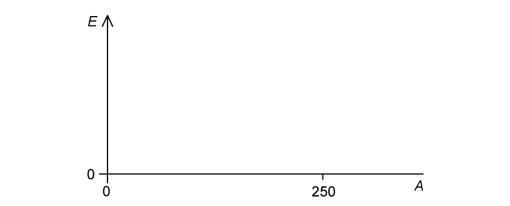{.question-figure fig-alt="Blank axes for binding energy per nucleon against nucleon number"}

**(iii)** Explain, with reference to Fig. 1.1, why nuclear fission reactions result in the release of energy. `[2]`

`[5 marks]`

**(b)** A nuclear fission reaction occurs that has the following equation:

$$ {}^{1}_{0}\mathrm{n}+{}^{235}_{92}\mathrm{U}
\rightarrow{}^{90}_{38}\mathrm{Sr}+{}^{143}_{54}\mathrm{Xe}+x{}^{1}_{0}\mathrm{n} $$

**(i)** Determine, for this nuclear reaction, the value of $x$. `[1]`

**(ii)** Data for the binding energy per nucleon of some nuclei are given in Table 1.2.

| nucleus | binding energy per nucleon / MeV |
|---|---:|
| ${}^{235}_{92}\mathrm{U}$ | 7.59 |
| ${}^{90}_{38}\mathrm{Sr}$ | 8.70 |
| ${}^{143}_{54}\mathrm{Xe}$ | 8.20 |

Use the data to calculate the energy, in MeV, released in this reaction. `[2]`

`[3 marks]`

**(c)** Under the right conditions, a hydrogen-2 ${}^{2}_{1}\mathrm{H}$ nucleus can fuse with a hydrogen-1 ${}^{1}_{1}\mathrm{H}$ nucleus to make a helium-3 ${}^{3}_{2}\mathrm{He}$ nucleus. The values of binding energy per nucleon for these nuclei are shown in Table 1.3.

| nucleus | binding energy per nucleon / MeV |
|---|---:|
| ${}^{2}_{1}\mathrm{H}$ | 0.864 |
| ${}^{3}_{2}\mathrm{He}$ | 2.235 |

**(i)** Write down the nuclear equation for this reaction. `[1]`

**(ii)** Explain why the binding energy per nucleon of hydrogen-1 is zero. `[1]`

**(iii)** Using the data in Table 1.3, calculate the energy released in this reaction. `[2]`

`[4 marks]`

**(d)** When two hydrogen-2 nuclei fuse into a helium-4 nucleus, $3.6\times10^{-12}\ \mathrm{J}$ of energy is released. This reaction is shown below.

$$ {}^{2}_{1}\mathrm{H}+{}^{2}_{1}\mathrm{H}\rightarrow{}^{4}_{2}\mathrm{He} $$

Show that the fusion of 1 kg of two hydrogen-2 nuclei releases about 8 times more energy per kg than the fission of 1 kg of uranium-235.

| nucleus | mass / u |
|---|---:|
| ${}^{2}_{1}\mathrm{H}$ | 2.013553 |
| ${}^{235}_{92}\mathrm{U}$ | 235.0439 |

`[4 marks]`

Show mark scheme / model answer

- **(a)(i)** Nuclear fission is the division of one large nucleus into smaller nuclei. `[1]`
- **(a)(ii)** Draw a curve starting near the origin, rising steeply to one maximum left of centre, then falling gradually to $A=250$. `[2]`
- **(a)(iii)** Heavy fission reactants are on the right of the curve and have lower binding energy per nucleon than the products `[1]`; the increase in total binding energy is released. `[1]`
- **(b)(i)** $1+235=90+143+x$, so $x=3$. `[1]`
- **(b)(ii)** $E=[90(8.70)+143(8.20)]-235(7.59)$ `[1]` $=172\ \mathrm{MeV}$. `[1]`
- **(c)(i)** ${}^{2}_{1}\mathrm{H}+{}^{1}_{1}\mathrm{H}\rightarrow{}^{3}_{2}\mathrm{He}$. `[1]`
- **(c)(ii)** Hydrogen-1 contains only one proton, so there are no nucleons bound to one another. `[1]`
- **(c)(iii)** $E=3(2.235)-2(0.864)=5.0\ \mathrm{MeV}$. `[2]`
- **(d)** Fusion reactions per kg: $1/[2(2.013553)(1.66\times10^{-27})]=1.496\times10^{26}$, giving $5.39\times10^{14}\ \mathrm{J\,kg^{-1}}$. `[2]` Fissions per kg: $1/[235.0439(1.66\times10^{-27})]=2.562\times10^{24}$; using $172\ \mathrm{MeV}$ gives $7.05\times10^{13}\ \mathrm{J\,kg^{-1}}$. `[1]` Ratio $=7.65\approx8$. `[1]`

:::

::: {.question-card}
### Example 6 · Deuterium fusion and nuclear stability · 23.1 SQ Medium Q3

**(a)** Define the terms:

**(i)** mass defect; `[1]`

**(ii)** binding energy of a nucleus. `[2]`

`[3 marks]`

**(b)** If deuterium $({}^{2}_{1}\mathrm{H})$ nuclei undergo fusion, a possible reaction is

$$ {}^{2}_{1}\mathrm{H}+{}^{2}_{1}\mathrm{H}\rightarrow{}^{3}_{1}\mathrm{H}+{}^{1}_{1}\mathrm{H} $$

The masses of the nuclei involved in the reaction are given in Table 1.1.

| nucleus | mass / u |
|---|---:|
| ${}^{1}_{1}\mathrm{H}$ | 1.0078 |
| ${}^{2}_{1}\mathrm{H}$ | 2.0135 |
| ${}^{3}_{1}\mathrm{H}$ | 3.0160 |

**(i)** Explain what is meant by nuclear fusion. `[1]`

**(ii)** Determine the energy released, in J, when $3.00\ \mathrm{mol}$ of deuterium undergoes this fusion reaction. `[5]`

`[6 marks]`

**(c)** Fig. 1.2 shows the variation of nucleon number with the binding energy per nucleon of a nucleus.

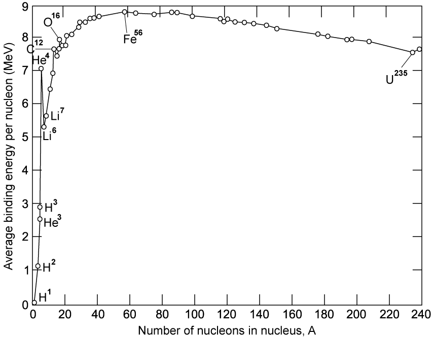{.question-figure fig-alt="Binding energy per nucleon curve with selected nuclides labelled"}

With reference to Fig. 1.2, state and explain:

**(i)** which of the elements shown is the most stable; `[2]`

**(ii)** how the graph can be used to predict whether a nucleus will undergo fusion or fission. `[2]`

`[4 marks]`

**(d)** Fission and fusion reactions release different amounts of energy.

Explain why the energy released per nucleon from fusion is greater than that from fission. State the feature of the graph in Fig. 1.2 that shows this. `[3 marks]`

Show mark scheme / model answer

- **(a)(i)** Mass defect is the difference between the mass of a nucleus and the sum of the masses of its completely separated nucleons. `[1]`
- **(a)(ii)** Binding energy is the minimum energy required to separate all nucleons `[1]` to infinity, or the energy released when they form the nucleus from infinity. `[1]`
- **(b)(i)** Fusion is the combination of two nuclei to form one nucleus. `[1]`
- **(b)(ii)** $\Delta m=2(2.0135)-(3.0160+1.0078)=0.0032\ \mathrm{u}$. `[1]` One reaction releases $\Delta mc^2=0.0032(1.66\times10^{-27})(3.00\times10^8)^2=4.78\times10^{-13}\ \mathrm{J}$. `[2]` Three moles of deuterium produce $1.50\ \mathrm{mol}$ of reactions. `[1]` Total energy $=1.50(6.02\times10^{23})(4.78\times10^{-13})=4.32\times10^{11}\ \mathrm{J}$. `[1]`
- **(c)(i)** Iron-56 is most stable `[1]` because it has the greatest binding energy per nucleon. `[1]`
- **(c)(ii)** Nuclei below the iron peak tend to undergo fusion; nuclei above the peak tend to undergo fission. `[2]`
- **(d)** Energy is released when products have greater binding energy per nucleon. `[1]` The increase is greater for fusion than fission `[1]`, shown by the much steeper curve at small $A$ than at large $A$. `[1]`

:::

### 23.2 Radioactive Decay - Easy

::: {.question-card}
### Example 7 · Spontaneous and random decay, isotopes and decay equations · 23.2 SQ Easy Q1

**(a)** Radioactive decay is often described as a spontaneous and random process.

State what is meant by:

**(i)** radioactive decay; `[2]`

**(ii)** a spontaneous process; `[2]`

**(iii)** a random process. `[2]`

`[6 marks]`

**(b)** The graph in Fig. 1.1 shows the count rate of a radioactive substance measured by a Geiger-Müller tube.

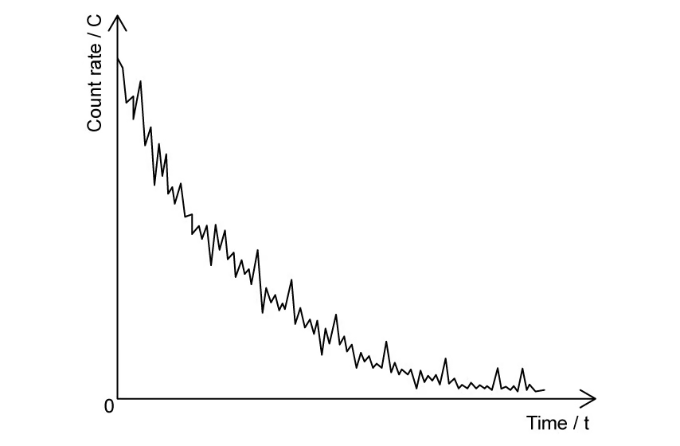{.question-figure fig-alt="Fluctuating radioactive count rate decreasing with time"}

State the feature of Fig. 1.1 which provides evidence for:

**(i)** the random nature of radioactive decay; `[1]`

**(ii)** the spontaneous nature of radioactive decay. `[1]`

`[2 marks]`

**(c)** The element neptunium has at least 24 isotopes. One of the isotopes is neptunium-231 $({}^{231}_{93}\mathrm{Np})$, which has a half-life of 49 minutes.

**(i)** State what is meant by isotopes and circle the possible isotopes of neptunium:

$$ {}^{239}_{93}\mathrm{Np}\quad {}^{231}_{94}\mathrm{Np}\quad
{}^{219}_{93}\mathrm{Np}\quad {}^{231}_{90}\mathrm{Np}\quad {}^{244}_{93}\mathrm{Np} $$

`[3]`

**(ii)** Define half-life and circle the correct expression for calculating the probability per second of decay of a nucleus of neptunium-231:

$$\frac{49}{0.693}\qquad\frac{0.693}{49}\qquad
\frac{0.693}{49\times60}\qquad\frac{49\times60}{0.693}$$

`[3]`

`[6 marks]`

**(d)** Fig. 1.2 shows a diagram in which nucleon number $A$ is plotted against proton number $Z$.

The diagram shows the position of three isotopes of neptunium and their respective decay products.

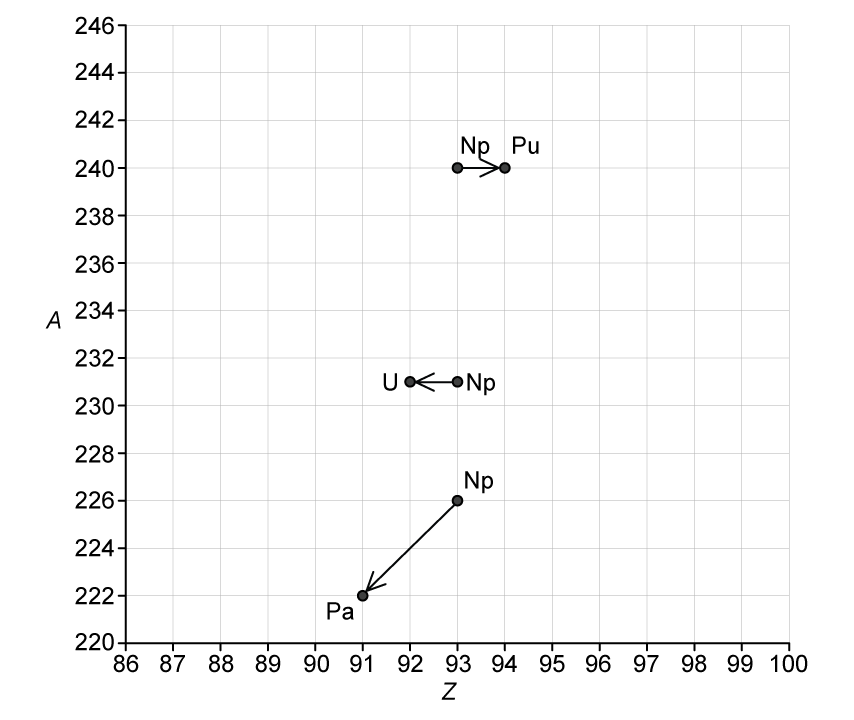{.question-figure fig-alt="Nucleon number against proton number chart for three neptunium decays"}

Use Fig. 1.2 to complete the following nuclear decay equations:

$$\mathrm{Np}\rightarrow\mathrm{Pu}+\ ................................$$

$$\mathrm{Np}\rightarrow\mathrm{U}+\ ................................$$

$$\mathrm{Np}\rightarrow\mathrm{Pa}+\ ................................$$

`[3 marks]`

Show mark scheme / model answer

- **(a)(i)** Radioactive decay is emission of ionising radiation `[1]` from an unstable nucleus. `[1]`
- **(a)(ii)** Spontaneous decay is unaffected by environmental changes `[1]` such as temperature, pressure or chemical conditions. `[1]`
- **(a)(iii)** Each nucleus has a constant probability of decay per unit time `[1]`, but the particular nucleus and time of decay cannot be predicted. `[1]`
- **(b)(i)** The count-rate curve fluctuates and is not smooth. `[1]`
- **(b)(ii)** The exact time of an individual decay cannot be predicted, or each nucleus has constant decay probability in a given time. `[1]`
- **(c)(i)** Isotopes have the same proton number but different neutron numbers. `[2]` Circle ${}^{239}_{93}\mathrm{Np}$, ${}^{219}_{93}\mathrm{Np}$ and ${}^{244}_{93}\mathrm{Np}$. `[1]`
- **(c)(ii)** Half-life is the time for activity or number of undecayed nuclei to fall to half its value. `[2]` Circle $0.693/(49\times60)$. `[1]`
- **(d)** ${}^{240}_{93}\mathrm{Np}\rightarrow{}^{240}_{94}\mathrm{Pu}+{}^{0}_{-1}\beta+\bar\nu$. `[1]` ${}^{231}_{93}\mathrm{Np}\rightarrow{}^{231}_{92}\mathrm{U}+{}^{0}_{+1}\beta+\nu$. `[1]` ${}^{226}_{93}\mathrm{Np}\rightarrow{}^{222}_{91}\mathrm{Pa}+{}^{4}_{2}\alpha$. `[1]`

:::

::: {.question-card}
### Example 8 · Planning a technetium half-life investigation · 23.2 SQ Easy Q2

**(a)** Define half-life. `[2 marks]`

**(b)** A student investigates the half-life of technetium with time. This list shows the variables in the experiment:

time; size of sample; distance from the detector to the sample; same material for the sample; activity of the sample.

Using variables from the list, state:

**(i)** the independent variable; `[1]`

**(ii)** the dependent variable; `[1]`

**(iii)** the control variables for the experiment. `[3]`

`[5 marks]`

**(c)** The experiment uses a variety of apparatus.

Draw lines on Table 1.1 below to match the apparatus with its correct use.

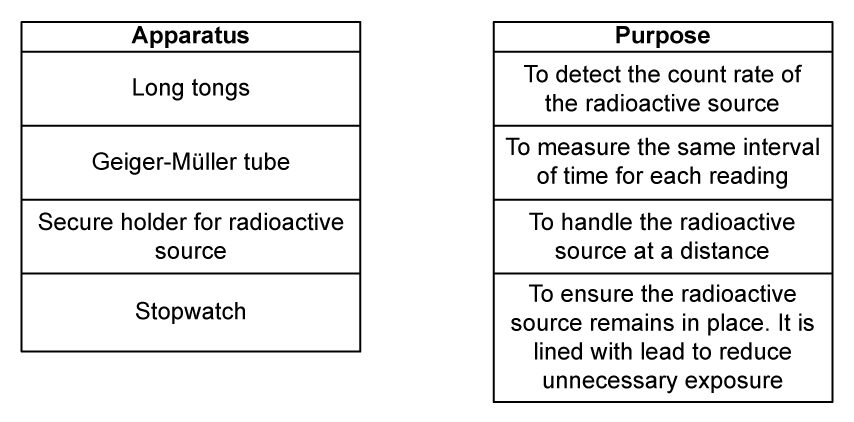{.question-figure fig-alt="Matching table for radioactive-source apparatus and purpose"}

`[4 marks]`

**(d)** Fig. 1.1 shows the graph that the student obtains from their results.

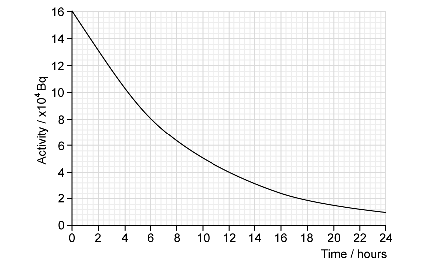{.question-figure fig-alt="Technetium activity against time in hours"}

Using Fig. 1.1, determine the half-life of the sample. `[3 marks]`

Show mark scheme / model answer

- **(a)** Half-life is the time taken for activity or number of undecayed nuclei `[1]` to decrease to half its value. `[1]`
- **(b)(i)** Time. `[1]`
- **(b)(ii)** Activity of the sample. `[1]`
- **(b)(iii)** Keep sample size, source-detector distance and sample material constant. `[3]`
- **(c)** Long tongs - handle the source at a distance. `[1]` Geiger-Müller tube - detect count rate. `[1]` Secure lead-lined holder - keep the source in place and reduce exposure. `[1]` Stopwatch - measure the same time interval for each reading. `[1]`
- **(d)** Initial activity is $16\times10^4\ \mathrm{Bq}$. `[1]` Half is $8\times10^4\ \mathrm{Bq}$. `[1]` The graph reaches this value at approximately $6\ \mathrm{h}$, so $t_{1/2}=6\ \mathrm{h}$. `[1]`

:::

::: {.question-card}
### Example 9 · A polonium decay chain and initial activity · 23.2 SQ Easy Q3

**(a)** An isotope of polonium-213 $({}^{213}_{84}\mathrm{Po})$ first decays into an isotope of lead-209 $({}^{209}_{82}\mathrm{Pb})$ and then decays into the stable isotope of bismuth (Bi).

Fig. 1.1 shows two arrows on a neutron number $N$ against proton number $Z$ chart to illustrate these two decays.

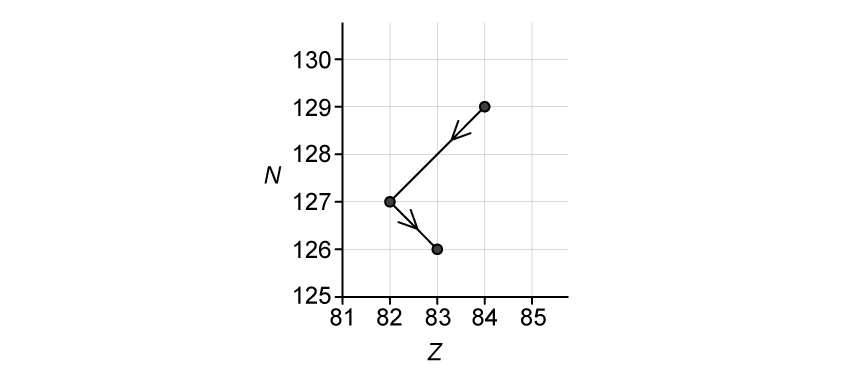{.question-figure fig-alt="Neutron number against proton number chart for polonium and lead decays"}

Use Fig. 1.1 to complete the nuclear decay equations for:

**(i)** the polonium isotope; `[1]`

**(ii)** the lead isotope. `[2]`

`[3 marks]`

**(b)** A pure sample of polonium-213 is produced in a research laboratory.

The half-life of ${}^{213}\mathrm{Po}$ is very small compared with the half-life of ${}^{209}\mathrm{Pb}$. After a very short time, the ionising radiation detected from the sample is mainly from the beta-minus decay of the lead-209 nuclei.

The half-life of ${}^{209}\mathrm{Pb}$ is $3.3\ \mathrm{hours}$.

**(i)** State what is meant by the decay constant of a radioactive isotope. `[2]`

**(ii)** Calculate the decay constant, in $\mathrm{s^{-1}}$, of lead-209. `[3]`

`[5 marks]`

**(c)** The activity of the sample of ${}^{209}\mathrm{Pb}$ after $7.0\ \mathrm{hours}$ is $12\ \mathrm{kBq}$.

Calculate the initial activity of the sample of polonium-213. `[2 marks]`

**(d)(i)** State the relation between the activity $A$ of a sample of a radioactive isotope containing $N$ atoms and the decay constant $\lambda$ of the isotope. `[1]`

**(ii)** Determine the number of lead-209 nuclei in the sample initially. `[2]`

`[3 marks]`

Show mark scheme / model answer

- **(a)(i)** ${}^{213}_{84}\mathrm{Po}\rightarrow{}^{209}_{82}\mathrm{Pb}+{}^{4}_{2}\alpha$. `[1]`
- **(a)(ii)** ${}^{209}_{82}\mathrm{Pb}\rightarrow{}^{209}_{83}\mathrm{Bi}+{}^{0}_{-1}\mathrm{e}+{}^{0}_{0}\bar\nu$. `[2]`
- **(b)(i)** The decay constant is the probability that a nucleus decays `[1]` per unit time. `[1]`
- **(b)(ii)** $t_{1/2}=3.3(3600)=11880\ \mathrm{s}$. `[1]` $\lambda=0.693/t_{1/2}$ `[1]` $=5.83\times10^{-5}\ \mathrm{s^{-1}}$. `[1]`
- **(c)** $A=A_0e^{-\lambda t}$, so $A_0=12\times10^3/e^{-(5.83\times10^{-5})(25200)}=5.21\times10^4\ \mathrm{Bq}$. `[2]`
- **(d)(i)** $A=\lambda N$. `[1]`
- **(d)(ii)** $N_0=A_0/\lambda=(5.21\times10^4)/(5.83\times10^{-5})=8.94\times10^8$, or $8.9\times10^8$ nuclei. `[2]`

:::

### 23.2 Radioactive Decay - Medium

::: {.question-card}
### Example 10 · Technetium decay, activity and released energy · 23.2 SQ Medium Q1

**(a)** A student sets up a radioactive source and a Geiger counter to investigate how the count rate of the source varies with time.

State and explain how the student could demonstrate:

**(i)** the spontaneous nature of radioactive decay; `[2]`

**(ii)** the random nature of radioactive decay. `[2]`

`[4 marks]`

**(b)** Technetium-101 $({}^{101}_{43}\mathrm{Tc})$ decays by beta-minus emission to form a stable isotope of ruthenium (Ru).

Complete the equation for this decay. `[2 marks]`

**(c)** The variation with time $t$ of the number $N$ of technetium-101 nuclei in a sample of radioactive material is shown in Fig. 1.1.

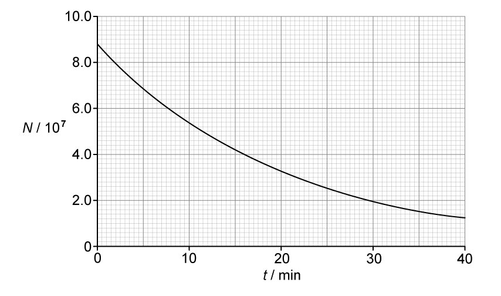{.question-figure fig-alt="Number of technetium-101 nuclei against time"}

**(i)** Use Fig. 1.1 to determine the activity, in Bq, of the sample of technetium-101 at time $t=14.0\ \mathrm{minutes}$. `[4]`

**(ii)** Use your answer in **(c)(i)** to calculate the decay constant $\lambda$ of technetium-101. `[2]`

**(iii)** On Fig. 1.1, sketch a line to show the variation with $t$ of the number of ruthenium nuclei in the sample. `[2]`

`[8 marks]`

**(d)** Each decay releases a beta particle with energy $487\ \mathrm{keV}$.

**(i)** Calculate, in J, the total amount of energy given to beta particles that are emitted between time $t=10\ \mathrm{min}$ and time $t=30\ \mathrm{min}$. `[3]`

**(ii)** Suggest why the total amount of energy released by the decay process between time $t=10\ \mathrm{min}$ and time $t=30\ \mathrm{min}$ is actually greater than your answer in **(d)(i)**. `[1]`

`[4 marks]`

Show mark scheme / model answer

- **(a)(i)** Repeat the experiment under different environmental conditions `[1]` and show that activity is unchanged. `[1]`
- **(a)(ii)** Plot count rate against time `[1]` and show that the readings fluctuate rather than forming a perfectly smooth curve. `[1]`
- **(b)** ${}^{101}_{43}\mathrm{Tc}\rightarrow{}^{101}_{44}\mathrm{Ru}+{}^{0}_{-1}\beta$. `[2]`
- **(c)(i)** At 14 min, $N=4.4\times10^7$ and this time is one half-life. `[2]` $A=\lambda N=N\ln2/t_{1/2}=(4.4\times10^7)(\ln2)/(14\times60)=3.6\times10^4\ \mathrm{Bq}$. `[2]`
- **(c)(ii)** $\lambda=A/N=(3.6\times10^4)/(4.4\times10^7)=8.2\times10^{-4}\ \mathrm{s^{-1}}$. `[2]`
- **(c)(iii)** Draw a rising curve of decreasing gradient from $(0,0)$, passing approximately through $(14,4.4\times10^7)$ and $(28,6.6\times10^7)$. `[2]`
- **(d)(i)** From the graph, $N_{10}=5.4\times10^7$ and $N_{30}=2.0\times10^7$, so $3.4\times10^7$ beta particles are emitted. `[1]` Total energy $=(487\times10^3)(1.60\times10^{-19})(3.4\times10^7)$ `[1]` $=2.6\times10^{-6}\ \mathrm{J}$. `[1]`
- **(d)(ii)** Energy is also carried as kinetic energy of the daughter nuclei or by gamma photons. `[1]`

:::

::: {.question-card}
### Example 11 · Radium contamination and exponential activity · 23.2 SQ Medium Q2

**(a)** A source of water is found to be contaminated with the radioactive isotope radium-228 $({}^{228}_{88}\mathrm{Ra})$.

This isotope of radium has a half-life of $5.75\ \mathrm{years}$.

Explain the meaning of half-life in this context. `[2 marks]`

**(b)** Calculate the decay constant, in $\mathrm{s^{-1}}$, of radium-228. `[2 marks]`

**(c)** A sample is taken of the contaminated water. The activity of radium-228 in a sample of $1.0\ \mathrm{kg}$ of water is found to be $20\ \mathrm{mBq}$.

The mass of water in $1.0\ \mathrm{mol}$ is $18\ \mathrm{g}$.

Calculate:

**(i)** the number of radium-228 atoms in $1.0\ \mathrm{kg}$ of the contaminated water; `[2]`

**(ii)** the ratio

$$\frac{\text{number of molecules of water in 1.0 kg of water}}
{\text{number of }{}^{228}\mathrm{Ra}\text{ atoms in 1.0 kg of water}}.$$

`[2]`

`[4 marks]`

**(d)** The maximum safe limit for the activity of radium-228 in water has been set as $18.5\ \mathrm{mBq\,kg^{-1}}$.

Calculate the time, in days, for the activity of the contaminated water to be reduced to the safe limit. `[3 marks]`

Show mark scheme / model answer

- **(a)** In 5.75 years, the number of radium-228 nuclei or their activity `[1]` falls to half its current value. `[1]`
- **(b)** $t_{1/2}=5.75(365)(24)(3600)=1.81\times10^8\ \mathrm{s}$. `[1]` $\lambda=0.693/t_{1/2}=3.83\times10^{-9}\ \mathrm{s^{-1}}$. `[1]`
- **(c)(i)** $N=A/\lambda=0.020/(3.83\times10^{-9})=5.22\times10^6$ atoms. `[2]`
- **(c)(ii)** Water molecules $=(1.0/0.018)(6.02\times10^{23})=3.34\times10^{25}$. `[1]` Ratio $=(3.34\times10^{25})/(5.22\times10^6)=6.4\times10^{18}$. `[1]`
- **(d)** $18.5=20e^{-\lambda t}$. `[1]` $t=-\ln(18.5/20)/(3.83\times10^{-9})=2.04\times10^7\ \mathrm{s}$. `[1]` This is $236\ \mathrm{days}$. `[1]`

:::

::: {.question-card}
### Example 12 · Decay graphs and the remaining fraction · 23.2 SQ Medium Q3

**(a)** State what is meant by radioactive decay. `[2 marks]`

**(b)** A radioactive sample consists of an isotope with a half-life $T$ that decays to form a stable product. Only the isotope and the stable product are present in the sample.

At time $t=0$, the sample has an activity of $A_0$ and contains $N_0$ nuclei of the isotope.

**(i)** On Fig. 1.1, sketch the variation with $t$ of the number $N$ of nuclei of the isotope present in the sample from time $t=0$ to time $t=3T$. `[3]`

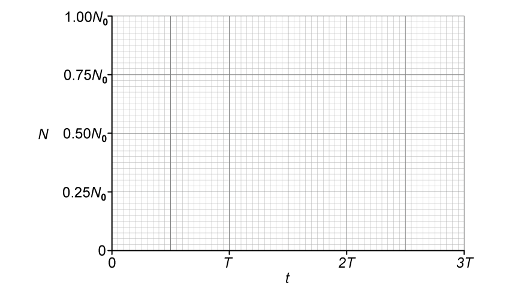{.question-figure fig-alt="Blank graph of undecayed nuclei against time in half-lives"}

**(ii)** State the name of the quantity represented by the gradient of the graph in Fig. 1.1. `[1]`

`[4 marks]`

**(c)(i)** On Fig. 1.2, sketch the variation with $N$ of the activity $A$ of the sample for values of $N$ between $N=0$ and $N=N_0$. `[2]`

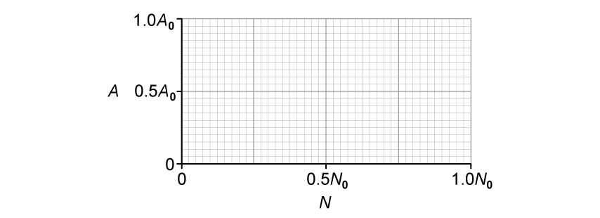{.question-figure fig-alt="Blank graph of activity against number of undecayed nuclei"}

**(ii)** State the name of the quantity represented by the gradient in Fig. 1.2. `[1]`

`[3 marks]`

**(d)** Calculate the fraction of undecayed nuclei $N$ remaining relative to $N_0$ at time $t=1.25T$. `[2 marks]`

Show mark scheme / model answer

- **(a)** Radioactive decay is the spontaneous emission of ionising radiation `[1]` from an unstable nucleus. `[1]`
- **(b)(i)** Draw an exponential curve from $(0,N_0)$ with decreasing negative gradient. `[1]` It passes through $(T,0.50N_0)$ `[1]`, $(2T,0.25N_0)$ and $(3T,0.125N_0)$. `[1]`
- **(b)(ii)** The magnitude of the gradient represents activity; mathematically $dN/dt=-A$. `[1]`
- **(c)(i)** Draw a straight line through the origin `[1]` and $(N_0,A_0)$. `[1]`
- **(c)(ii)** The gradient is the decay constant $\lambda$. `[1]`
- **(d)** $N/N_0=e^{-\lambda t}=e^{-(\ln2/T)(1.25T)}$ `[1]` $=2^{-1.25}=0.42$. `[1]`

:::
