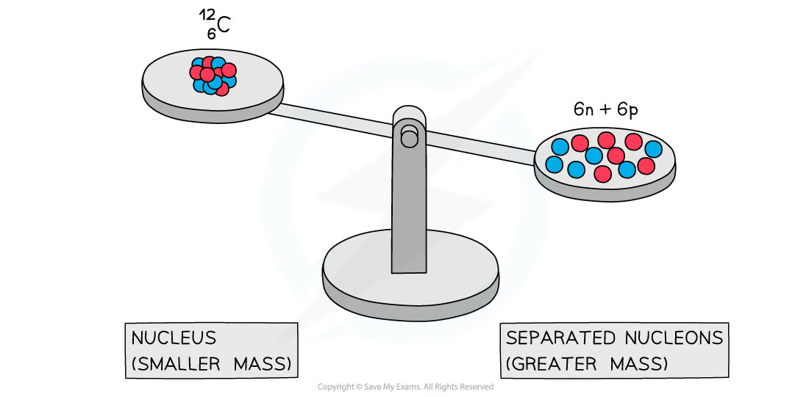
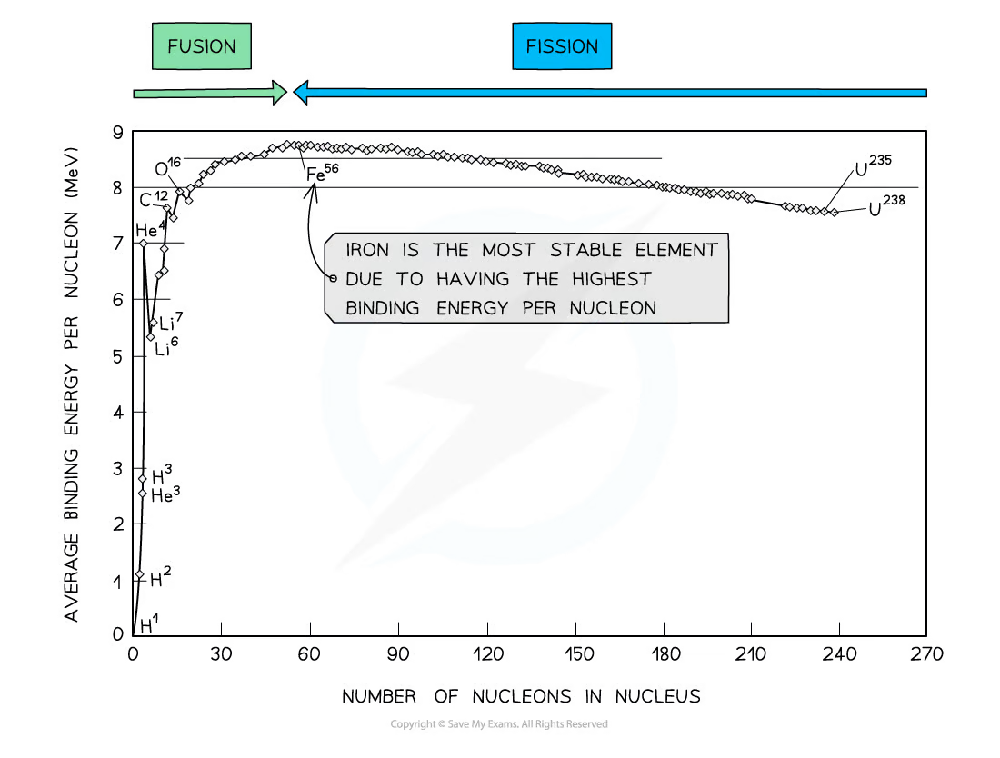
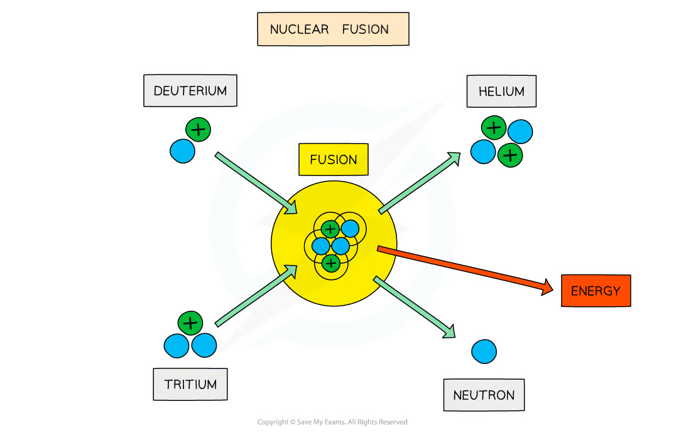
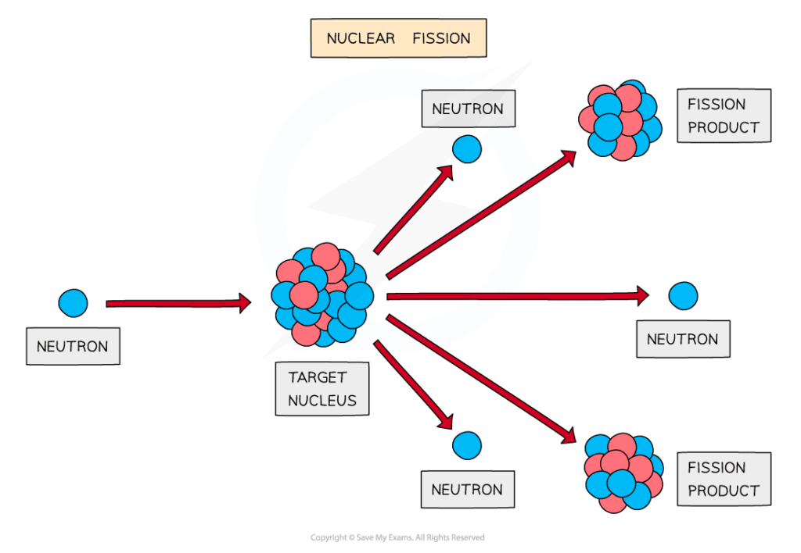
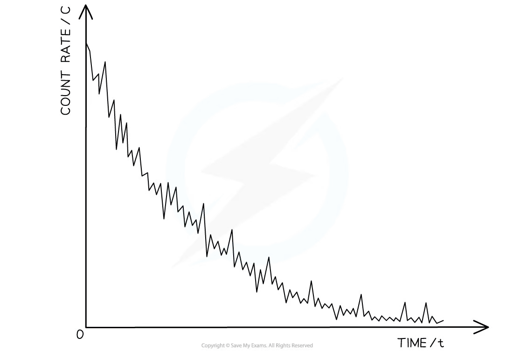
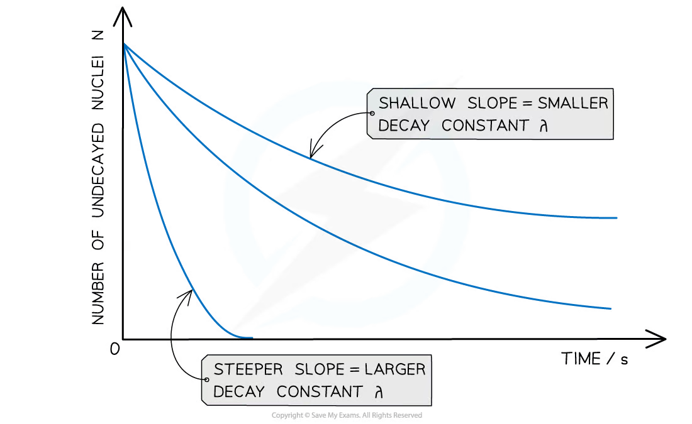
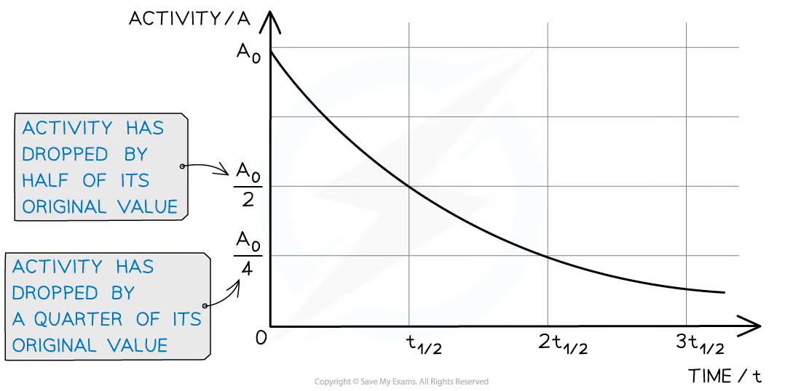

## Learning objectives

By the end of this chapter, you should be able to:

- use nuclide notation and conserve nucleon number and charge in nuclear equations;
- explain mass defect, binding energy and binding energy per nucleon;
- use $\Delta E=\Delta mc^2$ and convert mass changes in u into energy in MeV;
- interpret the binding-energy-per-nucleon curve and explain energy release in fission and fusion;
- identify alpha, beta-minus, beta-plus and gamma decay;
- explain why radioactive decay is spontaneous and random;
- calculate activity, decay constant, half-life and remaining activity or nuclei;
- interpret count-rate and decay graphs, including background correction.

## 23.1 Mass defect and nuclear binding energy

::: {.study-card}
### Nuclide notation and conservation laws

A nuclide is written

$$ {}^{A}_{Z}X, $$

where $Z$ is the proton number, $A$ is the nucleon number and the neutron number is $N=A-Z$. The unified atomic mass unit is

$$1\ \mathrm{u}=1.66\times10^{-27}\ \mathrm{kg}.$$

For every nuclear equation, conserve both quantities independently:

- total nucleon number $A$;
- total charge, represented by proton number $Z$.

The symbols may change, but these two totals do not.
:::

::: {.example-card}
### Worked Example 1 · Balancing a nuclear equation

Complete the alpha decay of uranium-238:

$$ {}^{238}_{92}\mathrm{U}\rightarrow{}^{?}_{?}\mathrm{Th}+{}^{4}_{2}\mathrm{He}. $$

**Solution**

Conservation of nucleon number gives

$$A_{\mathrm{Th}}=238-4=234.$$

Conservation of charge gives

$$Z_{\mathrm{Th}}=92-2=90.$$

Therefore,

$$ {}^{238}_{92}\mathrm{U}\rightarrow{}^{234}_{90}\mathrm{Th}+{}^{4}_{2}\mathrm{He}. $$

The daughter element is thorium because its proton number is 90.
:::

::: {.formula-panel}
### Mass-energy equivalence

Mass and energy are equivalent:

$$\Delta E=\Delta mc^2.$$

For nuclear calculations, the most useful conversion is

$$1\ \mathrm{u}\,c^2\approx934\ \mathrm{MeV}.$$

Thus, if a mass defect is given in u,

$$E_b(\mathrm{MeV})=\Delta m(\mathrm{u})\times934.$$

Use $c=3.00\times10^8\ \mathrm{m\,s^{-1}}$ when the answer is required in joules. Keep the mass convention consistent: do not mix nuclear masses with atomic masses unless the electron masses cancel correctly.
:::

::: {.knowledge-figure}
{fig-alt="Balance showing a carbon-12 nucleus with smaller mass than its separated nucleons"}

The separated nucleons have greater mass than the bound nucleus. The missing mass corresponds to the binding energy released when the nucleus forms.
:::

::: {.study-card}
### Mass defect and binding energy

The **mass defect** is the difference between the total mass of separated nucleons and the mass of the bound nucleus:

$$\Delta m=Zm_p+Nm_n-m_{\text{nucleus}}.$$

The **binding energy** is the minimum energy needed to separate the nucleus completely into its nucleons at infinity. It is also the energy released when those nucleons form the nucleus:

$$E_b=\Delta mc^2.$$

A larger binding energy means more energy is needed to break the whole nucleus apart. It does not, by itself, mean that a large nucleus is more stable than every smaller nucleus; compare binding energy per nucleon for average stability.
:::

::: {.example-card}
### Worked Example 2 · Mass defect and total binding energy

The nuclear mass of a helium-4 nucleus is $4.001506\ \mathrm{u}$. Use $m_p=1.007276\ \mathrm{u}$ and $m_n=1.008665\ \mathrm{u}$ to calculate its mass defect and binding energy.

**Solution**

Helium-4 contains two protons and two neutrons:

$$\Delta m=2(1.007276)+2(1.008665)-4.001506
 =0.030376\ \mathrm{u}.$$

Therefore,

$$E_b=0.030376\times934=28.4\ \mathrm{MeV}.$$

**Answer:** $\Delta m=0.0304\ \mathrm{u}$ and $E_b\approx28.4\ \mathrm{MeV}$.
:::

::: {.study-card}
### Binding energy per nucleon and stability

Binding energy per nucleon is

$$\frac{E_b}{A}.$$

It is the average energy needed to remove one nucleon. A higher value generally means greater average stability. Hydrogen-1 has zero binding energy per nucleon because its nucleus contains only one proton.

The curve rises rapidly for light nuclei, peaks near iron-56, and decreases gradually for heavy nuclei. This shape explains why both fusion of light nuclei and fission of heavy nuclei can release energy: the products move towards the region of larger binding energy per nucleon.
:::

::: {.knowledge-figure}
{fig-alt="Binding energy per nucleon plotted against number of nucleons, with fusion on the left and fission on the right"}

The maximum is close to iron. Moving light nuclei or heavy nuclei towards this region increases the total binding energy and releases energy.
:::

::: {.example-card}
### Worked Example 3 · Comparing average nuclear stability

A nucleus has total binding energy $492\ \mathrm{MeV}$ and nucleon number $A=56$. Another has total binding energy $1800\ \mathrm{MeV}$ and $A=238$. Which has the greater binding energy per nucleon?

**Solution**

For the first nucleus,

$$\frac{E_b}{A}=\frac{492}{56}=8.79\ \mathrm{MeV\ per\ nucleon}.$$

For the second nucleus,

$$\frac{E_b}{A}=\frac{1800}{238}=7.56\ \mathrm{MeV\ per\ nucleon}.$$

**Answer:** the $A=56$ nucleus has the greater average stability, even though the $A=238$ nucleus has the larger total binding energy.
:::

::: {.study-card}
### Nuclear force and the shape of the curve

The strong nuclear force is attractive, short-ranged and acts mainly between neighbouring nucleons. Electrostatic repulsion acts between every pair of protons and has a much longer range.

For light nuclei, adding nucleons creates many new strong-force interactions, so binding energy per nucleon increases quickly. In a very heavy nucleus, proton-proton repulsion becomes increasingly important and reduces the average binding energy. This competition produces the broad maximum near iron.
:::

::: {.formula-panel}
### Fission and fusion

**Fusion** combines light nuclei. **Fission** splits a heavy nucleus, usually producing two medium-sized nuclei and several neutrons. Energy is released when the total rest mass of the products is less than that of the reactants:

$$E_{\text{released}}=(m_{\text{reactants}}-m_{\text{products}})c^2.$$

Equivalently, the total binding energy of the products is greater. The released energy appears mainly as kinetic energy of the products and emitted neutrons, with some energy carried by radiation.
:::

::: {.knowledge-figure}
{fig-alt="Deuterium and tritium combining to form helium and a neutron, releasing energy"}

In fusion, light nuclei move towards the high-binding-energy region. A typical reaction is

$$ {}^{2}_{1}\mathrm{H}+{}^{3}_{1}\mathrm{H}\rightarrow{}^{4}_{2}\mathrm{He}+{}^{1}_{0}\mathrm{n}+\text{energy}. $$
:::

::: {.knowledge-figure}
{fig-alt="A neutron entering a heavy target nucleus and producing fission products and more neutrons"}

In fission, emitted neutrons can trigger further fissions. This makes a chain reaction possible if enough neutrons cause further fissions rather than escaping or being absorbed without causing fission.
:::

::: {.example-card}
### Worked Example 4 · Energy released in a nuclear reaction

A fission reaction has a mass defect of $0.215\ \mathrm{u}$ per event. Calculate the energy released in MeV and joules.

**Solution**

In MeV,

$$E=0.215\times934=201\ \mathrm{MeV}.$$

Using $1\ \mathrm{MeV}=1.60\times10^{-13}\ \mathrm{J}$,

$$E=201\times1.60\times10^{-13}
 =3.22\times10^{-11}\ \mathrm{J}.$$

**Answer:** approximately $201\ \mathrm{MeV}$ or $3.22\times10^{-11}\ \mathrm{J}$ per fission.
:::

## 23.2 Radioactive decay

::: {.study-card}
### Spontaneous and random decay

Radioactive decay is the spontaneous emission of ionising radiation from an unstable nucleus.

- **Spontaneous:** the decay is not caused or controlled by external conditions such as temperature, pressure or chemical state.
- **Random:** the decay time of an individual nucleus cannot be predicted. Each nucleus has a constant probability of decaying per unit time.

The behaviour of one nucleus is unpredictable, but a large sample follows a predictable statistical law. Random fluctuations remain visible in a measured count rate, especially when the number of detected events in each interval is small.
:::

::: {.knowledge-figure}
{fig-alt="Randomly fluctuating count rate with an overall decreasing trend against time"}

The jagged readings are random fluctuations. The overall trend decreases because the number of undecayed nuclei falls.
:::

::: {.study-card}
### Alpha, beta and gamma decay

The changes in the parent nucleus are:

| Radiation | Nuclear change | Change in $A$ | Change in $Z$ |
|---|---|---:|---:|
| $\alpha$ | emits ${}^{4}_{2}\mathrm{He}$ | $-4$ | $-2$ |
| $\beta^-$ | neutron becomes proton and an electron is emitted | $0$ | $+1$ |
| $\beta^+$ | proton becomes neutron and a positron is emitted | $0$ | $-1$ |
| $\gamma$ | excited nucleus emits a photon | $0$ | $0$ |

For beta decay, an antineutrino or neutrino is also emitted to conserve lepton number. In all cases, balance nucleon number and charge before identifying the daughter element.
:::

::: {.example-card}
### Worked Example 5 · Completing a beta-minus equation

Complete the beta-minus decay of carbon-14:

$$ {}^{14}_{6}\mathrm{C}\rightarrow{}^{14}_{7}\mathrm{N}+{}^{0}_{-1}e+? $$

**Solution**

The nucleon number remains $14$. The charge on the right is $7+(-1)=6$, so charge is conserved. A beta-minus decay also emits an electron antineutrino:

$$ {}^{14}_{6}\mathrm{C}\rightarrow{}^{14}_{7}\mathrm{N}+{}^{0}_{-1}e+\bar{\nu}_e. $$

The daughter proton number is one greater than the parent proton number.
:::

::: {.formula-panel}
### Activity and decay constant

Activity is the rate at which unstable nuclei decay:

$$A=-\frac{dN}{dt}=\lambda N,$$

where $A$ is measured in becquerels, $1\ \mathrm{Bq}=1\ \mathrm{s^{-1}}$, and $\lambda$ is the decay constant. The decay constant is the probability per unit time that an individual nucleus decays; its unit is $\mathrm{s^{-1}}$ when time is measured in seconds.

The minus sign in $-dN/dt$ indicates that the number of undecayed nuclei is decreasing. Activity is positive.
:::

::: {.example-card}
### Worked Example 6 · Activity from the number of nuclei

A sample contains $3.0\times10^{12}$ undecayed nuclei and has a half-life of $8.0\ \mathrm{h}$. Calculate its activity.

**Solution**

Convert the half-life to seconds:

$$t_{1/2}=8.0\times3600=2.88\times10^4\ \mathrm{s}.$$

The decay constant is

$$\lambda=\frac{0.693}{2.88\times10^4}=2.41\times10^{-5}\ \mathrm{s^{-1}}.$$

Therefore,

$$A=\lambda N=(2.41\times10^{-5})(3.0\times10^{12})
 =7.2\times10^7\ \mathrm{Bq}.$$

**Answer:** $A\approx7.2\times10^7\ \mathrm{Bq}$.
:::

::: {.formula-panel}
### Half-life and exponential decay

The half-life $t_{1/2}$ is the time for $N$, $A$ or corrected count rate to fall to half its current value:

$$\lambda=\frac{\ln2}{t_{1/2}}=\frac{0.693}{t_{1/2}}.$$

After $n$ half-lives, the remaining fraction is

$$\frac{N}{N_0}=\frac{A}{A_0}=\left(\frac12\right)^n.$$

The continuous form is

$$N=N_0e^{-\lambda t},\qquad A=A_0e^{-\lambda t},\qquad C=C_0e^{-\lambda t},$$

where $C$ is the **background-corrected** count rate. Raw count rate also contains background and should not be fitted as though it were the source activity unless the background is negligible.
:::

::: {.knowledge-figure}
{fig-alt="Several exponential decay curves showing that a larger decay constant gives a steeper fall"}

A larger decay constant means a faster decay and a shorter half-life. The initial value does not determine the decay constant.
:::

::: {.knowledge-figure}
{fig-alt="Exponential activity curve marked at one, two and three half-lives"}

At $t_{1/2}$, $2t_{1/2}$ and $3t_{1/2}$, the activity is $A_0/2$, $A_0/4$ and $A_0/8$ respectively.
:::

::: {.example-card}
### Worked Example 7 · Remaining activity after a measured time

A radioactive source has a half-life of $6.0\ \mathrm{h}$. Its initial corrected count rate is $4800\ \mathrm{counts\ min^{-1}}$. Find the corrected count rate after $15\ \mathrm{h}$.

**Solution**

The number of half-lives is

$$n=\frac{15}{6.0}=2.5.$$

Hence,

$$C=C_0\left(\frac12\right)^{2.5}
 =4800\times0.177=8.5\times10^2\ \mathrm{counts\ min^{-1}}.$$

**Answer:** the corrected count rate is approximately $850\ \mathrm{counts\ min^{-1}}$.
:::

::: {.example-card}
### Worked Example 8 · Finding time from exponential decay

The number of undecayed nuclei falls to $20\%$ of its initial value. The half-life is $6.0\ \mathrm{h}$. Calculate the elapsed time.

**Solution**

First find the decay constant in inverse hours:

$$\lambda=\frac{0.693}{6.0}=0.1155\ \mathrm{h^{-1}}.$$

Using $N/N_0=e^{-\lambda t}$,

$$0.20=e^{-0.1155t},$$

so

$$t=\frac{-\ln(0.20)}{0.1155}=13.9\ \mathrm{h}.$$

**Answer:** $t\approx13.9\ \mathrm{h}$, or about $2.32$ half-lives.
:::

::: {.study-card}
### Measuring radioactive decay safely and reliably

Measure the background count for the same counting interval and subtract it from each source reading. Keep the source-detector distance, geometry and counting time constant. Longer intervals or repeated readings reduce the percentage uncertainty from random fluctuations. A source should be handled with tongs, shielding and the shortest practical exposure time.

For graph work, plot the corrected count rate or activity against time. A plot of $\ln A$ against $t$ is a straight line with gradient $-\lambda$, while the gradient of an $N$-against-$t$ graph at any instant is $dN/dt=-A$.
:::

## Structured Questions



## Chapter checklist

- [ ] I can balance nucleon number and charge in nuclear equations.
- [ ] I can calculate mass defect and binding energy in J or MeV.
- [ ] I can explain the shape of the binding-energy-per-nucleon curve.
- [ ] I can compare energy release from fission and fusion.
- [ ] I can explain spontaneous and random decay.
- [ ] I can calculate activity, decay constant and half-life.
- [ ] I can apply exponential decay to $N$, $A$ and count rate.
- [ ] I can interpret gradients and half-life points on decay graphs.

### Original question PDFs

- [23.1 Mass Defect and Nuclear Binding Energy - Easy](https://raw.githubusercontent.com/nanoxsj/CIE-Physics-Study/main/resources/original-papers/nuclear-physics/23.1-mass-defect-binding-energy-easy.pdf)
- [23.1 Mass Defect and Nuclear Binding Energy - Medium](https://raw.githubusercontent.com/nanoxsj/CIE-Physics-Study/main/resources/original-papers/nuclear-physics/23.1-mass-defect-binding-energy-medium.pdf)
- [23.2 Radioactive Decay - Easy](https://raw.githubusercontent.com/nanoxsj/CIE-Physics-Study/main/resources/original-papers/nuclear-physics/23.2-radioactive-decay-easy.pdf)
- [23.2 Radioactive Decay - Medium](https://raw.githubusercontent.com/nanoxsj/CIE-Physics-Study/main/resources/original-papers/nuclear-physics/23.2-radioactive-decay-medium.pdf)
