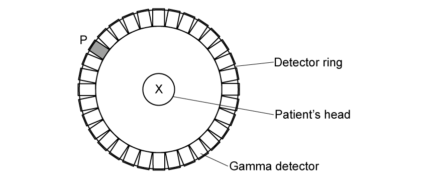
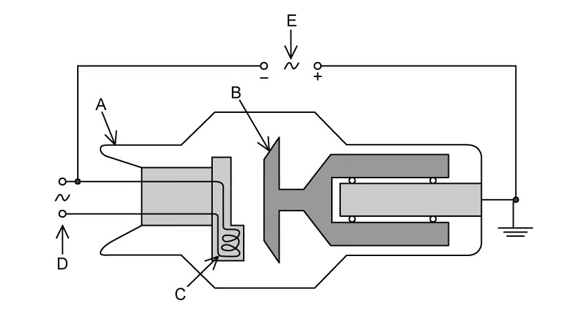
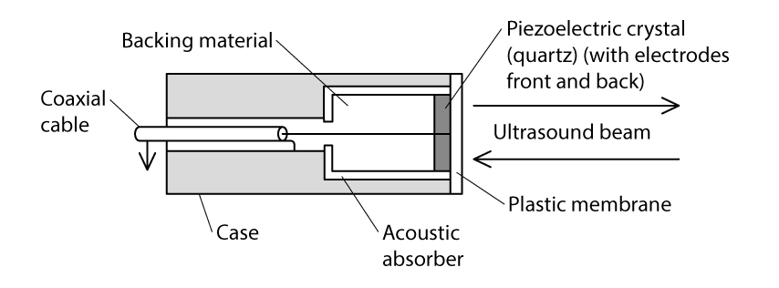
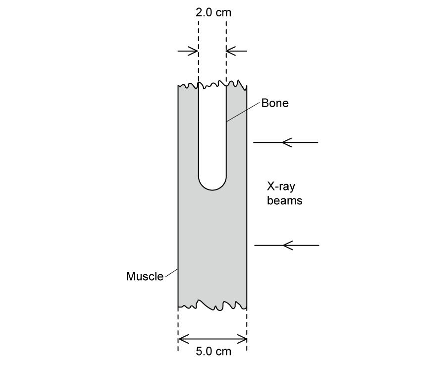
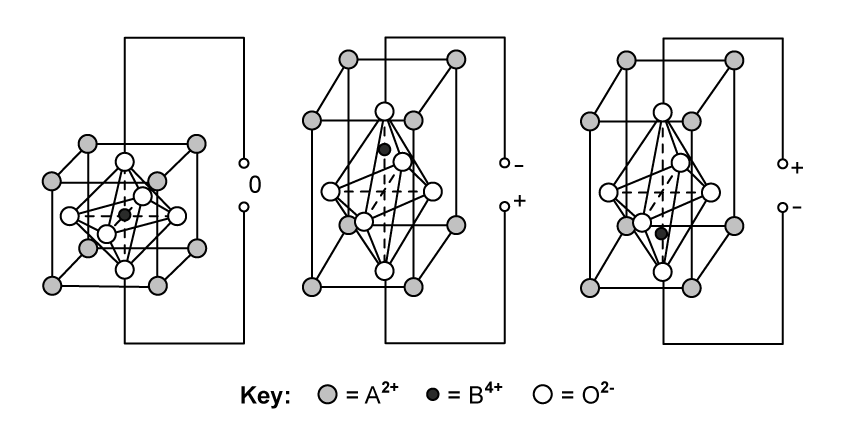
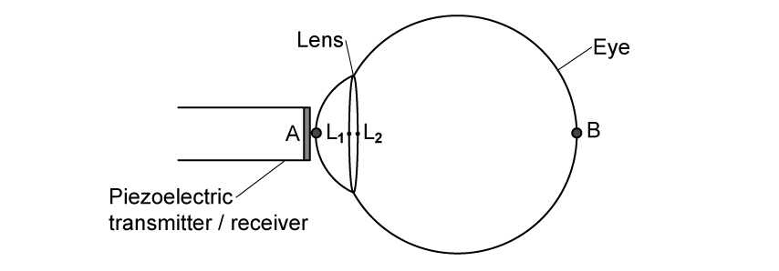
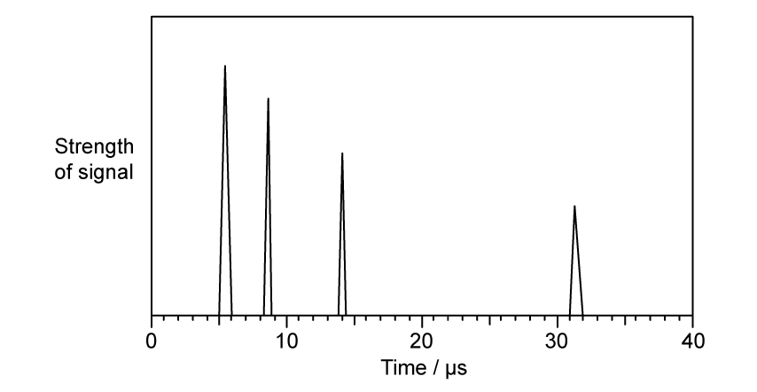
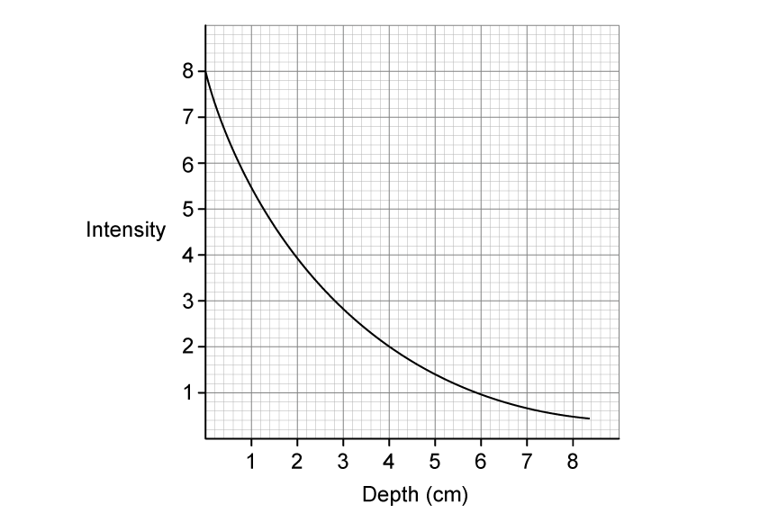
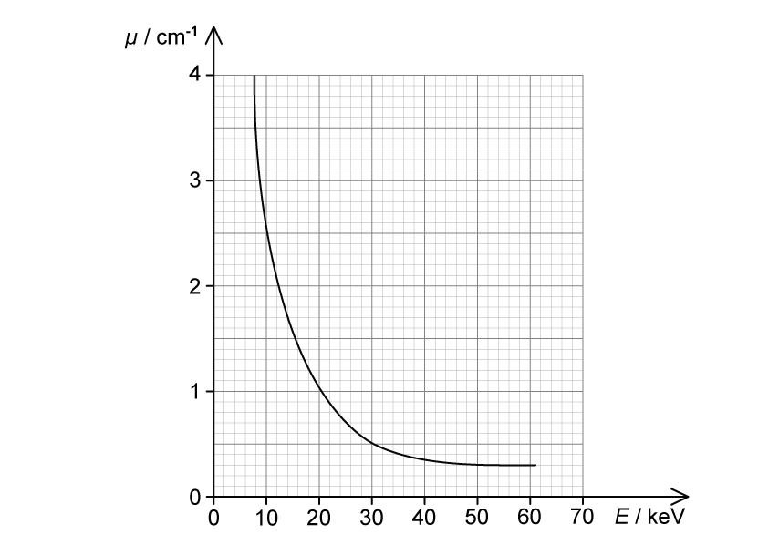
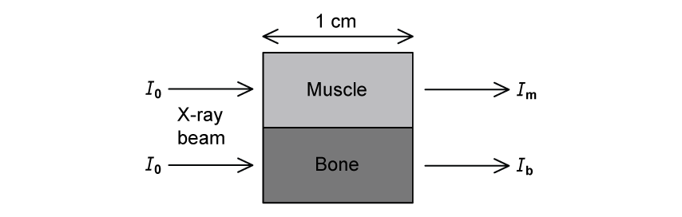

### Selected examination questions

::: {.question-card}
### Example 1 · Acoustic impedance, reflection and matching · 24.1 SQ Easy Q1

**(a)** State what is meant by the specific acoustic impedance of a medium. `[2 marks]`

**(b)** Table 1.1 shows the density and speed of ultrasound in soft tissue and in air.

| medium | density / $\mathrm{kg\,m^{-3}}$ | speed of ultrasound / $\mathrm{m\,s^{-1}}$ |
|---|---:|---:|
| air | 1.29 | 330 |
| soft tissue | 1060 | 1540 |
| bone | 1600 | 4000 |

Using the data in Table 1.1, calculate:

**(i)** the acoustic impedance of air; `[1]`

**(ii)** the acoustic impedance of soft tissue; `[1]`

**(iii)** the acoustic impedance of bone. `[1]`

`[3 marks]`

**(c)** The intensity reflection coefficient $\alpha$ for two media is given by

$$\alpha=\frac{(Z_1-Z_2)^2}{(Z_1+Z_2)^2}$$

where $Z_1$ and $Z_2$ are the specific acoustic impedances of the two media.

Explain how this equation can be used to predict if ultrasound will be reflected or transmitted at the boundary between two materials. `[3 marks]`

**(d)** State what is meant by impedance matching and explain how it may be achieved. `[2 marks]`

Show mark scheme / model answer

- **(a)** Specific acoustic impedance is $Z=\rho c$ `[1]`, where $\rho$ is medium density and $c$ is ultrasound speed in that medium. `[1]`
- **(b)(i)** $Z_{\text{air}}=(1.29)(330)=426\ \mathrm{kg\,m^{-2}\,s^{-1}}$. `[1]`
- **(b)(ii)** $Z_{\text{tissue}}=(1060)(1540)=1.63\times10^6\ \mathrm{kg\,m^{-2}\,s^{-1}}$. `[1]`
- **(b)(iii)** $Z_{\text{bone}}=(1600)(4000)=6.4\times10^6\ \mathrm{kg\,m^{-2}\,s^{-1}}$. `[1]`
- **(c)** Compare $Z_1$ and $Z_2$. `[1]` If they are similar, $\alpha$ is close to zero, so there is little reflection and high transmission. `[1]` If they are very different, $\alpha$ is large, so reflection is strong and transmission is small. `[1]`
- **(d)** Impedance matching reduces the impedance change at a boundary `[1]`; a coupling gel with impedance similar to skin removes the air gap and reduces reflection. `[1]`

:::

::: {.question-card}
### Example 2 · Particle properties and annihilation photons · 24.2 SQ Easy Q3

**(a)** Fill in the missing information in Table 1.1 about the properties of the particles involved in PET scanning. `[3 marks]`

| particle | mass / kg | charge / C |
|---|---:|---:|
| electron | $9.11\times10^{-31}$ | |
| positron | | $1.60\times10^{-19}$ |
| gamma photon | | |

**(b)** When fluorine-18 decays, it emits a positron which only travels a very short distance before interacting with an electron, resulting in annihilation. As a result, gamma photons are produced.

Show that each gamma photon produced has an energy of $512\ \mathrm{keV}$. `[4 marks]`

**(c)** Calculate the momentum, in $\mathrm{N\,s}$, of one of the gamma photons produced in this annihilation. `[2 marks]`

**(d)** Fig. 1.1 shows a cross-sectional view of a patient's head inside a ring of gamma detectors during a PET scan.

{.question-figure fig-alt="Cross-sectional view of a patient's head inside a gamma-detector ring"}

A positron and an electron meet and annihilate at position X. Assume they have negligible kinetic energy when they meet.

Gamma photons are produced in this annihilation and are detected. The arrival of one gamma photon at detector P triggers a signal.

**(i)** On Fig. 1.1, identify the other point on the detector that will be triggered by this annihilation. `[1]`

**(ii)** State and explain the conservation law which explains why P and the point you identified in **(d)(i)** will be triggered. `[2]`

`[3 marks]`

Show mark scheme / model answer

- **(a)** Electron: mass $9.11\times10^{-31}\ \mathrm{kg}$, charge $-1.60\times10^{-19}\ \mathrm{C}$. `[1]` Positron: mass $9.11\times10^{-31}\ \mathrm{kg}$, charge $+1.60\times10^{-19}\ \mathrm{C}$. `[1]` Gamma photon: zero rest mass and zero charge. `[1]`
- **(b)** Use mass-energy equivalence, $E=mc^2$. `[1]` $E=(9.11\times10^{-31})(3.00\times10^8)^2=8.20\times10^{-14}\ \mathrm{J}$. `[1]` Convert to electronvolts: $E=(8.20\times10^{-14})/(1.60\times10^{-19})=5.12\times10^5\ \mathrm{eV}$. `[1]` Hence each photon has energy $512\ \mathrm{keV}$. `[1]`
- **(c)** $p=E/c$ `[1]`, so $p=(8.20\times10^{-14})/(3.00\times10^8)=2.7\times10^{-22}\ \mathrm{N\,s}$. `[1]`
- **(d)(i)** Mark the point on the detector ring diametrically opposite P along the straight line through X. `[1]`
- **(d)(ii)** Momentum is conserved. `[1]` Since the electron-positron pair has negligible initial momentum, the two photons must have equal and opposite momenta. `[1]`

:::

::: {.question-card}
### Example 3 · Principles of PET and particle annihilation · 24.2 SQ Medium Q3

**(a)** Positron emission tomography (PET) is useful in medical diagnosis. PET can be used to locate tumours or areas of increased activity within the brain.

**(i)** Describe the principles of PET. `[4]`

**(ii)** Explain how PET scans are able to locate tumours or areas of increased activity within the brain. `[2]`

`[6 marks]`

**(b)** The decay of the nuclei in the tracer material results in the emission of a positron. Two of the detectors, directly opposite to each other, are triggered as they each receive a gamma photon from the annihilation of the positron.

Suggest why the annihilation:

**(i)** occurs close to the point where the positron is emitted; `[2]`

**(ii)** results in two gamma-ray photons of equal energy moving in opposite directions. `[2]`

`[4 marks]`

**(c)** Three tracer isotopes, rubidium-82, fluorine-18 and iodine-131, are being considered for use in a PET scanner. The incomplete nuclear decay equations are shown below.

$$^{82}_{37}\mathrm{Rb}\rightarrow{}^{82}_{36}\mathrm{Kr}+\ldots$$

$$^{131}_{53}\mathrm{I}\rightarrow{}^{131}_{54}\mathrm{Xe}+\ldots$$

$$^{18}_{9}\mathrm{F}\rightarrow{}^{18}_{8}\mathrm{O}+\ldots$$

**(i)** Complete the nuclear decay equations for rubidium-82, iodine-131 and fluorine-18. `[3]`

**(ii)** State and explain which tracer would not be suitable for use in a PET scanner. `[2]`

`[5 marks]`

**(d)** It is suggested that a scanner could be designed to detect photons produced from the annihilation of a proton and an antiproton.

Calculate:

**(i)** the energy released in the proton-antiproton annihilation; `[2]`

**(ii)** the wavelength of the $\gamma$-ray photons produced in the annihilation. `[2]`

`[4 marks]`

Show mark scheme / model answer

- **(a)(i)** Use a positron-emitting radioactive tracer. `[1]` Positrons annihilate with electrons in the patient and produce two gamma photons. `[1]` The photons travel in opposite directions and are detected by a ring of detectors. `[1]` A computer uses coincident detections to build a three-dimensional image. `[1]`
- **(a)(ii)** The two photons are produced simultaneously and reach diametrically opposite detectors. `[1]` Their line of response and arrival-time difference locate the annihilation; a high tracer concentration identifies a tumour or increased metabolic activity. `[1]`
- **(b)(i)** Electrons occur in all atoms in the patient's tissue `[1]`, so the positron encounters an electron and annihilates after travelling only a short distance. `[1]`
- **(b)(ii)** The initial total momentum is approximately zero, so total momentum must remain zero. `[1]` The photons therefore have equal and opposite momenta; since $p=E/c$, they have equal energies. `[1]`
- **(c)(i)** $^{82}_{37}\mathrm{Rb}\rightarrow{}^{82}_{36}\mathrm{Kr}+{}^{0}_{+1}\mathrm{e}+\nu_e$. `[1]` $^{131}_{53}\mathrm{I}\rightarrow{}^{131}_{54}\mathrm{Xe}+{}^{0}_{-1}\mathrm{e}+\bar{\nu}_e$. `[1]` $^{18}_{9}\mathrm{F}\rightarrow{}^{18}_{8}\mathrm{O}+{}^{0}_{+1}\mathrm{e}+\nu_e$. `[1]`
- **(c)(ii)** Iodine-131 is unsuitable `[1]` because it is a beta-minus emitter and does not provide positrons to annihilate with electrons. `[1]`
- **(d)(i)** $E=2m_pc^2=2(1.67\times10^{-27})(3.00\times10^8)^2=3.0\times10^{-10}\ \mathrm{J}$. `[2]`
- **(d)(ii)** Each photon receives half the total energy, so $\lambda=hc/(E/2)=2hc/E$ `[1]` $=1.32\times10^{-15}\ \mathrm{m}$. `[1]`

:::

::: {.question-card}
### Example 4 · Fluorine-18 activity, tracer mass and PET-CT · 24.2 SQ Hard Q2

**(a)** Fluorodeoxyglucose (FDG) is a radiopharmaceutical used for PET scans. It contains radioactive fluorine-18 (F-18), which decays by positron emission with a half-life of 110 minutes.

In preparation for a scan scheduled for 12:00 p.m., a radiologist prepares a sample of F-18 FDG at 5 a.m. earlier in the day. For this scan, the radiologist determines the optimum activity of fluorine-18 would be $10\ \mathrm{mCi}$ when the scan starts at 12:00 p.m.

Determine the activity, in GBq, of the dose of fluorine-18 that the radiologist should prepare at 5 a.m.

$1\ \mathrm{mCi}=3.7\times10^7\ \mathrm{Bq}$ `[3 marks]`

**(b)** The patient is scheduled to come in an hour earlier, at 11:00 a.m. to receive their injection of F-18 FDG. At this facility, the maximum activity limit of F-18 FDG that can be injected into patients is set at $14\ \mathrm{mCi}$.

The radiologist forgets to factor this into their calculations when preparing the dose of F-18 FDG and discovers that it has an activity of $15.3\ \mathrm{mCi}$ at 11:00 a.m. when the patient arrives.

Determine the earliest time, to the nearest minute, at which the sample of F-18 FDG may be injected into the patient. `[2 marks]`

**(c)** About 9.9% of the mass of F-18 FDG is fluorine-18. The molar mass of fluorine-18 is $0.018\ \mathrm{kg\,mol^{-1}}$.

**(i)** Calculate the initial mass, in kg, of F-18 FDG given to the patient at the time of injection. `[3]`

**(ii)** Determine the fraction of F-18 FDG remaining in the patient's body 6 hours after the initial injection. `[2]`

**(iii)** Suggest why the actual fraction would likely be lower than the value you calculated in **(c)(ii)**. `[1]`

`[6 marks]`

**(d)** Both computed tomography (CT) scans and positron emission tomography (PET) scans can produce detailed pictures of the organs and tissues inside the body. Both techniques share many similarities and differences.

In recent years, it has become much more common for doctors to use a PET-CT scan which is a machine able to perform both scans simultaneously. This way, doctors can combine the images from both scans to create an enhanced picture of the tissue or organ being studied.

**(i)** Describe the major differences between a CT scan and a PET scan. `[4]`

**(ii)** Discuss the benefits and risks of using a PET-CT scanner instead of using either scan separately in medical diagnosis. `[2]`

`[6 marks]`

Show mark scheme / model answer

- **(a)** The elapsed time is $420\ \mathrm{min}$ and $\lambda=\ln2/110\ \mathrm{min^{-1}}$. `[1]` $A_0=10e^{\lambda(420)}=141\ \mathrm{mCi}$. `[1]` Therefore $A_0=(141)(3.7\times10^7)=5.2\times10^9\ \mathrm{Bq}=5.2\ \mathrm{GBq}$. `[1]`
- **(b)** Solve $14=15.3e^{-\lambda t}$ to obtain $t=14.1\ \mathrm{min}$. `[1]` The earliest time to the nearest practical minute is 11:15 a.m. `[1]`
- **(c)(i)** At injection, $A=14\ \mathrm{mCi}=5.18\times10^8\ \mathrm{Bq}$ and $\lambda=1.05\times10^{-4}\ \mathrm{s^{-1}}$, so $N=A/\lambda=4.93\times10^{12}$. `[1]` The F-18 mass is $m=(N/N_A)M=1.47\times10^{-13}\ \mathrm{kg}$. `[1]` Hence the FDG mass is $(1.47\times10^{-13})/0.099=1.5\times10^{-12}\ \mathrm{kg}$. `[1]`
- **(c)(ii)** $N/N_0=2^{-360/110}=0.103$, so the radioactive F-18 FDG fraction remaining is approximately $0.10$ (or $0.11$ using the rounded decay constant). `[2]`
- **Source check for (c)(ii):** the PDF solution correctly obtains $0.11$ from exponential decay but then subtracts it from 1 and labels $0.89$ as the fraction remaining. That final subtraction gives the fraction that has decayed, not the radioactive fraction remaining; the answer above corrects this inconsistency.
- **(c)(iii)** Biological elimination, such as excretion, removes FDG from the body in addition to radioactive decay. `[1]`
- **(d)(i)** CT sends external X-rays through the body and maps attenuation to show anatomical structure; PET injects a positron-emitting tracer and detects coincident annihilation gamma photons to show tracer concentration and metabolic activity. `[4]`
- **(d)(ii)** Combining the anatomical and functional information can improve diagnosis or collect both scans at the same time. `[1]` The patient receives more ionising-radiation exposure and may face adverse effects from injected substances. `[1]`

:::

::: {.question-card}
### Example 5 · X-ray tube, photon energy and image contrast · 24.1 SQ Easy Q3

**(a)** Fig. 1.1 shows a simplified diagram of an X-ray tube.

{.question-figure fig-alt="Simplified X-ray tube with components A to E"}

State the name and purpose of:

**(i)** component A; `[2]`

**(ii)** component B; `[2]`

**(iii)** component C; `[2]`

**(iv)** component D; `[2]`

**(v)** component E. `[2]`

`[10 marks]`

**(b)** The accelerating potential difference between the cathode and the anode of an X-ray tube is $75\ \mathrm{kV}$.

**(i)** State the maximum energy, in eV, of the photons produced in the X-ray tube. `[1]`

**(ii)** Calculate the minimum wavelength of photons in the X-ray beam. `[3]`

`[4 marks]`

**(c)** A parallel beam of X-rays is incident on a medium with a linear absorption coefficient $\mu$.

State what is meant by the linear absorption coefficient. `[2 marks]`

**(d)** Table 1.1 shows the linear absorption coefficient for an X-ray beam in blood and in muscle.

| medium | $\mu/\mathrm{cm^{-1}}$ |
|---|---:|
| blood | 0.23 |
| muscle | 0.22 |

**(i)** State what is meant by the contrast of an X-ray. `[1]`

**(ii)** Using the data in Table 1.1, explain why an X-ray image of blood vessels in muscle would have poor contrast. `[2]`

`[3 marks]`

Show mark scheme / model answer

- **(a)(i)** A: evacuated glass tube `[1]`, preventing electron collisions with gas particles. `[1]`
- **(a)(ii)** B: anode/metal target `[1]`, producing X-rays when accelerated electrons strike it. `[1]`
- **(a)(iii)** C: cathode/heated filament `[1]`, releasing electrons by thermionic emission. `[1]`
- **(a)(iv)** D: low-voltage supply `[1]`, heating the filament. `[1]`
- **(a)(v)** E: high-voltage supply `[1]`, creating the large accelerating p.d. between cathode and anode. `[1]`
- **(b)(i)** $75\ \mathrm{keV}$, or $7.5\times10^4\ \mathrm{eV}$. `[1]`
- **(b)(ii)** $eV=hc/\lambda_{\min}$ `[1]`, so $\lambda_{\min}=(6.63\times10^{-34})(3.00\times10^8)/[(1.60\times10^{-19})(75\times10^3)]$ `[1]` $=1.66\times10^{-11}\ \mathrm{m}$. `[1]`
- **(c)** In $I=I_0e^{-\mu x}$, $\mu$ is the constant describing fractional intensity reduction per unit thickness; $I_0$ is incident intensity, $I$ transmitted intensity and $x$ distance through the material. `[2]`
- **(d)(i)** Contrast is the difference in blackening or detected intensity between regions of the image. `[1]`
- **(d)(ii)** Blood and muscle have very similar $\mu$ values `[1]`, so they attenuate similar fractions of the beam and produce little intensity difference. `[1]`

:::

::: {.question-card}
### Example 6 · Ultrasound transducer, coupling and X-ray attenuation · 24.1 SQ Medium Q3

**(a)** Fig. 1.1 shows a diagram of a piezoelectric transducer.

{.question-figure fig-alt="Labelled piezoelectric ultrasound transducer"}

With reference to Fig. 1.1:

**(i)** Describe the process by which the transducer produces a pulse of ultrasound. `[4]`

**(ii)** Explain how short pulses of ultrasound are produced and state why they are essential. `[2]`

**(iii)** Explain how the received signals are detected. `[2]`

`[8 marks]`

**(b)** Two patients arrive at a hospital. One patient is a child with a broken arm, the other is a pregnant woman coming in for a check-up for her unborn foetus.

Over the course of the diagnosis and treatment of the child's broken arm, several images of the arm are required. Similarly, to check the progress of a woman's pregnancy, several images of the foetus are required.

For each scenario, suggest the most appropriate imaging technique to use and give two reasons for the choice. `[4 marks]`

**(c)** Ultrasound is incident on a boundary between two materials. Some of the ultrasound is reflected at the boundary and the rest is transmitted across the boundary.

The acoustic impedance of air is $4.29\times10^2\ \mathrm{kg\,m^{-2}\,s^{-1}}$.

The acoustic impedance of coupling gel is $1.48\times10^6\ \mathrm{kg\,m^{-2}\,s^{-1}}$.

The acoustic impedance of skin is $1.65\times10^6\ \mathrm{kg\,m^{-2}\,s^{-1}}$.

Calculate the percentage of the ultrasound which would be transmitted into the skin when incident on:

**(i)** an air-skin boundary; `[2]`

**(ii)** a gel-skin boundary. `[2]`

`[4 marks]`

**(d)** An X-ray image showing the cross-section of the bone and muscle is shown in Fig. 1.1.

{.question-figure fig-alt="Parallel X-ray paths through muscle and through bone plus muscle"}

Parallel X-ray beams of intensity $I_0$ are incident on the muscle and bone as shown. The emergent beam after passing through muscle alone has an intensity of $I_m$ and an intensity of $I_{bm}$ after passing through the bone and the muscle.

**(i)** Determine, in terms of $I_0$, the intensities $I_m$ and $I_{bm}$ of the emergent X-rays.

The linear attenuation coefficient of bone is $2.90\ \mathrm{cm^{-1}}$. The linear attenuation coefficient of muscle is $0.95\ \mathrm{cm^{-1}}$. `[4]`

**(ii)** Suggest why, on an X-ray plate, the contrast between bone and muscle is much greater than the contrast between fat and muscle.

The linear attenuation coefficient of fat is $0.90\ \mathrm{cm^{-1}}$. `[2]`

`[6 marks]`

Show mark scheme / model answer

- **(a)(i)** Apply a high-frequency alternating p.d. to the electrodes; at resonance the crystal expands and contracts at the applied frequency; its vibration produces pressure waves through the membrane; the backing material damps the crystal. `[4]`
- **(a)(ii)** Apply the alternating p.d. only briefly. `[1]` Transmission must stop before echoes return, preventing overlap/interference. `[1]`
- **(a)(iii)** Returning ultrasound deforms the crystal `[1]`, inducing an alternating p.d. that is detected. `[1]`
- **(b)** Broken arm: X-ray imaging, because bone-soft-tissue contrast and spatial resolution are high. `[2]` Foetus: ultrasound, because it is non-ionising and provides real-time soft-tissue imaging. `[2]`
- **(c)(i)** Reflected fraction $=[(1.65\times10^6-4.29\times10^2)/(1.65\times10^6+4.29\times10^2)]^2=0.99896$. `[1]` Transmission is approximately $0.10\%$. `[1]`
- **(c)(ii)** Reflected fraction $=[(1.65-1.48)/(1.65+1.48)]^2=2.95\times10^{-3}$. `[1]` Transmission is approximately $99.7\%$. `[1]`
- **(d)(i)** Muscle only: $I_m=I_0e^{-(0.95)(5.0)}=8.7\times10^{-3}I_0$. `[2]` Bone path: $I_{bm}=I_0e^{-(2.90)(2.0)}e^{-(0.95)(3.0)}=1.8\times10^{-4}I_0$. `[2]`
- **(d)(ii)** Contrast depends on the difference in attenuation. Bone and muscle have very different $\mu$ values, while fat and muscle have similar values. `[2]`

:::

::: {.question-card}
### Example 7 · PZT crystal and ultrasound scanning of an eye · 24.1 SQ Hard Q1

**(a)** Most modern ultrasound transducers are made from the piezoelectric material lead zirconate titanate (PZT).

Fig. 1.1 shows the effect on the structure of a crystal of PZT when an alternating potential difference is applied across it.

{.question-figure fig-alt="PZT crystal structures under zero and reversed electric fields"}

**(i)** Describe what happens at a molecular level when an alternating potential difference is applied across a PZT transducer to generate ultrasound. You may draw on Fig. 1.1 to help with your answer. `[4]`

**(ii)** Describe the conditions that will enable maximum energy conversion into ultrasound to occur. `[2]`

`[6 marks]`

**(b)** An eye can be imaged using either an A-scan or a B-scan ultrasound. Fig. 1.2 shows the position of a piezoelectric transducer being used during an A-scan of an eye.

{.question-figure fig-alt="Ultrasound A-scan path through an eye and lens"}

**(i)** Explain how an A-scan could be used to measure the thickness of a patient's eye lens. `[3]`

**(ii)** Explain why a B-scan would be better than an A-scan for imaging damaged tissue that surrounds the eye. `[2]`

`[5 marks]`

**(c)** Fig. 1.3 shows an ultrasound A-scan trace from the scan of an eye.

{.question-figure fig-alt="Ultrasound A-scan signal strength against time"}

The speed of ultrasound in the eye is $1520\ \mathrm{m\,s^{-1}}$ and the speed of ultrasound in the lens is $1670\ \mathrm{m\,s^{-1}}$.

Use Fig. 1.3 to calculate the thickness of:

**(i)** the lens, in mm; `[2]`

**(ii)** the eye, in cm. `[3]`

`[5 marks]`

**(d)** The graph in Fig. 1.4 shows the attenuation of the intensity of ultrasound at a frequency of $3\ \mathrm{MHz}$ with depth.

{.question-figure fig-alt="Ultrasound intensity attenuation with depth"}

When carrying out the scan, a gel is applied between the transducer and eye to enable 100% transmission of the ultrasound into the eye.

Use the information in Table 1.1 and the graph in Fig. 1.4 to calculate the ratio of the intensity of the reflections from A and B, by the time the pulses come back to the receiver.

| medium | acoustic impedance / $\mathrm{kg\,m^{-2}\,s^{-1}}$ |
|---|---:|
| eye | $1.52\times10^6$ |
| eye lens | $1.84\times10^6$ |
| surrounding tissue | $1.69\times10^6$ |

`[4 marks]`

Show mark scheme / model answer

- **(a)(i)** The field attracts positive and negative lattice charges in opposite directions; the central positive ion moves and deforms the crystal; reversing the p.d. reverses deformation; repeated reversal makes the crystal oscillate at the applied frequency and transfer vibrations to the surrounding medium. `[4]`
- **(a)(ii)** Set the applied alternating frequency equal to the natural frequency of the PZT crystal `[1]`, producing resonance and maximum energy transfer. `[1]`
- **(b)(i)** Send ultrasound pulses into the eye; the front and back lens surfaces produce echoes; use their time separation with the speed in the lens and divide the round-trip distance by two. `[3]`
- **(b)(ii)** An A-scan is one-dimensional and mainly measures distances; a B-scan combines lines to form a two- or three-dimensional view of surrounding structures. `[2]`
- **(c)(i)** Lens echoes occur at $8.5$ and $14.0\ \mathrm{\mu s}$. Thus $d=\frac12(1670)(5.5\times10^{-6})=4.6\ \mathrm{mm}$. `[2]`
- **(c)(ii)** Before lens: $\frac12(1520)(3.0\times10^{-6})=2.28\ \mathrm{mm}$. `[1]` After lens: $\frac12(1520)(17.5\times10^{-6})=13.3\ \mathrm{mm}$. `[1]` Total $=2.28+4.59+13.3=20.2\ \mathrm{mm}=2.02\ \mathrm{cm}$. `[1]`
- **(d)** The reflection coefficients at the relevant boundaries are both small and of similar order, so the difference is approximated as negligible after transmissions. `[2]` The B echo travels about $4\ \mathrm{cm}$ farther in its round trip; the graph shows intensity falling from 8 to 2 over this depth, a factor of 4. Hence $I_A/I_B\approx4$. `[2]`

:::

::: {.question-card}
### Example 8 · X-ray energy, contrast media and beam filtering · 24.1 SQ Hard Q2

**(a)** The data in Table 1.1 shows how the attenuation coefficient $\mu$ depends on the energy of the X-rays in bone and muscle.

| maximum X-ray energy / keV | $\mu_{\text{bone}}/\mathrm{cm^{-1}}$ | $\mu_{\text{muscle}}/\mathrm{cm^{-1}}$ |
|---:|---:|---:|
| 50 | 3.32 | 0.54 |
| 100 | 0.60 | 0.21 |
| 250 | 0.32 | 0.16 |
| 4000 | 0.087 | 0.049 |

Using the data in Table 1.1, state and explain which X-ray energy would produce an image of a bone next to a muscle with the best contrast. `[3 marks]`

**(b)** For X-ray energies around $30\ \mathrm{keV}$ and below, the attenuation coefficient $\mu$ is approximately proportional to the cube of the proton number $Z$ of the absorbing material.

The proton numbers of muscle, bone and some contrast media are shown in Table 1.2.

| substance | main elements |
|---|---|
| muscle | ${}_{1}\mathrm{H},{}_{6}\mathrm{C},{}_{8}\mathrm{O}$ |
| bone | ${}_{1}\mathrm{H},{}_{6}\mathrm{C},{}_{8}\mathrm{O},{}_{15}\mathrm{P},{}_{20}\mathrm{Ca}$ |
| contrast media | ${}_{53}\mathrm{I},{}_{56}\mathrm{Ba}$ |

Using the information in Table 1.2:

**(i)** show that bone absorbs X-rays about eight times more strongly than muscle; `[3]`

**(ii)** explain why contrast media are made from elements with high values of atomic number $Z$. `[3]`

`[6 marks]`

**(c)** The graph in Fig. 1.1 shows how the attenuation coefficient $\mu$ of muscle varies with photon energy $E$.

{.question-figure fig-alt="Muscle X-ray attenuation coefficient against photon energy"}

Using Fig. 1.1, explain why X-rays with energies less than $20\ \mathrm{keV}$ are usually filtered out of the beam. `[4 marks]`

**(d)** An X-ray beam of energy $20\ \mathrm{keV}$ and intensity $I_0$ is incident on a sample of muscle and bone as shown in Fig. 1.2. The emergent beam intensities from the muscle and bone are $I_m$ and $I_b$, respectively.

{.question-figure fig-alt="X-ray beams passing through one centimetre of muscle and bone"}

Using the graph in Fig. 1.1, calculate the ratio of intensities to compare the attenuation produced by $1\ \mathrm{cm}$ of bone and $1\ \mathrm{cm}$ of muscle. `[3 marks]`

Show mark scheme / model answer

- **(a)** $50\ \mathrm{keV}$ gives best contrast `[1]` because contrast depends on attenuation difference `[1]`, and $3.32-0.54$ is the largest difference in the table. `[1]`
- **(b)(i)** Representative average $Z$ values are about 5 for muscle and 10 for bone. `[1]` Their ratio is 2. `[1]` Since $\mu\propto Z^3$, the absorption ratio is $2^3=8$. `[1]`
- **(b)(ii)** Contrast media must absorb X-rays strongly. `[1]` X-rays interact with electrons and nuclei `[1]`, so high-$Z$ atoms interact more strongly and increase contrast. `[1]`
- **(c)** Below $20\ \mathrm{keV}$, attenuation is very large `[1]`; these photons are mostly absorbed by tissue `[1]`, do not reach the detector or improve the image `[1]`, and only increase patient dose. `[1]`
- **(d)** At $20\ \mathrm{keV}$, $\mu_{\text{muscle}}\approx1.0\ \mathrm{cm^{-1}}$. `[1]` From **(b)**, $\mu_{\text{bone}}\approx8.0\ \mathrm{cm^{-1}}$. `[1]` Thus $I_b/I_m=e^{-8}/e^{-1}=e^{-7}=9.1\times10^{-4}$. `[1]`

:::
