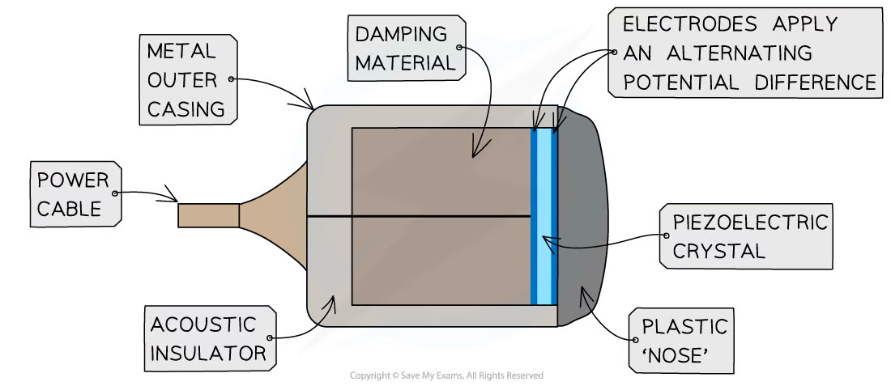
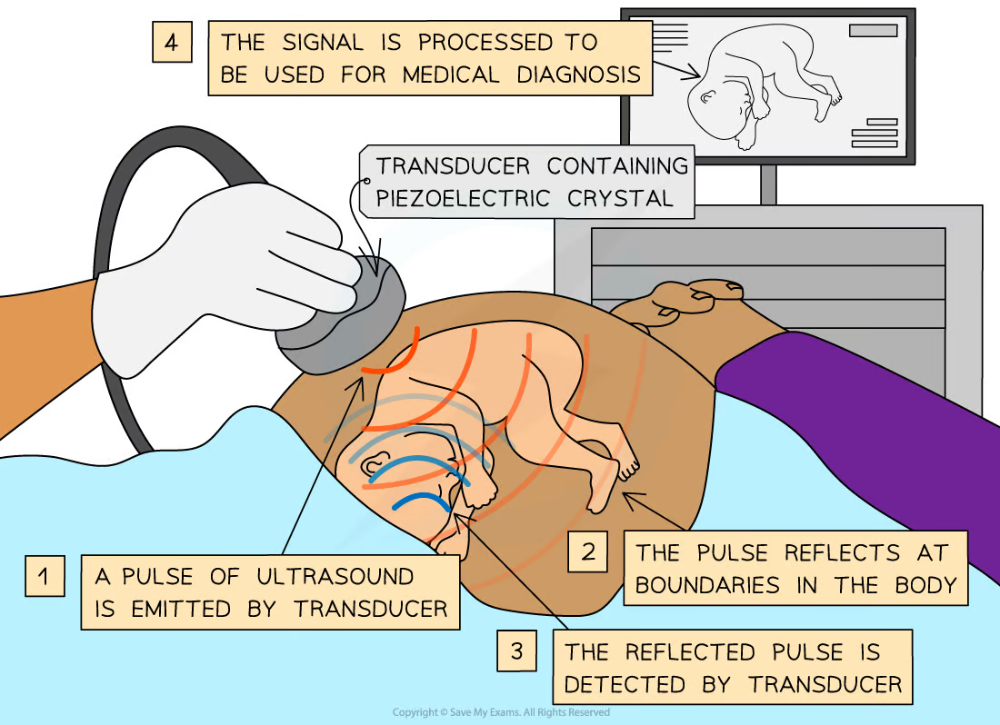
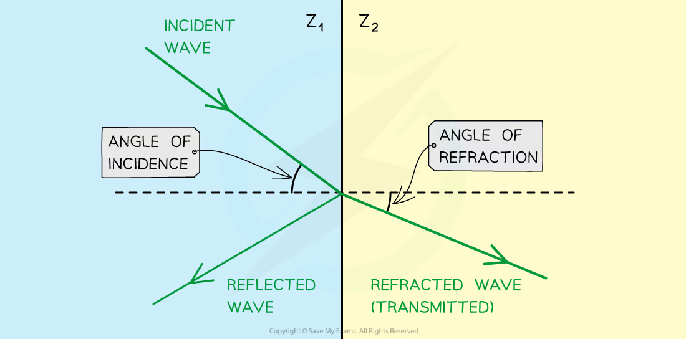
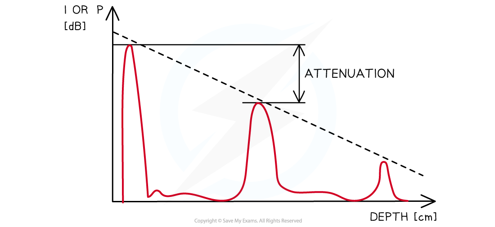
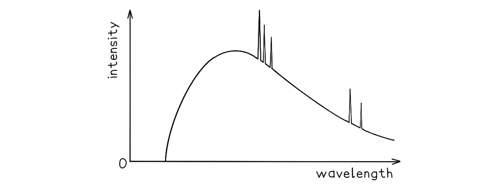
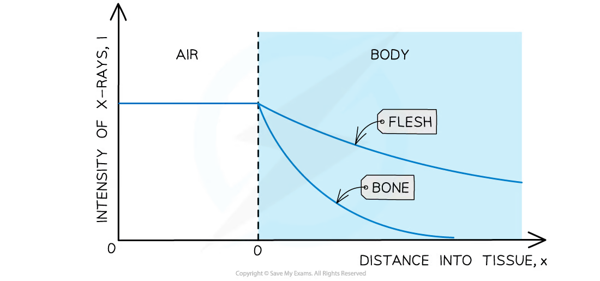
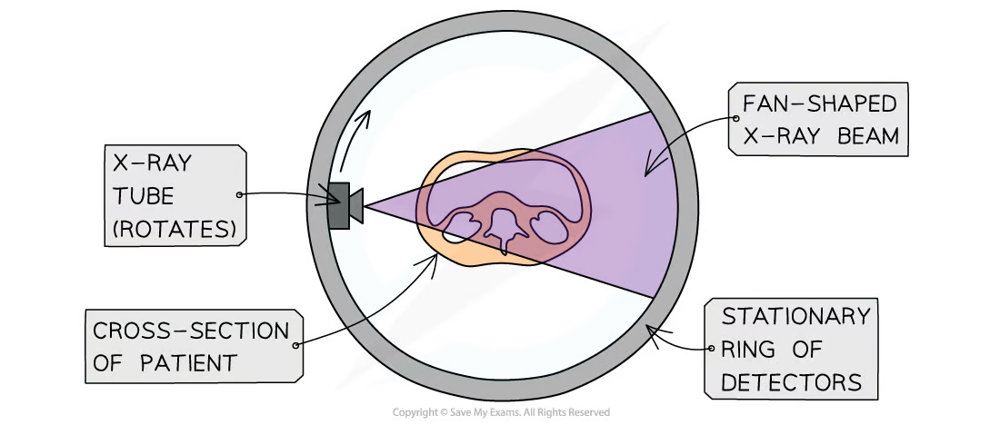
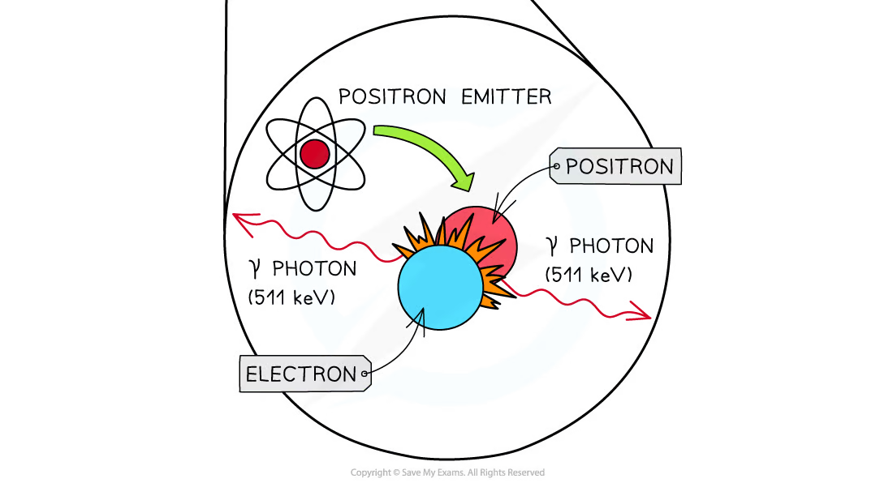
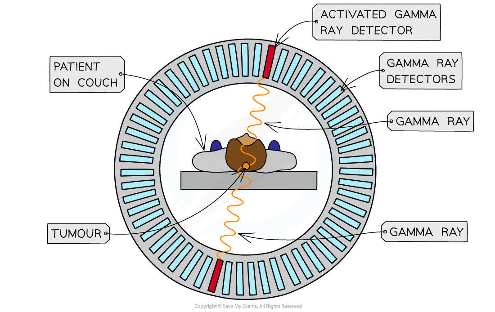

## Learning objectives

By the end of this chapter, you should be able to:

- explain how piezoelectric transducers generate and detect ultrasound;
- use pulse-echo timing to locate internal boundaries;
- calculate specific acoustic impedance, intensity reflection and attenuation;
- explain the production of X-rays and use the minimum-wavelength equation;
- explain attenuation, contrast and the construction of CT images;
- describe positron-emitting tracers and electron-positron annihilation;
- calculate annihilation-photon energy and momentum;
- explain how coincidence detection produces a PET image and compare PET with CT.

## 24.1 Production and use of ultrasound

::: {.study-card}
### Piezoelectric effect and transducers

A piezoelectric crystal changes shape when a potential difference is applied across it. An alternating p.d. makes the crystal expand and contract, producing mechanical vibrations and hence ultrasound. The amplitude is greatest when the applied frequency is close to the crystal's natural frequency: this is resonance.

The effect is reversible. An incoming ultrasound wave deforms the crystal and produces an alternating e.m.f., so the same probe can transmit and receive. A damping or backing layer stops the crystal vibrating quickly after a pulse, while a matching layer improves transfer of sound into the patient.
:::

::: {.knowledge-figure}
{fig-alt="Piezoelectric ultrasound transducer containing a crystal, backing material, casing and electrodes"}

The crystal is driven electrically for transmission and produces an electrical signal when an echo deforms it during reception.
:::

::: {.example-card}
### Worked Example 1 · Ultrasound wavelength and resolution

Ultrasound travels through soft tissue at $1540\ \mathrm{m\,s^{-1}}$. A probe operates at $5.0\ \mathrm{MHz}$. Calculate the wavelength.

**Solution**

Using $v=f\lambda$,

$$\lambda=\frac{v}{f}=\frac{1540}{5.0\times10^6}
 =3.08\times10^{-4}\ \mathrm{m}.$$

Therefore,

$$\lambda=0.308\ \mathrm{mm}.$$

A shorter wavelength generally allows finer spatial detail, but higher frequency also causes greater attenuation and gives less penetration.
:::

::: {.study-card}
### Pulse-echo imaging

The p.d. is applied in short bursts rather than continuously. The pulse travels through the body and is partly reflected at a boundary where the acoustic properties change. The echo time is the round-trip time from the transducer to the boundary and back.

If the speed in the medium is known, the boundary depth is

$$d=\frac{ct}{2}.$$

The factor of 2 is essential. An A-scan displays echo amplitude against time; a B-scan combines many scan lines to form a two-dimensional image. Stronger echoes indicate a larger change in acoustic impedance.
:::

::: {.knowledge-figure}
{fig-alt="Ultrasound transducer sending a pulse into the body and receiving an echo from a boundary"}

The transducer sends a pulse, the pulse reflects from a boundary, and the returning echo is converted into an electrical signal.
:::

::: {.example-card}
### Worked Example 2 · Finding tissue depth from an echo

An ultrasound echo returns $130\ \mu\mathrm{s}$ after the pulse is emitted. Take the speed of sound in the tissue to be $1540\ \mathrm{m\,s^{-1}}$. Calculate the depth of the reflecting boundary.

**Solution**

The measured time is for the outward and return journeys:

$$d=\frac{ct}{2}
 =\frac{(1540)(130\times10^{-6})}{2}
 =0.100\ \mathrm{m}.$$

**Answer:** the boundary is $0.100\ \mathrm{m}$, or $10.0\ \mathrm{cm}$, below the transducer.
:::

::: {.formula-panel}
### Specific acoustic impedance and reflection

Specific acoustic impedance is

$$Z=\rho c,$$

where $\rho$ is the density and $c$ is the ultrasound speed in the medium. The unit is

$$\mathrm{kg\,m^{-2}\,s^{-1}}.$$

For normal incidence at a boundary,

$$\frac{I_R}{I_0}=\left(\frac{Z_1-Z_2}{Z_1+Z_2}\right)^2,$$

where $I_0$ is incident intensity and $I_R$ is reflected intensity. Similar impedances give weak reflection and good transmission; very different impedances give a strong echo. Coupling gel removes the air layer between the probe and skin, because the skin-air impedance mismatch would reflect most of the ultrasound.
:::

::: {.knowledge-figure}
{fig-alt="Ultrasound incident on a boundary between two media with reflected and transmitted waves"}

At normal incidence, the reflected fraction depends on the difference between the two specific acoustic impedances.
:::

::: {.example-card}
### Worked Example 3 · Intensity reflected at a tissue boundary

Two tissues have specific acoustic impedances $Z_1=1.50\times10^6$ and $Z_2=1.60\times10^6\ \mathrm{kg\,m^{-2}\,s^{-1}}$. Calculate the fraction of intensity reflected at normal incidence.

**Solution**

$$\frac{I_R}{I_0}=\left(\frac{1.50\times10^6-1.60\times10^6}{1.50\times10^6+1.60\times10^6}\right)^2
 =\left(\frac{-0.10}{3.10}\right)^2
 =1.04\times10^{-3}.$$

As a percentage,

$$\frac{I_R}{I_0}\times100=0.104\%.$$

Only a small fraction is reflected, so most of the ultrasound is transmitted into the next tissue.
:::

::: {.formula-panel}
### Ultrasound attenuation

Absorption and scattering reduce ultrasound intensity with distance:

$$I=I_0e^{-\mu x},$$

where $\mu$ is the linear attenuation coefficient and $x$ is the distance travelled in the medium. The same exponential model can be rearranged as

$$\mu=\frac{1}{x}\ln\left(\frac{I_0}{I}\right).$$

Increasing frequency usually improves resolution but increases attenuation. The operating frequency is therefore a compromise between detail and penetration.
:::

::: {.knowledge-figure}
{fig-alt="Ultrasound pulse echoes decreasing in amplitude with increasing tissue depth"}

The envelope of the echo amplitudes decreases with depth because the pulse is attenuated as it travels through tissue.
:::

::: {.example-card}
### Worked Example 4 · Attenuation through tissue

The attenuation coefficient for ultrasound in a tissue is $0.20\ \mathrm{cm^{-1}}$. Find the fraction of intensity remaining after the pulse has travelled $4.0\ \mathrm{cm}$.

**Solution**

$$\frac{I}{I_0}=e^{-\mu x}=e^{-(0.20)(4.0)}=e^{-0.80}=0.449.$$

**Answer:** approximately $45\%$ of the original intensity remains.
:::

## 24.2 Production and use of X-rays

::: {.study-card}
### X-ray tube and thermionic emission

The cathode filament is heated so that electrons are released by thermionic emission. A large accelerating p.d. drives the electrons through an evacuated tube towards a metal anode target. When the electrons are rapidly decelerated in the target, X-ray photons are produced. Most of the electron kinetic energy becomes heat, so the anode must be cooled.

The tube current controls the number of electrons arriving per second and therefore affects X-ray intensity. The accelerating p.d. controls the maximum electron kinetic energy and therefore the maximum photon energy.
:::

::: {.knowledge-figure}
{fig-alt="X-ray spectrum showing a continuous bremsstrahlung background and sharp characteristic peaks"}

The continuous spectrum is produced by electron deceleration. Sharp characteristic peaks occur when electrons in the target atoms make transitions between inner energy levels.
:::

::: {.formula-panel}
### Maximum photon energy and minimum wavelength

An electron accelerated through a p.d. $V$ gains kinetic energy $eV$. If all of this energy is transferred to one photon,

$$E_{\max}=eV.$$

Since $E=hc/\lambda$,

$$\lambda_{\min}=\frac{hc}{eV}.$$

This is the short-wavelength limit of the continuous X-ray spectrum. Increasing the tube p.d. decreases $\lambda_{\min}$ and increases the maximum photon energy.
:::

::: {.example-card}
### Worked Example 5 · Minimum wavelength from tube voltage

An X-ray tube operates at an accelerating p.d. of $80\ \mathrm{kV}$. Calculate the minimum wavelength of the emitted continuous spectrum. Use $h=6.63\times10^{-34}\ \mathrm{J\,s}$, $c=3.00\times10^8\ \mathrm{m\,s^{-1}}$ and $e=1.60\times10^{-19}\ \mathrm{C}$.

**Solution**

$$\lambda_{\min}=\frac{hc}{eV}
 =\frac{(6.63\times10^{-34})(3.00\times10^8)}{(1.60\times10^{-19})(80\times10^3)}
 =1.55\times10^{-11}\ \mathrm{m}.$$

**Answer:** $\lambda_{\min}=1.55\times10^{-11}\ \mathrm{m}$, or $0.0155\ \mathrm{nm}$.
:::

::: {.formula-panel}
### X-ray attenuation and contrast

X-ray intensity after travelling through thickness $x$ is

$$I=I_0e^{-\mu x}.$$

The linear attenuation coefficient $\mu$ depends on the material and photon energy. Bone has a larger attenuation coefficient than soft tissue, so fewer X-rays reach the detector behind bone and the image has contrast. High-$Z$ contrast media make selected structures more strongly absorbing.

Low-energy X-rays are removed by filtration because they are absorbed in the patient without contributing usefully to the image. Increasing photon energy generally increases penetration, but image contrast and radiation dose must also be considered.
:::

::: {.knowledge-figure}
{fig-alt="X-ray intensity decreasing with depth more rapidly in bone than in soft tissue"}

The steeper fall through bone means a lower transmitted intensity and produces contrast between bone and surrounding tissue.
:::

::: {.example-card}
### Worked Example 6 · X-ray transmission through tissue

The attenuation coefficient of a tissue is $0.35\ \mathrm{cm^{-1}}$. Calculate the fraction of X-ray intensity transmitted through $6.0\ \mathrm{cm}$ of the tissue.

**Solution**

$$\frac{I}{I_0}=e^{-\mu x}=e^{-(0.35)(6.0)}=e^{-2.10}=0.122.$$

**Answer:** $12.2\%$ of the incident intensity is transmitted.
:::

::: {.study-card}
### Projection imaging and computed tomography

A conventional radiograph is a two-dimensional projection. Structures at different depths can overlap, so information is superimposed on the detector.

In CT, an X-ray tube and detector system rotate around the patient. Many projections are collected from different angles. A computer uses the measured attenuation values to reconstruct a cross-sectional slice. Adjacent slices can be combined into a three-dimensional image.

CT avoids the superposition of a projection image and gives detailed localisation, but it normally gives a greater ionising-radiation dose than one radiograph.
:::

::: {.knowledge-figure}
{fig-alt="Rotating X-ray tube and stationary detector ring collecting projections through a patient cross-section"}

The rotating source provides projections from many directions, allowing the computer to reconstruct the internal cross-section.
:::

## 24.3 PET scanning

::: {.study-card}
### Tracers and positron emission

A PET tracer is a biologically useful molecule containing a radioactive isotope. It is chosen so that tissues absorb or metabolise it in a meaningful way. The tracer distribution therefore gives functional or metabolic information rather than only anatomical detail.

The isotope must be a beta-plus emitter. Its half-life should be long enough for production, transport and scanning, but short enough to limit the radiation dose. The emitted positron loses kinetic energy in the body before annihilating with an electron.
:::

::: {.formula-panel}
### Electron-positron annihilation

When a positron meets an electron, their rest masses can be converted into electromagnetic radiation. If their kinetic energies are negligible, the total available energy is

$$E=2m_ec^2.$$

To conserve momentum, two gamma photons are emitted in opposite directions. Each photon has energy

$$E_\gamma=m_ec^2\approx511\ \mathrm{keV},$$

and momentum

$$p_\gamma=\frac{E_\gamma}{c}.$$

The two photons are detected as a pair. A single photon cannot conserve both energy and momentum for an annihilation at rest in free space.
:::

::: {.knowledge-figure}
{fig-alt="An electron and positron annihilating to produce two oppositely directed gamma photons"}

The opposite photon directions give approximately back-to-back detection events and conserve momentum.
:::

::: {.example-card}
### Worked Example 7 · Energy and momentum of annihilation photons

Calculate the total energy released when an electron and positron annihilate at rest, and the momentum of each photon. Use $m_e=9.11\times10^{-31}\ \mathrm{kg}$ and $c=3.00\times10^8\ \mathrm{m\,s^{-1}}$.

**Solution**

The total energy is

$$E=2m_ec^2
 =2(9.11\times10^{-31})(3.00\times10^8)^2
 =1.64\times10^{-13}\ \mathrm{J}.$$

Each photon carries half of this energy:

$$E_\gamma=8.20\times10^{-14}\ \mathrm{J}=511\ \mathrm{keV}.$$

Therefore,

$$p_\gamma=\frac{E_\gamma}{c}
 =\frac{8.20\times10^{-14}}{3.00\times10^8}
 =2.73\times10^{-22}\ \mathrm{kg\,m\,s^{-1}}.$$

**Answer:** total energy $1.64\times10^{-13}\ \mathrm{J}$; each photon has energy $511\ \mathrm{keV}$ and momentum $2.73\times10^{-22}\ \mathrm{kg\,m\,s^{-1}}$.
:::

::: {.study-card}
### Coincidence detection and image formation

A ring of gamma detectors surrounds the patient. Two detectors that register photons almost simultaneously define a line along which the annihilation occurred. The annihilation position is somewhere on that line; collecting many such lines allows a computer to reconstruct the tracer distribution.

Time-of-flight PET uses the difference between the two photon arrival times to estimate where along the line the event occurred. PET provides functional information, while CT provides detailed anatomical structure. PET-CT combines the two, but the total radiation exposure is increased.
:::

::: {.knowledge-figure}
{fig-alt="PET detector ring registering two opposite gamma rays from a positron annihilation in a patient"}

Opposite detectors registering a near-simultaneous pair define a line of response. Many lines of response are combined to reconstruct regions of high tracer concentration.
:::

::: {.example-card}
### Worked Example 8 · Activity of a PET tracer

A PET tracer sample contains $2.0\times10^{12}$ radioactive nuclei and has a half-life of $110\ \mathrm{min}$. Calculate its activity at that instant.

**Solution**

Convert the half-life to seconds:

$$t_{1/2}=110\times60=6.60\times10^3\ \mathrm{s}.$$

The decay constant is

$$\lambda=\frac{0.693}{6.60\times10^3}=1.05\times10^{-4}\ \mathrm{s^{-1}}.$$

Therefore,

$$A=\lambda N=(1.05\times10^{-4})(2.0\times10^{12})
 =2.1\times10^8\ \mathrm{Bq}.$$

**Answer:** $A\approx2.1\times10^8\ \mathrm{Bq}$.
:::

## Selected Structured Questions



## Chapter checklist

- [ ] I can describe ultrasound generation and reception.
- [ ] I can use echo timing, acoustic impedance and attenuation equations.
- [ ] I can explain X-ray production and calculate $\lambda_{\min}$.
- [ ] I can compare X-ray, CT and ultrasound imaging.
- [ ] I can explain PET tracer uptake, annihilation and coincidence detection.
- [ ] I can calculate annihilation energy, photon momentum and tracer activity.

### Original question PDFs

- [24.1 Ultrasound and X-rays - Easy](https://raw.githubusercontent.com/nanoxsj/CIE-Physics-Study/main/resources/original-papers/medical-physics/24.1-ultrasound-xrays-easy.pdf)
- [24.1 Ultrasound and X-rays - Medium](https://raw.githubusercontent.com/nanoxsj/CIE-Physics-Study/main/resources/original-papers/medical-physics/24.1-ultrasound-xrays-medium.pdf)
- [24.1 Ultrasound and X-rays - Hard](https://raw.githubusercontent.com/nanoxsj/CIE-Physics-Study/main/resources/original-papers/medical-physics/24.1-ultrasound-xrays-hard.pdf)
- [24.2 PET Scanning - Easy](https://raw.githubusercontent.com/nanoxsj/CIE-Physics-Study/main/resources/original-papers/medical-physics/24.2-pet-scanning-easy.pdf)
- [24.2 PET Scanning - Medium](https://raw.githubusercontent.com/nanoxsj/CIE-Physics-Study/main/resources/original-papers/medical-physics/24.2-pet-scanning-medium.pdf)
- [24.2 PET Scanning - Hard](https://raw.githubusercontent.com/nanoxsj/CIE-Physics-Study/main/resources/original-papers/medical-physics/24.2-pet-scanning-hard.pdf)
