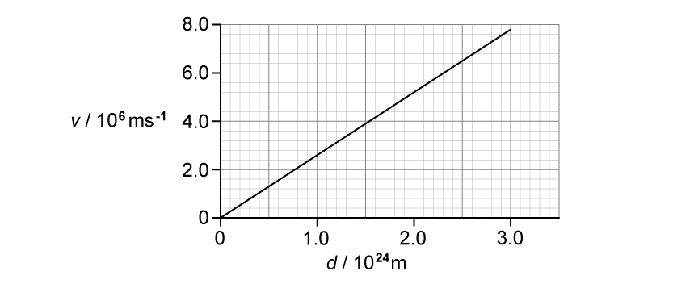
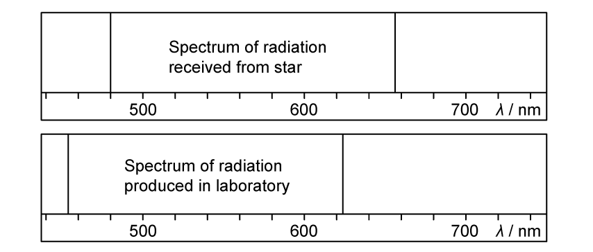
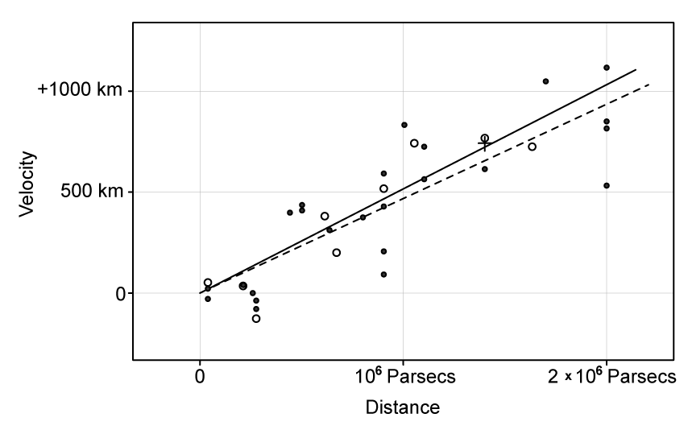
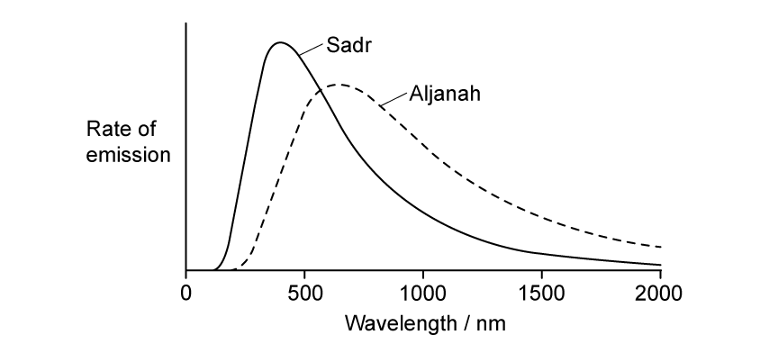
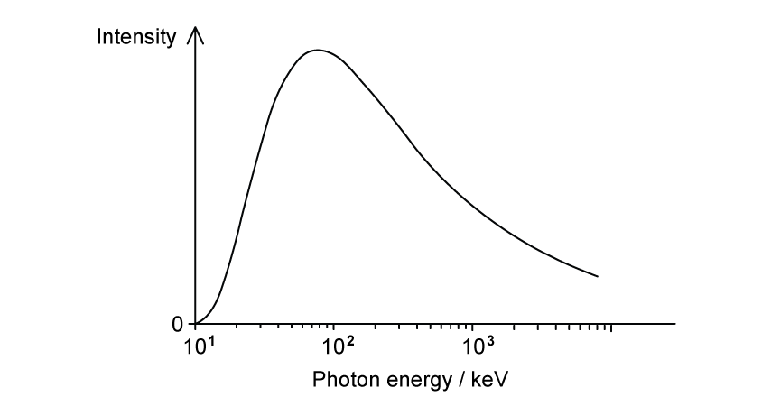

### Selected examination questions

::: {.question-card}
### Example 1 · Standard candles and inverse-square law · 25.1 SQ Easy Q1

**(a)** State what is meant by a standard candle. `[1 mark]`

**(b)** Explain how a standard candle can be used to measure astronomical distances. `[2 marks]`

**(c)** A standard candle in a distant galaxy is found to have a luminosity of $2.0\times10^{36}\ \mathrm{W}$ and a radiant flux intensity on Earth of $2.59\times10^{-15}\ \mathrm{W\,m^{-2}}$.

Show that the distance of the galaxy from the Earth is about $8\times10^{24}\ \mathrm{m}$. `[3 marks]`

**(d)** The Stefan-Boltzmann law states that the power output of a star depends on two factors.

Place a tick ($\checkmark$) next to the two correct factors. `[2 marks]`

| factor | correct ($\checkmark$) |
|---|:---:|
| Mass | |
| Radius | |
| Surface temperature | |
| Core temperature | |

Show mark scheme / model answer

- **(a)** A stellar or astronomical object of known luminosity. `[1]`
- **(b)** Measure its radiant flux intensity at Earth `[1]` and use $F=L/(4\pi d^2)$ to calculate its distance. `[1]`
- **(c)** Rearrange the inverse-square law: $d=\sqrt{L/(4\pi F)}$. `[1]` Substitute $d=\sqrt{(2.0\times10^{36})/[4\pi(2.59\times10^{-15})]}$. `[1]` This gives $d=7.84\times10^{24}\ \mathrm{m}$, which is about $8\times10^{24}\ \mathrm{m}$. `[1]`
- **(d)** Radius. `[1]` Surface temperature. `[1]`

:::

::: {.question-card}
### Example 2 · Redshift and the Big Bang theory · 25.2 SQ Easy Q2

**(a)** State what is meant by redshift. `[2 marks]`

**(b)** Explain how cosmologists are able to determine that light from a distant star has undergone redshift. `[2 marks]`

**(c)** The Big Bang theory attempts to explain the origin of the Universe.

Describe the main ideas of the Big Bang theory. `[3 marks]`

**(d)** Explain why the redshift of galaxies is considered to be evidence for the Big Bang theory. `[2 marks]`

Show mark scheme / model answer

- **(a)** The observed wavelength of light is greater than its known or laboratory value. `[1]` This is caused by a star or galaxy moving away from the observer. `[1]`
- **(b)** Examine the spectral lines in light from the distant star. `[1]` Compare their wavelengths with the known spectrum measured in a laboratory on Earth. `[1]`
- **(c)** The Universe began in an extremely hot, dense state associated with the Big Bang. `[1]` Matter and energy were concentrated into a very small region. `[1]` The Universe expanded from this early state. `[1]`
- **(d)** If the Universe is expanding, matter must have been closer together in the past. `[1]` Extrapolating the expansion backwards leads to a common origin, the Big Bang. `[1]`

:::

::: {.question-card}
### Example 3 · Hubble's law and Type Ia supernovae · 25.2 SQ Medium Q1

**(a)**

**(i)** State and explain Hubble's law. `[2]`

**(ii)** State the significance of the term $H_0$. `[1]`

`[3 marks]`

**(b)** Explain how cosmologists use observations of emission spectra from stars in distant galaxies to determine that the Universe is expanding. `[2 marks]`

**(c)** Explain how Hubble's law and the idea of the expanding Universe lead to the Big Bang theory of the origin of the Universe. `[3 marks]`

**(d)** Measurements of Type Ia supernovae are commonly used to determine a value for the Hubble constant.

The distance from Earth is known for many Type Ia supernovae.

Describe how these distances are used, with other data, to determine the Hubble constant. `[4 marks]`

Show mark scheme / model answer

- **(a)(i)** Hubble's law is $v=H_0d$: recession speed is directly proportional to distance. `[1]` Here $v$ is the galaxy's speed of recession and $d$ is its distance from the observer. `[1]`
- **(a)(ii)** The approximate age of the Universe is $1/H_0$. `[1]`
- **(b)** Spectral-line wavelengths from distant galaxies are greater than their laboratory values. `[1]` This redshift shows that the galaxies are moving away from Earth. `[1]`
- **(c)** Galaxies are moving away from each other. `[1]` More distant objects move away faster. `[1]` Therefore, extrapolating backwards, matter must have been much closer together and denser in the past. `[1]`
- **(d)** Measure each supernova's recession speed or redshift. `[1]` Obtain this from the shift of its spectral lines. `[1]` Plot recession speed on the $y$-axis against known distance on the $x$-axis. `[1]` The gradient of the best-fit line is $H_0$. `[1]`

:::

::: {.question-card}
### Example 4 · Cosmological redshift and the age of the Universe · 25.2 SQ Medium Q3

**(a)** An astronomer analyses the light from a distant galaxy.

One of the observed spectral lines of hydrogen has a wavelength of $722\ \mathrm{nm}$. The same spectral line has a wavelength of $656\ \mathrm{nm}$ when measured in the laboratory.

Calculate the factor by which the Universe has expanded since the light was emitted from the source. `[1 mark]`

**(b)** Explain how comparing the values of cosmological redshift for distant galaxies provides evidence for the Big Bang theory. `[4 marks]`

**(c)** Cosmologists commonly quote the recessional velocity $v$ of astronomical objects in relation to the speed of light $c$. This ratio is known as redshift $z$:

$$z=\frac{v}{c}$$

The Andromeda galaxy is the closest galaxy to our own Milky Way. Andromeda has a redshift value of $z=-0.001$.

State the significance of the minus sign and discuss its implication for the Milky Way and Andromeda in the distant future. `[2 marks]`

**(d)** Table 1.1 contains information about two galaxies.

| Galaxy | Red-shift | Recessional velocity / $\mathrm{km\,s^{-1}}$ | Distance / km |
|---|---:|---:|---:|
| NGC 247 | $8.0\times10^{-4}$ | | $1.1\times10^{20}$ |
| NGC 1357 | | 1200 | |

**(i)** Complete the missing information in Table 1.1. `[2]`

**(ii)** Use the data to estimate the age, in years, of the Universe.

$1\ \mathrm{year}=3.15\times10^7\ \mathrm{s}$ `[4]`

`[6 marks]`

Show mark scheme / model answer

- **(a)** Expansion factor $=722/656=1.10$, equivalent to an increase of about 10%. `[1]`
- **(b)** A more distant galaxy's light travels through expanding space for longer, or the more distant galaxy has the greater redshift or recession speed. `[1]` Greater distance therefore corresponds to greater stretching of wavelength. `[1]` This systematic redshift indicates that the Universe is expanding. `[1]` Extrapolating the expansion backwards implies that the Universe originated from a much smaller, denser state. `[1]`
- **(c)** The negative sign means blueshift, so Andromeda is moving towards the Milky Way. `[1]` The two galaxies are expected eventually to collide or merge. `[1]`
- **(d)(i)** For NGC 247, $v=cz=(3.0\times10^8)(8.0\times10^{-4})=2.40\times10^5\ \mathrm{m\,s^{-1}}=240\ \mathrm{km\,s^{-1}}$. `[1]` For NGC 1357, $z=v/c=(1.20\times10^6)/(3.0\times10^8)=4.0\times10^{-3}$ and $d=(1.1\times10^{20})(1200/240)=5.5\times10^{20}\ \mathrm{km}$. `[1]`
- **(d)(ii)** Convert the NGC 247 values to SI units and use $H_0=v/d$. `[1]` $H_0=(240\times10^3)/(1.1\times10^{23})=2.18\times10^{-18}\ \mathrm{s^{-1}}$. `[1]` Thus $t=1/H_0=4.58\times10^{17}\ \mathrm{s}$. `[1]` Dividing by $3.15\times10^7$ gives $t=1.46\times10^{10}\ \mathrm{years}$. `[1]`

:::

::: {.question-card}
### Example 5 · Spectral redshift, scale factor and Hubble's original plot · 25.2 SQ Hard Q1

**(a)** Fig. 1.1a shows the variation of recession velocity $v$ for a number of galaxies with their approximate distance $d$ from Earth.

{.question-figure fig-alt="Recession velocity against distance for a sample of galaxies"}

Radiation from a star in a distant galaxy is analysed.

Fig. 1.1b shows the spectral lines of the radiation from the star at different wavelengths compared to the same spectral lines produced by a source in the laboratory.

{.question-figure fig-alt="Spectral lines received from a star compared with laboratory spectral lines"}

Using the information in Fig. 1.1a and Fig. 1.1b, determine the distance of this galaxy from Earth. `[5 marks]`

**(b)** Astronomers use the cosmic scale factor $R$ to describe the scaling up of physical distances in the Universe.

As the Universe expands, the wavelength of the detected radiation at a time $t$ is larger than it was at a time $t_0$ in the past by a factor of

$$\frac{R}{R_0}=1+z.$$

This expression represents the expansion rate of the Universe.

Here $R$ represents the separation of two galaxies at time $t$, $R_0$ represents the value of $R$ at the time $t_0$ the radiation was emitted, and $z$ represents the redshift, which is given by

$$z\approx\frac{\Delta\lambda}{\lambda}\approx\frac{v}{c}.$$

**(i)** Using the scale factor, or otherwise, determine, in years, the approximate age of the Universe at the instant when the detected light from the distant galaxy in **(a)** was emitted. `[4]`

**(ii)** State the assumption that you made in your answer to **(b)(i)**. `[1]`

`[5 marks]`

**(c)** Historically, there has been considerable debate over the true value of the Hubble constant.

Fig. 1.2 shows Hubble's original plot of velocity against distance for 46 galaxies.

{.question-figure fig-alt="Hubble's original velocity-distance plot for galaxies"}

**(i)** Using data from Fig. 1.2, calculate and compare Hubble's original estimate for the age of the Universe, in years, with our modern estimation.

$1\ \mathrm{parsec}=3.09\times10^{16}\ \mathrm{m}$ `[3]`

**(ii)** Discuss why, even today, different measurements of the Hubble constant do not agree with each other. `[2]`

`[5 marks]`

Show mark scheme / model answer

- **(a)** From the spectra, one suitable line has $\lambda_{\text{star}}\approx480\ \mathrm{nm}$ and $\lambda_{\text{lab}}\approx454\ \mathrm{nm}$. `[1]` Thus $\Delta\lambda\approx26\ \mathrm{nm}$. `[1]` The recession speed is $v=c\Delta\lambda/\lambda=(3.0\times10^8)(26/454)=1.72\times10^7\ \mathrm{m\,s^{-1}}$. `[1]` From Fig. 1.1a, $H_0\approx(7.8\times10^6)/(3.0\times10^{24})=2.6\times10^{-18}\ \mathrm{s^{-1}}$. `[1]` Hence $d=v/H_0=6.6\times10^{24}\ \mathrm{m}$. `[1]`
- **(b)(i)** $z=26/454=0.057$. `[1]` Therefore $R/R_0=1+z=1.057$. `[1]` The present age estimate is $t=1/H_0=3.85\times10^{17}\ \mathrm{s}=12.2\times10^9\ \mathrm{years}$. `[1]` Using $t/t_0=1.057$ gives $t_0=11.5\times10^9\ \mathrm{years}$. `[1]`
- **(b)(ii)** The expansion rate, or $H_0$, is assumed to have remained constant with time. `[1]`
- **(c)(i)** From the graph, $H_0\approx(1050\times10^3)/[(2.0\times10^6)(3.09\times10^{16})]=1.70\times10^{-17}\ \mathrm{s^{-1}}$. `[1]` Hence $t=1/H_0=5.89\times10^{16}\ \mathrm{s}\approx1.9\times10^9\ \mathrm{years}$. `[1]` This is about $10$ billion years below the modern estimate of approximately $12.2$ billion years used in **(b)**. `[1]`
- **(c)(ii)** Valid reasons include large uncertainty in the distances and velocities of very distant galaxies; peculiar local motion in nearby galaxies; galaxies forming after the beginning of the Universe; and an expansion rate that may have changed with time. `[2]`

:::

::: {.question-card}
### Example 6 · Stellar colour, emission curves and radius · 25.1 SQ Medium Q2

**(a)** Table 1.1 summarises some information about four stars in the constellation Cygnus.

| Name | Colour | Luminosity / $L_{\text{Sun}}$ |
|---|---|---:|
| Aljanah | orange | 62 |
| Deneb | blue-white | 196 000 |
| Fawaris | blue | 155 |
| Sadr | yellow-white | 33 000 |

Identify the star in Table 1.1 with:

**(i)** the highest surface temperature; `[1]`

**(ii)** the lowest surface temperature; `[1]`

**(iii)** the largest radius. `[1]`

`[3 marks]`

**(b)** Fig. 1.2 shows the rate of emission from two of the stars, Sadr and Aljanah, plotted against wavelength.

{.question-figure fig-alt="Rate of emission against wavelength for Sadr and Aljanah"}

Explain how the curves in Fig. 1.2 can be used to determine the surface temperature of the stars. `[3 marks]`

**(c)** The surface temperature of Aljanah is known to be $4700\ \mathrm{K}$.

Determine the surface temperature of Sadr. `[3 marks]`

**(d)** Calculate the radius of Sadr in units of solar radius $R_{\text{Sun}}$.

Radius of the Sun, $R_{\text{Sun}}=6.96\times10^8\ \mathrm{m}$

Luminosity of the Sun, $L_{\text{Sun}}=3.83\times10^{26}\ \mathrm{W}$ `[2 marks]`

Show mark scheme / model answer

- **(a)(i)** Fawaris. `[1]`
- **(a)(ii)** Aljanah. `[1]`
- **(a)(iii)** Deneb. `[1]` The source also accepts Sadr as a reasoned estimate from the given table.
- **(b)** Wien's law states that peak wavelength is inversely proportional to thermodynamic temperature. `[1]` Read the peak wavelength $\lambda_{\max}$ for each curve. `[1]` Use a reference star, or a star of known $\lambda_{\max}$ and $T$, to obtain the constant of proportionality. `[1]`
- **(c)** From the graph, $\lambda_A\approx650\ \mathrm{nm}$ and $\lambda_S\approx400\ \mathrm{nm}$. `[1]` Since $T\propto1/\lambda_{\max}$, $T_S/T_A=\lambda_A/\lambda_S$. `[1]` Thus $T_S=4700(650/400)\approx7600\ \mathrm{K}$. `[1]`
- **(d)** $r=\sqrt{L/(4\pi\sigma T^4)}=7.29\times10^{10}\ \mathrm{m}$. `[1]` Therefore $r/R_{\text{Sun}}=(7.29\times10^{10})/(6.96\times10^8)=105$, so the radius is about $105R_{\text{Sun}}$. `[1]`

:::

::: {.question-card}
### Example 7 · Fast radio bursts and a magnetar · 25.1 SQ Hard Q1

**(a)** In recent years, astronomers have discovered sources of fast radio bursts (FRBs) in other galaxies. Studies suggest that these sources may be a type of standard candle.

An FRB source emits intense bursts of radio waves, each burst lasting for a fraction of a second. The closest FRB source is in a massive spiral galaxy $4.60\times10^{24}\ \mathrm{m}$ from the Earth.

A detector of area $1.00\times10^{-4}\ \mathrm{m^2}$ on the surface of the Earth received bursts of radio waves. In one burst, $9.40\times10^{-23}\ \mathrm{J}$ of energy was received in a time of $1.15\ \mathrm{ms}$.

**(i)** Show that the luminosity of the source is about $2\times10^{35}\ \mathrm{W}$. `[4]`

**(ii)** When FRB sources were first discovered, some observers suggested that the bursts might be extraterrestrial communications.

Suggest why this is unlikely.

luminosity of the Sun $=3.8\times10^{26}\ \mathrm{W}$ `[2]`

`[6 marks]`

**(b)** It has been suggested that FRBs are produced by a type of star known as a magnetar.

Magnetars are extremely dense, hot remnants of stars which produce intensely powerful magnetic fields. These magnetic fields power the emission of high-energy radiation, particularly X-rays and gamma rays.

Fig. 1.1 shows how the radiated intensity from a magnetar varies with photon energy.

{.question-figure fig-alt="Radiated intensity from a magnetar against photon energy"}

Using Fig. 1.1, determine the surface temperature of the magnetar.

Wien's displacement constant $=2.898\times10^{-3}\ \mathrm{m\,K}$ `[4 marks]`

**(c)** Some literature about magnetars states they are similar in size to a large city.

Assess the accuracy of this statement. `[4 marks]`

Show mark scheme / model answer

- **(a)(i)** The received power is $P=E/t=(9.40\times10^{-23})/(1.15\times10^{-3})=8.17\times10^{-20}\ \mathrm{W}$. `[1]` The flux is $F=P/A=(8.17\times10^{-20})/(1.00\times10^{-4})=8.17\times10^{-16}\ \mathrm{W\,m^{-2}}$. `[1]` Use $L=4\pi d^2F$. `[1]` This gives $L=4\pi(4.60\times10^{24})^2(8.17\times10^{-16})=2.17\times10^{35}\ \mathrm{W}$. `[1]`
- **(a)(ii)** The source luminosity is enormously greater than the Sun's luminosity. `[1]` A power output of this magnitude is unlikely to be produced artificially for communication. `[1]`
- **(b)** From the graph, $E_{\max}\approx80\ \mathrm{keV}$. `[1]` Convert energy to wavelength using $\lambda_{\max}=hc/E_{\max}$, giving $\lambda_{\max}=1.55\times10^{-11}\ \mathrm{m}$. `[1]` Apply Wien's law, $T=b/\lambda_{\max}$. `[1]` Hence $T\approx1.9\times10^8\ \mathrm{K}$. `[1]`
- **(c)** Use $r=\sqrt{L/(4\pi\sigma T^4)}$ with the values from **(a)** and **(b)**. `[1]` The radius is about $15.9\ \mathrm{km}$. `[1]` The diameter is about $31.8\ \mathrm{km}$, comparable with the scale of a large city. `[1]` The statement is therefore reasonable. `[1]`

:::

::: {.question-card}
### Example 8 · Solar power from Earth to Neptune · 25.1 SQ Hard Q2

**(a)** Solar panels consisting of combinations of photovoltaic cells use energy in the radiation received from the Sun to generate electricity.

An advertisement for solar panels claims that the intensity of radiation from the Sun incident at the top of the Earth's atmosphere is more than $2\ \mathrm{kW\,m^{-2}}$.

Assess the validity of this claim.

radius of Sun $=6.96\times10^8\ \mathrm{m}$

surface temperature of Sun $=5790\ \mathrm{K}$

distance from Sun to Earth $=1.50\times10^{11}\ \mathrm{m}$ `[4 marks]`

**(b)** A space probe is sent on a mission from Earth to Mars.

Power for the space probe is provided by solar panels that collect radiant energy from the Sun. The solar panels have a total area of $31\ \mathrm{m^2}$ and are directly facing the Sun throughout the journey. The efficiency of the solar panels is 30%.

The mean orbital radius of Mars about the Sun is $2.3\times10^{11}\ \mathrm{m}$.

Compare the power available to the probe when it leaves Earth's atmosphere to the power available on its arrival at Mars. `[4 marks]`

**(c)** Neptune is the farthest known planet from the Sun in the Solar System. Its distance from the Sun is 30 times greater than the distance of the Earth from the Sun.

A similar space probe to the one in **(b)** is sent on a mission to Neptune.

**(i)** Calculate the area of solar panels that would be required to achieve the same availability of power at Neptune as the space probe in **(b)** when it was at Mars. `[3]`

**(ii)** The International Space Station (ISS) currently holds the record for the largest array of solar panels in space, spanning a total area of $3244\ \mathrm{m^2}$ to supply all of its power.

Using this information, and your answer to **(c)(i)**, comment on the current viability of the mission to Neptune. `[2]`

`[5 marks]`

Show mark scheme / model answer

- **(a)** $L=4\pi r^2\sigma T^4=3.879\times10^{26}\ \mathrm{W}$. `[1]` Use $F=L/(4\pi d^2)$. `[1]` This gives $F=1372\ \mathrm{W\,m^{-2}}=1.37\ \mathrm{kW\,m^{-2}}$. `[1]` Since $1.37<2$, the advertisement's claim is false. `[1]`
- **(b)** At Earth, $P=\eta FA=(0.30)(1370)(31)=12\,740\ \mathrm{W}$. `[1]` Since $F\propto1/d^2$, $P_M/P_E=(d_E/d_M)^2$. `[1]` Therefore $P_M=12\,740(1.50/2.30)^2=5420\ \mathrm{W}$. `[1]` The available power falls from $12.7\ \mathrm{kW}$ to $5.42\ \mathrm{kW}$, a reduction to about 42.5% of the Earth value. `[1]`
- **(c)(i)** At Neptune, $F_N=1370/30^2=1.52\ \mathrm{W\,m^{-2}}$. `[2]` The required panel area is $A=P/F_N=5420/1.52=3570\ \mathrm{m^2}$. `[1]`
- **(c)(ii)** Since $3570\ \mathrm{m^2}>3244\ \mathrm{m^2}$, the proposal is not currently practical on this comparison. `[1]` The panel mass and launch difficulty, changing distance during flight, different power requirements, or the suitability of a more compact nuclear source provide a valid supporting comment. `[1]`

:::
