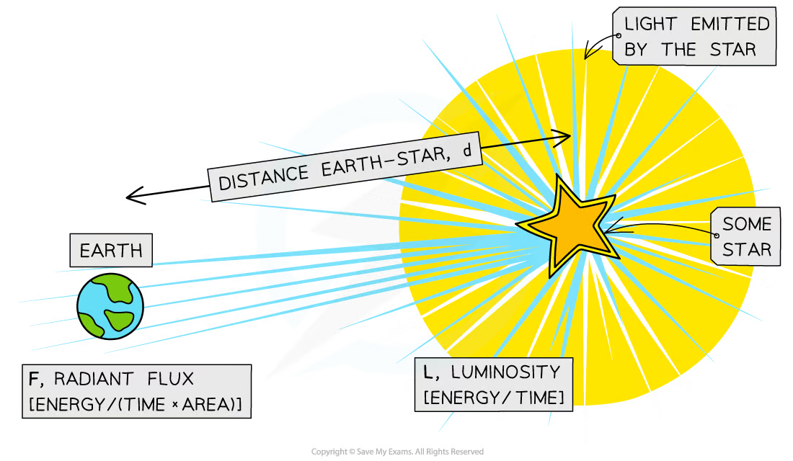
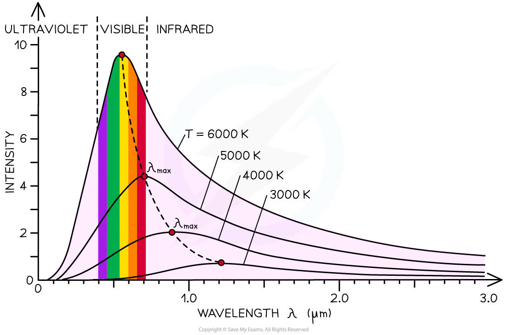
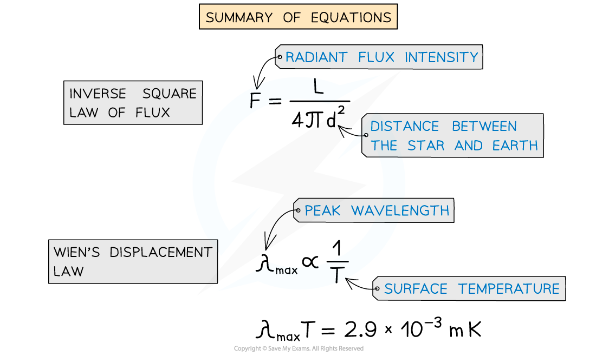
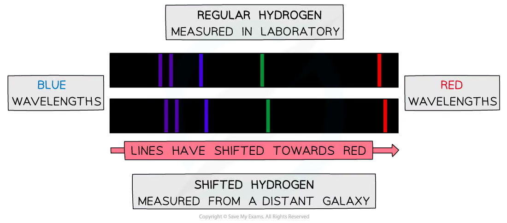
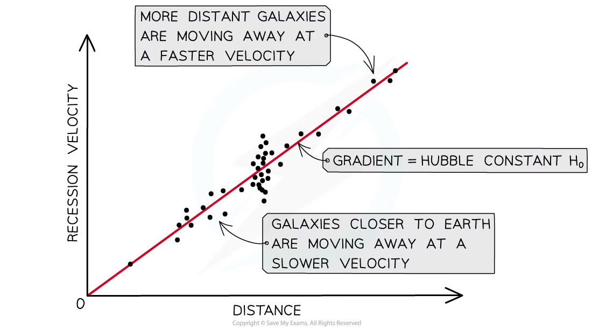
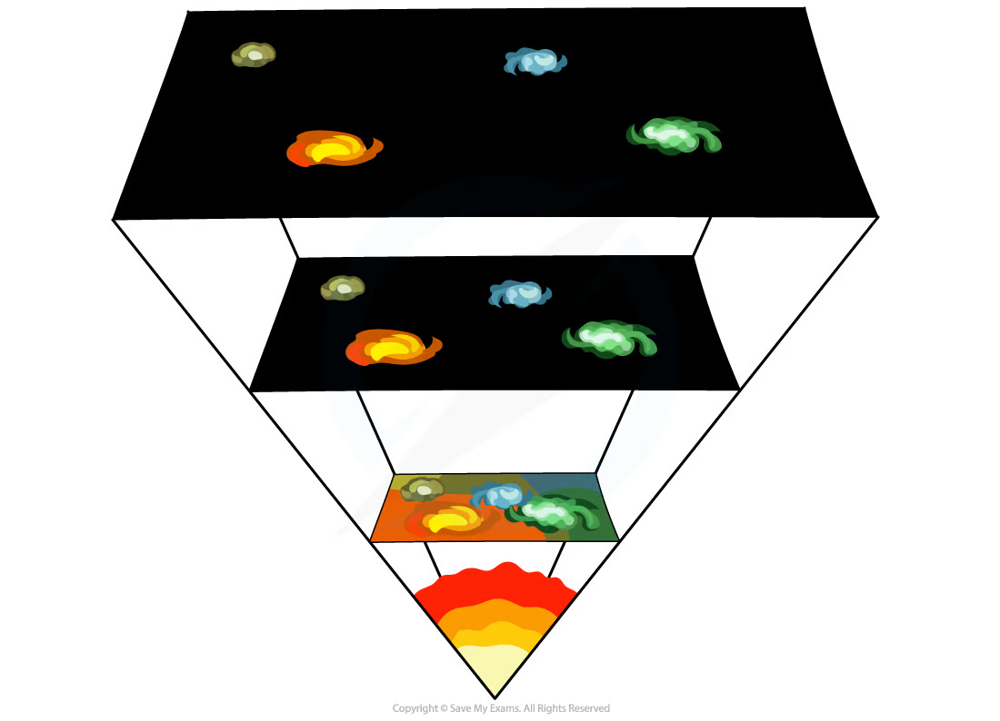

## Learning objectives

By the end of this chapter, you should be able to:

- distinguish luminosity from radiant flux intensity and use the inverse-square law;
- explain how standard candles provide astronomical distances;
- use Wien's displacement law to determine stellar surface temperature;
- use the Stefan-Boltzmann law to determine stellar luminosity or radius;
- identify redshift and blueshift from spectral lines;
- calculate recession speed from a small wavelength shift;
- use Hubble's law to find $H_0$ and estimate the age of the Universe;
- explain how redshift and Hubble's law support an expanding Universe and the Big Bang theory.

## 25.1 Standard candles

::: {.study-card}
### Luminosity and radiant flux intensity

The **luminosity** $L$ of a star is the total power of electromagnetic radiation emitted in all directions. It is an intrinsic property of the source and is measured in watts.

The **radiant flux intensity** $F$ is the power received per unit area perpendicular to the radiation. Its unit is $\mathrm{W\,m^{-2}}$. Unlike luminosity, it depends on the observer's distance from the source.
:::

::: {.knowledge-figure}
{fig-alt="A star emitting radiation, with luminosity, radiant flux intensity and Earth-star distance labelled"}

The same emitted power is spread over a larger spherical area as distance increases, so the received flux intensity decreases.
:::

::: {.formula-panel}
### Inverse-square law

For an isotropic source, the radiation is spread over a sphere of area $4\pi d^2$:

$$F=\frac{L}{4\pi d^2}.$$

Useful rearrangements are

$$L=4\pi d^2F, \qquad d=\sqrt{\frac{L}{4\pi F}}.$$

This assumes that radiation spreads uniformly in all directions and that absorption or scattering between source and observer is negligible. If the distance doubles, the flux intensity becomes one quarter.
:::

::: {.example-card}
### Worked Example 1 · Distance from luminosity and flux

A calibrated standard candle has luminosity $2.0\times10^{36}\ \mathrm{W}$. Its radiant flux intensity at Earth is $2.59\times10^{-15}\ \mathrm{W\,m^{-2}}$. Calculate its distance from Earth.

**Solution**

$$d=\sqrt{\frac{L}{4\pi F}}
 =\sqrt{\frac{2.0\times10^{36}}{4\pi(2.59\times10^{-15})}}
 =7.84\times10^{24}\ \mathrm{m}.$$

**Answer:** $d\approx7.8\times10^{24}\ \mathrm{m}$, or about $8\times10^{24}\ \mathrm{m}$.
:::

::: {.study-card}
### Standard candles

A **standard candle** is an astronomical object whose luminosity is known or can be calibrated. Measure its flux intensity at Earth and use the inverse-square law to calculate its distance.

Type Ia supernovae are useful at very large distances because their peak luminosities are sufficiently consistent after calibration. Cepheid variables can also be calibrated through the relationship between their pulsation period and luminosity. Once distance is known, it can be combined with redshift data to study cosmic expansion.
:::

## 25.2 Stellar radii

::: {.study-card}
### Stellar spectra and black-body radiation

A star behaves approximately like a black-body radiator. Its emitted-intensity spectrum has a broad maximum at wavelength $\lambda_{\max}$. Hotter stars peak at shorter wavelengths and generally appear blue or blue-white; cooler stars peak at longer wavelengths and generally appear orange or red.

The peak wavelength gives the **surface temperature**, not the core temperature. The height of a spectrum alone does not determine temperature unless the graph scale and emitting area are known.
:::

::: {.knowledge-figure}
{fig-alt="Black-body emission curves for stars at different temperatures, with hotter stars peaking at shorter wavelength"}

As temperature increases, the peak shifts to shorter wavelength and the total area under the curve increases.
:::

::: {.formula-panel}
### Wien's displacement law

Wien's law is

$$\lambda_{\max}T=b,$$

where $b\approx2.90\times10^{-3}\ \mathrm{m\,K}$. Therefore,

$$T=\frac{b}{\lambda_{\max}}.$$

For two stars,

$$\frac{T_1}{T_2}=\frac{\lambda_{\max,2}}{\lambda_{\max,1}}.$$

Convert wavelength to metres before using the numerical value of $b$.
:::

::: {.example-card}
### Worked Example 2 · Surface temperature from peak wavelength

The emission spectrum of a star has a maximum at $480\ \mathrm{nm}$. Estimate its surface temperature.

**Solution**

$$\lambda_{\max}=480\times10^{-9}\ \mathrm{m}.$$

Using Wien's law,

$$T=\frac{2.90\times10^{-3}}{480\times10^{-9}}
 =6.04\times10^3\ \mathrm{K}.$$

**Answer:** the surface temperature is approximately $6.0\times10^3\ \mathrm{K}$.
:::

::: {.formula-panel}
### Stefan-Boltzmann law and stellar radius

The luminosity of a spherical star is

$$L=4\pi\sigma r^2T^4,$$

where $r$ is the radius and $\sigma=5.67\times10^{-8}\ \mathrm{W\,m^{-2}\,K^{-4}}$.

Rearranging,

$$r=\sqrt{\frac{L}{4\pi\sigma T^4}}.$$

Relative to the Sun,

$$\frac{L}{L_\odot}=\left(\frac{r}{R_\odot}\right)^2\left(\frac{T}{T_\odot}\right)^4.$$

The $T^4$ dependence is important: a modest change in temperature can strongly change luminosity. A cool star may still be very luminous if its radius is large.
:::

::: {.knowledge-figure}
{fig-alt="Summary diagram linking radiant flux, inverse-square law, Wien displacement law and Stefan-Boltzmann law"}

The three relationships connect what is measured at Earth with a star's temperature, luminosity and radius.
:::

::: {.example-card}
### Worked Example 3 · Stellar radius from luminosity and temperature

A star has luminosity $3.83\times10^{28}\ \mathrm{W}$ and surface temperature $5800\ \mathrm{K}$. Calculate its radius.

**Solution**

$$r=\sqrt{\frac{L}{4\pi\sigma T^4}}
 =\sqrt{\frac{3.83\times10^{28}}{4\pi(5.67\times10^{-8})(5800)^4}}
 =6.96\times10^9\ \mathrm{m}.$$

**Answer:** $r\approx6.96\times10^9\ \mathrm{m}$, about ten times the solar radius.
:::

::: {.study-card}
### A reliable stellar calculation sequence

When spectral and brightness data are provided:

1. read $\lambda_{\max}$ and use Wien's law to find $T$;
2. use a known distance and flux to find $L$, or use a given luminosity;
3. substitute $L$ and $T$ into Stefan-Boltzmann to find $r$;
4. check SI units and make sure radius has not been confused with diameter.

The comparison should be physically sensible: a shorter peak wavelength means higher temperature, while a larger luminosity can result from either higher temperature or larger radius.
:::

## 25.3 Hubble's law and the Big Bang theory

::: {.study-card}
### Spectral lines, redshift and blueshift

Atoms produce characteristic emission and absorption lines. Astronomers compare the observed wavelengths from a distant galaxy with the known laboratory wavelengths of the same elements.

If the observed lines are shifted to longer wavelengths, the source is **redshifted** and is generally receding. A shift to shorter wavelengths is a **blueshift** and indicates approach. The pattern of lines identifies the element; the displacement of the whole pattern gives the motion.
:::

::: {.knowledge-figure}
{fig-alt="Hydrogen spectral lines measured in the laboratory and shifted towards longer wavelengths in light from a distant galaxy"}

The same line pattern is recognisable, but every line is displaced towards the red end of the spectrum.
:::

::: {.formula-panel}
### Small redshift and recession speed

For speeds much smaller than the speed of light,

$$\frac{\Delta\lambda}{\lambda}\approx-\frac{\Delta f}{f}\approx\frac{v}{c},$$

where $\Delta\lambda=\lambda_{\text{observed}}-\lambda_{\text{laboratory}}$. The dimensionless redshift is

$$z=\frac{\Delta\lambda}{\lambda}\approx\frac{v}{c}.$$

Use the laboratory wavelength in the denominator. A positive $z$ indicates recession; a negative $z$ indicates blueshift and approach.
:::

::: {.example-card}
### Worked Example 4 · Recession speed from a spectral shift

A hydrogen line has laboratory wavelength $486\ \mathrm{nm}$. In light from a distant galaxy it is measured at $510\ \mathrm{nm}$. Calculate the redshift and recession speed.

**Solution**

The wavelength change is

$$\Delta\lambda=510-486=24\ \mathrm{nm}.$$

Therefore,

$$z=\frac{24}{486}=0.0494.$$

Using $v\approx cz$,

$$v=(3.00\times10^8)(0.0494)=1.48\times10^7\ \mathrm{m\,s^{-1}}.$$

**Answer:** $z=0.0494$ and $v\approx1.48\times10^7\ \mathrm{m\,s^{-1}}$.
:::

::: {.formula-panel}
### Hubble's law and the Hubble constant

Hubble's law states that the recession speed $v$ of a distant galaxy is proportional to its distance $d$:

$$v\approx H_0d.$$

On a graph of $v$ against $d$, the gradient of the best-fit line is $H_0$. With SI units, $H_0$ has unit $\mathrm{s^{-1}}$. If distance is in megaparsecs and speed is in $\mathrm{km\,s^{-1}}$, the numerical unit of $H_0$ is $\mathrm{km\,s^{-1}\,Mpc^{-1}}$ and must be converted before using it in an age calculation.

A simple estimate for the age of the Universe is

$$t_0\approx\frac{1}{H_0}.$$

This assumes that the expansion rate has remained constant. Real galaxies also have local or peculiar velocities, so a best-fit line through many distant objects is more reliable than one object alone.
:::

::: {.knowledge-figure}
{fig-alt="Recession velocity plotted against distance for galaxies, with the gradient labelled as the Hubble constant"}

The gradient of the best-fit line gives $H_0$; more distant galaxies generally have greater recession speeds.
:::

::: {.example-card}
### Worked Example 5 · Hubble constant and age of the Universe

A galaxy is $1.1\times10^{23}\ \mathrm{m}$ away and has recession speed $2.4\times10^5\ \mathrm{m\,s^{-1}}$. Estimate $H_0$ and the age of the Universe.

**Solution**

$$H_0=\frac{v}{d}=\frac{2.4\times10^5}{1.1\times10^{23}}
 =2.18\times10^{-18}\ \mathrm{s^{-1}}.$$

Hence,

$$t_0\approx\frac{1}{H_0}=4.59\times10^{17}\ \mathrm{s}.$$

Converting with $1\ \mathrm{year}=3.15\times10^7\ \mathrm{s}$,

$$t_0=\frac{4.59\times10^{17}}{3.15\times10^7}
 =1.46\times10^{10}\ \mathrm{years}.$$

**Answer:** $H_0\approx2.18\times10^{-18}\ \mathrm{s^{-1}}$ and $t_0\approx1.46\times10^{10}\ \mathrm{years}$.
:::

::: {.study-card}
### Expansion and the Big Bang theory

The widespread redshift of distant galaxies shows that most galaxies are receding. Hubble's law shows that more distant galaxies generally recede faster, so space on large scales is expanding.

Running the expansion backwards implies that matter was closer together, denser and hotter in the past. Extrapolation leads to the Big Bang model: the Universe developed from an extremely hot, dense initial state and has expanded since then. The Big Bang was not an explosion from one location into pre-existing space; it describes the expansion of space throughout the Universe.
:::

::: {.knowledge-figure}
{fig-alt="A schematic showing galaxies becoming closer together when the expansion of the Universe is traced backwards"}

Tracing the expansion backwards leads to a hotter, denser early Universe. The diagram represents expansion of space itself, not an explosion into empty space.
:::

::: {.study-card}
### Determining the Hubble constant in practice

For a set of galaxies or Type Ia supernovae:

1. determine distance independently, for example using a standard candle;
2. measure spectral-line wavelengths and calculate redshift or recession speed;
3. plot recession speed against distance;
4. determine $H_0$ from the gradient of the best-fit line.

Using many distant objects reduces the relative effect of individual galaxies' local motions. Different methods can still give different values because of distance uncertainty, calibration errors, peculiar velocities and the fact that the expansion rate has changed over cosmic time.
:::

## Selected Structured Questions



## Chapter checklist

- [ ] I can distinguish luminosity from radiant flux intensity.
- [ ] I can use a standard candle and the inverse-square law to determine distance.
- [ ] I can use Wien's and Stefan-Boltzmann laws to determine temperature and radius.
- [ ] I can identify and calculate redshift from spectral lines.
- [ ] I can use Hubble's law and obtain $H_0$ from a graph.
- [ ] I can explain the assumptions behind $t_0\approx1/H_0$.
- [ ] I can link redshift and universal expansion to the Big Bang theory.

### Original question PDFs

- [25.1 Astronomy - Easy](https://raw.githubusercontent.com/nanoxsj/CIE-Physics-Study/main/resources/original-papers/astronomy-cosmology/25.1-astronomy-easy.pdf)
- [25.1 Astronomy - Medium](https://raw.githubusercontent.com/nanoxsj/CIE-Physics-Study/main/resources/original-papers/astronomy-cosmology/25.1-astronomy-medium.pdf)
- [25.1 Astronomy - Hard](https://raw.githubusercontent.com/nanoxsj/CIE-Physics-Study/main/resources/original-papers/astronomy-cosmology/25.1-astronomy-hard.pdf)
- [25.2 Cosmology - Easy](https://raw.githubusercontent.com/nanoxsj/CIE-Physics-Study/main/resources/original-papers/astronomy-cosmology/25.2-cosmology-easy.pdf)
- [25.2 Cosmology - Medium](https://raw.githubusercontent.com/nanoxsj/CIE-Physics-Study/main/resources/original-papers/astronomy-cosmology/25.2-cosmology-medium.pdf)
- [25.2 Cosmology - Hard](https://raw.githubusercontent.com/nanoxsj/CIE-Physics-Study/main/resources/original-papers/astronomy-cosmology/25.2-cosmology-hard.pdf)
