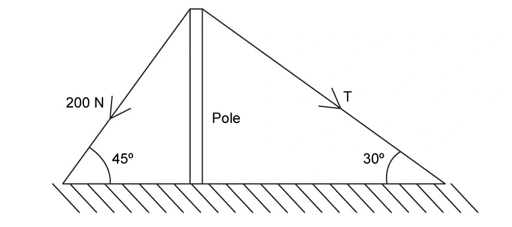
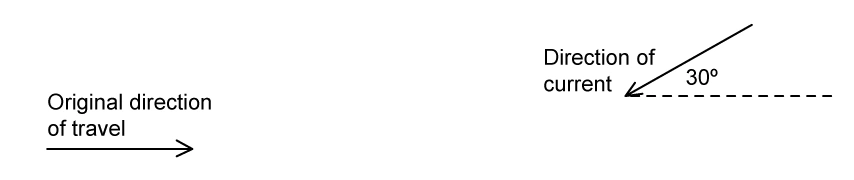
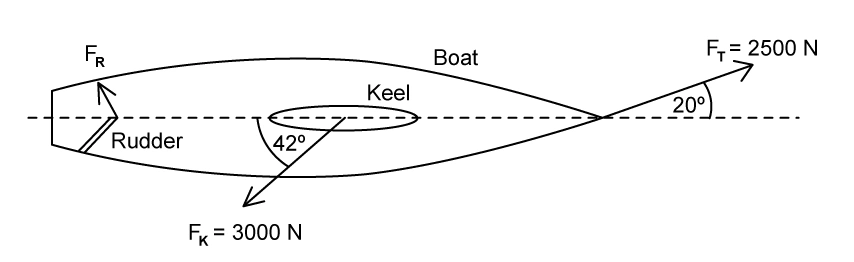
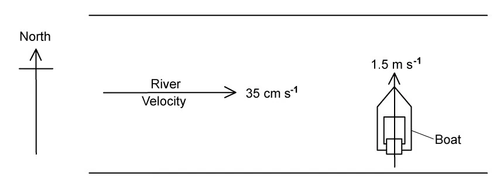

以下为 10 道完整结构题：Easy 4、Medium 3、Hard 3。题干保持原题的英文结构；仅 `1.1 SQ Hard Q3` 使用已从 PDF 独立提取并完成遮罩合成的原图。

#### Easy · 4 questions

::: {.question-card #sq-easy-q1}
### Example 1 · SI base and derived units · 1.1 SQ Easy Q2

**(a)** Table 1.1 shows SI base quantities and their corresponding base unit.

| SI base quantity | SI base unit |
|---|---|
| mass | kilogram, kg |
| time |  |
| length |  |

<ol class="subparts" type="i">
<li>Complete the missing SI base units for time and length. <code>[2 marks]</code></li>
<li>Add two other base quantities and their units. <code>[2 marks]</code></li>
</ol>

**(b)** Newton’s second law describes the relationship between force $F$, mass $m$ and acceleration $a$: $F=ma$. Use this to write $1\ \mathrm{N}$ in SI base units. `[2 marks]`

**(c)** The kinetic energy equation describes the relationship between energy $E$, mass $m$ and velocity $v$: $E=\frac12mv^2$. Use it to write $1\ \mathrm{J}$ in SI base units. `[2 marks]`

**(d)** Power $P$ is energy transferred $E$ per unit time $t$. Deduce the SI base units for power. `[2 marks]`

Show mark scheme / model answer

**(a)(i)**

- Time: second, s. `[1]`
- Length: metre, m. `[1]`

**(a)(ii)**

- Electric current: ampere, A. `[1]`
- Temperature: kelvin, K. `[1]`

**(b)**

- Acceleration has units $\mathrm{m\,s^{-2}}$. `[1]`
- From $F=ma$, $1\ \mathrm{N}=1\ \mathrm{kg\,m\,s^{-2}}$. `[1]`

**(c)**

- Velocity squared has units $\mathrm{m^2\,s^{-2}}$. `[1]`
- From $E=\frac12mv^2$, $1\ \mathrm{J}=1\ \mathrm{kg\,m^2\,s^{-2}}$. `[1]`

**(d)**

- $P=E/t$. `[1]`
- $[P]=\mathrm{kg\,m^2\,s^{-3}}$. `[1]`

:::

::: {.question-card #sq-easy-q2}
### Example 2 · Units, prefixes and estimates · 1.1 SQ Easy Q3

**(a)** Draw a line from each quantity to its correct unit.

| Quantity | Unit |
|---|---|
| velocity | $\mathrm{N\,m^{-2}}$, $\mathrm{m\,s^{-1}}$, $\mathrm{N\,m}$, $\mathrm{kg\,m^{-3}}$ |
| work done | $\mathrm{N\,m^{-2}}$, $\mathrm{m\,s^{-1}}$, $\mathrm{N\,m}$, $\mathrm{kg\,m^{-3}}$ |
| stress | $\mathrm{N\,m^{-2}}$, $\mathrm{m\,s^{-1}}$, $\mathrm{N\,m}$, $\mathrm{kg\,m^{-3}}$ |
| density | $\mathrm{N\,m^{-2}}$, $\mathrm{m\,s^{-1}}$, $\mathrm{N\,m}$, $\mathrm{kg\,m^{-3}}$ |

`[3 marks]`

**(b)** Complete the missing prefixes and powers of ten in the following list: tera, $10^9$, $10^3$, centi, milli, micro, $10^{-9}$, pico. `[3 marks]`

**(c)** Convert the following measurements into standard form and to the specified number of significant figures.

<ol class="subparts" type="i">
<li>$0.71\ \mathrm{GJ}$ to 3 s.f.</li>
<li>$24.5\ \mathrm{kW}$ to 4 s.f.</li>
<li>$0.003823\ \mathrm{mm}$ to 1 s.f.</li>
<li>$644.9\ \mathrm{pN}$ to 2 s.f.</li>
</ol>

`[4 marks]`

**(d)** Estimate the orders of magnitude, with an appropriate SI unit and prefix, of: mass of a car; thickness of a sheet of paper; density of air at room temperature and pressure; time between two heart beats. `[4 marks]`

Show mark scheme / model answer

**(a)**

- Velocity: $\mathrm{m\,s^{-1}}$. `[1]`
- Work done: $\mathrm{N\,m}$; stress: $\mathrm{N\,m^{-2}}$. `[1]`
- Density: $\mathrm{kg\,m^{-3}}$. `[1]`

**(b)**

- tera, T: $10^{12}$; giga, G: $10^9$; kilo, k: $10^3$. `[1]`
- centi, c: $10^{-2}$; milli, m: $10^{-3}$; micro, $\mu$: $10^{-6}$. `[1]`
- nano, n: $10^{-9}$; pico, p: $10^{-12}$. `[1]`

**(c)**

- $0.71\ \mathrm{GJ}=7.10\times10^8\ \mathrm{J}$ (3 s.f.). `[1]`
- $24.5\ \mathrm{kW}=2.450\times10^4\ \mathrm{W}$ (4 s.f.). `[1]`
- $0.003823\ \mathrm{mm}=4\times10^{-6}\ \mathrm{m}$ (1 s.f.). `[1]`
- $644.9\ \mathrm{pN}=6.4\times10^{-10}\ \mathrm{N}$ (2 s.f.). `[1]`

**(d)**

- Mass of a car: about $10^3\ \mathrm{kg}$. `[1]`
- Thickness of paper: about $10^{-4}\ \mathrm{m}$ or $0.1\ \mathrm{mm}$. `[1]`
- Density of air: about $1\ \mathrm{kg\,m^{-3}}$. `[1]`
- Time between heart beats: about $1\ \mathrm{s}$. `[1]`

:::

::: {.question-card #sq-easy-q3}
### Example 3 · Random and systematic errors · 1.2 SQ Easy Q2

**(a)** Distinguish between random and systematic errors. `[2 marks]`

**(b)** From a set of metal discs, one has a mass of $9.5\ \mathrm{g}$ and a thickness of approximately $2\ \mathrm{mm}$. State the instrument that should be used to measure:

<ol class="subparts" type="i">
<li>the mass of one or more discs;</li>
<li>the thickness of one disc;</li>
<li>the thickness of a stack of 20 discs.</li>
</ol>

`[3 marks]`

**(c)** A student takes five repeat readings of the thickness of the disc. The readings are shown in Table 1.1.

| thickness / mm | 2.012 | 2.001 | 1.998 | 2.008 | 1.994 |
|---|---:|---:|---:|---:|---:|

Using the readings in Table 1.1, calculate:

<ol class="subparts" type="i">
<li>the mean value of thickness;</li>
<li>the range of the results;</li>
<li>the uncertainty in the mean value of thickness.</li>
</ol>

`[5 marks]`

**(d)** State how the instrument used to measure thickness can: (i) reduce or avoid a systematic error; (ii) reduce random errors. `[3 marks]`

Show mark scheme / model answer

**(a)**

- Random errors vary unpredictably between repeated readings and cause scatter. `[1]`
- Systematic errors shift readings consistently in the same direction. `[1]`

**(b)**

- Mass: top-pan or electronic balance. `[1]`
- Thickness of one disc: micrometer screw gauge. `[1]`
- Thickness of 20 discs: micrometer screw gauge, then divide by 20 if the mean disc thickness is required. `[1]`

**(c)(i)**

- Mean $=(2.012+2.001+1.998+2.008+1.994)/5=2.0026\ \mathrm{mm}$. `[2]`
- Mean $=2.003\ \mathrm{mm}$. `[1]`

**(c)(ii)**

- Range $=2.012-1.994=0.018\ \mathrm{mm}$. `[1]`

**(c)(iii)**

- Uncertainty $=$ half-range $=\pm0.009\ \mathrm{mm}$. `[1]`

**(d)**

- Check for a zero error before measurement and apply a correction or recalibrate. `[1]`
- Measure at different positions/orientations. `[1]`
- Repeat readings and calculate a mean. `[1]`

:::

::: {.question-card #sq-easy-q4}
### Example 4 · Pendulum uncertainty · 1.2 SQ Easy Q3

**(a)** A student uses a stopwatch to measure the time taken for one complete swing of a pendulum. They measure the time for 10 complete oscillations to be $16.4\pm0.1\ \mathrm{s}$. Calculate:

<ol class="subparts" type="i">
<li>the mean value of the time taken for one complete swing;</li>
<li>the absolute uncertainty in this mean value;</li>
<li>the percentage uncertainty in this mean value.</li>
</ol>

`[4 marks]`

**(b)** The student is using the pendulum to determine a value for the acceleration of free fall $g$. As well as the period $T$ of oscillation, they also take measurements of the length $L$ of the pendulum. The value obtained, with its uncertainty, is $L=67\pm1\ \mathrm{cm}$. Calculate the percentage uncertainty in the measurement of the length $L$. `[2 marks]`

**(c)** The relationship between $T$, $L$ and $g$ is $g=4\pi^2L/T^2$. Using your answers in (a) and (b), show that the percentage uncertainty in the value of $g$ is $2.7\%$. `[2 marks]`

**(d)** There are some occasions where the resolution of an instrument is not the only limiting factor of uncertainty in a measurement. State:

<ol class="subparts" type="i">
<li>the meaning of the resolution of an instrument;</li>
<li>one limiting factor that affects the uncertainty in the measurement of time using a stopwatch.</li>
</ol>

`[2 marks]`

Show mark scheme / model answer

**(a)(i)**

- $T=16.4/10=1.64\ \mathrm{s}$. `[1]`

**(a)(ii)**

- Absolute uncertainty $=0.1/10=\pm0.01\ \mathrm{s}$. `[1]`

**(a)(iii)**

- Percentage uncertainty $=(0.01/1.64)\times100\%=0.61\%\approx0.6\%$. `[2]`

**(b)**

- Percentage uncertainty in $L=(1/67)\times100\%=1.49\%\approx1.5\%$. `[2]`

**(c)**

- Since $g=4\pi^2L/T^2$, percentage uncertainty in $g$ is $\%\Delta L+2\%\Delta T$. `[1]`
- $1.5+2(0.6)=2.7\%$. `[1]`

**(d)**

- Resolution is the smallest change in a quantity that an instrument can detect or display. `[1]`
- A valid additional limitation is human reaction time when starting/stopping the stopwatch. `[1]`

:::

#### Medium · 3 questions

::: {.question-card #sq-medium-q1}
### Example 5 · Definitions and dimensional analysis · 1.1 SQ Medium Q1

**(a)** Define each quantity and state its SI base units: (i) velocity, (ii) acceleration, (iii) density. `[6 marks]`

**(b)** The pressure $P$ due to a liquid of density $\rho$ at depth $h$ is $P=\rho gh$, where $g$ is acceleration of free fall. Determine the derived units of $P$. `[2 marks]`

**(c)** The speed $v$ of a sound wave through a gas of pressure $P$ and density $\rho$ is $v=\sqrt{\gamma P/\rho}$, where $\gamma$ is a constant. Show that $\gamma$ has no unit. `[3 marks]`

Show mark scheme / model answer

**(a)(i)**

- Velocity is the rate of change of displacement. `[1]`
- Base units: $\mathrm{m\,s^{-1}}$. `[1]`

**(a)(ii)**

- Acceleration is the rate of change of velocity. `[1]`
- Base units: $\mathrm{m\,s^{-2}}$. `[1]`

**(a)(iii)**

- Density is mass per unit volume. `[1]`
- Base units: $\mathrm{kg\,m^{-3}}$. `[1]`

**(b)**

- $[\rho gh]=(\mathrm{kg\,m^{-3}})(\mathrm{m\,s^{-2}})(\mathrm{m})$. `[1]`
- $[P]=\mathrm{kg\,m^{-1}\,s^{-2}}=\mathrm{Pa}$. `[1]`

**(c)**

- $[P/\rho]=(\mathrm{kg\,m^{-1}\,s^{-2}})/(\mathrm{kg\,m^{-3}})=\mathrm{m^2\,s^{-2}}$. `[1]`
- Taking the square root gives $\mathrm{m\,s^{-1}}$, the units of $v$. `[1]`
- Therefore $\gamma$ contributes no units and is dimensionless. `[1]`

:::

::: {.question-card #sq-medium-q2}
### Example 6 · Estimation · 1.1 SQ Medium Q2

Estimate:

<ol class="subparts" type="a">
<li>the speed of an apple as it hits the ground after falling from a tree;</li>
<li>the number of kilowatt-hours used by a light bulb switched on for a whole day;</li>
<li>the density, in $\mathrm{g\,cm^{-3}}$, of the head of an adult person;</li>
<li>the number of people it would take to circle the Earth holding hands.</li>
</ol>

`[12 marks]`

Show mark scheme / model answer

**(a) Apple falling from a tree**

- Take a fall height of a few metres and use $v\approx\sqrt{2gh}$. `[2]`
- A suitable estimate is about $10\ \mathrm{m\,s^{-1}}$. `[1]`

**(b) Light bulb for one day**

- Take a typical power of $60\ \mathrm{W}=0.060\ \mathrm{kW}$. `[1]`
- Energy $=0.060\times24=1.44\ \mathrm{kWh}$, so about $1.4\ \mathrm{kWh}$. `[2]`

**(c) Density of an adult head**

- The head is mostly water-like tissue. `[1]`
- A suitable estimate is about $1\ \mathrm{g\,cm^{-3}}$. `[2]`

**(d) People around the Earth**

- Earth's circumference is about $4\times10^7\ \mathrm{m}$. `[1]`
- Allow roughly $2\ \mathrm{m}$ per person holding hands. `[1]`
- Number $\approx(4\times10^7)/2=2\times10^7$ people. `[1]`

:::

::: {.question-card #sq-medium-q3}
### Example 7 · Transverse wave measurement · 1.2 SQ Medium Q1

The speed $v$ of a transverse wave on a uniform string is given by

$$v=\sqrt{\frac{Tl}{m}},$$

where $T$ is the tension in the string, $l$ is its length and $m$ is its mass. An experiment is performed to determine the speed $v$ of the wave. The measurements are shown in Table 1.1.

| quantity | measurement | uncertainty |
|---|---:|---:|
| $T$ | $1.8\ \mathrm{N}$ | $\pm5\%$ |
| $l$ | $126\ \mathrm{cm}$ | $\pm1\%$ |
| $m$ | $5.1\ \mathrm{g}$ | $\pm2\%$ |

**(a)** Use the data in Table 1.1 to calculate the speed $v$. `[2 marks]`  
**(b)** Use your answer in (a) and the data in Table 1.1 to calculate the absolute uncertainty in the value of $v$. `[2 marks]`

Show mark scheme / model answer

**(a)**

- Convert $l=1.26\ \mathrm{m}$ and $m=5.1\times10^{-3}\ \mathrm{kg}$. `[1]`
- $v=\sqrt{(1.8)(1.26)/(5.1\times10^{-3})}=21\ \mathrm{m\,s^{-1}}$ (2 s.f.). `[1]`

**(b)**

- Since $v=(Tl/m)^{1/2}$, percentage uncertainty $=\frac12(5+1+2)\%=4\%$. `[1]`
- Absolute uncertainty $=0.04(21)=0.84\ \mathrm{m\,s^{-1}}\approx\pm0.8\ \mathrm{m\,s^{-1}}$. `[1]`

:::

#### Hard · 3 questions

::: {.question-card #sq-hard-q1}
### Example 8 · Conversions, homogeneity and orders of magnitude · 1.1 SQ Hard Q1

**(a)** Convert:

<ol class="subparts" type="i">
<li>$42\ \mathrm{km^3}$ into $\mathrm{mm^3}$;</li>
<li>$25$ light-years into nm;</li>
<li>$0.05\ \mathrm{kWh}$ into PeV.</li>
</ol>

`[8 marks]`

**(b)** The frequency $f$ of a stationary wave on a string is related to the tension $T$, mass per unit length $m$ and string length $L$ by

$$f^k=\frac{T}{4mL^2}.$$

By considering the homogeneity of the equation, determine the value of $k$. `[3 marks]`

**(c)** A diode has current $I=I_0e^{qV/nT}$, where $I_0$ is initial current, $q$ is electron charge, $V$ potential difference, $T$ temperature and $n$ is a constant.

<ol class="subparts" type="i">
<li>Determine the units of $n$.</li>
<li>Use the datasheet to name this constant.</li>
</ol>

`[4 marks]`

**(d)** Complete the SI base units and estimate the order of magnitude for: acceleration of free fall $g$; Stefan-Boltzmann constant $\sigma$; speed of a $\beta$ particle; specific heat capacity of water $c$. `[4 marks]`

Show mark scheme / model answer

**(a)(i)**

- $1\ \mathrm{km}=10^6\ \mathrm{mm}$, so $1\ \mathrm{km^3}=10^{18}\ \mathrm{mm^3}$. `[1]`
- $42\ \mathrm{km^3}=4.2\times10^{19}\ \mathrm{mm^3}$. `[1]`

**(a)(ii)**

- $1\ \mathrm{ly}=c(1\ \mathrm{year})\approx9.46\times10^{15}\ \mathrm{m}$. `[2]`
- $25\ \mathrm{ly}\approx2.4\times10^{26}\ \mathrm{nm}$. `[1]`

**(a)(iii)**

- $0.05\ \mathrm{kWh}=0.05(1000)(3600)=1.8\times10^5\ \mathrm{J}$. `[1]`
- This is $1.125\times10^{24}\ \mathrm{eV}$. `[1]`
- $0.05\ \mathrm{kWh}\approx1.1\times10^9\ \mathrm{PeV}$. `[1]`

**(b)**

- The right-hand side has units $\mathrm{N}/[(\mathrm{kg\,m^{-1}})\mathrm{m^2}]=\mathrm{s^{-2}}$. `[2]`
- Since $[f^k]=\mathrm{s^{-k}}$, homogeneity gives $k=2$. `[1]`

**(c)(i)**

- The exponent $qV/(nT)$ must be dimensionless. `[1]`
- Since $qV$ is energy, $[n]=\mathrm{J\,K^{-1}}=\mathrm{kg\,m^2\,s^{-2}\,K^{-1}}$. `[2]`

**(c)(ii)**

- $n$ is the Boltzmann constant. `[1]`

**(d)**

- $g$: $\mathrm{m\,s^{-2}}$, order $10^1$. `[1]`
- $\sigma$: $\mathrm{kg\,s^{-3}\,K^{-4}}$, order $10^{-7}$. `[1]`
- $\beta$-particle speed: $\mathrm{m\,s^{-1}}$, order $10^8$. `[1]`
- Specific heat capacity of water: $\mathrm{m^2\,s^{-2}\,K^{-1}}$, order $10^3$. `[1]`

:::

::: {.question-card #sq-hard-q2}
### Example 9 · Nuclear-scale estimates · 1.1 SQ Hard Q2

**(a)** Estimate the time taken for light to cross the nucleus of a hydrogen atom. `[2 marks]`

**(b)** A gold foil has thickness $0.132\ \mathrm{\mu m}$ and a gold atom has radius $146\ \mathrm{pm}$.

<ol class="subparts" type="i">
<li>Estimate, to the nearest hundred, the number of layers of atoms in the foil.</li>
<li>A gold nucleus has radius about $20\,000$ times smaller than its atomic radius. Estimate its cross-sectional area in barns, where $1\ \mathrm{b}=100\ \mathrm{fm^2}$.</li>
</ol>

`[6 marks]`

**(c)** One atomic mass unit is $1\ \mathrm{u}=931.5\ \mathrm{MeV}\,c^{-2}$. Show that $1\ \mathrm{u}$ is approximately the mass of a proton in kg. `[3 marks]`

**(d)** An acre is approximately $4050\ \mathrm{m^2}$, roughly the size of a football field. One astronomical unit is approximately $150$ million km. Estimate the number of football fields that fit lengthways between Earth and the Sun. `[3 marks]`

Show mark scheme / model answer

**(a)**

- Take a nuclear diameter of order $10^{-15}\ \mathrm{m}$ and $c=3\times10^8\ \mathrm{m\,s^{-1}}$. `[1]`
- $t=d/c\approx3\times10^{-24}\ \mathrm{s}$. `[1]`

**(b)(i)**

- Gold atom diameter $=2(146\ \mathrm{pm})=292\ \mathrm{pm}$. `[1]`
- Layers $=(0.132\ \mu\mathrm{m})/(292\ \mathrm{pm})\approx452$, giving about 500 to the nearest hundred. `[2]`

**(b)(ii)**

- Nuclear radius $=146\ \mathrm{pm}/20\,000=7.3\ \mathrm{fm}$. `[1]`
- Area $=\pi r^2\approx167\ \mathrm{fm^2}=1.7\ \mathrm{b}$. `[2]`

**(c)**

- Convert $931.5\ \mathrm{MeV}$ to joules. `[1]`
- Use $E=mc^2$, so $m=E/c^2$. `[1]`
- $1\ \mathrm{u}\approx1.66\times10^{-27}\ \mathrm{kg}$, comparable to proton mass. `[1]`

**(d)**

- Estimate a football-field length as $\sqrt{4050}\approx64\ \mathrm{m}$. `[1]`
- Earth-Sun distance $\approx1.5\times10^{11}\ \mathrm{m}$. `[1]`
- Number $\approx(1.5\times10^{11})/64\approx2\times10^9$. `[1]`

:::

::: {.question-card #sq-hard-q3}
### Example 10 · Scale diagrams and vector resultants · 1.1 SQ Hard Q3

**(a)** Two taut, light ropes keep a pole vertically upright by applying two tension forces, one of magnitude $200\ \mathrm{N}$ and one of magnitude $T$. By constructing a scale diagram, determine the weight of the pole $W$ and the magnitude of $T$. `[4 marks]`

{.question-figure fig-alt="Original pole and supporting-rope diagram, extracted as an independent PDF image object"}

**(b)** A canoeist can paddle at a speed of $3.8\ \mathrm{m\,s^{-1}}$ in still water. The canoeist encounters an opposing current, moving at a speed of $1.5\ \mathrm{m\,s^{-1}}$ at $30^\circ$ to their original direction of travel. Using a scale diagram, determine the magnitude of the canoeist’s resultant velocity. `[3 marks]`

{.question-figure fig-alt="Original canoe and opposing-current diagram, extracted as an independent PDF image object"}

**(c)** The boat shown is being towed at a constant velocity by a towing rope, which exerts a tension force $F_T=2500\ \mathrm{N}$. There are two resistive forces: the force of the water on the keel $F_K=3000\ \mathrm{N}$ and the force of the water on the rudder $F_R$. By scale diagram or otherwise, determine the magnitude of $F_R$. `[4 marks]`

{.question-figure fig-alt="Original boat force diagram, extracted as an independent PDF image object"}

**(d)** Another boat wishes to cross a river. The river flows from west to east at a constant velocity of $35\ \mathrm{cm\,s^{-1}}$ and the boat leaves the south bank, due north, at $1.5\ \mathrm{m\,s^{-1}}$. Construct a scale diagram to show that the new direction of the boat is about $13^\circ$ east of north. `[4 marks]`

{.question-figure fig-alt="Original river-crossing diagram, extracted as an independent PDF image object"}

Show mark scheme / model answer

**(a)**

- Draw the two tension vectors to scale in their stated directions and complete a closed force triangle. `[2]`
- Measure $W\approx220$-$230\ \mathrm{N}$. `[1]`
- Measure $T\approx160$-$170\ \mathrm{N}$. `[1]`

**(b)**

- Draw the canoe velocity and opposing-current velocity head-to-tail to scale. `[2]`
- Resultant speed $\approx2.5$-$2.7\ \mathrm{m\,s^{-1}}$. `[1]`

**(c)**

- Constant velocity means the three forces form a closed vector triangle. `[1]`
- Resolve parallel and perpendicular components, or construct the triangle accurately. `[2]`
- $F_R\approx1.1$-$1.25\ \mathrm{kN}$. `[1]`

**(d)**

- Convert current speed: $35\ \mathrm{cm\,s^{-1}}=0.35\ \mathrm{m\,s^{-1}}$. `[1]`
- Draw $1.5\ \mathrm{m\,s^{-1}}$ north and $0.35\ \mathrm{m\,s^{-1}}$ east to scale. `[2]`
- The resultant direction is about $13^\circ$ east of north. `[1]`

:::
