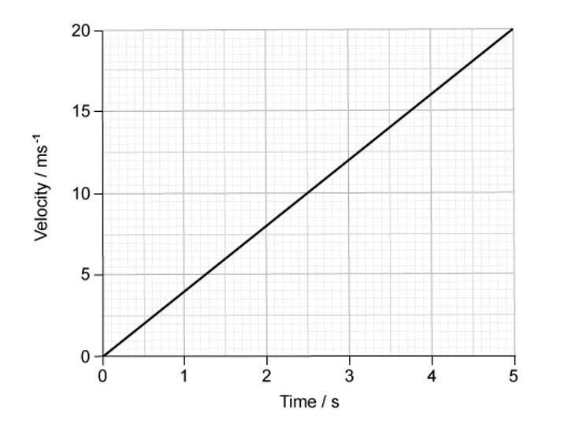
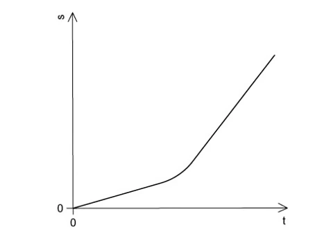
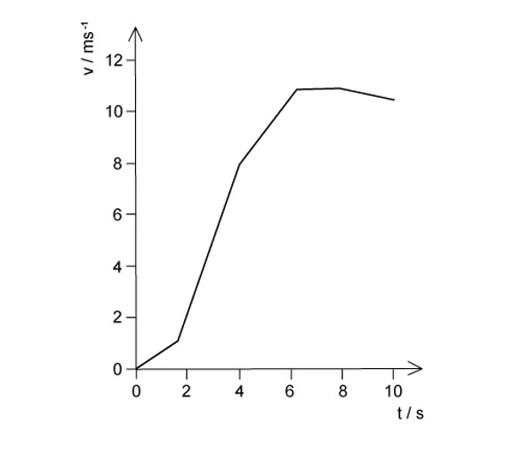
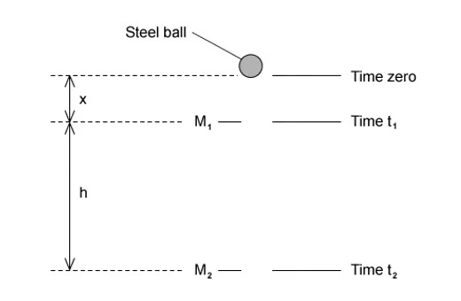

#### Easy · 7 questions

::: {.question-card .mc-question data-answer="C"}
### Example 1 · 2.1 MC Easy Q1
An object moves directly from X to Z. In a shorter time, a second object moves from X to Y to Z. Which statement about the two objects is correct for the journey from X to Z?

<button class="mc-choice" data-choice="A"><strong>A</strong> they have the same average speed</button><button class="mc-choice" data-choice="B"><strong>B</strong> they have the same average velocity</button><button class="mc-choice" data-choice="C"><strong>C</strong> they have the same displacement</button><button class="mc-choice" data-choice="D"><strong>D</strong> they travel the same distance</button>
<button class="check-answer">Check answer</button>

:::

::: {.question-card .mc-question data-answer="A"}
### Example 2 · 2.1 MC Easy Q2
An experiment is done to measure the acceleration of free fall of a body from rest. Which measurements are needed?

<button class="mc-choice" data-choice="A"><strong>A</strong> the height of fall and the time of fall</button><button class="mc-choice" data-choice="B"><strong>B</strong> the height of fall and the weight of the body</button><button class="mc-choice" data-choice="C"><strong>C</strong> the mass of the body and the height of fall</button><button class="mc-choice" data-choice="D"><strong>D</strong> the mass of the body and the time of fall</button>
<button class="check-answer">Check answer</button>

:::

::: {.question-card .mc-question data-answer="D"}
### Example 3 · 2.1 MC Easy Q3
Which feature of a graph allows acceleration to be determined?

<button class="mc-choice" data-choice="A"><strong>A</strong> the area under a displacement-time graph</button><button class="mc-choice" data-choice="B"><strong>B</strong> the area under a velocity-time graph</button><button class="mc-choice" data-choice="C"><strong>C</strong> the slope of a displacement-time graph</button><button class="mc-choice" data-choice="D"><strong>D</strong> the slope of a velocity-time graph</button>
<button class="check-answer">Check answer</button>

:::

::: {.question-card .mc-question data-answer="C"}
### Example 4 · 2.1 MC Easy Q4
The velocity of an object during the first five seconds of its motion is shown on the graph. What is the displacement of the object in this time?

{.question-figure fig-alt="Original velocity-time graph extracted from the PDF"}

<button class="mc-choice" data-choice="A"><strong>A</strong> $4\ \mathrm{m}$</button><button class="mc-choice" data-choice="B"><strong>B</strong> $20\ \mathrm{m}$</button><button class="mc-choice" data-choice="C"><strong>C</strong> $50\ \mathrm{m}$</button><button class="mc-choice" data-choice="D"><strong>D</strong> $100\ \mathrm{m}$</button>
<button class="check-answer">Check answer</button>

:::

::: {.question-card .mc-question data-answer="D"}
### Example 5 · 2.1 MC Easy Q5
The variation with time $t$ of the distance $s$ moved by a body is shown below. What can be deduced from the graph about the motion of the body?

{.question-figure fig-alt="Original distance-time graph extracted from the PDF"}

<button class="mc-choice" data-choice="A"><strong>A</strong> it accelerates continuously</button><button class="mc-choice" data-choice="B"><strong>B</strong> it starts from rest</button><button class="mc-choice" data-choice="C"><strong>C</strong> the distance is proportional to time</button><button class="mc-choice" data-choice="D"><strong>D</strong> the speed changes</button>
<button class="check-answer">Check answer</button>

:::

::: {.question-card .mc-question data-answer="D"}
### Example 6 · 2.1 MC Easy Q6
An object is thrown with velocity $7.1\ \mathrm{m\,s^{-1}}$ vertically upwards on the Moon. The acceleration due to gravity on the Moon is $1.62\ \mathrm{m\,s^{-2}}$. What is the time taken for the object to return to its starting point?

<button class="mc-choice" data-choice="A"><strong>A</strong> $3.5\ \mathrm{s}$</button><button class="mc-choice" data-choice="B"><strong>B</strong> $4.4\ \mathrm{s}$</button><button class="mc-choice" data-choice="C"><strong>C</strong> $6.5\ \mathrm{s}$</button><button class="mc-choice" data-choice="D"><strong>D</strong> $8.8\ \mathrm{s}$</button>
<button class="check-answer">Check answer</button>

:::

::: {.question-card .mc-question data-answer="C"}
### Example 7 · 2.1 MC Easy Q7
An insect jumps with an initial vertical velocity of $1.5\ \mathrm{m\,s^{-1}}$, reaching a maximum height of $4.5\times10^{-2}\ \mathrm{m}$. Assume the deceleration is uniform. What is the magnitude of the deceleration?

<button class="mc-choice" data-choice="A"><strong>A</strong> $6.8\ \mathrm{m\,s^{-2}}$</button><button class="mc-choice" data-choice="B"><strong>B</strong> $9.8\ \mathrm{m\,s^{-2}}$</button><button class="mc-choice" data-choice="C"><strong>C</strong> $25\ \mathrm{m\,s^{-2}}$</button><button class="mc-choice" data-choice="D"><strong>D</strong> $50\ \mathrm{m\,s^{-2}}$</button>
<button class="check-answer">Check answer</button>

:::

#### Medium · 7 questions

::: {.question-card .mc-question data-answer="D"}
### Example 8 · 2.1 MC Medium Q2
A bullet is fired horizontally with speed $v$ from a rifle. For a short time $t$ after leaving the rifle, the only force affecting its motion is gravity. The acceleration of free fall is $g$. What is the value of $\dfrac{\text{horizontal distance travelled in time }t}{\text{vertical distance travelled in time }t}$?

<button class="mc-choice" data-choice="A"><strong>A</strong> $vt/g$</button><button class="mc-choice" data-choice="B"><strong>B</strong> $v/(gt)$</button><button class="mc-choice" data-choice="C"><strong>C</strong> $2vt/g$</button><button class="mc-choice" data-choice="D"><strong>D</strong> $2v/(gt)$</button>
<button class="check-answer">Check answer</button>

:::

::: {.question-card .mc-question data-answer="C"}
### Example 9 · 2.1 MC Medium Q3
The acceleration of free fall on the Moon is one-sixth of that on Earth. On Earth it takes time $t$ for a stone to fall from rest a distance of $2\ \mathrm{m}$. What is the time taken for a stone to fall from rest a distance of $2\ \mathrm{m}$ on the Moon?

<button class="mc-choice" data-choice="A"><strong>A</strong> $6t$</button><button class="mc-choice" data-choice="B"><strong>B</strong> $t/6$</button><button class="mc-choice" data-choice="C"><strong>C</strong> $t\sqrt6$</button><button class="mc-choice" data-choice="D"><strong>D</strong> $t/\sqrt6$</button>
<button class="check-answer">Check answer</button>

:::

::: {.question-card .mc-question data-answer="A"}
### Example 10 · 2.1 MC Medium Q4
A stone is thrown upwards and follows a curved path. Air resistance is negligible. Why does the path have this shape?

<button class="mc-choice" data-choice="A"><strong>A</strong> the stone has a constant horizontal velocity and constant vertical acceleration</button><button class="mc-choice" data-choice="B"><strong>B</strong> the stone has a constant horizontal acceleration and constant vertical velocity</button><button class="mc-choice" data-choice="C"><strong>C</strong> the stone has a constant upward acceleration followed by a constant downward acceleration</button><button class="mc-choice" data-choice="D"><strong>D</strong> the stone has a constant upward velocity followed by a constant downward velocity</button>
<button class="check-answer">Check answer</button>

:::

::: {.question-card .mc-question data-answer="D"}
### Example 11 · 2.1 MC Medium Q5
A train passes through a station at a constant speed of $20\ \mathrm{m\,s^{-1}}$. A second train is at rest at the station. It begins to leave the station with a uniform acceleration of $1.0\ \mathrm{m\,s^{-2}}$ just as the first train goes past. How much time passes before the second train overtakes the first train?

<button class="mc-choice" data-choice="A"><strong>A</strong> $5\ \mathrm{s}$</button><button class="mc-choice" data-choice="B"><strong>B</strong> $10\ \mathrm{s}$</button><button class="mc-choice" data-choice="C"><strong>C</strong> $20\ \mathrm{s}$</button><button class="mc-choice" data-choice="D"><strong>D</strong> $40\ \mathrm{s}$</button>
<button class="check-answer">Check answer</button>

:::

::: {.question-card .mc-question data-answer="A"}
### Example 12 · 2.1 MC Medium Q6
The graph shows how the speed $v$ of a sprinter changes with time $t$ during a $100\ \mathrm{m}$ race. What is the best estimate of the maximum acceleration of the sprinter?

{.question-figure fig-alt="Original speed-time graph extracted from the PDF"}

<button class="mc-choice" data-choice="A"><strong>A</strong> $3\ \mathrm{m\,s^{-2}}$</button><button class="mc-choice" data-choice="B"><strong>B</strong> $6\ \mathrm{m\,s^{-2}}$</button><button class="mc-choice" data-choice="C"><strong>C</strong> $9\ \mathrm{m\,s^{-2}}$</button><button class="mc-choice" data-choice="D"><strong>D</strong> $12\ \mathrm{m\,s^{-2}}$</button>
<button class="check-answer">Check answer</button>

:::

::: {.question-card .mc-question data-answer="D"}
### Example 13 · 2.1 MC Medium Q8
In a cathode-ray tube, an electron is accelerated uniformly in a straight line from a speed of $4\times10^5\ \mathrm{m\,s^{-1}}$ to one tenth of the speed of light over a distance of $10\ \mathrm{mm}$. What is the acceleration of the electron?

<button class="mc-choice" data-choice="A"><strong>A</strong> $4.5\times10^3\ \mathrm{m\,s^{-2}}$</button><button class="mc-choice" data-choice="B"><strong>B</strong> $4.5\times10^6\ \mathrm{m\,s^{-2}}$</button><button class="mc-choice" data-choice="C"><strong>C</strong> $4.5\times10^{13}\ \mathrm{m\,s^{-2}}$</button><button class="mc-choice" data-choice="D"><strong>D</strong> $4.5\times10^{16}\ \mathrm{m\,s^{-2}}$</button>
<button class="check-answer">Check answer</button>

:::

::: {.question-card .mc-question data-answer="C"}
### Example 14 · 2.1 MC Medium Q9
A projectile is fired at an angle $a$ to the horizontal at a speed $u$. What are the vertical and horizontal components of its velocity after a time $t$? Assume that air resistance is negligible. The acceleration of free fall is $g$.

<button class="mc-choice" data-choice="A"><strong>A</strong> $u\sin a$, $u\cos a$</button><button class="mc-choice" data-choice="B"><strong>B</strong> $u\sin a-gt$, $u\cos a-gt$</button><button class="mc-choice" data-choice="C"><strong>C</strong> $u\sin a-gt$, $u\cos a$</button><button class="mc-choice" data-choice="D"><strong>D</strong> $u\cos a$, $u\sin a-gt$</button>
<button class="check-answer">Check answer</button>

:::

#### Hard · 6 questions

::: {.question-card .mc-question data-answer="D"}
### Example 15 · 2.1 MC Hard Q1
A body having uniform acceleration $a$ increases its velocity from $u$ to $v$ in time $t$. Which expression would not give a correct value for the body’s displacement during time $t$?

<button class="mc-choice" data-choice="A"><strong>A</strong> $ut+\frac12at^2$</button><button class="mc-choice" data-choice="B"><strong>B</strong> $vt-\frac12at^2$</button><button class="mc-choice" data-choice="C"><strong>C</strong> $\dfrac{(v+u)(v-u)}{2a}$</button><button class="mc-choice" data-choice="D"><strong>D</strong> $\dfrac{(v-u)t}{2}$</button>
<button class="check-answer">Check answer</button>

:::

::: {.question-card .mc-question data-answer="C"}
### Example 16 · 2.1 MC Hard Q2
A cannon fires a cannonball with an initial speed $v$ at an angle $a$ to the horizontal. Which equation is correct for the maximum height $H$ reached?

<button class="mc-choice" data-choice="A"><strong>A</strong> $H=\dfrac{v\sin a}{2g}$</button><button class="mc-choice" data-choice="B"><strong>B</strong> $H=\dfrac{g\sin a}{2v}$</button><button class="mc-choice" data-choice="C"><strong>C</strong> $H=\dfrac{(v\sin a)^2}{2g}$</button><button class="mc-choice" data-choice="D"><strong>D</strong> $H=\dfrac{2g\sin a}{v^2}$</button>
<button class="check-answer">Check answer</button>

:::

::: {.question-card .mc-question data-answer="C"}
### Example 17 · 2.1 MC Hard Q5
Two markers $M_1$ and $M_2$ are set up a vertical distance $h$ apart. A steel ball is released at time zero from a point a distance $x$ above $M_1$. The ball reaches $M_1$ at time $t_1$ and reaches $M_2$ at time $t_2$. The acceleration of the ball is constant. Which expression gives the acceleration of the ball?

{.question-figure fig-alt="Original steel-ball and marker diagram extracted from the PDF"}

<button class="mc-choice" data-choice="A"><strong>A</strong> $2h/t_1^2$</button><button class="mc-choice" data-choice="B"><strong>B</strong> $2h/(t_1+t_2)^2$</button><button class="mc-choice" data-choice="C"><strong>C</strong> $2h/(t_2^2-t_1^2)$</button><button class="mc-choice" data-choice="D"><strong>D</strong> $2h/(t_2-t_1)^2$</button>
<button class="check-answer">Check answer</button>

:::

::: {.question-card .mc-question data-answer="C"}
### Example 18 · 2.1 MC Hard Q6
A sprinter runs a $200\ \mathrm{m}$ race in a straight line. He accelerates from the starting block at a constant acceleration of $2.5\ \mathrm{m\,s^{-2}}$ to reach his maximum speed of $10\ \mathrm{m\,s^{-1}}$. He maintains this speed until he crosses the finish line. Which time does it take the sprinter to run the race?

<button class="mc-choice" data-choice="A"><strong>A</strong> $8\ \mathrm{s}$</button><button class="mc-choice" data-choice="B"><strong>B</strong> $20\ \mathrm{s}$</button><button class="mc-choice" data-choice="C"><strong>C</strong> $22\ \mathrm{s}$</button><button class="mc-choice" data-choice="D"><strong>D</strong> $40\ \mathrm{s}$</button>
<button class="check-answer">Check answer</button>

:::

::: {.question-card .mc-question data-answer="D"}
### Example 19 · 2.1 MC Hard Q7
In order that a train can stop safely, it will always pass a signal showing a yellow light before it reaches a signal showing a red light. Drivers apply the brake at the yellow light and this results in a uniform deceleration to stop exactly at the red light. The distance between the red and yellow lights is $x$. What must be the minimum distance between the lights if the train speed is increased by $25\%$, without changing the deceleration of the trains?

<button class="mc-choice" data-choice="A"><strong>A</strong> $1.20x$</button><button class="mc-choice" data-choice="B"><strong>B</strong> $1.25x$</button><button class="mc-choice" data-choice="C"><strong>C</strong> $1.44x$</button><button class="mc-choice" data-choice="D"><strong>D</strong> $1.56x$</button>
<button class="check-answer">Check answer</button>

:::

::: {.question-card .mc-question data-answer="B"}
### Example 20 · 2.1 MC Hard Q9
An aeroplane travels at an average speed of $700\ \mathrm{km\,h^{-1}}$ on an outward flight and at $300\ \mathrm{km\,h^{-1}}$ on the return flight over the same distance. What is the average speed of the whole flight?

<button class="mc-choice" data-choice="A"><strong>A</strong> $400\ \mathrm{km\,h^{-1}}$</button><button class="mc-choice" data-choice="B"><strong>B</strong> $420\ \mathrm{km\,h^{-1}}$</button><button class="mc-choice" data-choice="C"><strong>C</strong> $480\ \mathrm{km\,h^{-1}}$</button><button class="mc-choice" data-choice="D"><strong>D</strong> $500\ \mathrm{km\,h^{-1}}$</button>
<button class="check-answer">Check answer</button>

:::
