#### Easy · 4 questions

::: {.question-card}
### Example 1 · Distance, displacement, speed and velocity · 2.1 SQ Easy Q1(a)

State the difference between:

<ol class="subparts" type="i">
<li>distance and displacement;</li>
<li>speed and velocity.</li>
</ol>

`[4 marks]`

Show mark scheme / model answer

**(i) Distance and displacement**

- Distance is the total path length travelled and is a scalar. `[1]`
- Displacement is the change in position in a specified direction and is a vector. `[1]`

**(ii) Speed and velocity**

- Speed is distance travelled per unit time and is a scalar. `[1]`
- Velocity is the rate of change of displacement and is a vector. `[1]`

:::

::: {.question-card}
### Example 2 · Scalars and vectors · 2.1 SQ Easy Q2(a)

Place ticks in the table to indicate which of the quantities are vectors and which are scalars.

|  | velocity | speed | distance | displacement | acceleration |
|---|---|---|---|---|---|
| vector |  |  |  |  |  |
| scalar |  |  |  |  |  |

`[2 marks]`

Show mark scheme / model answer

- **Vectors:** velocity, displacement and acceleration. `[1]`
- **Scalars:** speed and distance. `[1]`

:::

::: {.question-card}
### Example 3 · Uniform acceleration and SUVAT · 2.1 SQ Easy Q2(b)

Two of the equations of uniformly accelerated motion are

$$s=ut+\frac12at^2$$
$$v^2=u^2+2as.$$

State:

<ol class="subparts" type="i">
<li>the definition of uniform acceleration;</li>
<li>the two other equations of motion that can be used to derive the above equations.</li>
</ol>

`[3 marks]`

Show mark scheme / model answer

**(i)**

- Uniform acceleration means that velocity changes by equal amounts in equal time intervals. `[1]`

**(ii)**

- $v=u+at$. `[1]`
- $s=\dfrac{u+v}{2}t$. `[1]`

:::

::: {.question-card}
### Example 4 · Stone dropped into a well · 2.1 SQ Easy Q3(a)-(b)

A student drops a stone into a well and measures the time it takes to hear the stone splash at the bottom.

<ol class="subparts" type="a">
<li>Explain how this measurement of time can be used to find the depth of the well. <code>[3 marks]</code></li>
<li>It takes $3.2\ \mathrm{s}$ for the stone to drop from rest and splash into the water at the bottom. Calculate the speed of the stone when it hits the water. <code>[2 marks]</code></li>
</ol>

Show mark scheme / model answer

**(a)**

- Treat the stone as starting from rest and accelerating uniformly at $g$. `[1]`
- Use $s=ut+\frac12gt^2$ with $u=0$. `[1]`
- Hence depth $s=\frac12gt^2$; if the measured time includes the sound's return time, correct for that before substitution. `[1]`

**(b)**

- $v=u+gt=0+9.81(3.2)$. `[1]`
- $v=31.4\ \mathrm{m\,s^{-1}}\approx31\ \mathrm{m\,s^{-1}}$ downward. `[1]`

:::

#### Medium · 3 questions

::: {.question-card}
### Example 5 · Projectile motion to a wall · 2.1 SQ Medium Q1

**(a)** Define acceleration. `[1 mark]`

**(b)** A ball is kicked from horizontal ground towards a vertical wall, as shown in Fig. 1.1. The horizontal distance between the initial position of the ball and the base of the wall is $24\ \mathrm{m}$. The ball is kicked with an initial velocity $v$ at an angle of $28^\circ$ to the horizontal. The ball hits the top of the wall after a time of $1.5\ \mathrm{s}$. Air resistance is negligible.

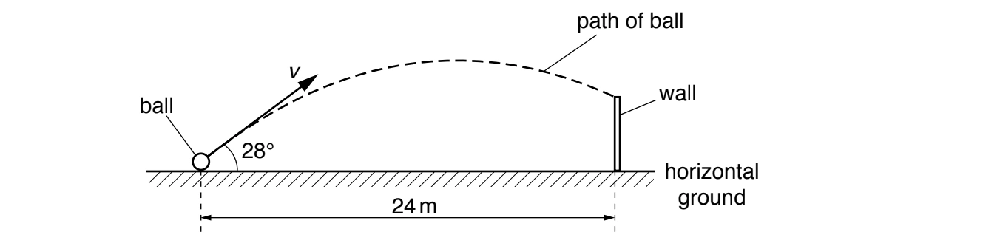{.question-figure fig-alt="Original ball, wall and projectile-path diagram extracted from the PDF"}

<ol class="subparts" type="i">
<li>Calculate the initial horizontal component $v_x$ of the velocity of the ball. <code>[1 mark]</code></li>
<li>Show that the initial vertical component $v_y$ of the velocity of the ball is $8.5\ \mathrm{m\,s^{-1}}$. <code>[2 marks]</code></li>
<li>Calculate the time taken for the ball to reach its maximum height above the ground. <code>[2 marks]</code></li>
<li>The ball is kicked at time $t=0$. Assume that the vertical component $v_y$ of the velocity of the ball is positive in the upwards direction. On Fig. 1.2, sketch the variation with time $t$ of $v_y$ for the time until the ball hits the wall. <code>[2 marks]</code></li>
</ol>

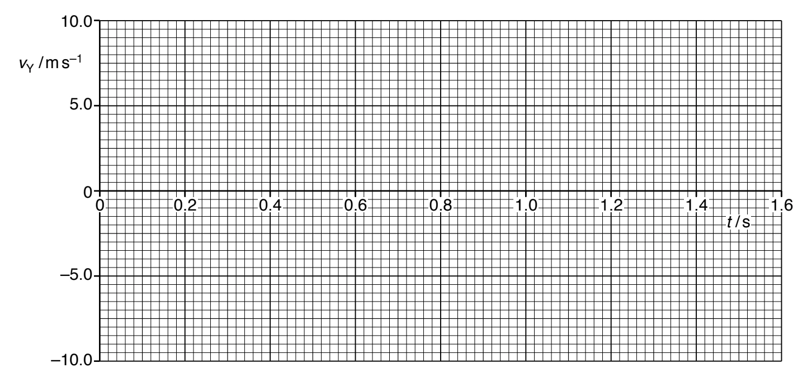{.question-figure fig-alt="Original blank vertical-velocity-time graph extracted from the PDF"}

**(c)**

<ol class="subparts" type="i">
<li>Calculate the maximum height above the ground of the ball in (b). <code>[2 marks]</code></li>
<li>The maximum gravitational potential energy of the ball above the ground is $22\ \mathrm{J}$. Calculate the mass of the ball. <code>[2 marks]</code></li>
</ol>

**(d)** A ball of greater mass is kicked with the same velocity as the ball in (b). Air resistance is still negligible. State and explain the effect, if any, of the increased mass on the time taken by the ball to reach its maximum height. `[1 mark]`

Show mark scheme / model answer

**(a)**

- Acceleration is the rate of change of velocity. `[1]`

**(b)(i)**

- Horizontal velocity is constant, so $v_x=24/1.5=16\ \mathrm{m\,s^{-1}}$. `[1]`

**(b)(ii)**

- $\tan28^\circ=v_y/v_x$. `[1]`
- $v_y=16\tan28^\circ=8.5\ \mathrm{m\,s^{-1}}$. `[1]`

**(b)(iii)**

- At maximum height, vertical velocity is zero. `[1]`
- $t=v_y/g=8.5/9.81=0.87\ \mathrm{s}$. `[1]`

**(b)(iv)**

- Draw a straight line with gradient $-g$. `[1]`
- It starts at $+8.5\ \mathrm{m\,s^{-1}}$ and reaches about $-6.2\ \mathrm{m\,s^{-1}}$ at $1.5\ \mathrm{s}$. `[1]`

**(c)(i)**

- $0=8.5^2-2gH$. `[1]`
- $H=3.7\ \mathrm{m}$. `[1]`

**(c)(ii)**

- $E_p=mgH$, so $m=22/(9.81\times3.7)$. `[1]`
- $m\approx0.61\ \mathrm{kg}$. `[1]`

**(d)**

- There is no effect: gravitational acceleration and the time to maximum height are independent of mass when air resistance is negligible. `[1]`

:::

::: {.question-card}
### Example 6 · Horizontal projection from a cliff · 2.1 SQ Medium Q3

A ball is projected horizontally at $27\ \mathrm{m\,s^{-1}}$ from a vertical cliff. It travels a horizontal distance of $40\ \mathrm{m}$ before hitting the ground. Assume that air resistance is negligible.

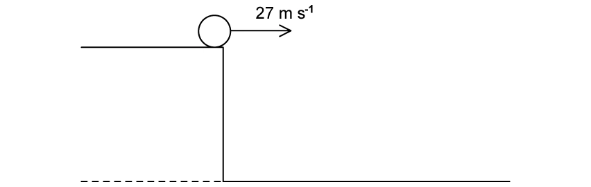{.question-figure fig-alt="Original horizontal projection from a cliff diagram extracted from the PDF"}

<ol class="subparts" type="a">
<li>Calculate the vertical velocity of the ball just before it hits the ground. <code>[4 marks]</code></li>
<li>Calculate the height of the cliff. <code>[2 marks]</code></li>
<li>Sketch the graphs to show how the horizontal and vertical components of the velocity of the ball, $v_x$ and $v_y$, change with time $t$ just before the ball hits the ground. Label any appropriate values on the axes. <code>[3 marks]</code></li>
<li>Calculate the resultant velocity of the ball just before it hits the ground. <code>[2 marks]</code></li>
</ol>

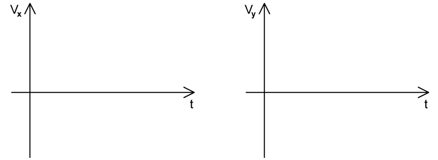{.question-figure fig-alt="Original blank component-velocity graph axes extracted from the PDF"}

Show mark scheme / model answer

**(a)**

- Horizontal velocity is constant, so $t=40/27=1.48\ \mathrm{s}$. `[2]`
- $v_y=gt=9.81(1.48)=14.5\ \mathrm{m\,s^{-1}}$ downward. `[2]`

**(b)**

- $h=\frac12gt^2$. `[1]`
- $h=\frac12(9.81)(1.48)^2=10.8\ \mathrm{m}$. `[1]`

**(c)**

- $v_x$ is a horizontal line at $27\ \mathrm{m\,s^{-1}}$. `[1]`
- $v_y$ is a straight line of gradient $-g$, from $0$ to $-14.5\ \mathrm{m\,s^{-1}}$. `[2]`

**(d)**

- $v=\sqrt{27^2+14.5^2}$. `[1]`
- Resultant speed $\approx30.6\ \mathrm{m\,s^{-1}}\approx31\ \mathrm{m\,s^{-1}}$. `[1]`

:::

::: {.question-card}
### Example 7 · Deriving equations of motion · 2.1 SQ Medium Q4(a)

A particle moves in a straight line with a constant acceleration $a$. The initial velocity of the particle at $t=0$ is $u$. After a further time $t$, its velocity has increased to $v$.

<ol class="subparts" type="i">
<li>Using the definition of acceleration, show that $v=u+at$. <code>[2 marks]</code></li>
<li>Using the definition of average velocity, show that $s=ut+\frac12at^2$. <code>[3 marks]</code></li>
<li>Using these two equations, show that $v^2=u^2+2as$. <code>[3 marks]</code></li>
</ol>

Show mark scheme / model answer

**(i)**

- $a=(v-u)/t$. `[1]`
- Rearranging gives $v=u+at$. `[1]`

**(ii)**

- For constant acceleration, average velocity $=(u+v)/2$, so $s=(u+v)t/2$. `[1]`
- Substitute $v=u+at$. `[1]`
- $s=\frac12[u+(u+at)]t=ut+\frac12at^2$. `[1]`

**(iii)**

- From $v=u+at$, $t=(v-u)/a$. `[1]`
- Substitute into $s=(u+v)t/2$. `[1]`
- $s=(u+v)(v-u)/(2a)=(v^2-u^2)/(2a)$, hence $v^2=u^2+2as$. `[1]`

:::

#### Hard · 3 questions

::: {.question-card}
### Example 8 · Fireworks display · 2.1 SQ Hard Q1

During a fireworks display, a firework is launched into the air and explodes once it reaches a maximum height of $250\ \mathrm{m}$. The vertical component of the velocity at launch depends on both the initial velocity of the firework and the angle $\theta$ between the initial velocity and the horizontal. The maximum initial velocity a firework can be launched at is $110\ \mathrm{m\,s^{-1}}$.

<ol class="subparts" type="i">
<li>Calculate the initial launch velocity for a firework that is fired directly upwards. <code>[2 marks]</code></li>
<li>Show that the minimum launch angle between the initial velocity and the horizontal to reach $250\ \mathrm{m}$ is about $40^\circ$. <code>[3 marks]</code></li>
</ol>

**(b)** On Fig. 1.1, sketch the variation of angle $\theta$ with the initial velocity required for the firework to reach the maximum height of $250\ \mathrm{m}$. Include values from (a) on the axes. `[4 marks]`

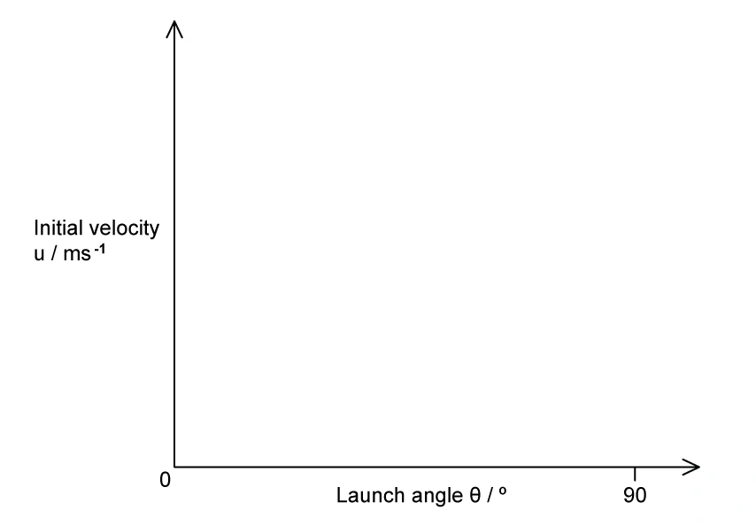{.question-figure fig-alt="Original launch-angle and initial-velocity axes extracted from the PDF"}

**(c)** The length of the fuse within the firework is chosen to ensure it explodes just as it reaches its highest point above the ground. The firework is launched into the air at an angle of $75^\circ$ to the horizontal, as shown in Fig. 1.2. The firework contains a fuse with a burn rate of $1.5\ \mathrm{cm\,s^{-1}}$. Determine the length of the fuse used in the firework. `[4 marks]`

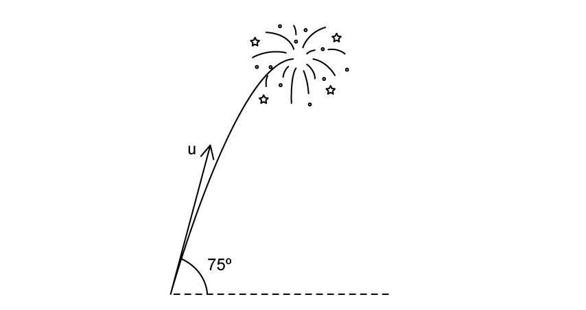{.question-figure fig-alt="Original 75-degree firework trajectory diagram extracted from the PDF"}

**(d)** During the display, one of the fireworks is lit but falls over before launching. When it launches, it leaves the ground with an initial velocity of $75\ \mathrm{m\,s^{-1}}$ at an angle of $30^\circ$ to the horizontal, as shown in Fig. 1.3. The firework moves in the direction of a hill. The side of the hill is inclined at $8.5^\circ$ to the horizontal. Deduce whether the firework ignites before it lands on the hillside. `[4 marks]`

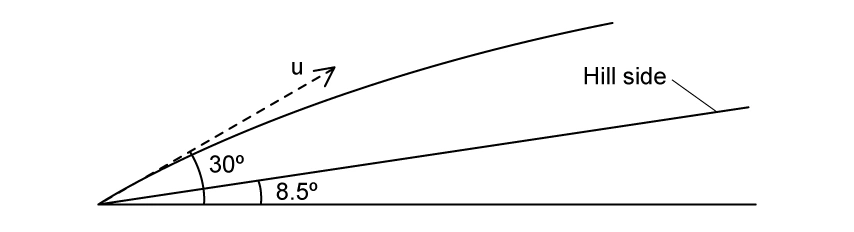{.question-figure fig-alt="Original firework and hillside diagram extracted from the PDF"}

Show mark scheme / model answer

**(a)(i)**

- At maximum height, $v=0$, so $0=u^2-2g(250)$. `[1]`
- $u=70.0\ \mathrm{m\,s^{-1}}$. `[1]`

**(a)(ii)**

- Required vertical component is $70.0\ \mathrm{m\,s^{-1}}$. `[1]`
- $110\sin\theta=70.0$. `[1]`
- $\theta=39.5^\circ\approx40^\circ$. `[1]`

**(b)**

- Draw a decreasing curve because $u\sin\theta=70.0$. `[1]`
- Include $(40^\circ,110\ \mathrm{m\,s^{-1}})$ and $(90^\circ,70\ \mathrm{m\,s^{-1}})$. `[2]`
- The curve approaches but does not meet the velocity axis. `[1]`

**(c)**

- At $75^\circ$, the required launch speed is $u=70.0/\sin75^\circ=72.5\ \mathrm{m\,s^{-1}}$. `[1]`
- Time to maximum height $=72.5/9.81=7.4\ \mathrm{s}$. `[2]`
- Fuse length $=1.5\times7.4=11.1\ \mathrm{cm}$. `[1]`

**(d)**

- Maximum height for the fallen firework $=(75\sin30^\circ)^2/(2g)=71.7\ \mathrm{m}$. `[1]`
- In $7.4\ \mathrm{s}$, horizontal distance $=75\cos30^\circ(7.4)=481\ \mathrm{m}$. `[1]`
- Hill height there $=481\tan8.5^\circ=71.9\ \mathrm{m}$. `[1]`
- These heights are approximately equal, so the firework ignites just as it reaches the hillside. `[1]`

:::

::: {.question-card}
### Example 9 · Stunt motorcyclist · 2.1 SQ Hard Q2

Fig. 1.1 shows a stunt motorcyclist descending down a ramp. The motorcyclist starts from rest at the top of the ramp at A and leaves the ramp at B horizontally. After leaving the ramp at B, the motorcyclist lands on the ground at C, which is $6.4\ \mathrm{m}$ away. At C, the motorcyclist lands with a resultant velocity of $13.4\ \mathrm{m\,s^{-1}}$ at an angle of $29.5^\circ$ with the horizontal. Calculate the initial velocity of the motorcyclist at B. Assume that air resistance is negligible. `[4 marks]`

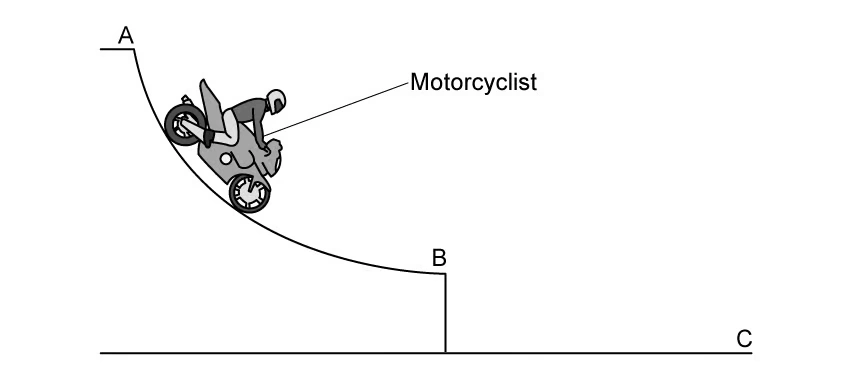{.question-figure fig-alt="Original motorcyclist descending-ramp diagram extracted from the PDF"}

The motorcyclist practises a stunt on a different ramp inclined at $25^\circ$ and $3\ \mathrm{m}$ high. The other ramp is $24\ \mathrm{m}$ away and has a height of $1\ \mathrm{m}$. Calculate the minimum initial velocity the motorcyclist requires in order to reach the other ramp. `[4 marks]`

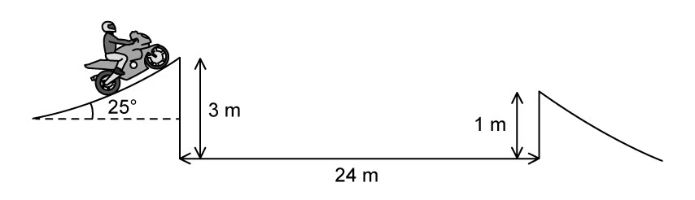{.question-figure fig-alt="Original two-ramp diagram extracted from the PDF"}

The stunt motorcyclist's ultimate goal is to jump across a river and land on the other side. The ramp is at an angle of $25^\circ$ to the horizontal and the height at the end of the ramp is $3.0\ \mathrm{m}$. The width of the river is $100\ \mathrm{m}$. The initial velocity of the motorcyclist is $35\ \mathrm{m\,s^{-1}}$.

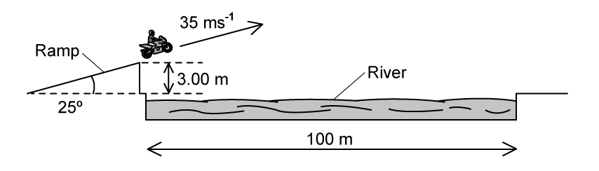{.question-figure fig-alt="Original river-jump diagram extracted from the PDF"}

<ol class="subparts" type="i">
<li>Deduce whether the motorcyclist lands on the other side of the river. <code>[4 marks]</code></li>
<li>Explain how air resistance would affect the jump. <code>[3 marks]</code></li>
</ol>

Show mark scheme / model answer

**(a)**

- Vertical component at C: $v_y=13.4\sin29.5^\circ=6.6\ \mathrm{m\,s^{-1}}$. `[1]`
- Since initial vertical velocity at B is zero, $t=v_y/g=0.673\ \mathrm{s}$. `[1]`
- Horizontal velocity $u_x=6.4/0.673=9.5\ \mathrm{m\,s^{-1}}$. `[2]`

**(b)**

- Resolve launch velocity: $u_x=u\cos25^\circ$, $u_y=u\sin25^\circ$. `[1]`
- Use the horizontal separation $24\ \mathrm{m}$ and vertical displacement $-2\ \mathrm{m}$. `[1]`
- Solving the horizontal and vertical equations gives $t\approx1.64\ \mathrm{s}$. `[1]`
- Minimum initial velocity $u\approx16\ \mathrm{m\,s^{-1}}$. `[1]`

**(c)(i)**

- $u_x=35\cos25^\circ=31.7\ \mathrm{m\,s^{-1}}$ and $u_y=35\sin25^\circ=14.8\ \mathrm{m\,s^{-1}}$. `[1]`
- Time to travel $100\ \mathrm{m}$ horizontally $=100/31.7=3.155\ \mathrm{s}$. `[1]`
- Vertical displacement $=14.8(3.155)-\frac12(9.81)(3.155)^2=-2.13\ \mathrm{m}$. `[1]`
- This is less than the $3.0\ \mathrm{m}$ ramp height, so the rider lands on the far side. `[1]`

**(c)(ii)**

- Air resistance opposes the rider's motion. `[1]`
- It reduces horizontal speed and range. `[1]`
- The rider is therefore more likely to fall short of the far bank. `[1]`

:::

::: {.question-card}
### Example 10 · Motion close to the Moon · 2.1 SQ Hard Q3

An object is released near the surface of the Moon at time $t=0$. Fig. 1.1 shows the variation of displacement $s$ with time $t$ of the object from the point of release.

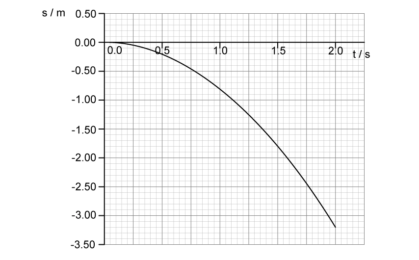{.question-figure fig-alt="Original displacement-time graph for an object close to the Moon extracted from the PDF"}

<ol class="subparts" type="a">
<li>State the significance of the negative values of $s$, and state two assumptions about the motion of the object. <code>[3 marks]</code></li>
<li>Use the graph in Fig. 1.1 to determine a value for the acceleration of free fall close to the surface of the Moon. <code>[2 marks]</code></li>
<li>Use Fig. 1.1 to estimate the instantaneous velocity of the object when $t=1.5\ \mathrm{s}$. <code>[3 marks]</code></li>
<li>On Fig. 1.1, sketch the variation of displacement with time $t$ if the same object was released close to the surface of the Earth instead. Describe and explain the features of your sketch. <code>[4 marks]</code></li>
</ol>

Show mark scheme / model answer

**(a)**

- Negative displacement means motion below the release point, towards the Moon. `[1]`
- Suitable assumptions: negligible air resistance and constant gravitational acceleration near the surface. `[2]`

**(b)**

- Read a displacement-time pair from the graph and use $s=\frac12at^2$. `[1]`
- This gives $g_{\text{Moon}}\approx1.6\ \mathrm{m\,s^{-2}}$. `[1]`

**(c)**

- Draw a tangent at $t=1.5\ \mathrm{s}$. `[1]`
- Calculate its gradient, $\Delta s/\Delta t$. `[1]`
- Instantaneous velocity $\approx-2.4\ \mathrm{m\,s^{-1}}$. `[1]`

**(d)**

- Draw a curve through the origin with the same negative direction but a much steeper gradient. `[2]`
- Earth's gravitational acceleration is larger, so displacement magnitude and speed increase more rapidly. `[2]`

:::
