#### Easy · 5 questions

::: {.question-card}
### Example 1 · Brick and Newton's laws · 3.1 SQ Easy Q1

A brick of mass $2\ \mathrm{kg}$ is resting on the floor.

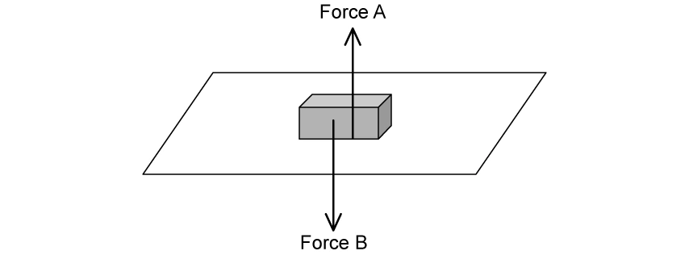{.question-figure fig-alt="Original brick force diagram extracted from the PDF"}

**(a)** (i) Define equilibrium. (ii) State the names of the upward force A and downward force B acting on the brick. `[2 marks]`

**(b)** (i) State Newton's first law of motion. (ii) Explain how Newton's first law applies to the brick. `[3 marks]`

**(c)** (i) State Newton's third law of motion. (ii) Explain how Newton's third law can be applied to one of the forces acting on the brick. `[4 marks]`

**(d)** The surface is raised at one end to form a slope. This causes the brick to accelerate at a constant rate of $0.25\ \mathrm{m\,s^{-2}}$. (i) State Newton's second law of motion. (ii) Determine the magnitude of the resultant force on the brick. `[3 marks]`

Show mark scheme / model answer

**(a)**

- Equilibrium means that the resultant force is zero. `[1]`
- A is the normal contact force; B is the weight of the brick. `[1]`

**(b)**

- Newton's first law: a body remains at rest or moves with constant velocity unless acted on by a resultant external force. `[1]`
- The brick is stationary because the upward and downward forces are equal, so the resultant force is zero. `[2]`

**(c)**

- Newton's third law: when body A exerts a force on body B, B exerts an equal and opposite force of the same type on A. `[1]`
- Valid pair: the floor pushes upward on the brick and the brick pushes downward on the floor with equal magnitude. `[3]`

**(d)**

- Newton's second law: the resultant force equals the rate of change of momentum; for constant mass, $F=ma$. `[1]`
- $F=2.0\times0.25=0.50\ \mathrm{N}$. `[2]`

:::

::: {.question-card}
### Example 2 · Skydiver and terminal velocity · 3.1 SQ Easy Q2

A skydiver of mass $75\ \mathrm{kg}$ jumps from an aircraft.

**(a)** (i) State the difference between mass and weight. (ii) Calculate the weight of the skydiver. `[4 marks]`

**(b)** A velocity-time graph shows the first $40\ \mathrm{s}$ of the fall: velocity increases rapidly from $0$ to $5\ \mathrm{s}$, increases at a decreasing rate from $5$ to $25\ \mathrm{s}$, and is constant from $25$ to $40\ \mathrm{s}$. Explain each section. `[6 marks]`

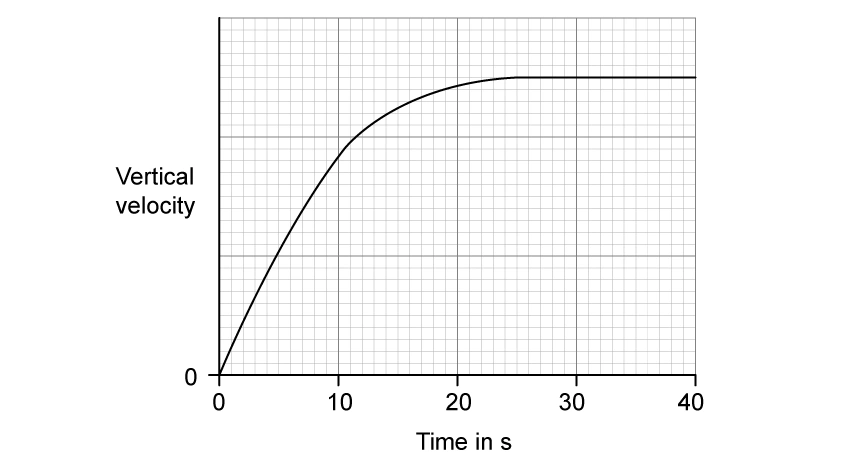{.question-figure fig-alt="Original skydiver velocity-time graph extracted from the PDF"}

**(c)** The skydiver is falling at constant velocity. State and label the forces acting on the skydiver. `[3 marks]`

{.question-figure fig-alt="Original skydiver diagram extracted from the PDF"}

**(d)** The parachute opens after $40\ \mathrm{s}$. Sketch and describe how vertical velocity changes until a new, lower terminal velocity is reached. `[2 marks]`

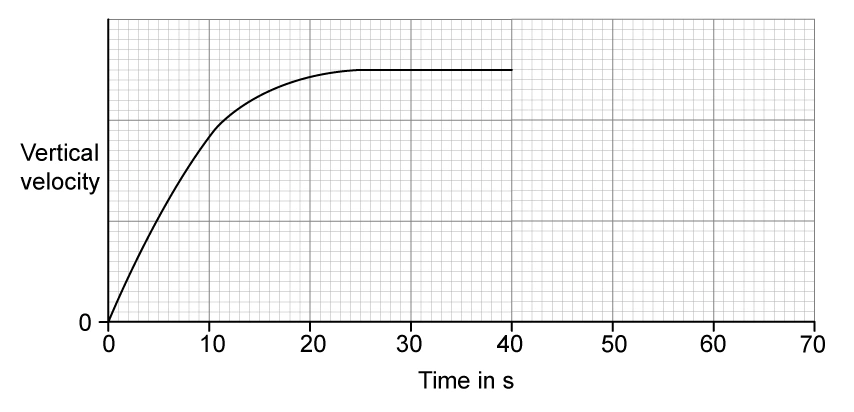{.question-figure fig-alt="Original blank skydiver velocity-time graph extracted from the PDF"}

Show mark scheme / model answer

**(a)**

- Mass is a measure of inertia; weight is the gravitational force on the skydiver. `[2]`
- $W=mg=75\times9.81=735.75\ \mathrm{N}\approx740\ \mathrm{N}$. `[2]`

**(b)**

- $0$-$5\ \mathrm{s}$: air resistance is initially negligible, so the resultant force is approximately the weight and acceleration is close to $g$. `[2]`
- $5$-$25\ \mathrm{s}$: speed and air resistance increase, so resultant force and acceleration decrease. `[2]`
- $25$-$40\ \mathrm{s}$: air resistance equals weight; resultant force and acceleration are zero, so velocity is constant. `[2]`

**(c)**

- Weight acts downward and air resistance acts upward. `[2]`
- At terminal velocity the arrows should be equal in length. `[1]`

**(d)**

- Opening the parachute makes air resistance greater than weight, producing an upward resultant force. `[1]`
- Downward velocity decreases along a smooth curve and reaches a lower terminal velocity. `[1]`

:::

::: {.question-card}
### Example 3 · Hot-air balloon · 3.1 SQ Easy Q3

A hot-air balloon is tied to the ground by two ropes. Each rope has tension $400\ \mathrm{N}$. The ropes are untied and the balloon starts to move upwards. The balloon and its contents have a total mass of $1500\ \mathrm{kg}$.

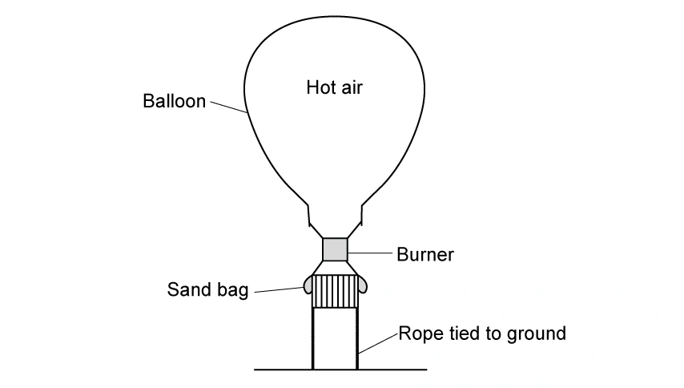{.question-figure fig-alt="Original hot-air balloon diagram extracted from the PDF"}

**(a)** State and label the forces acting on the tied balloon. `[3 marks]`

**(b)** Calculate (i) the weight of the balloon and (ii) the resultant force immediately after the ropes are untied. `[4 marks]`

**(c)** (i) Calculate the initial acceleration. (ii) Explain how the upward acceleration changes during the first few seconds. `[5 marks]`

**(d)** Passengers release sand from the bags. State and explain how this affects the upward acceleration. `[2 marks]`

Show mark scheme / model answer

**(a)**

- Upthrust acts upward. `[1]`
- Weight and the two rope tensions act downward. `[2]`

**(b)**

- $W=1500\times9.81=14\,715\ \mathrm{N}\approx14\,700\ \mathrm{N}$. `[2]`
- While tied, upthrust $=W+2T=14\,700+800=15\,500\ \mathrm{N}$. `[1]`
- Immediately after release, resultant force $=15\,500-14\,700=800\ \mathrm{N}$ upward. `[1]`

**(c)**

- $a=F/m=800/1500=0.53\ \mathrm{m\,s^{-2}}$. `[2]`
- As the balloon speeds up, downward drag increases. `[1]`
- The upward resultant force and acceleration therefore decrease. `[2]`

**(d)**

- Releasing sand reduces mass and weight while upthrust is initially unchanged. `[1]`
- The upward resultant force per unit mass increases, so upward acceleration increases. `[1]`

:::

::: {.question-card}
### Example 4 · Air rifle and impulse · 3.2 SQ Easy Q1

**(a)** State the principle of conservation of linear momentum. `[2 marks]`

**(b)** A pellet of mass $20\ \mathrm{g}$ is fired from an air rifle with momentum $1.2\ \mathrm{kg\,m\,s^{-1}}$. Calculate its velocity. `[2 marks]`

**(c)** State (i) the total momentum of rifle and pellet and (ii) the recoil momentum of the rifle. `[2 marks]`

**(d)** The pellet embeds in a target and takes $0.0025\ \mathrm{s}$ to stop. (i) State the relation between force and momentum. (ii) Calculate the average force required. `[4 marks]`

Show mark scheme / model answer

**(a)**

- Total momentum of a system remains constant provided no resultant external force acts. `[2]`

**(b)**

- Convert $20\ \mathrm{g}$ to $0.020\ \mathrm{kg}$. `[1]`
- $v=p/m=1.2/0.020=60\ \mathrm{m\,s^{-1}}$. `[1]`

**(c)**

- Total momentum of rifle and pellet is initially and finally zero. `[1]`
- Rifle recoil momentum $=-1.2\ \mathrm{kg\,m\,s^{-1}}$. `[1]`

**(d)**

- $F=\Delta p/\Delta t$. `[1]`
- $\Delta p=1.2\ \mathrm{kg\,m\,s^{-1}}$. `[1]`
- $F=1.2/0.0025=480\ \mathrm{N}$. `[2]`

:::

::: {.question-card}
### Example 5 · Trolley collision · 3.2 SQ Easy Q2

**(a)** For elastic and inelastic collisions, state whether momentum, total energy and kinetic energy are conserved. `[3 marks]`

**(b)** Trolley X, mass $400\ \mathrm{g}$, moves at $1.2\ \mathrm{m\,s^{-1}}$ towards stationary trolley Y, mass $800\ \mathrm{g}$. Calculate the initial momentum of X and state the combined momentum after they collide and stick together. `[3 marks]`

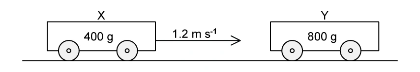{.question-figure fig-alt="Original trolley collision diagram extracted from the PDF"}

**(c)** Calculate the velocity and direction of the joined trolleys. `[4 marks]`

**(d)** Explain why the collision is not elastic. `[1 mark]`

Show mark scheme / model answer

**(a)**

- Momentum and total energy are conserved in both elastic and inelastic collisions. `[2]`
- Kinetic energy is conserved only in an elastic collision. `[1]`

**(b)**

- $p_X=0.400\times1.2=0.48\ \mathrm{kg\,m\,s^{-1}}$. `[2]`
- Combined momentum after impact is also $0.48\ \mathrm{kg\,m\,s^{-1}}$. `[1]`

**(c)**

- Combined mass $=0.400+0.800=1.20\ \mathrm{kg}$. `[1]`
- $v=0.48/1.20=0.40\ \mathrm{m\,s^{-1}}$. `[2]`
- Direction: the original direction of trolley X. `[1]`

**(d)**

- The trolleys stick together and kinetic energy decreases, so the collision is not elastic. `[1]`

:::

#### Medium · 6 questions

::: {.question-card}
### Example 6 · Block pulled up a slope · 3.1 SQ Medium Q1

A $250\ \mathrm{kg}$ stone block is pulled up a $17^\circ$ slope at constant speed by a cable with tension $1.2\ \mathrm{kN}$.

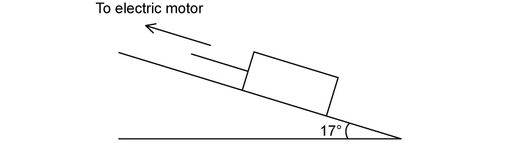{.question-figure fig-alt="Original stone block on slope diagram extracted from the PDF"}

**(a)** Draw and label all forces acting on the block. `[4 marks]`

**(b)** Discuss whether the block is in equilibrium. `[2 marks]`

**(c)** Calculate the constant total resistive force $R$. `[4 marks]`

**(d)** The cable breaks abruptly. Calculate the acceleration of the block. `[3 marks]`

Show mark scheme / model answer

**(a)**

- Tension acts up the slope. `[1]`
- Resistance acts down the slope. `[1]`
- Weight acts vertically downward and the normal reaction acts perpendicular to the slope. `[2]`

**(b)**

- The block moves at constant velocity, so acceleration and resultant force are zero. `[1]`
- It is therefore in translational equilibrium even though it is moving. `[1]`

**(c)**

- Resolve weight down the slope: $mg\sin17^\circ$. `[1]`
- $R=T-mg\sin17^\circ=1200-250(9.81)\sin17^\circ$. `[2]`
- $R\approx483\ \mathrm{N}$. `[1]`

**(d)**

- Immediately after the cable breaks, $F=mg\sin17^\circ+R$. `[1]`
- $a=F/m\approx4.8\ \mathrm{m\,s^{-2}}$ down the slope. `[2]`

:::

::: {.question-card}
### Example 7 · Apparent weight in an elevator · 3.1 SQ Medium Q2

A $65\ \mathrm{kg}$ man stands in an elevator. The elevator accelerates uniformly to $2.5\ \mathrm{m\,s^{-1}}$ in $1.8\ \mathrm{s}$, travels at constant velocity, then decelerates uniformly for $1.8\ \mathrm{s}$.

**(a)** Calculate the reaction force on the man while an upward-moving elevator comes to rest. `[4 marks]`

**(b)** Calculate the reaction force while a downward-moving elevator comes to rest. `[3 marks]`

**(c)** Explain which direction of travel makes the man feel (i) lighter and (ii) heavier during deceleration. `[4 marks]`

**(d)** The cable snaps and the elevator falls freely. Explain using laws of motion why the man feels weightless. `[3 marks]`

Show mark scheme / model answer

**Common calculation**

- $a=\Delta v/\Delta t=2.5/1.8=1.39\ \mathrm{m\,s^{-2}}$.

**(a)**

- While an upward-moving lift stops, acceleration is downward. `[1]`
- $R=m(g-a)=65(9.81-1.39)\approx547\ \mathrm{N}$. `[3]`

**(b)**

- While a downward-moving lift stops, acceleration is upward. `[1]`
- $R=m(g+a)=65(9.81+1.39)\approx728\ \mathrm{N}$. `[2]`

**(c)**

- The man feels lighter when the reaction is less than his weight: upward travel while decelerating. `[2]`
- He feels heavier when the reaction exceeds his weight: downward travel while decelerating. `[2]`

**(d)**

- In free fall both the man and elevator accelerate downward at $g$. `[1]`
- The man does not press on the floor, so the normal reaction is zero. `[2]`

:::

::: {.question-card}
### Example 8 · Newton's third law and colliding blocks · 3.1 SQ Medium Q3

**(a)** For a Newton's third-law pair, describe one similarity and one difference. `[2 marks]`

**(b)** Blocks A and B of masses $3.0\ \mathrm{kg}$ and $7.0\ \mathrm{kg}$ are connected on a frictionless table. A horizontal $200\ \mathrm{N}$ force acts on B. Identify the third-law pairs involving B and calculate the acceleration. `[7 marks]`

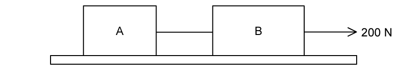{.question-figure fig-alt="Original connected-blocks diagram extracted from the PDF"}

**(c)** The string is removed. A approaches stationary B at $0.20\ \mathrm{m\,s^{-1}}$. From $t=80$ to $100\ \mathrm{ms}$, state how the magnitude of B's acceleration changes. From $t=100$ to $120\ \mathrm{ms}$, state the magnitude of B's acceleration. `[2 marks]`

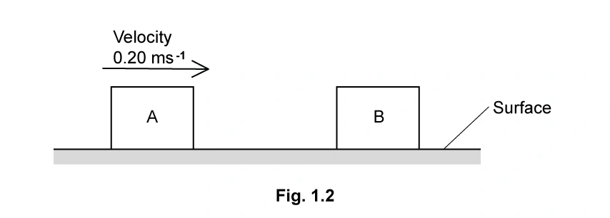{.question-figure fig-alt="Original blocks before collision diagram extracted from the PDF"}

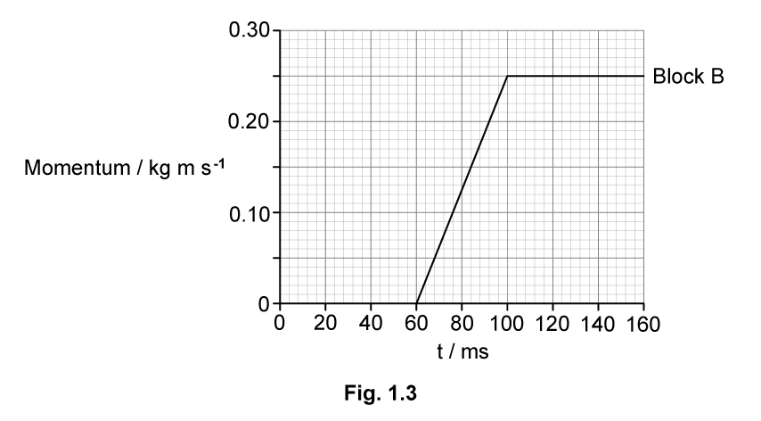{.question-figure fig-alt="Original block momentum-time graph extracted from the PDF"}

**(d)** Use the graph to determine contact time, average force and A's speed after collision. `[6 marks]`

Show mark scheme / model answer

**(a)**

- Similarity: equal magnitude or same type of force. `[1]`
- Difference: opposite directions or acting on different bodies. `[1]`

**(b)**

- Valid pairs involving B include: table on B / B on table; Earth on B / B on Earth; string on B / B on string; external body on B / B on external body. `[4]`
- For A: $T=3a$; for B: $200-T=7a$. `[2]`
- Hence $a=20\ \mathrm{m\,s^{-2}}$. `[1]`

**(c)**

- From $80$ to $100\ \mathrm{ms}$, graph gradient and acceleration are constant. `[1]`
- From $100$ to $120\ \mathrm{ms}$, gradient and acceleration are zero. `[1]`

**(d)**

- Contact time $=100-60=40\ \mathrm{ms}$. `[1]`
- $F=\Delta p/\Delta t=0.25/(40\times10^{-3})=6.25\ \mathrm{N}$. `[2]`
- $p_A$ after $=3(0.20)-0.25=0.35\ \mathrm{kg\,m\,s^{-1}}$. `[2]`
- $v_A=0.35/3=0.12\ \mathrm{m\,s^{-1}}$. `[1]`

:::

::: {.question-card}
### Example 9 · Falling ball and drag · 3.1 SQ Medium Q4

A hollow ball of mass $1.5\times10^{-2}\ \mathrm{kg}$ is dropped from rest and reaches terminal velocity. Upthrust is negligible.

**(a)** Explain why acceleration (i) decreases with time and (ii) is initially $9.8\ \mathrm{m\,s^{-2}}$. `[3 marks]`

**(b)** A velocity-time graph is used to determine acceleration at $t=0.25\ \mathrm{s}$. Explain how to obtain the acceleration and calculate the resultant force from it. `[5 marks]`

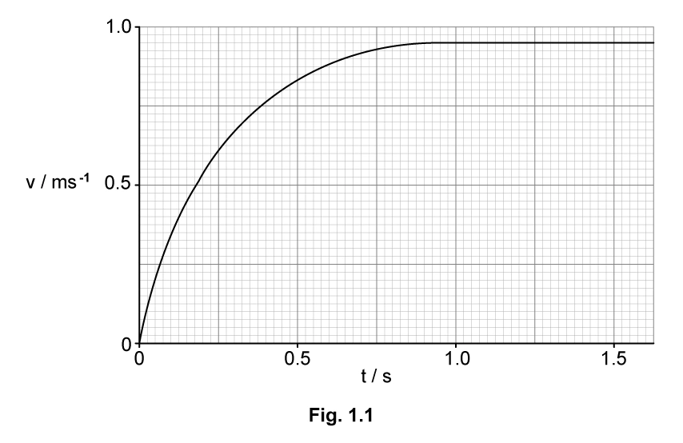{.question-figure fig-alt="Original falling-ball velocity-time graph extracted from the PDF"}

**(c)** Calculate the drag force on the falling ball at $t=0.25\ \mathrm{s}$. `[3 marks]`

Show mark scheme / model answer

**(a)**

- As speed increases, drag increases, so resultant force and acceleration decrease. `[2]`
- Initially speed and drag are zero; weight is the only force, so $a=g=9.8\ \mathrm{m\,s^{-2}}$. `[1]`

**(b)**

- Draw a tangent to the curve at $t=0.25\ \mathrm{s}$. `[1]`
- Calculate its gradient; the model answer gives about $1.15\ \mathrm{m\,s^{-2}}$. `[2]`
- $F=ma=0.015\times1.15\approx0.017\ \mathrm{N}$; accepted range $0.017$-$0.021\ \mathrm{N}$. `[2]`

**(c)**

- Weight $=0.015\times9.81=0.147\ \mathrm{N}$. `[1]`
- Since $F=W-D$, drag $D=0.147-0.018\approx0.13\ \mathrm{N}$. `[2]`

:::

::: {.question-card}
### Example 10 · Elastic and inelastic sphere collisions · 3.2 SQ Medium Q1

Ball X of mass $140\ \mathrm{g}$ collides head-on with stationary ball Y of mass $620\ \mathrm{g}$. X stops and Y moves in X's original direction at $0.8\ \mathrm{m\,s^{-1}}$.

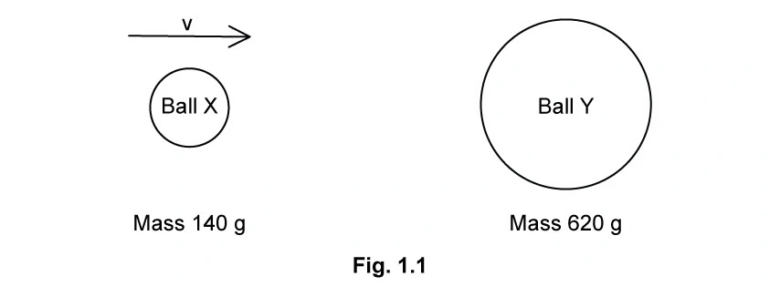{.question-figure fig-alt="Original first sphere-collision diagram extracted from the PDF"}

**(a)** Determine X's initial velocity. `[3 marks]`

**(b)** Show and explain why this collision is inelastic. `[4 marks]`

**(c)** An aluminium sphere of mass $2.7\ \mathrm{kg}$ moving at $10.0\ \mathrm{m\,s^{-1}}$ collides with a stationary $7.9\ \mathrm{kg}$ steel sphere. The steel sphere moves at $5.1\ \mathrm{m\,s^{-1}}$. Calculate the aluminium sphere's final velocity. `[3 marks]`

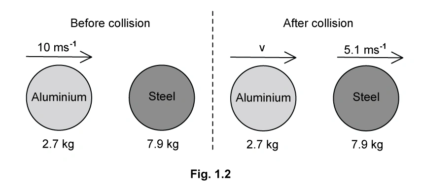{.question-figure fig-alt="Original aluminium-steel collision diagram extracted from the PDF"}

**(d)** Verify that the collision in (c) is elastic. `[3 marks]`

Show mark scheme / model answer

**(a)**

- Momentum conservation: $0.140v=0.620(0.8)$. `[2]`
- $v=3.54\ \mathrm{m\,s^{-1}}\approx3.5\ \mathrm{m\,s^{-1}}$. `[1]`

**(b)**

- Initial kinetic energy $=0.86\ \mathrm{J}$. `[1]`
- Final kinetic energy $=0.20\ \mathrm{J}$. `[1]`
- Kinetic energy decreases, so the collision is inelastic and energy is transferred to heat/sound. `[2]`

**(c)**

- $2.7(10.0)=2.7v+7.9(5.1)$. `[2]`
- $v=-4.9\ \mathrm{m\,s^{-1}}$; the negative sign means the aluminium sphere reverses direction. `[1]`

**(d)**

- Total KE before $=135\ \mathrm{J}$. `[1]`
- Total KE after $\approx135\ \mathrm{J}$. `[1]`
- Since kinetic energy is conserved, the collision is elastic. `[1]`

:::

::: {.question-card}
### Example 11 · Two identical colliding blocks · 3.2 SQ Medium Q2

Two identical $400\ \mathrm{g}$ blocks approach each other at $0.36\ \mathrm{m\,s^{-1}}$. They reverse direction at equal speeds; $33\%$ of their kinetic energy is transferred to the surroundings.

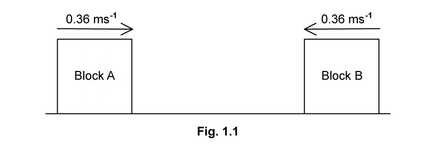{.question-figure fig-alt="Original identical-block collision diagram extracted from the PDF"}

**(a)** State the total initial momentum and whether the collision is elastic. `[3 marks]`

**(b)** Calculate the final speed of the blocks. `[3 marks]`

**(c)** Contact lasts $750\ \mathrm{ms}$. Determine the average force exerted by one block on the other. `[3 marks]`

**(d)** The blocks instead approach at $0.6$ and $0.4\ \mathrm{m\,s^{-1}}$ and stick together. Determine their combined speed and direction. `[4 marks]`

Show mark scheme / model answer

**(a)**

- Initial total momentum is zero because the equal momenta are opposite. `[1]`
- The collision is inelastic because $33\%$ of kinetic energy is transferred to the surroundings. `[2]`

**(b)**

- The source uses $66\%$ of the initial kinetic energy remaining. `[1]`
- $v=0.36\sqrt{0.66}=0.292\ \mathrm{m\,s^{-1}}\approx0.29\ \mathrm{m\,s^{-1}}$. `[2]`

**(c)**

- For one block, $\Delta v=0.36-(-0.29)=0.65\ \mathrm{m\,s^{-1}}$. `[1]`
- $F=m\Delta v/\Delta t=0.4(0.65)/0.750=0.35\ \mathrm{N}$. `[2]`

**(d)**

- Momentum conservation for equal masses gives $v=(0.6-0.4)/2$. `[2]`
- $v=0.10\ \mathrm{m\,s^{-1}}$ in A's initial direction. `[2]`

:::

#### Hard · 4 questions

::: {.question-card}
### Example 12 · Apparent weight during a lift journey · 3.1 SQ Hard Q1

A person stands on scales in a lift. The scales read $700\ \mathrm{N}$ while stationary. The lift accelerates upward, moves at constant speed, then decelerates to rest. Acceleration magnitude is $0.7\ \mathrm{m\,s^{-2}}$ and total height is $24\ \mathrm{m}$.

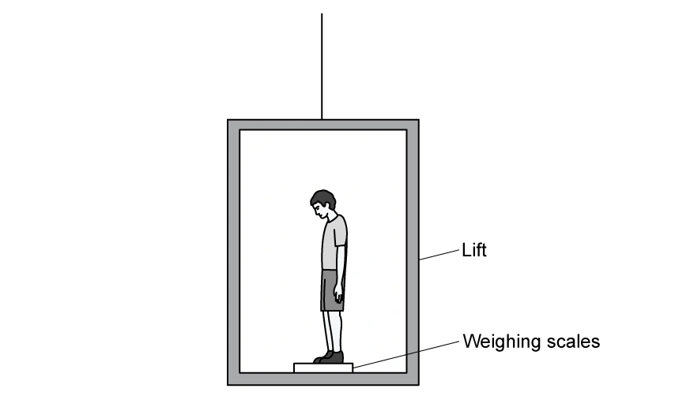{.question-figure fig-alt="Original person in lift diagram extracted from the PDF"}

**(a)** Draw free-body diagrams and derive expressions for apparent weight during acceleration and deceleration. `[4 marks]`

**(b)** Determine the scale readings during acceleration and deceleration. `[3 marks]`

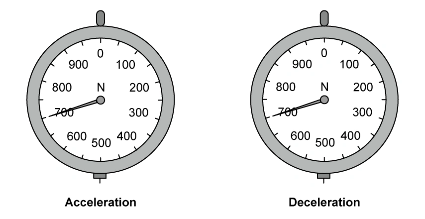{.question-figure fig-alt="Original weighing-scale dials extracted from the PDF"}

**(c)** Use the acceleration-time journey information to determine the journey time. `[2 marks]`

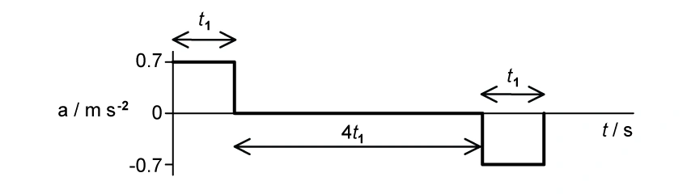{.question-figure fig-alt="Original lift acceleration-time graph extracted from the PDF"}

**(d)** Sketch apparent weight against time, including values. `[3 marks]`

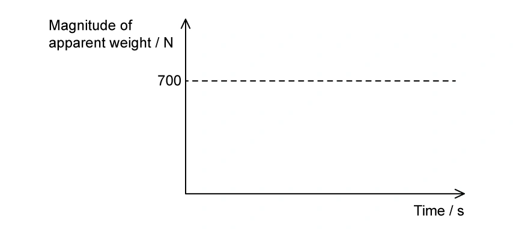{.question-figure fig-alt="Original apparent-weight-time axes extracted from the PDF"}

Show mark scheme / model answer

**(a)**

- During upward acceleration: $R-mg=ma$, so $R=mg+ma$. `[2]`
- During upward deceleration: $mg-R=ma$, so $R=mg-ma$. `[2]`

**(b)**

- Person's mass $=700/9.81\ \mathrm{kg}$ and $ma\approx50\ \mathrm{N}$. `[1]`
- Acceleration reading $=700+50=750\ \mathrm{N}$. `[1]`
- Deceleration reading $=700-50=650\ \mathrm{N}$. `[1]`

**(c)**

- Distance equation: $4.2t_1^2=24$. `[1]`
- $t_1=2.4\ \mathrm{s}$; complete journey time $=6t_1=14.4\ \mathrm{s}$. `[1]`

**(d)**

- $750\ \mathrm{N}$ for the first $2.4\ \mathrm{s}$. `[1]`
- $700\ \mathrm{N}$ for the next $9.6\ \mathrm{s}$. `[1]`
- $650\ \mathrm{N}$ for the final $2.4\ \mathrm{s}$. `[1]`

:::

::: {.question-card}
### Example 13 · Rock-climbing rope · 3.1 SQ Hard Q3

An $80\ \mathrm{kg}$ climber falls after attaching a bolt. At the lowest point, rope length is $24\ \mathrm{m}$; unstretched length is $19\ \mathrm{m}$ and stiffness is $560\ \mathrm{N\,m^{-1}}$. Air resistance and rope mass are negligible.

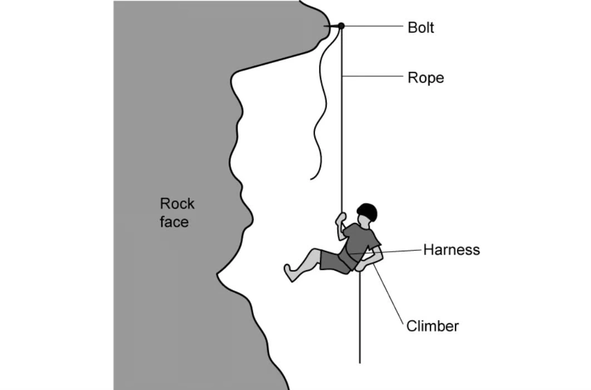{.question-figure fig-alt="Original rock-climber and rope diagram extracted from the PDF"}

**(a)** Calculate (i) the resultant force at the lowest point and (ii) rope extension when acceleration is zero. `[5 marks]`

**(b)** Calculate maximum speed before the rope begins to stretch and discuss whether a longer rope reduces force. `[4 marks]`

**(c)** An $80\ \mathrm{kg}$ test mass gives return times $0.664\ \mathrm{s}$ for nylon and $0.035\ \mathrm{s}$ for hemp. Show the average resultant force for hemp is about 20 times larger. `[3 marks]`

**(d)** Explain using force and momentum why nylon is preferred. `[4 marks]`

Show mark scheme / model answer

**(a)**

- Maximum extension $=24-19=5.0\ \mathrm{m}$, so tension $=kx=560(5)=2800\ \mathrm{N}$. `[2]`
- Resultant upward force $=2800-80(9.81)=2015\ \mathrm{N}\approx2020\ \mathrm{N}$. `[1]`
- At zero acceleration, $kx=mg$, giving $x=80(9.81)/560\approx1.4\ \mathrm{m}$. `[2]`

**(b)**

- Before stretching, the climber falls through $19\ \mathrm{m}$. `[1]`
- $v=\sqrt{2g(19)}=19.3\ \mathrm{m\,s^{-1}}$. `[1]`
- A longer rope gives a longer fall and greater speed before stretching, so the stopping force is greater, not lower. `[2]`

**(c)**

- Nylon: $F=80(19.3)/0.664\approx2325\ \mathrm{N}$. `[1]`
- Hemp: $F=80(19.3)/0.035\approx44\,114\ \mathrm{N}$. `[1]`
- Ratio $=44\,114/2325=18.97\approx20$. `[1]`

**(d)**

- Both ropes produce the same momentum change. `[1]`
- Nylon increases the stopping time. `[1]`
- Since $F=\Delta p/\Delta t$, the average force and injury risk are reduced. `[2]`

:::

::: {.question-card}
### Example 14 · Asteroid collisions · 3.2 SQ Medium Q3

Asteroid A has velocity $3.61\ \mathrm{km\,s^{-1}}$ and momentum $2.00\times10^{17}\ \mathrm{kg\,m\,s^{-1}}$. Faster asteroid B becomes embedded in A. B has mass $6.40\times10^{12}\ \mathrm{kg}$ and velocity $14.0\ \mathrm{km\,s^{-1}}$.

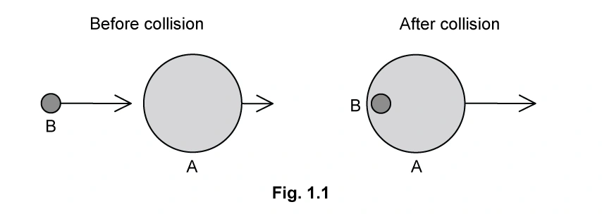{.question-figure fig-alt="Original first asteroid collision diagram extracted from the PDF"}

**(a)** State momentum conservation and show the mass of A is about $5.5\times10^{13}\ \mathrm{kg}$. `[4 marks]`

**(b)** Calculate the combined velocity after collision. `[3 marks]`

**(c)** The combined asteroid later collides with stationary asteroid C and the two outgoing asteroids are deflected in different directions. Resolve momentum to show C's mass is about $1.0\times10^{13}\ \mathrm{kg}$. `[4 marks]`

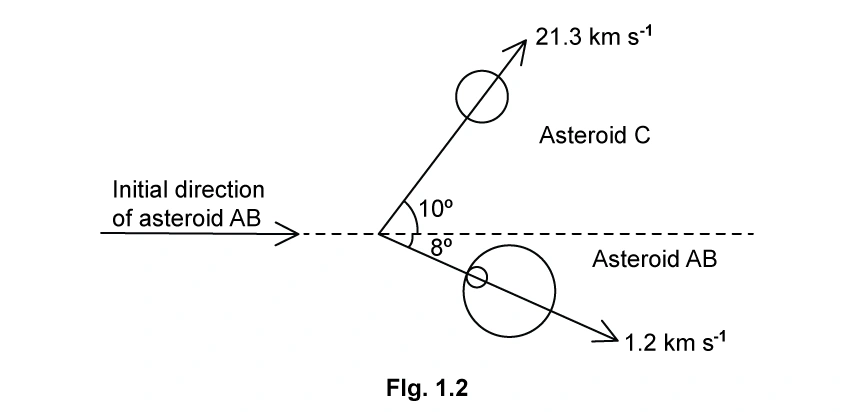{.question-figure fig-alt="Original deflected asteroid collision diagram extracted from the PDF"}

**(d)** Determine whether the second collision is elastic. `[3 marks]`

Show mark scheme / model answer

**(a)**

- Total momentum remains constant provided no resultant external force acts. `[2]`
- $m_A=p/v=(2.00\times10^{17})/(3.61\times10^3)=5.54\times10^{13}\ \mathrm{kg}$. `[2]`

**(b)**

- Apply momentum conservation:
  $$v=\frac{2.00\times10^{17}+(6.40\times10^{12})(14.0\times10^3)}{5.54\times10^{13}+6.40\times10^{12}}.$$
- $v=4.69\ \mathrm{km\,s^{-1}}$. `[3]`

**(c)**

- Resolve the final momenta horizontally. `[1]`
- Equate total horizontal momentum before and after. `[2]`
- $m_C=1.031\times10^{13}\ \mathrm{kg}$. `[1]`

**(d)**

- Initial kinetic energy $\approx6.8\times10^{20}\ \mathrm{J}$. `[1]`
- Final kinetic energy $\approx2.4\times10^{21}\ \mathrm{J}$. `[1]`
- Kinetic energy is not conserved, so the collision is inelastic. `[1]`

:::

::: {.question-card}
### Example 15 · Rifle recoil and stopping force · 3.2 SQ Medium Q5

A shell of mass $30\ \mathrm{g}$ is fired from a rifle of mass $1.9\ \mathrm{kg}$. Immediately after firing, the shell has momentum $36\ \mathrm{kg\,m\,s^{-1}}$.

**(a)** State the total momentum before firing and give a reason. `[2 marks]`

**(b)** Calculate the shell velocity just after firing. `[2 marks]`

**(c)** Determine total momentum after firing and the recoil momentum of the rifle. `[3 marks]`

**(d)** The shell momentum is $9.8\ \mathrm{kg\,m\,s^{-1}}$ before hitting a target and it stops in $4.5\ \mathrm{ms}$. Calculate the average stopping force. `[3 marks]`

Show mark scheme / model answer

**(a)**

- Initial total momentum is zero because rifle and shell are both at rest. `[2]`

**(b)**

- Convert $30\ \mathrm{g}$ to $0.030\ \mathrm{kg}$. `[1]`
- $v=p/m=36/0.030=1200\ \mathrm{m\,s^{-1}}$. `[1]`

**(c)**

- Total momentum after firing remains zero. `[1]`
- Rifle and shell momenta are equal and opposite. `[1]`
- Rifle recoil momentum $=-36\ \mathrm{kg\,m\,s^{-1}}$. `[1]`

**(d)**

- $\Delta p=9.8\ \mathrm{kg\,m\,s^{-1}}$ and $\Delta t=4.5\times10^{-3}\ \mathrm{s}$. `[2]`
- $F=\Delta p/\Delta t\approx2.2\times10^3\ \mathrm{N}=2.2\ \mathrm{kN}$. `[1]`

:::
