## Learning objectives

By the end of this chapter, you should be able to draw and interpret free-body diagrams, apply all three Newton's laws, calculate resultant force from the rate of change of momentum, explain terminal velocity, and solve one-dimensional momentum-conservation problems.

::: {.study-card}
### Force, mass and acceleration

$$F=\frac{\Delta p}{\Delta t}=ma$$
$$p=mv$$
$$J=F\Delta t=\Delta p$$

Mass is a measure of inertia: the greater the mass, the more difficult it is to change an object's velocity. Weight is the gravitational force on an object, so $W=mg$. Mass is constant for an object, whereas weight changes if the gravitational field strength changes.

A free-body diagram contains only forces acting **on** the chosen object. Typical forces are weight, normal contact force, tension, friction, drag, upthrust and an applied driving force. Resolve forces into components only after choosing axes, usually parallel and perpendicular to the motion or surface.
:::

::: {.study-card}
### Newton's laws and terminal velocity

- **First law:** an object remains at rest or moves with constant velocity in a straight line unless a resultant external force acts on it.
- **Second law:** the resultant force equals the rate of change of momentum and acts in that direction. For constant mass, $F=ma$.
- **Third law:** when body A exerts a force on body B, body B exerts an equal-magnitude, opposite-direction force of the same type on body A. The two forces act on different objects and must never be cancelled on a single free-body diagram.
- For a falling object, weight is approximately constant. Drag increases as speed increases, so the resultant downward force and acceleration decrease. At terminal velocity, drag equals weight; the resultant force and acceleration are zero, but the velocity is not zero.
:::

::: {.formula-panel}
### Momentum, impulse and conservation

Momentum is a vector quantity, so a sign convention is essential. Impulse is the product of force and contact time, and it equals the change in momentum. On a force-time graph, the area under the graph is impulse.

If a system has no external resultant force:

$$\sum p_{\text{before}}=\sum p_{\text{after}}.$$

In collision and explosion questions, write the momentum of every object before and after the interaction. Use signed velocities in one dimension. Kinetic energy is not necessarily conserved: it is conserved only in an elastic collision.

::: {.study-card}
### Problem-solving checklist

1. Define the system and choose a positive direction.
2. Draw a free-body diagram or list the momenta before and after the event.
3. State the physical principle: $F=ma$, $F=\Delta p/\Delta t$, or momentum conservation.
4. Substitute SI units, keep signs throughout, and check whether the direction and magnitude are physically reasonable.
:::
:::

## Multiple Choice

::: {.question-card .mc-question data-answer="D"}
### Example 1 · 3.1 MC Easy Q1
A cyclist is riding at a steady speed on a level road. According to Newton’s third law of motion, what is equal and opposite to the backward push of the back wheel on the road?
<div class="mc-options"><button class="mc-choice" data-choice="A"><strong>A</strong> the force exerted by the cyclist on the pedals</button><button class="mc-choice" data-choice="B"><strong>B</strong> the total air resistance and friction force</button><button class="mc-choice" data-choice="C"><strong>C</strong> the tension in the cycle chain</button><button class="mc-choice" data-choice="D"><strong>D</strong> the forward push of the road on the back wheel</button></div><button class="check-answer">Check answer</button><p class="mc-feedback"></p>
:::

::: {.question-card .mc-question data-answer="C"}
### Example 2 · 3.1 MC Easy Q2
A resultant force causes a body to accelerate. What is equal to the resultant force?
<div class="mc-options"><button class="mc-choice" data-choice="A"><strong>A</strong> the acceleration of the body per unit mass</button><button class="mc-choice" data-choice="B"><strong>B</strong> the change in kinetic energy of the body per unit time</button><button class="mc-choice" data-choice="C"><strong>C</strong> the change in momentum of the body per unit time</button><button class="mc-choice" data-choice="D"><strong>D</strong> the change in velocity of the body per unit time</button></div><button class="check-answer">Check answer</button><p class="mc-feedback"></p>
:::

::: {.question-card .mc-question data-answer="C"}
### Example 3 · 3.1 MC Easy Q3
What is meant by the mass and by the weight of an object on the Earth?
<div class="mc-options"><button class="mc-choice" data-choice="A"><strong>A</strong> momentum divided by velocity; work done in lifting it one metre</button><button class="mc-choice" data-choice="B"><strong>B</strong> gravitational force on it; property that resists acceleration</button><button class="mc-choice" data-choice="C"><strong>C</strong> property that resists acceleration; pull of the Earth on it</button><button class="mc-choice" data-choice="D"><strong>D</strong> pull of the Earth on it; mass divided by acceleration of free fall</button></div><button class="check-answer">Check answer</button><p class="mc-feedback"></p>
:::

::: {.question-card .mc-question data-answer="A"}
### Example 4 · 3.1 MC Easy Q4
An object travelling with velocity $v$ strikes a wall and rebounds as shown.

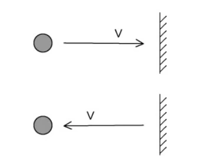{.question-figure fig-alt="Object striking a wall and rebounding"}

Which property of the object is **not** conserved?
<div class="mc-options"><button class="mc-choice" data-choice="A"><strong>A</strong> momentum</button><button class="mc-choice" data-choice="B"><strong>B</strong> mass</button><button class="mc-choice" data-choice="C"><strong>C</strong> kinetic energy</button><button class="mc-choice" data-choice="D"><strong>D</strong> speed</button></div><button class="check-answer">Check answer</button><p class="mc-feedback"></p>
:::

::: {.question-card .mc-question data-answer="D"}
### Example 5 · 3.1 MC Easy Q9
A box rests on a horizontal, rough surface. A string attached to the box passes over a smooth pulley and supports a mass at its other end.

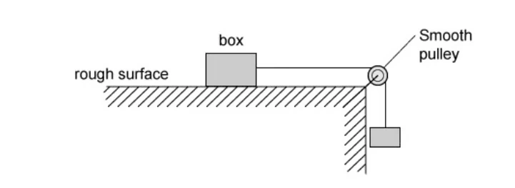{.question-figure fig-alt="Box on a rough surface connected to a hanging mass"}

When the box is released, what forces are acting on it?
<div class="mc-options"><button class="mc-choice" data-choice="A"><strong>A</strong> weight only</button><button class="mc-choice" data-choice="B"><strong>B</strong> friction and weight</button><button class="mc-choice" data-choice="C"><strong>C</strong> friction, weight and reaction</button><button class="mc-choice" data-choice="D"><strong>D</strong> tension, friction, weight and reaction</button></div><button class="check-answer">Check answer</button><p class="mc-feedback"></p>
:::

::: {.question-card .mc-question data-answer="B"}
### Example 6 · 3.1 MC Medium Q1
A car has a horizontal driving force of $2.0\ \mathrm{kN}$ acting on it and a resistive force a quarter of this size. It has a forward horizontal acceleration of $2.0\ \mathrm{m\,s^{-2}}$. What is the mass of the car?
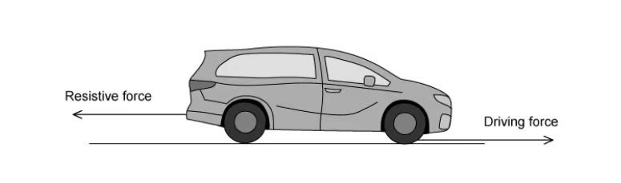{.question-figure fig-alt="Driving and resistive forces on a car"}
<div class="mc-options"><button class="mc-choice" data-choice="A"><strong>A</strong> $500\ \mathrm{kg}$</button><button class="mc-choice" data-choice="B"><strong>B</strong> $750\ \mathrm{kg}$</button><button class="mc-choice" data-choice="C"><strong>C</strong> $1250\ \mathrm{kg}$</button><button class="mc-choice" data-choice="D"><strong>D</strong> $2000\ \mathrm{kg}$</button></div><button class="check-answer">Check answer</button><p class="mc-feedback"></p>
:::

::: {.question-card .mc-question data-answer="D"}
### Example 7 · 3.1 MC Medium Q2
All external forces on a body cancel out. Which statement must be correct?
<div class="mc-options"><button class="mc-choice" data-choice="A"><strong>A</strong> the body does not move</button><button class="mc-choice" data-choice="B"><strong>B</strong> the total energy of the body remains unchanged</button><button class="mc-choice" data-choice="C"><strong>C</strong> the speed of the body remains unchanged</button><button class="mc-choice" data-choice="D"><strong>D</strong> the momentum of the body remains unchanged</button></div><button class="check-answer">Check answer</button><p class="mc-feedback"></p>
:::

::: {.question-card .mc-question data-answer="A"}
### Example 8 · 3.1 MC Medium Q3
A stone of mass $m$ is dropped from a tall building. There is significant air resistance. The acceleration of free fall is $g$. When the stone reaches terminal velocity, which information is correct?
<div class="mc-options"><button class="mc-choice" data-choice="A"><strong>A</strong> acceleration $0$; gravity $mg$; air resistance $mg$</button><button class="mc-choice" data-choice="B"><strong>B</strong> acceleration $g$; gravity $mg$; air resistance $mg$</button><button class="mc-choice" data-choice="C"><strong>C</strong> acceleration $g$; gravity $0$; air resistance $0$</button><button class="mc-choice" data-choice="D"><strong>D</strong> acceleration $0$; gravity $0$; air resistance $0$</button></div><button class="check-answer">Check answer</button><p class="mc-feedback"></p>
:::

::: {.question-card .mc-question data-answer="C"}
### Example 9 · 3.1 MC Medium Q5
A wooden block rests on a rough board. The end of the board is then raised until the block slides down the plane at constant velocity $v$. Which row describes the forces acting on the block?
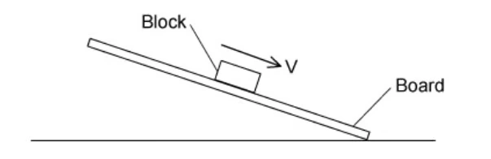{.question-figure fig-alt="Block sliding down a rough inclined board"}
<div class="mc-options"><button class="mc-choice" data-choice="A"><strong>A</strong> friction down the plane; resultant force zero</button><button class="mc-choice" data-choice="B"><strong>B</strong> friction down the plane; resultant force down the plane</button><button class="mc-choice" data-choice="C"><strong>C</strong> friction up the plane; resultant force zero</button><button class="mc-choice" data-choice="D"><strong>D</strong> friction up the plane; resultant force down the plane</button></div><button class="check-answer">Check answer</button><p class="mc-feedback"></p>
:::

::: {.question-card .mc-question data-answer="C"}
### Example 10 · 3.1 MC Medium Q7
A block of mass $1.20\ \mathrm{kg}$ is on a rough horizontal surface. A force of $12\ \mathrm{N}$ is applied to the block and it accelerates at $4.0\ \mathrm{m\,s^{-2}}$. What is the magnitude of the frictional force acting on the block?
{.question-figure fig-alt="Block accelerating on a rough horizontal surface"}
<div class="mc-options"><button class="mc-choice" data-choice="A"><strong>A</strong> $2.4\ \mathrm{N}$</button><button class="mc-choice" data-choice="B"><strong>B</strong> $3.6\ \mathrm{N}$</button><button class="mc-choice" data-choice="C"><strong>C</strong> $7.2\ \mathrm{N}$</button><button class="mc-choice" data-choice="D"><strong>D</strong> $16.8\ \mathrm{N}$</button></div><button class="check-answer">Check answer</button><p class="mc-feedback"></p>
:::

::: {.question-card .mc-question data-answer="D"}
### Example 11 · 3.2 MC Easy Q1
What is the principle of conservation of momentum?
<div class="mc-options"><button class="mc-choice" data-choice="A"><strong>A</strong> force is equal to the rate of change of momentum</button><button class="mc-choice" data-choice="B"><strong>B</strong> momentum is the product of mass and velocity</button><button class="mc-choice" data-choice="C"><strong>C</strong> total momentum after a collision always equals total momentum before it</button><button class="mc-choice" data-choice="D"><strong>D</strong> total momentum of a system remains constant provided no external force acts</button></div><button class="check-answer">Check answer</button><p class="mc-feedback"></p>
:::

::: {.question-card .mc-question data-answer="B"}
### Example 12 · 3.1 MC Hard Q1
A box of mass $10.0\ \mathrm{kg}$ rests on a horizontal rough surface. A string attached to the box passes over a smooth pulley and supports a $4.0\ \mathrm{kg}$ mass at its other end. When the box is released, a frictional force of $12.0\ \mathrm{N}$ acts on it.

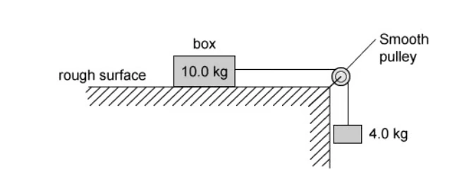{.question-figure fig-alt="Rough-surface box and hanging mass system"}

What is the acceleration of the box?
<div class="mc-options"><button class="mc-choice" data-choice="A"><strong>A</strong> $1.2\ \mathrm{m\,s^{-2}}$</button><button class="mc-choice" data-choice="B"><strong>B</strong> $1.9\ \mathrm{m\,s^{-2}}$</button><button class="mc-choice" data-choice="C"><strong>C</strong> $2.7\ \mathrm{m\,s^{-2}}$</button><button class="mc-choice" data-choice="D"><strong>D</strong> $3.0\ \mathrm{m\,s^{-2}}$</button></div><button class="check-answer">Check answer</button><p class="mc-feedback"></p>
:::

::: {.question-card .mc-question data-answer="C"}
### Example 13 · 3.2 MC Easy Q4
Which row correctly states whether momentum and kinetic energy are conserved in an inelastic collision with no external forces?
<div class="mc-options"><button class="mc-choice" data-choice="A"><strong>A</strong> both conserved</button><button class="mc-choice" data-choice="B"><strong>B</strong> momentum not conserved; kinetic energy conserved</button><button class="mc-choice" data-choice="C"><strong>C</strong> momentum conserved; kinetic energy not conserved</button><button class="mc-choice" data-choice="D"><strong>D</strong> neither conserved</button></div><button class="check-answer">Check answer</button><p class="mc-feedback"></p>
:::

::: {.question-card .mc-question data-answer="A"}
### Example 14 · 3.2 MC Easy Q5
Which quantity has the same base units as momentum?
<div class="mc-options"><button class="mc-choice" data-choice="A"><strong>A</strong> density × volume × velocity</button><button class="mc-choice" data-choice="B"><strong>B</strong> density × energy</button><button class="mc-choice" data-choice="C"><strong>C</strong> pressure × area</button><button class="mc-choice" data-choice="D"><strong>D</strong> weight ÷ area</button></div><button class="check-answer">Check answer</button><p class="mc-feedback"></p>
:::

::: {.question-card .mc-question data-answer="A"}
### Example 15 · 3.1 MC Hard Q2
A lift consists of a passenger car supported by a cable which runs over a light, frictionless pulley to a balancing weight. The balancing weight falls as the passenger car rises. The passenger car, balancing weight and passenger have masses $1200\ \mathrm{kg}$, $1320\ \mathrm{kg}$ and $80\ \mathrm{kg}$ respectively.

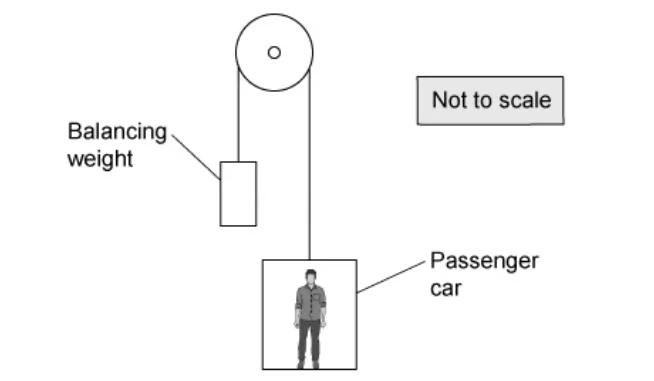{.question-figure fig-alt="Passenger lift and balancing weight"}

What is the magnitude of the acceleration of the car when carrying just one passenger and when the pulley is free to rotate?
<div class="mc-options"><button class="mc-choice" data-choice="A"><strong>A</strong> $0.15\ \mathrm{m\,s^{-2}}$</button><button class="mc-choice" data-choice="B"><strong>B</strong> $0.30\ \mathrm{m\,s^{-2}}$</button><button class="mc-choice" data-choice="C"><strong>C</strong> $0.45\ \mathrm{m\,s^{-2}}$</button><button class="mc-choice" data-choice="D"><strong>D</strong> $0.92\ \mathrm{m\,s^{-2}}$</button></div><button class="check-answer">Check answer</button><p class="mc-feedback"></p>
:::

::: {.question-card .mc-question data-answer="B"}
### Example 16 · 3.2 MC Easy Q7
Two similar spheres, each of mass $m$ and speed $v$, move towards each other and have a head-on elastic collision. Which statement is correct?
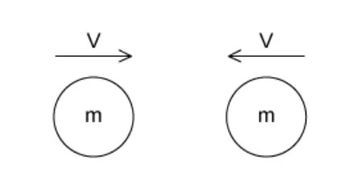{.question-figure fig-alt="Two equal spheres approaching head-on"}
<div class="mc-options"><button class="mc-choice" data-choice="A"><strong>A</strong> spheres stick together</button><button class="mc-choice" data-choice="B"><strong>B</strong> total kinetic energy after impact is $mv^2$</button><button class="mc-choice" data-choice="C"><strong>C</strong> total kinetic energy before impact is zero</button><button class="mc-choice" data-choice="D"><strong>D</strong> total momentum before impact is $2mv$</button></div><button class="check-answer">Check answer</button><p class="mc-feedback"></p>
:::

::: {.question-card .mc-question data-answer="D"}
### Example 17 · 3.2 MC Easy Q8
Trolley X collides with stationary trolley Y on a frictionless track. They become attached and move off together. Which statement is correct?
<div class="mc-options"><button class="mc-choice" data-choice="A"><strong>A</strong> kinetic energy changes to momentum</button><button class="mc-choice" data-choice="B"><strong>B</strong> momentum changes to kinetic energy</button><button class="mc-choice" data-choice="C"><strong>C</strong> momentum is lost as heat</button><button class="mc-choice" data-choice="D"><strong>D</strong> X shares momentum with Y but some kinetic energy is lost</button></div><button class="check-answer">Check answer</button><p class="mc-feedback"></p>
:::

::: {.question-card .mc-question data-answer="B"}
### Example 18 · 3.2 MC Easy Q9
A car accelerates from rest. The graph shows the momentum of the car plotted against time.

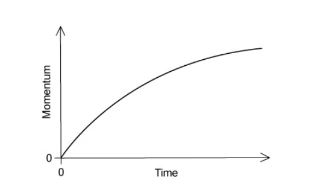{.question-figure fig-alt="Curved momentum-time graph for an accelerating car"}

What is the meaning of the gradient of the graph at a particular time?
<div class="mc-options"><button class="mc-choice" data-choice="A"><strong>A</strong> the velocity of the car</button><button class="mc-choice" data-choice="B"><strong>B</strong> the resultant force on the car</button><button class="mc-choice" data-choice="C"><strong>C</strong> the kinetic energy of the car</button><button class="mc-choice" data-choice="D"><strong>D</strong> the rate of change of kinetic energy of the car</button></div><button class="check-answer">Check answer</button><p class="mc-feedback"></p>
:::

::: {.question-card .mc-question data-answer="C"}
### Example 19 · 3.2 MC Medium Q2
Two spheres approach each other along the same straight line with speeds $u_1$ and $u_2$. After a perfectly elastic collision their speeds are $v_1$ and $v_2$ in the opposite separating directions. Which equation is correct?
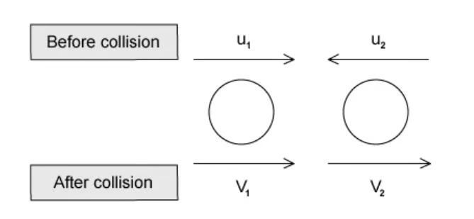{.question-figure fig-alt="Two spheres before and after a head-on collision"}
<div class="mc-options"><button class="mc-choice" data-choice="A"><strong>A</strong> $u_1-u_2=v_2+v_1$</button><button class="mc-choice" data-choice="B"><strong>B</strong> $u_1-u_2=v_2-v_1$</button><button class="mc-choice" data-choice="C"><strong>C</strong> $u_1+u_2=v_2-v_1$</button><button class="mc-choice" data-choice="D"><strong>D</strong> $u_1+u_2=v_2+v_1$</button></div><button class="check-answer">Check answer</button><p class="mc-feedback"></p>
:::

::: {.question-card .mc-question data-answer="B"}
### Example 20 · 3.2 MC Medium Q3
A lorry of mass $18$ tonnes travels at $25.0\ \mathrm{m\,s^{-1}}$. A car of mass $800\ \mathrm{kg}$ travels at $40.0\ \mathrm{m\,s^{-1}}$ towards the lorry. What is the magnitude of the total momentum?
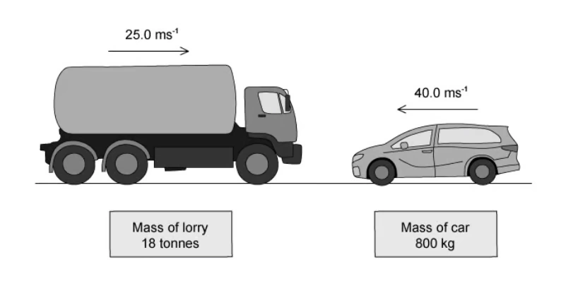{.question-figure fig-alt="Lorry and car travelling towards each other"}
<div class="mc-options"><button class="mc-choice" data-choice="A"><strong>A</strong> $282\ \mathrm{kN\,s}$</button><button class="mc-choice" data-choice="B"><strong>B</strong> $418\ \mathrm{kN\,s}$</button><button class="mc-choice" data-choice="C"><strong>C</strong> $482\ \mathrm{kN\,s}$</button><button class="mc-choice" data-choice="D"><strong>D</strong> $1222\ \mathrm{kN\,s}$</button></div><button class="check-answer">Check answer</button><p class="mc-feedback"></p>
:::

::: {.question-card .mc-question data-answer="C"}
### Example 21 · 3.2 MC Medium Q5
A cannon of mass $1600\ \mathrm{kg}$ fires a cannon ball of mass $20\ \mathrm{kg}$. The recoil velocity of the cannon is $5\ \mathrm{m\,s^{-1}}$ horizontally. What is the horizontal velocity of the cannon ball?
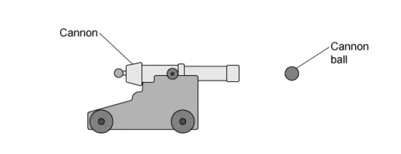{.question-figure fig-alt="Cannon recoiling after firing a cannon ball"}
<div class="mc-options"><button class="mc-choice" data-choice="A"><strong>A</strong> $100\ \mathrm{m\,s^{-1}}$</button><button class="mc-choice" data-choice="B"><strong>B</strong> $320\ \mathrm{m\,s^{-1}}$</button><button class="mc-choice" data-choice="C"><strong>C</strong> $400\ \mathrm{m\,s^{-1}}$</button><button class="mc-choice" data-choice="D"><strong>D</strong> $8000\ \mathrm{m\,s^{-1}}$</button></div><button class="check-answer">Check answer</button><p class="mc-feedback"></p>
:::

::: {.question-card .mc-question data-answer="D"}
### Example 22 · 3.2 MC Medium Q7
A molecule of mass $m$ travelling at speed $v$ hits a wall perpendicularly. The collision is elastic. What are the changes in momentum and kinetic energy?
<div class="mc-options"><button class="mc-choice" data-choice="A"><strong>A</strong> $0$, $0$</button><button class="mc-choice" data-choice="B"><strong>B</strong> $mv$, $mv^2$</button><button class="mc-choice" data-choice="C"><strong>C</strong> $mv^2$, $0$</button><button class="mc-choice" data-choice="D"><strong>D</strong> $2mv$, $0$</button></div><button class="check-answer">Check answer</button><p class="mc-feedback"></p>
:::

::: {.question-card .mc-question data-answer="A"}
### Example 23 · 3.2 MC Medium Q8
A moving object strikes a stationary object in an inelastic collision and the objects move off together. Which values are possible for total momentum and total kinetic energy before and after?
<div class="mc-options"><button class="mc-choice" data-choice="A"><strong>A</strong> momentum $6\to6$; kinetic energy $90\to30$</button><button class="mc-choice" data-choice="B"><strong>B</strong> momentum $6\to6$; kinetic energy $30\to90$</button><button class="mc-choice" data-choice="C"><strong>C</strong> momentum $6\to2$; kinetic energy $90\to30$</button><button class="mc-choice" data-choice="D"><strong>D</strong> momentum $6\to6$; kinetic energy $90\to90$</button></div><button class="check-answer">Check answer</button><p class="mc-feedback"></p>
:::

::: {.question-card .mc-question data-answer="D"}
### Example 24 · 3.2 MC Medium Q10
Two train carriages, each of mass $7500\ \mathrm{kg}$, travel towards each other at $3.00\ \mathrm{m\,s^{-1}}$ and $1.50\ \mathrm{m\,s^{-1}}$. They collide and join together. What kinetic energy is lost?
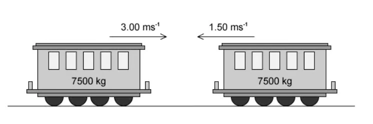{.question-figure fig-alt="Two train carriages travelling towards each other"}
<div class="mc-options"><button class="mc-choice" data-choice="A"><strong>A</strong> $4200\ \mathrm{J}$</button><button class="mc-choice" data-choice="B"><strong>B</strong> $7500\ \mathrm{J}$</button><button class="mc-choice" data-choice="C"><strong>C</strong> $11250\ \mathrm{J}$</button><button class="mc-choice" data-choice="D"><strong>D</strong> $38000\ \mathrm{J}$</button></div><button class="check-answer">Check answer</button><p class="mc-feedback"></p>
:::

::: {.question-card .mc-question data-answer="C"}
### Example 25 · 3.2 MC Hard Q1
A $10.0\ \mathrm{g}$ bullet is fired vertically upwards at $200\ \mathrm{m\,s^{-1}}$ into a stationary $150\ \mathrm{g}$ wooden block supported $4.0\ \mathrm{m}$ above the ground. The bullet embeds in the block. How far above the ground is the block at maximum height?
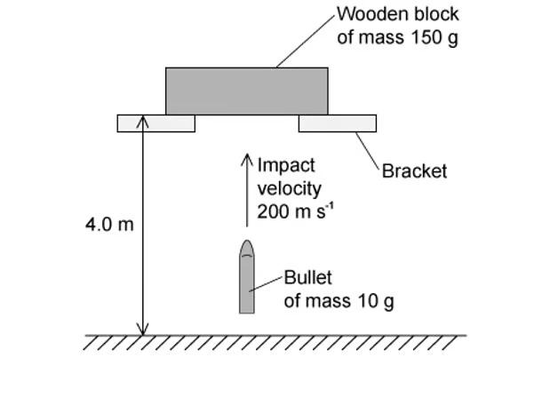{.question-figure fig-alt="Bullet fired upward into a wooden block"}
<div class="mc-options"><button class="mc-choice" data-choice="A"><strong>A</strong> $8.0\ \mathrm{m}$</button><button class="mc-choice" data-choice="B"><strong>B</strong> $10.0\ \mathrm{m}$</button><button class="mc-choice" data-choice="C"><strong>C</strong> $12.0\ \mathrm{m}$</button><button class="mc-choice" data-choice="D"><strong>D</strong> $14.0\ \mathrm{m}$</button></div><button class="check-answer">Check answer</button><p class="mc-feedback"></p>
:::

::: {.question-card .mc-question data-answer="C"}
### Example 26 · 3.2 MC Hard Q2
Two railway trucks of masses $m$ and $5m$ move towards each other with speeds $3u$ and $u$ respectively. They collide and stick together. What is their speed after the collision?
<div class="mc-options"><button class="mc-choice" data-choice="A"><strong>A</strong> $u$</button><button class="mc-choice" data-choice="B"><strong>B</strong> $u/2$</button><button class="mc-choice" data-choice="C"><strong>C</strong> $u/3$</button><button class="mc-choice" data-choice="D"><strong>D</strong> $u/6$</button></div><button class="check-answer">Check answer</button><p class="mc-feedback"></p>
:::

::: {.question-card .mc-question data-answer="A"}
### Example 27 · 3.2 MC Hard Q3
Sand falls vertically onto a conveyor belt at a rate of $m\ \mathrm{kg\,s^{-1}}$. What horizontal force is required to keep the belt moving at constant speed $v$?
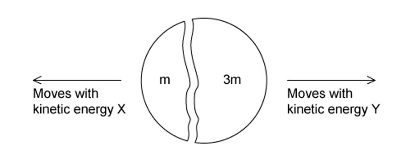{.question-figure fig-alt="Sand falling onto a moving conveyor belt"}
<div class="mc-options"><button class="mc-choice" data-choice="A"><strong>A</strong> $mv$</button><button class="mc-choice" data-choice="B"><strong>B</strong> $\frac12mv$</button><button class="mc-choice" data-choice="C"><strong>C</strong> $mv^2$</button><button class="mc-choice" data-choice="D"><strong>D</strong> $\frac12mv^2$</button></div><button class="check-answer">Check answer</button><p class="mc-feedback"></p>
:::

::: {.question-card .mc-question data-answer="B"}
### Example 28 · 3.2 MC Hard Q6
A stationary nucleus has nucleon number $A$. It emits a proton with speed $v$ and forms a new nucleus with speed $u$ in the opposite direction. Which equation gives $v$?
<div class="mc-options"><button class="mc-choice" data-choice="A"><strong>A</strong> $v=(A-2)u$</button><button class="mc-choice" data-choice="B"><strong>B</strong> $v=(A-1)u$</button><button class="mc-choice" data-choice="C"><strong>C</strong> $v=Au$</button><button class="mc-choice" data-choice="D"><strong>D</strong> $v=(A+1)u$</button></div><button class="check-answer">Check answer</button><p class="mc-feedback"></p>
:::

::: {.question-card .mc-question data-answer="A"}
### Example 29 · 3.2 MC Hard Q7
Particle X with speed $v$ collides perfectly elastically with a stationary identical particle Y. What happens after the collision?
<div class="mc-options"><button class="mc-choice" data-choice="A"><strong>A</strong> X is stationary; Y moves right at $v$</button><button class="mc-choice" data-choice="B"><strong>B</strong> both move right at $v/2$</button><button class="mc-choice" data-choice="C"><strong>C</strong> X moves left at $v/2$; Y moves right at $v/2$</button><button class="mc-choice" data-choice="D"><strong>D</strong> X moves left at $v$; Y is stationary</button></div><button class="check-answer">Check answer</button><p class="mc-feedback"></p>
:::

::: {.question-card .mc-question data-answer="A"}
### Example 30 · 3.2 MC Hard Q10
A body initially at rest explodes into masses $M_1$ and $M_2$ moving apart with speeds $v_1$ and $v_2$. What is $v_1/v_2$?
<div class="mc-options"><button class="mc-choice" data-choice="A"><strong>A</strong> $M_2/M_1$</button><button class="mc-choice" data-choice="B"><strong>B</strong> $M_1/M_2$</button><button class="mc-choice" data-choice="C"><strong>C</strong> $\sqrt{M_2/M_1}$</button><button class="mc-choice" data-choice="D"><strong>D</strong> $\sqrt{M_1/M_2}$</button></div><button class="check-answer">Check answer</button><p class="mc-feedback"></p>
:::

```{=html}
<script>
(() => {
  const explanations = [
    ['D', '<li>Newton\'s third-law forces act on different bodies.</li><li>The wheel pushes the road backwards, so the road pushes the wheel forwards with equal magnitude.</li>'],
    ['C', '<li>Newton\'s second law gives <em>F</em> = d<em>p</em>/d<em>t</em>.</li><li>The resultant force is therefore the change in momentum per unit time.</li>'],
    ['C', '<li>Mass measures inertia: the resistance of an object to acceleration.</li><li>Weight is the gravitational pull of the Earth on the object.</li>'],
    ['A', '<li>Momentum is a vector, so reversing direction changes the momentum.</li><li>The speed, mass and hence kinetic energy remain unchanged in the diagram.</li>'],
    ['D', '<li>The box has weight downward and a normal reaction upward.</li><li>The string exerts tension to the right and the rough surface exerts friction to the left.</li>'],
    ['B', '<li>Resistive force = 0.25 × 2000 = 500 N.</li><li>Resultant force = 2000 − 500 = 1500 N.</li><li><em>m</em> = <em>F</em>/<em>a</em> = 1500/2.0 = 750 kg.</li>'],
    ['D', '<li>When the resultant external force is zero, d<em>p</em>/d<em>t</em> = 0.</li><li>The momentum must remain unchanged; the body may still be moving.</li>'],
    ['A', '<li>At terminal velocity the resultant force and acceleration are zero.</li><li>Weight remains <em>mg</em> and is balanced by an equal air-resistance force.</li>'],
    ['C', '<li>Friction opposes the downward motion, so it acts up the plane.</li><li>Constant velocity means zero acceleration and therefore zero resultant force.</li>'],
    ['C', '<li>Required resultant force = <em>ma</em> = 1.20 × 4.0 = 4.8 N.</li><li>12 − friction = 4.8, so friction = 7.2 N.</li>'],
    ['D', '<li>Total momentum remains constant only for an isolated system with no resultant external force.</li><li>Option C is incomplete because it omits this condition.</li>'],
    ['B', '<li>Driving force on the whole 14.0 kg system is 4.0<em>g</em> − 12.0 = 27.2 N.</li><li><em>a</em> = 27.2/14.0 = 1.94 m s<sup>−2</sup> ≈ 1.9 m s<sup>−2</sup>.</li>'],
    ['C', '<li>With no external forces, momentum is conserved in both elastic and inelastic collisions.</li><li>An inelastic collision does not conserve kinetic energy.</li>'],
    ['A', '<li>Density × volume gives mass.</li><li>Mass × velocity has units kg m s<sup>−1</sup>, the units of momentum.</li>'],
    ['A', '<li>Passenger side mass = 1200 + 80 = 1280 kg; counterweight mass = 1320 kg.</li><li><em>a</em> = (1320 − 1280)<em>g</em>/(1320 + 1280) = 0.151 m s<sup>−2</sup>.</li>'],
    ['B', '<li>For an elastic collision, total kinetic energy is conserved.</li><li>Initially, total kinetic energy = 2(½<em>mv</em><sup>2</sup>) = <em>mv</em><sup>2</sup>, so the same value remains after impact.</li>'],
    ['D', '<li>Total momentum of the isolated trolley system is conserved.</li><li>Because the trolleys stick together, the collision is inelastic and some kinetic energy is transferred to other forms.</li>'],
    ['B', '<li>The gradient of a momentum-time graph is d<em>p</em>/d<em>t</em>.</li><li>By Newton\'s second law, this gradient equals the resultant force.</li>'],
    ['C', '<li>For a perfectly elastic head-on collision, relative speed of approach equals relative speed of separation.</li><li>Approach speed = <em>u</em><sub>1</sub> + <em>u</em><sub>2</sub>; separation speed = <em>v</em><sub>2</sub> − <em>v</em><sub>1</sub>.</li>'],
    ['B', '<li>Take the lorry direction as positive.</li><li>Total momentum = 18 000(25.0) − 800(40.0) = 418 000 kg m s<sup>−1</sup> = 418 kN s.</li>'],
    ['C', '<li>Initial momentum is zero, so cannon and cannon-ball momenta are equal and opposite.</li><li>20<em>v</em> = 1600(5), giving <em>v</em> = 400 m s<sup>−1</sup>.</li>'],
    ['D', '<li>The molecule reverses direction at the same speed, so the magnitude of its momentum change is 2<em>mv</em>.</li><li>The collision is elastic, so the kinetic-energy change is zero.</li>'],
    ['A', '<li>Momentum must have the same value before and after the collision.</li><li>In an inelastic collision kinetic energy decreases, so 90 → 30 is possible.</li>'],
    ['D', '<li>Momentum conservation gives the joined speed as (3.00 − 1.50)/2 = 0.75 m s<sup>−1</sup>.</li><li>Initial KE = 42 187.5 J and final KE = 4218.75 J.</li><li>Energy lost ≈ 38 000 J.</li>'],
    ['C', '<li>Momentum conservation gives the embedded block-and-bullet speed: <em>v</em> = 0.010(200)/0.160 = 12.5 m s<sup>−1</sup>.</li><li>Additional rise = <em>v</em><sup>2</sup>/(2<em>g</em>) ≈ 8.0 m.</li><li>Maximum height above ground = 4.0 + 8.0 = 12.0 m.</li>'],
    ['C', '<li>Taking the <em>m</em> truck direction as positive, total momentum = 3<em>mu</em> − 5<em>mu</em> = −2<em>mu</em>.</li><li>Joined mass = 6<em>m</em>, so speed = |−2<em>mu</em>|/(6<em>m</em>) = <em>u</em>/3.</li>'],
    ['A', '<li>The belt gives each kilogram of sand horizontal momentum <em>v</em>.</li><li>At a mass rate <em>m</em> kg s<sup>−1</sup>, d<em>p</em>/d<em>t</em> = <em>mv</em>, so the required force is <em>mv</em>.</li>'],
    ['B', '<li>Before decay the stationary nucleus has zero momentum.</li><li>After decay, <em>mv</em> = (<em>A</em> − 1)<em>mu</em>, hence <em>v</em> = (<em>A</em> − 1)<em>u</em>.</li>'],
    ['A', '<li>In a perfectly elastic collision between identical masses, momentum and kinetic energy are both conserved.</li><li>The moving particle transfers its velocity to the stationary particle: X stops and Y moves at <em>v</em>.</li>'],
    ['A', '<li>Initial momentum is zero, so the two final momenta have equal magnitudes: <em>M</em><sub>1</sub><em>v</em><sub>1</sub> = <em>M</em><sub>2</sub><em>v</em><sub>2</sub>.</li><li>Therefore <em>v</em><sub>1</sub>/<em>v</em><sub>2</sub> = <em>M</em><sub>2</sub>/<em>M</em><sub>1</sub>.</li>']
  ];

  const install = () => {
    document.querySelectorAll('.mc-question').forEach((card, index) => {
      if (!explanations[index] || card.querySelector('.mc-explanation')) return;
      const [answer, points] = explanations[index];
      const details = document.createElement('details');
      details.className = 'answer-panel mc-explanation';
      details.innerHTML = `<summary>Show answer explanation</summary><p><strong>Correct answer: ${answer}</strong></p><ul>${points}</ul>`;
      card.appendChild(details);
    });
  };
  if (document.readyState === 'loading') document.addEventListener('DOMContentLoaded', install);
  else install();
})();
</script>
```

## Structured Questions



## 章末自检

### 原始专题 PDF

- **3.1 Newton's Laws of Motion**: [MC Easy](../resources/original-papers/dynamics/3.1%20Newton%27s%20Laws%20of%20Motion%20-%20C%20-%20Easy.pdf.pdf){target="_blank"} · [MC Medium](../resources/original-papers/dynamics/3.1%20Newton%27s%20Laws%20of%20Motion%20-%20C%20-%20Medium.pdf.pdf){target="_blank"} · [MC Hard](../resources/original-papers/dynamics/3.1%20Newton%27s%20Laws%20of%20Motion%20-%20C%20-%20Hard.pdf.pdf){target="_blank"} · [SQ Easy](../resources/original-papers/dynamics/3.1%20Newton%27s%20Laws%20of%20Motion%20-%20SQ%20-%20Easy.pdf.pdf){target="_blank"} · [SQ Medium](../resources/original-papers/dynamics/3.1%20Newton%27s%20Laws%20of%20Motion%20-%20SQ%20-%20Medium.pdf.pdf){target="_blank"} · [SQ Hard](../resources/original-papers/dynamics/3.1%20Newton%27s%20Laws%20of%20Motion%20-%20SQ%20-%20Hard.pdf.pdf){target="_blank"}
- **3.2 Linear Momentum - Conservation**: [MC Easy](../resources/original-papers/dynamics/3.2%20Linear%20Momentum%20-%20Conservation%20-%20C%20-%20Easy.pdf.pdf){target="_blank"} · [MC Medium](../resources/original-papers/dynamics/3.2%20Linear%20Momentum%20-%20Conservation%20-%20C%20-%20Medium.pdf.pdf){target="_blank"} · [MC Hard](../resources/original-papers/dynamics/3.2%20Linear%20Momentum%20-%20Conservation%20-%20C%20-%20Hard.pdf.pdf){target="_blank"} · [SQ Easy](../resources/original-papers/dynamics/3.2%20Linear%20Momentum%20-%20Conservation%20-%20SQ%20-%20Easy.pdf.pdf){target="_blank"} · [SQ Medium](../resources/original-papers/dynamics/3.2%20Linear%20Momentum%20-%20Conservation%20-%20SQ%20-%20Medium.pdf.pdf){target="_blank"} · [SQ Hard](../resources/original-papers/dynamics/3.2%20Linear%20Momentum%20-%20Conservation%20-%20SQ%20-%20Hard.pdf.pdf){target="_blank"}
