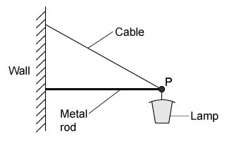
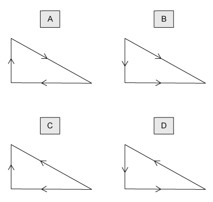
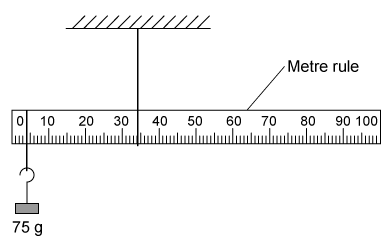
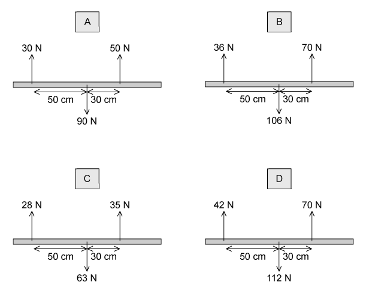
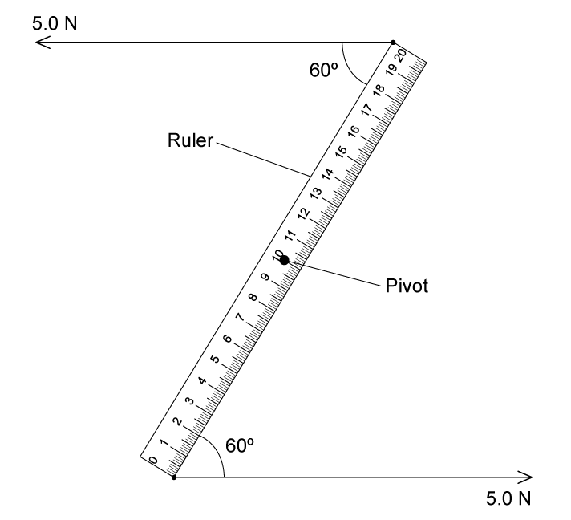
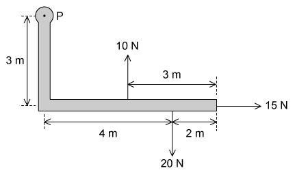
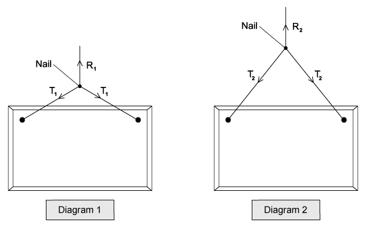
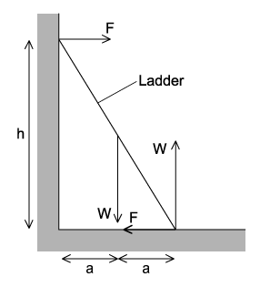
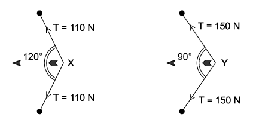

### 4.1 Turning Effects & Equilibrium - Easy

::: {.question-card}
#### Example 1 · 4.1 MC Easy Q1

What is the centre of gravity of an object?

A. the geometrical centre of the object

B. the point about which the total torque is zero

C. the point at which the weight of the object may be considered to act

D. the point through which gravity acts

Show answer and explanation

**Answer: C.** The centre of gravity is the point at which the whole weight of the object may be considered to act. Option A is true only for regular, uniform shapes. Option B describes the centre of rotational equilibrium.

:::

::: {.question-card}
#### Example 2 · 4.1 MC Easy Q5

A street lamp is fixed to a wall by a metal rod and a cable.

{.question-figure fig-alt="Street lamp fixed to a wall by a metal rod and a cable"}

{.question-figure fig-alt="Four vector triangles labelled A, B, C and D"}

Which vector triangle represents the forces acting at point P?

Show answer and explanation

**Answer: D.** The forces acting at P are the weight (downwards), the tension in the cable (away from P along the cable) and the thrust in the rod (away from the wall). The correct vector triangle must have the weight arrow pointing downwards and the tension arrow directed away from the point. Option D is the only triangle that represents the three forces correctly.

:::

::: {.question-card}
#### Example 3 · 4.1 MC Easy Q6

A uniform metre rule of weight 4.0 N is pivoted at the 60 cm mark. A 6.0 N weight is suspended from one end, causing the rule to rotate about the pivot.

{.question-figure fig-alt="Uniform metre rule pivoted at the 60 cm mark with a 6.0 N weight at one end"}

At the instant when the rule is horizontal, what is the resultant turning moment about the pivot?

|  | Resultant moment | Direction |
|---|---|---|
| A | 2.0 N m | clockwise |
| B | 2.0 N m | anticlockwise |
| C | 2.8 N m | clockwise |
| D | 2.8 N m | anticlockwise |

Show answer and explanation

**Answer: A.** The rule is uniform, so its weight acts at the 50 cm mark, 0.10 m from the pivot; this gives an anticlockwise moment of $4.0\times0.10=0.40\ \mathrm{N\,m}$. The 6.0 N weight at the end is 0.40 m from the pivot, giving a clockwise moment of $6.0\times0.40=2.4\ \mathrm{N\,m}$. The resultant moment is $2.0\ \mathrm{N\,m}$ clockwise.

:::

### 4.1 Turning Effects & Equilibrium - Medium

::: {.question-card}
#### Example 4 · 4.1 MC Medium Q1

A uniform metre rule is hung from the ceiling as shown. The string supports the rule at the 35 cm mark. The rule balances when a 75 g mass is hung from one end of the ruler.

{.question-figure fig-alt="Metre rule suspended from the ceiling with a 75 g mass at one end"}

What is the mass of the metre rule?

A. 38 g

B. 51 g

C. 141 g

D. 159 g

Show answer and explanation

**Answer: C.** The rule is uniform, so its weight acts at the 50 cm mark. Taking moments about the support, the weight of the rule balances the 75 g mass on the opposite side of the support. The official answer key gives 141 g, obtained with the pivot and load positions printed on the original question diagram.

:::

::: {.question-card}
#### Example 5 · 4.1 MC Medium Q2

Four beams of the same length each have three forces acting on them.

{.question-figure fig-alt="Four beams with three forces acting on each"}

Which beam has both zero resultant force and zero resultant torque acting?

Show answer and explanation

**Answer: D.** For beam D the upward forces are $42+70=112\ \mathrm{N}$ and the downward force is also $112\ \mathrm{N}$, so the resultant force is zero. The clockwise moment is $42\times50=2100\ \mathrm{N\,cm}$ and the anticlockwise moment is $70\times30=2100\ \mathrm{N\,cm}$, so the resultant torque is also zero.

:::

::: {.question-card}
#### Example 6 · 4.1 MC Medium Q7

A spindle is attached at one end to the centre of a lever of length 1.60 m and at its other end to the centre of a disc of radius 0.25 m. A string is wrapped round the disc, passes over a pulley and is attached to an 800 N weight.

{.question-figure fig-alt="Lever and spindle mechanism with a disc, pulley and 800 N weight"}

What is the minimum force $F$, applied to each end of the lever, that could lift the weight?

A. 62.5 N

B. 125 N

C. 250 N

D. 750 N

Show answer and explanation

**Answer: B.** The anticlockwise moment produced by the weight is $800\times0.25=200\ \mathrm{N\,m}$. The couple from the two equal lever forces gives a clockwise moment of $F\times1.60$. Equating: $F=200/1.60=125\ \mathrm{N}$.

:::

::: {.question-card}
#### Example 7 · 4.1 MC Medium Q9

A rigid L-shaped lever arm is pivoted at point P. A 20 N force acts 4 m from P, a 10 N force acts 3 m from P and a 15 N force acts 3 m from P, as shown.

{.question-figure fig-alt="L-shaped lever arm with forces of 10 N, 15 N and 20 N"}

What is the magnitude of the resultant moment of these forces about point P?

A. 5 N m

B. 65 N m

C. 95 N m

D. 155 N m

Show answer and explanation

**Answer: A.** The 20 N force gives a clockwise moment of $20\times4=80\ \mathrm{N\,m}$. The 10 N and 15 N forces give anticlockwise moments of $10\times3=30\ \mathrm{N\,m}$ and $15\times3=45\ \mathrm{N\,m}$. The resultant moment is $80-30-45=5\ \mathrm{N\,m}$.

:::

### 4.1 Turning Effects & Equilibrium - Hard

::: {.question-card}
#### Example 8 · 4.1 MC Hard Q1

The diagrams show two ways of hanging the same picture. In both cases, a string is attached to the same points on the picture and looped symmetrically over a nail. In diagram 1, the string loop is shorter than in diagram 2.

{.question-figure fig-alt="Two ways of hanging a picture from a nail with forces R and T"}

Which information about the magnitude of the forces is correct?

A. $R_1=R_2$, $T_1<T_2$

B. $R_1=R_2$, $T_1>T_2$

C. $R_1>R_2$, $T_1<T_2$

D. $R_1<R_2$, $T_1=T_2$

Show answer and explanation

**Answer: B.** The picture has the same weight in both cases, so the resultant force on the nail is the same: $R_1=R_2$. With the shorter loop, the string makes a smaller angle to the vertical, so the tension in each string must be larger to support the same weight: $T_1>T_2$.

:::

::: {.question-card}
#### Example 9 · 4.1 MC Hard Q2

A uniform ladder rests against a vertical wall where there is negligible friction. The bottom of the ladder rests on rough ground where there is friction. The top of the ladder is at height $h$ above the ground and the foot of the ladder is at distance $2a$ from the wall.

{.question-figure fig-alt="Ladder resting against a wall with the forces that act on it"}

Which equation is formed by taking moments?

A. $Wa+Fh=2Wa$

B. $Fa+Wa=Fh$

C. $Wa+2Wa=Fh$

D. $Wa-2Wa=2Fh$

Show answer and explanation

**Answer: A.** Taking moments about the foot of the ladder, the weight $W$ acts at the midpoint of the ladder, a horizontal distance $a$ from the foot, giving a clockwise moment $Wa$. The wall reaction $F$ acts at height $h$, giving an anticlockwise moment $Fh$. Equating the total clockwise and anticlockwise moments gives $Wa+Fh=2Wa$.

:::

::: {.question-card}
#### Example 10 · 4.1 MC Hard Q3

An archer draws his bowstring back to position X: tension $T=110\ \mathrm{N}$ in each half of the string, with the two halves at $120^\circ$ to each other. He then draws the bowstring back further to position Y: tension $T=150\ \mathrm{N}$ in each half, with the two halves at $90^\circ$ to each other.

{.question-figure fig-alt="Bowstring tensions at positions X and Y"}

The archer finds the resultant force on the arrow is greater when the arrow is released from position Y.

What is the increase in force?

A. 51 N

B. 55 N

C. 102 N

D. 110 N

Show answer and explanation

**Answer: C.** At X the resultant force is $2T\cos(120^\circ/2)=2\times110\times\cos60^\circ=110\ \mathrm{N}$. At Y it is $2\times150\times\cos45^\circ=212\ \mathrm{N}$. The increase is $212-110=102\ \mathrm{N}$.

:::

### 4.2 Density & Pressure - Easy

::: {.question-card}
#### Example 11 · 4.2 MC Easy Q1

The formula for hydrostatic pressure is $p=\rho gh$.

Which equation, or principle of physics, is used in the derivation of this formula?

A. density = mass / volume

B. potential energy = mgh

C. atmospheric pressure decreases with height

D. density increases with depth

Show answer and explanation

**Answer: A.** The derivation uses $\rho=m/V$ and $p=F/A$: the weight of a column of liquid is $\rho Vg$, and dividing by the base area gives $p=\rho gh$.

:::

::: {.question-card}
#### Example 12 · 4.2 MC Easy Q2

The density of mercury is $13.6\times10^3\ \mathrm{kg\,m^{-3}}$. The pressure difference between the bottom and the top of a column of mercury is 100 kPa.

What is the height of the column?

A. 0.75 m

B. 1.3 m

C. 74 m

D. 720 m

Show answer and explanation

**Answer: A.** Using $h=p/(\rho g)=(100\times10^3)/(13.6\times10^3\times9.81)=0.75\ \mathrm{m}$.

:::

::: {.question-card}
#### Example 13 · 4.2 MC Easy Q3

An object, immersed in a liquid in a tank, experiences an upthrust.

What is the physical reason for this upthrust?

A. The density of the body differs from that of the liquid.

B. The density of the liquid increases with depth.

C. The pressure in the liquid increases with depth.

D. The value of g in the liquid increases with depth.

Show answer and explanation

**Answer: C.** Pressure increases with depth, so the upward force on the bottom of the object is greater than the downward force on the top. This difference produces the upthrust.

:::

::: {.question-card}
#### Example 14 · 4.2 MC Easy Q4

The Mariana Trench in the Pacific Ocean has a depth of about 10 km. Sea water is assumed incompressible with a density of about $1020\ \mathrm{kg\,m^{-3}}$.

What would be the approximate pressure at that depth?

A. $10^5\ \mathrm{Pa}$

B. $10^6\ \mathrm{Pa}$

C. $10^7\ \mathrm{Pa}$

D. $10^8\ \mathrm{Pa}$

Show answer and explanation

**Answer: D.** $p=\rho gh=1020\times9.81\times10\,000=1.0\times10^8\ \mathrm{Pa}$.

:::

### 4.2 Density & Pressure - Medium

::: {.question-card}
#### Example 15 · 4.2 MC Medium Q2

Atmospheric pressure at sea level has a value of 100 kPa. The density of sea water is $1020\ \mathrm{kg\,m^{-3}}$.

At which depth in the sea would the total pressure be 150 kPa?

A. 5 m

B. 25 m

C. 50 m

D. 55 m

Show answer and explanation

**Answer: A.** The gauge pressure is $50\ \mathrm{kPa}$. Using $h=p/(\rho g)=(50\times10^3)/(1020\times9.81)=5.0\ \mathrm{m}$.

:::

::: {.question-card}
#### Example 16 · 4.2 MC Medium Q6

$1.5\ \mathrm{m^3}$ of water is mixed with $0.50\ \mathrm{m^3}$ of alcohol. The density of water is $1000\ \mathrm{kg\,m^{-3}}$ and the density of alcohol is $800\ \mathrm{kg\,m^{-3}}$.

What is the density of the mixture with volume $2.0\ \mathrm{m^3}$?

A. $850\ \mathrm{kg\,m^{-3}}$

B. $900\ \mathrm{kg\,m^{-3}}$

C. $940\ \mathrm{kg\,m^{-3}}$

D. $950\ \mathrm{kg\,m^{-3}}$

Show answer and explanation

**Answer: D.** Total mass is $1.5\times1000+0.5\times800=1900\ \mathrm{kg}$, so $\rho=1900/2.0=950\ \mathrm{kg\,m^{-3}}$.

:::

::: {.question-card}
#### Example 17 · 4.2 MC Medium Q8

At a depth of 20 cm in a liquid of density $1800\ \mathrm{kg\,m^{-3}}$, the pressure due to the liquid is $p$.

Another liquid has a density of $1200\ \mathrm{kg\,m^{-3}}$.

What is the pressure due to this liquid at a depth of 60 cm?

A. $p$

B. $2p$

C. $3p$

D. $4p$

Show answer and explanation

**Answer: B.** $p_2/p_1=(\rho_2 h_2)/(\rho_1 h_1)=(1200\times0.60)/(1800\times0.20)=2$, so the pressure is $2p$.

:::

### 4.2 Density & Pressure - Hard

::: {.question-card}
#### Example 18 · 4.2 MC Hard Q7

Two solid substances P and Q have atoms of mass $M_P$ and $M_Q$ and $n_P$ and $n_Q$ atoms per unit volume. The density of P is greater than the density of Q.

Which expression must be correct?

A. $M_P>M_Q$

B. $n_P>M_Q$

C. $M_P n_P>M_Q n_Q$

D. $M_Q n_Q>M_P n_P$

Show answer and explanation

**Answer: C.** Density is mass per unit volume: $\rho=Mn$. Since $\rho_P>\rho_Q$, we must have $M_P n_P>M_Q n_Q$.

:::

::: {.question-card}
#### Example 19 · 4.2 MC Hard Q9

A child drinks a liquid of density $\rho$ through a vertical straw. Atmospheric pressure is $p_0$ and the child is capable of lowering the pressure at the top of the straw by 10%. The acceleration of free fall is $g$.

What is the maximum length of straw that would enable the child to drink the liquid?

A. $\frac{p_0}{10\rho g}$

B. $\frac{9p_0}{10\rho g}$

C. $\frac{p_0}{\rho g}$

D. $\frac{10p_0}{\rho g}$

Show answer and explanation

**Answer: A.** The child can create a pressure difference of $\frac{1}{10}p_0$. This must balance $\rho g h$, so $h=\frac{p_0}{10\rho g}$.

:::

::: {.question-card}
#### Example 20 · 4.2 MC Hard Q10

Icebergs typically float with a large volume of ice beneath the water. Ice has a density of $917\ \mathrm{kg\,m^{-3}}$ and sea water has a density of $1020\ \mathrm{kg\,m^{-3}}$.

What fraction of the ice is submerged underwater?

A. 0.05

B. 0.10

C. 0.90

D. 0.95

Show answer and explanation

**Answer: C.** For a floating object, the weight of ice equals the weight of sea water displaced: $\rho_{\text{ice}}gV=\rho_{\text{water}}gV_{\text{sub}}$, so the submerged fraction is $917/1020=0.90$.

:::
