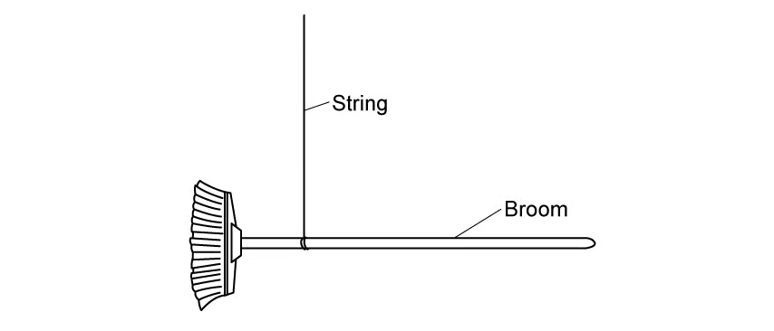
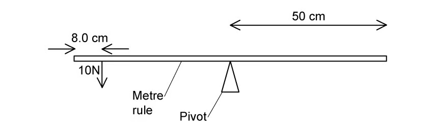
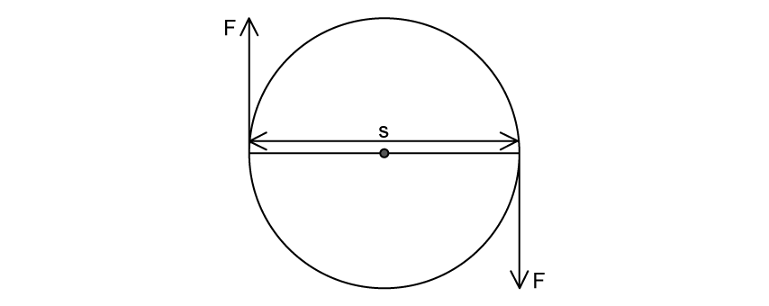
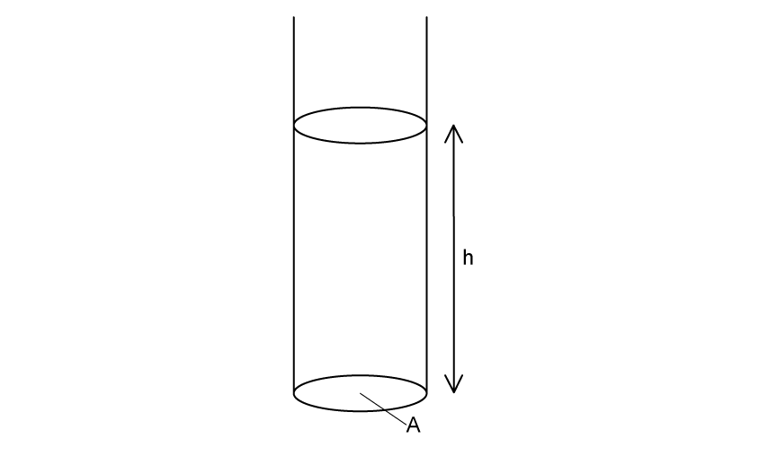
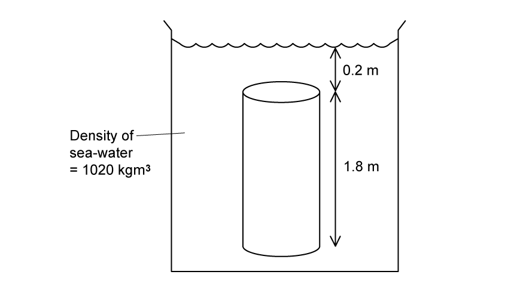
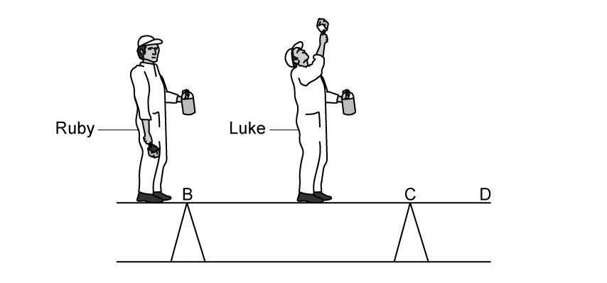
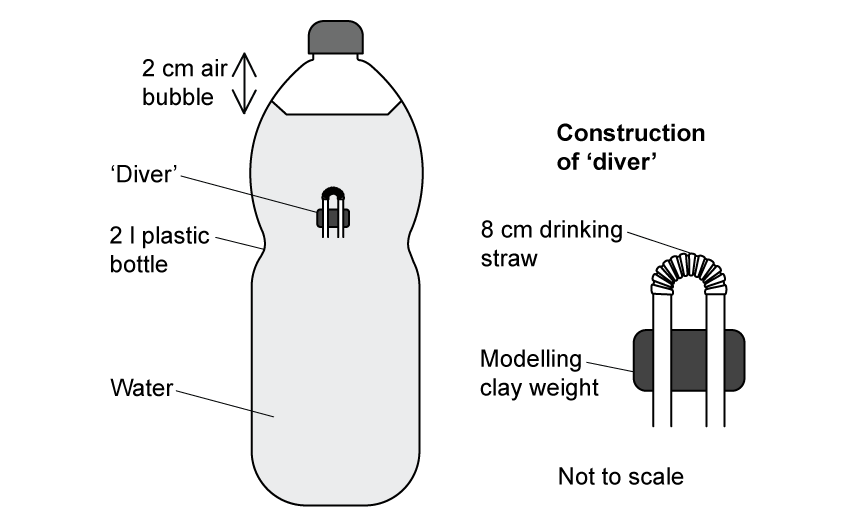

### 4.1 Turning Effects & Equilibrium - Easy

::: {.question-card}
#### Example 1 · 4.1 SQ Easy Q1

**(a)** Define the following:

**(i)** moment of a force; `[2]`

**(ii)** centre of gravity. `[1]`

`[3 marks]`

**(b)** A teacher sets some Physics students the task of finding the weight of a broom using only a ruler, some thin, light string, and a set of laboratory masses. The equipment is initially arranged as shown in Fig. 1.1.

For the arrangement in Fig. 1.1:

**(i)** state why the broom is hanging horizontally; `[2]`

**(ii)** state what measurement the students should make to start their investigation to find the weight of the broom. `[1]`

`[3 marks]`

**(c)** The measurement of the position of the string found in part (b) is shown in Fig. 1.2. The string is moved towards the end of the handle, so that the broom is in equilibrium when a 0.5 kg mass is hung a distance of 0.45 m from the string, as shown in Fig. 1.3.

{.question-figure fig-alt="Broom supported by a string with a 0.5 kg mass hanging 0.45 m from the support"}

Determine:

**(i)** the distance between the centre of mass of the broom and the point where the string is attached; `[1]`

**(ii)** the force exerted by the 0.5 kg mass. `[1]`

`[2 marks]`

**(d)** Calculate the weight of the broom. `[2 marks]`

Show mark scheme / model answer

- **(a)(i)** Moment of a force is the turning effect of a force about a point, equal to the product of the force and its perpendicular distance from the point: $M=Fd$. `[2]`
- **(a)(ii)** Centre of gravity is the point at which the whole weight of the object may be considered to act. `[1]`
- **(b)(i)** The broom is in equilibrium with zero resultant moment: the line of action of its weight passes through the point of support, so there is no turning effect. `[2]`
- **(b)(ii)** Measure the distance from the string to each end of the broom, or locate the point of balance. `[1]`
- **(c)(i)** The centre of mass is 0.12 m from the string. `[1]`
- **(c)(ii)** Force $=mg=0.5\times9.81=4.9\ \mathrm{N}$. `[1]`
- **(d)** Taking moments about the string: $W\times0.12=4.9\times0.45$, so $W=18.4\ \mathrm{N}$. `[2]`

:::

::: {.question-card}
#### Example 2 · 4.1 SQ Easy Q2

**(a)** A metre rule is balanced on a pivot at its midpoint. A force of 10.0 N acts at a distance of 8.0 cm from one end of the rule, as shown in Fig. 1.1.

{.question-figure fig-alt="Metre rule with a 10.0 N force acting 8.0 cm from one end"}

Calculate the moment of the 10.0 N force about the pivot. `[3 marks]`

**(b)** A mass is placed at a point 35 cm from the pivot, which makes the metre rule balance.

On Fig. 1.1, draw an arrow to show the position of the mass and the direction of the force it exerts. `[2 marks]`

**(c)** Calculate the mass which has been placed to balance the ruler in part (a). `[4 marks]`

Show mark scheme / model answer

- **(a)** The force is $8.0\ \mathrm{cm}$ from the end, so its distance from the midpoint pivot is $50-8=42\ \mathrm{cm}=0.42\ \mathrm{m}$. `[2]` Moment $=10.0\times0.42=4.2\ \mathrm{N\,m}$. `[1]`
- **(b)** Draw a downward arrow at a point 35 cm from the pivot on the opposite side of the rule. `[2]`
- **(c)** Let the balancing mass be $m$. Its moment is $mg\times0.35$. `[1]` Equating moments: $mg\times0.35=4.2$. `[2]` Hence $m=4.2/(0.35\times9.81)=1.22\ \mathrm{kg}$. `[1]`

:::

::: {.question-card}
#### Example 3 · 4.1 SQ Easy Q3

**(a)** For a couple:

**(i)** state the definition; `[1]`

**(ii)** state the conditions which have to be true for the forces in a couple. `[3]`

`[4 marks]`

**(b)** Fig. 1.1 shows a pair of forces acting on a rotating wheel.

**(i)** State the definition and units of torque. `[1]`

**(ii)** For the couple in Fig. 1.1, state the equation which can be used to determine the torque. `[1]`

`[2 marks]`

**(c)** For the couple in Fig. 1.1, the two forces $F$ are both 15 N and the perpendicular distance $s$ between them is 0.5 m.

Calculate the torque of this couple. `[2 marks]`

**(d)** The forces in Fig. 1.1 are changed so that they act at an angle of $60^\circ$ to the horizontal distance between them.

{.question-figure fig-alt="Two equal 15 N forces at 60 degrees to the horizontal separation"}

Calculate the new torque on the wheel. `[3 marks]`

Show mark scheme / model answer

- **(a)(i)** A couple is a pair of equal and opposite parallel forces whose lines of action do not coincide, producing rotation only. `[1]`
- **(a)(ii)** The forces are equal in magnitude, parallel, opposite in direction and separated by a perpendicular distance. `[3]`
- **(b)(i)** Torque is the product of one of the forces of a couple and the perpendicular distance between them; unit is $\mathrm{N\,m}$. `[1]`
- **(b)(ii)** $\tau=Fd$. `[1]`
- **(c)** $\tau=15\times0.5=7.5\ \mathrm{N\,m}$. `[2]`
- **(d)** Perpendicular distance $=s\sin60^\circ=0.5\times0.866=0.433\ \mathrm{m}$. `[2]` New torque $=15\times0.433=6.5\ \mathrm{N\,m}$. `[1]`

:::

### 4.2 Density & Pressure - Easy

::: {.question-card}
#### Example 4 · 4.2 SQ Easy Q1

**(a)** State the word definition of density. `[1 mark]`

**(b)** When calculating density both the equation and units are required.

**(i)** State the equation for density, defining all the terms used. `[1]`

**(ii)** State the SI units for density and a non-SI unit which is commonly used. `[2]`

`[3 marks]`

**(c)** For pressure caused by a solid, state:

**(i)** the definition of pressure; `[1]`

**(ii)** the equation for pressure, defining the terms used. `[1]`

`[2 marks]`

**(d)** Fig. 1.1 shows a measuring cylinder containing a liquid with depth $h$ and cross-sectional area $A$.

{.question-figure fig-alt="Measuring cylinder containing liquid of depth h and base area A"}

Using the equations you stated in (b) and (c), show that the pressure at a point in the liquid is $\Delta p=\rho g\Delta h$. `[2 marks]`

Show mark scheme / model answer

- **(a)** Density is the mass per unit volume of a substance. `[1]`
- **(b)(i)** $\rho=m/V$, where $\rho$ is density, $m$ is mass and $V$ is volume. `[1]`
- **(b)(ii)** SI unit is $\mathrm{kg\,m^{-3}}$; a common non-SI unit is $\mathrm{g\,cm^{-3}}$. `[2]`
- **(c)(i)** Pressure is the normal force acting per unit area. `[1]`
- **(c)(ii)** $p=F/A$, where $p$ is pressure, $F$ is the normal force and $A$ is the area. `[1]`
- **(d)** Mass of liquid $=\rho V=\rho A\Delta h$, so its weight is $\rho A\Delta h\,g$. `[1]` Pressure $=\frac{W}{A}=\rho g\Delta h$. `[1]`

:::

::: {.question-card}
#### Example 5 · 4.2 SQ Easy Q3

**(a)** Complete the definition of hydrostatic pressure:

Hydrostatic pressure is the pressure that is exerted by a ______ at ______ at a given point within the fluid, due to the force of ______. `[3 marks]`

**(b)** A cylinder of length 1.8 m is submerged vertically in a tank of sea water so that the top of the cylinder is 0.2 m below the surface of the water, as shown in Fig. 1.1. The density of the sea water is $1020\ \mathrm{kg\,m^{-3}}$.

{.question-figure fig-alt="Cylinder of length 1.8 m submerged vertically in sea water"}

Calculate the difference in hydrostatic pressure between the top and bottom surfaces of the cylinder. `[2 marks]`

**(c)** The cylinder has a diameter of 75 cm.

Calculate the upthrust on the cylinder. `[4 marks]`

**(d)** The sea water in Fig. 1.1 is replaced with pure water which has a lower density than sea water.

Without further calculation:

**(i)** state and explain the effect this would have on the upthrust on the cylinder; `[2]`

**(ii)** hence state whether the cylinder would sink, float or stay at the same position in the tank. `[1]`

`[3 marks]`

Show mark scheme / model answer

- **(a)** Hydrostatic pressure is the pressure exerted by a liquid at rest at a given point within the fluid, due to the force of gravity. `[3]`
- **(b)** $\Delta p=\rho g\Delta h=1020\times9.81\times1.8$. `[1]` $\Delta p=1.80\times10^4\ \mathrm{Pa}$. `[1]`
- **(c)** Area $A=\pi r^2=\pi(0.375)^2=0.442\ \mathrm{m^2}$. `[1]` Upthrust $=\Delta p\times A$. `[1]` $F=1.80\times10^4\times0.442$. `[1]` $F=7.95\times10^3\ \mathrm{N}$. `[1]`
- **(d)(i)** The upthrust decreases because upthrust is proportional to the density of the surrounding fluid. `[2]`
- **(d)(ii)** The cylinder sinks. `[1]`

:::

### 4.1 Turning Effects & Equilibrium - Medium

::: {.question-card}
#### Example 6 · 4.1 SQ Medium Q1

**(a)** A team of decorators set up a raised bench to allow them to reach the ceiling. The bench consists of a plank resting horizontally on two supports B and C. The plank is modelled as a uniform rod AD of length 2.7 m and mass 15 kg. The supports at B and C are 0.4 m from each end of the plank, as shown in Fig. 1.1.

{.question-figure fig-alt="Plank AD supported at B and C with two decorators standing on it"}

Two decorators, Ruby and Luke, stand on the plank. Luke has a mass of 85 kg and stands in the middle of the plank. Ruby has a mass of 72 kg and stands at end A. The plank remains horizontal and in equilibrium. The decorators can be modelled as point masses.

Calculate:

**(i)** the magnitude of the normal reaction force at B; `[3]`

**(ii)** the magnitude of the normal reaction force at C. `[3]`

`[6 marks]`

**(b)** Whilst Ruby stays at point A, Luke now moves along the plank to a point X. The plank remains horizontal and in equilibrium, and the magnitude of the normal reaction force at B is now twice the magnitude of the normal reaction force at C.

Calculate the distance BX. `[4 marks]`

Show mark scheme / model answer

- **(a)(i)** Total weight $=(72+85+15)g=172g=1687\ \mathrm{N}$. `[1]` Taking moments about C: $R_B\times1.9=72g\times2.3+(85g+15g)\times0.95$. `[1]` $R_B=1300\ \mathrm{N}$ (2 s.f.). `[1]`
- **(a)(ii)** $R_C=(72g+85g+15g)-R_B$. `[2]` $R_C=340\ \mathrm{N}$ (2 s.f.). `[1]`
- **(b)** With $R_B=2R_C$ and $R_B+R_C=172g$, $R_C=562\ \mathrm{N}$. `[1]` Taking moments about B: $85g\times x+15g\times0.95=72g\times0.4+R_C\times1.9$. `[2]` Solving gives $x=1.5\ \mathrm{m}$ from B. `[1]`

:::

### 4.2 Density & Pressure - Medium

::: {.question-card}
#### Example 7 · 4.2 SQ Medium Q1

**(a)** A designer tests how far into a measuring cylinder of water a wooden rod will sink when dropped from various heights. The wooden rod has mass $1.30\times10^{-2}\ \mathrm{kg}$, diameter $1.5\times10^{-2}\ \mathrm{m}$ and length $7.5\times10^{-2}\ \mathrm{m}$.

**(i)** Calculate the density of the wood. `[2]`

**(ii)** State and explain why the designer chose this type of wood to use in their investigation. `[2]`

**(iii)** Suggest one change to the experimental set-up which the designer needs to make to model the situation they are investigating. `[2]`

`[6 marks]`

**(b)** The wooden rod is held in a clamp so that it can be quickly released from rest. Initially it is clamped so that the base is at a height $h=0.20\ \mathrm{m}$ above the water surface.

Calculate the speed of the rod as its base reaches the water. Ignore air resistance. `[2 marks]`

**(c)** Fig. 1.2 shows the wooden rod fully submerged under the water surface. The rod is moving vertically downwards and has not yet come to rest.

{.question-figure fig-alt="Wooden rod fully submerged in water"}

**(i)** Sketch on Fig. 1.2 the forces acting on the wooden rod. `[3]`

**(ii)** Describe and explain how the resultant force on the wooden cylinder varies from the moment the cylinder is fully submerged until it reaches its deepest point. `[3]`

`[6 marks]`

**(d)** The investigation concludes that an exciting but safe experience can be had by jumping into water which is at least six metres deep, sinking to no more than four metres. The density of sea water is $1030\ \mathrm{kg\,m^{-3}}$.

Suggest a likely range of pressure changes they will feel in their ears. `[4 marks]`

Show mark scheme / model answer

- **(a)(i)** Cross-sectional area $A=\pi(7.5\times10^{-3})^2=1.77\times10^{-4}\ \mathrm{m^2}$; volume $=A\times7.5\times10^{-2}=1.33\times10^{-5}\ \mathrm{m^3}$. `[1]` $\rho=m/V=980\ \mathrm{kg\,m^{-3}}$. `[1]`
- **(a)(ii)** The density is close to the density of water, `[1]` so it models the human body, which is mostly water. `[1]`
- **(a)(iii)** Add salt or sugar to the water to mimic the greater density of sea water. `[2]`
- **(b)** $v^2=u^2+2as=0+2\times9.81\times0.20$. `[1]` $v=2.0\ \mathrm{m\,s^{-1}}$. `[1]`
- **(c)(i)** Weight downwards, upthrust upwards and drag upwards; the upthrust and drag arrows together are shorter than the weight arrow when the rod is still accelerating downwards. `[3]`
- **(c)(ii)** The upthrust is constant once fully submerged, but the drag increases with speed. `[2]` The resultant downward force therefore decreases until it becomes zero at maximum depth. `[1]`
- **(d)** At 4 m, $p=\rho gh=1030\times9.81\times4=4.0\times10^4\ \mathrm{Pa}$. `[2]` The likely range of pressure change is roughly $0$ to $4\times10^4\ \mathrm{Pa}$. `[2]`

:::

::: {.question-card}
#### Example 8 · 4.2 SQ Medium Q4

**(a)** A submarine below the surface of the sea is stationary in a region where the density of sea water is $1.03\times10^3\ \mathrm{kg\,m^{-3}}$. The submarine has a volume of $5.83\times10^3\ \mathrm{m^3}$.

Calculate the upthrust exerted on the submarine by the sea water. `[2 marks]`

**(b)** Explain why the mass of the submarine must be $6.0\times10^6\ \mathrm{kg}$. `[2 marks]`

**(c)** The submarine moves into a region of the sea where the water is less salty, and the density of the water reduces to $1.01\times10^3\ \mathrm{kg\,m^{-3}}$.

Explain what would happen to the submarine as it moves into this region of lower density sea water. `[3 marks]`

**(d)** The submarine alters its weight by pumping water in or out of its internal tanks.

Determine the mass of water that the submarine should pump, in or out of its tanks, to maintain its depth below the surface of the sea. `[2 marks]`

Show mark scheme / model answer

- **(a)** $F=\rho gV=1.03\times10^3\times9.81\times5.83\times10^3$. `[1]` $F=5.89\times10^7\ \mathrm{N}$. `[1]`
- **(b)** The submarine is stationary, so the upthrust equals its weight. `[1]` $m=F/g=5.89\times10^7/9.81=6.0\times10^6\ \mathrm{kg}$. `[1]`
- **(c)** The upthrust decreases because it is proportional to the water density. `[2]` The weight is unchanged, so the submarine sinks. `[1]`
- **(d)** New upthrust $=1.01\times10^3\times9.81\times5.83\times10^3=5.78\times10^7\ \mathrm{N}$. `[1]` The submarine must pump out water of mass about $1.1\times10^5\ \mathrm{kg}$. `[1]`

:::

### 4.2 Density & Pressure - Hard

::: {.question-card}
#### Example 9 · 4.2 SQ Hard Q1

The Cartesian Diver is a popular science project used to demonstrate physical concepts. A 'diver' is made by bending a loop of drinking straw into a U-shape and weighting it with modelling clay. A large plastic bottle is filled with water, leaving a small volume of air at the top. The diver is added so that some water enters it but the straw remains floating upright due to trapped air. The lid is tightly screwed back onto the bottle.

{.question-figure fig-alt="Cartesian Diver: drinking straw diver inside a sealed plastic bottle of water"}

When the sides of the bottle are squeezed and released, the 'diver' moves up and down rapidly.

Discuss the physics of the Cartesian Diver when the sides of the bottle are squeezed.

**(i)** Explain the observed motion of the 'diver'. `[5]`

**(ii)** Predict which direction the diver moves in when the sides of the bottle are squeezed. `[1]`

`[5 marks]`

**(b)** When the sides of the bottle are released, the diver reverses direction.

Explain why the diver returns to its original position in the bottle. `[4 marks]`

Show mark scheme / model answer

- **(a)(i)** Squeezing the bottle increases the pressure on the water. `[1]` The increased pressure compresses the trapped air inside the diver. `[1]` The volume of the air bubble decreases, so the diver displaces less water and the upthrust decreases. `[2]` The weight of the diver is unchanged, so the diver sinks. `[1]`
- **(a)(ii)** The diver moves downwards. `[1]`
- **(b)** When the bottle is released, the pressure decreases and the trapped air expands again. `[2]` The displaced volume and upthrust increase, `[1]` so the diver rises back to its original position. `[1]`

:::

::: {.question-card}
#### Example 10 · 4.2 SQ Hard Q3

A very large hot air balloon can carry 25-30 people. The envelope has a diameter at its widest point of 32 m when filled with air. The total mass of the balloon, air, equipment and passengers is 20 900 kg. When the air temperature is $15^\circ\mathrm{C}$, the density of the air outside the balloon is $1.225\ \mathrm{kg\,m^{-3}}$.

When the air inside the envelope is hot enough, the balloon is released.

**(i)** Calculate the resultant upwards force on the balloon. `[3]`

**(ii)** Calculate the initial upwards acceleration of the balloon. `[1]`

`[4 marks]`

Show mark scheme / model answer

- **(i)** Radius $=16\ \mathrm{m}$; volume $=\frac{4}{3}\pi(16)^3=1.72\times10^4\ \mathrm{m^3}$. `[1]` Upthrust $=\rho gV=1.225\times9.81\times1.72\times10^4=2.06\times10^5\ \mathrm{N}$. `[1]` Weight $=20\,900\times9.81=2.05\times10^5\ \mathrm{N}$; resultant force $=1.3\times10^3\ \mathrm{N}$ upwards. `[1]`
- **(ii)** $a=F/m=1.3\times10^3/20\,900=0.062\ \mathrm{m\,s^{-2}}$ upwards. `[1]`

:::
