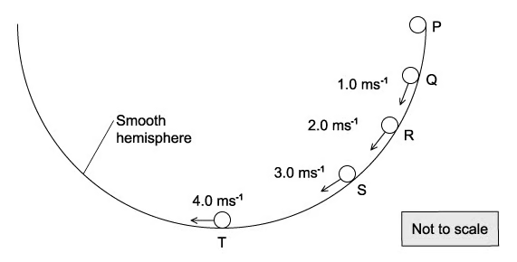
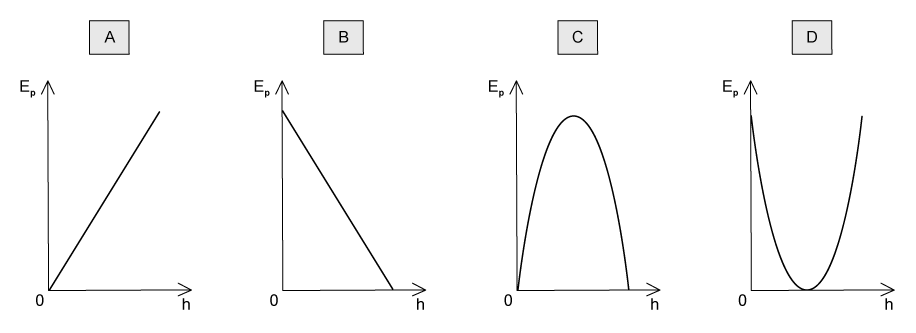
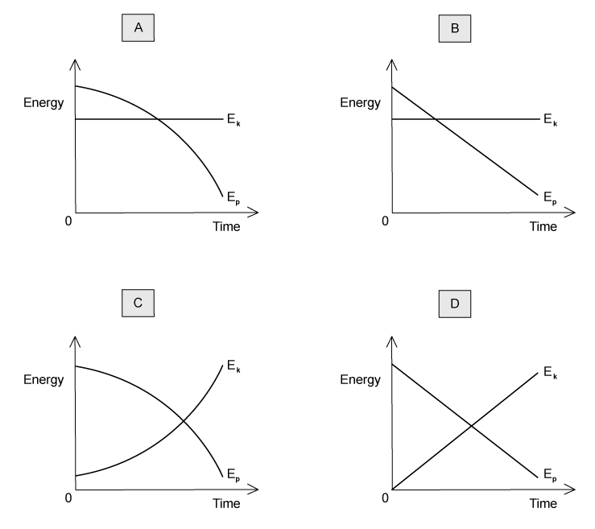
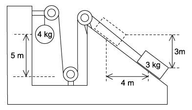

### 5.1 Energy Conservation - Easy

::: {.question-card}
#### Example 1 · 5.1 MC Easy Q1

Which of the following is a statement of the principle of conservation of energy?

A. Energy is the product of force and distance.

B. Energy cannot be created, destroyed or transformed.

C. The total energy of an isolated system is constant.

D. The power transmitted by a system is proportional to the rate of transfer of energy.

Show answer and explanation

**Answer: C.** The principle of conservation of energy states that energy cannot be created or destroyed, only transferred from one form to another, so the total energy of an isolated system remains constant.

:::

::: {.question-card}
#### Example 2 · 5.1 MC Easy Q4

A boat moving at constant speed $v$ through still water experiences a total frictional drag $F$.

What is the power developed by the boat?

A. $\frac{Fv}{2}$

B. $Fv$

C. $\frac{1}{2}Fv^2$

D. $Fv^2$

Show answer and explanation

**Answer: B.** At constant speed the driving force equals the drag $F$. The power is $P=Fv$.

:::

::: {.question-card}
#### Example 3 · 5.1 MC Easy Q6

A transformer has the following input and output:

|  | Potential difference / V | Current / A |
|---|---|---:|
| Input | 11 000 | 28 |
| Output | 240 | 1200 |

What is the efficiency of the transformer?

A. 0.94%

B. 1.0%

C. 11%

D. 94%

Show answer and explanation

**Answer: D.** Power input $=11\,000\times28=3.08\times10^5\ \mathrm{W}$; power output $=240\times1200=2.88\times10^5\ \mathrm{W}$. Efficiency $=2.88\times10^5/3.08\times10^5=0.94=94\%$.

:::

::: {.question-card}
#### Example 4 · 5.1 MC Easy Q7

Which operation involves the greatest mean power?

A. A car moving against a resistive force of 0.4 kN at a constant speed of $20\ \mathrm{m\,s^{-1}}$.

B. A crane lifting a weight of 3 kN at a speed of $2\ \mathrm{m\,s^{-1}}$.

C. A crane lifting a weight of 5 kN at a speed of $1\ \mathrm{m\,s^{-1}}$.

D. A weight being pulled across a horizontal surface at a speed of $6\ \mathrm{m\,s^{-1}}$ against a frictional force of 1.5 kN.

Show answer and explanation

**Answer: D.** Using $P=Fv$: A gives $400\times20=8000\ \mathrm{W}$; B gives $3000\times2=6000\ \mathrm{W}$; C gives $5000\times1=5000\ \mathrm{W}$; D gives $1500\times6=9000\ \mathrm{W}$, the greatest mean power.

:::

### 5.1 Energy Conservation - Medium

::: {.question-card}
#### Example 5 · 5.1 MC Medium Q9

A bungee jumper has 24 kJ of gravitational potential energy at the top of his jump. He is attached to an elastic rope which starts to stretch after a short time of free fall. Assume that energy loss through air resistance is negligible.

|  | GPE / kJ | EPE / kJ | KE / kJ |
|---|---|---|---|
| Top | 24 | 0 | 0 |
| Bottom | 0 | 24 | 0 |

What are the possible values when the jumper is half-way down?

|  | GPE / kJ | EPE / kJ | KE / kJ |
|---|---|---|---|
| A | 12 | 10 | 2 |
| B | 12 | 8 | 4 |
| C | 8 | 8 | 8 |
| D | 12 | 2 | 10 |

Show answer and explanation

**Answer: D.** Half-way down the jumper has fallen 12 m (half of the 24 m), so the GPE is 12 kJ. The rope has not fully unwound until halfway, so EPE is small (2 kJ) and the remainder is kinetic energy (10 kJ), keeping the total at 24 kJ.

:::

::: {.question-card}
#### Example 6 · 5.1 MC Medium Q12

The force resisting the motion of a car is taken as being proportional to the square of the car's speed. The magnitude of the force at a speed of $20\ \mathrm{m\,s^{-1}}$ is 800 N.

What effective power is required from the car's engine to maintain a steady speed of $40\ \mathrm{m\,s^{-1}}$?

A. 32 kW

B. 64 kW

C. 128 kW

D. 512 kW

Show answer and explanation

**Answer: D.** $F\propto v^2$, so at $40\ \mathrm{m\,s^{-1}}$, $F=800\times(40/20)^2=3200\ \mathrm{N}$. The required power is $P=Fv=3200\times40=128\,000\ \mathrm{W}=128\ \mathrm{kW}$.

:::

::: {.question-card}
#### Example 7 · 5.1 MC Medium Q13

A mass is raised vertically. In a time $t$, the increase in its gravitational potential energy is $E_P$, and the increase in its kinetic energy is $E_K$.

What is the average power input to the mass?

A. $(E_P-E_K)t$

B. $(E_P+E_K)t$

C. $\frac{E_P-E_K}{t}$

D. $\frac{E_P+E_K}{t}$

Show answer and explanation

**Answer: D.** The total energy input is the sum of the increases in GPE and KE. Average power is energy transferred divided by time: $P=\frac{E_P+E_K}{t}$.

:::

### 5.1 Energy Conservation - Hard

::: {.question-card}
#### Example 8 · 5.1 MC Hard Q1

A turbine at a hydroelectric power station is situated 30 m below the level of the surface of a large lake. The water passes through the turbine at a rate of $340\ \mathrm{m^3}$ per minute.

The overall efficiency of the turbine and generator system is 90%.

What is the output power of the power station? (The density of water is $1000\ \mathrm{kg\,m^{-3}}$.)

A. 0.15 MW

B. 1.5 MW

C. 1.7 MW

D. 90 MW

Show answer and explanation

**Answer: B.** Mass flow rate $=340\times1000/60=5667\ \mathrm{kg\,s^{-1}}$. Input power $=\rho gQh=5667\times9.81\times30=1.67\times10^6\ \mathrm{W}$. Output $=0.90\times1.67\times10^6=1.5\ \mathrm{MW}$.

:::

::: {.question-card}
#### Example 9 · 5.1 MC Hard Q2

A small mass is placed at point P on the inside surface of a smooth hemisphere. It is then released from rest. When it reaches the lowest point T, its speed is $4.0\ \mathrm{m\,s^{-1}}$.

{.question-figure fig-alt="Mass sliding down the inside of a smooth hemisphere with speeds at Q, R, S and T"}

The mass loses potential energy $E$ in falling from P to T.

At which point has the mass lost potential energy $\frac{E}{4}$?

A. Q

B. R

C. S

D. none of these

Show answer and explanation

**Answer: B.** From conservation of energy, the speed squared is proportional to the potential energy lost. At T, $v^2=16$, so losing $\frac{1}{4}E$ means $v^2=4$, i.e. $v=2.0\ \mathrm{m\,s^{-1}}$, which occurs at point R.

:::

::: {.question-card}
#### Example 10 · 5.1 MC Hard Q3

A wind turbine has blades that sweep an area of $2000\ \mathrm{m^2}$. It converts the power available in the wind to electrical power with an efficiency of 50%.

What is the electrical power generated if the wind speed is $10\ \mathrm{m\,s^{-1}}$? (The density of air is $1.3\ \mathrm{kg\,m^{-3}}$.)

A. 130 kW

B. 650 kW

C. 1300 kW

D. 2600 kW

Show answer and explanation

**Answer: B.** Power available in the wind $=\frac{1}{2}\rho Av^3=\frac{1}{2}\times1.3\times2000\times10^3=1.3\times10^6\ \mathrm{W}$. Electrical output $=0.50\times1.3\times10^6=650\ \mathrm{kW}$.

:::

### 5.2 Gravitational Potential Energy & Kinetic Energy - Easy

::: {.question-card}
#### Example 11 · 5.2 MC Easy Q1

What is the approximate kinetic energy of an Olympic athlete when running at maximum speed during a 100 m race?

A. 400 J

B. 4000 J

C. 40 000 J

D. 400 000 J

Show answer and explanation

**Answer: B.** An athlete of mass about 80 kg running at about $10\ \mathrm{m\,s^{-1}}$ has $E_K=\frac{1}{2}\times80\times10^2=4000\ \mathrm{J}$.

:::

::: {.question-card}
#### Example 12 · 5.2 MC Easy Q2

A body travelling with a speed of $10\ \mathrm{m\,s^{-1}}$ has kinetic energy 1500 J.

If the speed of the body is increased to $40\ \mathrm{m\,s^{-1}}$, what is its new kinetic energy?

A. 4.5 kJ

B. 6 kJ

C. 24 kJ

D. 1350 kJ

Show answer and explanation

**Answer: C.** $E_K\propto v^2$. The speed increases by a factor of 4, so the kinetic energy increases by a factor of $4^2=16$: $1500\times16=24\,000\ \mathrm{J}=24\ \mathrm{kJ}$.

:::

::: {.question-card}
#### Example 13 · 5.2 MC Easy Q3

An object is thrown into the air.

Which graph shows how the potential energy $E_P$ of the object varies with height $h$ above the ground?

{.question-figure fig-alt="Four graphs of potential energy against height"}

Show answer and explanation

**Answer: A.** Gravitational potential energy is $E_P=mgh$, which increases linearly with height, so the graph is a straight line through the origin.

:::

::: {.question-card}
#### Example 14 · 5.2 MC Easy Q9

A cyclist is travelling at a constant speed up a hill. The frictional force resisting the cyclist's motion is 8.0 N.

The cyclist uses 450 J of energy to travel 20 m.

What is the increase in gravitational potential energy of the cyclist?

A. 160 J

B. 290 J

C. 440 J

D. 610 J

Show answer and explanation

**Answer: B.** Work done against friction $=8.0\times20=160\ \mathrm{J}$. By conservation of energy, $450=160+\Delta E_P$, so $\Delta E_P=290\ \mathrm{J}$.

:::

### 5.2 Gravitational Potential Energy & Kinetic Energy - Medium

::: {.question-card}
#### Example 15 · 5.2 MC Medium Q2

A body travelling with a speed of $20\ \mathrm{m\,s^{-1}}$ has kinetic energy $E$.

If the speed of the body is increased to $80\ \mathrm{m\,s^{-1}}$, what is its kinetic energy?

A. $4E$

B. $8E$

C. $12E$

D. $16E$

Show answer and explanation

**Answer: D.** The speed increases by a factor of 4, so the kinetic energy increases by a factor of $4^2=16$.

:::

::: {.question-card}
#### Example 16 · 5.2 MC Medium Q7

A steel ball is falling at constant speed in oil.

Which graph shows the variation with time of the gravitational potential energy $E_P$ and the kinetic energy $E_K$ of the ball?

{.question-figure fig-alt="Four graphs of energy against time for a ball falling in oil"}

Show answer and explanation

**Answer: B.** At constant speed the kinetic energy is constant, while the gravitational potential energy decreases linearly with time as the ball falls.

:::

::: {.question-card}
#### Example 17 · 5.2 MC Medium Q8

Car X is travelling at half the speed of car Y. Car X has twice the mass of car Y.

Which statement is correct?

A. Car X has half the kinetic energy of car Y.

B. Car X has one quarter of the kinetic energy of car Y.

C. Car X has twice the kinetic energy of car Y.

D. The two cars have the same kinetic energy.

Show answer and explanation

**Answer: A.** With $m_X=2m$ and $v_X=\frac{1}{2}v$, $E_X=\frac{1}{2}(2m)(\frac{1}{2}v)^2=\frac{1}{4}mv^2$, which is half of $E_Y=\frac{1}{2}mv^2$.

:::

### 5.2 Gravitational Potential Energy & Kinetic Energy - Hard

::: {.question-card}
#### Example 18 · 5.2 MC Hard Q1

A loaded aeroplane has a total mass of $1.2\times10^5\ \mathrm{kg}$ while climbing after take-off. It climbs at an angle of $23^\circ$ to the horizontal with a speed of $50\ \mathrm{m\,s^{-1}}$.

What is the rate at which it is gaining potential energy at this time?

A. $2.3\times10^6\ \mathrm{J\,s^{-1}}$

B. $2.5\times10^6\ \mathrm{J\,s^{-1}}$

C. $2.3\times10^7\ \mathrm{J\,s^{-1}}$

D. $2.5\times10^7\ \mathrm{J\,s^{-1}}$

Show answer and explanation

**Answer: C.** Vertical component of speed $=50\sin23^\circ$. Rate of gaining GPE $=mgv\sin\theta=1.2\times10^5\times9.81\times50\times\sin23^\circ=2.3\times10^7\ \mathrm{J\,s^{-1}}$.

:::

::: {.question-card}
#### Example 19 · 5.2 MC Hard Q3

A steel sphere is dropped vertically onto a horizontal metal plate. The sphere hits the plate with a speed $u$, leaves it at a speed $v$, and rebounds vertically to half of its original height.

Which expression gives the value of $\frac{v}{u}$?

A. $\frac{1}{2^2}$

B. $\frac{1}{2}$

C. $\frac{1}{\sqrt{2}}$

D. $1-\frac{1}{\sqrt{2}}$

Show answer and explanation

**Answer: C.** Before impact $u^2=2gh$; after rebound $v^2=2g(h/2)=gh$. Hence $\frac{v}{u}=\sqrt{\frac{gh}{2gh}}=\frac{1}{\sqrt{2}}$.

:::

::: {.question-card}
#### Example 20 · 5.2 MC Hard Q7

A 4 kg ball and a 3 kg block of wood were placed in an arrangement as shown below. When the ball was released, it fell through a distance of 5 m, pulling the block of wood up the ramp.

{.question-figure fig-alt="4 kg ball and 3 kg block connected by a string over pulleys on a ramp"}

If the pulleys were well oiled and the surface of the ramp exerts a frictional force of 2 N, what is the final speed of the sphere after falling through the 5 m?

A. $5.0\ \mathrm{m\,s^{-1}}$

B. $5.3\ \mathrm{m\,s^{-1}}$

C. $6.9\ \mathrm{m\,s^{-1}}$

D. $10.0\ \mathrm{m\,s^{-1}}$

Show answer and explanation

**Answer: B.** Energy lost by the 4 kg ball is used to gain GPE of the 3 kg block, to overcome friction and to provide kinetic energy of the system. Using the dimensions in the diagram, the energy balance gives $\frac{1}{2}(4+3)v^2=4g\times5-3g\times3-2\times5$, so $v=5.3\ \mathrm{m\,s^{-1}}$.

:::
