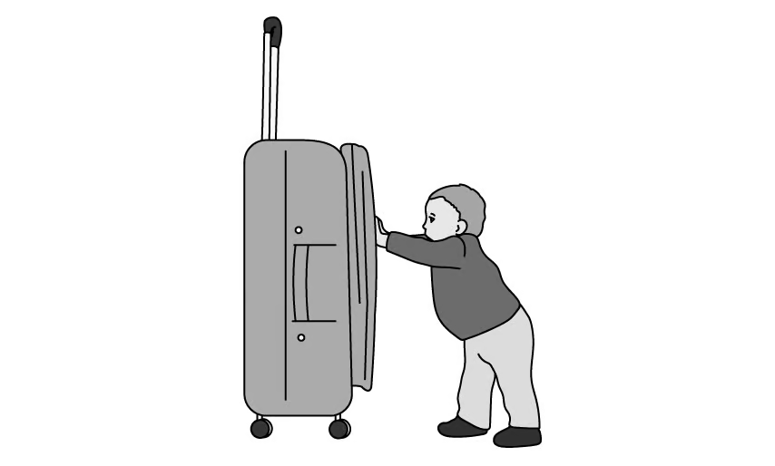
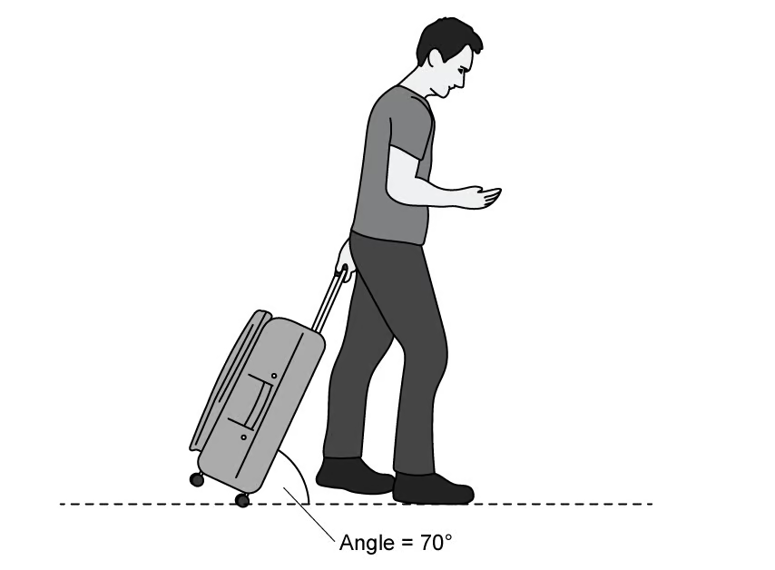
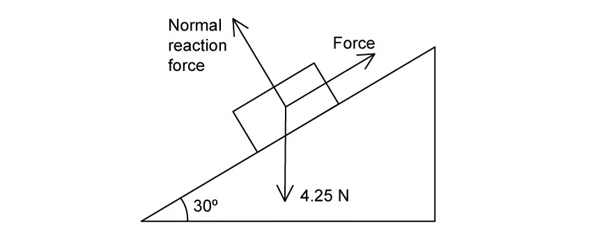
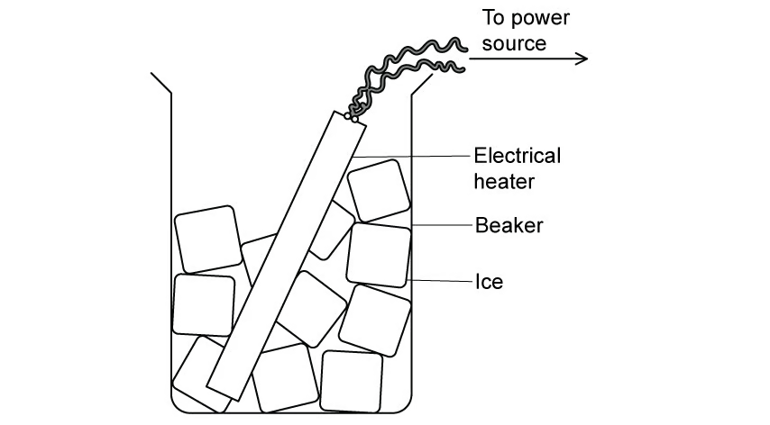
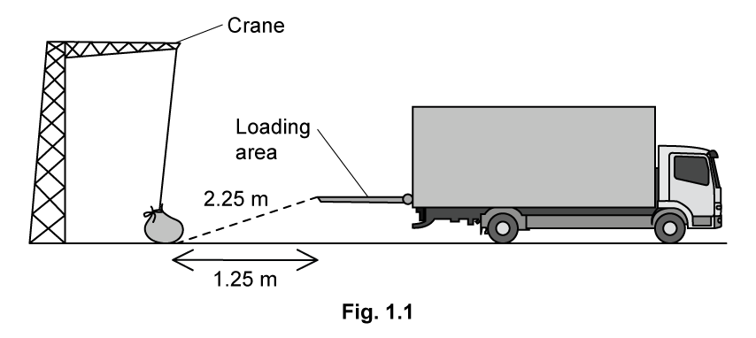
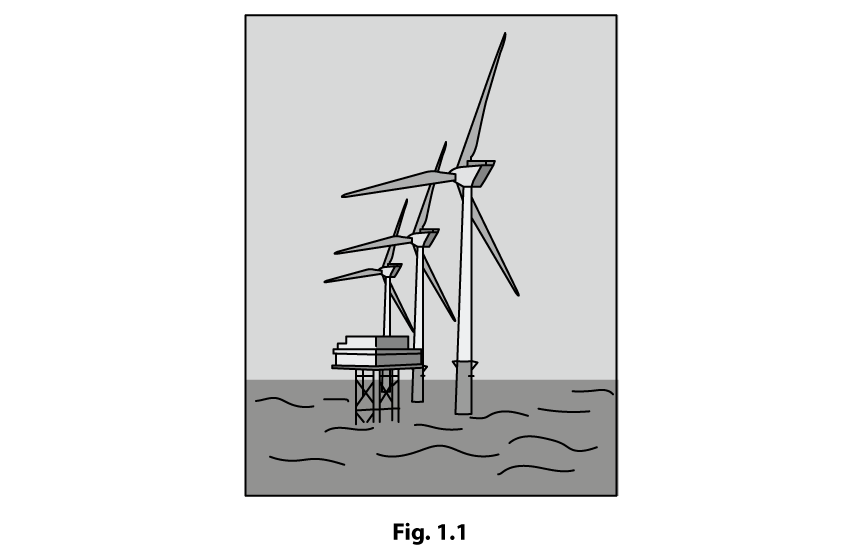
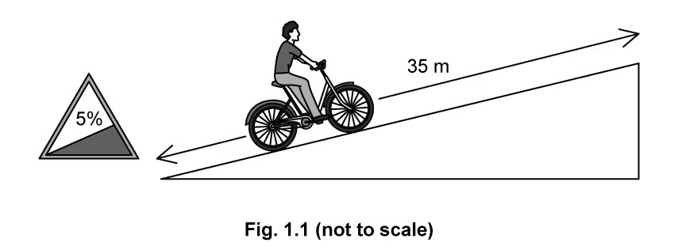
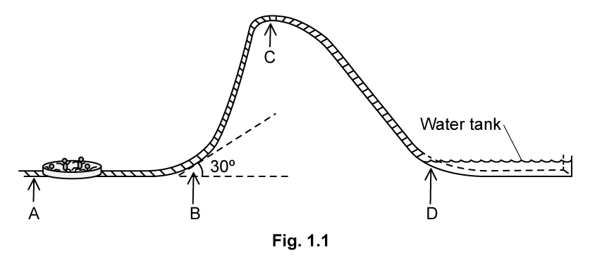
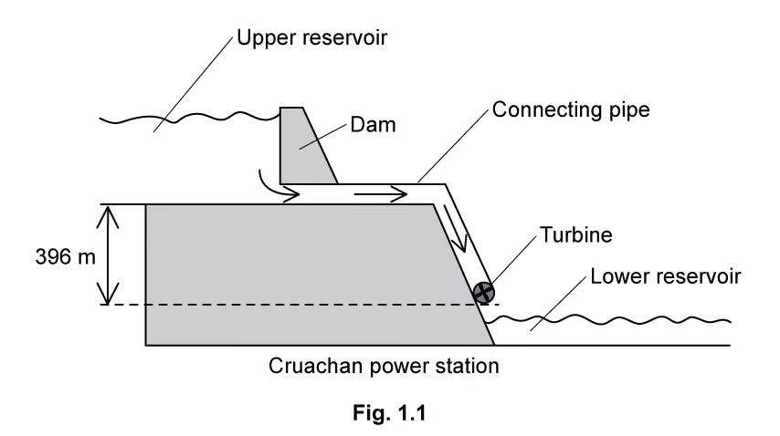

### 5.1 Energy Conservation - Easy

::: {.question-card}
#### Example 1 · 5.1 SQ Easy Q1

**(a)** A small child does work on a large suitcase by pushing it along a smooth floor, as shown in Fig. 1.1.

{.question-figure fig-alt="Child pushing a suitcase along a smooth floor"}

State the definition of work done and write the equation. `[2 marks]`

**(b)** The suitcase is moved back to its original position by an adult who pulls it at an angle of $70^\circ$ to the floor, as shown in Fig. 1.2.

{.question-figure fig-alt="Adult pulling a suitcase at 70 degrees to the floor"}

Write an expression for the work done on the suitcase by the adult in terms of force $F$, distance $d$ and the angle $70^\circ$. `[2 marks]`

**(c)** In moving the suitcase the child and adult both exerted equal forces of 20 N. They each move the suitcase a distance of 2.5 m.

Calculate the work done by:

**(i)** the child; `[2]`

**(ii)** the adult. `[2]`

`[4 marks]`

**(d)** State whether the child or the adult are more efficient at moving the suitcase, explaining your reasoning. `[3 marks]`

Show mark scheme / model answer

- **(a)** Work done is force multiplied by the distance moved in the direction of the force: $W=F\times d$. `[2]`
- **(b)** Only the horizontal component of the pull does work: $W=Fd\cos70^\circ$. `[2]`
- **(c)(i)** Child: $W=20\times2.5=50\ \mathrm{J}$. `[2]`
- **(c)(ii)** Adult: $W=20\times2.5\times\cos70^\circ=17\ \mathrm{J}$. `[2]`
- **(d)** The adult is more efficient because less work (or energy) is needed to move the suitcase the same distance; `[2]` the adult's force is partly vertical, so less energy is wasted (or the wheels reduce friction with the floor). `[1]`

:::

::: {.question-card}
#### Example 2 · 5.1 SQ Easy Q2

A block of weight $4.25\times10^3\ \mathrm{N}$ is placed on a frictionless slope inclined at $30^\circ$ to the horizontal as shown in Fig. 1.1.

{.question-figure fig-alt="Block on a frictionless slope inclined at 30 degrees to the horizontal"}

The block is moved up the slope at constant speed by applying a force parallel to the slope.

**(a)** Calculate the component of the weight of the block which acts parallel to the slope. `[2 marks]`

**(b)** Calculate the work done in moving the block a distance of 6.0 m up the slope. `[2 marks]`

**(c)** The block in part (a) is pushed 6.0 m up the slope in 18 s.

Calculate the power needed to move the block in this amount of time. `[2 marks]`

Show mark scheme / model answer

- **(a)** Component parallel to slope $=W\sin30^\circ=4.25\times10^3\times0.5=2.1\times10^3\ \mathrm{N}$. `[2]`
- **(b)** Work done $=F s=2.1\times10^3\times6.0=1.28\times10^4\ \mathrm{J}$. `[2]`
- **(c)** Power $=W/t=1.28\times10^4/18=708\ \mathrm{W}$. `[2]`

:::

::: {.question-card}
#### Example 3 · 5.1 SQ Easy Q3

A beaker is filled with ice and then an electric heater is placed into it, as shown in Fig. 1.1. The heater is turned on and heats up until it glows red.

{.question-figure fig-alt="Electric heater placed in a beaker of ice"}

A student states that when the ice is being heated up the total amount of energy in the ice remains the same.

**(a)** State the principle of conservation of energy. `[2 marks]`

**(b)** Explain whether the student is correct, giving your reason. `[3 marks]`

Show mark scheme / model answer

- **(a)** Energy cannot be created or destroyed, but it can be transferred from one form to another. `[2]`
- **(b)** The student is not correct. `[1]` Energy is transferred from the electrical supply to the heater, `[1]` and then to the ice as thermal energy, so the energy of the ice increases. `[1]`

:::

### 5.1 Energy Conservation - Medium

::: {.question-card}
#### Example 4 · 5.1 SQ Medium Q1

**(a)** Define work done by a force. `[1 mark]`

**(b)** A heavy bag is pulled across a rough surface at a constant speed.

Describe and explain how work is done in this situation. `[2 marks]`

**(c)** A crane is used to lift the bag from the ground onto the loading area of a truck.

Fig. 1.1 shows the crane moving the bag from the ground to the truck.

{.question-figure fig-alt="Crane lifting a bag from the ground to a truck loading area"}

The mass of the bag is 64 kg. The crane takes 0.1 minutes to lift the bag from the ground to the loading area of the truck.

Calculate the rate of work done by the crane when moving the bag. `[3 marks]`

**(d)** The crane is powered using an electric motor. The efficiency of the crane is 74%.

The crane is used to load approximately 400 bags with an average mass of 60 kg each day.

**(i)** Calculate the power used by the crane's motor to lift the bag in part (c). `[3]`

**(ii)** The typical working efficiency of a crane is 80%.

Explain how the difference in efficiency may affect the number of bags the crane can lift in a day. `[2]`

**(iii)** Suggest one change which could increase the efficiency of the motor and explain how it would achieve this. `[2]`

`[6 marks]`

Show mark scheme / model answer

- **(a)** Work done is force multiplied by the displacement in the direction of the force. `[1]`
- **(b)** Work is done against friction between the bag and the ground, `[1]` transferring energy to thermal energy of the bag and the surface. `[1]`
- **(c)** Vertical height lifted: $\Delta h=\sqrt{2.25^2-1.25^2}=1.871\ \mathrm{m}$. `[1]` Work done $=mg\Delta h=64\times9.81\times1.871=1175\ \mathrm{J}$. `[1]` Power $=1175/6=196\approx200\ \mathrm{W}$. `[1]`
- **(d)(i)** Motor power $=200/0.74=270\ \mathrm{W}$. `[3]`
- **(d)(ii)** At higher efficiency less input energy is needed for the same useful work. `[1]` At 80% the motor needs $120\ \mathrm{J}$ less per bag, so over 400 bags it saves $48\,000\ \mathrm{J}$, equivalent to about 44 extra bags per day. `[1]`
- **(d)(iii)** Lubricate or oil the moving parts, `[1]` which reduces energy losses due to friction and heat. `[1]` (Alternative: tighten loose parts to reduce losses due to sound and vibration.)

:::

::: {.question-card}
#### Example 5 · 5.1 SQ Medium Q2

**(a)** Engineers around the world are working on ways to provide enough energy to sustain human activity. Off-shore wind farms use the kinetic energy of strong offshore winds to generate electricity.

Fig. 1.1 shows an offshore wind power installation.

{.question-figure fig-alt="Offshore wind power installation"}

State the definition of power and give the units used to measure power output. `[1 mark]`

**(b)** The UK is a world leader in the installation of offshore wind power.

Located in the North Sea off the east coast of England, the Hornsea Phase 2 offshore wind farm was the largest wind farm in the world when it opened in 2022. It uses 165 turbines rated at 8 MW each, to generate 1.4 GW of energy, enough to supply more than 1.3 million homes. Each turbine has blades of length 81 m.

The power output of a single turbine can be calculated using

$$P=\frac{1}{2}\rho Av^3,$$

where $\rho$ is the density of the air, $A$ is the area swept out by the blades and $v$ is the wind speed.

Calculate the average wind speed at Hornsea Two. The density of air is $1.225\ \mathrm{kg\,m^{-3}}$. `[3 marks]`

**(c)** The Hornsea wind turbines are found to have an efficiency of 40%.

**(i)** Calculate the energy required from the wind every second to achieve the desired power output. `[2]`

**(ii)** Explain why it is impossible to transfer all the energy available from the wind. `[3]`

`[5 marks]`

Show mark scheme / model answer

- **(a)** Power is the rate of transfer of energy (or the rate of doing work); the unit is the watt (W). `[1]`
- **(b)** Area swept $A=\pi r^2=\pi(81)^2=20\,600\ \mathrm{m^2}$. `[1]` Rearranging $P=\frac{1}{2}\rho Av^3$ gives $v=\sqrt[3]{\frac{2P}{\rho A}}=\sqrt[3]{\frac{2\times8\times10^6}{1.225\times20\,600}}$. `[1]` $v=8.6\ \mathrm{m\,s^{-1}}$. `[1]`
- **(c)(i)** Power input $=1.4\times10^9/0.40=3.5\times10^9\ \mathrm{J}$ per second. `[2]`
- **(c)(ii)** The wind's energy is in the form of kinetic energy. `[1]` To extract all of it the wind would have to stop moving, `[1]` which would prevent further air from reaching the turbine. `[1]`

:::

::: {.question-card}
#### Example 6 · 5.1 SQ Medium Q3

**(a)** A hybrid electric bike is fitted with both pedals and a battery. The cyclist can use pedals only, pedals and battery, or battery only as they ride. Fig. 1.1 shows a cyclist riding a hybrid electric bike up an inclined road.

{.question-figure fig-alt="Cyclist riding a hybrid electric bike up an inclined road"}

At one hill the cyclist switches to battery only. A road sign at the base of the hill states that it has an incline of 5%, meaning that for every 100 m travelled horizontally, the height increases by 5 m.

The bike travels at a steady speed of $6.0\ \mathrm{m\,s^{-1}}$.

The mass of the rider and bike combined is 72.8 kg. The distance from the base to the top of the hill is 35 m.

Calculate the minimum power required from the battery. Assume that there is no energy loss due to friction. `[5 marks]`

**(b)** Near the top of the hill, the cyclist stops pedalling and the bicycle freewheels for 1.6 s until coming to a stop.

The frictional forces which slow down the motion are constant.

**(i)** Show that the bicycle travels about 5 m before coming to a stop. `[2]`

**(ii)** Calculate the magnitude of the frictional force which slows the bicycle down. `[3]`

`[5 marks]`

**(c)** Once the cyclist reaches the top, they turn off the motor and head back down to the bottom. At the bottom of the hill, they reach a velocity of $8.8\ \mathrm{m\,s^{-1}}$.

**(i)** Calculate the energy the cyclist has at the top of the hill. `[2]`

**(ii)** Calculate the energy the cyclist has at the bottom of the hill. `[2]`

**(iii)** Compare the two values you have calculated and suggest a reason for the difference. `[3]`

`[7 marks]`

Show mark scheme / model answer

- **(a)** Angle of incline: $\theta=\tan^{-1}(5/100)=2.86^\circ$. `[1]` Force parallel to slope $=mg\sin\theta=72.8\times9.81\times\sin2.86^\circ=35.6\ \mathrm{N}$. `[1]` Height gained in 35 m: $35\sin2.86^\circ=1.75\ \mathrm{m}$. `[1]` Power $=Fv=35.6\times6.0=213.6\ \mathrm{W}$. `[2]`
- **(b)(i)** Average speed during freewheeling $=(6.0+0)/2=3.0\ \mathrm{m\,s^{-1}}$; distance $=3.0\times1.6=4.8\ \mathrm{m}\approx5\ \mathrm{m}$. `[2]`
- **(b)(ii)** Deceleration $a=(0-6.0)/1.6=3.75\ \mathrm{m\,s^{-2}}$. `[1]` Frictional force $=ma=72.8\times3.75=273\ \mathrm{N}$. `[2]`
- **(c)(i)** GPE at top $=mg\Delta h=72.8\times9.81\times1.75=1250\ \mathrm{J}$. `[2]`
- **(c)(ii)** KE at bottom $=\frac{1}{2}mv^2=\frac{1}{2}\times72.8\times8.8^2=2820\ \mathrm{J}$. `[2]`
- **(c)(iii)** The energy at the bottom is larger than at the top. `[1]` The cyclist has done work (pedalling or battery energy) during the descent, `[1]` and/or frictional losses are smaller than the input energy. `[1]`

:::

::: {.question-card}
#### Example 7 · 5.1 SQ Medium Q4

Fig. 1.1 shows a ride at a water park. Customers are seated in a circular glider which is subject to an accelerating force at point A.

{.question-figure fig-alt="Water park ride with a circular glider accelerated from A to B"}

The first part of the ride is horizontal. In this section, the glider is accelerated from rest at point A to $30\ \mathrm{m\,s^{-1}}$ at point B. At point B, the track is angled at $30^\circ$ to the horizontal for 2.5 m.

The total mass of the glider and passengers is 350 kg.

**(a)** Calculate the work done by the glider against gravity when it travels through point B. `[3 marks]`

**(b)**

**(i)** Calculate the maximum height above A that the passengers and glider could reach. `[3]`

**(ii)** Point C is 28 m above A.

Suggest why the ride is built to this height instead of the maximum height calculated in (i). `[1]`

`[4 marks]`

**(c)** At point C, the glider stops momentarily before sliding down the incline until it lands in the water pool at point D with a speed of $22\ \mathrm{m\,s^{-1}}$.

Determine the efficiency of the energy transfer between points C and D. `[3 marks]`

**(d)** Once the glider reaches point D, the water applies a decelerating force until it comes to a stop after 8.5 m.

Calculate the decelerating force exerted on the glider by the water. State any assumptions you made in your calculation. `[3 marks]`

Show mark scheme / model answer

- **(a)** $W=mgs\cos\theta=350\times9.81\times2.5\times\cos30^\circ$. `[2]` $W=7434=7400\ \mathrm{J}$ (2 s.f.). `[1]`
- **(b)(i)** $\frac{1}{2}mv^2=mg\Delta h$, so $\Delta h=v^2/(2g)=30^2/(2\times9.81)$. `[2]` $\Delta h=45.87\approx46\ \mathrm{m}$. `[1]`
- **(b)(ii)** The ride is built lower than the maximum height for safety, or because energy losses make the theoretical maximum unattainable. `[1]`
- **(c)** GPE at C $=350\times9.81\times28=9.61\times10^4\ \mathrm{J}$; KE at D $=\frac{1}{2}\times350\times22^2=8.47\times10^4\ \mathrm{J}$. `[2]` Efficiency $=8.47/9.61=88\%$. `[1]`
- **(d)** Deceleration $a=v^2/(2s)=22^2/(2\times8.5)=28.5\ \mathrm{m\,s^{-2}}$. `[1]` Force $=ma=350\times28.5\approx9800\ \mathrm{N}$. `[1]` Assumption: the decelerating force (or acceleration) is constant. `[1]`

:::

::: {.question-card}
#### Example 8 · 5.1 SQ Medium Q5

Pumped hydroelectric systems store large bodies of water behind a dam. When electricity is needed in the grid, the dam is lifted, allowing water to flow from the upper reservoir.

One such power station, known as the Cruachan power station, is shown in Fig. 1.1. This facility has been producing hydroelectric power since 1965.

{.question-figure fig-alt="Cruachan pumped hydroelectric power station with upper and lower reservoirs"}

The vertical distance between the base of the upper reservoir and the turbine is 396 m. This arrangement allows Cruachan power station to produce a power output of 0.62 GW with an efficiency of 76%.

**(a)** Determine the energy transferred by the water each second in order to achieve this power output. `[2 marks]`

**(b)** Water is made to flow out of the upper reservoir through connecting pipes at a rate of $200\ \mathrm{m^3}$ per second. The density of water is $1.0\times10^3\ \mathrm{kg\,m^{-3}}$.

**(i)** Use this flow rate to determine the energy transferred by the water each second. `[4]`

**(ii)** Explain why this value is not consistent with the energy transfer rate calculated in (a). `[1]`

`[5 marks]`

**(c)** Estimate the depth of the water held in the upper reservoir. State any assumptions made. `[3 marks]`

Show mark scheme / model answer

- **(a)** Power input $=0.62/0.76=0.816\ \mathrm{GW}$. `[1]` Energy transferred each second $=0.82\ \mathrm{GJ}=8.2\times10^8\ \mathrm{J}$. `[1]`
- **(b)(i)** Mass flow rate $=200\times1.0\times10^3=2.0\times10^5\ \mathrm{kg\,s^{-1}}$. `[1]` Energy per second $=\dot{m}g\Delta h$. `[1]` $=2.0\times10^5\times9.81\times396$. `[1]` $=7.8\times10^8\ \mathrm{J\,s^{-1}}$. `[1]`
- **(b)(ii)** The value differs because the effective head is less than 396 m, or because some energy is lost in the pipes and turbine. `[1]`
- **(c)** Let the depth be $h$. Equating the energy available with the required input gives an estimate of the depth, assuming the full 396 m head and no losses in the pipe. `[2]` The calculation gives a depth of the order of a few tens of metres, depending on the assumptions used. `[1]`

:::
