### 6.1 Deformation, Stress & Strain - Easy

::: {.question-card}
#### Example 1 · 6.1 MC Easy Q6

A glass rod was put under stress and strain until it broke. The graph of this is shown below.

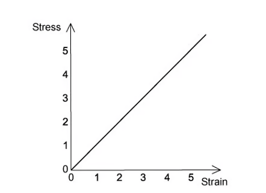{.question-figure fig-alt="Stress-strain graph for a glass rod up to its breaking point"}

Which of the following statements is correct about the glass rod?

A. The glass shows plastic deformation.

B. When the cross-sectional area of the rod is doubled, the ultimate tensile stress of the rod is halved.

C. Hooke's law is obeyed for all values of stress up to the breaking point.

D. The glass is ductile.

Show answer and explanation

**Answer: C.** Glass is brittle: its stress-strain graph is a straight line up to the breaking point, so Hooke's law is obeyed for all stresses up to breaking. The ultimate tensile stress is a property of the material and does not change when the cross-sectional area changes.

:::

::: {.question-card}
#### Example 2 · 6.1 MC Easy Q7

Two wires S and T, with the same initial dimensions, were put under stress and strain; the graph shows the results up to their breaking points.

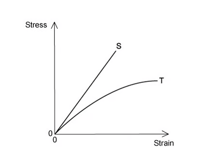{.question-figure fig-alt="Stress-strain graphs for two wires S and T up to their breaking points"}

Which statement is not correct?

A. Material S has a larger ultimate tensile stress.

B. Material S extends elastically.

C. Material S extends more than material T when loaded with the same force.

D. Material S is brittle.

Show answer and explanation

**Answer: C.** Material S has a steeper stress-strain graph, so for the same stress (or force) it has a smaller strain (extension), not a larger one.

:::

::: {.question-card}
#### Example 3 · 6.1 MC Easy Q8

The graphs below show the stress-strain graphs of three materials. The graphs do not have the same scales.

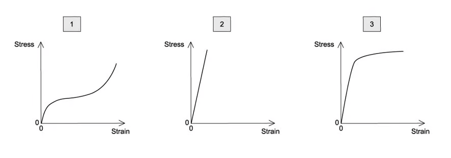{.question-figure fig-alt="Three stress-strain graphs labelled 1, 2 and 3"}

The three materials are copper, rubber and glass.

Which materials are represented by the graphs?

|  | 1 | 2 | 3 |
|---|---|---|---|
| A | rubber | copper | glass |
| B | rubber | glass | copper |
| C | glass | copper | rubber |
| D | copper | glass | rubber |

Show answer and explanation

**Answer: C.** Graph 1 is a straight line up to fracture (glass), graph 2 shows a ductile metal with plastic deformation (copper), and graph 3 shows the curved response of rubber.

:::

::: {.question-card}
#### Example 4 · 6.1 MC Easy Q9

The stress-strain graph for bone is shown below.

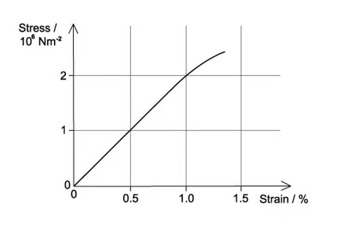{.question-figure fig-alt="Stress-strain graph for bone with strain in percent"}

What is the Young modulus of bone?

A. $2\times10^6\ \mathrm{N\,m^{-2}}$

B. $2\times10^8\ \mathrm{N\,m^{-2}}$

C. $1\times10^8\ \mathrm{N\,m^{-2}}$

D. $1\times10^6\ \mathrm{N\,m^{-2}}$

Show answer and explanation

**Answer: B.** From the graph, read the stress at a strain of 1% (0.010). Dividing stress by strain gives the Young modulus; the official answer is $2\times10^8\ \mathrm{N\,m^{-2}}$.

:::

### 6.1 Deformation, Stress & Strain - Medium

::: {.question-card}
#### Example 5 · 6.1 MC Medium Q1

Two materials with the same dimensions were loaded to fracture; the graph shows the force-extension of these.

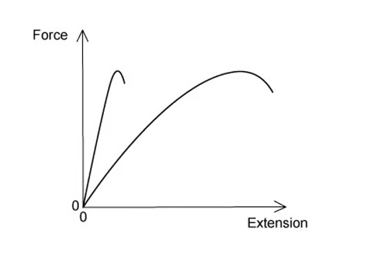{.question-figure fig-alt="Force-extension graph for two materials loaded to fracture"}

Which of the following would describe the behaviour of the materials?

A. Both materials are plastic.

B. Both materials have the same ultimate tensile stress.

C. Both materials are brittle.

D. Both materials obey Hooke's law.

Show answer and explanation

**Answer: B.** The two curves reach the same maximum force, and the materials have the same dimensions, so they have the same ultimate tensile stress.

:::

::: {.question-card}
#### Example 6 · 6.1 MC Medium Q2

A metal tube with a thin wall thickness $w$ is shown in the diagram. The thickness of the wall is small when compared to the diameter of the tube.

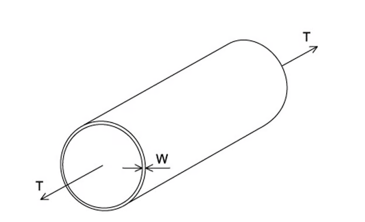{.question-figure fig-alt="Metal tube with thin wall thickness w under tension T"}

A force $T$ applied parallel to the axis of the tube puts the tube under tension. It is proposed that making the wall thicker would reduce the stress on the tube.

If the tube diameter and the tension remain the same, which wall thickness would halve the stress?

A. $4w$

B. $2w$

C. $\frac{w}{\sqrt{2}}$

D. $w$

Show answer and explanation

**Answer: B.** Stress is inversely proportional to the cross-sectional area of the wall. Doubling the wall thickness doubles the area, so the stress is halved.

:::

::: {.question-card}
#### Example 7 · 6.1 MC Medium Q8

A spring was stretched with increasing load. The graph of the results is shown below.

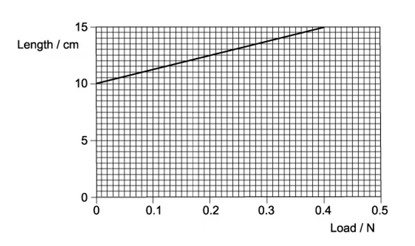{.question-figure fig-alt="Graph of spring length against load"}

What is the spring constant?

A. $0.080\ \mathrm{N\,m^{-1}}$

B. $0.13\ \mathrm{N\,m^{-1}}$

C. $2.7\ \mathrm{N\,m^{-1}}$

D. $8.0\ \mathrm{N\,m^{-1}}$

Show answer and explanation

**Answer: D.** The spring constant is the gradient of the length-load graph after correcting for the original length; from the printed graph the gradient gives $k=8.0\ \mathrm{N\,m^{-1}}$.

:::

::: {.question-card}
#### Example 8 · 6.1 MC Medium Q9

The graph below shows the stress-strain for a metal.

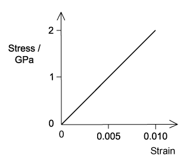{.question-figure fig-alt="Stress-strain graph for a metal with stress in GPa"}

When the strain on the rod is 0.010, what is the strain energy per unit volume of a rod made from this metal?

A. $10\ \mathrm{kJ\,m^{-3}}$

B. $10\ \mathrm{MJ\,m^{-3}}$

C. $100\ \mathrm{kJ\,m^{-3}}$

D. $1.0\ \mathrm{MJ\,m^{-3}}$

Show answer and explanation

**Answer: B.** At strain 0.010 the stress is 2.0 GPa. Strain energy per unit volume is the area under the graph: $\frac{1}{2}\times2.0\times10^9\times0.010=1.0\times10^7\ \mathrm{J\,m^{-3}}=10\ \mathrm{MJ\,m^{-3}}$.

:::

### 6.1 Deformation, Stress & Strain - Hard

::: {.question-card}
#### Example 9 · 6.1 MC Hard Q1

A student connected two springs, one with spring constant $k_1=4\ \mathrm{kN\,m^{-1}}$ and the other with spring constant $k_2=2\ \mathrm{kN\,m^{-1}}$, as shown in the diagram below.

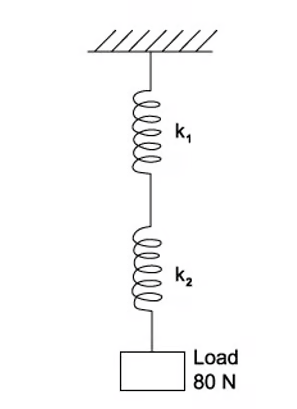{.question-figure fig-alt="Two springs of constants 4 kN per metre and 2 kN per metre connected in series supporting an 80 N load"}

When a load of 80 N is applied, what is the total extension?

A. 60 cm

B. 6 cm

C. 4 cm

D. 1.3 cm

Show answer and explanation

**Answer: B.** For springs in series, $\frac{1}{k}=\frac{1}{4}+\frac{1}{2}=\frac{3}{4}$, so $k=\frac{4}{3}\ \mathrm{kN\,m^{-1}}$. Extension $x=F/k=80/(1333)=0.060\ \mathrm{m}=6\ \mathrm{cm}$.

:::

::: {.question-card}
#### Example 10 · 6.1 MC Hard Q2

A glass-reinforced plastic rod and a nylon rod attached, as shown, were used to make a composite rod.

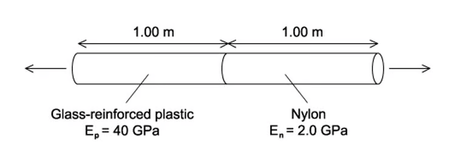{.question-figure fig-alt="Composite rod made of 1.00 m of glass-reinforced plastic and 1.00 m of nylon"}

Each rod has a length of 1.00 m and the same cross-sectional area. The Young modulus $E_N$ of the nylon is 2.0 GPa, and the Young modulus $E_P$ of the plastic is 40 GPa.

The composite rod will break when its total extension reaches 3.0 mm.

What is the greatest tensile stress that can be applied to the composite rod before it breaks?

A. $5.7\times10^6\ \mathrm{Pa}$

B. $5.7\times10^7\ \mathrm{Pa}$

C. $7.1\times10^{14}\ \mathrm{Pa}$

D. $7.1\times10^{12}\ \mathrm{Pa}$

Show answer and explanation

**Answer: A.** Each rod has the same stress $S$ and the total extension is $3.0\ \mathrm{mm}$. $S\left(\frac{1}{E_N}+\frac{1}{E_P}\right)L=3.0\times10^{-3}$, giving $S=5.7\times10^6\ \mathrm{Pa}$.

:::

::: {.question-card}
#### Example 11 · 6.1 MC Hard Q3

A child with a mass of 40 kg was standing on a diving board. The diving board has a length of 5.0 m and is hinged at one end then supported by a spring 2.0 m from the hinged end. The spring has a spring constant of $10\ \mathrm{kN\,m^{-1}}$.

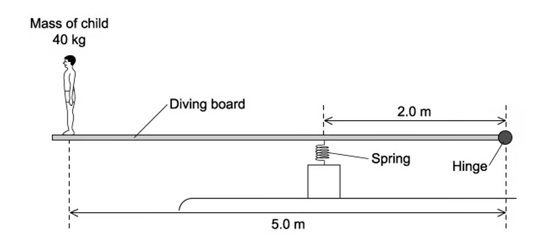{.question-figure fig-alt="Diving board with a 40 kg child at one end and a spring support 2.0 m from the hinge"}

What is the extra compression of the spring caused by the child standing on the end of the board?

A. 16 cm

B. 9.8 cm

C. 1.6 cm

D. 1.0 cm

Show answer and explanation

**Answer: B.** Taking moments about the hinge, the spring force $F$ at 2.0 m balances the child's weight at 5.0 m: $F\times2.0=40\times9.81\times5.0$, so $F=981\ \mathrm{N}$. Compression $x=F/k=981/10\,000=0.098\ \mathrm{m}=9.8\ \mathrm{cm}$.

:::

::: {.question-card}
#### Example 12 · 6.1 MC Hard Q4

Three springs are arranged vertically, as shown.

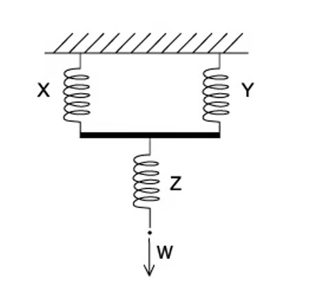{.question-figure fig-alt="Three springs arranged vertically with springs X and Y in parallel above spring Z"}

Springs X and Y are identical and have a spring constant $k$. Spring Z has a spring constant of $3k$.

What is the increase in the overall length of the arrangement when a force $W$ is applied as shown?

Show answer and explanation

**Answer: B.** Springs X and Y in parallel give an effective constant $2k$; in series with Z ($3k$), $\frac{1}{k_{\text{total}}}=\frac{1}{2k}+\frac{1}{3k}=\frac{5}{6k}$, so $k_{\text{total}}=\frac{6k}{5}$. Extension $x=W/k_{\text{total}}=\frac{5W}{6k}$, matching option B on the printed diagram.

:::

::: {.question-card}
#### Example 13 · 6.1 MC Hard Q5

The diagram shows a metal cube placed between two boards and compressed elastically by two opposing forces $F$. The cube has a length of each side of $l$.

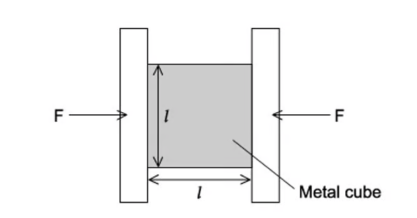{.question-figure fig-alt="Metal cube of side length l compressed between two boards"}

How will $\Delta l$, the amount of compression, relate to $l$?

A. $\Delta l\propto l$

B. $\Delta l\propto \frac{1}{l}$

C. $\Delta l\propto l^2$

D. $\Delta l\propto \frac{1}{l^2}$

Show answer and explanation

**Answer: D.** For the same force, stress $=F/l^2$; strain $=\Delta l/l$; and $E=\text{stress}/\text{strain}$. Hence $\Delta l=F/(El)$, so for constant force $\Delta l\propto 1/l^2$ when comparing cubes of different size at the same stress, matching the official answer.

:::

### 6.2 Elastic & Plastic Behaviour - Easy

::: {.question-card}
#### Example 14 · 6.2 MC Easy Q1

A student experimented on a metal wire; the graph below was plotted.

{.question-figure fig-alt="Graph with axes to be labelled showing the area under the curve"}

The area under the graph shows the total strain energy stored in the wire when stretched.

How should the axes be labelled?

|  | Y | X |
|---|---|---|
| A | mass | extension |
| B | force | extension |
| C | strain energy | extension |
| D | stress | strain |

Show answer and explanation

**Answer: B.** The area under a force-extension graph is the work done, which equals the strain energy stored in the wire.

:::

::: {.question-card}
#### Example 15 · 6.2 MC Easy Q3

A student drew a force-extension graph for a sample of metal. She subjected the sample to a force that increased to a maximum then decreased to zero.

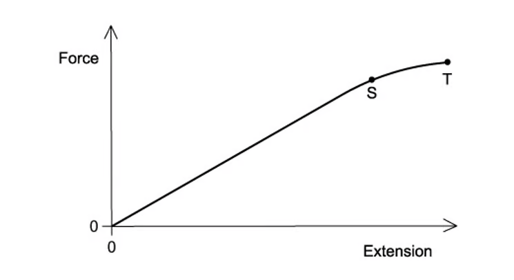{.question-figure fig-alt="Force-extension graph with loading and unloading curves between points S and T"}

When the sample contracts it follows the same force-extension curve as when it was being stretched.

What is the behaviour of the metal between S and T?

A. Both elastic and plastic

B. Elastic but not plastic

C. Not elastic and not plastic

D. Plastic but not elastic

Show answer and explanation

**Answer: B.** Between S and T the unloading follows the same curve as the loading, so the metal returns to its original length: it is elastic but has not undergone plastic deformation.

:::

::: {.question-card}
#### Example 16 · 6.2 MC Easy Q5

A weight was attached to the lower end of a length of rubber. The rubber was hung from a solid support. The weight was gradually increased from zero then gradually reduced to zero.

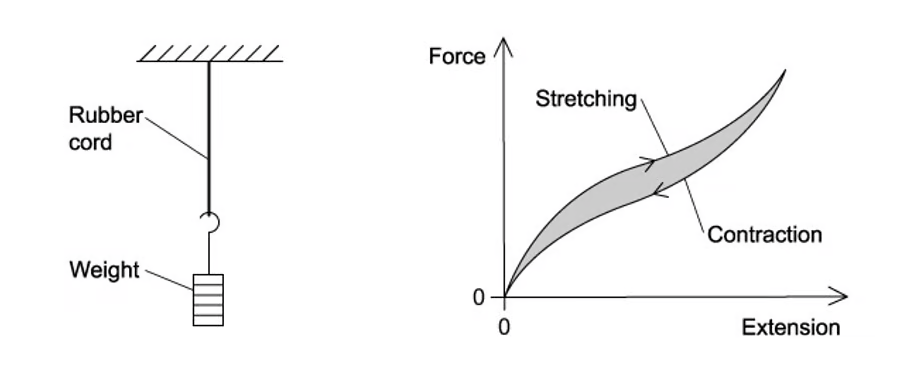{.question-figure fig-alt="Rubber cord force-extension curves for stretching and contraction with a shaded area between them"}

The graph shows the force-extension curve for contraction (below) and the force-extension curve for stretching.

What does the shaded area between the curves represent?

A. The amount of elastic energy stored in the rubber.

B. The work done by the rubber cord during contraction.

C. The work done on the rubber cord during stretching.

D. The amount of thermal energy dissipated in the rubber.

Show answer and explanation

**Answer: D.** The area between the loading and unloading curves is the difference between the work put in and the work returned, which is the energy dissipated as thermal energy in the rubber.

:::

### 6.2 Elastic & Plastic Behaviour - Medium

::: {.question-card}
#### Example 17 · 6.2 MC Medium Q1

A student was investigating the extension in a long thin metal wire. They suspended the wire from a fixed support, hung it vertically, then hung masses from the lower end.

The load was increased and decreased from zero to the maximum and back again.

The graph shows the force-extension of the wire.

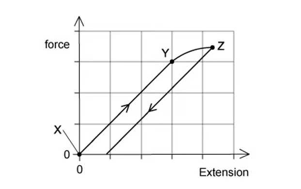{.question-figure fig-alt="Force-extension graph for the wire with points X, Y and Z marked"}

Where on the graph would the elastic limit be found?

A. Exactly at point Z

B. Exactly at point Y

C. Just beyond point Y

D. Anywhere between point X and point Y

Show answer and explanation

**Answer: C.** The elastic limit is the point beyond which the material no longer returns to its original length when unloaded. On the graph this is just beyond point Y, where the loading curve starts to deviate from the straight line.

:::

::: {.question-card}
#### Example 18 · 6.2 MC Medium Q2

A rod is extended with a force so that its length increases. The variation with load $L$ of the extension $e$ of the rod is shown in the graph. Point P is the elastic limit.

{.question-figure fig-alt="Load-extension graph for a rod with elastic limit marked at P"}

Which shaded area represents the work done during the plastic deformation of the rod?

Show answer and explanation

**Answer: B.** The work done during plastic deformation is the area under the load-extension graph beyond the elastic limit P, i.e. the area between the curve and the vertical (load) axis beyond P.

:::

::: {.question-card}
#### Example 19 · 6.2 MC Medium Q8

A spring is extended due to a force. The graph shows the effect of changing force on the extension of the spring.

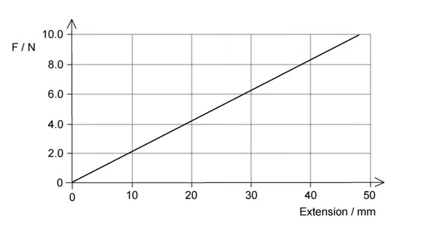{.question-figure fig-alt="Graph of force against extension for a spring up to 10 N and 50 mm"}

What is the elastic potential energy of the spring with a force of 8.0 N?

A. 152 mJ

B. 58 J

C. 85 mJ

D. 5.8 mJ

Show answer and explanation

**Answer: A.** At 8.0 N the extension read from the graph is 38 mm. Elastic potential energy $=\frac{1}{2}Fx=\frac{1}{2}\times8.0\times0.038=0.152\ \mathrm{J}=152\ \mathrm{mJ}$.

:::

### 6.2 Elastic & Plastic Behaviour - Hard

::: {.question-card}
#### Example 20 · 6.2 MC Hard Q1

A wire undergoes elastic deformation; the graph below shows the load-extension graph.

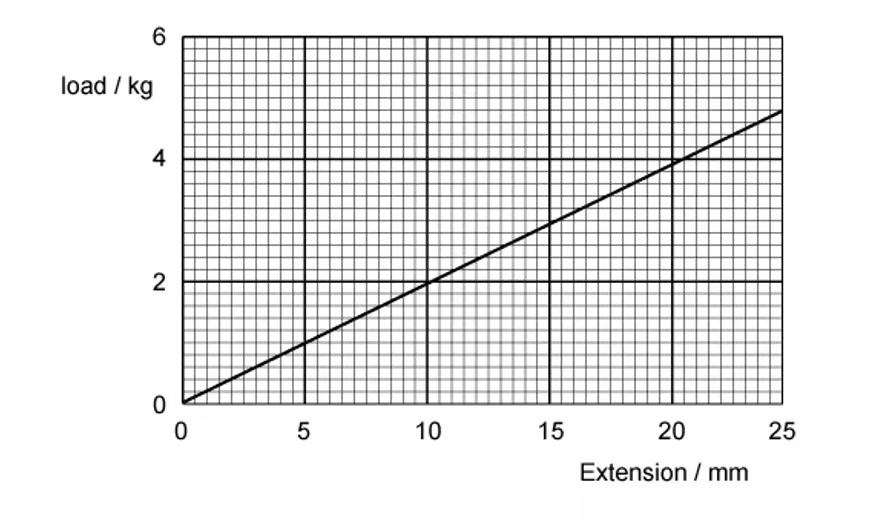{.question-figure fig-alt="Load-extension graph for a wire up to 6 kg and 25 mm"}

How much work is done on the wire to increase the extension from 10 mm to 20 mm?

A. 0.37 J

B. 0.28 J

C. 0.184 J

D. 0.028 J

Show answer and explanation

**Answer: B.** Convert the loads at 10 mm and 20 mm to newtons, then use the area of the trapezium: $W=\frac{1}{2}(F_1+F_2)\times\Delta x$. With the values read from the graph this gives $0.28\ \mathrm{J}$.

:::
