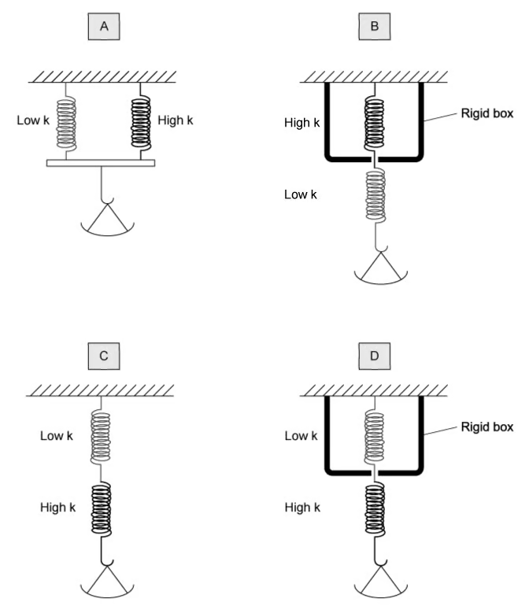
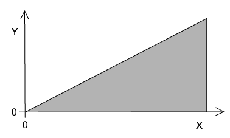
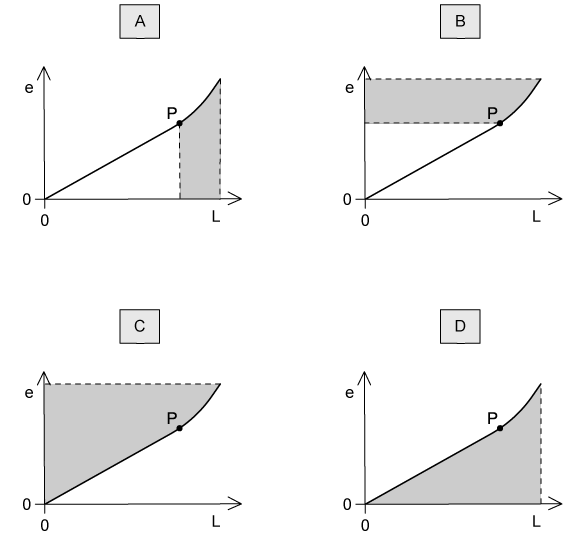

### 6.1 Deformation, Stress & Strain - Easy

::: {.question-card}
#### Example 1 · 6.1 MC Easy Q1

A student wanted to measure the Young modulus of a wire; to do this they needed to take a number of measurements.

In which row could the measurement not be made directly with the listed apparatus?

| Measurement | Apparatus |
|---|---|
| A | extension of wire | vernier scale |
| B | area of cross-section of wire | micrometer screw gauge |
| C | original length of wire | metre rule |
| D | mass of load applied to a wire | electronic balance |

Show answer and explanation

**Answer: B.** The micrometer measures the diameter of the wire; the cross-sectional area must then be calculated from the diameter, so it cannot be measured directly.

:::

::: {.question-card}
#### Example 2 · 6.1 MC Easy Q2

What is the unit of the Young modulus?

A. $\mathrm{N\,m^{-2}}$

B. $\mathrm{N\,m}$

C. $\mathrm{N\,m^{-1}}$

D. $\mathrm{N\,m^{2}}$

Show answer and explanation

**Answer: A.** The Young modulus is stress divided by strain; strain is dimensionless, so the unit is the unit of stress, $\mathrm{N\,m^{-2}}=\mathrm{Pa}$.

:::

::: {.question-card}
#### Example 3 · 6.1 MC Easy Q3

Which of the following is the definition of the ultimate tensile stress of a material?

A. The maximum inter-atomic force before the atomic bonds of the material break.

B. The maximum force that can be applied to a bar of the material before it bends.

C. The maximum tensile force in a wire of the material before it breaks.

D. The maximum stretching force per unit cross-sectional area before the material breaks.

Show answer and explanation

**Answer: D.** The ultimate tensile stress is the maximum tensile force per unit cross-sectional area that the material can withstand before it breaks.

:::

::: {.question-card}
#### Example 4 · 6.1 MC Easy Q4

A material is extended elastically within the limit of proportionality.

What is equal to the Young modulus of the material?

A. Gradient of the stress-strain graph.

B. Area under the force-extension graph.

C. Area under the stress-strain graph.

D. Gradient of the force-extension graph.

Show answer and explanation

**Answer: A.** The Young modulus is the ratio of stress to strain, which is the gradient of the stress-strain graph in the elastic region.

:::

### 6.1 Deformation, Stress & Strain - Medium

::: {.question-card}
#### Example 5 · 6.1 MC Medium Q3

A steel metal wire has the following properties:

- diameter $=5.0\times10^{-4}\ \mathrm{m}$
- Young modulus $=2.0\times10^{11}\ \mathrm{Pa}$
- tension $=20\ \mathrm{N}$

The string snaps and contracts elastically.

By what percentage does a length $l$ of a piece of the string contract?

A. $1.3\times10^{-2}\%$

B. $1.3\times10^{-4}\%$

C. $5.1\times10^{-4}\%$

D. $5.1\times10^{-2}\%$

Show answer and explanation

**Answer: D.** Stress $=\frac{F}{A}=\frac{20}{\pi(2.5\times10^{-4})^2}=1.02\times10^8\ \mathrm{Pa}$. Strain $=\sigma/E=1.02\times10^8/(2.0\times10^{11})=5.1\times10^{-4}$, which is $5.1\times10^{-2}\%$.

:::

::: {.question-card}
#### Example 6 · 6.1 MC Medium Q4

The Young modulus of a metal wire is dependent on which property?

A. Spring constant

B. Ductility

C. Ultimate tensile stress

D. Elastic limit

Show answer and explanation

**Answer: A.** From $k=EA/L$, the spring constant depends on $E$, $A$ and $L$, so the Young modulus is related to the spring constant. The Young modulus does not depend on ductility, ultimate tensile stress or elastic limit.

:::

::: {.question-card}
#### Example 7 · 6.1 MC Medium Q5

The Young modulus $E$ and the force per unit extension $k$ describe the behaviour of a wire under tensile stress.

For a wire of length $L$ and cross-sectional area $A$, what is the relationship between $E$ and $k$?

A. $E=\frac{kL}{A}$

B. $E=\frac{kA}{L}$

C. $k=\frac{EA}{L}$

D. $k=\frac{EL}{A}$

Show answer and explanation

**Answer: C.** The force per unit extension is $k=\frac{EA}{L}$.

:::

::: {.question-card}
#### Example 8 · 6.1 MC Medium Q7

A student wanted to find the Young modulus of a wire. The equation for the Young modulus $E$ is

$$E=\frac{4Fl}{\pi d^2 x}.$$

The student extended the wire with a known force and made a series of measurements.

Which measurement has the largest effect on the uncertainty in the value of the calculated Young modulus?

| Measurement | Symbol | Value |
|---|---|---|
| A | length of wire before force applied | $l$ | $2.043\pm0.002\ \mathrm{m}$ |
| B | force applied | $F$ | $19.62\pm0.01\ \mathrm{N}$ |
| C | extension of wire with force applied | $x$ | $5.2\pm0.2\ \mathrm{mm}$ |
| D | diameter of wire | $d$ | $0.54\pm0.02\ \mathrm{mm}$ |

Show answer and explanation

**Answer: D.** The percentage uncertainty in $d$ is $0.02/0.54=3.7\%$, and it contributes $2\times3.7\%=7.4\%$ because $d$ is squared. This is larger than the percentage uncertainties from the other measurements.

:::

::: {.question-card}
#### Example 9 · 6.1 MC Medium Q10

A steel spring was stretched to a length of 55 cm when a 25 N weight was hung from it. The spring has a spring constant of $150\ \mathrm{N\,m^{-1}}$.

What was the original length of the spring?

A. 0.61 m

B. 0.72 m

C. 0.38 m

D. 0.49 m

Show answer and explanation

**Answer: C.** Extension $x=F/k=25/150=0.167\ \mathrm{m}$. Original length $=0.55-0.167=0.383\ \mathrm{m}\approx0.38\ \mathrm{m}$.

:::

### 6.1 Deformation, Stress & Strain - Hard

::: {.question-card}
#### Example 10 · 6.1 MC Hard Q6

A metal wire that is supported vertically from a fixed point has a load of 84 N applied to the lower end. The wire has a cross-sectional area of $0.02\ \mathrm{mm^2}$ and obeys Hooke's law. The length of the wire increases by 0.30%.

What is the Young modulus of the metal wire?

A. $1.4\times10^{12}\ \mathrm{Pa}$

B. $1.4\times10^{10}\ \mathrm{Pa}$

C. $1.4\times10^8\ \mathrm{Pa}$

D. $1.4\times10^5\ \mathrm{Pa}$

Show answer and explanation

**Answer: A.** Stress $=84/(0.02\times10^{-6})=4.2\times10^9\ \mathrm{Pa}$; strain $=0.0030$. Young modulus $=4.2\times10^9/0.0030=1.4\times10^{12}\ \mathrm{Pa}$.

:::

::: {.question-card}
#### Example 11 · 6.1 MC Hard Q7

Two wires S and T are joined. S has a length of 3.0 m and T a length of 1.0 m; both wires have a uniform cross-sectional area.

When a load was hung from the wires, S stretched by 1.5 mm and T by 1.0 mm.

The same load is then hung from a second wire of the same cross-section, consisting of 1.0 m of metal S and 3.0 m of metal T.

What is the total extension of this second wire?

A. 3.5 mm

B. 2.5 mm

C. 5.0 mm

D. 4.8 mm

Show answer and explanation

**Answer: A.** Extension per metre: S gives $1.5/3.0=0.5\ \mathrm{mm\,m^{-1}}$ and T gives $1.0/1.0=1.0\ \mathrm{mm\,m^{-1}}$. For the second wire, extension $=1.0\times0.5+3.0\times1.0=3.5\ \mathrm{mm}$.

:::

::: {.question-card}
#### Example 12 · 6.1 MC Hard Q8

Two steel wires X and Y that both obey Hooke's law were used in an experiment. Wire X has a length $l$ and a cross-sectional area $A$. Wire Y has a length of $2l$ and a cross-sectional area of $\frac{A}{2}$.

What is the ratio $\frac{\text{tension in X}}{\text{tension in Y}}$ when both wires are stretched to the same extension?

A. 1

B. 4

C. 2

D. $\frac{1}{4}$

Show answer and explanation

**Answer: B.** For the same extension, $F=EAe/L$. $F_X=EAe/l$; $F_Y=E(A/2)e/(2l)=EAe/(4l)=F_X/4$. Hence $F_X/F_Y=4$.

:::

::: {.question-card}
#### Example 13 · 6.1 MC Hard Q9

In order to measure the mass of flour, a set of scales needs to have high sensitivity for small masses and a low sensitivity with larger masses.

To achieve this, two springs are used with different spring constants $k$. One has a lower spring constant than the other.

Which of the following sets of springs would be suitable for this purpose?

{.question-figure fig-alt="Four arrangements of springs with low and high spring constants"}

Show answer and explanation

**Answer: D.** The low-spring-constant spring provides high sensitivity for small masses, and the high-spring-constant spring takes over for larger masses, giving low sensitivity with larger loads.

:::

### 6.2 Elastic & Plastic Behaviour - Easy

::: {.question-card}
#### Example 14 · 6.2 MC Easy Q1

A student experimented on a metal wire; the graph below was plotted.

{.question-figure fig-alt="Graph with axes to be labelled showing the area under the curve"}

The area under the graph shows the total strain energy stored in the wire when stretched.

How should the axes be labelled?

|  | Y | X |
|---|---|---|
| A | mass | extension |
| B | force | extension |
| C | strain energy | extension |
| D | stress | strain |

Show answer and explanation

**Answer: B.** The area under a force-extension graph is the work done, which equals the strain energy stored in the wire.

:::

::: {.question-card}
#### Example 15 · 6.2 MC Easy Q2

Four rods were made from four different materials; all the rods had the same dimensions.

At room temperature, which of the following would sustain the biggest plastic deformation?

A. The ductile material steel

B. The brittle material glass

C. The brittle material carbon

D. The ductile material aluminium

Show answer and explanation

**Answer: D.** Aluminium is ductile and can sustain a larger plastic deformation than steel before breaking.

:::

::: {.question-card}
#### Example 16 · 6.2 MC Easy Q7

A metal wire had a tension $F$ and extension $x$ with a Young modulus of $E$; the wire obeyed Hooke's law.

Which expression represents the elastic strain energy stored in the wire?

A. $\frac{1}{2}Fx$

B. $Ex$

C. $\frac{1}{2}Ex$

D. $Fx$

Show answer and explanation

**Answer: A.** The strain energy stored elastically is the area under the force-extension graph: $\frac{1}{2}Fx$.

:::

::: {.question-card}
#### Example 17 · 6.2 MC Easy Q8

Which of the following is the correct definition for elastic and plastic behaviour?

| Elastic behaviour of a material | Plastic behaviour of a material |
|---|---|
| A | returns to its original shape and size | suffers permanent deformation |
| B | obeys Hooke's law | extends continuously under a steady load |
| C | has a linear force-extension curve | has a horizontal force-extension curve |
| D | extends only within the limit of proportionality | extends beyond the limit of proportionality |

Show answer and explanation

**Answer: A.** Elastic behaviour means the material returns to its original shape and size when the force is removed; plastic behaviour means it suffers permanent deformation.

:::

### 6.2 Elastic & Plastic Behaviour - Medium

::: {.question-card}
#### Example 18 · 6.2 MC Medium Q2

A rod is extended with a force so that its length increases. The variation with load $L$ of the extension $e$ of the rod is shown in the graph. Point P is the elastic limit.

{.question-figure fig-alt="Load-extension graph for a rod with elastic limit marked at P"}

Which shaded area represents the work done during the plastic deformation of the rod?

Show answer and explanation

**Answer: B.** The work done during plastic deformation is the area under the load-extension graph beyond the elastic limit P, i.e. the area between the curve and the vertical (load) axis beyond P.

:::

::: {.question-card}
#### Example 19 · 6.2 MC Medium Q6

A student was investigating a spring with a spring constant $k$ of $3.0\ \mathrm{N\,cm^{-1}}$; the spring was stretched over a range in which elastic deformation occurred.

Which row, for the stated applied force, gives the correct extension and strain energy?

|  | Force / N | Extension / cm | Strain energy / mJ |
|---|---|---|---|
| A | 24.0 | 8.0 | 960 |
| B | 12.0 | 3.0 | 200 |
| C | 6.0 | 2.0 | 120 |
| D | 3.0 | 1.0 | 15 |

Show answer and explanation

**Answer: A.** For $F=24\ \mathrm{N}$, $x=F/k=24/3.0=8.0\ \mathrm{cm}$ and strain energy $=\frac{1}{2}Fx=\frac{1}{2}\times24\times0.080=0.96\ \mathrm{J}=960\ \mathrm{mJ}$.

:::

### 6.2 Elastic & Plastic Behaviour - Hard

::: {.question-card}
#### Example 20 · 6.2 MC Hard Q2

A material with elastic properties that obeys Hooke's law has a Young modulus $E$ and has a tensile stress of $S$ applied.

What is the expression for the elastic energy stored per unit volume of the material?

A. $\frac{E}{2S^2}$

B. $\frac{S^2}{2E}$

C. $\frac{S}{2E}$

D. $\frac{S}{2}$

Show answer and explanation

**Answer: B.** Strain energy per unit volume is $\frac{1}{2}\sigma\varepsilon=\frac{1}{2}S\times\frac{S}{E}=\frac{S^2}{2E}$.

:::
