### 6.1 Deformation, Stress & Strain - Easy

::: {.question-card}
#### Example 1 · 6.1 SQ Easy Q1

Forces can change the motion of a body, or cause deformation.

**(a)** State:

**(i)** the definition of deformation; `[1]`

**(ii)** the name of the force which stretches an object; `[1]`

**(iii)** the name of the force which squashes an object. `[1]`

`[3 marks]`

**(b)** Hooke's Law can be applied to objects which are stretched or compressed.

State the equation for Hooke's Law, defining any terms used. `[2 marks]`

**(c)** A spring is suspended from a stand as shown in Fig. 1.1 and has a load of 5.0 N applied to it. The spring extends by 4.2 cm.

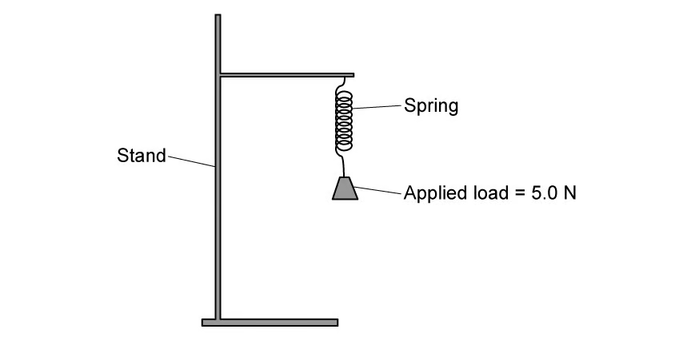{.question-figure fig-alt="Spring suspended from a stand with a 5.0 N load applied"}

Calculate the spring constant, expressing your answer in SI units. `[3 marks]`

**(d)** Another, thicker spring is attached to a base so that it stands upright, as shown in Fig. 1.2.

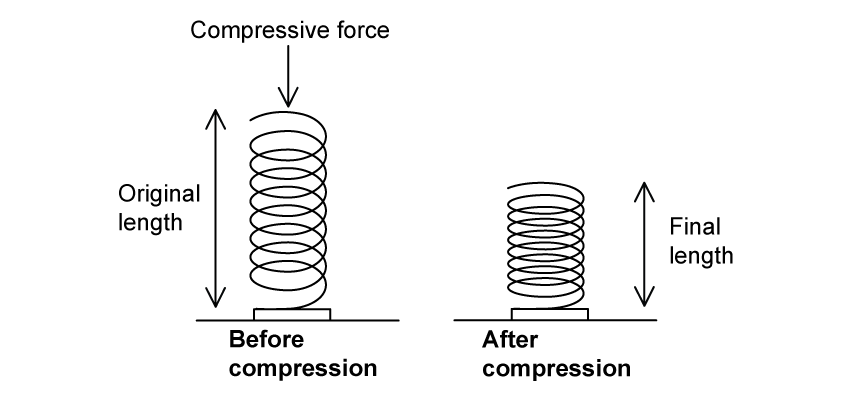{.question-figure fig-alt="Thicker spring compressed by a 6.3 N force, before and after compression"}

A force of 6.3 N pushes down on the spring which compresses it by 2.4 cm.

Calculate the spring constant, expressing your answer in SI units. `[3 marks]`

Show mark scheme / model answer

- **(a)(i)** Deformation is a change in the size or shape of an object. `[1]`
- **(a)(ii)** Tensile force (or tensile stress). `[1]`
- **(a)(iii)** Compressive force (or compressive stress). `[1]`
- **(b)** $F=kx$, where $F$ is the applied force, $k$ is the spring constant and $x$ is the extension. `[2]`
- **(c)** $x=4.2\ \mathrm{cm}=0.042\ \mathrm{m}$. `[1]` $k=F/x=5.0/0.042$. `[1]` $k=119\ \mathrm{N\,m^{-1}}$. `[1]`
- **(d)** $x=2.4\ \mathrm{cm}=0.024\ \mathrm{m}$. `[1]` $k=6.3/0.024$. `[1]` $k=260\ \mathrm{N\,m^{-1}}$ (2 s.f.). `[1]`

:::

::: {.question-card}
#### Example 2 · 6.1 SQ Easy Q2

**(a)** Define:

**(i)** tensile stress; `[1]`

**(ii)** tensile strain; `[1]`

**(iii)** the Young modulus. `[1]`

`[3 marks]`

**(b)** Fig. 1.1 shows stress-strain graphs for two different metal wires X and Y.

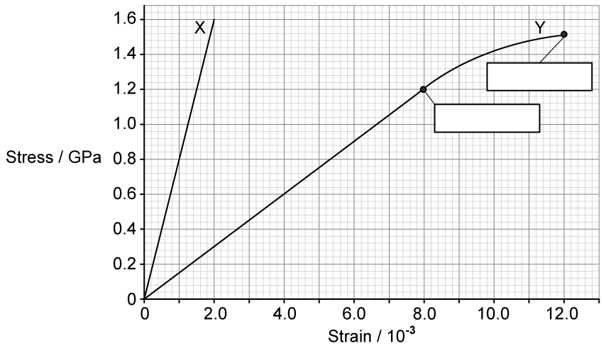{.question-figure fig-alt="Stress-strain graphs for two metal wires X and Y"}

Fill in the missing labels on Fig. 1.1 and state the definitions of these terms. `[4 marks]`

**(c)** State and explain which wire, X or Y, has the greater Young modulus. `[2 marks]`

**(d)** Use the graph in Fig. 1.1 to determine:

**(i)** the Young modulus of wire X and state the unit; `[2]`

**(ii)** the extension of wire Y when the stress is 1.2 GPa, and state the unit. Original length of wire Y $=2.0\ \mathrm{m}$. `[4]`

`[6 marks]`

Show mark scheme / model answer

- **(a)(i)** Tensile stress is the force per unit cross-sectional area: $\sigma=F/A$. `[1]`
- **(a)(ii)** Tensile strain is the extension per unit original length: $\varepsilon=x/L$. `[1]`
- **(a)(iii)** The Young modulus is the ratio of tensile stress to tensile strain. `[1]`
- **(b)** Label the axes (stress and strain) and mark the ultimate tensile strength on the graph. `[2]` UTS is the maximum stress the wire can support before it breaks. `[2]`
- **(c)** Wire X has the greater Young modulus `[1]` because its stress-strain graph has a steeper gradient. `[1]`
- **(d)(i)** From the graph, when stress $=1.6\ \mathrm{GPa}$, strain $=2.0\times10^{-3}$. `[1]` $E=\sigma/\varepsilon=1.6\times10^9/(2.0\times10^{-3})=8.0\times10^{11}\ \mathrm{Pa}$. `[1]`
- **(d)(ii)** At stress $1.2\ \mathrm{GPa}$, read strain from the graph for wire Y. `[1]` Extension $=\text{strain}\times L$. `[1]` Using the printed graph gives an extension of about $2.4\ \mathrm{mm}$ (values read from the graph). `[2]`

:::

::: {.question-card}
#### Example 3 · 6.1 SQ Easy Q3

A student is carrying out an experiment to determine the Young modulus of a wire. The student sets up the apparatus as shown in Fig. 1.1.

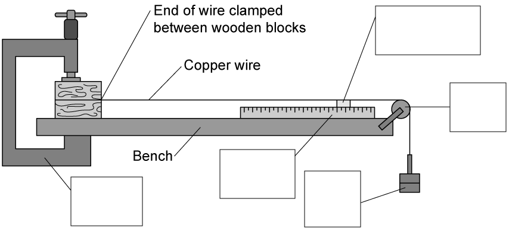{.question-figure fig-alt="Apparatus for determining the Young modulus of a wire"}

**(a)** Fill in the missing labels for the apparatus in Fig. 1.1. `[5 marks]`

**(b)** State and explain a safety consideration for this experiment. `[2 marks]`

**(c)** On the axis of Fig. 1.2 below, draw a graph to show the expected variation of strain with stress for this experiment. Assume that the wire does not stretch beyond the limit of proportionality.

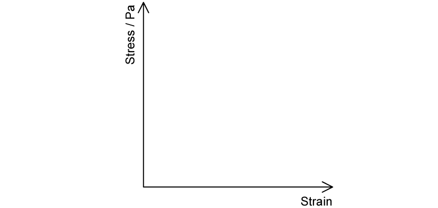{.question-figure fig-alt="Empty axes for stress against strain"}

`[2 marks]`

**(d)** Explain how the student could use the graph in Fig. 1.2 to determine the Young modulus of the wire. `[2 marks]`

Show mark scheme / model answer

- **(a)** Labels include: fixed support / clamp, wire, masses (or load), metre rule for length, vernier scale (or marker) for extension, micrometer for the diameter. `[5]`
- **(b)** Wear safety glasses because the wire may snap and could damage the eyes; `[1]` also ensure the masses cannot fall and hit the feet if the wire breaks. `[1]`
- **(c)** A straight line through the origin, with stress on the vertical axis and strain on the horizontal axis. `[2]`
- **(d)** The Young modulus is the gradient of the stress-strain graph. `[2]`

:::

### 6.1 Deformation, Stress & Strain - Medium

::: {.question-card}
#### Example 4 · 6.1 SQ Medium Q2

**(a)** Define work done by a force. `[1 mark]`

**(b)** A heavy suitcase is placed on a weighing machine consisting of a platform mounted on a spring, as shown in Fig. 1.1.

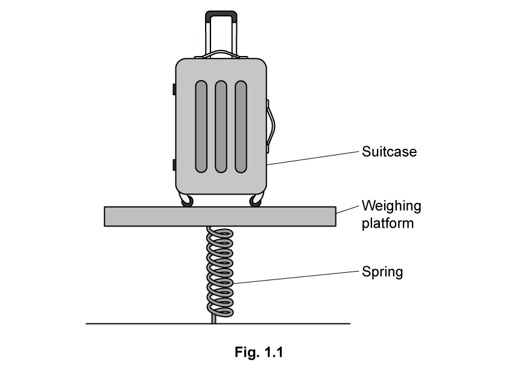{.question-figure fig-alt="Suitcase on a weighing platform mounted on a spring"}

Describe and explain how work is done in this situation. `[3 marks]`

**(c)** The diagram in Fig. 1.2 shows a suitcase of mass 22.6 kg positioned on the weighing platform.

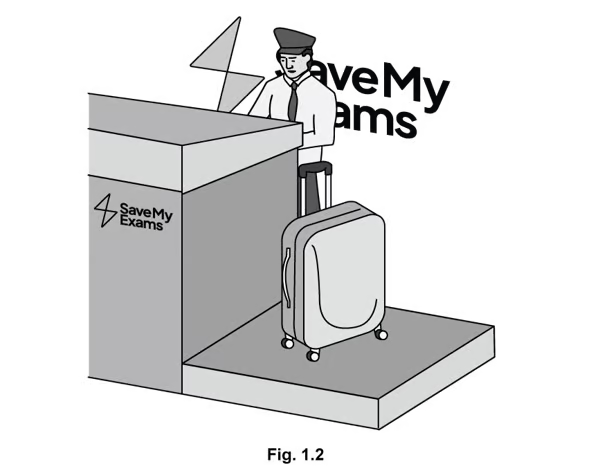{.question-figure fig-alt="Suitcase of mass 22.6 kg on the weighing platform"}

The platform sinks down 3 cm when the suitcase is placed on it, and then returns to its original position when the suitcase is removed.

Calculate the spring constant of the spring. `[2 marks]`

**(d)** For the weighing platform described in part (c), sketch a graph to show the known properties of the spring. `[4 marks]`

Show mark scheme / model answer

- **(a)** Work done is force multiplied by the displacement in the direction of the force. `[1]`
- **(b)** The weight of the suitcase acts downwards; `[1]` work is done in compressing the spring; `[1]` this energy is transferred to elastic potential energy (and a little to thermal energy). `[1]`
- **(c)** Force $=mg=22.6\times9.81=222\ \mathrm{N}$. `[1]` $k=F/x=222/0.03=7400\ \mathrm{N\,m^{-1}}$. `[1]`
- **(d)** Force on the vertical axis and extension on the horizontal axis, `[1]` with a straight line through the origin from $(0,0)$ to $(0.03, 222)$, `[2]` showing the spring obeys Hooke's law within this range. `[1]`

:::

::: {.question-card}
#### Example 5 · 6.1 SQ Medium Q3

**(a)** Fig. 1.1 is a graph of stress against strain for two wires, X and Y. The wires are made from different materials but have the same dimensions.

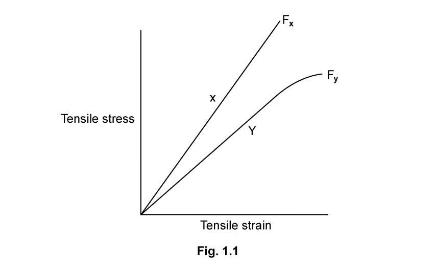{.question-figure fig-alt="Stress-strain graphs for two wires X and Y with breaking points Fx and Fy"}

**(i)** Describe, giving reasons for your answer, three properties of material X. `[6]`

**(ii)** State the meaning of points $F_X$ and $F_Y$ and explain their significance. `[2]`

`[8 marks]`

**(b)** State and explain which wire would be more suitable for use as cables and structural beams. `[2 marks]`

**(c)** A group of physics students are told that they will be performing the investigation which leads to the graph in part (a).

State two safety precautions which they must take and explain your answer. `[2 marks]`

Show mark scheme / model answer

- **(a)(i)** Any three, each with a reason: X has a larger Young modulus (steeper gradient); `[2]` X does not undergo significant elastic deformation before breaking (the line stays straight); `[2]` X is stronger (higher breaking stress); `[2]` or X is brittle (no plastic region). `[2]`
- **(a)(ii)** $F_X$ and $F_Y$ are the breaking points (ultimate tensile strengths) of X and Y. `[1]` They show the maximum stress each material can withstand before breaking. `[1]`
- **(b)** Wire Y is more suitable for cables and beams `[1]` because it undergoes plastic deformation and gives warning before breaking, whereas wire X fails suddenly (brittle). `[1]`
- **(c)** Wear safety glasses or goggles because the wires may snap and cause eye damage; `[1]` keep feet clear / ensure masses are secured so that they cannot fall if the wire breaks. `[1]`

:::

::: {.question-card}
#### Example 6 · 6.1 SQ Medium Q4

Fitness equipment often uses springs as a method of creating resistance. One example is the Push Down Bar, which the manufacturer says can help a person who uses it to 'increase strength and burn calories'.

To use a Push Down Bar, a person applies force by pushing the handles towards each other as shown in Fig. 1.1. Fig. 1.2 shows the construction of the Push Down Bar.

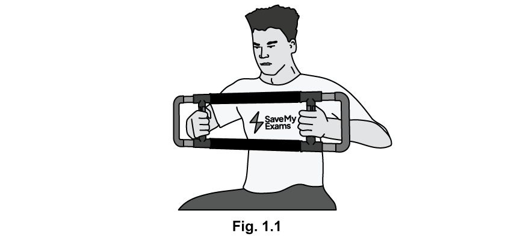{.question-figure fig-alt="Push Down Bar with springs and hand grips"}

**(a)**

**(i)** State the type of force used when exercising with this equipment. `[1]`

**(ii)** Explain why using this equipment would help the person burn calories. `[3]`

`[4 marks]`

**(b)** The relationship between applied force and change in length of the springs was measured for a range of values of force. The results are plotted on the graph in Fig. 1.3.

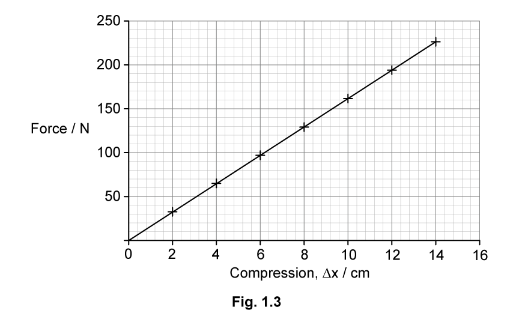{.question-figure fig-alt="Graph of force against compression for the springs"}

**(i)** State, with a reason, whether the spring obeys Hooke's law over the range of values tested. `[2]`

**(ii)** Use the graph in Fig. 1.3 to calculate the spring constant, stating an appropriate unit. `[3]`

`[5 marks]`

**(c)** Derive the formula for the elastic potential energy stored by the spring from the graph of force against extension. `[4 marks]`

**(d)** State and explain whether the material chosen for the spring for the equipment in Fig. 1.1 should exhibit elastic or plastic behaviour. `[2 marks]`

Show mark scheme / model answer

- **(a)(i)** Compressive force. `[1]`
- **(a)(ii)** A force is applied across a distance, so work is done; `[1]` the work is done to compress the springs; `[1]` energy is transferred from the person's chemical energy, so calories are burned. `[1]`
- **(b)(i)** Yes, the spring obeys Hooke's law `[1]` because the graph is a straight line through the origin. `[1]`
- **(b)(ii)** Spring constant is the gradient of the graph. `[1]` Using a large triangle on the straight line gives $k=\Delta F/\Delta x$. `[1]` From the printed graph, $k=1600\ \mathrm{N\,m^{-1}}$. `[1]`
- **(c)** The work done is the area under the force-extension graph. `[1]` The area is a triangle: $\frac{1}{2}\times\text{base}\times\text{height}$. `[1]` Hence $E_P=\frac{1}{2}\times x\times F$. `[1]` Since $F=kx$, $E_P=\frac{1}{2}kx^2$. `[1]`
- **(d)** The spring should exhibit elastic behaviour `[1]` so that it returns to its original shape after each use and can be used repeatedly. `[1]`

:::

::: {.question-card}
#### Example 7 · 6.1 SQ Medium Q5

Nichrome is a common alloy used to make coins and heating elements in electrical appliances. It consists of 80% by volume of nickel and 20% by volume of chromium.

**(a)** Determine the mass of nickel and the mass of chromium required to make a wire of nichrome of volume $0.50\times10^{-5}\ \mathrm{m^3}$.

- Density of nickel $=8.9\times10^3\ \mathrm{kg\,m^{-3}}$
- Density of chromium $=7.1\times10^3\ \mathrm{kg\,m^{-3}}$ `[2 marks]`

**(b)** To calculate the breaking stress of the nichrome wire, both the cross-sectional area of the wire and the applied load must be known.

For each value, briefly describe an experimental method to determine the value, mentioning any equipment required.

**(i)** The cross-sectional area of the wire. `[2]`

**(ii)** The applied load. `[2]`

`[4 marks]`

**(c)** The radius of the nichrome wire is 5.7 mm. The wire breaks under an applied force of 72 kN.

Calculate the breaking stress of nichrome. `[3 marks]`

**(d)** The breaking stress of nickel is 59 MPa. The breaking stress of chromium is 131 MPa.

Use your answer to part (c) to suggest why nichrome is a suitable material for making coins. `[2 marks]`

Show mark scheme / model answer

- **(a)** Volume of nickel $=0.80\times0.50\times10^{-5}=4.0\times10^{-6}\ \mathrm{m^3}$; mass $=8.9\times10^3\times4.0\times10^{-6}=0.0356\ \mathrm{kg}$. `[1]` Volume of chromium $=1.0\times10^{-6}\ \mathrm{m^3}$; mass $=7.1\times10^3\times1.0\times10^{-6}=0.0071\ \mathrm{kg}$. `[1]`
- **(b)(i)** Measure the diameter at several places with a micrometer screw gauge and calculate the area from $A=\pi d^2/4$. `[2]`
- **(b)(ii)** Measure the load with a calibrated force meter or by adding known masses and using $F=mg$. `[2]`
- **(c)** Area $=\pi(5.7\times10^{-3})^2=1.02\times10^{-4}\ \mathrm{m^2}$. `[1]` Breaking stress $=F/A=72\times10^3/(1.02\times10^{-4})$. `[1]` $=7.05\times10^8\ \mathrm{Pa}$. `[1]`
- **(d)** The breaking stress of nichrome lies between the values for nickel and chromium, and is high enough to resist normal wear in coins. `[2]`

:::

### 6.2 Elastic & Plastic Behaviour - Medium

::: {.question-card}
#### Example 8 · 6.2 SQ Medium Q1

A manufacturer produces springs for use in school laboratory investigations. As part of quality control, the springs are spot-checked by measuring the extension produced for certain applied loads.

The graph of the testing data is shown in Fig. 1.1.

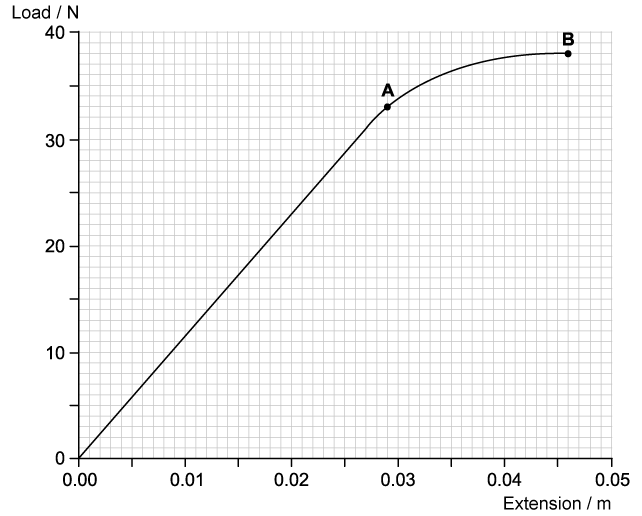{.question-figure fig-alt="Graph of load against extension for the spring with points A and B"}

**(a)** Use a graphical method to calculate the spring constant of the spring. Show your working. `[3 marks]`

**(b)** Show that the work done in extending the spring up to point A is approximately 0.5 J. `[3 marks]`

**(c)** When the spring reaches an extension of 0.046 m, the load on it is gradually reduced to zero.

On the graph in Fig. 1.1, sketch how the extension of the spring will vary with load as the load is reduced to zero. Explain why the graph has this shape. `[3 marks]`

**(d)** Without further calculation, compare the total work done by the spring when the load is removed with the work that was done by the load in producing the extension of 0.046 m. Explain how this is represented on the graph drawn in part (c). `[3 marks]`

Show mark scheme / model answer

- **(a)** Mark a large triangle on the straight part of the line and use $k=\Delta F/\Delta x$. `[1]` Taking values from the graph gives $k=\Delta y/\Delta x=30/0.026$. `[1]` $k=1154\ \mathrm{N\,m^{-1}}$. `[1]`
- **(b)** Work done is the area under the graph up to point A. `[1]` Triangle area $=\frac{1}{2}\times0.026\times30=0.39\ \mathrm{J}$ and rectangle area $=0.003\times30=0.09\ \mathrm{J}$. `[1]` Total $=0.39+0.09+0.005=0.485\ \mathrm{J}\approx0.5\ \mathrm{J}$. `[1]`
- **(c)** When the load is reduced, the spring has been permanently deformed, so the unloading line is straight and returns to the extension axis at about $0.013-0.014\ \mathrm{m}$. `[2]` This is because the spring has undergone plastic deformation. `[1]`
- **(d)** The work done by the spring when unloaded is less than the work done by the load in extending it. `[1]` On the graph, the work done is the area under the respective curve, `[1]` so the area under the unloading line is smaller than the area under the loading line. `[1]`

:::

::: {.question-card}
#### Example 9 · 6.2 SQ Medium Q2

Materials scientists are asked to produce a material which would be suitable to use in constructing the wing of an aeroplane.

The team of scientists work with two materials, an aluminium alloy and a carbon fibre composite.

**(a)** Suggest a material property which the scientists are likely to investigate and report on, and give a reason. `[2 marks]`

**(b)** Fig. 1.1 shows the stress-strain graph that the scientists obtain for the aluminium alloy. They have labelled a point Q on the graph.

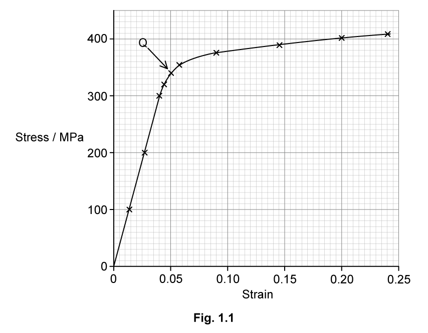{.question-figure fig-alt="Stress-strain graph for an aluminium alloy with point Q marked"}

**(i)** State the name of point Q and suggest why the scientists have drawn attention to it. `[3]`

**(ii)** Use the graph to determine the Young modulus of the aluminium alloy. Show your working. `[3]`

`[6 marks]`

**(c)** The aluminium alloy wire has a diameter of 1.2 mm. Calculate the elastic potential energy stored in the wire when it shows an extension of 7.5 cm under a total strain of 190 MPa. `[6 marks]`

Show mark scheme / model answer

- **(a)** Breaking stress (or Young modulus / stiffness), `[1]` because the wing must withstand large forces without breaking or excessive deformation. `[1]`
- **(b)(i)** Point Q is the elastic limit. `[1]` Beyond this point the material no longer returns to its original length or shape when the force is removed. `[2]`
- **(b)(ii)** Mark a large triangle on the straight part of the graph and use $E=\Delta\sigma/\Delta\varepsilon$. `[1]` Taking values from the graph gives gradient $=\frac{400\times10^6}{0.053}$. `[1]` $E=7.5\times10^9\ \mathrm{Pa}$. `[1]`
- **(c)** Stress $\sigma=190\ \mathrm{MPa}=1.90\times10^8\ \mathrm{Pa}$; extension $x=0.075\ \mathrm{m}$; area $A=\pi(0.6\times10^{-3})^2=1.13\times10^{-6}\ \mathrm{m^2}$. `[2]` Elastic strain energy $=\frac{1}{2}Fx=\frac{1}{2}\times\sigma Ax$. `[2]` $E_P=\frac{1}{2}\times1.90\times10^8\times1.13\times10^{-6}\times0.075$. `[1]` $E_P=12\,700\ \mathrm{J}$. `[1]`

:::

::: {.question-card}
#### Example 10 · 6.2 SQ Medium Q3

A steel bar is 40 mm long and has cross-sectional area $4.5\times10^{-4}\ \mathrm{m^2}$.

The bar is compressed using a vice so that the length is reduced by 0.20 mm.

The Young modulus of steel $=2.1\times10^{11}\ \mathrm{Pa}$.

**(a)** Calculate the compressive force exerted on the bar. `[2 marks]`

**(b)** Calculate the work done compressing the bar. `[2 marks]`

**(c)** For the compression described in part (a):

**(i)** sketch a graph to show the compression, assuming that the elastic limit has not been reached; `[2]`

**(ii)** suggest how the elastic potential energy could be ascertained from the graph. `[1]`

`[3 marks]`

Show mark scheme / model answer

- **(a)** $F=EA\Delta L/L=2.1\times10^{11}\times4.5\times10^{-4}\times0.0002/0.040$. `[1]` $F=4.7\times10^5\ \mathrm{N}$. `[1]`
- **(b)** Work done $=\frac{1}{2}F\Delta L=\frac{1}{2}\times4.7\times10^5\times0.0002$. `[1]` $W=47\ \mathrm{J}$. `[1]`
- **(c)(i)** A straight line through the origin with force on the vertical axis and compression on the horizontal axis, ending at $(0.0002,\ 4.7\times10^5)$. `[2]`
- **(c)(ii)** The elastic potential energy is the area under the force-compression graph. `[1]`

:::
