### 7.1 Waves: Transverse & Longitudinal - Easy

::: {.question-card}
#### Example 1 · 7.1 MC Easy Q4

A sound wave has a displacement $y$ at a distance $x$ from its source at time $t$.

Which graph shows correctly the amplitude $a$ and the wavelength $\lambda$ of the wave?

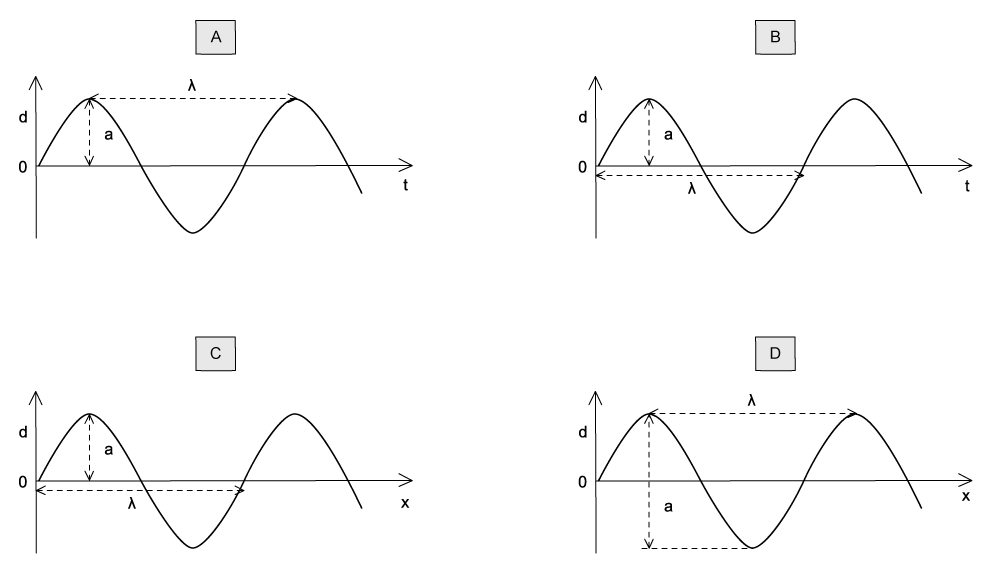{.question-figure fig-alt="Four graphs of displacement against distance, one of which correctly labels the amplitude and the wavelength"}

Show answer and explanation

**Answer: C.** The amplitude is the maximum displacement from the resting position, and the wavelength is the minimum distance between two points oscillating in phase. Options A and B show the time axis (which would give the period, not the wavelength), and D measures the displacement of a complete wave rather than from the resting position.

:::

::: {.question-card}
#### Example 2 · 7.1 MC Easy Q6

The vertical cross-section diagram shows a water wave moving from left to right.

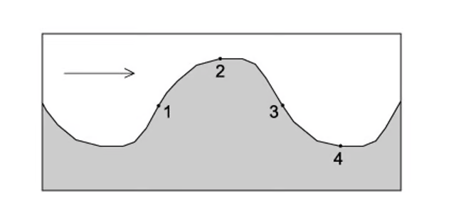{.question-figure fig-alt="Vertical cross-section of a water wave with four points marked"}

Which points on the diagram show the water moving upwards with maximum speed?

A. 1 and 3

B. 3 only

C. 1 and 4

D. 4 only

Show answer and explanation

**Answer: B.** Shifting the wave forward in the direction of travel, point 3 is the only point moving upwards with maximum speed. Point 1 moves downwards and point 4 moves upwards but not at maximum speed.

:::

::: {.question-card}
#### Example 3 · 7.1 MC Easy Q8

The diagram below is a graph showing how the height of water at a point in a marina varies with time $t$ as the waves pass the point.

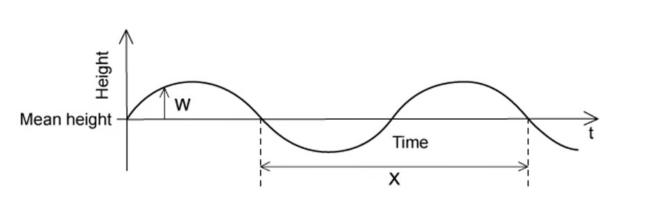{.question-figure fig-alt="Graph of the height of water against time showing a wave with labels W and X"}

What is the correct label for W and X?

|  | W | X |
|---|---|---|
| A | amplitude | period |
| B | displacement | wavelength |
| C | amplitude | wavelength |
| D | displacement | period |

Show answer and explanation

**Answer: D.** The x-axis is time, so X must be the period (a quantity measured in time, not distance). W is the displacement of the wave at that instant, not the maximum displacement.

:::

### 7.1 Waves: Transverse & Longitudinal - Medium

::: {.question-card}
#### Example 4 · 7.1 MC Medium Q1

Sound travels with a speed of $330\ \mathrm{m\,s^{-1}}$ in air. The variation with time of the displacement of an air particle due to a sound wave is shown below.

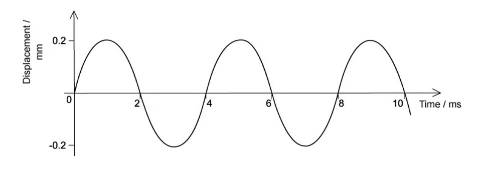{.question-figure fig-alt="Displacement-time graph of a sound wave with amplitude 0.2 mm"}

Which of the following statements about the wave is correct?

A. the wavelength of the sound wave is 1.32 m

B. the graph shows that the sound is a transverse wave

C. the frequency of the wave is 500 Hz

D. the intensity of the wave will be doubled if its amplitude is increased to 0.4 mm

Show answer and explanation

**Answer: A.** Two wavelengths take $2T=8\ \mathrm{ms}$, so $T=4\ \mathrm{ms}$ and $f=1/T=250\ \mathrm{Hz}$. Then $\lambda=v/f=330/250=1.32\ \mathrm{m}$. The graph is just a graphical representation of a periodic oscillation and is the same for both transverse and longitudinal waves. Doubling the amplitude quadruples the intensity, not doubles it.

:::

::: {.question-card}
#### Example 5 · 7.1 MC Medium Q2

The graph shows two light waves travelling at the same frequency.

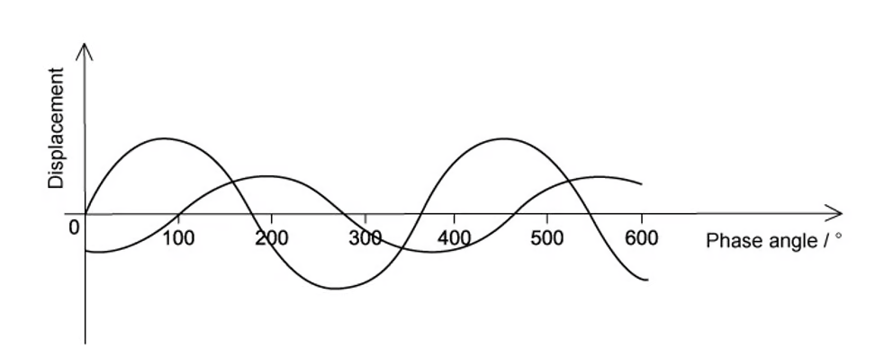{.question-figure fig-alt="Displacement against phase angle graph for two light waves of the same frequency"}

Which of the following could be the phase difference between the two waves?

A. 330°

B. 260°

C. 220°

D. 150°

Show answer and explanation

**Answer: B.** Treating the waves as sinusoidal starting at zero displacement, wave B first returns to zero displacement at a phase angle of 100°. One full cycle is 360°, so wave B is 100° − 360° = −260° relative to wave A, giving a phase difference of 260°.

:::

::: {.question-card}
#### Example 6 · 7.1 MC Medium Q3

The diagram shows a wave moving along a stretched rope in the direction shown.

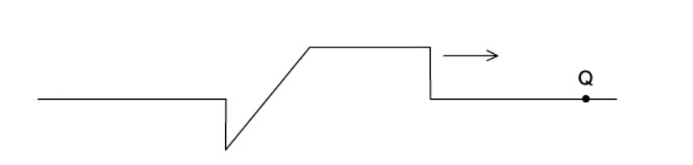{.question-figure fig-alt="A wave on a stretched rope with particle Q marked at the top of a crest"}

Which of the following will be the correct graph to show the variation with time $t$ of the displacement $s$ of the particle Q in the rope?

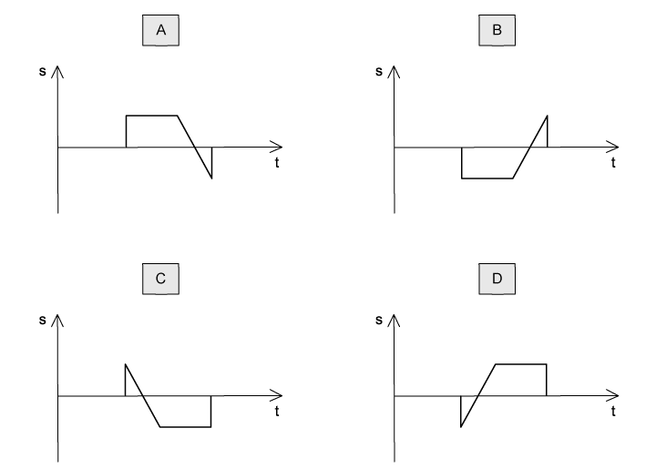{.question-figure fig-alt="Four graphs of displacement against time for particle Q"}

Show answer and explanation

**Answer: A.** The wave is transverse, so particle Q oscillates vertically. As the crest approaches, Q jumps up quickly, stays near the maximum displacement, and then returns through a negative peak as the trough passes.

:::

::: {.question-card}
#### Example 7 · 7.1 MC Medium Q5

Plane-polarised light of amplitude $A$ is passed through a polarising filter as shown in the diagram. The emerging light has an amplitude of $A\cos\theta$.

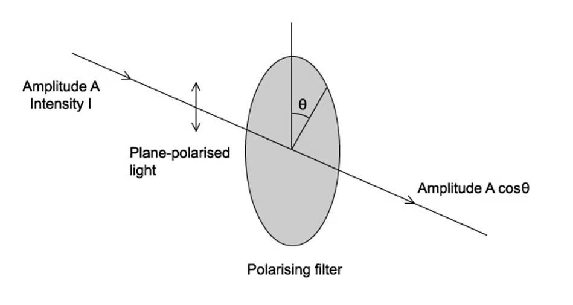{.question-figure fig-alt="Plane-polarised light of amplitude A and intensity I passing through a polarising filter"}

If the intensity of the beam is $I$, what is the intensity of the emerging light when $\theta$ is 60.0°?

A. 0.866$I$

B. 0.750$I$

C. 0.500$I$

D. 0.250$I$

Show answer and explanation

**Answer: D.** Intensity is proportional to the square of the amplitude, so $I_{\text{out}}\propto(A\cos60°)^2=0.250A^2\propto0.250I$.

:::

::: {.question-card}
#### Example 8 · 7.1 MC Medium Q7

What is the frequency, amplitude and period of the wave shown in the graph below, to 2 significant figures?

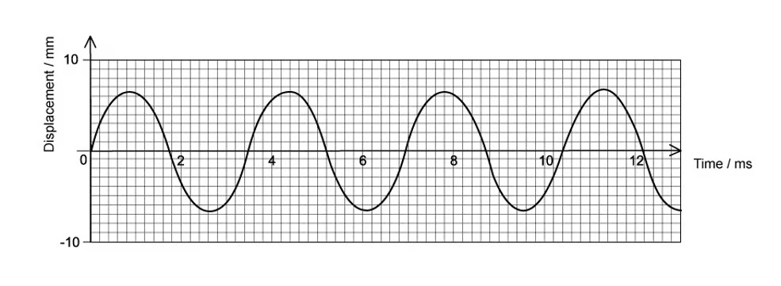{.question-figure fig-alt="Displacement-time graph of a wave with amplitude about 6.5 mm"}

|  | Period / s | Frequency / Hz | Amplitude / m |
|---|---|---|---|
| A | 0.0042 | 240 | 0.013 |
| B | 0.0035 | 290 | 0.0065 |
| C | 0.0031 | 320 | 0.013 |
| D | 0.0027 | 290 | 0.0065 |

Show answer and explanation

**Answer: B.** From the graph, 3.5 waves occupy 12.2 ms, so $T=12.2\times10^{-3}/3.5=0.0035\ \mathrm{s}$, $f=1/T=290\ \mathrm{Hz}$, and the amplitude read from the y-axis is 6.5 mm $=0.0065\ \mathrm{m}$.

:::

::: {.question-card}
#### Example 9 · 7.1 MC Medium Q9

A sound wave can be displayed on a cathode-ray oscilloscope (C.R.O.). The time base is set to $5\ \mu\mathrm{s\,mm^{-1}}$.

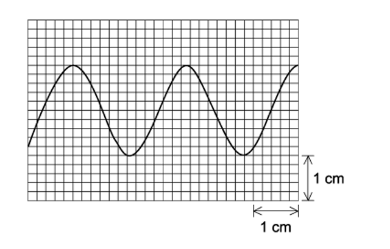{.question-figure fig-alt="Cathode-ray oscilloscope trace of a sound wave with scale markings"}

What is the frequency of the sound wave?

A. 83 Hz

B. 8.3 Hz

C. 83 kHz

D. 8.3 kHz

Show answer and explanation

**Answer: D.** Each division is 2 mm, so each division is 10 $\mu$s. 2.5 waves occupy 30 divisions, so $2.5T=30\times10=300\ \mu$s and $T=120\ \mu$s. Then $f=1/(120\times10^{-6})=8333\ \mathrm{Hz}\approx8.3\ \mathrm{kHz}$.

:::

::: {.question-card}
#### Example 10 · 7.1 MC Medium Q10

The graph shows the displacement of a sound wave over time.

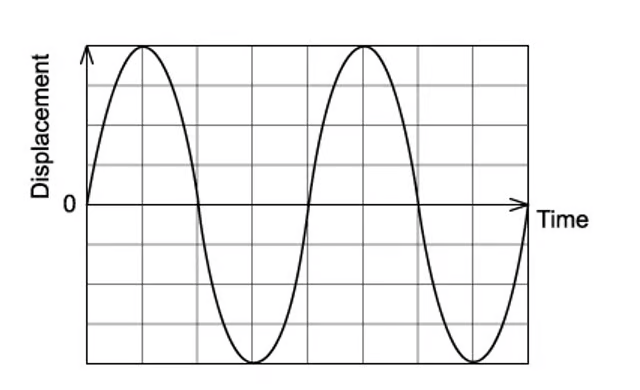{.question-figure fig-alt="Displacement-time graph of a sound wave"}

When the intensity of the wave is halved, which graph shows the correct displacement of the wave?

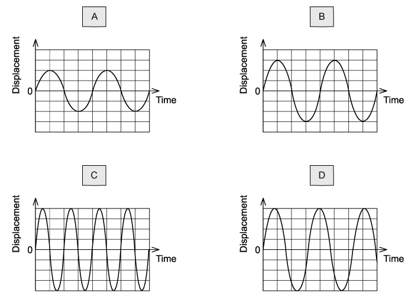{.question-figure fig-alt="Four graphs of displacement against time"}

Show answer and explanation

**Answer: B.** Intensity is proportional to amplitude squared, so halving the intensity multiplies the amplitude by $1/\sqrt2\approx0.71$. The frequency stays the same. Graph B shows the amplitude reduced by a factor of 0.71 with unchanged frequency.

:::

### 7.1 Waves: Transverse & Longitudinal - Hard

::: {.question-card}
#### Example 11 · 7.1 MC Hard Q2

The graph shows two waves P and Q.

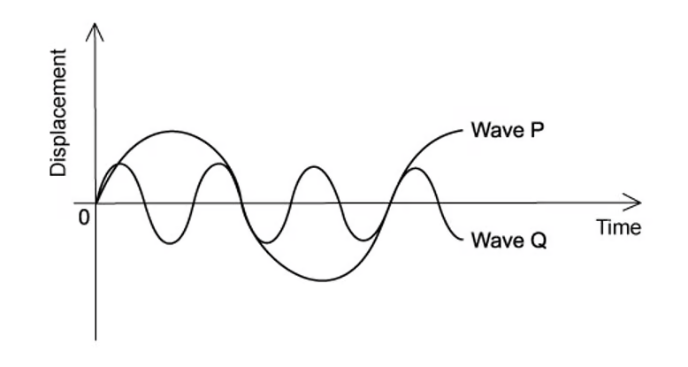{.question-figure fig-alt="Displacement graph showing wave P and wave Q"}

Wave P has an amplitude of 8 cm and a frequency of 100 Hz.

What is the amplitude and the frequency of wave Q?

|  | Amplitude / cm | Frequency / Hz |
|---|---|---|
| A | 4 | 300 |
| B | 4 | 33 |
| C | 2 | 300 |
| D | 2 | 33 |

Show answer and explanation

**Answer: A.** Wave Q has half the amplitude of P, so 4 cm. In the time of one cycle of P, three cycles of Q occur, so $f_Q=3\times100=300\ \mathrm{Hz}$.

:::

::: {.question-card}
#### Example 12 · 7.1 MC Hard Q3

The graph below shows two sound waves, where the sound wave is a series of moving pressure variations.

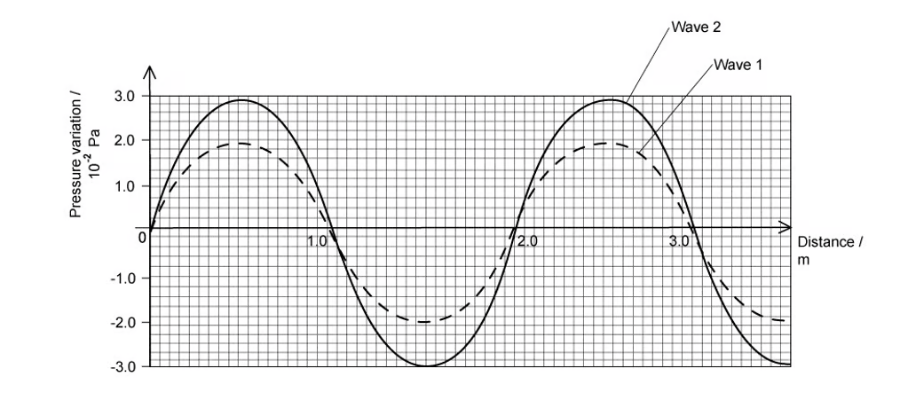{.question-figure fig-alt="Pressure variation against distance for two sound waves"}

Wave 1 has an intensity of $1.6\times10^{-6}\ \mathrm{W\,m^{-2}}$. What is the intensity of wave 2?

A. $3.6\times10^{-6}\ \mathrm{W\,m^{-2}}$

B. $2.4\times10^{-6}\ \mathrm{W\,m^{-2}}$

C. $3.0\times10^{-6}\ \mathrm{W\,m^{-2}}$

D. $4.5\times10^{-6}\ \mathrm{W\,m^{-2}}$

Show answer and explanation

**Answer: A.** Intensity is proportional to amplitude squared. From the graph, wave 1 has amplitude 2 units ($I_1=4$ units) and wave 2 has amplitude 3 units ($I_2=9$ units). So $I_2=(9/4)\times1.6\times10^{-6}=3.6\times10^{-6}\ \mathrm{W\,m^{-2}}$.

:::

::: {.question-card}
#### Example 13 · 7.1 MC Hard Q7

The intensity $I$ of a sound at point Q is inversely proportional to the square of the distance $x$ of Q from the source of the sound. This can be shown by the equation

$$I\propto\frac{1}{x^2}.$$

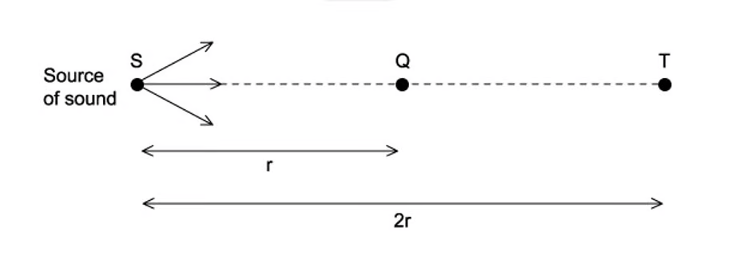{.question-figure fig-alt="Diagram showing a source of sound S with point Q at distance r and point T at distance 2r"}

Molecules of air at Q are a distance $r$ from S and oscillate with amplitude $8.0\ \mu\mathrm{m}$.

Point T is a distance $2r$ from S.

What is the amplitude of oscillation of air molecules at T?

A. 4.0 $\mu$m

B. 2.0 $\mu$m

C. 2.8 $\mu$m

D. 1.4 $\mu$m

Show answer and explanation

**Answer: A.** Doubling the distance quarters the intensity. Since $I\propto A^2$, the amplitude is multiplied by $\sqrt{1/4}=1/2$, giving $A=8.0/2=4.0\ \mu\mathrm{m}$.

:::

::: {.question-card}
#### Example 14 · 7.1 MC Hard Q8

The graph shows a sinusoidal wave in water, travelling at a speed of $8.0\ \mathrm{m\,s^{-1}}$.

The maximum speed of the particles in the wave is $2\pi af$, where $a$ is the amplitude and $f$ is the frequency.

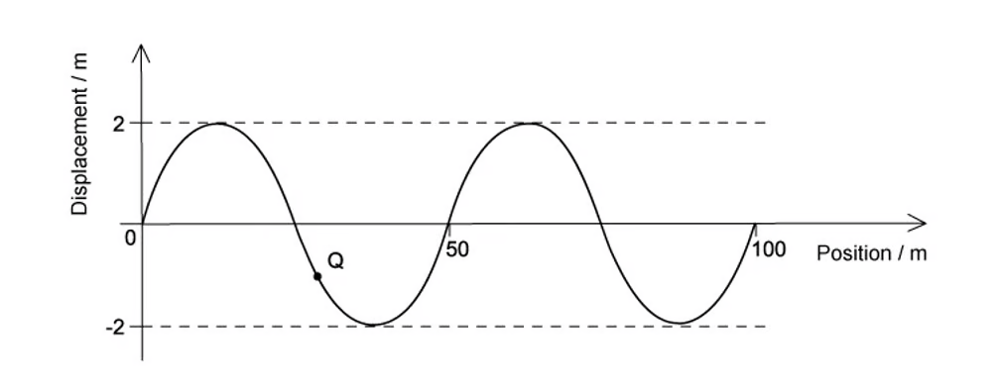{.question-figure fig-alt="Displacement against position graph of a sinusoidal water wave"}

An object Q is floating on the water; it has a mass of $2.5\times10^{-3}\ \mathrm{kg}$.

What is the maximum kinetic energy of Q due to the wave? Assume the motion is vertical.

A. 41 mJ

B. 5.1 mJ

C. 39 mJ

D. 64 mJ

Show answer and explanation

**Answer: B.** From the graph the wavelength is 50 m, so $f=v/\lambda=8/50=0.16\ \mathrm{Hz}$, and the amplitude is 2 m. The maximum speed is $v_{\max}=2\pi af=2\pi(2)(0.16)=0.64\pi\ \mathrm{m\,s^{-1}}$. Then $E_K=\frac{1}{2}mv_{\max}^2=\frac{1}{2}(2.5\times10^{-3})(0.64\pi)^2=5.1\times10^{-3}\ \mathrm{J}=5.1\ \mathrm{mJ}$.

:::

### 7.2 Transverse Waves: EM Spectrum & Polarisation - Easy/Medium

::: {.question-card}
#### Example 15 · 7.2 MC Easy Q8

The diagram shows part of the electromagnetic spectrum.

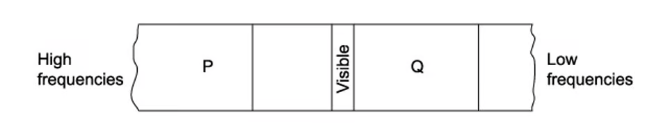{.question-figure fig-alt="Part of the electromagnetic spectrum with regions P and Q marked"}

High frequencies $\longrightarrow$ P $\qquad$ Q $\longleftarrow$ Low frequencies

Which row correctly labels the regions marked P and Q?

|  | P | Q |
|---|---|---|
| A | infrared | x-ray |
| B | ultraviolet | x-ray |
| C | x-ray | infrared |
| D | infrared | microwaves |

Show answer and explanation

**Answer: C.** High-frequency end of the spectrum is X-rays (P), and the region next to the low-frequency end shown is infrared (Q).

:::

::: {.question-card}
#### Example 16 · 7.2 MC Medium Q8

A linearly polarised electromagnetic beam has an intensity of $16\ \mathrm{W\,m^{-2}}$ with an angle of incidence of 45° to the vertical.

What is the intensity of the transmitted beam?

A. 20 W m$^{-2}$

B. 12 W m$^{-2}$

C. 16 W m$^{-2}$

D. 8 W m$^{-2}$

Show answer and explanation

**Answer: D.** Using Malus's law, $I=I_0\cos^2\theta=16\cos^2 45°=16\times0.5=8\ \mathrm{W\,m^{-2}}$.

:::

::: {.question-card}
#### Example 17 · 7.2 MC Medium Q9

Unpolarised light of intensity $I_0$ is incident on a polariser with a vertical transmission axis. The transmitted light is incident on a sheet of material X. After transmission through X, the intensity of the light is $I_0/2$.

It is suggested that X could be:

1. a polariser with a vertical transmission axis;
2. a polariser with a horizontal transmission axis;
3. non-polarising glass.

A. 1 and 2

B. 2 and 3

C. 1 and 3

D. 3 only

Show answer and explanation

**Answer: C.** The first polariser reduces the unpolarised light by half (the half rule). Since the light is now vertically polarised, material X can be either another polariser with a vertical transmission axis or non-polarising glass – neither changes the intensity. A horizontal polariser would block the light completely.

:::

### 7.2 Transverse Waves: EM Spectrum & Polarisation - Hard

::: {.question-card}
#### Example 18 · 7.2 MC Hard Q3

Unpolarised light of intensity $I_0$ is incident on a polariser that has a vertical transmission axis, as shown in the diagram below.

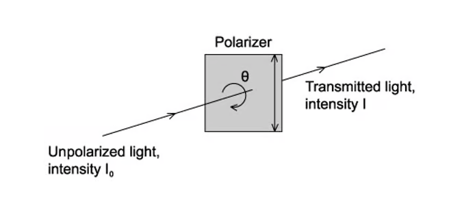{.question-figure fig-alt="Unpolarised light of intensity I0 incident on a polariser with vertical transmission axis"}

Which graph shows the intensity of the transmitted light?

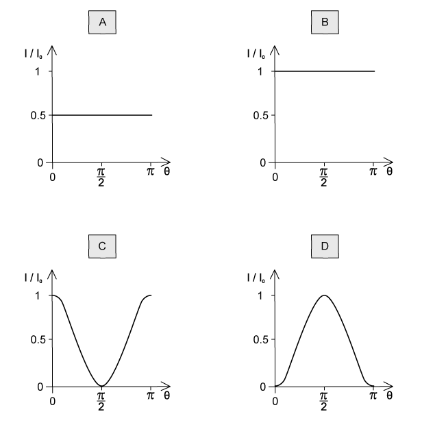{.question-figure fig-alt="Four graphs of transmitted intensity against angle of the polariser"}

Show answer and explanation

**Answer: A.** Unpolarised light incident on a single polariser loses half its intensity regardless of the angle of the transmission axis, so the transmitted intensity is a constant $I_0/2$. Only graph A shows this constant value.

:::

::: {.question-card}
#### Example 19 · 7.2 MC Hard Q5

A person wearing polarising sunglasses stands at the edge of a pond in bright sunlight.

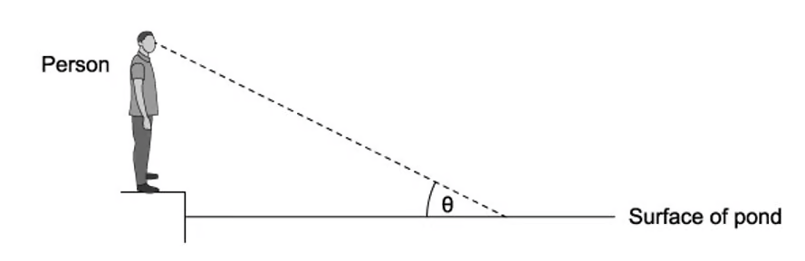{.question-figure fig-alt="Person at the edge of a pond with a line of sight to the flat surface at angle theta"}

The surface of the pond is flat, and the person has a line of sight to the surface at angle $\theta$. The refractive index of the pond water is $n$.

What is the value of $\theta$ for which the light would be a minimum when it reaches the person's eye?

A. $\tan^{-1}\left(\dfrac{1}{n}\right)$

B. $\cos^{-1}\left(\dfrac{1}{n}\right)$

C. $\tan^{-1}(n)$

D. $\cos^{-1}(n)$

Show answer and explanation

**Answer: A.** At Brewster's angle the reflected light is completely plane-polarised. Brewster's angle obeys $\tan\theta_B=n_2/n_1$; here light leaves water ($n$) into air ($n_2=1$), so $\theta_B=\tan^{-1}(1/n)$.

:::

::: {.question-card}
#### Example 20 · 7.2 MC Hard Q9

The diagram below shows a ray of unpolarised light with an intensity of $72\ \mathrm{W\,m^{-2}}$ passing through three polarising films P1, P2 and P3.

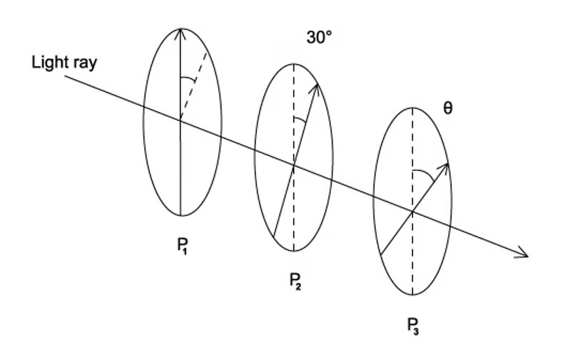{.question-figure fig-alt="Ray of light passing through three polarising films P1, P2 and P3 with axes shown"}

The polarising axis of each polarising film is shown by an arrow. The polarising films P1 and P2 are fixed, with their axes of polarisation at 30° to one another.

If the light emerging from the third filter has an intensity of $13.5\ \mathrm{W\,m^{-2}}$, what is angle $\theta$?

A. 60°

B. 90°

C. 30°

D. 45°

Show answer and explanation

**Answer: D.** After the first polariser, $I=36\ \mathrm{W\,m^{-2}}$. After P2 (at 30°), $I=36\cos^2 30°=27\ \mathrm{W\,m^{-2}}$. For the final intensity to be $13.5\ \mathrm{W\,m^{-2}}$, $27\cos^2\theta=13.5$, so $\cos^2\theta=0.5$ and $\theta=45°$.

:::
