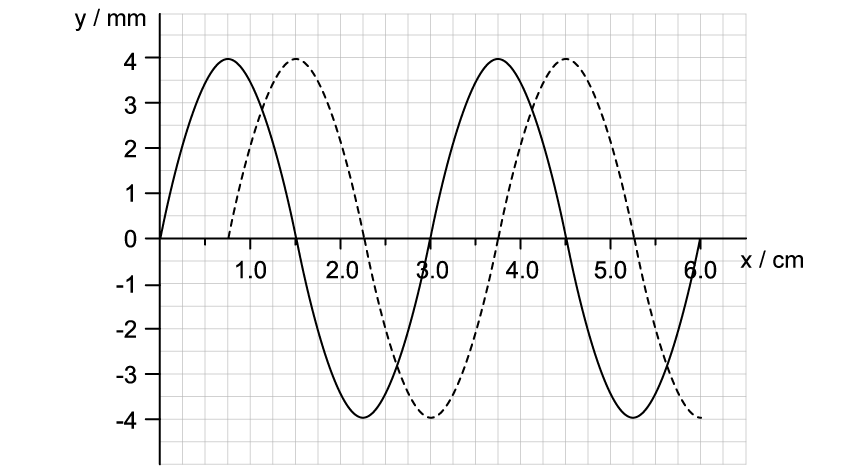
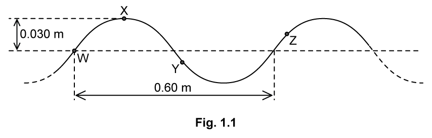
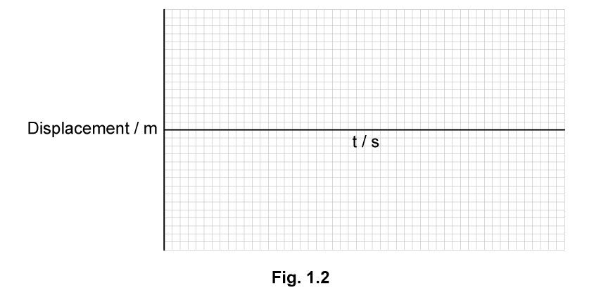
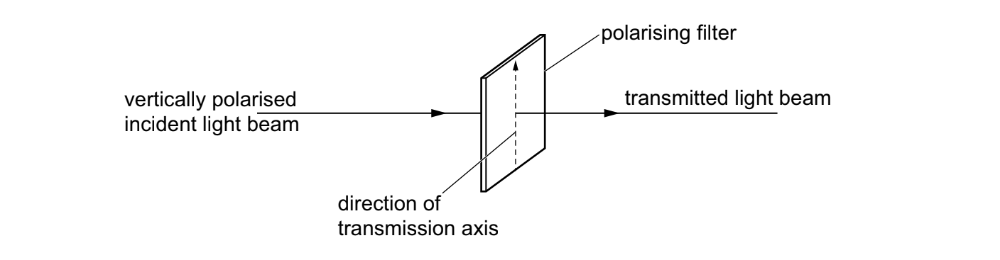
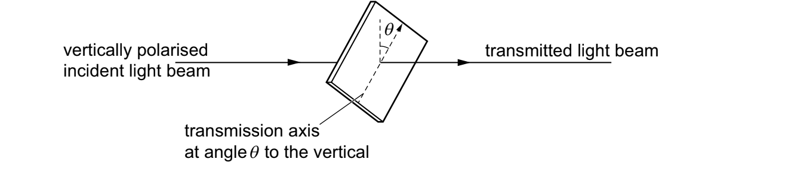
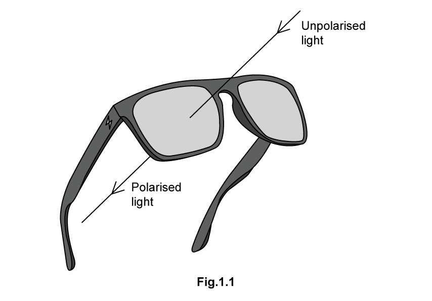
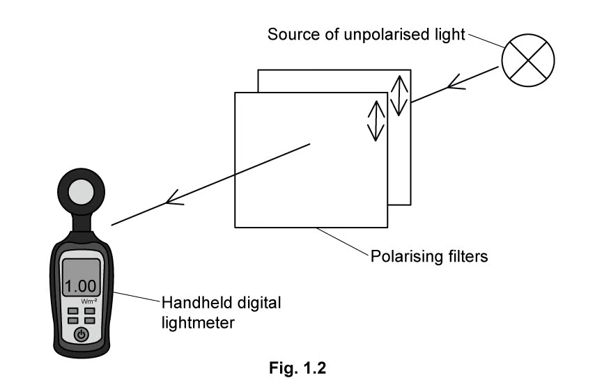
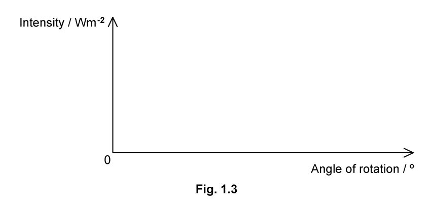
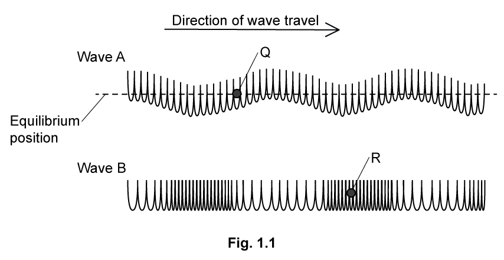
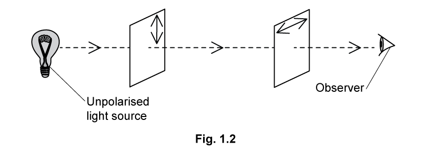

### 7.1 Waves: Transverse & Longitudinal - Medium

::: {.question-card}
#### Example 1 · 7.1 SQ Medium Q1

Circular water waves are produced by vibrating dippers at points P and Q, as illustrated in Fig. 4.1.

{.question-figure fig-alt="Circular wavefronts from two dippers P and Q, with point R where PR is 44 cm and QR is 29 cm"}

The waves from P alone have the same amplitude at point R as the waves from Q alone. Distance PR is 44 cm and distance QR is 29 cm.

The dippers vibrate in phase with a period of 1.5 s to produce waves of speed $4.0\ \mathrm{cm\,s^{-1}}$.

**(a)** Calculate the wavelength of the waves.

wavelength = ____________ cm `[2]`

**(b)** Calculate the path difference at point R of the waves from P and Q.
Give your answer in terms of the wavelength $\lambda$ of the waves.

path difference = ____________ `[2]`

**(c)** Describe the motion, if any, of the water particles at point R.

Explain your answer.

`[5 marks]`

Show mark scheme / model answer

- **(a)** Use the wave equation $v=f\lambda$. `[1]` $\lambda=vT=4.0\times1.5=6.0\ \mathrm{cm}$. `[1]`
- **(b)** Path difference $=PR-QR=44-29=15\ \mathrm{cm}$. `[1]` Number of wavelengths $=15/6=2.5$, so path difference $=2.5\lambda$ (or $\tfrac{5}{2}\lambda$). `[1]`
- **(c)** The path difference is an odd number of half wavelengths, so the waves arrive with a phase difference of 180° (antiphase). `[1]` This causes destructive interference, `[1]` so the particles at R are at rest / have no motion. `[1]`

`[Total: 5 marks]`

:::

::: {.question-card}
#### Example 2 · 7.1 SQ Medium Q2

A wave on the surface of a ripple tank moves from the source at the rear of the tank to the front. The graph in Fig. 1.1 shows the variation with distance $x$ of the displacement of the surface of the water.

The solid line shows the displacement at $t=0$ and the dashed line shows the displacement at $t=0.154\ \mathrm{s}$.

{.question-figure fig-alt="Displacement against distance graph for a wave on a ripple tank, solid line at t = 0 and dashed line at t = 0.154 s"}

**(a)** Describe the difference between transverse and longitudinal waves. `[2 marks]`

**(b)** Calculate for the wave on the ripple tank:

**(i)** the speed; `[2]`

**(ii)** the frequency. `[2]`

`[4 marks]`

**(c)** The graph in Fig. 1.1 shows the motion of the water waves at a point where displacement is less than 6.0 cm.

Describe the appearance of the wave after being displaced by twice this distance. `[3 marks]`

**(d)** The initial amplitude of the ripples is 0.38 cm.

Sketch a graph of displacement against time to show the motion of the surface of the water for the first 3.0 s. `[3 marks]`

Show mark scheme / model answer

- **(a)** Transverse waves: the direction of vibration of the particles is perpendicular (at 90°) to the direction of motion of the wave / energy transfer. `[1]` Longitudinal waves: the direction of vibration of the particles is parallel to the direction of motion of the wave / energy transfer. `[1]`
- **(b)(i)** From the graph, the wave advances 0.75 cm in 0.154 s (a quarter of a wavelength). `[1]` $v=d/t=7.5\times10^{-3}/0.154=0.049\ \mathrm{m\,s^{-1}}$. `[1]`
- **(b)(ii)** Method 1: from the graph $\lambda=3.0\ \mathrm{cm}=0.03\ \mathrm{m}$; $f=v/\lambda=0.049/0.03=1.6\ \mathrm{Hz}$. `[2]`
- **(c)** Any three from: amplitude decreases as energy is dissipated; `[1]` frequency remains the same (it is set by the source); `[1]` wavelength remains the same; `[1]` speed remains the same. `[1]`
- **(d)** The sketch must show: 5 complete waves within 3.0 s with the time axis marked to 3.0 s; `[1]` the amplitude starting at 0.38 cm; `[1]` the amplitude gradually decreasing with time. `[1]`

`[Total: 12 marks]`

:::

::: {.question-card}
#### Example 3 · 7.1 SQ Medium Q3

**(a)** Explain what is meant by a progressive wave. `[2 marks]`

An elastic cord is fixed at one end and attached to a mechanical oscillator at the other end. Fig. 1.1 shows, at time $t=0$, the shape of a section of the cord as the wave travels from left to right. W, X, Y and Z are four marked points on the cord.

{.question-figure fig-alt="Shape of a wave on an elastic cord at time t = 0 with points W, X, Y and Z marked"}

The mechanical oscillator has a steady frequency of 5.0 Hz. The wave has a wavelength of 0.60 m and an amplitude of 0.030 m.

**(b)** On the axes of Fig. 1.2, sketch the graph of the displacement of point X over the period $t=0$ to 0.40 s. Add suitable scales to the axes.

{.question-figure fig-alt="Empty axes labelled displacement in metres against time in seconds"}

`[4 marks]`

**(c)** For time $t=0$, state which of the points W, X, Y and Z:

**(i)** is instantaneously at rest; `[1]`

**(ii)** has the greatest speed. `[1]`

`[2 marks]`

**(d)** The speed of point W on the cord at $t=0$ is $0.94\ \mathrm{m\,s^{-1}}$. With the cord at its original tension, the frequency of oscillation is now doubled to 10 Hz. The amplitude is kept at 0.030 m.

Calculate the new speed of point W at $t=0$. Explain your reasoning. `[2 marks]`

Show mark scheme / model answer

- **(a)** A progressive wave is a transfer of energy `[1]` with no transfer of matter. `[1]`
- **(b)** The sketch must show: a sinusoidal shape with exactly two wavelengths shown; `[1]` amplitude at $\pm0.03\ \mathrm{m}$; `[1]` period $=0.2\ \mathrm{s}$ with the x-axis labelled 0.1, 0.2, 0.3 and 0.4; `[1]` the curve starting at $(0,\ 0.03)$. `[1]`
- **(c)(i)** X is instantaneously at rest. `[1]`
- **(c)(ii)** W has the greatest speed. `[1]`
- **(d)** Frequency has doubled, so point W must move double the distance in the same time (or the same distance in half the time), so the speed doubles. `[1]` New speed $=2\times0.94=1.9\ \mathrm{m\,s^{-1}}$. `[1]`

`[Total: 10 marks]`

:::

### 7.2 Transverse Waves: EM Spectrum & Polarisation - Medium

::: {.question-card}
#### Example 4 · 7.2 SQ Medium Q1

A beam of vertically polarised monochromatic light is incident on a polarising filter, as shown in Fig. 5.1.

{.question-figure fig-alt="Vertically polarised light incident on a polarising filter with the transmission axis initially vertical"}

The transmission axis of the filter is initially vertical and the transmitted light beam has the same intensity as the incident light beam.

The filter may be rotated about the direction of the light beam to change the angle of the transmission axis to the vertical.

**(a)** State one angle of the transmission axis to the vertical that results in no transmitted light beam.

angle = ____________ `[1 mark]`

The filter is now positioned with its transmission axis at an angle $\theta$ to the vertical, as shown in Fig. 5.2.

{.question-figure fig-alt="Vertically polarised incident light with the transmission axis at an angle theta to the vertical"}

The ratio

$$\frac{\text{intensity of transmitted light}}{\text{intensity of incident light}}$$

is equal to 0.75.

**(b)** Calculate angle $\theta$. `[2]`

**(c)** Calculate the ratio

$$\frac{\text{amplitude of transmitted light}}{\text{amplitude of incident light}}.$$

ratio = ____________ `[2]`

`[4 marks]`

Show mark scheme / model answer

- **(a)** 90° (to the vertical). `[1]`
- **(b)** Use Malus's law: $I/I_0=\cos^2\theta=0.75$. `[1]` $\theta=\cos^{-1}(\sqrt{0.75})=30°$. `[1]`
- **(c)** Intensity is proportional to amplitude squared, so $A/A_0=\sqrt{0.75}$. `[1]` $A/A_0=0.866\approx0.87$ (2 s.f.). `[1]`

`[Total: 5 marks]`

:::

::: {.question-card}
#### Example 5 · 7.2 SQ Medium Q2

Unpolarised light is passed through a pair of polarising sunglasses as shown in Fig. 1.1. The light becomes plane polarised.

{.question-figure fig-alt="Unpolarised light entering polarising sunglasses and emerging as plane polarised light"}

**(a)** Explain the difference between unpolarised and plane polarised light. `[3 marks]`

In an experiment to investigate polarising filters, two square filters are used.

Initially, they are placed between the source of unpolarised light and a hand-held digital light meter, as shown in Fig. 1.2. The planes of polarisation of the filters are indicated by double-headed arrows.

{.question-figure fig-alt="Source of unpolarised light, two polarising filters and a hand-held digital light meter"}

The light meter measures the intensity of radiation as $1.00\ \mathrm{W\,m^{-2}}$.

One of the polarising filters is then rotated, as shown.

**(b)** Sketch a graph, using the axes as shown in Fig. 1.3, to show how the intensity of light measured by the light meter varies as the filter is rotated from 0° to 90°.

{.question-figure fig-alt="Axes labelled intensity in watts per metre squared against angle of rotation in degrees"}

`[3 marks]`

Polarisation can be used to identify when some materials are under stress. Placing the material under stress causes the plane of polarisation of the light passing through the material to be rotated. The greater the stress, the greater the rotation of the plane of polarisation of the light.

A piece of transparent material under stress is positioned between two polarising filters. There is an angle of 90° between the planes of polarisation of the two polarising filters.

{.question-figure fig-alt="Photograph showing bright and dark areas of a stressed transparent material between crossed polarisers"}

**(c)** Explain how this photograph can be used to identify areas of the material with different amounts of stress. `[3 marks]`

Show mark scheme / model answer

- **(a)** Unpolarised light vibrates / oscillates in all planes. `[1]` Plane polarised light vibrates / oscillates in one plane. `[1]` The planes of oscillation are perpendicular to the direction of wave travel. `[1]`
- **(b)** The sketch must show: correct numbers added to both axes; `[1]` a single maximum at 0° and a single minimum at 90°; `[1]` the graph starting at $(0,\ 0.5)$ with the gradient increasing to $(90,\ 0)$. `[1]`
- **(c)** Polarising filters at 90° to each other do not allow light to pass through. `[1]` Rotation of the plane of polarisation (due to stress) allows light to pass. `[1]` Darker areas represent less stress, or brighter areas represent greater stress. `[1]`

`[Total: 9 marks]`

:::

::: {.question-card}
#### Example 6 · 7.2 SQ Medium Q3

Fig. 1.1 shows two ways in which a wave can be made to travel along a slinky spring.

{.question-figure fig-alt="Two waves A and B travelling along a slinky spring with points Q and R marked"}

**(a)** Use arrows to show how points Q and R will move next as the two waves move to the right. `[2 marks]`

**(b)** Use the diagram in Fig. 1.1.

**(i)** State which wave in Fig. 1.1 can be used to model an electromagnetic wave. `[1]`

**(ii)** Hence explain why it is important to correctly align a radio antenna in order to receive the strongest signal. `[2]`

`[3 marks]`

Light from a filament lamp is viewed through two polarising filters A and B, as shown in Fig. 1.2. The direction of plane polarisation is indicated on each filter using a double-headed arrow.

{.question-figure fig-alt="Observer viewing unpolarised light from a filament lamp through two polarising filters A and B"}

**(c)** Explain why the observer cannot see light from the filament lamp. `[2 marks]`

**(d)** Polaroid sunglasses are sold as sporting equipment to people who fish, sail and kayak.

Explain how polaroid sunglasses can be used to more clearly see objects such as fish, rocks and other obstacles which are under the surface of water, by a person who is above the water. `[3 marks]`

Show mark scheme / model answer

- **(a)** Q moving downwards. `[1]` R moving to the left. `[1]`
- **(b)(i)** Wave A can be used to model electromagnetic waves. `[1]`
- **(b)(ii)** Transmitted radio waves are polarised. `[1]` Antennae must be aligned to the same angle / plane of polarisation. `[1]`
- **(c)** Light passing through polarising filter A is vertically polarised. `[1]` Only light in the horizontal plane / horizontally polarised light will pass through polarising filter B. `[1]`
- **(d)** The glasses minimise / reduce glare from sunlight. `[1]` Reflected light from the surface of the water undergoes partial plane polarisation. `[1]` The glasses' polarising filter absorbs light in one plane of polarisation, therefore reducing glare. `[1]`

`[Total: 10 marks]`

:::
