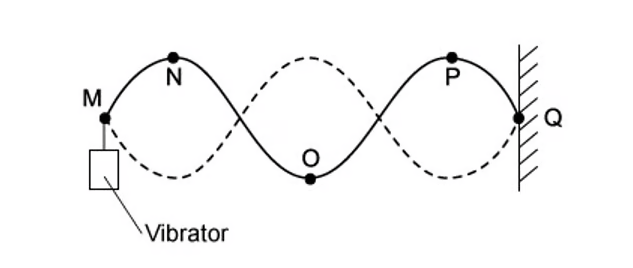
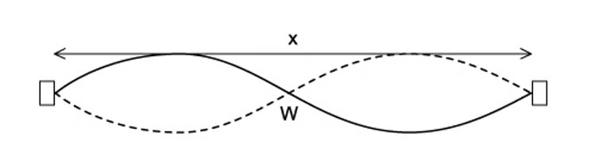
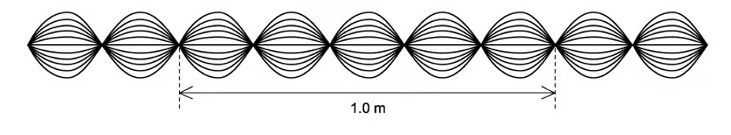
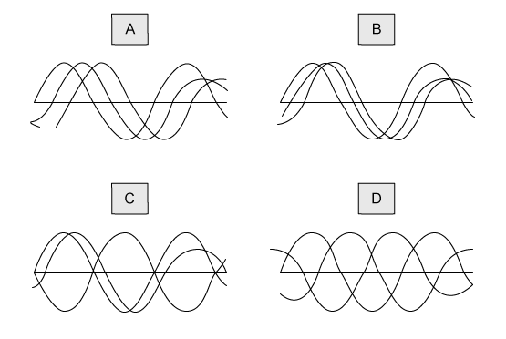
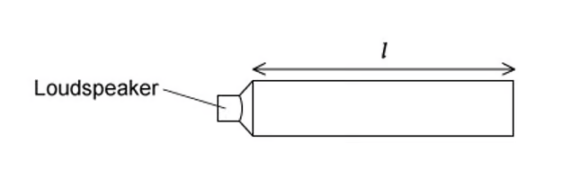
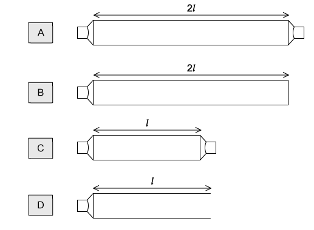
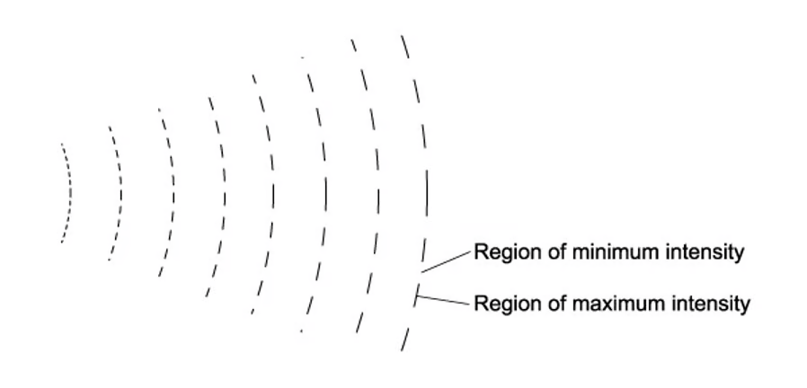

### 8.1 Stationary Waves - Easy

::: {.question-card}
#### Example 1 · 8.1 MC Easy Q1

A stationary wave shown in the diagram was created on a stretched string, it had two instants of maximum vertical displacement.

The frequency of the wave is 13 Hz.

{.question-figure fig-alt="Diagram of a stationary wave on a stretched string with a length of 90 cm marked"}

What is the speed of the wave?

A. 3.9 m s$^{-1}$

B. 7.8 m s$^{-1}$

C. 390 m s$^{-1}$

D. 780 m s$^{-1}$

Show answer and explanation

**Answer: B.** The diagram shows 1.5 waves in 90 cm, so $\lambda = 90/1.5 = 60\ 	ext{cm} = 0.60\ 	ext{m}$. Speed $v = f\lambda = 13 	imes 0.60 = 7.8\ 	ext{m s}^{-1}$.

:::

::: {.question-card}
#### Example 2 · 8.1 MC Easy Q2

The table shows some statements about stationary and progressive waves.

Which row is correct?

| | Progressive wave | Stationary wave |
|---|---|---|
| A | particles one wavelength apart vibrate in phase | particles one wavelength apart vibrate in phase |
| B | particles vibrate in phase with their immediate neighbours | particles in adjacent loops vibrate in antiphase |
| C | energy is transferred along the wave | energy is transferred along the wave |
| D | all particles vibrate with the same amplitude | all particles vibrate with the same amplitude |

Show answer and explanation

**Answer: A.** In a progressive wave, particles one wavelength apart are in phase. In a stationary wave, particles one wavelength apart (i.e. in the same loop) are also in phase. B is incorrect because in a progressive wave, adjacent particles are not necessarily in phase. C is incorrect because stationary waves do not transfer energy. D is incorrect because in a stationary wave, particles at nodes have zero amplitude.

:::

::: {.question-card}
#### Example 3 · 8.1 MC Easy Q3

When a stationary wave is produced in a tube, which of the following statements describes the wave speed?

A. it is the speed of a particle at a node

B. it is the speed of one of the progressive waves that are producing the stationary wave

C. it is the speed at which energy is transferred from one antinode to an adjacent antinode

D. it is the distance between two adjacent nodes divided by the period of the wave

Show answer and explanation

**Answer: B.** The wave speed of a stationary wave is the speed of one of the progressive waves that are producing the stationary wave. The speed of the progressive wave is $v = f\lambda$, not the speed of a particle at a node (which is zero), nor the speed at which energy is transferred (there is no net energy transfer).

:::

::: {.question-card}
#### Example 4 · 8.1 MC Easy Q4

A stretched string is set up to demonstrate a stationary wave between two points M and Q.

{.question-figure fig-alt="A stretched string with a vibrator showing a stationary wave pattern"}

Which of the following statements are correct?

A. the distance between M and Q is three wavelengths

B. the wave shown has the lowest possible frequency

C. points N and P vibrate in phase

D. point O is at a node

Show answer and explanation

**Answer: C.** N and P are in adjacent loops of the stationary wave, and points in adjacent loops vibrate in phase because they are separated by one wavelength. A is incorrect — the distance between M and Q is one wavelength. B is incorrect — the wave shown is the fundamental mode (lowest frequency), so this statement is actually true, but let's check: the lowest frequency mode has one loop. Here there are two loops, so it's the second harmonic. D is incorrect — point O is at an antinode.

:::

::: {.question-card}
#### Example 5 · 8.1 MC Easy Q5

A stretched string is used to demonstrate a stationary wave, as shown in the diagram.

{.question-figure fig-alt="A stationary wave on a string showing the length x and point W"}

Which row in the table correctly describes the length of x and the name of W?

| | Length x | Point W |
|---|---|---|
| A | two wavelengths | node |
| B | one wavelength | node |
| C | two wavelengths | antinode |
| D | one wavelength | antinode |

Show answer and explanation

**Answer: B.** The distance x spans one complete wave (from one node to the next node one wavelength away). Point W is at a node (zero displacement).

:::

:::

### 8.1 Stationary Waves - Medium

::: {.question-card}
#### Example 6 · 8.1 MC Medium Q1

A student was investigating the speed of a transverse wave on a stretched spring. They found that by adjusting the tension on the spring, they were able to change the speed.

The wave pattern produced is shown in the diagram; the frequency of the oscillator was set to 650 Hz.

{.question-figure fig-alt="A stretched spring with an oscillator producing a stationary wave pattern"}

What needs to be changed to maintain the same wave pattern when the frequency is increased to 750 Hz?

A. increase the speed of the wave on the string

B. increase the wavelength of the wave on the string

C. decrease the wavelength of the wave on the string

D. decrease the speed of the wave on the string

Show answer and explanation

**Answer: A.** To maintain the same wave pattern (same number of loops), the wavelength must stay the same. Since $v = f\lambda$, if $f$ increases and $\lambda$ stays the same, the speed $v$ must increase.

:::

::: {.question-card}
#### Example 7 · 8.1 MC Medium Q2

The pattern produced when two waves are produced by superposition of sound waves from a loudspeaker reflected by a metal sheet.

Q, R, S and T are four points on the line through the centre of these waves.

{.question-figure fig-alt="Diagram showing sound waves from a loudspeaker reflected by a metal sheet with points Q, R, S, T marked"}

Which of the following statements is correct?

A. a node is a quarter of a wavelength from an adjacent antinode

B. the stationary waves oscillate at right angles to the line QT

C. an antinode is formed at the surface of the metal sheet

D. the oscillations at R are in phase with those at S

Show answer and explanation

**Answer: A.** The distance between a node and the nearest antinode is $\lambda/4$. B is incorrect — sound waves are longitudinal, so they oscillate parallel to the direction of travel. C is incorrect — the metal sheet is a fixed end, so a node is formed there. D is incorrect — R and S are in adjacent loops and are in antiphase.

:::

::: {.question-card}
#### Example 8 · 8.1 MC Medium Q3

Headphones that have noise reduction can cancel out external noise by producing their own waves. They are fitted with a microphone that detects the external sound frequency. The loudspeaker then produces a wave with the same frequency but different phase.

What would be the phase difference needed to cancel out the external sound?

A. 360°

B. 270°

C. 180°

D. 90°

Show answer and explanation

**Answer: C.** For destructive interference (cancellation), the two waves must be in antiphase, which requires a phase difference of 180°.

:::

::: {.question-card}
#### Example 9 · 8.1 MC Medium Q4

The diagram below shows a wave pattern over time.

{.question-figure fig-alt="A wave pattern shown over time"}

What is the correct description of the wave?

A. the wave is transverse, has a wavelength of 40 cm and is stationary

B. the wave is transverse, has a wavelength of 40 cm and is progressive

C. the wave is transverse, has a wavelength of 20 cm and is stationary

D. the wave is longitudinal, has a wavelength of 20 cm and is stationary

Show answer and explanation

**Answer: D.** The wave shows nodes and antinodes, so it is stationary. From the diagram, the wavelength is 20 cm and the wave is longitudinal (the particles oscillate parallel to the direction of travel, as shown by the compression/rarefaction pattern).

:::

::: {.question-card}
#### Example 10 · 8.1 MC Medium Q5

The diagram below shows a sound wave produced in a column by a loudspeaker. The speed of sound in air is 330 m s$^{-1}$.

{.question-figure fig-alt="A sound wave in a column with a loudspeaker, length 60.0 cm marked"}

What is the frequency of the wave?

A. 1650 Hz

B. 830 Hz

C. 550 Hz

D. 413 Hz

Show answer and explanation

**Answer: D.** The diagram shows a closed pipe with a node at the closed end and an antinode at the open end. The length 60.0 cm = $\lambda/4$, so $\lambda = 2.40\ 	ext{m}$. Frequency $f = v/\lambda = 330/2.40 = 137.5\ 	ext{Hz}$. Wait — let me recalculate: Actually the diagram shows a different configuration. If the pipe length is 60.0 cm = 3$\lambda/4$ (three quarters of a wavelength), then $\lambda = 0.80\ 	ext{m}$, and $f = 330/0.80 pprox 413\ 	ext{Hz}$.

:::

::: {.question-card}
#### Example 11 · 8.1 MC Medium Q6

Each of the diagrams below shows three waves; each of the waves have the same amplitude and frequency but have different phases. The waves are added together to give a resultant wave. In which case would the resultant wave be zero?

{.question-figure fig-alt="Four diagrams showing three waves with different phases being added together"}

Show answer and explanation

**Answer: A.** In diagram A, the three waves are equally spaced in phase (120° apart). When three waves of equal amplitude and 120° phase difference are superposed, the resultant displacement is zero at all times.

:::

::: {.question-card}
#### Example 12 · 8.1 MC Medium Q7

A stationary sound wave produced in a tube has a series of nodes. The distance between the first node and the sixth node is 30 cm.

What is the wavelength of the wave?

A. 12.0 cm

B. 10.0 cm

C. 6.0 cm

D. 5.0 cm

Show answer and explanation

**Answer: A.** The distance between the first and sixth node covers 5 node-to-node intervals. Each interval is $\lambda/2$. So $5 	imes (\lambda/2) = 30\ 	ext{cm}$, giving $\lambda = 30 	imes 2/5 = 12.0\ 	ext{cm}$.

:::

:::

### 8.1 Stationary Waves - Hard

::: {.question-card}
#### Example 13 · 8.1 MC Hard Q1

A demonstration of a standing wave is set up using a loudspeaker. The loudspeaker is emitting sound with a frequency $f$ and is placed at one end of the pipe with length $l$. The pipe is closed at the other end.

{.question-figure fig-alt="Diagram of pipes with loudspeakers for demonstrating standing waves"}

Different pipes were set up with either one or two loudspeakers of frequency $f$. The pairs of loudspeakers were in phase with each other. Which pipe would contain a standing wave?

Show answer and explanation

**Answer: A.** For a standing wave to be produced, the waves must travel in opposite directions. In pipe A, the wave from the loudspeaker travels to the closed end, reflects, and interferes with the incident wave. In the other configurations, the waves from the two loudspeakers travel in the same direction or do not produce a standing wave.

:::

::: {.question-card}
#### Example 14 · 8.1 MC Hard Q2

When a wind instrument is used to create a note, a stationary wave is produced in the column. An example of this is the horn.

{.question-figure fig-alt="Diagram of a horn showing the mouthpiece and bell"}

For the range of notes produced by the horn, a node is formed at the mouthpiece and an antinode is formed at the bell. The frequency of the lowest note is 75 Hz.

What would be the frequencies of the next two higher notes for this air column?

| | First higher note / Hz | Second higher note / Hz |
|---|---|---|
| A | 225 | 375 |
| B | 150 | 300 |
| C | 150 | 225 |
| D | 75 | 150 |

Show answer and explanation

**Answer: A.** The horn behaves like a closed pipe (node at one end, antinode at the other). For a closed pipe, harmonics are odd multiples of the fundamental: $f_n = (2n-1)f_1$. So the first higher note is $3 	imes 75 = 225\ 	ext{Hz}$, and the second is $5 	imes 75 = 375\ 	ext{Hz}$.

:::

::: {.question-card}
#### Example 15 · 8.1 MC Hard Q3

A glass tube closed at one end, with a layer of fine powder laid inside as shown in the diagram, was set up. Sound was emitted from the loudspeaker and placed near the open end of the tube.

The frequency of the sound wave was changed; at one frequency a stationary wave was formed, and the powder formed 4 heaps. The distance between the four heaps of powder was 30 cm.

{.question-figure fig-alt="Glass tube with powder forming 4 heaps"}

The speed of sound in the tube is 330 m s$^{-1}$. What is the frequency of the sound?

A. 6600 Hz

B. 1650 Hz

C. 3300 Hz

D. 2200 Hz

Show answer and explanation

**Answer: B.** The 4 heaps of powder correspond to 4 nodes. The distance between the first and fourth heap covers 3 node-to-node intervals. Each interval is $\lambda/2$, so $3 	imes (\lambda/2) = 30\ 	ext{cm}$, giving $\lambda = 20\ 	ext{cm} = 0.20\ 	ext{m}$. Frequency $f = v/\lambda = 330/0.20 = 1650\ 	ext{Hz}$.

:::

:::

### 8.2 Diffraction & Interference - Easy

::: {.question-card}
#### Example 16 · 8.2 MC Easy Q1

Which of the following is the definition of diffraction?

A. change of direction when waves cross the boundary between one medium and another

B. splitting of white light into colours

C. addition of two coherent waves to produce a stationary wave pattern

D. bending of waves around an obstacle

Show answer and explanation

**Answer: D.** Diffraction is the bending/spreading of waves around an obstacle or through an aperture. A describes refraction, B describes dispersion, and C describes superposition/interference.

:::

::: {.question-card}
#### Example 17 · 8.2 MC Easy Q2

Two fringes were created on a screen in a double-slit experiment; the distances were too small to measure.

Which of the following would increase the distance between the fringes?

A. increasing the frequency of the light source

B. increasing the distance between the light source and the slits

C. increasing the distance between the slits and the screen

D. increasing the distance between the slits

Show answer and explanation

**Answer: C.** The fringe spacing $x = \lambda D / a$. Increasing $D$ (distance from slits to screen) increases the fringe spacing. A is incorrect because increasing $f$ decreases $\lambda$, which decreases $x$. D is incorrect because increasing $a$ (slit separation) decreases $x$.

:::

::: {.question-card}
#### Example 18 · 8.2 MC Easy Q3

The diagram shows the pattern of waves. The source of the waves was unable to be seen.

{.question-figure fig-alt="Wave pattern showing regions of minimum and maximum intensity"}

Which of the following would cause this pattern?

A. diffraction only

B. interference only

C. coherence only

D. diffraction and interference

Show answer and explanation

**Answer: D.** The pattern shows both diffraction (waves spreading out after passing through an aperture) and interference (the alternating regions of maximum and minimum intensity).

:::

::: {.question-card}
#### Example 19 · 8.2 MC Easy Q4

An atomic lattice has a spacing of around $10^{-10}$ m. Which electromagnetic wave would cause the most significant diffraction effect?

A. X-ray

B. infra-red

C. microwave

D. ultraviolet

Show answer and explanation

**Answer: A.** Significant diffraction occurs when the wavelength is comparable to the size of the obstacle/gap. X-rays have wavelengths around $10^{-10}$ m, matching the atomic lattice spacing. Infra-red, microwave and ultraviolet wavelengths are much larger.

:::

::: {.question-card}
#### Example 20 · 8.2 MC Easy Q5

A student set up an experiment with a diffraction grating. They put a narrow beam of monochromatic light incident along the normal. They found that the third-order diffracted beams are formed at angles of 45° to the original direction.

Which of the following gives the highest order of diffracted beam produced by this grating?

A. 6th

B. 5th

C. 4th

D. 3rd

Show answer and explanation

**Answer: C.** Using $d\sin	heta = n\lambda$, for $n=3$, $	heta = 45^\circ$, so $d\sin45^\circ = 3\lambda$, giving $d = 3\lambda/\sin45^\circ = 3\sqrt{2}\lambda$. The maximum order occurs when $\sin	heta = 1$, so $n_{	ext{max}} = d/\lambda = 3\sqrt{2} pprox 4.24$. Therefore the highest integer order is 4.

:::

