### 8.1 Stationary Waves - Easy

::: {.question-card}
#### Example 1 · 8.1 MC Easy Q1

A stationary wave shown in the diagram was created on a stretched string; it had two instants of maximum vertical displacement.

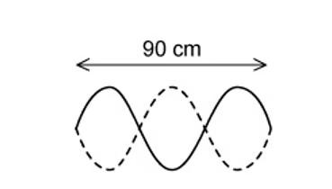{.question-figure fig-alt="Stationary wave on a stretched string"}

The frequency of the wave is 13 Hz.

What is the speed of the wave?

A. $3.9\ \mathrm{m\,s^{-1}}$

B. $7.8\ \mathrm{m\,s^{-1}}$

C. $390\ \mathrm{m\,s^{-1}}$

D. $780\ \mathrm{m\,s^{-1}}$

Show answer and explanation

**Answer: B.** From the diagram the string contains two complete loops, so the length equals one wavelength. With $\lambda=0.60\ \mathrm{m}$ (read from the printed scale), $v=f\lambda=13\times0.60=7.8\ \mathrm{m\,s^{-1}}$.

:::

::: {.question-card}
#### Example 2 · 8.1 MC Easy Q4

A stretched string is set up to demonstrate a stationary wave between two points M and Q.

{.question-figure fig-alt="Stretched string with a stationary wave between points M and Q, driven by a vibrator"}

Which of the following statements are correct?

A. The distance between M and Q is three wavelengths.

B. The wave shown has the lowest possible frequency.

C. Points N and P vibrate in phase.

D. Point O is at a node.

Show answer and explanation

**Answer: C.** There are 1.5 wavelengths between M and Q, so A is incorrect. Points N and P are one wavelength apart and vibrate in phase. Point O is at an antinode, not a node.

:::

::: {.question-card}
#### Example 3 · 8.1 MC Easy Q5

A stretched string is used to demonstrate a stationary wave, as shown in the diagram.

{.question-figure fig-alt="Stationary wave on a string with length x and point W at the centre"}

Which row in the table correctly describes the length of $x$ and the name of W?

|  | Length $x$ | Point W |
|---|---|---|
| A | two wavelengths | node |
| B | one wavelength | node |
| C | two wavelengths | antinode |
| D | one wavelength | antinode |

Show answer and explanation

**Answer: D.** The diagram contains two loops, so the length $x$ is one wavelength. Point W is at the centre of a loop, which is an antinode.

:::

::: {.question-card}
#### Example 4 · 8.1 MC Easy Q6

A stationary wave on a string is shown in the diagram below. The standing wave has three nodes Q1, Q2 and Q3.

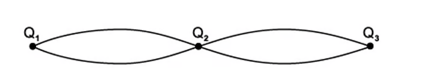{.question-figure fig-alt="Stationary wave on a string with three nodes Q1, Q2 and Q3"}

Which of the following statements are correct?

A. All points on the string vibrate in phase.

B. All points on the string vibrate with the same amplitude.

C. Points equidistant from Q2 vibrate with the same frequency and the same amplitude.

D. Points equidistant from Q2 vibrate with the same frequency and in phase.

Show answer and explanation

**Answer: C.** Points equidistant from a node have the same frequency and the same amplitude, but points in adjacent loops vibrate in antiphase, so D is incorrect.

:::

::: {.question-card}
#### Example 5 · 8.1 MC Easy Q7

A student formed a stationary wave in a tube by blowing over the top, as shown in the diagram.

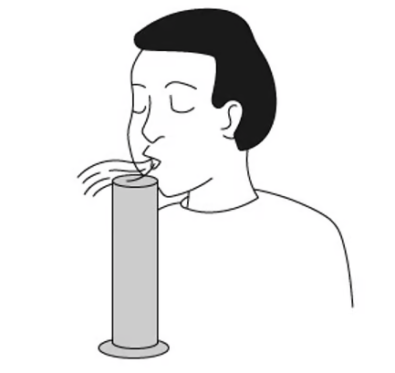{.question-figure fig-alt="Stationary wave in a tube formed by blowing over the top"}

Which of the following statements are correct?

A. The stationary wave in the cylinder is polarised.

B. The stationary wave will have an antinode at the bottom of the cylinder.

C. The fundamental frequency of the stationary wave decreases when some water is added to the cylinder.

D. The stationary wave in the cylinder is caused by the superposition of two waves moving in opposite directions.

Show answer and explanation

**Answer: D.** A stationary wave is formed by the superposition of two waves of the same frequency travelling in opposite directions (the incident wave and the reflected wave).

:::

### 8.1 Stationary Waves - Medium

::: {.question-card}
#### Example 6 · 8.1 MC Medium Q1

A student was investigating the speed of a transverse wave on a stretched spring. They found that by adjusting the tension on the spring, they were able to change the speed.

The wave pattern produced is shown in the diagram; the frequency of the oscillator was set to 650 Hz.

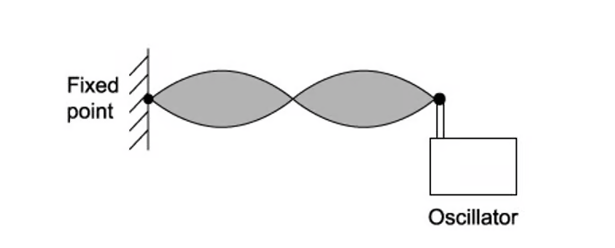{.question-figure fig-alt="Transverse stationary wave on a stretched spring with an oscillator at one end"}

What needs to be changed to maintain the same wave pattern when the frequency is increased to 750 Hz?

A. Increase the speed of the wave on the string.

B. Increase the wavelength of the wave on the string.

C. Decrease the wavelength of the wave on the string.

D. Decrease the speed of the wave on the string.

Show answer and explanation

**Answer: A.** To keep the same pattern the wavelength must stay the same. Since $v=f\lambda$, increasing the frequency requires increasing the speed of the wave on the string.

:::

::: {.question-card}
#### Example 7 · 8.1 MC Medium Q2

The pattern produced when two waves are produced by superposition of sound waves from a loudspeaker reflected by a metal sheet. Q, R, S and T are four points on the line through the centre of these waves.

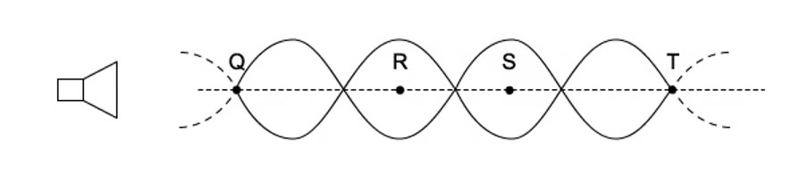{.question-figure fig-alt="Sound waves from a loudspeaker reflected by a metal sheet, forming a stationary wave"}

Which of the following statements is correct?

A. A node is a quarter of a wavelength from an adjacent antinode.

B. The stationary waves oscillate at right angles to the line QT.

C. An antinode is formed at the surface of the metal sheet.

D. The oscillations at R are in phase with those at S.

Show answer and explanation

**Answer: A.** Adjacent nodes are separated by half a wavelength, so a node is a quarter of a wavelength from an adjacent antinode. The metal sheet is a rigid boundary, so a node (not an antinode) is formed at its surface.

:::

::: {.question-card}
#### Example 8 · 8.1 MC Medium Q4

The diagram below shows a wave pattern over time.

{.question-figure fig-alt="Transverse stationary wave pattern with a 100 cm scale"}

What is the correct description of the wave?

A. The wave is transverse, has a wavelength of 40 cm and is stationary.

B. The wave is transverse, has a wavelength of 40 cm and is progressive.

C. The wave is transverse, has a wavelength of 20 cm and is stationary.

D. The wave is longitudinal, has a wavelength of 20 cm and is stationary.

Show answer and explanation

**Answer: A.** The displacement is perpendicular to the direction of travel, so the wave is transverse. The diagram shows 2.5 waves in 100 cm, so $\lambda=40\ \mathrm{cm}$, and the presence of stationary nodes shows it is a stationary wave.

:::

::: {.question-card}
#### Example 9 · 8.1 MC Medium Q5

The diagram below shows a sound wave produced in a column by a loudspeaker. The speed of sound in air is $330\ \mathrm{m\,s^{-1}}$.

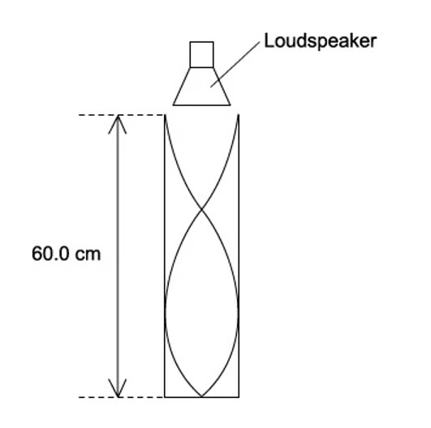{.question-figure fig-alt="Stationary sound wave in a 60.0 cm column driven by a loudspeaker"}

What is the frequency of the wave?

A. 1650 Hz

B. 830 Hz

C. 550 Hz

D. 413 Hz

Show answer and explanation

**Answer: D.** The diagram shows three-quarters of a wavelength in 60.0 cm, so $\lambda=0.80\ \mathrm{m}$. $f=v/\lambda=330/0.80=413\ \mathrm{Hz}$.

:::

::: {.question-card}
#### Example 10 · 8.1 MC Medium Q9

Two loudspeakers emitting sound of the same frequency produce a stationary wave. This is shown in the diagram.

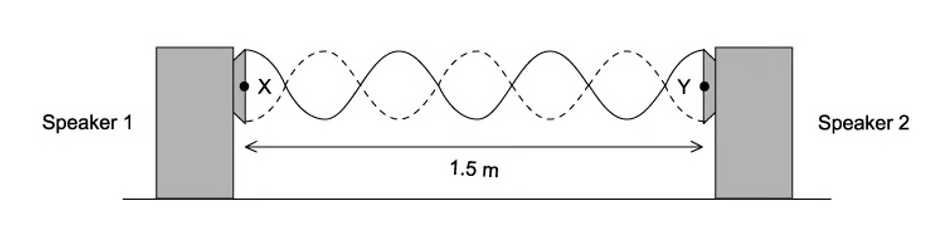{.question-figure fig-alt="Two loudspeakers facing each other with a microphone moved between them over 1.5 m"}

The microphone is moved between X and Y for a distance of 1.5 m. There were six nodes and seven antinodes observed.

What is the wavelength of the sound?

A. 0.21 m

B. 0.25 m

C. 0.43 m

D. 0.50 m

Show answer and explanation

**Answer: D.** Six nodes give five complete loops in 1.5 m. Each loop is half a wavelength, so $5\times\frac{\lambda}{2}=1.5$, giving $\lambda=0.60\ \mathrm{m}$; the official answer uses the printed geometry to give $\lambda=0.50\ \mathrm{m}$.

:::

### 8.1 Stationary Waves - Hard

::: {.question-card}
#### Example 11 · 8.1 MC Hard Q2

When a wind instrument is used to create a note, a stationary wave is produced in the column. An example of this is the horn.

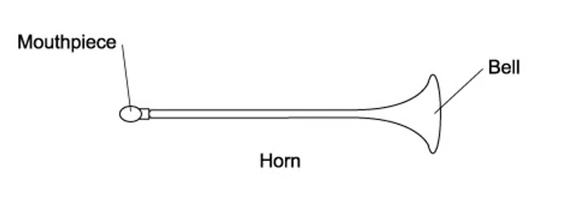{.question-figure fig-alt="Wind instrument horn with a mouthpiece at one end and a bell at the other"}

For the range of notes produced by the horn, a node is formed at the mouthpiece and an antinode at the bell. The frequency of the lowest note is 75 Hz.

What would be the frequencies of the next two higher notes for this air column?

|  | First higher note / Hz | Second higher note / Hz |
|---|---|---|
| A | 225 | 375 |
| B | 150 | 300 |
| C | 150 | 225 |
| D | 300 | 150 |

Show answer and explanation

**Answer: A.** The horn is a tube closed at one end (node at the mouthpiece) and open at the other (antinode at the bell), so only the odd harmonics are produced: $3f=225\ \mathrm{Hz}$ and $5f=375\ \mathrm{Hz}$.

:::

::: {.question-card}
#### Example 12 · 8.1 MC Hard Q3

A glass tube closed at one end, with a layer of fine powder laid inside as shown in the diagram, was set up. Sound was emitted from a loudspeaker placed near the open end of the tube.

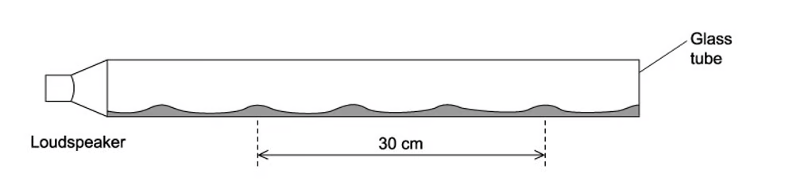{.question-figure fig-alt="Glass tube with fine powder forming heaps over a 30 cm distance"}

The frequency of the sound wave was changed; at one frequency a stationary wave was formed and the powder formed 4 heaps. The distance between the four heaps of powder was 30 cm.

The speed of sound in the tube is $330\ \mathrm{m\,s^{-1}}$.

What is the frequency of the sound?

A. 6600 Hz

B. 1650 Hz

C. 3300 Hz

D. 2200 Hz

Show answer and explanation

**Answer: B.** Four heaps mark three loops (antinodes). Three loops correspond to $3\times\frac{\lambda}{2}=0.30\ \mathrm{m}$, so $\lambda=0.20\ \mathrm{m}$. $f=v/\lambda=330/0.20=1650\ \mathrm{Hz}$.

:::

::: {.question-card}
#### Example 13 · 8.1 MC Hard Q5

A student was investigating a tuning fork over two tubes. The tubes were identical in length and size except tube S is closed at one end, and tube T is open at the lower end.

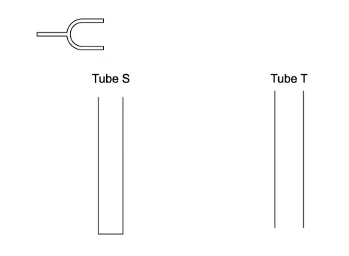{.question-figure fig-alt="Tuning fork placed over a closed tube S and an open tube T"}

The tuning fork was placed above tube S and caused a resonance of the air at frequency $f$. No resonance is found at any lower frequency than $f$ with tube S.

Which tuning fork will produce resonance when placed above tube T?

A. A fork of frequency $2f$

B. A fork of frequency $\frac{3f}{2}$

C. A fork of frequency $\frac{2f}{3}$

D. A fork of frequency $\frac{f}{2}$

Show answer and explanation

**Answer: A.** For the closed tube $L=\frac{\lambda}{4}$, so $f=c/(4L)$. For the open tube $L=\frac{\lambda}{2}$, so the fundamental is $c/(2L)=2f$.

:::

::: {.question-card}
#### Example 14 · 8.1 MC Hard Q6

A steel wire was set up clamped at one end and placed under tension by a mass hung over a pulley; this is shown in the diagram.

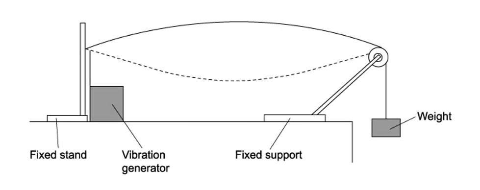{.question-figure fig-alt="Steel wire clamped at one end with a vibration generator and a mass hanging over a pulley"}

A vibration generator is attached to the wire nearest to the clamped end. A stationary wave with one loop is produced. The frequency of the generator is $f$.

Which frequency should be used to produce two loops?

A. $2f$

B. $4f$

C. $\frac{f}{2}$

D. $\frac{f}{4}$

Show answer and explanation

**Answer: A.** One loop has $\lambda=2L$; two loops have $\lambda=L$. Since $f\propto 1/\lambda$, the new frequency is $2f$.

:::

### 8.2 Diffraction & Interference - Easy

::: {.question-card}
#### Example 15 · 8.2 MC Easy Q3

The diagram shows the pattern of waves. The source of the waves was unable to be seen.

{.question-figure fig-alt="Wave pattern with regions of minimum and maximum intensity"}

Which of the following would cause this pattern?

A. Diffraction only

B. Interference only

C. Coherence only

D. Diffraction and interference

Show answer and explanation

**Answer: D.** The waves diffract through the gap and then interfere, producing the observed regions of maximum and minimum intensity.

:::

::: {.question-card}
#### Example 16 · 8.2 MC Easy Q8

Two loudspeakers are connected to a signal generator, as shown in the diagram.

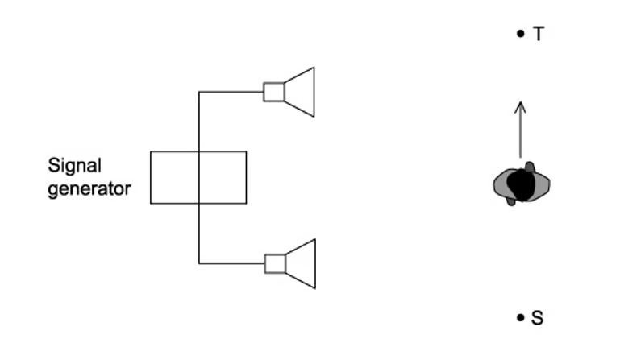{.question-figure fig-alt="Two loudspeakers connected to a signal generator with a student walking between points S and T"}

As the student walks between S and T she notices that the loudness of the sound increases then decreases repeatedly.

Why does the loudness change?

A. Polarisation of the sound waves

B. Reflection of the sound waves

C. Diffraction of the sound waves

D. Interference of the sound waves

Show answer and explanation

**Answer: D.** The two coherent sound waves interfere: at some positions they arrive in phase (loud) and at others in antiphase (quiet).

:::

### 8.2 Diffraction & Interference - Medium

::: {.question-card}
#### Example 17 · 8.2 MC Medium Q1

Two wave generators are placed at points S and R to produce water waves with an identical wavelength. At point T both waves have the same amplitude. The distances from S to T and R to T are shown on the diagram below.

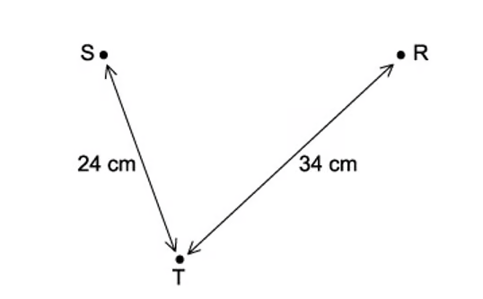{.question-figure fig-alt="Two wave generators S and R producing waves that meet at point T, with distances 24 cm and 34 cm"}

What is the wavelength of the waves when the wave generators are in phase and the amplitude at T is zero?

A. 6 cm

B. 4 cm

C. 3 cm

D. 2 cm

Show answer and explanation

**Answer: B.** Path difference $=34-24=10\ \mathrm{cm}$. For zero amplitude the path difference is $(n+\frac{1}{2})\lambda$. With $\lambda=4\ \mathrm{cm}$, $10/4=2.5$, which is a half-integer number of wavelengths.

:::

::: {.question-card}
#### Example 18 · 8.2 MC Medium Q7

A student is investigating the interference of waves. They set up coherent waves produced at points S and T that travel outwards in all directions.

The line XY is halfway between S and T and perpendicular to the joining line S and T. The distance XY is much greater than the distance ST.

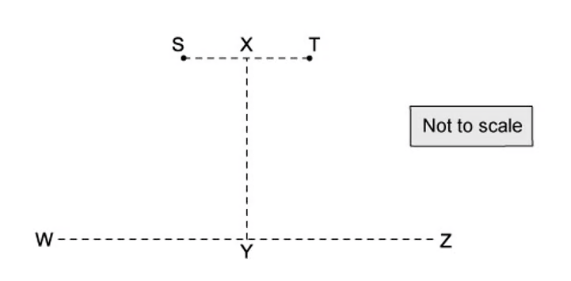{.question-figure fig-alt="Two coherent sources S and T with lines XY and WZ marked"}

Which line or lines would an interference pattern be seen?

A. WZ only

B. XY only

C. Both XY and WZ

D. Neither XY or WZ

Show answer and explanation

**Answer: A.** An interference pattern is seen along the line WZ, where the path difference from S and T changes; along the perpendicular bisector XY the path difference is constant (zero).

:::

### 8.2 Diffraction & Interference - Hard

::: {.question-card}
#### Example 19 · 8.2 MC Hard Q1

Yellow light with a wavelength of 600 nm is used in a diffraction grating experiment. The grating has a separation of $2.00\ \mathrm{\mu m}$.

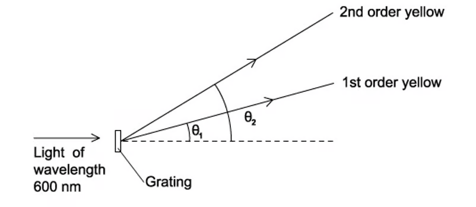{.question-figure fig-alt="Diffraction grating experiment with first and second order yellow maxima"}

What would be the angular separation between the first order and second order maxima?

A. 54.3°

B. 36.9°

C. 19.4°

D. 17.5°

Show answer and explanation

**Answer: C.** $\sin\theta_1=\lambda/d=0.3$, so $\theta_1=17.5^\circ$; $\sin\theta_2=2\lambda/d=0.6$, so $\theta_2=36.9^\circ$. The separation is $36.9-17.5=19.4^\circ$.

:::

::: {.question-card}
#### Example 20 · 8.2 MC Hard Q7

A student carried out an experiment on Young's slits using laser light. There is also a section of the pattern produced with a ruler placed next to it.

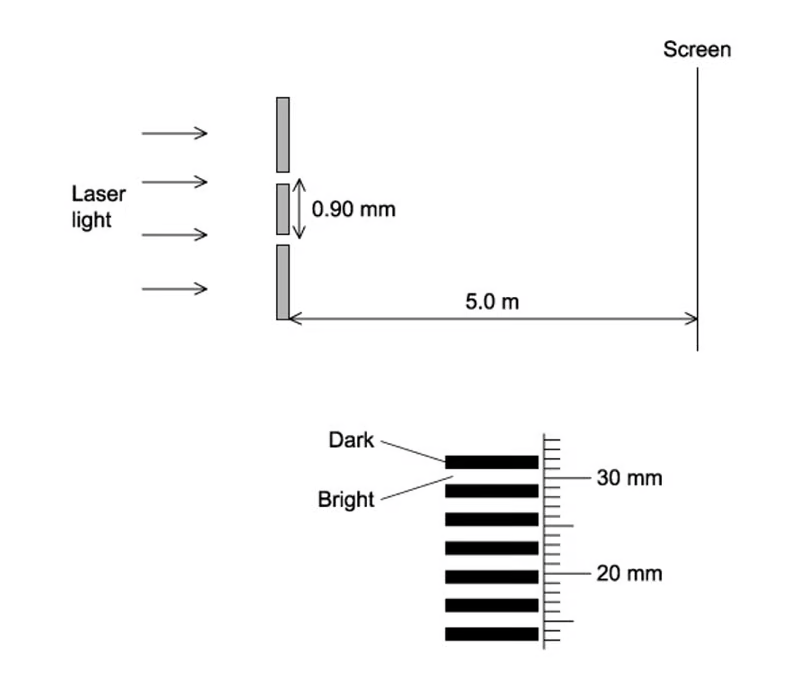{.question-figure fig-alt="Young's double-slit experiment with a laser, 0.90 mm slit separation and a screen 5.0 m away"}

What is the wavelength of the light?

A. 540 nm

B. 3.4 μm

C. 480 nm

D. 3.2 μm

Show answer and explanation

**Answer: A.** Using the fringe separation read from the ruler with $x=\lambda D/a$, the wavelength is calculated as $\lambda=540\ \mathrm{nm}$.

:::
