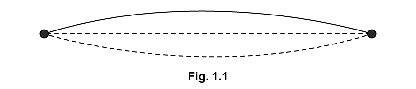
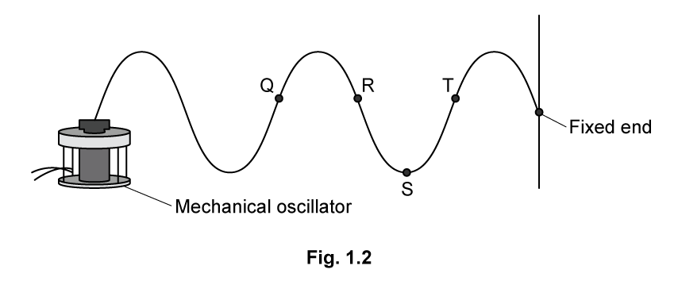
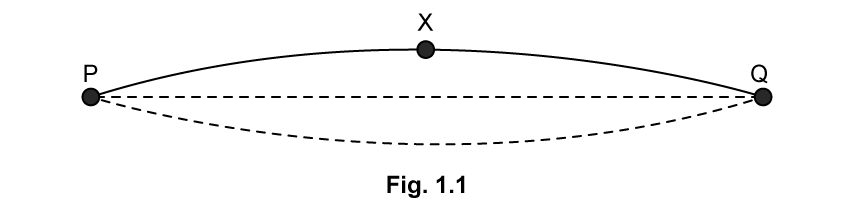
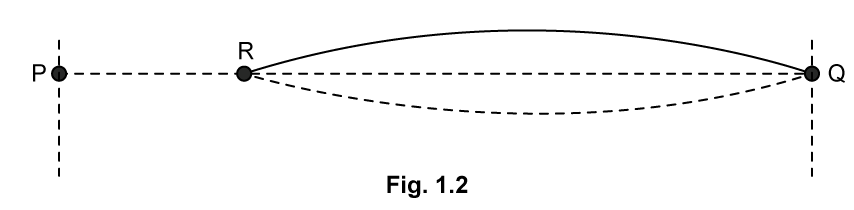
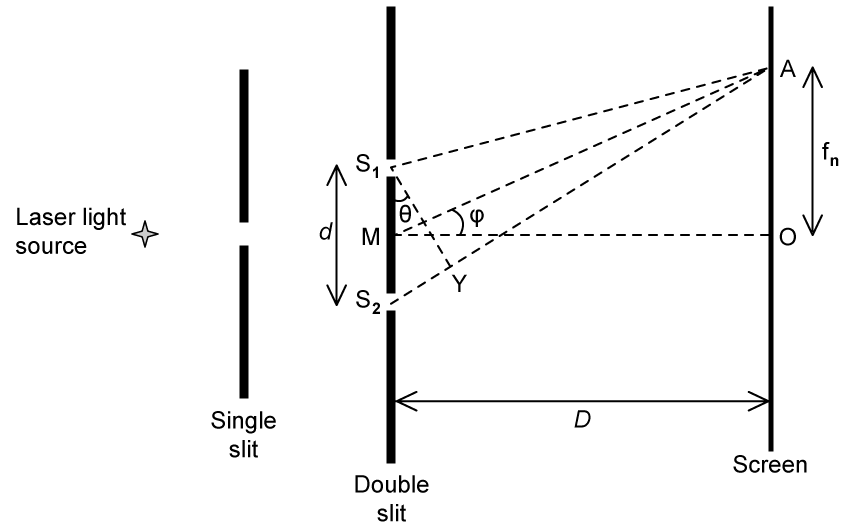
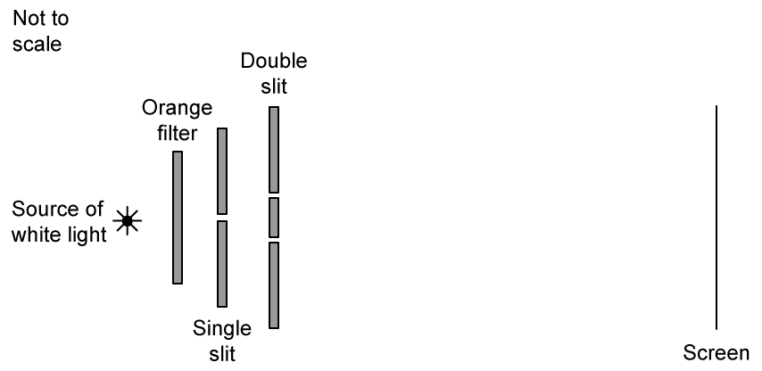

### 8.1 Stationary Waves - Medium

::: {.question-card}
#### Example 1 · 8.1 SQ Medium Q1

**(i)** By reference to the direction of transfer of energy, state what is meant by a transverse wave. `[1]`

**(ii)** State the principle of superposition. `[2]`

`[3 marks]`

Show mark scheme / model answer

- **(i)** A transverse wave is one in which the particle vibrations (oscillations) are perpendicular to the direction of energy transfer. `[1]`
- **(ii)** When waves meet (overlap) at a point, the resultant displacement is the sum of the individual displacements. `[2]`

:::

::: {.question-card}
#### Example 2 · 8.1 SQ Medium Q2

**(a)** A stationary wave on a string is shown in Fig. 1.1.

{.question-figure fig-alt="Stationary wave on a string"}

Explain how the wave is formed, referring to the principle of superposition in your answer. `[4 marks]`

**(b)** On Fig. 1.1, draw the stationary wave that would be formed on the string in part (a) with two more nodes and two more antinodes. `[1 mark]`

**(c)** Fig. 1.2 shows the appearance of a stationary wave on a stretched string at one instant in time.

{.question-figure fig-alt="Stationary wave on a stretched string with a mechanical oscillator and fixed end"}

Mark clearly on the diagram:

**(i)** the equilibrium position; `[1]`

**(ii)** at least two nodes by labelling them N, and two antinodes by labelling them A; `[2]`

**(iii)** the direction in which points Q, R, S and T are about to move. `[2]`

`[5 marks]`

**(d)** For the wave in Fig. 1.2 the frequency of vibration is 180 Hz and the speed of the waves along the string is $60\ \mathrm{m\,s^{-1}}$.

For this wave:

**(i)** calculate the time period of the stationary wave on the string; `[1]`

**(ii)** calculate the length of the string. `[2]`

`[3 marks]`

Show mark scheme / model answer

- **(a)** Progressive waves travel from the centre to the ends and are reflected; `[1]` two waves of the same frequency, wavelength and amplitude travel in opposite directions along the string; `[1]` they superpose (interfere) to produce the stationary wave; `[1]` the maximum displacement is the sum of the individual displacements. `[1]`
- **(b)** Draw a stationary wave with two more nodes and two more antinodes (four nodes and three antinodes in total). `[1]`
- **(c)** Mark the equilibrium line; label at least two nodes N and two antinodes A; show the directions of motion of Q, R, S and T according to the displacement positions on the diagram. `[5]`
- **(d)(i)** $T=1/f=1/180=5.6\times10^{-3}\ \mathrm{s}$. `[1]`
- **(d)(ii)** $\lambda=v/f=60/180=0.333\ \mathrm{m}$. `[1]` The string length is one wavelength, so $L=0.33\ \mathrm{m}$. `[1]`

:::

::: {.question-card}
#### Example 3 · 8.1 SQ Medium Q3

**(a)** Fig. 1.1 shows a stationary wave formed on a guitar string fixed at P and Q when it is plucked at its centre. X is a point on the string at maximum displacement.

{.question-figure fig-alt="Stationary wave on a guitar string fixed at P and Q, with point X at maximum displacement"}

Explain why a stationary wave is formed on the string. `[3 marks]`

**(b)** The stationary wave in Fig. 1.1 is the D string of the guitar, which has a frequency of 146.83 Hz.

Calculate the time taken for the string at point X to move from maximum displacement to its next maximum displacement. `[3 marks]`

**(c)** The progressive waves on the string travel at a speed of $190\ \mathrm{m\,s^{-1}}$.

Calculate the length of the D string. `[2 marks]`

**(d)** A guitarist presses on the string at point R to shorten it and create the higher note 'E'. The distance between R and Q in Fig. 1.2 is 0.29 m.

{.question-figure fig-alt="Guitar string with the guitarist pressing at point R, distance RQ equal to 0.29 m"}

The speed of the progressive wave remains at $190\ \mathrm{m\,s^{-1}}$ and the tension remains constant.

Calculate the frequency of note E. `[3 marks]`

Show mark scheme / model answer

- **(a)** Waves travel along the string and are reflected at the fixed ends P and Q; `[1]` the incident and reflected waves have the same frequency, wavelength and amplitude and travel in opposite directions; `[1]` they superpose to form a stationary wave. `[1]`
- **(b)** The time from one maximum displacement to the next is one complete period. `[1]` $T=1/f=1/146.83$. `[1]` $T=6.81\times10^{-3}\ \mathrm{s}$. `[1]`
- **(c)** The D string vibrates in its fundamental mode, so $L=\lambda/2=v/(2f)=190/(2\times146.83)$. `[1]` $L=0.647\ \mathrm{m}$. `[1]`
- **(d)** The vibrating length is 0.29 m. `[1]` $f=v/(2L)=190/(2\times0.29)$. `[1]` $f=328\ \mathrm{Hz}$. `[1]`

:::

### 8.2 Diffraction & Interference - Medium

::: {.question-card}
#### Example 4 · 8.2 SQ Medium Q1

Fig. 1.1 shows an arrangement for observing the interference pattern produced by laser light passing through two narrow slits S1 and S2.

{.question-figure fig-alt="Double-slit interference arrangement with a laser source, single slit, double slit and screen"}

The distance S1S2 is $d$, and the distance between the double slit and the screen is $D$, where $D\gg d$, so angles $\theta$ and $\phi$ are small.

M is the midpoint of S1S2, and it is observed that there is a bright fringe at point A on the screen, a distance $f_1$ from point O on the screen. Light from S2 travels a distance S2Y further to point A than light from S1.

**(a)** The wavelength of light from the laser is 650 nm and the angular separation of the bright fringes on the screen is $5.00\times10^{-4}\ \mathrm{rad}$.

Calculate the distance between the two slits. `[3 marks]`

**(b)** A bright fringe is observed at A.

**(i)** Explain the conditions required in the paths of the rays coming from S1 and S2 to obtain this bright fringe. `[2]`

**(ii)** State an equation in terms of wavelength for the distance S2Y. `[1]`

`[3 marks]`

**(c)** Deduce expressions for the following angles in the double-slit arrangement shown in part (a):

**(i)** $\theta$ in terms of S2Y and $d$; `[2]`

**(ii)** $\phi$ in terms of $D$ and $f_1$. `[2]`

`[4 marks]`

**(d)** The separation of the slits S1 and S2 is 1.30 mm. The distance MO is 1.40 m. The distance $f_1$ is the distance of the ninth bright fringe from O and the angle $\theta$ is $3.70\times10^{-4}$ radians.

Calculate the wavelength of the laser light. `[2 marks]`

Show mark scheme / model answer

- **(a)** For adjacent bright fringes, $\lambda/d=\theta$. `[1]` $d=\lambda/\theta=650\times10^{-9}/(5.00\times10^{-4})$. `[1]` $d=1.3\times10^{-3}\ \mathrm{m}$. `[1]`
- **(b)(i)** Constructive interference is required: `[1]` the path difference must be a whole number of wavelengths. `[1]`
- **(b)(ii)** $S_2Y=n\lambda$, where $n$ is an integer. `[1]`
- **(c)(i)** $\sin\theta\approx\theta=S_2Y/d$. `[2]`
- **(c)(ii)** $\tan\phi\approx\phi=f_1/D$. `[2]`
- **(d)** $\lambda=d\sin\theta/n=1.30\times10^{-3}\times3.70\times10^{-4}/9$. `[1]` $\lambda=5.34\times10^{-7}\ \mathrm{m}=534\ \mathrm{nm}$. `[1]`

:::

::: {.question-card}
#### Example 5 · 8.2 SQ Medium Q2

**(a)** A student is conducting a series of investigations on diffraction and interference with two slits.

In the first investigation, monochromatic light passes through a double-slit arrangement. The intensity of the fringes varies with distance from the central fringe. This is observed on a screen, as shown in Fig. 1.1.

{.question-figure fig-alt="Graph of intensity against distance showing bright and dark fringes"}

The intensity of the monochromatic light passing through one of the slits is reduced.

Explain the effect of this change on the appearance of:

**(i)** the dark fringes; `[3]`

**(ii)** the bright fringes. `[3]`

`[6 marks]`

**(b)** In an investigation, a white light source is incident on an orange filter, a single slit, and then a double slit, as shown in Fig. 1.2. An interference pattern of light and dark fringes is observed on the screen.

{.question-figure fig-alt="White light source passing through an orange filter, a single slit, a double slit and onto a screen"}

**(i)** The orange filter is now replaced by a green filter.

State and explain the change in appearance, other than the change in colour, of the fringes on the screen. `[2]`

**(ii)** The green filter is now removed.

State and explain the change in the appearance of the central maximum fringe, as well as the fringes away from this central position. `[5]`

`[7 marks]`

**(c)** In a third experiment, the white light is replaced by orange light of wavelength 600 nm. The double slit has a separation of 0.350 mm and the screen is 6.35 m away.

Calculate the distance between the central and first maximum as seen on the screen. `[2 marks]`

**(d)** The light source is now changed to a blue LED of wavelength 450 nm.

Explain the features of the interference pattern that will now be observed on the screen. `[3 marks]`

Show mark scheme / model answer

- **(a)(i)** The dark fringes become brighter (less dark). `[1]` The two amplitudes are no longer equal, so the resultant amplitude at a dark fringe is no longer zero. `[2]`
- **(a)(ii)** The bright fringes become dimmer. `[1]` The resultant amplitude at a bright fringe is reduced because one wave has a smaller amplitude. `[2]`
- **(b)(i)** The fringes become closer together. `[1]` Green light has a shorter wavelength than orange light, and fringe separation is proportional to wavelength. `[1]`
- **(b)(ii)** The central maximum becomes white. `[1]` All wavelengths constructively interfere at the centre. `[1]` The outer fringes become coloured. `[1]` Each fringe has blue on the inner edge and red on the outer edge, `[1]` because blue light has a shorter wavelength. `[1]`
- **(c)** Fringe separation $x=\lambda D/a=600\times10^{-9}\times6.35/(0.35\times10^{-3})$. `[1]` $x=0.0109\ \mathrm{m}$. `[1]`
- **(d)** The LED produces incoherent light with a varying phase difference, `[1]` so no stable interference pattern is observed; `[1]` only a uniform (or continuously varying) illumination is seen on the screen. `[1]`

:::

::: {.question-card}
#### Example 6 · 8.2 SQ Medium Q3

**(a)** A teacher explains a diffraction investigation to a group of physics students.

'In this investigation a laser will be used to shine monochromatic light of wavelength 581.9 nm onto a diffraction grating. The light passing through the grating will therefore be coherent.'

Define the following terms used by the teacher:

**(i)** monochromatic; `[1]`

**(ii)** coherent. `[2]`

`[3 marks]`

**(b)** During the investigation, a second-order maximum is produced at an angle of $35^\circ$ measured from the normal to the grating.

**(i)** Calculate the number of lines per metre on the grating. `[3]`

**(ii)** Calculate the highest order which is observable. `[3]`

`[6 marks]`

**(c)** Calculate the angular separation between the highest order and second order maxima. `[3 marks]`

**(d)** The investigation is repeated using the same grating but a different monochromatic source. In this experiment, the second-order maximum is observed at an angle of $25.7^\circ$.

Calculate the wavelength of this second source. `[2 marks]`

Show mark scheme / model answer

- **(a)(i)** Monochromatic light has a single wavelength (or a single frequency). `[1]`
- **(a)(ii)** Coherent waves have the same frequency `[1]` and a constant phase difference. `[1]`
- **(b)(i)** $d\sin\theta=n\lambda$, so $d=n\lambda/\sin\theta=2\times581.9\times10^{-9}/\sin35^\circ$. `[1]` $d=2.03\times10^{-6}\ \mathrm{m}$. `[1]` Number of lines per metre $N=1/d=4.93\times10^5\ \mathrm{m^{-1}}$. `[1]`
- **(b)(ii)** The highest order occurs when $\sin\theta=1$. `[1]` $n_{\max}=d/\lambda=2.03\times10^{-6}/(581.9\times10^{-9})=3.49$. `[1]` The highest observable order is the third. `[1]`
- **(c)** $\sin\theta_3=3\lambda/d=3\times581.9\times10^{-9}/(2.03\times10^{-6})=0.86$, so $\theta_3=59.4^\circ$. `[1]` The second-order angle is $35^\circ$. `[1]` Angular separation $=59.4-35=24^\circ$. `[1]`
- **(d)** $\lambda=d\sin\theta/n=2.03\times10^{-6}\times\sin25.7^\circ/2$. `[1]` $\lambda=4.40\times10^{-7}\ \mathrm{m}=440\ \mathrm{nm}$. `[1]`

:::
