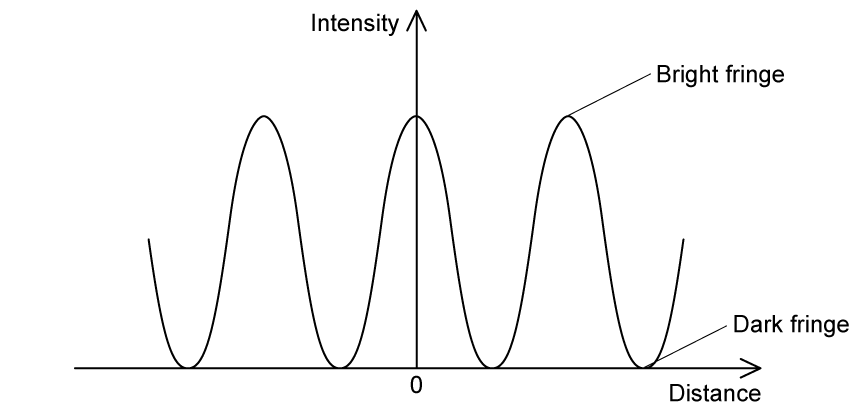

### 8.1 Stationary Waves - Medium

::: {.question-card}
#### Example 1 · 8.1 SQ Medium Q1

**(i)** By reference to the direction of transfer of energy, state what is meant by a transverse wave.

**(ii)** State the principle of superposition.

`[3 marks]`

Show mark scheme / model answer

- **(i)** (Particle) vibrations / oscillations that are perpendicular to the direction of energy transfer. `[1]`
- **(ii)** Waves meet / overlap at a point; `[1]` the resultant displacement is the sum of the individual displacements. `[1]`

`[Total: 3 marks]`

:::

::: {.question-card}
#### Example 2 · 8.1 SQ Medium Q2

A stationary wave on a string is shown in Fig. 1.1.

{.question-figure fig-alt="Stationary wave on a string with marked points"}

Explain how the wave is formed, referring to the principle of superposition in your answer.

`[4 marks]`

**(b)** On Fig. 1.1, draw the stationary wave that would be formed on the string in part (a) with two more nodes and two more antinodes.

`[1 mark]`

**(c)** Fig. 1.2 shows the appearance of a stationary wave on a stretched string at one instant in time.

{.question-figure fig-alt="Stationary wave on a stretched string showing a mechanical oscillator"}

Mark clearly on the diagram:

**(i)** the equilibrium position;

**(ii)** at least two nodes by labelling them N, and two antinodes by labelling them A;

**(iii)** the direction in which points Q, R, S and T are about to move.

`[5 marks]`

**(d)** For the wave in Fig. 1.2, the frequency of vibration is 180 Hz and the speed of the waves along the string is 60 m s$^{-1}$.

**(i)** Calculate the time period of the stationary wave on the string.

**(ii)** Calculate the length of the string.

`[3 marks]`

Show mark scheme / model answer

**(a)**
- Progressive waves travel (from the centre) to the end(s) and then reflect. `[1]`
- Two (progressive) waves travel in opposite directions along the string having the same/similar frequency/wavelength/amplitude. `[1]`
- (The two waves) superpose / interfere to produce the stationary wave. `[1]`
- The (maximum) displacement is twice the initial maximum displacement / equal to the sum of the displacements of the individual waves. `[1]`

`[Total: 4 marks]`

**(b)**
- A stationary wave drawn with 4 nodes and 3 antinodes (one more loop on each side of the centre). `[1]`

`[Total: 1 mark]`

**(c)**
- **(i)** Equilibrium position is horizontal and meets the fixed end. `[1]`
- **(ii)** At least two correct N (nodes at points of zero displacement). `[1]` At least two correct A (antinodes at points of maximum displacement). `[1]`
- **(iii)** Q, R and T moving downwards. `[1]` S moving upwards. `[1]`

`[Total: 5 marks]`

**(d)**
- **(i)** $T = 1/f = 1/180 = 5.6 \times 10^{-3}\ \text{s}$ (or 5.6 ms). `[1]`
- **(ii)** Using $v = f\lambda$, $\lambda = v/f = 60/180 = 0.33\ \text{m}$. `[1]` From the diagram, the string contains 2.5 wavelengths, so length $= 2.5 \times 0.33 = 0.83\ \text{m}$ (83 cm). `[1]`

`[Total: 13 marks]`

:::

::: {.question-card}
#### Example 3 · 8.1 SQ Medium Q3

Fig. 1.1 shows a stationary wave formed on a guitar string fixed at P and Q when it is plucked at its centre.

{.question-figure fig-alt="Stationary wave on a guitar string fixed at P and Q, with point X at maximum displacement"}

X is a point on the string at maximum displacement.

Explain why a stationary wave is formed on the string.

`[3 marks]`

**(b)** The stationary wave in Fig. 1.1 is the D string of the guitar which has a frequency of 146.83 Hz.

Calculate the time taken for the string at point X to move from maximum displacement to its next maximum displacement.

`[3 marks]`

**(c)** The progressive waves on the string travel at a speed of 190 m s$^{-1}$.

Calculate the length of the D string.

`[2 marks]`

**(d)** A guitarist presses on the string at point R to shorten it and create the higher note E. The distance between R and Q in Fig. 1.2 is 0.29 m.

The speed of the progressive wave remains at 190 m s$^{-1}$ and the tension remains constant.

Calculate the frequency of note E.

`[3 marks]`

Show mark scheme / model answer

**(a)**
Any three from:
- The progressive waves of the string travel (from the centre) to the ends/points P and Q and reflect. `[1]`
- Two (progressive) waves travel in opposite directions along the string. `[1]`
- (The two waves have) the same frequency / wavelength. `[1]`
- (The two waves have) the same / similar amplitude. `[1]`
- (The two waves) superpose / interfere to produce the stationary wave. `[1]`

`[Total: 3 marks]`

**(b)**
- The next maximum displacement occurs after half a cycle. `[1]`
- Time period for one cycle, $T = 1/f = 1/146.83 = 6.8 \times 10^{-3}\ \text{s}$. `[1]`
- Time for half a cycle $= 0.5 \times 6.8 \times 10^{-3} = 3.4 \times 10^{-3}\ \text{s}$. `[1]`

`[Total: 3 marks]`

**(c)**
- Using $v = f\lambda$, $\lambda = v/f = 190/146.83 = 1.29\ \text{m}$. `[1]`
- Fig. 1.1 shows half a wavelength for the fundamental mode, so length of string $L = 0.5 \times 1.29 = 0.65\ \text{m}$ (65 cm). `[1]`

`[Total: 2 marks]`

**(d)**
- The length of the shortened string is RQ = 0.29 m, which is half a wavelength (fundamental mode). `[1]`
- Wavelength $\lambda = 2 \times 0.29 = 0.58\ \text{m}$. `[1]`
- Frequency $f = v/\lambda = 190/0.58 = 328\ \text{Hz}$ (330 Hz to 2 s.f.). `[1]`

`[Total: 11 marks]`

:::

### 8.2 Diffraction & Interference - Medium

::: {.question-card}
#### Example 4 · 8.2 SQ Medium Q1

Fig. 1.1 shows an arrangement for observing the interference pattern produced by laser light passing through two narrow slits S$_1$ and S$_2$.

{.question-figure fig-alt="Double-slit interference arrangement with laser light, single slit, double slit, and screen"}

The distance S$_1$S$_2$ is $d$, and the distance between the double slit and the screen is $D$, where $D \gg d$, so angles $\alpha$ and $\theta$ are small.

M is the midpoint of S$_1$S$_2$ and it is observed that there is a bright fringe at point A on the screen, a distance $f_1$ from point O on the screen. Light from S$_1$ travels a distance S$_2$Y further to point A than light from S$_2$.

The wavelength of light from the laser is 650 nm and the angular separation of the bright fringes on the screen is $5.00 \times 10^{-4}$ rad.

**(a)** Calculate the distance between the two slits.

`[3 marks]`

**(b)** A bright fringe is observed at A.

**(i)** Explain the conditions required in the paths of the rays coming from S$_1$ and S$_2$ to obtain this bright fringe.

**(ii)** State an equation in terms of wavelength for the distance S$_2$Y.

`[3 marks]`

**(c)** Deduce expressions for the following angles in the double-slit arrangement shown in Fig. 1.1.

**(i)** $\theta$ in terms of S$_2$Y and $d$

**(ii)** $\phi$ in terms of $D$ and $f_1$

`[4 marks]`

**(d)** The separation of the slits S$_1$ and S$_2$ is 1.30 mm. The distance MO is 1.40 m. The distance $f_n$ is the distance of the ninth bright fringe from O and the angle $\theta$ is $3.70 \times 10^{-3}$ rad.

Calculate the wavelength of the laser light.

`[2 marks]`

Show mark scheme / model answer

**(a)**
- Angular separation of fringes $\theta = \lambda/d$. `[1]`
- Rearranging: $d = \lambda/\theta = 650 \times 10^{-9} / 5.00 \times 10^{-4}$. `[1]`
- $d = 1.30 \times 10^{-3}\ \text{m} = 1.30\ \text{mm}$. `[1]`

**(b)**
- **(i)** The path difference (S$_2$Y) must be equal to a whole number of wavelengths. `[1]` The waves must be in phase / coherent. `[1]`
- **(ii)** S$_2$Y = $n\lambda$ (where $n$ is the order number). `[1]`

**(c)**
- **(i)** $\sin\theta = \text{S}_2\text{Y} / d$. `[1]` Using small-angle approximation, $\theta \approx \text{S}_2\text{Y} / d$. `[1]`
- **(ii)** $\tan\phi = f_1 / D$. `[1]` Using small-angle approximation, $\phi \approx f_1 / D$. `[1]`

**(d)**
- Using S$_2$Y = $d\theta$ (from (c)) and S$_2$Y = $n\lambda$ (from (b)): $\lambda = d\theta / n$. `[1]`
- $\lambda = (1.30 \times 10^{-3})(3.70 \times 10^{-3}) / 9 = 5.34 \times 10^{-7}\ \text{m}$. `[1]`

`[Total: 12 marks]`

:::

::: {.question-card}
#### Example 5 · 8.2 SQ Medium Q2

A student is conducting a series of investigations on diffraction and interference with two slits.

In the first investigation, monochromatic light passes through a double-slit arrangement. The intensity of the fringes varies with distance from the central fringe.

The intensity of the monochromatic light passing through one of the slits is reduced.

Explain the effect of this change on the appearance of:

**(i)** The dark fringes

**(ii)** The bright fringes

`[6 marks]`

**(b)** In an investigation, a white light source is incident on an orange filter, a single slit, and then a double-slit, as shown in Fig. 1.2. An interference pattern of light and dark fringes is observed on the screen.

{.question-figure fig-alt="Double-slit experiment with white light source, orange filter, single slit and double slit"}

**(i)** The orange filter is now replaced by a green filter. State and explain the change in appearance, other than the change in colour, of the fringes on the screen.

**(ii)** The green filter is now removed. State and explain the change in the appearance of the central maximum fringe, as well as the fringes away from this central position.

`[7 marks]`

**(c)** In a third experiment, the white light is replaced by orange light of wavelength 600 nm. The double-slit has a separation of 0.350 mm and the screen is 6.35 m away.

Calculate the distance between the central and first maximum as seen on the screen.

`[2 marks]`

Show mark scheme / model answer

**(a)**
- **(i)** The dark fringes are no longer completely dark. `[1]` The waves from the two slits no longer have the same amplitude. `[1]` Destructive interference is incomplete, so some light remains. `[1]`
- **(ii)** The bright fringes are dimmer (less intensity). `[1]` The intensity of the bright fringes is no longer uniform — some bright fringes are brighter than others. `[1]` The central maximum is still the brightest. `[1]`

`[Total: 6 marks]`

**(b)**
- **(i)** The fringe spacing decreases. `[1]` Green light has a shorter wavelength than orange light. `[1]` Since fringe spacing $x = \lambda D/d$, a smaller $\lambda$ gives smaller $x$. `[1]`
- **(ii)** The central maximum becomes white (all colours overlap). `[1]` Away from the centre, coloured fringes are seen (spectra). `[1]` Because different wavelengths of white light have different fringe spacings, so the maxima for different colours occur at different positions. `[1]` The fringes become less distinct / blurred at larger distances from the centre. `[1]`

`[Total: 7 marks]`

**(c)**
- Using $x = \lambda D / d$. `[1]`
- $x = (600 \times 10^{-9})(6.35) / (0.350 \times 10^{-3}) = 1.09 \times 10^{-2}\ \text{m} = 1.09\ \text{cm}$. `[1]`

`[Total: 15 marks]`

:::

::: {.question-card}
#### Example 6 · 8.2 SQ Medium Q3

A teacher explains a diffraction investigation to a group of physics students.

'In this investigation a laser will be used to shine monochromatic light of wavelength 581.9 nm onto a diffraction grating. The light passing through the grating will therefore be coherent.'

Define the following terms used by the teacher:

**(i)** Monochromatic

**(ii)** Coherent

`[3 marks]`

**(b)** During the investigation, a second-order maximum is produced at an angle of 35° measured from the normal to the grating.

**(i)** Calculate the number of lines per metre on the grating.

**(ii)** Calculate the highest order which is observable.

`[6 marks]`

**(c)** Calculate the angular separation between the highest order and second order maxima.

`[3 marks]`

**(d)** The investigation is repeated using the same grating but a different monochromatic source. In this experiment, the second-order maximum is observed at an angle of 25.7°.

Calculate the wavelength of this second source.

`[2 marks]`

Show mark scheme / model answer

**(a)**
- **(i)** Monochromatic: light of a single wavelength / frequency. `[1]`
- **(ii)** Coherent: two sources that have a constant phase difference. `[1]` (And the same frequency.) `[1]`

`[Total: 3 marks]`

**(b)**
- **(i)** Using $d\sin\theta = n\lambda$: $d = n\lambda / \sin\theta = 2 \times 581.9 \times 10^{-9} / \sin 35^\circ$. `[1]` $d = 2.029 \times 10^{-6}\ \text{m}$. `[1]` Number of lines per metre $N = 1/d = 4.93 \times 10^5\ \text{lines m}^{-1}$. `[1]`
- **(ii)** Maximum order occurs when $\sin\theta = 1$: $n_{\text{max}} = d/\lambda = 2.029 \times 10^{-6} / 581.9 \times 10^{-9} = 3.49$. `[1]` Therefore the highest observable order is $n = 3$. `[1]`

`[Total: 6 marks]`

**(c)**
- For $n=3$: $\sin\theta_3 = 3\lambda/d = 3 \times 581.9 \times 10^{-9} / 2.029 \times 10^{-6} = 0.860$. `[1]` $\theta_3 = \sin^{-1}(0.860) = 59.3^\circ$. `[1]`
- Angular separation $= \theta_3 - \theta_2 = 59.3^\circ - 35^\circ = 24.3^\circ$. `[1]`

`[Total: 3 marks]`

**(d)**
- Using $d\sin\theta = n\lambda$: $\lambda = d\sin\theta / n = (2.029 \times 10^{-6})(\sin 25.7^\circ) / 2$. `[1]`
- $\lambda = 4.40 \times 10^{-7}\ \text{m} = 440\ \text{nm}$. `[1]`

`[Total: 14 marks]`

:::
