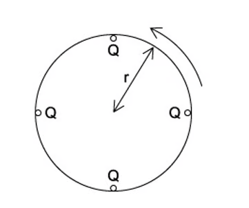

### 9.1 Electric Current - Easy

::: {.question-card}
#### Example 1 · 9.1 MC Easy Q1

The current in a circuit is 2.0 A. How much charge passes a point in the circuit in 30 s?

A. 15 C

B. 0.067 C

C. 60 C

D. 15 A

Show answer and explanation

**Answer: C.** Using $Q = It = 2.0 \times 30 = 60\ \text{C}$.

:::

::: {.question-card}
#### Example 2 · 9.1 MC Easy Q2

Which of the following is the correct definition of electric current?

A. the rate of flow of energy through a conductor

B. the rate of flow of charge through a conductor

C. the charge stored in a conductor

D. the energy transferred per unit charge

Show answer and explanation

**Answer: B.** Electric current is the rate of flow of charge, $I = Q/t$. A describes power, D describes potential difference.

:::

::: {.question-card}
#### Example 3 · 9.1 MC Easy Q3

A current of 0.50 A flows through a lamp for 2.0 minutes.

What is the total charge that flows through the lamp?

A. 1.0 C

B. 30 C

C. 60 C

D. 120 C

Show answer and explanation

**Answer: C.** Time in seconds: $t = 2.0 \times 60 = 120\ \text{s}$. Charge $Q = It = 0.50 \times 120 = 60\ \text{C}$.

:::

### 9.1 Electric Current - Medium

::: {.question-card}
#### Example 4 · 9.1 MC Medium Q1

The current at a point in a wire is 4.8 A. The charge on each electron is $1.6 \times 10^{-19}\ \text{C}$.

What is the number of electrons passing this point in 5.0 s?

A. $3.0 \times 10^{19}$

B. $1.5 \times 10^{20}$

C. $7.5 \times 10^{18}$

D. $2.4 \times 10^{19}$

Show answer and explanation

**Answer: B.** Total charge $Q = It = 4.8 \times 5.0 = 24\ \text{C}$. Number of electrons $n = Q/e = 24 / (1.6 \times 10^{-19}) = 1.5 \times 10^{20}$.

:::

::: {.question-card}
#### Example 5 · 9.1 MC Medium Q2

The graph shows how the current through a component varies with time.

{.question-figure fig-alt="Current-time graph"}

What is the total charge that passes through the component between $t = 0$ and $t = 4.0\ \text{s}$?

A. the area under the graph

B. the gradient of the graph

C. the current at $t = 4.0\ \text{s}$

D. the average current multiplied by the gradient

Show answer and explanation

**Answer: A.** Charge is the integral of current with respect to time, $Q = \int I\,dt$, which is the area under the I–t graph.

:::

### 9.1 Electric Current - Hard

::: {.question-card}
#### Example 6 · 9.1 MC Hard Q1

The current in a circuit is 4.0 A. The charge on an electron is $1.6 \times 10^{-19}\ \text{C}$.

How many electrons flow past a given point in the circuit every second?

A. $6.4 \times 10^{-19}$

B. $2.5 \times 10^{19}$

C. $2.5 \times 10^{18}$

D. $4.0 \times 10^{19}$

Show answer and explanation

**Answer: B.** Electrons per second $= I/e = 4.0 / (1.6 \times 10^{-19}) = 2.5 \times 10^{19}$.

:::

::: {.question-card}
#### Example 7 · 9.1 MC Hard Q2

In the circuit shown, the currents at junction P are given by

{.question-figure fig-alt="Circuit diagram with junction P"} $I_1 = 2.0\ \text{A}$, $I_2 = 1.5\ \text{A}$ and $I_3$ leaves the junction.

What is the value of $I_3$?

A. 0.5 A

B. 2.0 A

C. 3.5 A

D. 5.0 A

Show answer and explanation

**Answer: C.** By Kirchhoff's first law, the sum of currents entering a junction equals the sum leaving it: $I_1 + I_2 = I_3$, so $I_3 = 2.0 + 1.5 = 3.5\ \text{A}$.

:::

### 9.2 Potential Difference and Resistance - Easy

::: {.question-card}
#### Example 8 · 9.2 MC Easy Q1

Which of the following is the correct definition of potential difference across a component?

A. the rate of flow of charge through the component

B. the energy transferred per unit charge as charge passes through the component

C. the energy stored in the component

D. the force per unit charge on the charge carriers

Show answer and explanation

**Answer: B.** Potential difference is the energy transferred per unit charge, $V = W/Q$. A defines current, D defines electric field strength.

:::

::: {.question-card}
#### Example 9 · 9.2 MC Easy Q2

A p.d. of 6.0 V is applied across a resistor of resistance 3.0 $\Omega$.

What is the current through the resistor?

A. 18 A

B. 0.5 A

C. 2.0 A

D. 9.0 A

Show answer and explanation

**Answer: C.** Using Ohm's law, $I = V/R = 6.0/3.0 = 2.0\ \text{A}$.

:::

::: {.question-card}
#### Example 10 · 9.2 MC Easy Q3

A p.d. of 12 V is applied across a wire of resistance 4.0 $\Omega$.

What is the current in the wire?

A. 48 A

B. 8.0 A

C. 3.0 A

D. 0.33 A

Show answer and explanation

**Answer: C.** $I = V/R = 12/4.0 = 3.0\ \text{A}$.

:::

### 9.2 Potential Difference and Resistance - Medium

::: {.question-card}
#### Example 11 · 9.2 MC Medium Q1

A wire of length 2.0 m has resistance 8.0 $\Omega$. A second wire of the same material has length 4.0 m and the same cross-sectional area.

What is the resistance of the second wire?

A. 4.0 $\Omega$

B. 8.0 $\Omega$

C. 16 $\Omega$

D. 32 $\Omega$

Show answer and explanation

**Answer: C.** Since $R = \rho L/A$ and $\rho$ and $A$ are unchanged, doubling the length doubles the resistance: $R = 2 \times 8.0 = 16\ \Omega$.

:::

::: {.question-card}
#### Example 12 · 9.2 MC Medium Q2

A wire has resistance 12 $\Omega$. It is stretched to twice its original length without changing its volume.

What is the new resistance?

A. 6.0 $\Omega$

B. 12 $\Omega$

C. 24 $\Omega$

D. 48 $\Omega$

Show answer and explanation

**Answer: D.** Stretching to twice the length doubles $L$ and halves $A$ (volume constant), so $R$ increases by a factor of $2 \times 2 = 4$: $R = 4 \times 12 = 48\ \Omega$.

:::

::: {.question-card}
#### Example 13 · 9.2 MC Medium Q3

Which statement about the resistance of a metallic conductor is correct?

A. Resistance is inversely proportional to the length of the conductor.

B. Resistance is directly proportional to the cross-sectional area of the conductor.

C. Resistance is directly proportional to the resistivity of the material.

D. Resistance is independent of temperature.

Show answer and explanation

**Answer: C.** From $R = \rho L/A$, resistance is directly proportional to resistivity $\rho$ and length $L$, and inversely proportional to area $A$. Resistance of metals increases with temperature, so D is incorrect.

:::

### 9.2 Potential Difference and Resistance - Hard

::: {.question-card}
#### Example 14 · 9.2 MC Hard Q1

A battery of negligible internal resistance and e.m.f. 6.0 V is connected to two resistors of resistance 4.0 $\Omega$ and 8.0 $\Omega$ in series.

What is the potential difference across the 8.0 $\Omega$ resistor?

A. 2.0 V

B. 3.0 V

C. 4.0 V

D. 6.0 V

Show answer and explanation

**Answer: C.** Total resistance $R = 4.0 + 8.0 = 12\ \Omega$, current $I = 6.0/12 = 0.50\ \text{A}$. P.d. across the 8.0 $\Omega$ resistor $V = IR = 0.50 \times 8.0 = 4.0\ \text{V}$.

:::

### 9.3 Sources of Electromotive Force - Easy

::: {.question-card}
#### Example 15 · 9.3 MC Easy Q1

Which of the following is the correct definition of electromotive force (e.m.f.)?

A. the energy transferred from electrical to other forms per unit charge in a component

B. the energy transferred from other forms to electrical energy per unit charge by a source

C. the rate of flow of charge through a source

D. the total energy stored in a battery

Show answer and explanation

**Answer: B.** E.m.f. is the energy transferred from chemical (or other non-electrical) forms to electrical energy per unit charge by a source. A describes potential difference.

:::

::: {.question-card}
#### Example 16 · 9.3 MC Easy Q2

A battery of e.m.f. 6.0 V has an internal resistance of 2.0 $\Omega$. It is connected to an external resistor of resistance 4.0 $\Omega$.

What is the current in the circuit?

A. 1.0 A

B. 1.5 A

C. 2.0 A

D. 3.0 A

Show answer and explanation

**Answer: A.** Using $E = I(R + r)$: $I = E/(R + r) = 6.0/(4.0 + 2.0) = 1.0\ \text{A}$.

:::

### 9.3 Sources of Electromotive Force - Medium

::: {.question-card}
#### Example 17 · 9.3 MC Medium Q1

A battery of e.m.f. 6.0 V and internal resistance 0.50 $\Omega$ is connected to a resistor of resistance 5.5 $\Omega$.

What is the terminal p.d. of the battery?

A. 0.50 V

B. 5.5 V

C. 6.0 V

D. 0.60 V

Show answer and explanation

**Answer: B.** Current $I = E/(R + r) = 6.0/(5.5 + 0.50) = 1.0\ \text{A}$. Terminal p.d. $V = IR = 1.0 \times 5.5 = 5.5\ \text{V}$.

:::

::: {.question-card}
#### Example 18 · 9.3 MC Medium Q2

The graph shows how the terminal p.d. $V$ of a cell varies with the current $I$ drawn from it.
{.question-figure fig-alt="Graph of terminal p.d. V against current I"}

Which statement is correct?

A. The intercept on the $V$-axis gives the internal resistance.

B. The gradient of the graph gives the internal resistance.

C. The intercept on the $I$-axis gives the e.m.f.

D. The area under the graph gives the e.m.f.

Show answer and explanation

**Answer: B.** The equation $V = E - Ir$ is of the form $y = mx + c$: the $V$-intercept gives the e.m.f. $E$ and the gradient is $-r$, so the (magnitude of the) gradient gives the internal resistance.

:::

::: {.question-card}
#### Example 19 · 9.3 MC Medium Q3

A battery of e.m.f. 9.0 V and internal resistance 1.0 $\Omega$ supplies a current of 3.0 A to an external circuit.

What is the power dissipated in the internal resistance?

A. 3.0 W

B. 9.0 W

C. 27 W

D. 12 W

Show answer and explanation

**Answer: B.** Power dissipated in internal resistance $= I^2 r = 3.0^2 \times 1.0 = 9.0\ \text{W}$.

:::

### 9.3 Sources of Electromotive Force - Hard

::: {.question-card}
#### Example 20 · 9.3 MC Hard Q1

A battery of e.m.f. 6.0 V and internal resistance $r$ supplies a current of 0.50 A to an external resistor of resistance 11 $\Omega$.

What is the internal resistance $r$ of the battery?

A. 0.50 $\Omega$

B. 1.0 $\Omega$

C. 2.0 $\Omega$

D. 12 $\Omega$

Show answer and explanation

**Answer: B.** Using $E = I(R + r)$: $6.0 = 0.50(11 + r)$, so $11 + r = 12$ and $r = 1.0\ \Omega$.

:::

