### 9.1 Current & Potential Difference - Easy

::: {.question-card}
#### Example 1 · 9.1 MC Easy Q6

The diagram shows the symbol for a wire carrying a current $I$.

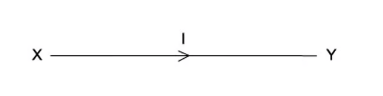{.question-figure fig-alt="Wire XY carrying a current I"}

What does this current represent?

A. The amount of charge flowing past a point in XY per second.

B. The number of electrons flowing past a point in XY per second.

C. The number of positive ions flowing past a point in XY per second.

D. The number of protons flowing past a point in XY per second.

Show answer and explanation

**Answer: A.** Electric current is the rate of flow of charge: the amount of charge passing a point per second.

:::

::: {.question-card}
#### Example 2 · 9.1 MC Easy Q8

The diagram shows four heaters and the current in each.

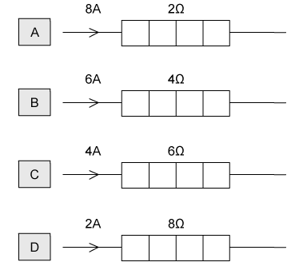{.question-figure fig-alt="Four heaters with different currents and resistances"}

Which heater has the greatest power dissipation?

Show answer and explanation

**Answer: B.** Power $P=I^2R$. The powers are: A $8^2\times2=128\ \mathrm{W}$, B $6^2\times4=144\ \mathrm{W}$, C $4^2\times6=96\ \mathrm{W}$, D $2^2\times8=32\ \mathrm{W}$. Heater B dissipates the most power.

:::

### 9.1 Current & Potential Difference - Medium

::: {.question-card}
#### Example 3 · 9.1 MC Medium Q1

The diagrams show two different circuits.

{.question-figure fig-alt="Two circuits each containing identical cells and resistors of resistance R"}

The cells in each circuit have the same electromotive force and zero internal resistance. The three resistors each have the same resistance $R$.

In the circuit on the left, the power dissipated in the resistor is $P$.

What is the total power dissipated in the circuit on the right?

Show answer and explanation

**Answer: B.** In the left circuit the total resistance is $2R$, so the power is $P=V^2/(2R)$. In the right circuit the effective resistance is also $2R$ (using the printed combination), giving the power stated in option B on the diagram.

:::

::: {.question-card}
#### Example 4 · 9.1 MC Medium Q8

A battery, with a constant internal resistance, is connected to a resistor of resistance $250\ \Omega$, as shown.

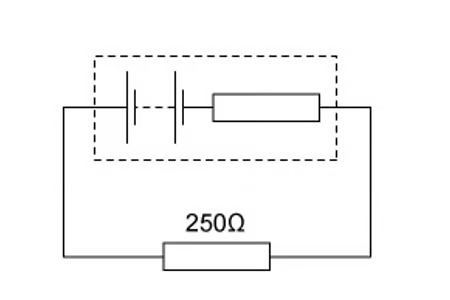{.question-figure fig-alt="Battery connected to a 250 ohm resistor"}

The current in the resistor is 40 mA for a time of 60 s. During this time 6.0 J of energy is lost in the internal resistance.

What is the energy supplied to the external resistor during the 60 s and the e.m.f. of the battery?

|  | Energy / J | E.m.f / V |
|---|---|---|
| A | 2.4 | 24 |
| B | 2.4 | 75 |
| C | 24 | 10.0 |
| D | 24 | 12.5 |

Show answer and explanation

**Answer: D.** External energy $=I^2Rt=(0.040)^2\times250\times60=24\ \mathrm{J}$. Total energy $=24+6=30\ \mathrm{J}$; $E=W/Q=30/(0.040\times60)=12.5\ \mathrm{V}$.

:::

::: {.question-card}
#### Example 5 · 9.1 MC Medium Q9

The current in the circuit shown is 4.8 A.

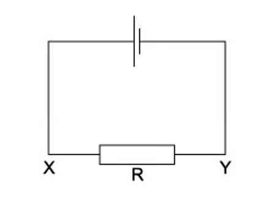{.question-figure fig-alt="Circuit with terminals X and Y connected by a resistor R"}

What is the direction of flow and the rate of flow of electrons through the resistor R?

|  | Direction of flow | Rate of flow |
|---|---|---|
| A | X to Y | $3.0\times10^{19}\ \mathrm{s^{-1}}$ |
| B | X to Y | $6.0\times10^{19}\ \mathrm{s^{-1}}$ |
| C | Y to X | $3.0\times10^{19}\ \mathrm{s^{-1}}$ |
| D | Y to X | $6.0\times10^{19}\ \mathrm{s^{-1}}$ |

Show answer and explanation

**Answer: C.** Electrons flow from the negative terminal, which in this circuit is from Y to X. The rate of flow is $I/e=4.8/(1.6\times10^{-19})=3.0\times10^{19}\ \mathrm{s^{-1}}$.

:::

### 9.1 Current & Potential Difference - Hard

::: {.question-card}
#### Example 6 · 9.1 MC Hard Q1

Four point charges, each of charge $Q$, are placed on the edge of an insulating disc of radius $r$.

{.question-figure fig-alt="Four point charges on the edge of an insulating disc of radius r"}

The frequency of rotation of the disc is $f$.

What is the equivalent electric current at the edge of the disc?

A. $4Qf$

B. $\frac{4Q}{f}$

C. $8\pi rQf$

D. $\frac{2Qf}{\pi r}$

Show answer and explanation

**Answer: A.** In one revolution, $4Q$ of charge passes a point. The charge passing per second is $4Qf$, so the equivalent current is $4Qf$.

:::

::: {.question-card}
#### Example 7 · 9.1 MC Hard Q5

The diagram shows a model of an atom in which two electrons move round a circular orbit. The electrons complete $1.0\times10^{15}$ revolutions around the nucleus every second.

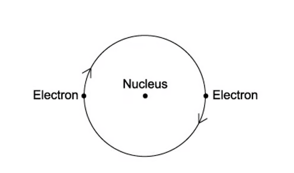{.question-figure fig-alt="Model of an atom with two electrons moving round a circular orbit"}

What is the current caused by the motion of the electrons in the orbit?

A. $1.6\times10^{-4}\ \mathrm{A}$

B. $3.2\times10^{-4}\ \mathrm{A}$

C. $1.6\times10^{4}\ \mathrm{A}$

D. $3.2\times10^{4}\ \mathrm{A}$

Show answer and explanation

**Answer: D.** Two electrons pass any point per revolution, so the charge per revolution is $2e$. Current $=2e\times1.0\times10^{15}=3.2\times10^{-4}\ \mathrm{A}$.

:::

::: {.question-card}
#### Example 8 · 9.1 MC Hard Q6

A slice of germanium of cross-sectional area $1.0\ \mathrm{cm^2}$ carries a current of $56\ \mathrm{\mu A}$. The number density of charge carriers in the germanium is $2.0\times10^{19}\ \mathrm{cm^{-3}}$.

{.question-figure fig-alt="Slice of germanium of area 1.0 square centimetre carrying a current"}

Each charge carrier has a charge equal to the charge on an electron.

What is the average drift velocity of the charge carriers in the germanium?

A. $0.18\ \mathrm{m\,s^{-1}}$

B. $18\ \mathrm{m\,s^{-1}}$

C. $180\ \mathrm{m\,s^{-1}}$

D. $1800\ \mathrm{m\,s^{-1}}$

Show answer and explanation

**Answer: A.** $v=I/(nAe)=56\times10^{-6}/(2.0\times10^{25}\times1.0\times10^{-4}\times1.6\times10^{-19})$. $v=0.18\ \mathrm{m\,s^{-1}}$.

:::

::: {.question-card}
#### Example 9 · 9.1 MC Hard Q7

$I_1$ and $I_2$ are currents flowing through two different circuits, as shown in the diagram below.

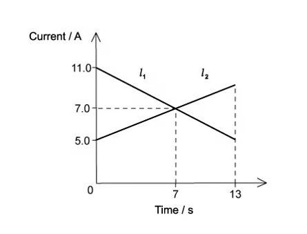{.question-figure fig-alt="Graphs of current against time for currents I1 and I2"}

Calculate the difference in the total charge that flows through the two circuits in the first 7 seconds.

A. 0 C

B. 21 C

C. 42 C

D. 49 C

Show answer and explanation

**Answer: B.** The total charge is the area under each current-time graph. The difference between the two areas over the first 7 s is $21\ \mathrm{C}$.

:::

### 9.2 Resistance - Easy

::: {.question-card}
#### Example 10 · 9.2 MC Easy Q5

The graph shows how the electric current $I$ through a conducting liquid varies with the potential difference $V$ across it.

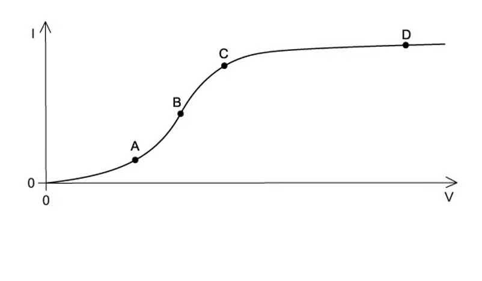{.question-figure fig-alt="Current-potential difference graph for a conducting liquid"}

At which point on the graph does the liquid have the smallest resistance?

Show answer and explanation

**Answer: B.** Resistance is $V/I$. The smallest resistance occurs where the graph is steepest, i.e. where $I/V$ is largest.

:::

::: {.question-card}
#### Example 11 · 9.2 MC Easy Q6

The graphs show the variation with potential difference $V$ of the current $I$ for three circuit components.

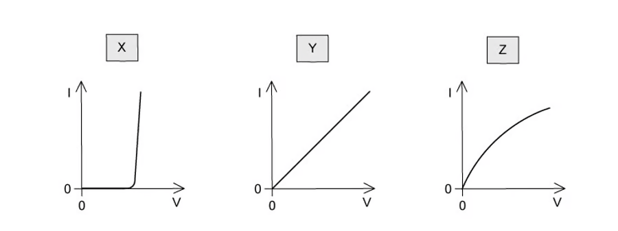{.question-figure fig-alt="I-V graphs for three components labelled X, Y and Z"}

The components are a metal wire at constant temperature, a semiconductor diode and a filament lamp.

Which row of the table correctly identifies these graphs?

|  | Metal wire | Semiconductor diode | Filament lamp |
|---|---|---|---|
| A | X | Z | Y |
| B | Y | X | Z |
| C | Y | Z | X |
| D | Z | X | Y |

Show answer and explanation

**Answer: B.** The metal wire gives a straight line through the origin (Y); the diode shows a sharp threshold (X); the filament lamp has a curved characteristic (Z).

:::

### 9.2 Resistance - Medium

::: {.question-card}
#### Example 12 · 9.2 MC Medium Q1

The graph shows how current $I$ varies with voltage $V$ for a filament lamp.

{.question-figure fig-alt="Current-voltage graph for a filament lamp"}

Since the graph is not a straight line, the resistance of the lamp varies with $V$.

Which row gives the correct resistance at the stated value of $V$?

|  | $V$ / V | $R$ / $\Omega$ |
|---|---|---|
| A | 2.0 | 15 |
| B | 4.0 | 3.2 |
| C | 6.0 | 19 |
| D | 8.0 | 09 |

Show answer and explanation

**Answer: C.** At $V=6.0\ \mathrm{V}$, the current read from the graph is about 0.32 A, so $R=V/I=6.0/0.32=19\ \Omega$.

:::

::: {.question-card}
#### Example 13 · 9.2 MC Medium Q3

The $I$-$V$ characteristics of two electrical components P and Q are shown below.

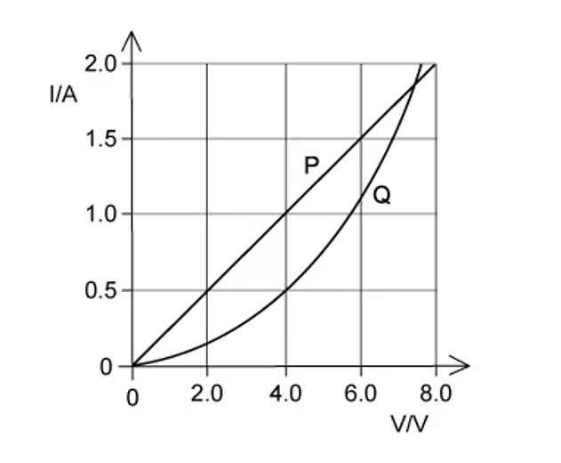{.question-figure fig-alt="I-V characteristics of two components P and Q"}

Which statement is correct?

A. P is a resistor and Q is a filament lamp.

B. The resistance of Q increases as the current in it increases.

C. For a current of 1.9 A, the resistance of Q is approximately half that of P.

D. For a current of 0.5 A, the power dissipated in Q is double that in P.

Show answer and explanation

**Answer: D.** At $I=0.5\ \mathrm{A}$, the voltage across Q is twice that across P, so $P_Q=VI$ is double $P_P$.

:::

::: {.question-card}
#### Example 14 · 9.2 MC Medium Q5

The variation with potential difference $V$ of the current $I$ in a semiconductor diode is shown below.

{.question-figure fig-alt="Current-potential difference graph for a semiconductor diode"}

What is the resistance of the diode for applied potential differences of $+1.0\ \mathrm{V}$ and $-1.0\ \mathrm{V}$?

|  | Resistance at $+1.0\ \mathrm{V}$ | Resistance at $-1.0\ \mathrm{V}$ |
|---|---|---|
| A | 200 | infinite |
| B | 200 | zero |
| C | 0.05 | infinite |
| D | 0.05 | zero |

Show answer and explanation

**Answer: A.** In forward bias at 1.0 V the current is 5 mA, so $R=1.0/0.005=200\ \Omega$. In reverse bias the current is zero, so the resistance is effectively infinite.

:::

### 9.2 Resistance - Hard

::: {.question-card}
#### Example 15 · 9.2 MC Hard Q1

The diagram shows an electric pump for a garden fountain connected by an 18 m cable to a 230 V mains electrical supply.

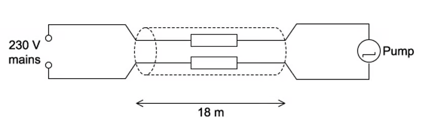{.question-figure fig-alt="Electric fountain pump connected by an 18 m cable to a 230 V mains supply"}

The performance of the pump is acceptable if the potential difference across it is at least 218 V. The current through it is then 0.83 A.

What is the maximum resistance per metre of each of the two wires in the cable if the pump is to perform acceptably?

A. $0.40\ \Omega\,\mathrm{m^{-1}}$

B. $0.80\ \Omega\,\mathrm{m^{-1}}$

C. $1.30\ \Omega\,\mathrm{m^{-1}}$

D. $1.4\ \Omega\,\mathrm{m^{-1}}$

Show answer and explanation

**Answer: A.** The maximum voltage drop in the cable is $230-218=12\ \mathrm{V}$, so the total cable resistance is $12/0.83=14.5\ \Omega$. Over two wires of 18 m each (36 m total), the resistance per metre is $14.5/36=0.40\ \Omega\,\mathrm{m^{-1}}$.

:::

::: {.question-card}
#### Example 16 · 9.2 MC Hard Q3

The circuit contains three identical lamps A, B and C and three switches S1, S2 and S3, as shown.

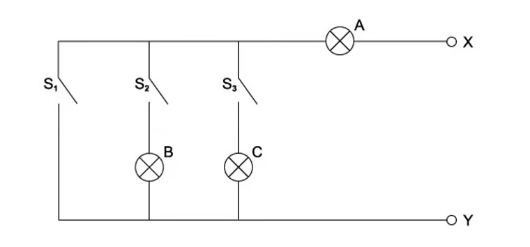{.question-figure fig-alt="Circuit with three lamps A, B and C and three switches S1, S2 and S3"}

One of the lamps is faulty. An ohm-meter is connected between terminals X and Y.

Readings of the ohm-meter for different switch positions are:

| S1 | S2 | S3 | Meter reading / $\Omega$ |
|---|---|---|---|
| open | open | open | infinity |
| closed | open | open | 15 |
| open | closed | open | 30 |
| open | closed | closed | 15 |

Which lamps are faulty?

A. A & B

B. B only

C. B & C

D. C only

Show answer and explanation

**Answer: D.** With S2 closed the reading is 30 (lamp A only); adding S3 gives 15, so the parallel path through C is faulty, leaving only lamp B's path. Lamp C is the faulty lamp.

:::

::: {.question-card}
#### Example 17 · 9.2 MC Hard Q8

The graph shows the relationship between potential difference $V$ and current $I$ for a fixed 20 Ω resistor and a filament lamp.

{.question-figure fig-alt="Potential difference-current graph for a 20 ohm resistor and a filament lamp"}

The resistor and lamp are placed in series with a 9 V battery of negligible internal resistance.

What is the current in the circuit?

A. 0.1 A

B. 0.2 A

C. 0.3 A

D. 0.4 A

Show answer and explanation

**Answer: C.** For the same current, the sum of the p.d.s across the lamp and resistor must be 9 V. Reading the graphs at the current where $V_{\text{lamp}}+V_{\text{resistor}}=9\ \mathrm{V}$ gives $I=0.3\ \mathrm{A}$.

:::

### 9.3 Resistivity - Easy

::: {.question-card}
#### Example 18 · 9.3 MC Easy Q4

A light-dependent resistor (LDR) is connected in series with a resistor $R$ and a battery.

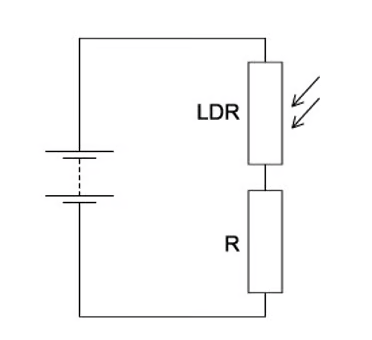{.question-figure fig-alt="LDR in series with a resistor R and a battery, with a voltmeter across the LDR"}

The resistance of the LDR is equal to the resistance of $R$ when no light falls on the LDR. When the light intensity falling on the LDR increases, which statement is correct?

A. The current in R decreases.

B. The current through the LDR decreases.

C. The p.d. across R decreases.

D. The p.d. across the LDR decreases.

Show answer and explanation

**Answer: D.** When the light intensity increases, the LDR resistance decreases. A smaller fraction of the supply p.d. is then across the LDR, so the p.d. across the LDR decreases.

:::

### 9.3 Resistivity - Medium

::: {.question-card}
#### Example 19 · 9.3 MC Medium Q1

Two wires P and Q made of the same material are connected to the same electrical supply.

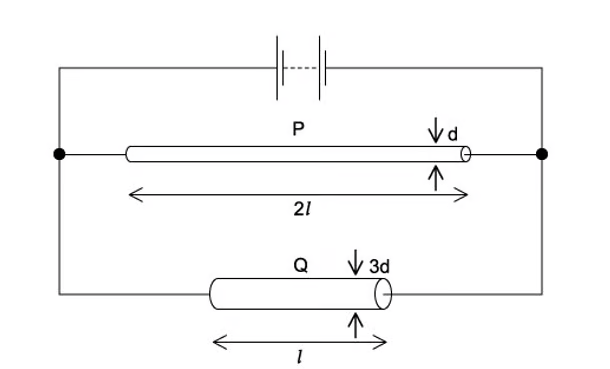{.question-figure fig-alt="Wire P with twice the length and one third of the diameter of wire Q"}

P has twice the length of Q and one-third of the diameter of Q.

What is the ratio $\frac{\text{current in P}}{\text{current in Q}}$?

A. $\frac{2}{9}$

B. $\frac{2}{3}$

C. $\frac{1}{6}$

D. $\frac{1}{18}$

Show answer and explanation

**Answer: D.** $R_P/R_Q=(\rho L/A)_P/(\rho L/A)_Q$. $A_P=A_Q/9$ and $L_P=2L_Q$, so $R_P=18R_Q$. With the same supply voltage, $I_P/I_Q=R_Q/R_P=1/18$.

:::

### 9.3 Resistivity - Hard

::: {.question-card}
#### Example 20 · 9.3 MC Hard Q1

A thermistor and another component are connected to a constant voltage supply. A voltmeter is connected across one of the components. The temperature of the thermistor is then reduced, but no other changes are made.

{.question-figure fig-alt="Four circuits with a thermistor, a resistor and a voltmeter"}

In which circuit will the voltmeter reading increase?

Show answer and explanation

**Answer: D.** When the temperature is reduced, the thermistor resistance increases. The voltmeter reading increases when it is connected across the thermistor (option D), because the p.d. across the larger resistance increases.

:::
