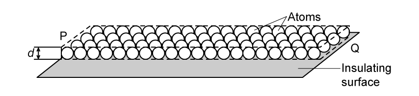
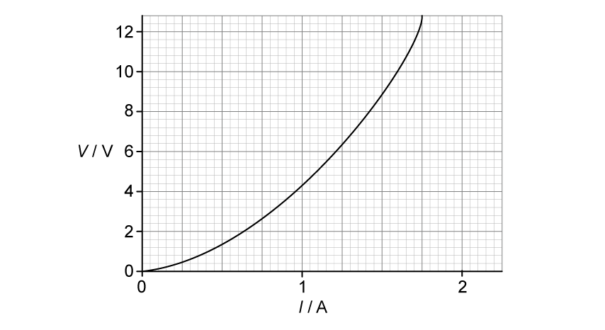
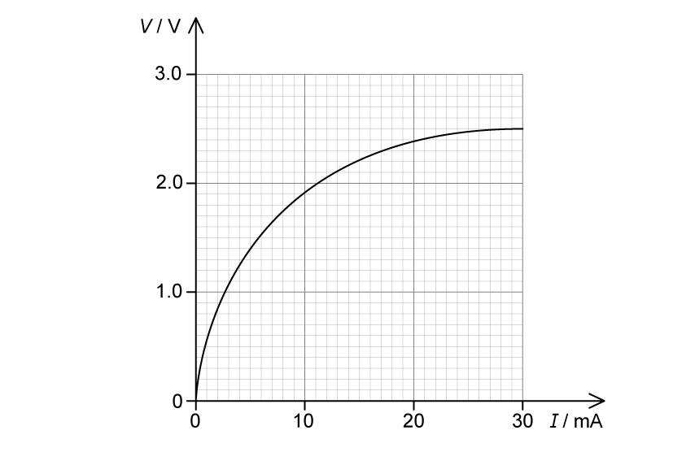
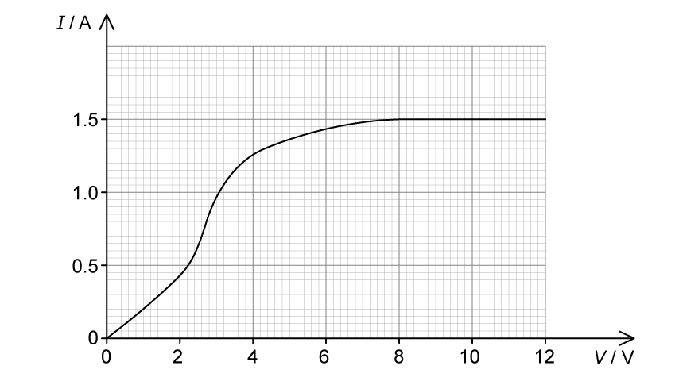
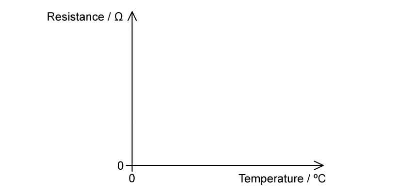
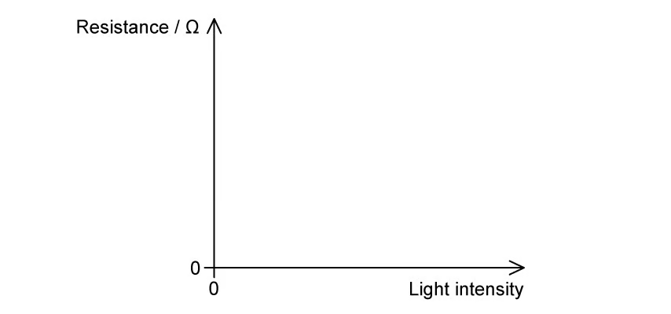
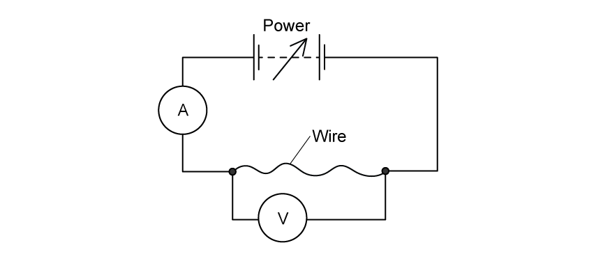
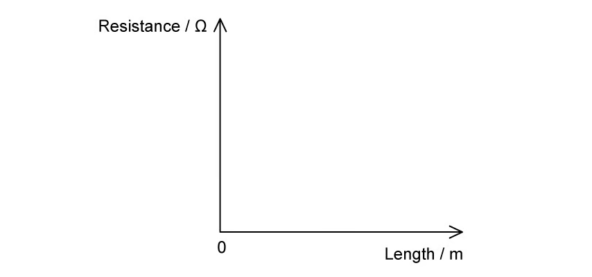
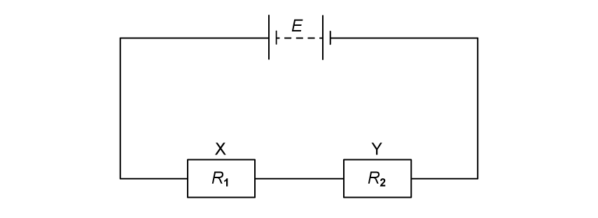

### 9.1 Current & Potential Difference - Medium

::: {.question-card}
#### Example 1 · 9.1 SQ Medium Q2

The smallest conductor within a computer processing chip can be represented as a rectangular block that is one atom high, four atoms wide and twenty atoms long. One such block is shown in Fig. 1.1.

{.question-figure fig-alt="Rectangular block of atoms on an insulating surface"}

The block is made from phosphorus atoms of diameter $d=3.8\times10^{-10}\ \mathrm{m}$. The atoms are deposited on an insulating surface. This ensures that the atoms touch each other.

The processing chip has a resistance, measured from P to Q, of $220\ \Omega$.

**(a)**

**(i)** Define current. `[1]`

**(ii)** Describe, for this processing chip, the properties which will affect the current. `[3]`

`[4 marks]`

**(b)** Calculate the number density of free electrons within the block. Assume that each phosphorus atom contributes one free electron. `[1 mark]`

**(c)** Calculate the current between P and Q when the mean drift velocity of free electrons in the block is $1.9\times10^{-5}\ \mathrm{m\,s^{-1}}$. `[3 marks]`

**(d)** There are about $10^{12}$ of these tiny conductors in a single chip, each carrying the current calculated in part (c).

Estimate the total power dissipated in these conductors in a single chip. `[3 marks]`

Show mark scheme / model answer

- **(a)(i)** Current is the rate of flow of charge carriers. `[1]`
- **(a)(ii)** Current depends on the charge per carrier, `[1]` the number density of free electrons (one per atom), `[1]` and the cross-sectional area of the block. `[1]`
- **(b)** Number density $n=1/d^3=1/(3.8\times10^{-10})^3=1.82\times10^{28}\ \mathrm{m^{-3}}$. `[1]`
- **(c)** Cross-sectional area $A=4d\times d=4(3.8\times10^{-10})^2=5.78\times10^{-19}\ \mathrm{m^2}$. `[1]` $I=nAve=1.82\times10^{28}\times5.78\times10^{-19}\times1.9\times10^{-5}\times1.6\times10^{-19}$. `[1]` $I=3.2\times10^{-14}\ \mathrm{A}$. `[1]`
- **(d)** Power per conductor $=I^2R=(3.2\times10^{-14})^2\times220$. `[1]` Total power $=I^2R\times10^{12}$. `[1]` Total $\approx2\times10^{-13}\ \mathrm{W}$. `[1]`

:::

::: {.question-card}
#### Example 2 · 9.1 SQ Medium Q3

A power source is connected across a component. The current in the component is 40 mA.

**(a)** Calculate the total charge that flows past a point in the component in 3 minutes. `[1 mark]`

**(b)** Calculate the number of electron charge carriers passing the same point in the conductor in this time. `[1 mark]`

**(c)** 8.6 J of energy are transferred to the conductor in this time.

**(i)** Calculate the potential difference across the component. `[2]`

**(ii)** Calculate the resistance of the conductor. `[2]`

`[4 marks]`

Show mark scheme / model answer

- **(a)** $Q=It=0.040\times180=7.2\ \mathrm{C}$. `[1]`
- **(b)** Number of electrons $=Q/e=7.2/(1.6\times10^{-19})=4.5\times10^{19}$. `[1]`
- **(c)(i)** $V=W/Q=8.6/7.2=1.2\ \mathrm{V}$. `[2]`
- **(c)(ii)** $R=V/I=1.2/0.040=30\ \Omega$. `[2]`

:::

### 9.2 Resistance - Medium

::: {.question-card}
#### Example 3 · 9.2 SQ Medium Q1

The photograph shows a statue of Buddha in Sri Lanka, which is protected by a lightning conductor.

{.question-figure fig-alt="Statue of Buddha protected by a lightning conductor"}

During a storm, a potential difference of 2.7 MV was generated between a cloud and the top of the lightning conductor on the statue. A flash of lightning passed between the cloud and the lightning conductor, producing a current of 25 kA for a time of 7.5 ms.

**(a)** Calculate the energy transferred by the lightning strike. `[3 marks]`

**(b)** The lightning conductor is made from copper.

Sketch an $I$-$V$ graph for the rod when it conducts a lightning strike to earth. `[3 marks]`

**(c)** Explain any changes which the lightning rod would undergo during a lightning strike. `[3 marks]`

Show mark scheme / model answer

- **(a)** $Q=It=25\times10^3\times7.5\times10^{-3}=187.5\ \mathrm{C}$. `[1]` $W=VQ=2.7\times10^6\times187.5$. `[1]` $W=5.1\times10^8\ \mathrm{J}$. `[1]`
- **(b)** The rod heats up during the strike, so it behaves like a non-ohmic conductor. Sketch a curved $I$-$V$ graph similar to a filament lamp, with the curve flattening at high current. `[3]`
- **(c)** The rod becomes hot (temperature rises); `[1]` its resistance increases with temperature; `[1]` it may glow or expand slightly due to heating. `[1]`

:::

::: {.question-card}
#### Example 4 · 9.2 SQ Medium Q2

**(a)** Fig. 1.1 shows the graph of $V$ against $I$ for a non-ohmic conductor.

{.question-figure fig-alt="Graph of potential difference against current for a non-ohmic conductor"}

Calculate the maximum resistance of the lamp over the range shown by the graph. `[3 marks]`

**(b)** Using the axes in Fig. 1.2, sketch the graph of current against potential difference for a diode. `[2 marks]`

**(c)** For the graph in Fig. 1.3 determine:

{.question-figure fig-alt="Graph of potential difference against current with points marked at 10 mA"}

**(i)** the resistance when current $=10\ \mathrm{mA}$; `[2]`

**(ii)** the power when current $=10\ \mathrm{mA}$. `[1]`

`[3 marks]`

Show mark scheme / model answer

- **(a)** The maximum resistance occurs at the steepest point of the graph. `[1]` From the graph, $V=12.8\ \mathrm{V}$ and $I=1.75\ \mathrm{A}$. `[1]` $R=V/I=12.8/1.75=7.3\ \Omega$. `[1]`
- **(b)** Draw a diode characteristic: current zero for negative voltages, then a steep rise between about 0.6 V and 1.0 V in forward bias. `[2]`
- **(c)(i)** At $I=10\ \mathrm{mA}$, $V=1.9\ \mathrm{V}$, so $R=V/I=1.9/0.010=190\ \Omega$. `[2]`
- **(c)(ii)** $P=I^2R=(0.010)^2\times190=1.9\times10^{-2}\ \mathrm{W}=19\ \mathrm{mW}$. `[1]`

:::

::: {.question-card}
#### Example 5 · 9.2 SQ Medium Q3

An electrical component has the $I$-$V$ characteristic shown in Fig. 1.1.

{.question-figure fig-alt="I-V characteristic of an electrical component"}

**(a)** Determine the resistance of the component when a potential difference of 6.0 V is applied across it. `[2 marks]`

**(b)** For the component in part (a), calculate the minimum value of $R$ as the potential difference across it changes over the range 0–10 V. `[2 marks]`

**(c)** For the component in part (a) calculate:

**(i)** the power dissipated when $V=2.0\ \mathrm{V}$; `[2]`

**(ii)** the maximum power dissipated before the component heats up; `[2]`

**(iii)** the value of resistance at the point identified in part (ii). `[2]`

`[6 marks]`

Show mark scheme / model answer

- **(a)** At $V=6.0\ \mathrm{V}$, read $I$ from the graph (about 1.43 A). `[1]` $R=V/I=6.0/1.43=4.2\ \Omega$. `[1]`
- **(b)** The minimum resistance occurs where the graph is steepest. `[1]` $R_{\min}=3.0\ \Omega$. `[1]`
- **(c)(i)** At $V=2.0\ \mathrm{V}$, $I\approx0.9\ \mathrm{A}$, so $P=VI=2.0\times0.9=1.8\ \mathrm{W}$. `[2]`
- **(c)(ii)** The maximum power before heating occurs at the highest point of the graph: $P_{\max}=V_{\max}I_{\max}$. `[2]`
- **(c)(iii)** The resistance at that point is $R=V/I$ using the values from part (ii). `[2]`

:::

### 9.3 Resistivity - Easy

::: {.question-card}
#### Example 6 · 9.3 SQ Easy Q1

A straight wire of unstretched length $L$ has an electrical resistance $R$. The area of the cross-section $A$ of the wire may be assumed to be constant.

**(a)** State the relation between $R$, $L$, $A$ and the resistivity $\rho$ of the material of the wire. `[1 mark]`

**(b)** Measurements made for a sample of metal wire are shown in Table 1.1.

| Quantity | Measurement |
|---|---|
| resistance | 61 Ω |
| diameter | 0.44 mm |
| length | 1390 mm |

State the most appropriate instrument to use to measure:

**(i)** the resistance of the wire; `[1]`

**(ii)** the diameter of the wire; `[1]`

**(iii)** the length of the wire. `[1]`

`[3 marks]`

**(c)** Show that the resistivity of the metal is $6.67\times10^{-7}\ \Omega\,\mathrm{m}$. `[1 mark]`

Show mark scheme / model answer

- **(a)** $R=\rho L/A$. `[1]`
- **(b)(i)** Voltmeter and ammeter, or an ohmmeter (multimeter on the ohm setting). `[1]`
- **(b)(ii)** Micrometer screw gauge (or vernier callipers). `[1]`
- **(b)(iii)** Metre rule or tape measure. `[1]`
- **(c)** $\rho=RA/L=61\times\pi(0.22\times10^{-3})^2/1.39$. `[1]` $\rho=6.67\times10^{-7}\ \Omega\,\mathrm{m}$. `[1]`

:::

::: {.question-card}
#### Example 7 · 9.3 SQ Easy Q2

**(a)** On Fig. 1.1, sketch the change in resistance with temperature for a thermistor.

{.question-figure fig-alt="Axes of resistance against temperature for a thermistor"}

`[2 marks]`

**(b)** Cobalt is commonly used to create thermistors. At $20^\circ\mathrm{C}$ a wire of cobalt is used to create a thermistor and has an electrical resistivity of $5.6\times10^{-8}\ \Omega\,\mathrm{m}$.

State and explain what would happen to the resistivity of the thermistor if its temperature is increased to $60^\circ\mathrm{C}$. `[3 marks]`

**(c)**

**(i)** State the meaning of LDR. `[1]`

**(ii)** On Fig. 1.2, sketch the change in resistance with light intensity for an LDR.

{.question-figure fig-alt="Axes of resistance against light intensity for an LDR"}

`[2]`

`[3 marks]`

**(d)** An LDR is connected to a circuit to operate an automatic street light. The resistance of the LDR is measured to be 5 kΩ at one time and 20 MΩ at another.

State which resistance the LDR is likely to be at during the day and which it will be at night. `[2 marks]`

Show mark scheme / model answer

- **(a)** Draw a curve showing resistance decreasing as temperature increases, starting high at low temperature and flattening at high temperature. `[2]`
- **(b)** The resistivity of the thermistor decreases. `[1]` As temperature increases, more charge carriers become available. `[1]` This reduces the resistance (and hence the resistivity) of the thermistor. `[1]`
- **(c)(i)** LDR stands for light-dependent resistor. `[1]`
- **(c)(ii)** Draw a curve showing resistance decreasing as light intensity increases. `[2]`
- **(d)** During the day the LDR is illuminated, so its resistance is the low value of 5 kΩ. `[1]` At night it is dark, so its resistance is the high value of 20 MΩ. `[1]`

:::

### 9.3 Resistivity - Medium

::: {.question-card}
#### Example 8 · 9.3 SQ Medium Q1

An electrical heating element, made from uniform nichrome wire, is required to dissipate 600 W when connected to the 230 V mains supply.

The radius of the wire is 0.16 mm.

**(a)** Calculate the length of nichrome wire required.

Resistivity of nichrome $=1.1\times10^{-6}\ \Omega\,\mathrm{m}$ `[5 marks]`

**(b)** Suggest two properties that the nichrome wire must have to make it suitable as an electrical heating element. `[2 marks]`

**(c)** Explain why the resistivity of the nichrome wire changes with temperature. `[3 marks]`

**(d)** An engineer wants to use the same uniform nichrome wire in another identical electrical heating element which is also required to dissipate 600 W when connected to the 230 V mains supply.

The only nichrome wire they have available has a radius of 0.08 mm.

Calculate the length needed for this new nichrome wire to produce the same current through the heating element. `[3 marks]`

Show mark scheme / model answer

- **(a)** $R=V^2/P=230^2/600=88.2\ \Omega$. `[1]` $A=\pi r^2=\pi(0.16\times10^{-3})^2=8.04\times10^{-8}\ \mathrm{m^2}$. `[1]` $L=RA/\rho=88.2\times8.04\times10^{-8}/(1.1\times10^{-6})$. `[2]` $L=6.4\ \mathrm{m}$. `[1]`
- **(b)** High resistivity, `[1]` and a high melting point (or resistance to oxidation at high temperature). `[1]`
- **(c)** As the temperature rises, the metal atoms vibrate more. `[1]` This increases the rate of collisions with the charge carriers, `[1]` so the resistivity increases with temperature. `[1]`
- **(d)** For the same current, the resistance must remain 88.2 Ω. `[1]` The new area is one quarter of the original, `[1]` so the required length is $6.4/4=1.6\ \mathrm{m}$. `[1]`

:::

::: {.question-card}
#### Example 9 · 9.3 SQ Medium Q2

**(a)** A student investigates the resistivity $\rho$ of a length of wire $l$, with resistance $R$, diameter $d$ and a potential difference $V$ through it.

Determine the resistivity, in terms of $\rho$, of a wire of the same length with a diameter $2d$ and a potential difference $3V$ through it instead. `[3 marks]`

**(b)** The student decides to investigate how the cross-sectional area of a wire affects its resistance. The circuit they use to carry out the experiment is shown in Fig. 1.1.

{.question-figure fig-alt="Circuit used to investigate how the cross-sectional area of a wire affects its resistance"}

Describe a method to accurately determine the cross-sectional area of the wires. `[3 marks]`

**(c)** The student uses three pieces of nichrome wire, each 1.5 m long. The cross-sectional areas of the pieces of wire are $0.45\ \mathrm{mm^2}$, $0.21\ \mathrm{mm^2}$ and $0.89\ \mathrm{mm^2}$.

Sketch a graph of voltage $V$ against the current $I$ for each of the wires. `[3 marks]`

Show mark scheme / model answer

- **(a)** Resistivity is a property of the material and does not change with dimensions or applied voltage. `[1]` The new wire has the same material, so its resistivity is still $\rho$. `[2]`
- **(b)** Measure the diameter at several points along the wire with a micrometer screw gauge. `[1]` Calculate the mean diameter. `[1]` Use $A=\pi d^2/4$ to find the cross-sectional area. `[1]`
- **(c)** For each wire, $V=IR$ with $R=\rho L/A$. `[1]` The wire with the largest area has the smallest gradient; the wire with the smallest area has the largest gradient. `[1]` Draw three straight lines through the origin with gradients in the order $A=0.21$, then 0.45, then 0.89 (steepest to least steep). `[1]`

:::

### 9.3 Resistivity - Hard

::: {.question-card}
#### Example 10 · 9.3 SQ Hard Q1

A wire of cross-sectional area $A$ is made from metal of resistivity $\rho$. The wire is extended. Assume that the volume $V$ of the wire remains constant as it is extended.

**(a)** On Fig. 1.1, sketch how the resistance $R$ of the extending wire varies with the length $l$.

{.question-figure fig-alt="Axes of resistance against length for an extending wire"}

`[2 marks]`

**(b)** Two resistors X and Y have resistance $R_X$ and $R_Y$ respectively. The resistors are connected in series with a battery with electromotive force $E$ and zero internal resistance, as shown in Fig. 1.1.

{.question-figure fig-alt="Resistors X and Y connected in series with a battery of e.m.f. E"}

The resistors are made from metal wires. Data from the resistors are given in Table 1.1.

|  | resistor X | resistor Y |
|---|---|---|
| diameter of metal | $d$ | $4d$ |
| length of metal | $2l$ | $l$ |
| resistivity of metal | $4\rho$ | $\rho$ |

Use information from Table 1.1 to determine the ratio

$$\frac{\text{power dissipated in Y}}{\text{power dissipated in X}}.$$ `[3 marks]`

**(c)** Show that the product of the ratio $\frac{\text{power dissipated in Y}}{\text{power dissipated in X}}$ of X and Y connected in series and connected in parallel is 1. `[3 marks]`

Show mark scheme / model answer

- **(a)** Since the volume is constant, $R=\rho l^2/V$, so $R\propto l^2$. `[1]` Draw a curve through the origin with an increasing gradient. `[1]`
- **(b)** $R_X=\rho_X L_X/A_X=4\rho(2l)/(\pi d^2/4)=32\rho l/(\pi d^2)$; $R_Y=\rho l/(\pi(4d)^2/4)=\rho l/(4\pi d^2)$. `[1]` In series the current is the same, so $P=I^2R$. `[1]` $P_Y/P_X=R_Y/R_X=(\rho l/4)/(32\rho l)=1/128$. `[1]`
- **(c)** In parallel the voltage is the same, so $P=V^2/R$, giving $P_Y/P_X=R_X/R_Y=128$. `[1]` The product of the series and parallel ratios is $1/128\times128=1$. `[2]`

:::
