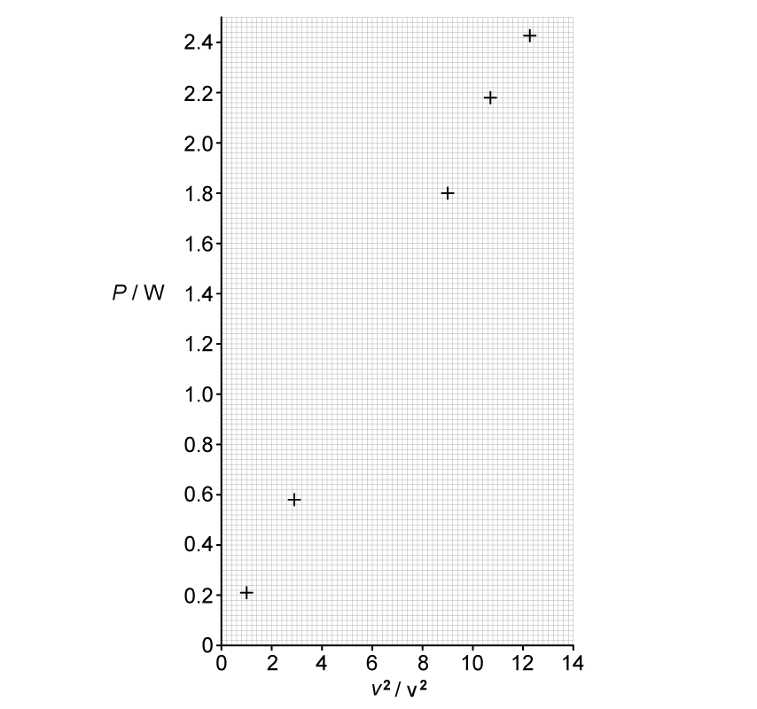
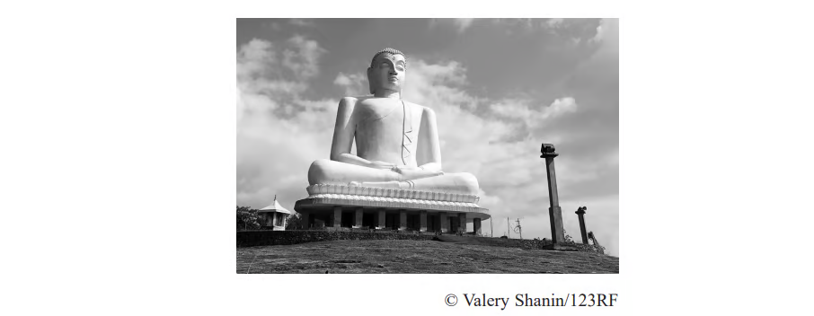
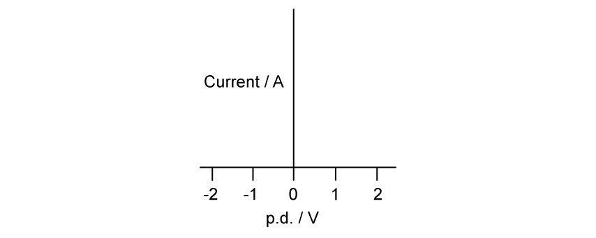

### 9.1 Electric Current - Medium

::: {.question-card}
#### Example 1 · 9.1 SQ Medium Q1

**(a)** State what is meant by electric current.

`[1 mark]`

**(b)** The current in a wire is 3.2 A. The charge on an electron is $1.6 \times 10^{-19}\ \text{C}$.

Calculate the number of electrons passing a point in the wire in 2.0 s.

`[3 marks]`

**(c)** A charge of 24 C flows through a resistor in 40 s. Calculate the current in the resistor.

`[2 marks]`

Show mark scheme / model answer

**(a)** Electric current is the rate of flow of charge. `[1]`

`[Total: 1 mark]`

**(b)**
- Total charge $Q = It = 3.2 \times 2.0 = 6.4\ \text{C}$. `[1]`
- Using $Q = ne$, $n = Q/e = 6.4 / (1.6 \times 10^{-19})$. `[1]`
- $n = 4.0 \times 10^{19}$ electrons. `[1]`

`[Total: 3 marks]`

**(c)**
- Using $I = Q/t$. `[1]`
- $I = 24/40 = 0.60\ \text{A}$. `[1]`

`[Total: 2 marks]`

:::

::: {.question-card}
#### Example 2 · 9.1 SQ Medium Q2

**(a)** State Kirchhoff's first law.

`[1 mark]`

{.question-figure fig-alt="Three wires meeting at a junction P with currents I1, I2 entering and I3, I4 leaving"}

**(b)** In the circuit shown in Fig. 1.1, the currents are $I_1 = 1.5\ \text{A}$, $I_2 = 0.8\ \text{A}$ and $I_3 = 1.2\ \text{A}$.

Fig. 1.1 shows three wires meeting at a junction P, with $I_1$ and $I_2$ entering P and $I_3$ leaving P.

Calculate the current $I_4$ leaving P along the fourth wire.

`[2 marks]`

**(c)** Explain how Kirchhoff's first law is a consequence of the conservation of charge.

`[2 marks]`

Show mark scheme / model answer

**(a)** The sum of the currents entering a junction equals the sum of the currents leaving the junction. `[1]`

`[Total: 1 mark]`

**(b)**
- Using $I_1 + I_2 = I_3 + I_4$. `[1]`
- $I_4 = 1.5 + 0.8 - 1.2 = 1.1\ \text{A}$. `[1]`

`[Total: 2 marks]`

**(c)**
- Charge cannot be created or destroyed / cannot accumulate at a junction. `[1]`
- Therefore the total charge arriving per second must equal the total charge leaving per second, i.e. the currents balance. `[1]`

`[Total: 2 marks]`

:::

::: {.question-card}
#### Example 3 · 9.1 SQ Medium Q3

**(a)** The charge on an electron is $1.6 \times 10^{-19}\ \text{C}$.

Calculate the number of electrons that must pass a point in a circuit per second to produce a current of 0.80 A.

`[2 marks]`

**(b)** A current of 2.4 A flows through a wire for 5.0 minutes.

Calculate the total charge that flows through the wire.

`[2 marks]`

{.question-figure fig-alt="Wire with conventional current direction shown"}

**(c)** The wire in part (b) carries a current in the direction shown in Fig. 1.2.

State the direction of the electron flow, giving a reason.

`[2 marks]`

Show mark scheme / model answer

**(a)**
- Charge per second $= I = 0.80\ \text{C s}^{-1}$. `[1]`
- Number of electrons per second $= I/e = 0.80/(1.6 \times 10^{-19}) = 5.0 \times 10^{18}$. `[1]`

`[Total: 2 marks]`

**(b)**
- Time in seconds: $t = 5.0 \times 60 = 300\ \text{s}$. `[1]`
- $Q = It = 2.4 \times 300 = 720\ \text{C}$. `[1]`

`[Total: 2 marks]`

**(c)**
- Electron flow is opposite to the conventional current direction. `[1]`
- Conventional current is the direction in which positive charge would flow, but the charge carriers in a metal are electrons, which are negative. `[1]`

`[Total: 2 marks]`

:::

### 9.2 Potential Difference and Power - Medium

::: {.question-card}
#### Example 4 · 9.2 SQ Medium Q1

**(a)** State what is meant by potential difference across a component.

`[1 mark]`

**(b)** A p.d. of 6.0 V is applied across a resistor. The charge passing through the resistor in 30 s is 36 C.

**(i)** Calculate the current through the resistor.

**(ii)** Calculate the resistance of the resistor.

**(iii)** Calculate the energy transferred to the resistor in 30 s.

`[6 marks]`

**(c)** A voltmeter is used to measure the p.d. across a resistor.

State how the voltmeter should be connected in the circuit.

`[1 mark]`

Show mark scheme / model answer

**(a)** Potential difference is the energy transferred per unit charge as charge passes through the component. `[1]`

`[Total: 1 mark]`

**(b)**
- **(i)** $I = Q/t = 36/30 = 1.2\ \text{A}$. `[2]`
- **(ii)** $R = V/I = 6.0/1.2 = 5.0\ \Omega$. `[2]`
- **(iii)** Using $W = VQ$ (or $W = VIt$): $W = 6.0 \times 36 = 216\ \text{J}$. `[2]`

`[Total: 6 marks]`

**(c)** Connect the voltmeter in parallel with the resistor. `[1]`

`[Total: 1 mark]`

:::

::: {.question-card}
#### Example 5 · 9.2 SQ Medium Q2

**(a)** State Ohm's law.

{.question-figure fig-alt="Grid for plotting V against I graph"}

`[2 marks]`

**(b)** A resistor is connected to a variable power supply. The current $I$ through the resistor and the p.d. $V$ across it are measured for several settings. The results are shown in the table.

| $I$ / A | 0.00 | 0.20 | 0.40 | 0.60 | 0.80 | 1.00 |
|---|---|---|---|---|---|---|
| $V$ / V | 0.0 | 0.8 | 1.6 | 2.4 | 3.2 | 4.0 |

**(i)** Plot a graph of $V$ against $I$ on the grid below.

**(ii)** Use your graph to determine the resistance of the resistor.

`[5 marks]`

**(c)** The resistor is now replaced by a filament lamp and the experiment is repeated.

Describe how the I–V characteristic of the filament lamp differs from that of the resistor.

`[2 marks]`

Show mark scheme / model answer

**(a)** The current through a metallic conductor is directly proportional to the potential difference across it, provided the physical conditions (such as temperature) remain constant. `[2]`

`[Total: 2 marks]`

**(b)**
- **(i)** All six points plotted correctly with labelled axes and suitable scales. `[3]`
- **(ii)** Best-fit straight line through the origin drawn. `[1]` Gradient $= R = \Delta V/\Delta I = 4.0/1.0 = 4.0\ \Omega$. `[1]`

`[Total: 5 marks]`

**(c)**
- The lamp's I–V graph is a curve, not a straight line. `[1]`
- The gradient decreases at higher currents because the resistance increases as the filament heats up. `[1]`

`[Total: 2 marks]`

:::

::: {.question-card}
#### Example 6 · 9.2 SQ Medium Q3

**(a)** State what is meant by resistivity.

`[1 mark]`

**(b)** A wire of length 1.5 m and cross-sectional area $2.0 \times 10^{-7}\ \text{m}^2$ has a resistance of 0.13 $\Omega$.

Calculate the resistivity of the material of the wire.

`[3 marks]`

**(c)** A second wire is made from the same material. It has twice the length and half the cross-sectional area of the first wire.

Calculate the resistance of the second wire.

`[2 marks]`

**(d)** The resistance of a metallic conductor changes when its temperature changes.

State and explain the effect of increasing temperature on the resistance of the wire.

`[2 marks]`

Show mark scheme / model answer

**(a)** Resistivity is the resistance of a material of unit length and unit cross-sectional area / a property of the material, independent of its dimensions. `[1]`

`[Total: 1 mark]`

**(b)**
- Using $R = \rho L/A$, rearranged: $\rho = RA/L$. `[1]`
- $\rho = 0.13 \times (2.0 \times 10^{-7}) / 1.5$. `[1]`
- $\rho = 1.73 \times 10^{-8}\ \Omega\ \text{m}$. `[1]`

`[Total: 3 marks]`

**(c)**
- Doubling the length doubles $R$; halving the area doubles $R$ again. `[1]`
- $R = 0.13 \times 2 \times 2 = 0.52\ \Omega$. `[1]`

`[Total: 2 marks]`

**(d)**
- The resistance increases. `[1]`
- The metal ions vibrate more vigorously at higher temperature, making it harder for the charge carriers (electrons) to pass through, so resistance increases. `[1]`

`[Total: 2 marks]`

:::

::: {.question-card}
#### Example 7 · 9.2 SQ Medium Q4

{.question-figure fig-alt="Axes for sketching I-V characteristics"}

**(a)** Sketch, on the axes below, the I–V characteristic of:

**(i)** an ohmic conductor;

**(ii)** a semiconductor diode.

`[4 marks]`

**(b)** A fixed resistor has a resistance of 10 $\Omega$.

Calculate the current through the resistor when the p.d. across it is 3.0 V.

`[2 marks]`

**(c)** The fixed resistor is replaced by a thermistor, and the p.d. across it is kept constant at 3.0 V. The temperature of the thermistor increases.

State and explain what happens to the current through the thermistor.

`[3 marks]`

Show mark scheme / model answer

**(a)**
- **(i)** Straight line through the origin (with current proportional to p.d.). `[2]`
- **(ii)** Current near zero for negative p.d. (reverse bias); current rises steeply once the forward threshold voltage (≈ 0.6 V) is exceeded. `[2]`

`[Total: 4 marks]`

**(b)**
- Using $I = V/R$. `[1]`
- $I = 3.0/10 = 0.30\ \text{A}$. `[1]`

`[Total: 2 marks]`

**(c)**
- The current increases. `[1]`
- The resistance of the thermistor decreases as its temperature increases. `[1]`
- With constant p.d., $I = V/R$, so a smaller resistance gives a larger current. `[1]`

`[Total: 3 marks]`

:::

### 9.3 Resistivity - Easy

::: {.question-card}
#### Example 8 · 9.3 SQ Easy Q1

**(a)** State the relationship between resistance $R$, length $L$, cross-sectional area $A$ and resistivity $\rho$ of a wire.

`[1 mark]`

**(b)** An electrical heating element, made from uniform nichrome wire, is required to dissipate 600 W when connected to the 230 V mains supply. The radius of the wire is 0.16 mm.

The resistivity of nichrome is $1.1 \times 10^{-6}\ \Omega\ \text{m}$.

Calculate the length of nichrome wire required.

`[4 marks]`

**(c)** Suggest two properties that the nichrome wire must have to make it suitable as an electrical heating element.

`[2 marks]`

Show mark scheme / model answer

**(a)** $R = \rho L / A$ `[1]`

`[Total: 1 mark]`

**(b)**
- Power $P = V^2/R$, so $R = V^2/P = 230^2/600 = 52900/600 = 88.2\ \Omega$. `[1]`
- Cross-sectional area $A = \pi r^2 = \pi (0.16 \times 10^{-3})^2 = 8.04 \times 10^{-8}\ \text{m}^2$. `[1]`
- Using $R = \rho L/A$, $L = RA/\rho = 88.2 \times (8.04 \times 10^{-8}) / (1.1 \times 10^{-6})$. `[1]`
- $L = 6.45\ \text{m}$. `[1]`

`[Total: 4 marks]`

**(c)**
- It must have a high melting point (to withstand high temperatures without melting). `[1]`
- It must not oxidise / corrode at high temperatures (or: it must be a good conductor of heat / have a high resistivity). `[1]`

`[Total: 2 marks]`

:::

::: {.question-card}
#### Example 9 · 9.3 SQ Easy Q2

{.question-figure fig-alt="Axes for sketching resistance-temperature and resistance-light intensity graphs"}

**(a)** Sketch, on the axes provided, a graph to show how the resistance of a thermistor varies with temperature.

`[2 marks]`

**(b)** Sketch, on the axes provided, a graph to show how the resistance of a light-dependent resistor (LDR) varies with light intensity.

`[2 marks]`

**(c)** State what is meant by a negative temperature coefficient (NTC) thermistor.

`[1 mark]`

Show mark scheme / model answer

**(a)**
- Curved line showing decreasing gradient with rise in temperature. `[1]`
- Smooth line not touching the temperature axis, and no horizontal or vertical line anywhere. `[1]`

`[Total: 2 marks]`

**(b)**
- Curved line showing decreasing gradient with greater light intensity. `[1]`
- Smooth line not touching the light intensity axis, and no horizontal or vertical line. `[1]`

`[Total: 2 marks]`

**(c)** A negative temperature coefficient thermistor is one whose resistance decreases as the temperature increases. `[1]`

`[Total: 1 mark]`

:::

### 9.3 Resistivity - Hard

::: {.question-card}
#### Example 10 · 9.3 SQ Hard Q1

**(a)** A long thin wire of uniform cross-sectional area $A$ and resistivity $\rho$ is extended so that its length increases. The volume of the wire remains constant.

Sketch on Fig. 1.1 how the resistance $R$ of the wire varies with its length $l$.

{.question-figure fig-alt="Axes for sketching R against l graph"}

Determine the relationship between $R$ and $l$.

`[2 marks]`

**(b)** Two cylindrical wires X and Y are made from different metals. The wires are connected in series to a battery. Data for the two wires are given in Table 1.1.

| Wire | Resistivity | Length | Diameter |
|---|---|---|---|
| X | $\rho$ | $l$ | $d$ |
| Y | $\frac{\rho}{3}$ | $2l$ | $4d$ |

Calculate the ratio $\frac{\text{power dissipated in Y}}{\text{power dissipated in X}}$ for the series arrangement.

`[3 marks]`

**(c)** The same two wires are now connected in parallel.

Calculate the ratio $\frac{\text{power dissipated in Y}}{\text{power dissipated in X}}$ for the parallel arrangement.

`[3 marks]`

Show mark scheme / model answer

**(a)**
- $R = \rho l/A$ and since volume $V = Al$ is constant, $A = V/l$, so $R = \rho l/(V/l) = \rho l^2/V$. `[1]`
- Therefore $R \propto l^2$, so the graph is a curve with increasing gradient. `[1]`

`[Total: 2 marks]`

**(b)**
- Resistance of X: $R_X = \rho l / (\pi(d/2)^2) = 4\rho l / (\pi d^2)$
- Resistance of Y: $R_Y = (\rho/3)(2l) / (\pi(4d/2)^2) = (2\rho l/3) / (\pi(2d)^2) = (2\rho l/3) / (4\pi d^2) = \rho l / (6\pi d^2)$
- Ratio $R_Y/R_X = [\rho l/(6\pi d^2)] / [4\rho l/(\pi d^2)] = 1/24$
- In series, same current: $P = I^2R$, so $P_Y/P_X = R_Y/R_X = 1/24$. `[3]`

`[Total: 3 marks]`

**(c)**
- In parallel, same p.d.: $P = V^2/R$, so $P_Y/P_X = R_X/R_Y = 24$. `[3]`

`[Total: 3 marks]`

:::
