### 10.1 DC Practical Circuits & Kirchhoff's Laws - Easy

::: {.question-card}
#### Example 1 · 10.1 MC Easy Q2

Which symbol represents a component whose resistance is designed to change with temperature?

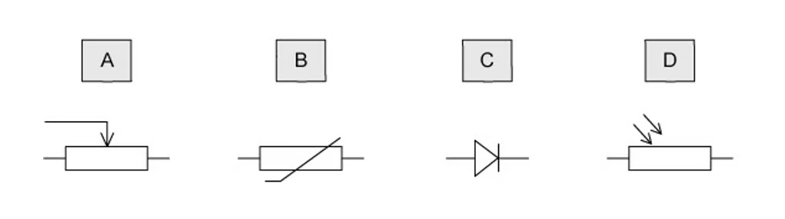{.question-figure fig-alt="Four circuit symbols labelled A, B, C and D"}

Show answer and explanation

**Answer: B.** A component whose resistance changes with temperature is a thermistor; its symbol is option B. Option A is a potentiometer, C is a diode and D is an LDR.

:::

::: {.question-card}
#### Example 2 · 10.1 MC Easy Q3

In the circuit shown, a light-dependent resistor (LDR) is connected to two resistors $R_1$ and $R_2$.

The potential difference (p.d.) across $R_1$ is $V_1$ and the p.d. across $R_2$ is $V_2$. The current in the circuit is $I$.

{.question-figure fig-alt="A light-dependent resistor connected in series with two resistors R1 and R2"}

Which statement about this circuit is correct?

A. the current $I$ increases when the light intensity decreases

B. the LDR is an ohmic conductor

C. the p.d. $V_2$ increases when the light intensity decreases

D. the ratio $\dfrac{V_1}{V_2}$ is independent of light intensity

Show answer and explanation

**Answer: D.** The resistance of an LDR decreases as light intensity increases. In a series circuit the same current flows through every component, and $\dfrac{V_1}{V_2}=\dfrac{R_1}{R_2}$, which depends only on the resistances, not on the current. So the ratio is independent of light intensity.

:::

::: {.question-card}
#### Example 3 · 10.1 MC Easy Q7

A cell is connected to a resistor.

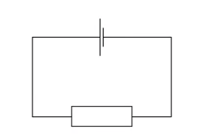{.question-figure fig-alt="A cell connected to a resistor"}

At any given moment, the potential difference across the cell is less than its electromotive force.

Which statement explains this?

A. the cell is continually discharging

B. the connecting wire has some resistance

C. energy is needed to drive charge through the cell

D. power is used when there is a current in the resistor

Show answer and explanation

**Answer: C.** Most cells have some internal resistance, so energy is needed to drive charge through the cell. This energy is lost inside the cell, making the terminal p.d. lower than the e.m.f.

:::

### 10.1 DC Practical Circuits & Kirchhoff's Laws - Medium

::: {.question-card}
#### Example 4 · 10.1 MC Medium Q1

A cell of e.m.f. 2.0 V and negligible internal resistance is connected to a network of resistors as shown.

{.question-figure fig-alt="A 2.0 V cell connected to a network of 2.0 ohm and 4.0 ohm resistors"}

What is the current $I$?

A. 0.25 A

B. 0.33 A

C. 0.50 A

D. 1.5 A

Show answer and explanation

**Answer: A.** The two 4.0 Ω resistors in parallel give 2.0 Ω, and this is in series with a 2.0 Ω resistor to give 4.0 Ω in one branch, which is in parallel with another 2.0 Ω. The total resistance is $\frac{4}{3}\ \Omega$, so the current from the cell is $I=E/R_{\text{total}}=2.0/(4/3)=1.5\ \mathrm{A}$. This 1.5 A splits equally between the two equal branches, and $I$ (through one 2.0 Ω resistor) $=0.25\ \mathrm{A}$.

:::

::: {.question-card}
#### Example 5 · 10.1 MC Medium Q3

The diagram shows part of a current-carrying circuit. The ammeter has negligible resistance.

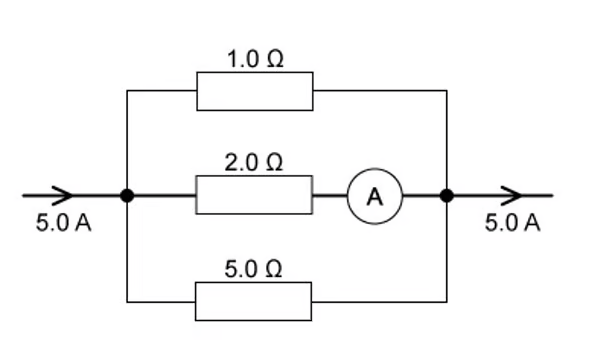{.question-figure fig-alt="Part of a circuit with 1.0 ohm, 2.0 ohm and 5.0 ohm resistors and an ammeter"}

What is the reading on the ammeter?

A. 0.7 A

B. 1.3 A

C. 1.5 A

D. 1.7 A

Show answer and explanation

**Answer: C.** The three resistors are in parallel: $\frac{1}{R}=\frac{1}{1}+\frac{1}{2}+\frac{1}{5}=1.7$, so $R=0.588\ \Omega$. With 5.0 A flowing, the p.d. across the branches is $V=IR=5.0\times0.588=2.94\ \mathrm{V}$. Since the resistors are in parallel, the p.d. across each branch is the same, so the current through the 2.0 Ω branch is $I=V/R=2.94/2=1.5\ \mathrm{A}$.

:::

::: {.question-card}
#### Example 6 · 10.1 MC Medium Q4

In the circuit shown, all the resistors are identical.

The reading on voltmeter $V_1$ is 8.0 V and the reading on voltmeter $V_2$ is 1.0 V.

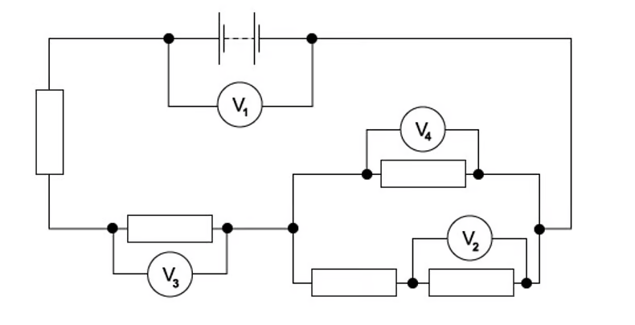{.question-figure fig-alt="Circuit of five identical resistors with voltmeters V1, V2, V3 and V4"}

What are the readings on the other voltmeters?

|  | Reading on voltmeter $V_4$ / V | Reading on voltmeter $V_3$ / V |
|---|---|---|
| A | 1.5 | 1.0 |
| B | 3.0 | 2.0 |
| C | 4.5 | 3.0 |
| D | 6.0 | 4.0 |

Show answer and explanation

**Answer: B.** With identical resistors, the p.d. across the resistor left of $V_2$ is also 1.0 V, so the lower branch of the parallel combination carries 2.0 V. By Kirchhoff's second law, the sum of p.d.s around the loop is the e.m.f.: $V_4+V_4+2.0=8.0$, giving $V_4=3.0\ \mathrm{V}$ and $V_3=2.0\ \mathrm{V}$.

:::

::: {.question-card}
#### Example 7 · 10.1 MC Medium Q6

The diagram shows a circuit with four voltmeter readings $V$, $V_1$, $V_2$ and $V_3$.

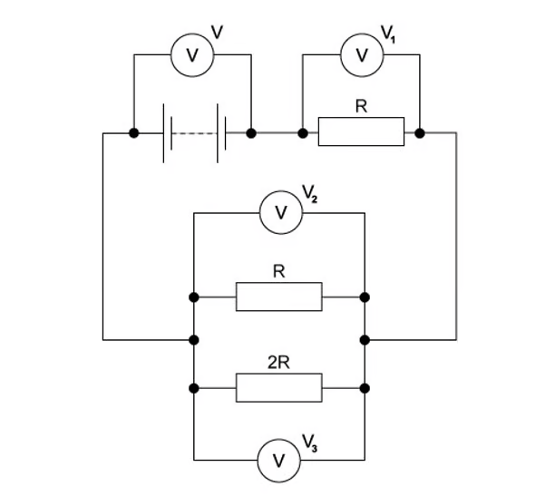{.question-figure fig-alt="A circuit with resistors and four voltmeters V, V1, V2 and V3"}

Which equation relating the voltmeter readings must be true?

A. $V=V_1+V_2+V_3$

B. $V+V_1=V_2+V_3$

C. $V_3=2(V_2)$

D. $V-V_1=V_3$

Show answer and explanation

**Answer: D.** The circuit forms two loops. Applying Kirchhoff's second law to each loop gives $V=V_1+V_2$ and $V=V_2+V_3$, so $V-V_1=V_3$.

:::

::: {.question-card}
#### Example 8 · 10.1 MC Medium Q7

A simple circuit is formed by connecting a resistor of resistance $R$ between the terminals of a battery of electromotive force (e.m.f.) 9.0 V and constant internal resistance $r$.

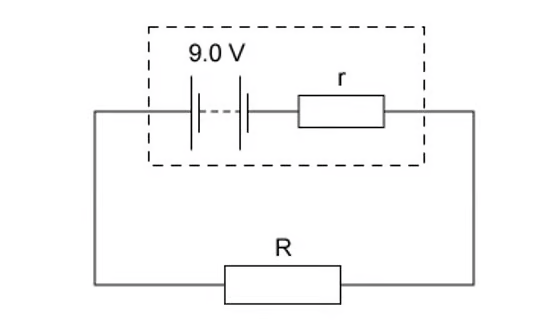{.question-figure fig-alt="A 9.0 V battery with internal resistance r connected to a resistor R"}

A charge of 6.0 C flows through the resistor in a time of 2.0 minutes, causing it to dissipate 48 J of thermal energy.

What is the internal resistance $r$ of the battery?

A. 0.17 Ω

B. 0.33 Ω

C. 20 Ω

D. 160 Ω

Show answer and explanation

**Answer: C.** The current is $I=Q/t=6.0/120=0.05\ \mathrm{A}$. The power dissipated in $R$ is $P=48/120=0.4\ \mathrm{W}=I^2R$, so $R=0.4/0.05^2=160\ \Omega$. From $E=I(R+r)$, $9.0=0.05(160+r)$, so $r=20\ \Omega$.

:::

::: {.question-card}
#### Example 9 · 10.1 MC Medium Q8

When four identical resistors are connected as shown in diagram 1, the ammeter reads 1.0 A, and the voltmeter reads zero.

The resistors and meters are reconnected to the supply, as shown in diagram 2.

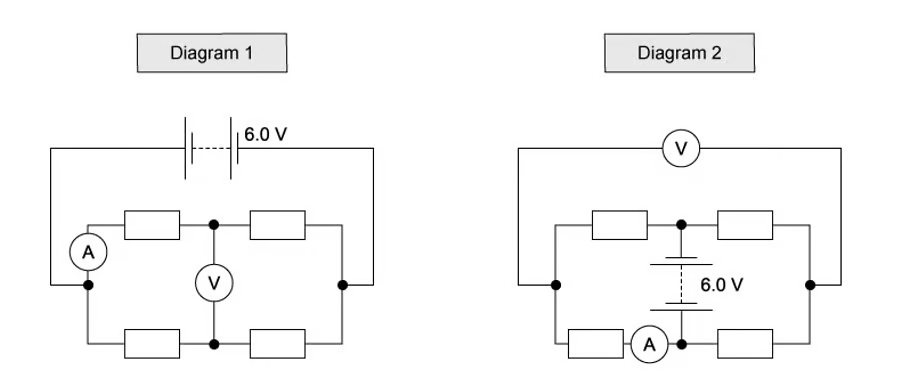{.question-figure fig-alt="Two diagrams showing four identical resistors with an ammeter and voltmeter"}

What are the meter readings in diagram 2?

|  | Voltmeter reading / V | Ammeter reading / A |
|---|---|---|
| A | 1.0 | 1.0 |
| B | 3.0 | 0.5 |
| C | 3.0 | 1.0 |
| D | 6.0 | 0.5 |

Show answer and explanation

**Answer: A.** In diagram 1 the voltmeter reads zero because both its junctions are at the same potential; the ammeter reads 1.0 A, so the total current is 2.0 A. In diagram 2 the resistors are arranged so that the voltmeter reads 1.0 V and the ammeter still reads 1.0 A (the p.d. and current pattern is the same as diagram 1).

:::

::: {.question-card}
#### Example 10 · 10.1 MC Medium Q10

In the circuit shown, all the resistors are identical and all the ammeters have negligible resistance.

The reading on ammeter $A_1$ is 0.6 A.

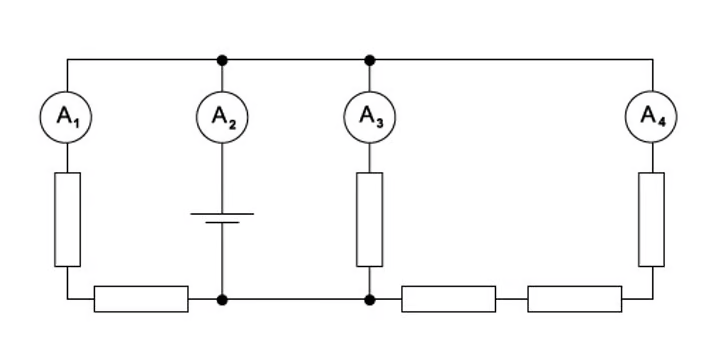{.question-figure fig-alt="Circuit of identical resistors with four ammeters A1, A2, A3 and A4"}

What are the readings on the other ammeters?

|  | $A_2$ / A | $A_3$ / A | $A_4$ / A |
|---|---|---|---|
| A | 1.0 | 0.3 | 0.1 |
| B | 1.4 | 0.6 | 0.2 |
| C | 1.8 | 0.9 | 0.3 |
| D | 2.2 | 1.2 | 0.4 |

Show answer and explanation

**Answer: D.** Current flows from the positive terminal of the battery, so the current in $A_2$ has the highest value. From the resistor arrangement, $A_2=2.2\ \mathrm{A}$, $A_3=1.2\ \mathrm{A}$ and $A_4=0.4\ \mathrm{A}$.

:::

### 10.1 DC Practical Circuits & Kirchhoff's Laws - Hard

::: {.question-card}
#### Example 11 · 10.1 MC Hard Q1

A power supply of electromotive force (e.m.f.) 12 V and internal resistance 2 Ω is connected in series with a load resistor. The value of the load resistor is varied from 0.5 Ω to 4 Ω.

Which graph shows how the power $P$ dissipated in the load resistor varies with the resistance of the load resistor?

{.question-figure fig-alt="Two graphs of power against load resistance labelled A and B"}

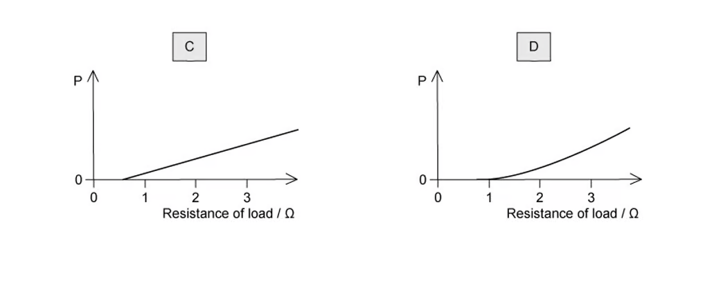{.question-figure fig-alt="Two graphs of power against load resistance labelled C and D"}

Show answer and explanation

**Answer: A.** The power in the load is $P=I^2R=E^2R/(R+r)^2$. Maximum power is transferred when $R=r=2\ \Omega$, so the graph rises to a peak at 2 Ω and then falls – graph A.

:::

::: {.question-card}
#### Example 12 · 10.1 MC Hard Q2

Six resistors, each of resistance 5 Ω, are connected to a 2 V cell of negligible internal resistance.

{.question-figure fig-alt="Six 5 ohm resistors connected to a 2 V cell with terminals X and Y"}

What is the potential difference between terminals X and Y?

Show answer and explanation

**Answer: A.** The network is a balanced arrangement in which the potential at X equals the potential at Y, so the p.d. between X and Y is zero.

:::

::: {.question-card}
#### Example 13 · 10.1 MC Hard Q6

A p.d. of 12 V is connected between P and Q.

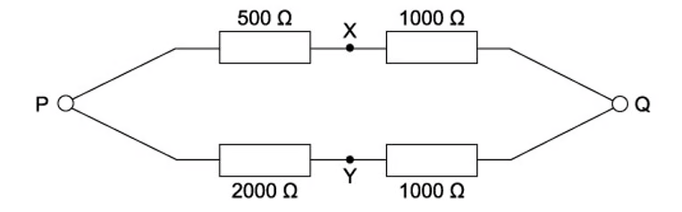{.question-figure fig-alt="Four resistors of 500, 1000, 2000 and 1000 ohms arranged with terminals P, Q, X and Y"}

What is the p.d. between X and Y?

A. 0 V

B. 4 V

C. 6 V

D. 8 V

Show answer and explanation

**Answer: B.** The p.d. across the 500 Ω resistor is $12\times\frac{500}{500+1000}=4\ \mathrm{V}$ and the p.d. across the 2000 Ω resistor is $12\times\frac{2000}{2000+1000}=8\ \mathrm{V}$. The p.d. between X and Y is the difference: $8-4=4\ \mathrm{V}$.

:::

::: {.question-card}
#### Example 14 · 10.1 MC Hard Q9

A 20 V d.c. supply is connected to a circuit consisting of five resistors L, M, N, P and Q.

There is a potential drop of 7 V across L and a further 4 V potential drop across N.

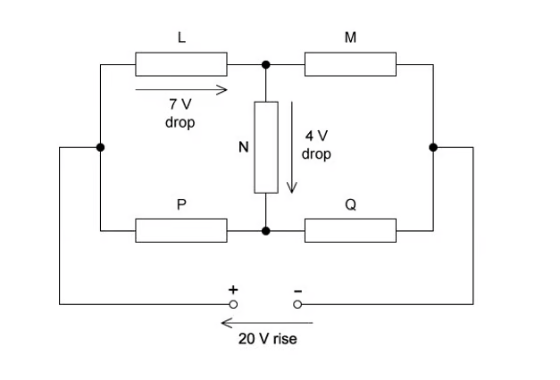{.question-figure fig-alt="A 20 V supply connected to five resistors L, M, N, P and Q with labelled potential drops"}

What are the potential drops across M, P and Q?

|  | M / V | P / V | Q / V |
|---|---|---|---|
| A | 9 | 7 | 3 |
| B | 13 | 7 | 13 |
| C | 13 | 11 | 9 |
| D | 7 | 3 | 7 |

Show answer and explanation

**Answer: C.** Around loop 1, the 7 V drop across L means a 13 V drop across M (20 − 7 = 13 V). Around loop 2, the p.d. between P and Q is 13 V − 4 V = 9 V, so the drop across Q is 9 V and the drop across P is 20 − 9 = 11 V.

:::

::: {.question-card}
#### Example 15 · 10.1 MC Hard Q10

The diagram shows the electric motor for a garden pump connected to a 24 V power supply by an insulated two-core cable.

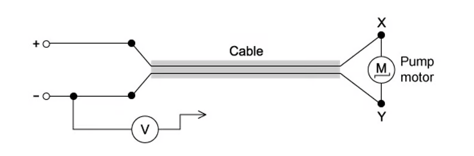{.question-figure fig-alt="A 24 V power supply connected to a pump motor by a two-core cable with terminals X and Y"}

The motor does not work, so to find the fault, the negative terminal of a voltmeter is connected to the negative terminal of the power supply, and its other end is connected in turn to terminals X and Y at the motor.

Which row represents two readings and a correct conclusion?

|  | Reading at X / V | Reading at Y / V | Conclusion |
|---|---|---|---|
| A | 24 | 0 | break in positive wire of cable |
| B | 24 | 12 | break in negative wire of cable |
| C | 24 | 24 | break in connection within the motor |
| D | 24 | 24 | break in negative wire of cable |

Show answer and explanation

**Answer: D.** X is connected to the positive terminal, so the reading at X is 24 V, meaning there is no break in the positive wire. If the negative wire is broken, no current flows and Y is also at 24 V (same potential as X), so the reading at Y is 24 V.

:::

### 10.2 DC Potential Dividers - Easy

::: {.question-card}
#### Example 16 · 10.2 MC Easy Q1

A potential divider consists of a fixed resistor R and a light-dependent resistor (LDR).

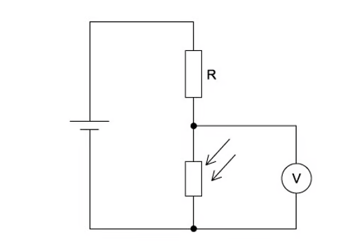{.question-figure fig-alt="A potential divider consisting of a fixed resistor R and an LDR with a voltmeter"}

What happens to the voltmeter reading, and why does it happen, when the intensity of light on the LDR increases?

A. The voltmeter reading decreases because the LDR resistance decreases

B. The voltmeter reading decreases because the LDR resistance increases

C. The voltmeter reading increases because the LDR resistance decreases

D. The voltmeter reading increases because the LDR resistance increases

Show answer and explanation

**Answer: A.** The resistance of the LDR decreases as light intensity increases. From $V=IR$, the potential difference across the LDR also decreases, so the voltmeter reading decreases.

:::

::: {.question-card}
#### Example 17 · 10.2 MC Easy Q2

The diagram shows a potentiometer circuit.

The contact T is placed on the wire and moved along the wire until the galvanometer reading is zero. The length XT is then noted.

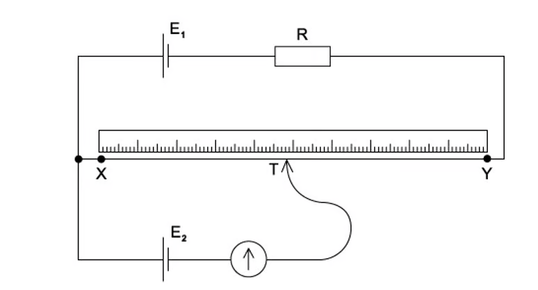{.question-figure fig-alt="A potentiometer circuit with a wire XY, a galvanometer and two cells"}

In order to calculate the potential difference per unit length of the wire XY, which value must also be known?

A. the e.m.f. of the cell $E_1$

B. the e.m.f. of the cell $E_2$

C. the resistance of resistor R

D. the resistance of the wire XY

Show answer and explanation

**Answer: B.** At balance, the p.d. across XT equals the e.m.f. of the cell $E_2$ connected to the galvanometer. To find the p.d. per unit length of the wire, we need the e.m.f. of $E_2$.

:::

::: {.question-card}
#### Example 18 · 10.2 MC Easy Q5

The diagram shows a potential divider circuit designed to provide a variable output p.d.

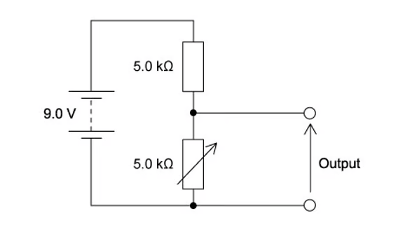{.question-figure fig-alt="A 9.0 V supply connected to two 5.0 k ohm resistors with an output terminal"}

Which gives the available range of output p.d.?

|  | Maximum output | Minimum output |
|---|---|---|
| A | 3.0 V | 0 |
| B | 4.5 V | 0 |
| C | 9.0 V | 0 |
| D | 9.0 V | 4.5 V |

Show answer and explanation

**Answer: B.** With two equal 5.0 kΩ resistors across 9.0 V, the output can be varied from 0 V to $9.0\times\frac{5.0}{5.0+5.0}=4.5\ \mathrm{V}$.

:::

::: {.question-card}
#### Example 19 · 10.2 MC Easy Q7

In the circuit shown, the 6.0 V battery has negligible internal resistance. Resistors $R_1$ and $R_2$ and the voltmeter have resistance 100 kΩ.

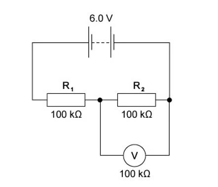{.question-figure fig-alt="A 6.0 V battery connected to two 100 k ohm resistors and a 100 k ohm voltmeter"}

What is the current in the resistor $R_2$?

A. 20 μA

B. 30 μA

C. 40 μA

D. 60 μA

Show answer and explanation

**Answer: A.** $R_2$ and the voltmeter (both 100 kΩ) are in parallel, giving 50 kΩ, which is in series with $R_1$ (100 kΩ), so the total resistance is 150 kΩ. The total current is $I=6.0/150000=40\ \mu\mathrm{A}$. This splits equally at the junction, so the current in $R_2$ is 20 μA.

:::

::: {.question-card}
#### Example 20 · 10.2 MC Easy Q9

The circuit is designed to trigger an alarm system when the input voltage exceeds some preset value. It does this by comparing $V_{\text{out}}$ with a fixed reference voltage, which is set at 4.8 V.

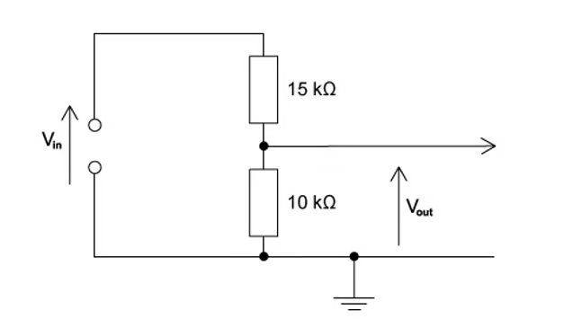{.question-figure fig-alt="A potential divider with 15 k ohm and 10 k ohm resistors producing an output voltage Vout"}

$V_{\text{out}}$ is equal to 4.8 V.

What is the input voltage $V_{\text{in}}$?

A. 4.8 V

B. 7.2 V

C. 9.6 V

D. 12 V

Show answer and explanation

**Answer: D.** Using the potential divider equation, $V_{\text{out}}=V_{\text{in}}\frac{R_2}{R_1+R_2}$ with $R_1=15\ \mathrm{k\Omega}$ and $R_2=10\ \mathrm{k\Omega}$: $4.8=V_{\text{in}}\times\frac{10}{25}$, so $V_{\text{in}}=12\ \mathrm{V}$.

:::
