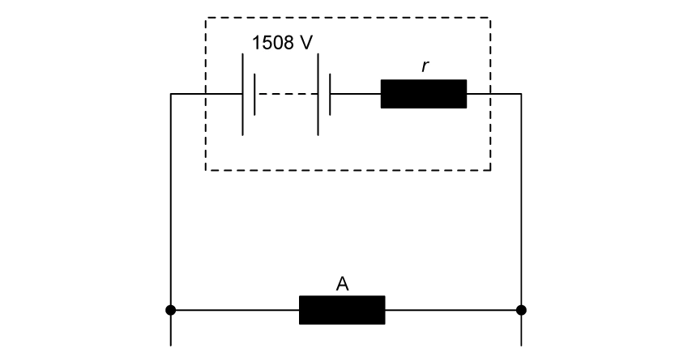
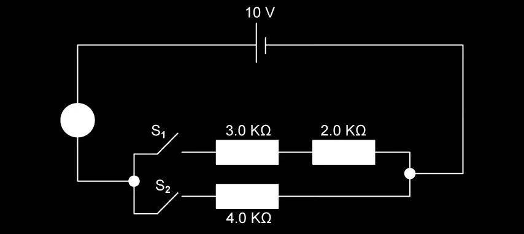
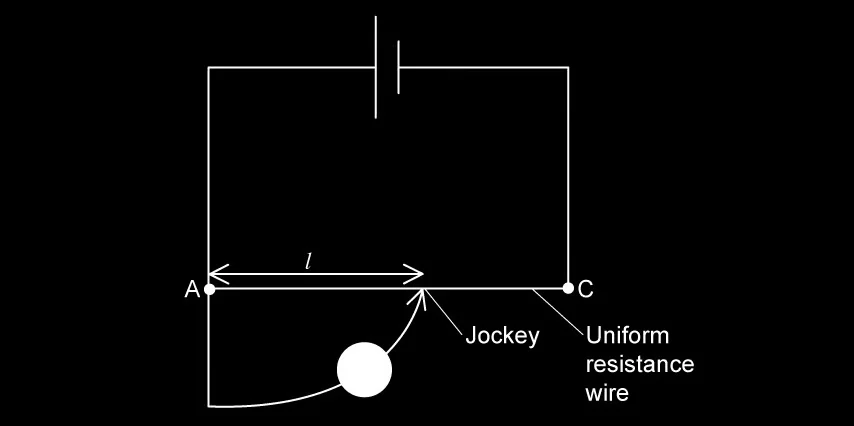
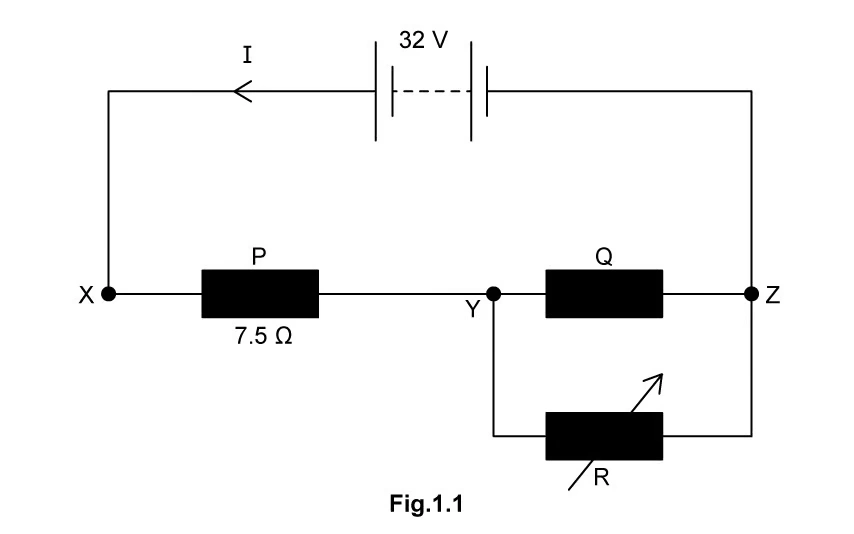
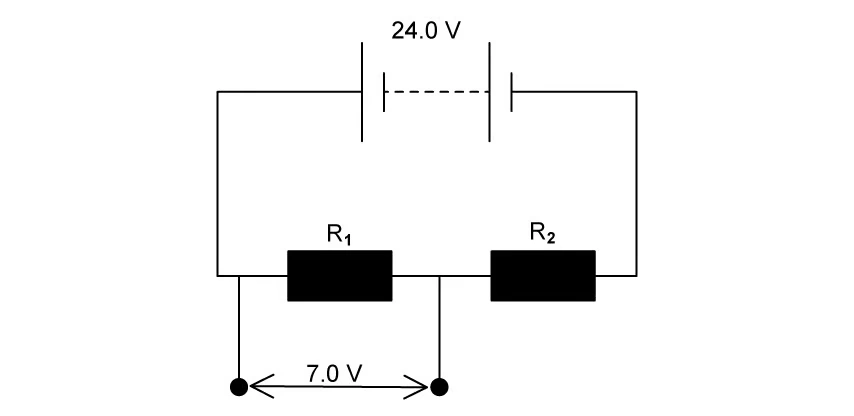

### 10.1 Practical Circuits & Kirchhoff's Laws - Easy

::: {.question-card}
#### Example 1 · 10.1 SQ Easy Q1

**(a)** State what is meant by the electromotive force (e.m.f.) of a cell.

`[1 mark]`

**(b)** A cell of e.m.f. 1.5 V and internal resistance 0.40 $\Omega$ is connected to a 2.6 $\Omega$ resistor.

**(i)** Calculate the current in the circuit.

**(ii)** Calculate the terminal p.d. of the cell.

`[4 marks]`

**(c)** Explain why the terminal p.d. is less than the e.m.f. of the cell.

`[2 marks]`

Show mark scheme / model answer

**(a)** E.m.f. is the energy transformed from other forms (chemical) to electrical energy per unit charge. `[1]`

`[Total: 1 mark]`

**(b)**
- **(i)** $I = E/(R + r) = 1.5/(2.6 + 0.40) = 1.5/3.0 = 0.50\ \text{A}$. `[2]`
- **(ii)** $V = IR = 0.50 \times 2.6 = 1.3\ \text{V}$ or $V = E - Ir = 1.5 - 0.50 \times 0.40 = 1.3\ \text{V}$. `[2]`

`[Total: 4 marks]`

**(c)**
- Some of the e.m.f. is used to drive current through the internal resistance of the cell. `[1]`
- The voltage drop across the internal resistance (lost volts = $Ir$) reduces the voltage available at the terminals. `[1]`

`[Total: 2 marks]`

:::

::: {.question-card}
#### Example 2 · 10.1 SQ Easy Q2

**(a)** State Kirchhoff's first law.

`[1 mark]`

**(b)** State Kirchhoff's second law.

`[1 mark]`

**(c)** Explain how Kirchhoff's first law is a consequence of the conservation of charge.

`[2 marks]`

Show mark scheme / model answer

**(a)** The sum of the currents entering any junction equals the sum of the currents leaving that junction. `[1]`

`[Total: 1 mark]`

**(b)** The sum of the e.m.f.s around any closed loop equals the sum of the p.d.s around the loop. `[1]`

`[Total: 1 mark]`

**(c)**
- Charge cannot be created or destroyed / cannot accumulate at a junction. `[1]`
- Therefore, the total charge arriving per second must equal the total charge leaving per second. `[1]`

`[Total: 2 marks]`

:::

### 10.1 Practical Circuits - Medium

::: {.question-card}
#### Example 3 · 10.1 SQ Medium Q1

{.question-figure fig-alt="Circuit with a cell and two resistors"}

A battery of e.m.f. 12 V and internal resistance 1.0 $\Omega$ is connected to a 5.0 $\Omega$ resistor and a 3.0 $\Omega$ resistor in series.

**(a)** Calculate the total resistance in the circuit.

`[1 mark]`

**(b)** Calculate the current in the circuit.

`[2 marks]`

**(c)** Calculate the terminal p.d. of the battery.

`[2 marks]`

**(d)** Calculate the power dissipated in the 5.0 $\Omega$ resistor.

`[2 marks]`

**(e)** The 3.0 $\Omega$ resistor is replaced by a 2.0 $\Omega$ resistor. State and explain what happens to the terminal p.d. of the battery.

`[2 marks]`

Show mark scheme / model answer

**(a)** $R_{\text{total}} = 5.0 + 3.0 + 1.0 = 9.0\ \Omega$. `[1]`

`[Total: 1 mark]`

**(b)**
- Using $I = E/(R + r)$. `[1]`
- $I = 12/9.0 = 1.33\ \text{A}$. `[1]`

`[Total: 2 marks]`

**(c)**
- Terminal p.d. $V = IR_{\text{external}}$ or $V = E - Ir$. `[1]`
- $V = 1.33 \times (5.0 + 3.0) = 1.33 \times 8.0 = 10.7\ \text{V}$ (or $V = 12 - 1.33 \times 1.0 = 10.7\ \text{V}$). `[1]`

`[Total: 2 marks]`

**(d)**
- $P = I^2R = (1.33)^2 \times 5.0$. `[1]`
- $P = 8.89\ \text{W}$. `[1]`

`[Total: 2 marks]`

**(e)**
- The terminal p.d. decreases. `[1]`
- The external resistance decreases, so the current increases. The lost volts ($Ir$) increase, so the terminal p.d. ($E - Ir$) decreases. `[1]`

`[Total: 2 marks]`

:::

::: {.question-card}
#### Example 4 · 10.1 SQ Medium Q2

{.question-figure fig-alt="Circuit with a cell, switch and two resistors"}

A cell of e.m.f. 6.0 V has an internal resistance of 0.50 $\Omega$. It is connected to two resistors of 2.5 $\Omega$ and 4.5 $\Omega$ in parallel.

**(a)** Calculate the combined resistance of the two resistors in parallel.

`[2 marks]`

**(b)** Calculate the total current supplied by the cell.

`[2 marks]`

**(c)** Calculate the current through the 2.5 $\Omega$ resistor.

`[2 marks]`

**(d)** A voltmeter is connected across the terminals of the cell. Calculate the voltmeter reading.

`[2 marks]`

Show mark scheme / model answer

**(a)**
- $1/R_p = 1/2.5 + 1/4.5 = 0.40 + 0.222 = 0.622$. `[1]`
- $R_p = 1/0.622 = 1.61\ \Omega$. `[1]`

`[Total: 2 marks]`

**(b)**
- $I = E/(R_p + r) = 6.0/(1.61 + 0.50)$. `[1]`
- $I = 6.0/2.11 = 2.84\ \text{A}$. `[1]`

`[Total: 2 marks]`

**(c)**
- Using the current divider rule: $I_{2.5} = I \times \frac{R_{\text{other}}}{R_{\text{total parallel}}} = 2.84 \times \frac{4.5}{2.5 + 4.5} = 2.84 \times 4.5/7.0$. `[1]`
- $I_{2.5} = 1.83\ \text{A}$. `[1]`

`[Total: 2 marks]`

**(d)**
- $V = E - Ir = 6.0 - 2.84 \times 0.50$. `[1]`
- $V = 6.0 - 1.42 = 4.58\ \text{V}$. `[1]`

`[Total: 2 marks]`

:::

### 10.2 Kirchhoff's Laws - Medium

::: {.question-card}
#### Example 5 · 10.2 SQ Medium Q1

{.question-figure fig-alt="Circuit diagram with two loops showing currents I1, I2, I3"}

A circuit contains two cells and three resistors as shown in Fig. 1.1.

$E_1 = 12\ \text{V}$, $E_2 = 6.0\ \text{V}$, $R_1 = 4.0\ \Omega$, $R_2 = 2.0\ \Omega$, $R_3 = 3.0\ \Omega$.

**(a)** Apply Kirchhoff's first law at junction P to write an equation relating $I_1$, $I_2$ and $I_3$.

`[1 mark]`

**(b)** Apply Kirchhoff's second law to the loop containing $E_1$, $R_1$ and $R_3$. Write an equation.

`[2 marks]`

**(c)** Apply Kirchhoff's second law to the loop containing $E_2$, $R_2$ and $R_3$. Write an equation.

`[2 marks]`

**(d)** Solve the equations to find $I_1$, $I_2$ and $I_3$.

`[3 marks]`

Show mark scheme / model answer

**(a)** $I_1 = I_2 + I_3$ (or equivalent). `[1]`

`[Total: 1 mark]`

**(b)**
- Going around the loop from the positive terminal of $E_1$: $E_1 = I_1R_1 + I_3R_3$. `[1]`
- $12 = 4I_1 + 3I_3$. `[1]`

`[Total: 2 marks]`

**(c)**
- Going around the loop with $E_2$: $E_2 = I_2R_2 - I_3R_3$ (or $-E_2 = -I_2R_2 - I_3R_3$, depending on direction). `[1]`
- $6 = 2I_2 - 3I_3$ (assuming the loop is traversed in the same direction as $E_2$). `[1]`

`[Total: 2 marks]`

**(d)**
- From (a): $I_1 = I_2 + I_3$
- From (b): $12 = 4(I_2 + I_3) + 3I_3 = 4I_2 + 7I_3$
- From (c): $6 = 2I_2 - 3I_3$
- Solving (c) for $I_2$: $I_2 = (6 + 3I_3)/2 = 3 + 1.5I_3$
- Substituting into (b): $12 = 4(3 + 1.5I_3) + 7I_3 = 12 + 6I_3 + 7I_3 = 12 + 13I_3$ `[1]`
- So $13I_3 = 0$, $I_3 = 0\ \text{A}$. `[1]`
- $I_2 = 3 + 0 = 3.0\ \text{A}$, $I_1 = 3.0 + 0 = 3.0\ \text{A}$. `[1]`

`[Total: 3 marks]`

:::

::: {.question-card}
#### Example 6 · 10.2 SQ Medium Q2

{.question-figure fig-alt="Circuit with two cells in series and resistors"}

Two cells are connected in series with three resistors. The circuit is shown in Fig. 1.1.

$E_1 = 4.0\ \text{V}$, $E_2 = 2.0\ \text{V}$, $R_1 = 2.0\ \Omega$, $R_2 = 3.0\ \Omega$, $R_3 = 5.0\ \Omega$.

**(a)** Calculate the total e.m.f. in the circuit.

`[1 mark]`

**(b)** Calculate the total resistance of the circuit.

`[1 mark]`

**(c)** Calculate the current in the circuit.

`[2 marks]`

**(d)** Calculate the p.d. across $R_2$.

`[2 marks]`

**(e)** Calculate the power dissipated in $R_3$.

`[2 marks]`

Show mark scheme / model answer

**(a)** $E_{\text{total}} = 4.0 + 2.0 = 6.0\ \text{V}$. `[1]`

`[Total: 1 mark]`

**(b)** $R_{\text{total}} = 2.0 + 3.0 + 5.0 = 10.0\ \Omega$. `[1]`

`[Total: 1 mark]`

**(c)**
- Using $I = E/R$. `[1]`
- $I = 6.0/10.0 = 0.60\ \text{A}$. `[1]`

`[Total: 2 marks]`

**(d)**
- $V_2 = IR_2 = 0.60 \times 3.0$. `[1]`
- $V_2 = 1.8\ \text{V}$. `[1]`

`[Total: 2 marks]`

**(e)**
- $P = I^2R_3 = (0.60)^2 \times 5.0$. `[1]`
- $P = 0.36 \times 5.0 = 1.8\ \text{W}$. `[1]`

`[Total: 2 marks]`

:::

### 10.3 Potential Dividers - Medium

::: {.question-card}
#### Example 7 · 10.3 SQ Medium Q1

{.question-figure fig-alt="Potential divider circuit with two resistors"}

A potential divider consists of a 2.0 k$\Omega$ resistor and a 3.0 k$\Omega$ resistor connected in series across a 10 V supply.

**(a)** Calculate the current in the circuit.

`[2 marks]`

**(b)** Calculate the output voltage across the 3.0 k$\Omega$ resistor.

`[2 marks]`

**(c)** The 3.0 k$\Omega$ resistor is replaced by a thermistor whose resistance at room temperature is 3.0 k$\Omega$. The output voltage is taken across the thermistor.

State and explain what happens to the output voltage when the temperature of the thermistor increases.

`[3 marks]`

Show mark scheme / model answer

**(a)**
- $I = V_{\text{in}}/(R_1 + R_2) = 10/(2000 + 3000)$. `[1]`
- $I = 10/5000 = 2.0 \times 10^{-3}\ \text{A} = 2.0\ \text{mA}$. `[1]`

`[Total: 2 marks]`

**(b)**
- $V_{\text{out}} = \frac{R_2}{R_1 + R_2} \times V_{\text{in}} = \frac{3000}{2000 + 3000} \times 10$. `[1]`
- $V_{\text{out}} = \frac{3}{5} \times 10 = 6.0\ \text{V}$. `[1]`

`[Total: 2 marks]`

**(c)**
- The output voltage decreases. `[1]`
- The resistance of the NTC thermistor decreases as temperature increases. `[1]`
- $V_{\text{out}} = \frac{R_{\text{thermistor}}}{R_{\text{fixed}} + R_{\text{thermistor}}} \times V_{\text{in}}$, so a smaller $R_{\text{thermistor}}$ gives a smaller output voltage. `[1]`

`[Total: 3 marks]`

:::

::: {.question-card}
#### Example 8 · 10.3 SQ Medium Q2

{.question-figure fig-alt="Potential divider with LDR"}

An LDR and a 4.0 k$\Omega$ fixed resistor are connected in series across a 9.0 V supply. The output voltage is taken across the fixed resistor.

In bright sunlight, the resistance of the LDR is 1.0 k$\Omega$.

**(a)** Calculate the output voltage in bright sunlight.

`[2 marks]`

**(b)** In dim light, the resistance of the LDR is 8.0 k$\Omega$. Calculate the output voltage in dim light.

`[2 marks]`

**(c)** The output voltage is used to switch on a security light when it gets dark. Explain how the change in output voltage between bright and dim light achieves this.

`[3 marks]`

Show mark scheme / model answer

**(a)**
- $V_{\text{out}} = \frac{R_{\text{fixed}}}{R_{\text{fixed}} + R_{\text{LDR}}} \times V_{\text{in}} = \frac{4.0}{4.0 + 1.0} \times 9.0$. `[1]`
- $V_{\text{out}} = \frac{4}{5} \times 9.0 = 7.2\ \text{V}$. `[1]`

`[Total: 2 marks]`

**(b)**
- $V_{\text{out}} = \frac{4.0}{4.0 + 8.0} \times 9.0 = \frac{4}{12} \times 9.0$. `[1]`
- $V_{\text{out}} = 3.0\ \text{V}$. `[1]`

`[Total: 2 marks]`

**(c)**
- As it gets darker, the LDR resistance increases, so the output voltage across the fixed resistor decreases. `[1]`
- The output voltage can be compared to a reference voltage using a comparator circuit. `[1]`
- When the output voltage falls below a threshold, the comparator triggers the security light to switch on. `[1]`

`[Total: 3 marks]`

:::

### 10.3 Potential Dividers - Hard

::: {.question-card}
#### Example 9 · 10.3 SQ Hard Q1

{.question-figure fig-alt="Potential divider with a variable resistor"}

A potential divider is designed using a 12 V supply and two resistors $R_1$ and $R_2$ in series. The output voltage across $R_2$ must be adjustable between 3.0 V and 8.0 V.

$R_1$ is a fixed resistor of 2.0 k$\Omega$ and $R_2$ is a variable resistor.

**(a)** Write the equation for the output voltage $V_{\text{out}}$ across $R_2$.

`[1 mark]`

**(b)** Use the minimum output voltage condition to determine the maximum resistance of the variable resistor.

`[2 marks]`

**(c)** Use the maximum output voltage condition to determine the minimum resistance of the variable resistor.

`[2 marks]`

**(d)** Hence, state the range of resistance values required for the variable resistor.

`[1 mark]`

Show mark scheme / model answer

**(a)** $V_{\text{out}} = \frac{R_2}{R_1 + R_2} \times V_{\text{in}}$. `[1]`

`[Total: 1 mark]`

**(b)**
- When $V_{\text{out}} = 3.0\ \text{V}$: $3.0 = \frac{R_2}{2000 + R_2} \times 12$. `[1]`
- $3.0/12 = R_2/(2000 + R_2)$, so $0.25 = R_2/(2000 + R_2)$, $0.25(2000 + R_2) = R_2$, $500 + 0.25R_2 = R_2$, $500 = 0.75R_2$, $R_2 = 667\ \Omega$. This is the minimum value of $R_2$ (since 3.0 V is the minimum output). Actually, let me re-check: the minimum output voltage (3.0 V) occurs when $R_2$ is at its minimum. So $R_{2,\text{min}} = 667\ \Omega$. `[1]`

`[Total: 2 marks]`

**(c)**
- When $V_{\text{out}} = 8.0\ \text{V}$: $8.0 = \frac{R_2}{2000 + R_2} \times 12$. `[1]`
- $8.0/12 = R_2/(2000 + R_2)$, so $2/3 = R_2/(2000 + R_2)$, $2(2000 + R_2)/3 = R_2$, $4000/3 + 2R_2/3 = R_2$, $4000/3 = R_2/3$, $R_2 = 4000\ \Omega = 4.0\ \text{k}\Omega$. This is the maximum value of $R_2$. `[1]`

`[Total: 2 marks]`

**(d)** The variable resistor must have a range from 667 $\Omega$ to 4.0 k$\Omega$. `[1]`

`[Total: 1 mark]`

:::

::: {.question-card}
#### Example 10 · 10.3 SQ Hard Q2

{.question-figure fig-alt="Complex potential divider with three resistors"}

A potential divider circuit contains three resistors $R_1 = 1.0\ \text{k}\Omega$, $R_2 = 2.0\ \text{k}\Omega$ and $R_3 = 3.0\ \text{k}\Omega$ connected in series across a 24 V supply. The output voltage is taken across $R_2$ and $R_3$ together.

**(a)** Calculate the total resistance of the circuit.

`[1 mark]`

**(b)** Calculate the current in the circuit.

`[1 mark]`

**(c)** Calculate the output voltage.

`[2 marks]`

**(d)** A 4.0 k$\Omega$ resistor is now connected in parallel with $R_3$.

**(i)** Calculate the new combined resistance of $R_3$ and the 4.0 k$\Omega$ resistor.

**(ii)** Calculate the new output voltage across $R_2$ and the parallel combination.

`[4 marks]`

**(e)** State and explain whether the output voltage has increased or decreased after adding the parallel resistor.

`[2 marks]`

Show mark scheme / model answer

**(a)** $R_{\text{total}} = 1.0 + 2.0 + 3.0 = 6.0\ \text{k}\Omega$. `[1]`

`[Total: 1 mark]`

**(b)** $I = V/R = 24/(6.0 \times 10^3) = 4.0 \times 10^{-3}\ \text{A} = 4.0\ \text{mA}$. `[1]`

`[Total: 1 mark]`

**(c)**
- $V_{\text{out}} = \frac{R_2 + R_3}{R_1 + R_2 + R_3} \times V_{\text{in}} = \frac{2.0 + 3.0}{1.0 + 2.0 + 3.0} \times 24$. `[1]`
- $V_{\text{out}} = \frac{5.0}{6.0} \times 24 = 20\ \text{V}$. `[1]`

`[Total: 2 marks]`

**(d)**
- **(i)** $1/R_p = 1/3.0 + 1/4.0 = 0.333 + 0.250 = 0.583$, so $R_p = 1/0.583 = 1.71\ \text{k}\Omega$. `[2]`
- **(ii)** New total resistance $= 1.0 + 2.0 + 1.71 = 4.71\ \text{k}\Omega$.
  New current $I = 24/4710 = 5.10 \times 10^{-3}\ \text{A} = 5.10\ \text{mA}$.
  New output voltage $V_{\text{out}} = I \times (R_2 + R_p) = 5.10 \times 10^{-3} \times (2000 + 1710) = 5.10 \times 10^{-3} \times 3710 = 18.9\ \text{V}$.
  Or using the potential divider formula: $V_{\text{out}} = \frac{2.0 + 1.71}{1.0 + 2.0 + 1.71} \times 24 = \frac{3.71}{4.71} \times 24 = 18.9\ \text{V}$. `[2]`

`[Total: 4 marks]`

**(e)**
- The output voltage has decreased (from 20 V to 18.9 V). `[1]`
- Adding a resistor in parallel with $R_3$ reduces the combined resistance of that part of the potential divider. This reduces the fraction of the total resistance across which the output is taken, so the output voltage decreases. `[1]`

`[Total: 2 marks]`

:::
