### 10.1 DC Practical Circuits & Kirchhoff's Laws - Easy

::: {.question-card}
#### Example 1 · 10.1 SQ Easy Q1

Three resistors of resistances $R_1$, $R_2$ and $R_3$ are connected as shown in Fig. 1.1.

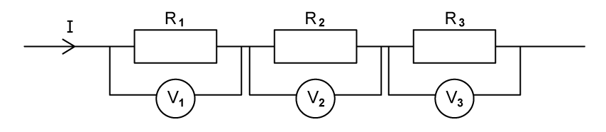{.question-figure fig-alt="Three resistors R1, R2 and R3 connected in series with current I"}

The potential differences across the resistors are $V_1$, $V_2$ and $V_3$. The current in the combination of resistors is $I$.

**(a)** Show that the total resistance $R$ of the combination is given by the equation

$$R=R_1+R_2+R_3.$$

`[3 marks]`

Three resistors are placed in a circuit with a cell of 10 V and negligible internal resistance and two switches $S_1$ and $S_2$. This is shown in Fig. 1.1.

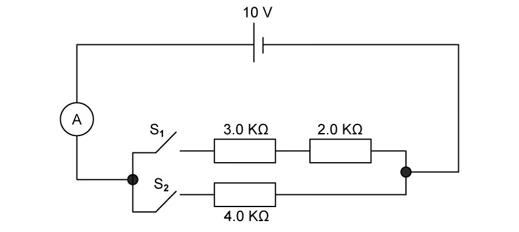{.question-figure fig-alt="A 10 V cell with two switches S1 and S2 and three resistors of 3.0, 2.0 and 4.0 k ohm"}

**(b)** Complete Table 1.1.

| Position of switches |  | Total resistance / kΩ |
|---|---|---|
| $S_1$ | $S_2$ |  |
| open | closed |  |
| closed | open |  |
| closed | closed |  |

`[3 marks]`

The cell has an e.m.f. of 10 V and negligible internal resistance.

**(c)** Calculate the current from the cell when

**(i)** switch $S_1$ is closed; `[1]`

**(ii)** both $S_1$ and $S_2$ are closed. `[1]`

`[2 marks]`

**(d)** Using your answers in part (c), determine the current from the cell if just switch $S_2$ is closed. `[3 marks]`

Show mark scheme / model answer

- **(a)** The total p.d. $V$ is the sum of the p.d.s across each resistor: $V=V_1+V_2+V_3$. `[1]` Using Ohm's law: $IR=IR_1+IR_2+IR_3$. `[1]` Dividing by $I$: $R=R_1+R_2+R_3$. `[1]`
- **(b)** open/closed: 4.0 kΩ; `[1]` closed/open: 5.0 kΩ; `[1]` closed/closed: 2.2 kΩ. `[1]`
- **(c)(i)** With only $S_1$ closed, $R=5.0\ \mathrm{k\Omega}$, so $I=V/R=10/5000=2.0\times10^{-3}\ \mathrm{A}$ (2 mA). `[1]`
- **(c)(ii)** With both switches closed, $R=2.2\ \mathrm{k\Omega}$, so $I=10/2200=4.5\times10^{-3}\ \mathrm{A}$ (4.5 mA). `[1]`
- **(d)** By Kirchhoff's first law, the total current equals the sum of the branch currents: $I=I_1+I_2$. `[1]` $I_2=I-I_1=(4.5-2.0)\times10^{-3}$. `[1]` $I_2=2.5\times10^{-3}\ \mathrm{A}$ (2.5 mA). `[1]`

`[Total: 11 marks]`

:::

::: {.question-card}
#### Example 2 · 10.1 SQ Easy Q2

**(a)** Explain why the electromotive force (e.m.f.) of a cell with internal resistance may be more than the terminal potential difference (p.d.) of the cell. `[2 marks]`

**(b)** Compare the definitions of e.m.f. and p.d. `[3 marks]`

**(c)** For a cell, explain the term internal resistance. `[1 mark]`

A battery of e.m.f. 1508 V and internal resistance $r$ is connected to a resistor A, as shown in Fig. 1.1.

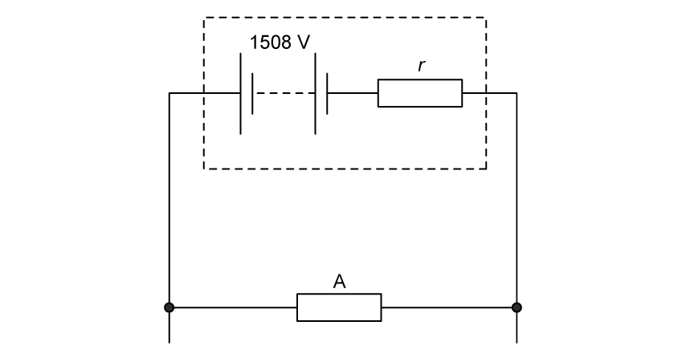{.question-figure fig-alt="A battery of e.m.f. 1508 V and internal resistance r connected to a resistor A"}

The current in resistor A is 400 mA and the power dissipated by it is 600 W.

**(d)** Calculate $r$ of the battery. `[3 marks]`

Show mark scheme / model answer

- **(a)** There are lost volts within the cell, or energy is used / spent on the internal resistance. `[1]` This happens when the cell supplies a current. `[1]`
- **(b)** E.m.f. is the transfer of chemical energy into electrical energy. `[1]` p.d. is the transfer of electrical energy into other (thermal) forms. `[1]` Both are energy per unit charge. `[1]`
- **(c)** Internal resistance is the resistance of a cell causing a loss of voltage / energy loss. `[1]`
- **(d)** $P=VI$, so $V=P/I=600/0.4=1500\ \mathrm{V}$. `[1]` From $E=V+Ir$: $r=(E-V)/I$. `[1]` $r=(1508-1500)/0.4=20\ \Omega$. `[1]`

`[Total: 9 marks]`

:::

::: {.question-card}
#### Example 3 · 10.1 SQ Easy Q3

**(a)** State Kirchhoff's first law. `[1]`

**(ii)** State the quantity that is conserved by this law. `[1]`

`[2 marks]`

**(b)** State Kirchhoff's second law. `[1]`

**(ii)** State the quantity that is conserved by this law. `[1]`

`[2 marks]`

Fig. 1.1 shows a list of circuit components.

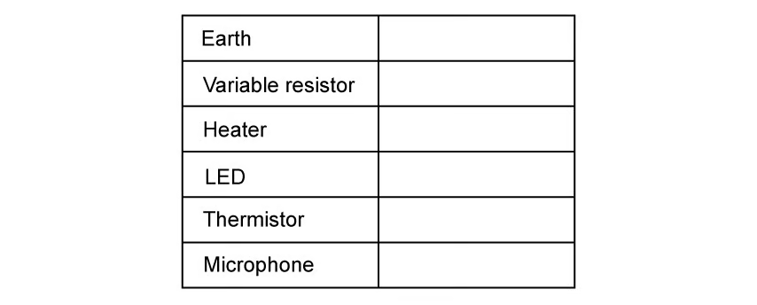{.question-figure fig-alt="A list of circuit components: Earth, Variable resistor, Heater, LED, Thermistor and Microphone"}

**(c)** In the right-hand column, sketch the circuit symbol for the component in the left-hand column of Fig. 1.1. `[6 marks]`

Two cells of e.m.f. $E_1$ and $E_2$ of negligible internal resistance are connected to resistors R in a circuit shown in Fig. 1.2.

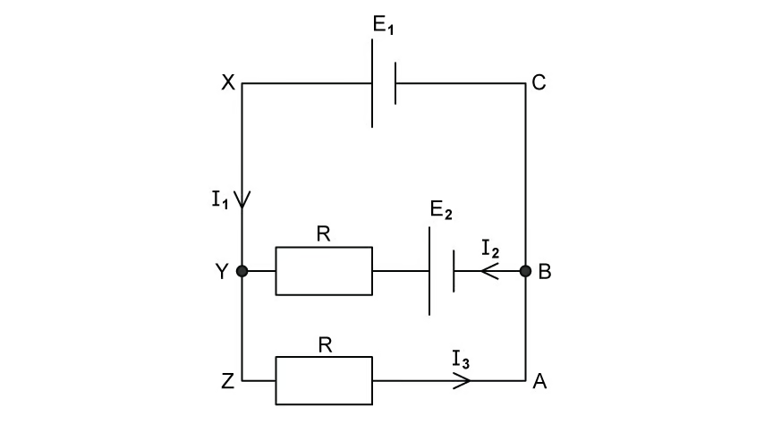{.question-figure fig-alt="Two cells E1 and E2 connected to resistors R in a circuit with currents I1, I2 and I3"}

**(d)** Use Kirchhoff's laws to state the relation between

**(i)** $I_1$, $I_2$ and $I_3$; `[1]`

**(ii)** $E_1$, R, $I_3$ and $I_1$ in loop YZABY. `[1]`

`[2 marks]`

Show mark scheme / model answer

- **(a)(i)** The sum of the currents into a junction equals the sum of the currents out of the junction. `[1]`
- **(a)(ii)** Charge is conserved. `[1]`
- **(b)(i)** The sum of the e.m.f.s around a loop equals the sum of the p.d.s around the loop. `[1]`
- **(b)(ii)** Energy is conserved. `[1]`
- **(c)** One mark for each correct circuit symbol (Earth, variable resistor, heater, LED, thermistor, microphone). `[6]`
- **(d)(i)** $I_1+I_2=I_3$. `[1]`
- **(d)(ii)** $E_1=I_3R+I_1R$. `[1]`

`[Total: 12 marks]`

:::

### 10.1 DC Practical Circuits & Kirchhoff's Laws - Medium

::: {.question-card}
#### Example 4 · 10.1 SQ Medium Q1

Three resistors of resistances $R_1$, $R_2$ and $R_3$ are connected as shown in Fig. 1.1.

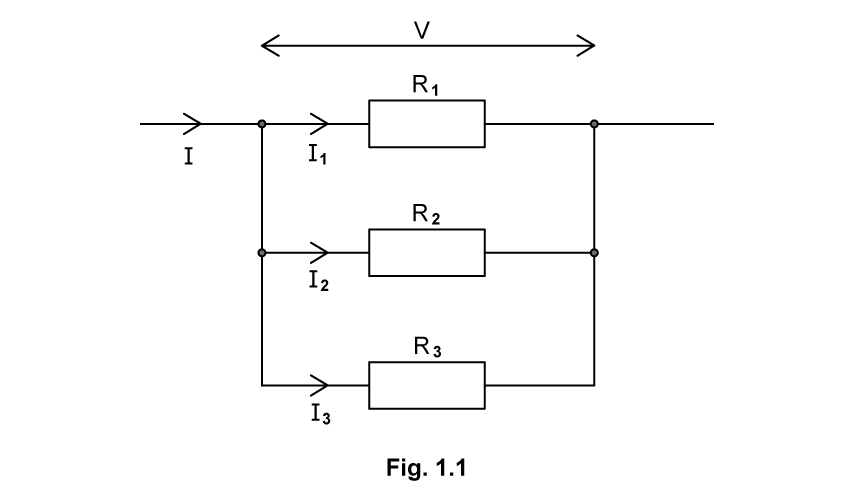{.question-figure fig-alt="Three resistors R1, R2 and R3 connected in parallel"}

The currents in the resistors are $I_1$, $I_2$ and $I_3$. The total current in the combination of resistors is $I$ and the potential difference across the combination is $V$.

**(a)** Show that the total resistance $R$ of the combination is given by the equation

$$\frac{1}{R}=\frac{1}{R_1}+\frac{1}{R_2}+\frac{1}{R_3}.$$

`[2 marks]`

A battery of electromotive force (e.m.f.) 6.0 V and internal resistance $r$ is connected to an external resistor of resistance 12 Ω and a thermistor, as shown in Fig. 1.2.

{.question-figure fig-alt="A 6.0 V battery with internal resistance r connected to a 12 ohm resistor and a thermistor X"}

**(b)** The combined resistance of the external resistor and thermistor X connected in parallel is 4.8 Ω.

Calculate the resistance of X.

resistance = ____________ `[3]`

**(c)** A charge of 2.5 kC passes through the battery.

Calculate:

**(i)** the total energy transferred by the battery;

energy = ____________ `[2]`

**(ii)** the number of electrons that pass through the battery.

number = ____________ `[1]`

`[3 marks]`

**(d)** The temperature of the thermistor is now decreased.

State and explain the effect, if any, of this temperature change on the total power produced by the battery. `[3 marks]`

Show mark scheme / model answer

- **(a)** The total current is the sum of the currents: $I=I_1+I_2+I_3$. `[1]` Using $I=V/R$: $\frac{V}{R}=\frac{V}{R_1}+\frac{V}{R_2}+\frac{V}{R_3}$, so $\frac{1}{R}=\frac{1}{R_1}+\frac{1}{R_2}+\frac{1}{R_3}$. `[1]`
- **(b)** $\frac{1}{4.8}=\frac{1}{12}+\frac{1}{R_X}$. `[1]` $\frac{1}{R_X}=\frac{1}{4.8}-\frac{1}{12}=\frac{1}{8}$. `[1]` $R_X=8\ \Omega$. `[1]`
- **(c)(i)** $W=VQ=6\times2.5\times10^3$. `[1]` $W=1.5\times10^4\ \mathrm{J}$. `[1]$
- **(c)(ii)** Number of electrons $=Q/e=2.5\times10^3/(1.6\times10^{-19})$. `[1]` $=1.6\times10^{22}$. `[1]`
- **(d)** When the temperature decreases, the thermistor resistance increases. `[1]` The total circuit resistance increases, so the total current decreases. `[1]` Since $P=VI$ and $V$ is constant, the total power decreases. `[1]`

`[Total: 11 marks]`

:::

::: {.question-card}
#### Example 5 · 10.1 SQ Medium Q2

**(a)** Explain why the terminal potential difference (p.d.) of a cell with internal resistance may differ from the electromotive force (e.m.f.) of the cell. `[3 marks]`

A battery of e.m.f. 6.2 V and internal resistance 7.0 Ω is connected in series with a resistor of resistance 11 Ω, as shown in Fig. 1.1.

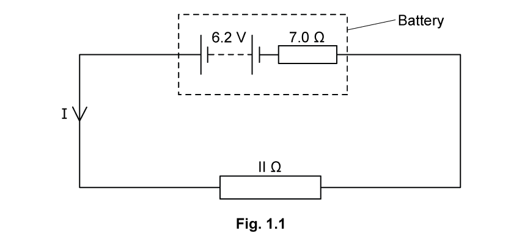{.question-figure fig-alt="A 6.2 V battery with internal resistance 7.0 ohm connected in series with an 11 ohm resistor"}

The current $I$ flows through the circuit.

**(b)** Determine

**(i)** the current $I$ in the circuit; `[2]`

**(ii)** the terminal p.d. of the battery. `[2]`

`[5 marks]`

**(c)** A second identical resistor is added in series with the resistor in Fig. 1.1.

Quantitatively explain the change in the current in the circuit. `[2 marks]`

**(d)** The second 11 Ω resistor is now connected in parallel to the initial 11 Ω resistor in Fig. 1.1.

Qualitatively explain the effect this has on the battery. `[3 marks]`

Show mark scheme / model answer

- **(a)** The terminal p.d. is less than the e.m.f. `[1]` because there are lost volts, or energy is used / dissipated within the cell. `[1]` This is due to the internal resistance when a current is supplied. `[1]`
- **(b)(i)** $E=I(R+r)$. `[1]` $I=6.2/(11+7)=0.34\ \mathrm{A}$. `[1]`
- **(b)(ii)** $V=IR=0.34\times11=3.7\ \mathrm{V}$. `[2]`
- **(c)** The current is halved, decreasing from 0.34 A to 0.17 A. `[1]` because the resistance in the circuit has doubled from 11 Ω to 22 Ω. `[1]`
- **(d)** The battery heats up / gets hotter. `[1]` because the circuit resistance decreases. `[1]` so the current increases. `[1]`

`[Total: 13 marks]`

:::

### 10.2 DC Potential Dividers - Easy

::: {.question-card}
#### Example 6 · 10.2 SQ Easy Q1

**(a)** Sketch the circuit symbols for

**(i)** the potentiometer; `[1]`

**(ii)** the galvanometer. `[1]`

`[2 marks]`

Fig. 1.1 shows a circuit with a potentiometer.

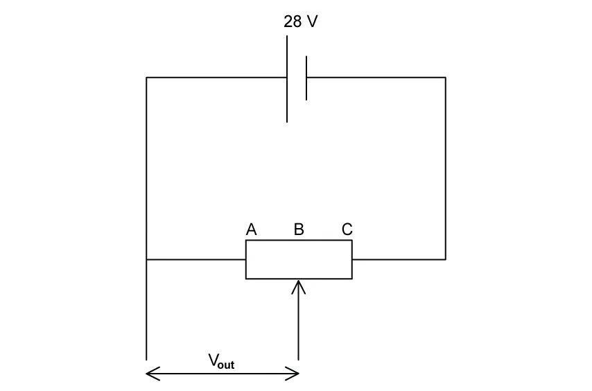{.question-figure fig-alt="A potentiometer with fixed ends A and C connected across a battery with a sliding contact"}

Fixed ends AC are connected across the battery so that there is a full battery voltage across the whole resistor.

**(b)** State the voltage output, $V_{\text{out}}$, when the sliding contact is at

**(i)** A; `[1]`

**(ii)** the midpoint B; `[1]`

**(iii)** C. `[1]`

`[3 marks]`

The resistor is now replaced with a uniform resistance wire connected between ends AC, as shown in Fig. 1.2a. The 28 V cell is replaced with a cell of unknown e.m.f.

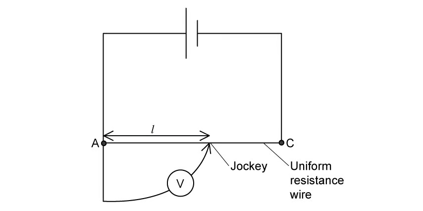{.question-figure fig-alt="A uniform resistance wire between ends A and C with a jockey"}

**(c)** Sketch a graph of Fig. 1.2b to show the voltmeter reading $V$ against length $l$ as the jockey is moved from point A to point C.

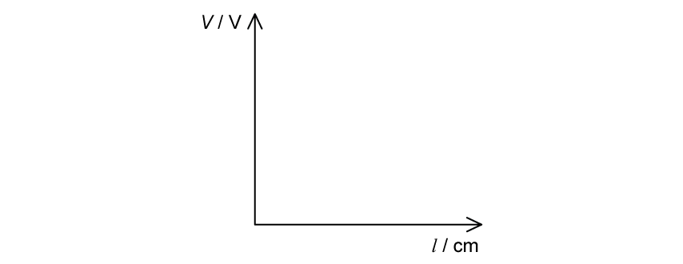{.question-figure fig-alt="Axes labelled V in volts against l in cm"}

`[2 marks]`

A potentiometer can be used to compare e.m.f.s of cells or potential differences.

A test cell is added to the circuit in Fig. 1.2a. A student sets up the circuit shown in Fig. 1.3.

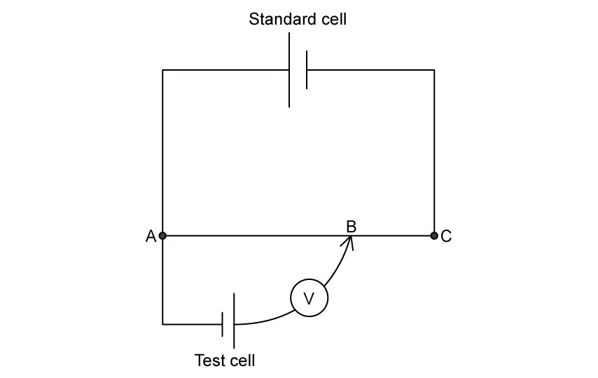{.question-figure fig-alt="A standard cell and a test cell connected to a potentiometer circuit"}

**(d)** State why the student will not be able to find a point where the current is zero. `[1]`

**(ii)** The student fixes the issue from part (i) and achieves a balance point when the length of the wire AB is 25.6 cm.

They repeat the experiment with a standard cell of e.m.f. 1.545 V. The balance point using this cell is 37.2 cm.

Calculate the e.m.f. of the test cell. `[2]`

`[4 marks]`

Show mark scheme / model answer

- **(a)(i)** Correct circuit symbol for a potentiometer (resistor with sliding arrow). `[1]`
- **(a)(ii)** Correct circuit symbol for a galvanometer. `[1]`
- **(b)(i)** 0 V. `[1]`
- **(b)(ii)** 14 V. `[1]`
- **(b)(iii)** 28 V. `[1]`
- **(c)** Straight line with a positive gradient through the origin. `[2]`
- **(d)(i)** The test cell is the wrong way round / the test cell needs to be reversed. `[1]`
- **(d)(ii)** $\frac{E_{\text{test}}}{E_{\text{standard}}}=\frac{l_1}{l_2}$. `[1]` $E_{\text{test}}=1.545\times\frac{25.6}{37.2}=1.06\ \mathrm{V}$. `[1]`

`[Total: 11 marks]`

:::

::: {.question-card}
#### Example 7 · 10.2 SQ Easy Q2

Fig. 1.1 shows a potential divider circuit containing a fixed resistor and thermistor.

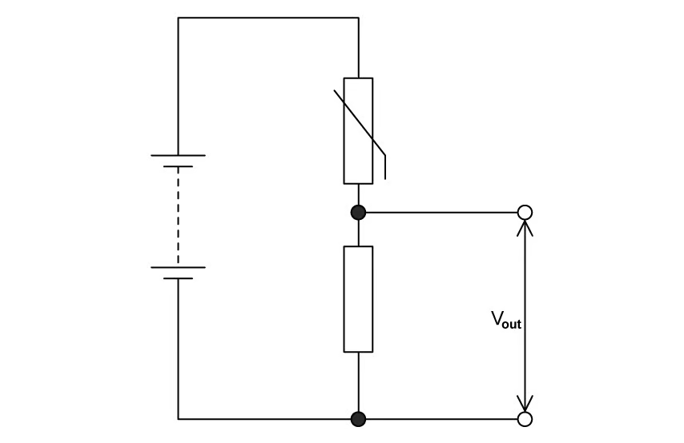{.question-figure fig-alt="A potential divider circuit containing a fixed resistor and a thermistor"}

**(a)** Explain what happens as the temperature increases. `[2 marks]`

The thermistor is now replaced with an LDR and the output voltage is now taken from the LDR, as shown in Fig. 1.2a.

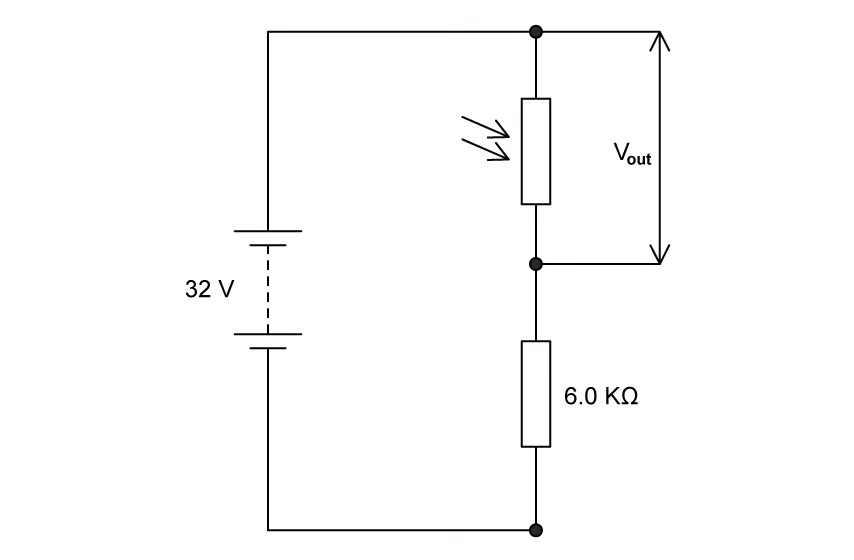{.question-figure fig-alt="A 32 V supply connected to a 6.0 k ohm resistor and an LDR with output voltage Vout"}

**(b)** Using Fig. 1.2b, determine the resistance of the LDR when the light intensity is 120 lux.

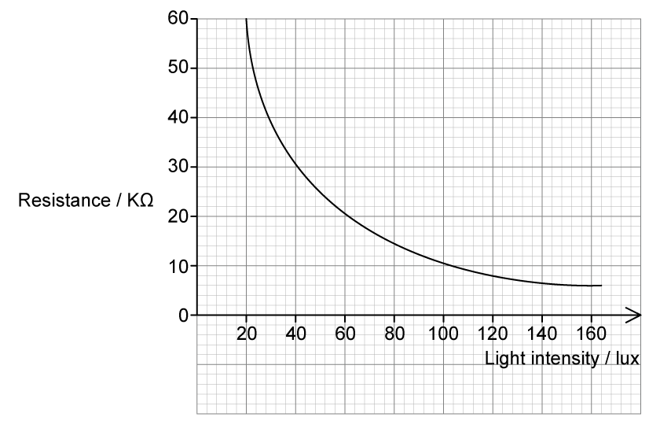{.question-figure fig-alt="A graph of LDR resistance against light intensity"}

resistance = ____________ `[1 mark]`

**(c)** Using your answer to part (b), calculate $V_{\text{out}}$ when the light intensity is 120 lux. `[3 marks]`

**(d)** Using your answer to part (c), determine the voltage across the 6.0 kΩ resistor at a light intensity of 120 lux. `[2 marks]`

Show mark scheme / model answer

- **(a)** The resistance of the thermistor decreases. `[1]` So $V_{\text{out}}$ increases. `[1]`
- **(b)** 8 kΩ (read from the graph at 120 lux). `[1]`
- **(c)** $V_{\text{out}}=V_{\text{in}}\frac{R_{\text{LDR}}}{R_1+R_{\text{LDR}}}$. `[1]` $V_{\text{out}}=32\times\frac{8.0}{6.0+8.0}$. `[1]` $V_{\text{out}}=18\ \mathrm{V}$. `[1]`
- **(d)** $V_{6.0}=V_{\text{in}}-V_{\text{out}}=32-18$. `[1]` $V_{6.0}=14\ \mathrm{V}$. `[1]`

`[Total: 8 marks]`

:::

::: {.question-card}
#### Example 8 · 10.2 SQ Easy Q3

A variable resistor is used to control the circuit shown in Fig. 1.1.

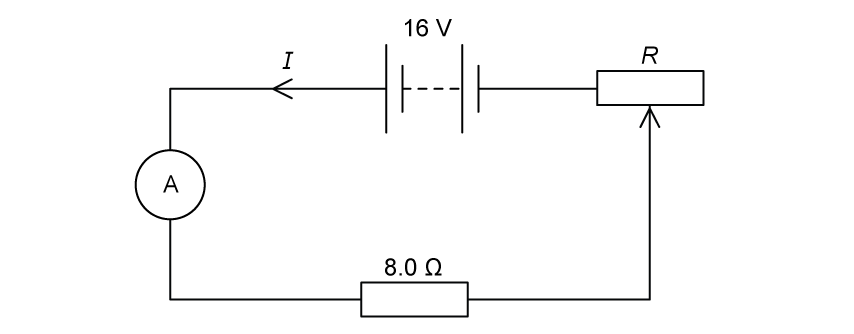{.question-figure fig-alt="A 16 V power supply connected in series with an ammeter, an 8.0 ohm resistor and a variable resistor R"}

The variable resistor is connected in series with a 16 V power supply of negligible internal resistance, an ammeter and an 8.0 Ω resistor.

The resistance R of the variable resistor can be varied between 0 to 12 Ω.

**(a)** Calculate

**(i)** the minimum possible current; `[2]`

**(ii)** the maximum possible current. `[2]`

`[4 marks]`

**(b)** On Fig. 1.2, sketch the variation with R of current $I$ in the circuit.

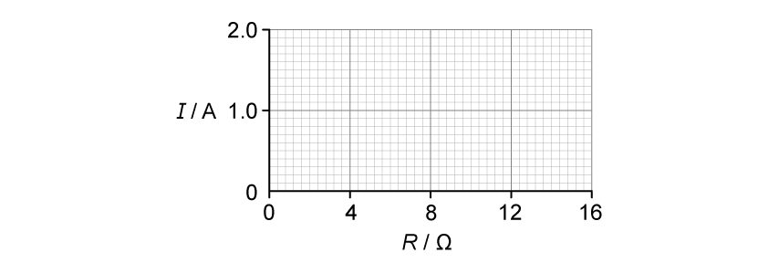{.question-figure fig-alt="Axes labelled current I in amperes against resistance R in ohms"}

`[2 marks]`

**(c)** Galvanometers are used in null methods.

Explain how a galvanometer is used in null methods. `[2 marks]`

Show mark scheme / model answer

- **(a)(i)** Minimum current occurs with maximum resistance: $R_{\max}=8+12=20\ \Omega$. `[1]` $I_{\min}=16/20=0.8\ \mathrm{A}$. `[1]`
- **(a)(ii)** Maximum current occurs with minimum resistance: $R_{\min}=8\ \Omega$. `[1]` $I_{\max}=16/8=2.0\ \mathrm{A}$. `[1]`
- **(b)** The graph starts at $(0,\ 2.0)$ and ends at $(16,\ 0.8)$ with a curve of decreasing gradient. `[2]`
- **(c)** The galvanometer has no deflection. `[1]` when there is no current flow / no potential difference. `[1]`

`[Total: 8 marks]`

:::

### 10.2 DC Potential Dividers - Medium

::: {.question-card}
#### Example 9 · 10.2 SQ Medium Q1

A battery is connected in series with resistors P and Q, as shown in Fig. 1.1.

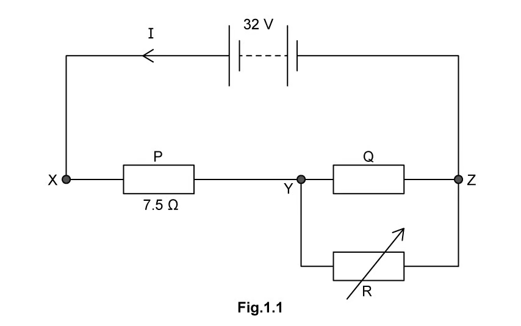{.question-figure fig-alt="A 32 V battery connected in series with resistors P and Q, with a variable resistor R in parallel with Q"}

The resistance of P is 7.5 Ω. The resistance of Q is constant. A variable resistor of resistance R is connected in parallel with Q.

The current $I$ from the battery is changed by varying R from 5 to 20 Ω. The variation with R of I is shown in Fig. 1.2.

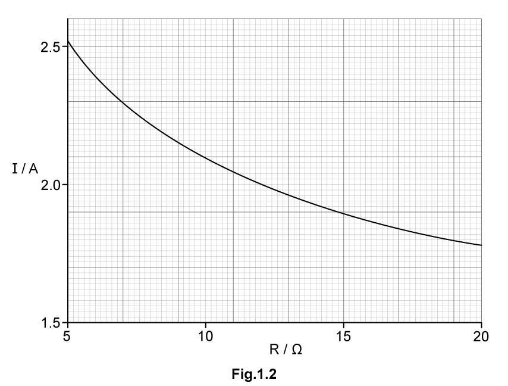{.question-figure fig-alt="A graph of current I against resistance R, decreasing from about 2.5 A at R = 5 ohm to about 1.8 A at R = 20 ohm"}

**(a)** Use Fig. 1.2 to state and explain the variation of the p.d. across resistor P as R is decreased. Numerical values are not required. `[2 marks]`

**(b)** For R = 7.0 Ω, calculate the p.d. between points Y and Z. `[2 marks]`

**(c)** Show that the resistance of Q is 9.5 Ω. `[3 marks]`

**(d)** State and explain qualitatively how the power provided by the battery changes as the resistance R is decreased. `[1 mark]`

Show mark scheme / model answer

- **(a)** As R decreases, the current $I$ increases. `[1]` so the p.d. across P (given by $V_P=IR_P$) increases. `[1]`
- **(b)** From the graph, $I=2.3\ \mathrm{A}$ at R = 7.0 Ω. `[1]` P.d. across YZ $=32-(2.3\times7.5)=14.75\approx15\ \mathrm{V}$. `[1]`
- **(c)** Resistance of the Q–R parallel combination $R_{QR}=15/2.3=6.52\ \Omega$. `[1]` $\frac{1}{R_{QR}}=\frac{1}{R_Q}+\frac{1}{R}$. `[1]` $\frac{1}{R_Q}=\frac{1}{6.52}-\frac{1}{7.0}$, so $R_Q=9.5\ \Omega$. `[1]`
- **(d)** The power increases. `[1]` because the current increases while the e.m.f. is constant ($P=VI$).

`[Total: 8 marks]`

:::

::: {.question-card}
#### Example 10 · 10.2 SQ Medium Q2

Fig. 1.1 shows a potential divider circuit with a battery of electromotive force (e.m.f.) 24.0 V connected to two resistors $R_1$ and $R_2$.

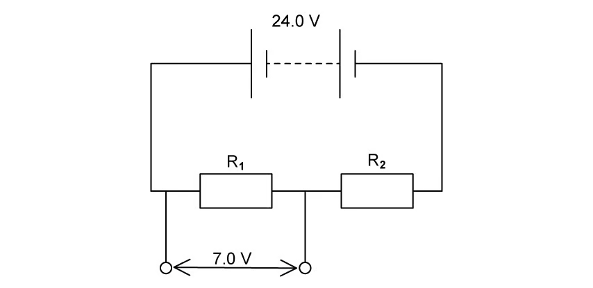{.question-figure fig-alt="A 24.0 V battery connected to two resistors R1 and R2 in series"}

**(a)** When the resistance of $R_1$ is 6.5 Ω, the voltage across it is 7.0 V.

Show that the resistance of $R_2$ is 16 Ω. `[2 marks]`

The resistors are replaced with identical filament lamps A and B and the battery is connected in parallel to a linear potentiometer XY, as shown in Fig. 1.2.

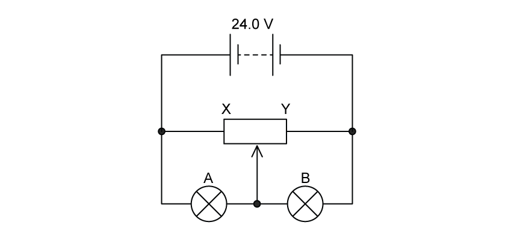{.question-figure fig-alt="A 24.0 V battery connected to a linear potentiometer XY and two filament lamps A and B"}

The lamps each have the same I–V characteristic shown in Fig. 1.3.

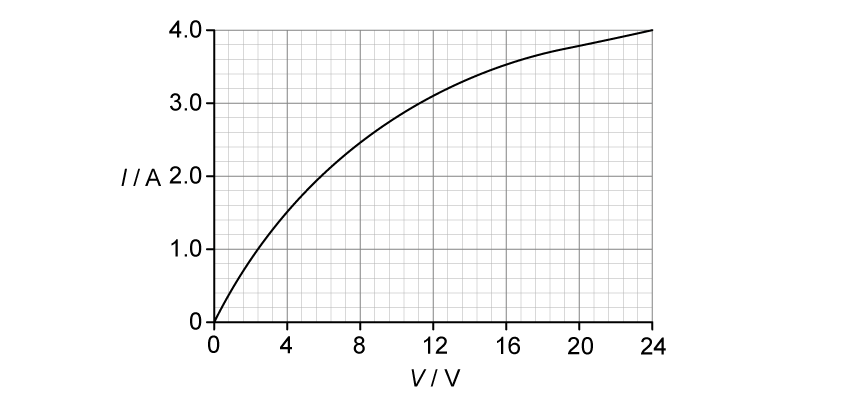{.question-figure fig-alt="An I-V graph for a filament lamp, rising to about 3.1 A at 12 V and 4.0 A at 24 V"}

When the slider of the potentiometer is at its midpoint, as shown in Fig. 1.2, the current $I$ in the battery is 4.12 A.

**(b)** Determine the current in lamp B. `[1 mark]`

**(c)** Calculate the total resistance in the circuit. `[3 marks]`

**(d)** The slider of the potentiometer in (c) is moved to end X.

State and explain the effect on the current of lamps A and B. `[2 marks]`

Show mark scheme / model answer

- **(a)** $V_{\text{out}}=V_{\text{in}}\frac{R_1}{R_1+R_2}$. `[1]` $7.0=24.0\times\frac{6.5}{6.5+R_2}$, giving $R_2=15.8\approx16\ \Omega$. `[1]`
- **(b)** With the slider at the midpoint, each lamp has a p.d. of 12 V. From the graph, the current in lamp B is 3.10 A. `[1]`
- **(c)** Current through XY: $I_{XY}=4.12-3.10=1.02\ \mathrm{A}$. `[1]` $R_{XY}=24.0/1.02=23.5\ \Omega$; each lamp has $R=12/3.10=3.87\ \Omega$. `[1]` Combined resistance $R_T=\frac{1}{\frac{1}{7.74}+\frac{1}{23.5}}=5.8\ \Omega$. `[1]`
- **(d)** For lamp A, the p.d. decreases to zero, so its current is 0. `[1]` For lamp B, the p.d. increases to 24.0 V, so its current is 4.0 A (read from the graph). `[1]`

`[Total: 8 marks]`

:::
