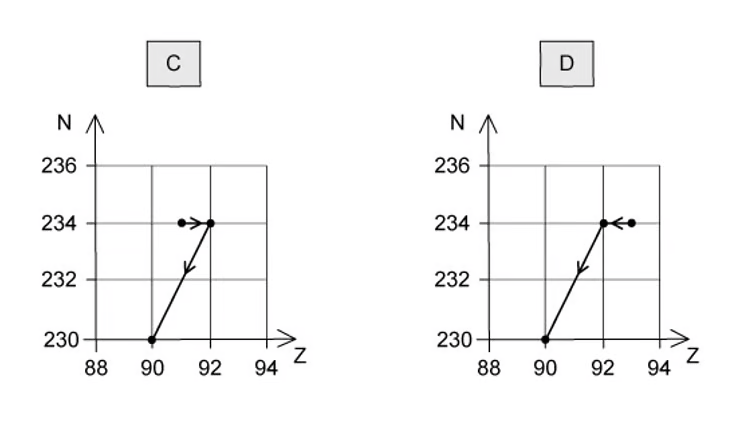
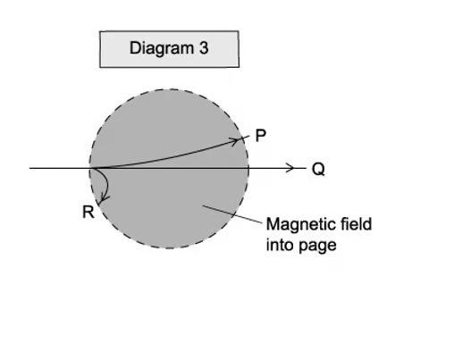
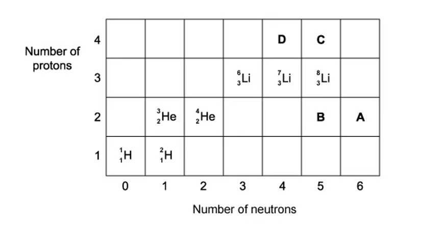
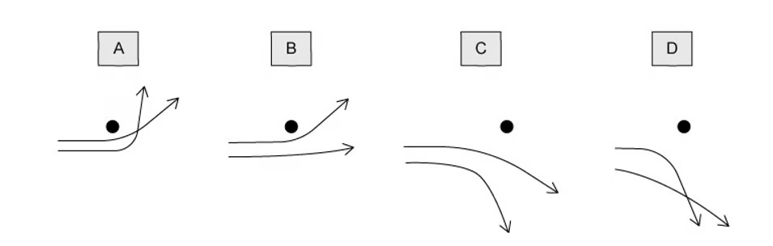
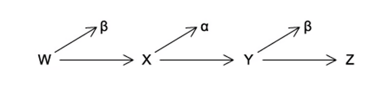
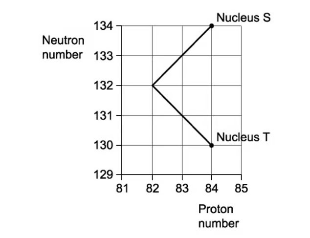
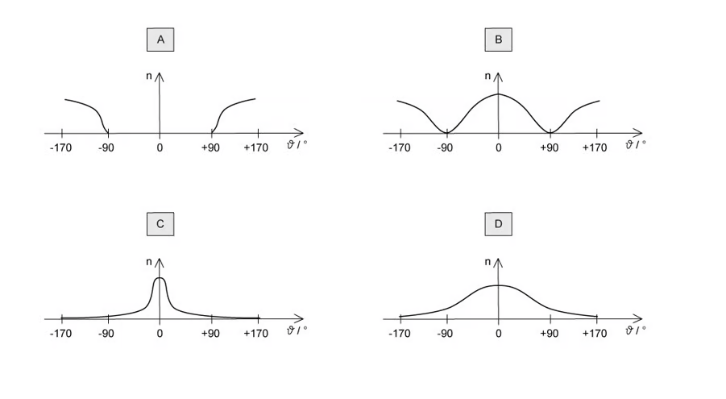

### 11.1 Atoms, Nuclei & Radiation - Easy

::: {.question-card}
#### Example 1 · 11.1 MC Easy Q3

New insights were discovered when α-particles were fired at a sheet of gold foil.

Which conclusion can be drawn from the results of the experiment?

A. the atomic nucleus contains protons and neutrons

B. electrons orbit the atomic nucleus

C. some atoms of the same element contain different numbers of neutrons

D. atomic nuclei occupy a very small fraction of the volume of an atom

Show answer and explanation

**Answer: D.** Most α-particles passed straight through the gold foil with little or no deflection, showing that the atom is mostly empty space and that the nucleus occupies only a very small fraction of the atom's volume.

:::

::: {.question-card}
#### Example 2 · 11.1 MC Easy Q5

The atom ${}^{133}_{55}\text{Cs}$ is a neutral atom.

How many protons, neutrons and electrons are in this atom?

|  | Protons | Neutrons | Electrons |
|---|---|---|---|
| A | 133 | 55 | 133 |
| B | 55 | 78 | 55 |
| C | 78 | 55 | 78 |
| D | 55 | 133 | 55 |

Show answer and explanation

**Answer: B.** The proton number is 55 (bottom left) and the nucleon number is 133 (top left). The number of neutrons is $133-55=78$. A neutral atom has 55 electrons.

:::

::: {.question-card}
#### Example 3 · 11.1 MC Easy Q8

When an α-particle is produced by ${}^{238}_{92}\text{U}$, it produces a new atom X.

What are the values of the proton number and nucleon number for atom X?

|  | Protons | Nucleons |
|---|---|---|
| A | 92 | 256 |
| B | 90 | 254 |
| C | 92 | 250 |
| D | 88 | 284 |

Show answer and explanation

**Answer: B.** During α-decay the proton number decreases by 2 and the nucleon number decreases by 4: $Z=92-2=90$ and $A=238-4=234$ (the option shows the neutron number added to the proton number incorrectly in places; the correct nuclide is ${}^{234}_{90}\text{Th}$).

:::

::: {.question-card}
#### Example 4 · 11.1 MC Easy Q9

A nucleus Q decays into a nucleus R by emitting an alpha particle followed by two beta particles.

Which statement about this nuclear decay is correct?

A. nucleus R is an isotope of nucleus Q

B. nucleus R has the same nucleon number as nucleus Q

C. beta particle decay occurs when a proton changes into a neutron

D. the total mass of the products is equal to the mass of the initial nucleus Q

Show answer and explanation

**Answer: A.** The α-particle reduces the proton number by 2, and the two β⁻ decays each increase the proton number by 1, so the final proton number is the same as Q. The nucleon number has decreased by 4, so R is an isotope of Q.

:::

::: {.question-card}
#### Example 5 · 11.1 MC Easy Q12

Plutonium-239 (${}^{239}_{94}\text{Pu}$) decays by emitting α-radiation.

Which nuclide is formed from one of these decay reactions? (The product nuclides are represented by X.)

Show answer and explanation

**Answer: D.** During α-decay the proton number decreases by 2 and the nucleon number decreases by 4: $A=239-4=235$ and $Z=94-2=92$, giving ${}^{235}_{92}\text{U}$.

:::

### 11.1 Atoms, Nuclei & Radiation - Medium

::: {.question-card}
#### Example 6 · 11.1 MC Medium Q1

A radioactive nucleus is formed by β⁻-decay. This nucleus then decays by α-emission.

The graphs below show the nucleon number $N$ plotted against proton number $Z$. Which one shows the β⁻-decay followed by the α-emission?

{.question-figure fig-alt="Two graphs of nucleon number N against proton number Z labelled A and B"}

{.question-figure fig-alt="Two graphs of nucleon number N against proton number Z labelled C and D"}

Show answer and explanation

**Answer: C.** In β⁻-decay the nucleon number stays the same while the proton number increases by 1 (a horizontal move right). In α-emission the nucleon number decreases by 4 and the proton number by 2 (a diagonal move down-left). Only graph C shows this sequence.

:::

::: {.question-card}
#### Example 7 · 11.1 MC Medium Q4

The isotope ${}^{222}_{86}\text{Rn}$ decays in a sequence of emissions to form the isotope ${}^{206}_{82}\text{Pb}$.

It will either emit an α-particle or a β-particle at each stage of the decay sequence.

What is the number of stages in the decay sequence?

A. 20

B. 16

C. 8

D. 4

Show answer and explanation

**Answer: C.** The nucleon number decreases by $222-206=16$, which requires 4 α-particles (each reducing A by 4). These 4 α-particles would reduce Z by 8, but the proton number only decreases by 4, so 4 β-particles must also be emitted. Total stages $=4+4=8$.

:::

::: {.question-card}
#### Example 8 · 11.1 MC Medium Q6

Alpha, beta and gamma radiations:

1. are absorbed to different extents in solids;
2. behave differently in an electric field;
3. behave differently in a magnetic field.

Diagrams 1, 2 and 3 illustrate these behaviours.

{.question-figure fig-alt="Diagram 1 showing absorption by paper, aluminium and lead; Diagram 2 showing behaviour in an electric field"}

{.question-figure fig-alt="Diagram 3 showing behaviour in a magnetic field into the page"}

Which three labels on these diagrams refer to the same kind of radiation?

A. X, L, R

B. W, L, R

C. W, L, P

D. Y, M, P

Show answer and explanation

**Answer: A.** In diagram 1, W is alpha (stopped by paper), X is beta (stopped by a few mm of aluminium) and Y is gamma (reduced by lead). In diagram 2, L is beta (attracted to the positive plate) and in diagram 3, R is beta (deflected by the magnetic field). So X, L and R all refer to beta radiation.

:::

::: {.question-card}
#### Example 9 · 11.1 MC Medium Q7

The nuclides shown in the grid below are arranged according to the number of protons and neutrons in each.

A nucleus of the nuclide ${}^{6}_{3}\text{Li}$ decays by emitting a β⁻-particle.

What is the resulting nuclide?

{.question-figure fig-alt="A grid of nuclides arranged by number of protons and neutrons"}

Show answer and explanation

**Answer: D.** In β⁻-decay a neutron changes into a proton, so the proton number increases by 1 and the neutron number decreases by 1 while the nucleon number stays the same. ${}^{6}_{3}\text{Li}$ has 3 protons and 3 neutrons; the daughter has 4 protons and 2 neutrons, which is the nuclide marked D on the grid.

:::

::: {.question-card}
#### Example 10 · 11.1 MC Medium Q8

A thorium isotope has a nucleon number of 232 and a proton number of 90. It decays to form another isotope with a nucleon number of 228.

How many alpha particles and beta particles are emitted during this decay?

|  | Alpha particles | Beta particles |
|---|---|---|
| A | 0 | 4 |
| B | 1 | 2 |
| C | 1 | 1 |
| D | 2 | 1 |

Show answer and explanation

**Answer: B.** The nucleon number decreases by $232-228=4$, so one α-particle is emitted. This would reduce the proton number by 2 (from 90 to 88), but the daughter is still thorium (Z = 90), so two β⁻ particles must also be emitted to increase Z back to 90.

:::

::: {.question-card}
#### Example 11 · 11.1 MC Medium Q9

Two α-particles with equal energies are deflected by a gold nucleus.

Which diagram best represents their paths?

{.question-figure fig-alt="Four diagrams showing the paths of two alpha particles near a gold nucleus"}

Show answer and explanation

**Answer: D.** The gold nucleus is positively charged and repels the positively charged α-particles. The closer a particle comes, the stronger the repulsive force and the greater the deflection, so the paths curve away from the nucleus and do not stay parallel.

:::

::: {.question-card}
#### Example 12 · 11.1 MC Medium Q10

Three successive radioactive decays are shown in the diagram below; each one results in a particle being emitted.

The first decay results in the emission of a β⁻-particle. The second decay results in the emission of an α-particle. The third decay results in the emission of another β⁻-particle.

{.question-figure fig-alt="A chain of nuclides W, X, Y and Z with arrows between them"}

Nuclides W and Z are compared. Which statement is correct?

A. W and Z are isotopes of the same element

B. Z is a different element of reduced mass

C. Z is a different element of lower atomic number

D. W and Z are identical in all respects

Show answer and explanation

**Answer: A.** The β⁻-decay increases Z by 1, the α-decay decreases Z by 2, and the final β⁻-decay increases Z by 1, so the final proton number equals the original. The nucleon number decreases by 4. W and Z therefore have the same proton number but different nucleon numbers – they are isotopes.

:::

::: {.question-card}
#### Example 13 · 11.1 MC Medium Q12

A sequence of radioactive decays is shown in the graph of neutron number against proton number.

Nucleus S is at the start of the sequence and, after the decays have occurred, nucleus T is formed.

{.question-figure fig-alt="A graph of neutron number against proton number showing nucleus S moving to nucleus T"}

What is emitted during the sequence of decays?

A. one α-particle followed by one β-particle

B. two β-particles followed by one α-particle

C. two α-particles followed by two β-particles

D. one α-particle followed by two β-particles

Show answer and explanation

**Answer: D.** From the graph, S has $A=134$ and $Z=83$; T has $A=130$ and $Z=82$. The nucleon number falls by 4 (one α) and the proton number falls by 1. The α-particle reduces Z by 2, so two β⁻ particles are needed to increase Z back by 2, giving a net fall of 1.

:::

::: {.question-card}
#### Example 14 · 11.1 MC Medium Q13

A radioactive substance with a nucleon number of 234 and a proton number of 90 decays by β⁻-emission into a daughter product, which in turn decays by further emission into a granddaughter product.

Which letter in the diagram represents the granddaughter product?

{.question-figure fig-alt="A graph of proton number against nucleon number with points A, B, C and D"}

Show answer and explanation

**Answer: C.** The original nucleus has $A=234$, $Z=90$. After β⁻-decay the daughter has $A=234$, $Z=91$. After a further β⁻-decay the granddaughter has $A=234$, $Z=92$, which is point C on the graph.

:::

::: {.question-card}
#### Example 15 · 11.1 MC Medium Q15

An element with an unstable nucleus decays by emitting an alpha particle to become the nucleus of a different element.

The nucleus of the new element is unstable and will emit either an α-particle or a β-particle. This process continues until an isotope of the original element is formed.

What is the minimum possible number of the particles emitted?

A. 5

B. 4

C. 3

D. 2

Show answer and explanation

**Answer: C.** To return to an isotope of the original element, the proton number must return to its original value. One α-particle (Z − 2) followed by two β⁻ particles (Z + 2) gives a net proton-number change of zero, so the minimum number of particles is 3.

:::

### 11.1 Atoms, Nuclei & Radiation - Hard

::: {.question-card}
#### Example 16 · 11.1 MC Hard Q1

In an α-particle scattering experiment, a student set up the apparatus below to determine the number $n$ of α-particles incident per unit time on a detector held at various angles $\theta$.

{.question-figure fig-alt="Apparatus with alpha particles incident on a thin gold foil and a movable detector"}

Which of the following graphs best represents the variation of $n$ with $\theta$?

{.question-figure fig-alt="Four graphs of n against angle theta"}

Show answer and explanation

**Answer: C.** Most α-particles pass straight through (large $n$ at small angles), the count drops quickly with angle, and only very few particles are detected at large angles (above 90°). Graph C matches this.

:::

::: {.question-card}
#### Example 17 · 11.1 MC Hard Q2

A stationary nucleus of polonium-210 decays by α-emission and has a total kinetic energy of $E_\text{K}$.

$${}^{210}_{84}\text{Po} \rightarrow {}^{206}_{82}\text{Pb} + \alpha$$

What is the kinetic energy of the daughter nucleus ${}^{206}_{82}\text{Pb}$?

A. 0

B. between 0 and $\dfrac{E_\text{K}}{2}$

C. between $\dfrac{E_\text{K}}{2}$ and $E_\text{K}$

D. $E_\text{K}$

Show answer and explanation

**Answer: B.** By conservation of momentum, the two products share the kinetic energy in inverse proportion to their masses: $\frac{E_\text{Pb}}{E_\alpha}=\frac{4}{206}$. So $E_\text{Pb}$ is a small fraction of the total, between 0 and $E_\text{K}/2$.

:::

::: {.question-card}
#### Example 18 · 11.1 MC Hard Q3

Which of the following equations correctly shows an α-particle causing a nuclear reaction?

A. ${}^{14}_{7}\text{N} + {}^{4}_{2}\text{He} \rightarrow {}^{17}_{8}\text{O} + {}^{1}_{1}\text{H}$

B. ${}^{14}_{7}\text{N} + {}^{4}_{2}\text{He} \rightarrow {}^{17}_{8}\text{O} + {}^{1}_{0}\text{n}$

C. ${}^{14}_{7}\text{N} + {}^{1}_{1}\text{H} \rightarrow {}^{14}_{6}\text{C} + {}^{4}_{2}\text{He}$

D. ${}^{14}_{7}\text{N} + {}^{1}_{1}\text{H} \rightarrow {}^{11}_{5}\text{B} + {}^{4}_{2}\text{He}$

Show answer and explanation

**Answer: B.** An α-particle is a helium nucleus ${}^{4}_{2}\text{He}$ and must appear on the left as a reactant. Option A uses the wrong symbol for the neutron; option B is correct: $14+4=17+1$ and $7+2=8+1$.

:::

::: {.question-card}
#### Example 19 · 11.1 MC Hard Q4

Thorium ${}^{232}_{90}\text{Th}$ decays through a series of transformations. The particles emitted in successive transformations are

$$\alpha,\ \beta,\ \beta,\ \alpha.$$

The resulting nuclide may be represented by

Show answer and explanation

**Answer: D.** Two α-particles reduce the nucleon number by 8 (232 → 224) and the proton number by 4 (90 → 86). Two β⁻ particles increase the proton number by 2 (86 → 88). The final nuclide is ${}^{224}_{88}\text{Ra}$.

:::

### 11.2 Fundamental Particles - Hard

::: {.question-card}
#### Example 20 · 11.2 MC Hard Q1

Quarks are thought to make up protons and neutrons.

The 'up' quark has a charge of $+\frac{2}{3}e$ and the 'down' quark has a charge of $-\frac{1}{3}e$, where $e$ is the elementary charge ($+1.6\times10^{-19}\ \mathrm{C}$).

How many up quarks and down quarks must a proton contain?

|  | Up quarks | Down quarks |
|---|---|---|
| A | 0 | 3 |
| B | 2 | 1 |
| C | 1 | 2 |
| D | 1 | 1 |

Show answer and explanation

**Answer: B.** A proton has quark composition uud: two up quarks and one down quark, giving charge $\frac{2}{3}+\frac{2}{3}-\frac{1}{3}=+e$.

:::
