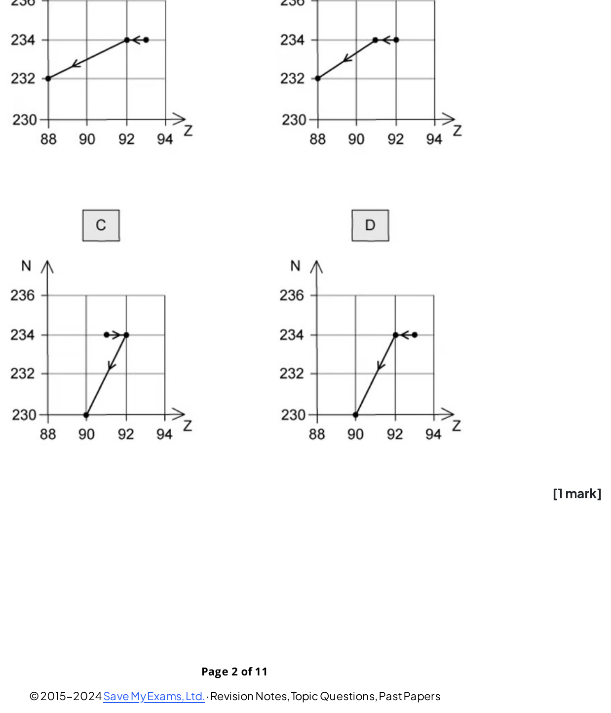
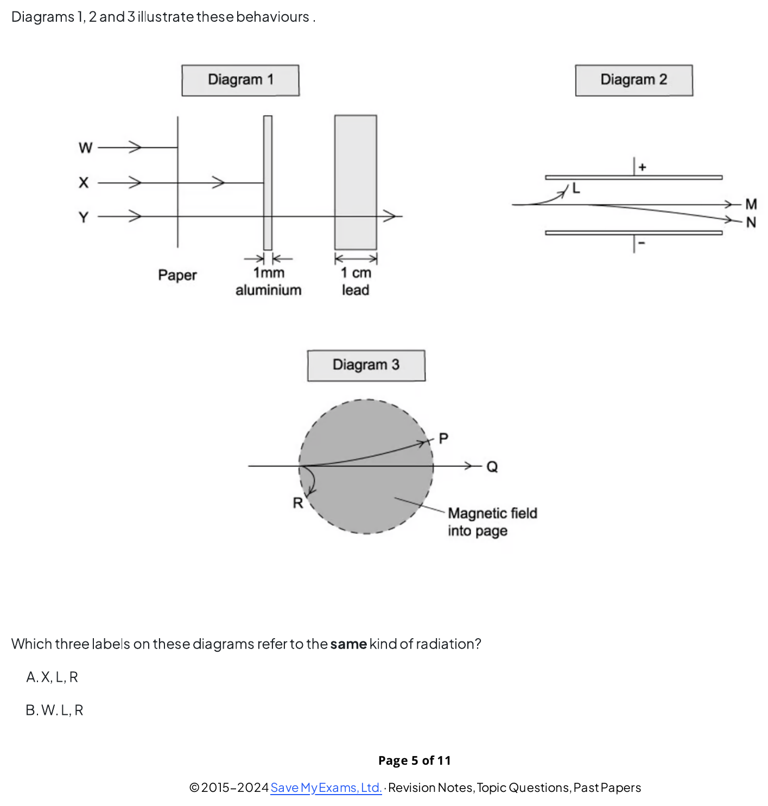
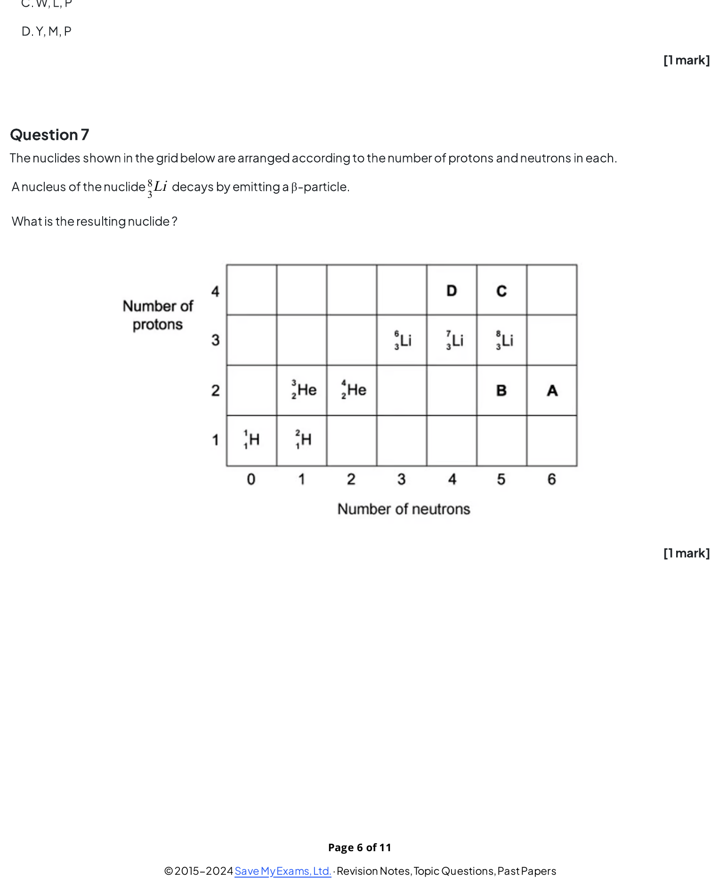
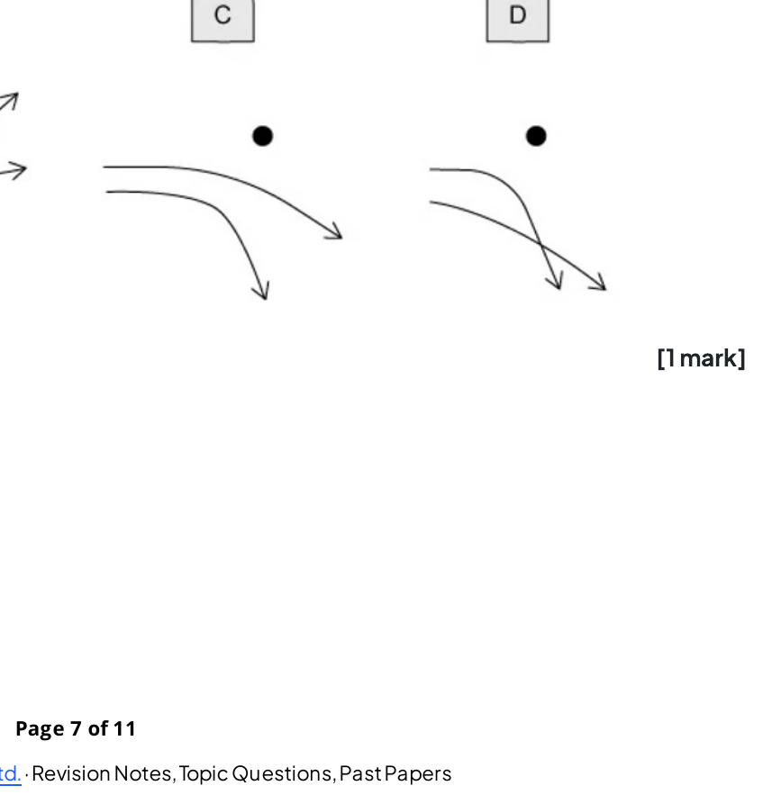
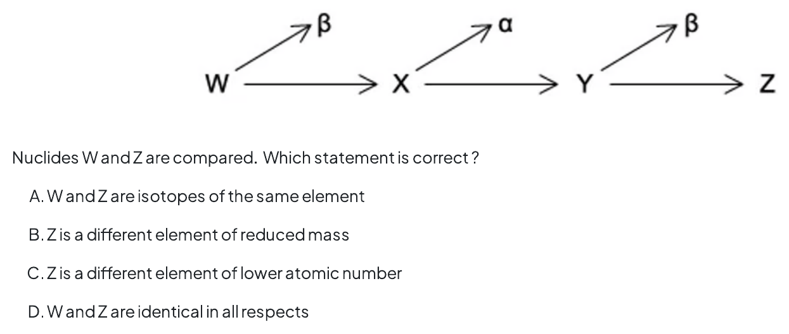
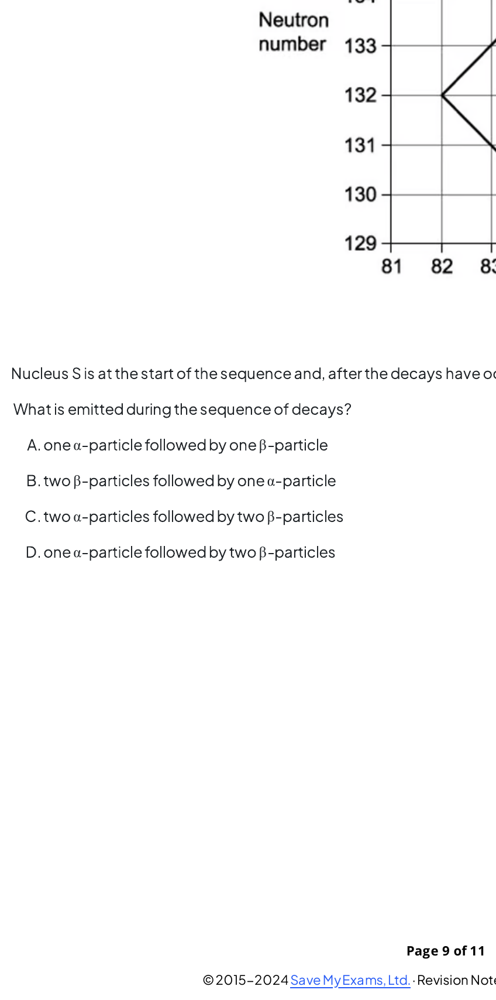
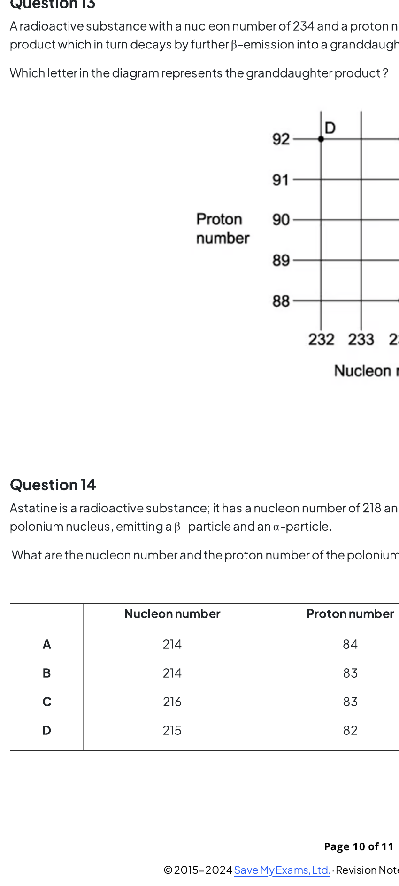
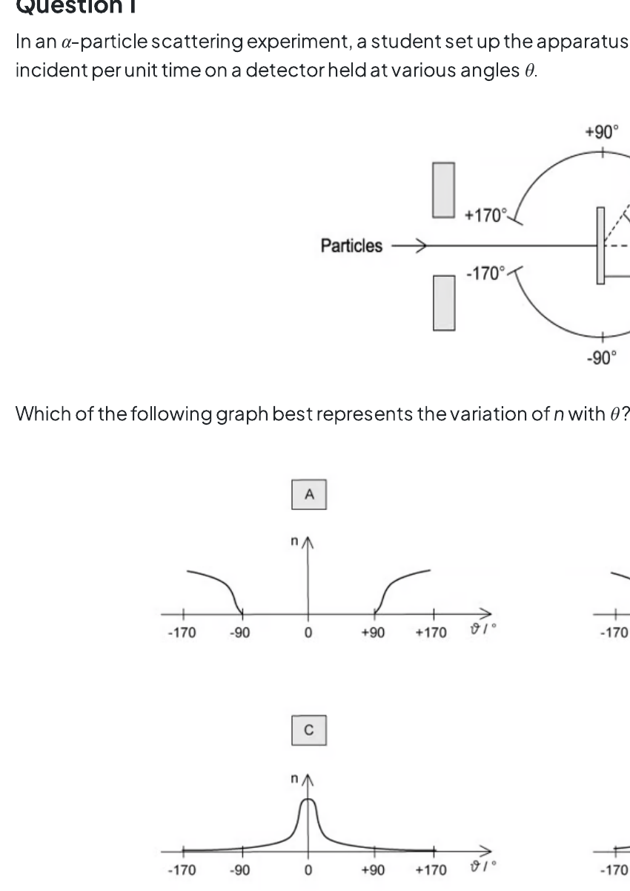
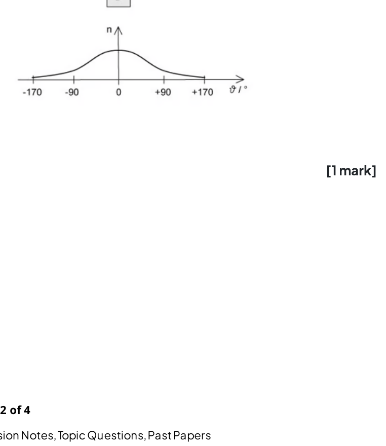
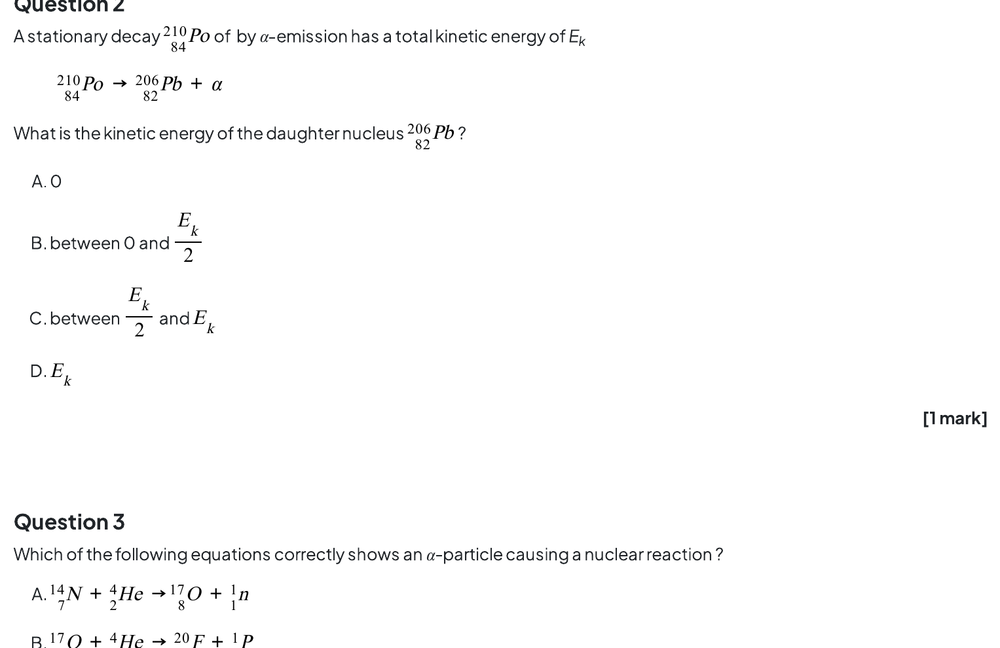

### 11.1 Atoms, Nuclei & Radiation - Easy

::: {.question-card}
#### Example 1 · 11.1 MC Easy Q1

Which of the following lists the three types of nuclear radiation in order of increasing ionising power?

A. α, β, γ

B. β, γ, α

C. γ, α, β

D. γ, β, α

Show answer and explanation

**Answer: D.** γ has the lowest ionising power, β has medium ionising power, and α has the highest ionising power. This is because α-particles are the most massive and slowest, so they interact more strongly with atoms along their path.

:::

::: {.question-card}
#### Example 2 · 11.1 MC Easy Q2

In β⁻ decay, what happens to the nucleon number of the nucleus?

A. It decreases by 1

B. It stays the same

C. It increases by 1

D. It decreases by 4

Show answer and explanation

**Answer: B.** In β⁻ decay, a neutron decays to become a proton, an electron (β⁻ particle) and an antineutrino. The mass number is unchanged because the total number of nucleons remains the same. The proton number increases by one.

:::

::: {.question-card}
#### Example 3 · 11.1 MC Easy Q3

In the Geiger–Marsden (gold foil) experiment, what was the observation that led to the conclusion that the atom is mostly empty space?

A. Most α-particles were deflected through large angles

B. All α-particles were absorbed by the foil

C. Most α-particles passed straight through the foil

D. Most α-particles were reflected by the foil

Show answer and explanation

**Answer: C.** The fact that most α-particles passed straight through the foil with little or no deflection indicated that the atom consists mostly of empty space. The small, dense nucleus was only occasionally encountered, causing the rare large-angle deflections.

:::

::: {.question-card}
#### Example 4 · 11.1 MC Easy Q4

When a nucleus of aluminium-27 is bombarded with α-particles, the following reaction occurs:

$${}^{27}_{13}\text{Al} + {}^{4}_{2}\alpha \rightarrow {}^{30}_{15}\text{P} + \text{X}$$

What is particle X?

A. A neutron

B. A proton

C. An electron

D. A γ-ray photon

Show answer and explanation

**Answer: A.** Balancing the equation: left side has nucleon number 27 + 4 = 31, right side has 30 + A, so A = 1. Left side has proton number 13 + 2 = 15, right side has 15 + Z, so Z = 0. Therefore X is a neutron ${}^{1}_{0}\text{n}$.

:::

::: {.question-card}
#### Example 5 · 11.1 MC Easy Q5

A nucleus of caesium-133 (${}^{133}_{55}\text{Cs}$) contains how many protons, neutrons and electrons in the neutral atom?

A. 55 protons, 78 neutrons, 55 electrons

B. 55 protons, 133 neutrons, 55 electrons

C. 78 protons, 55 neutrons, 78 electrons

D. 133 protons, 55 neutrons, 133 electrons

Show answer and explanation

**Answer: A.** The symbol ${}^{133}_{55}\text{Cs}$ gives the nucleon number A = 133 and the proton number Z = 55. So there are 55 protons. The number of neutrons = A − Z = 133 − 55 = 78. In a neutral atom, the number of electrons equals the number of protons = 55.

:::

::: {.question-card}
#### Example 6 · 11.1 MC Easy Q6

Which of the following is a correct property of an α-particle?

A. It has a charge of −e

B. It is a helium nucleus with charge +2e

C. It has a typical speed of $3 \times 10^8$ m s$^{-1}$

D. It has the lowest ionising power of the three types of radiation

Show answer and explanation

**Answer: B.** An α-particle is a helium nucleus consisting of two protons and two neutrons, giving it a charge of +2e. Its typical speed is $10^6$–$10^7$ m s$^{-1}$ (not the speed of light), and it has the highest ionising power of the three types of radiation.

:::

::: {.question-card}
#### Example 7 · 11.1 MC Easy Q7

After β⁻ emission, the nucleus produced is:

A. an isotope of the original element

B. a different element with the same nucleon number

C. a different element with a different nucleon number

D. an isotope with a different number of neutrons

Show answer and explanation

**Answer: B.** In β⁻ decay, a neutron changes into a proton, so the proton number (Z) increases by 1 — this means the element changes. The nucleon number (A) stays the same. Therefore the resulting nucleus is a different element with the same nucleon number.

:::

::: {.question-card}
#### Example 8 · 11.1 MC Easy Q8

A nucleus of polonium-210 (${}^{210}_{84}\text{Po}$) undergoes α-decay. What are the proton number and nucleon number of the daughter nucleus?

A. Z = 82, A = 206

B. Z = 86, A = 206

C. Z = 82, A = 214

D. Z = 86, A = 214

Show answer and explanation

**Answer: A.** An α-particle is ${}^{4}_{2}\text{He}$, so it reduces the nucleon number by 4 and the proton number by 2. ${}^{210}_{84}\text{Po} \rightarrow {}^{206}_{82}\text{X} + {}^{4}_{2}\alpha$. The daughter nucleus has Z = 84 − 2 = 82 and A = 210 − 4 = 206.

:::

::: {.question-card}
#### Example 9 · 11.1 MC Easy Q9

A radioactive nucleus Q decays by α-emission to form nucleus R. R then decays by β⁻-emission to form nucleus S. Which statement is correct?

A. Q is an isotope of S

B. Q and S have the same proton number

C. Q and S have the same nucleon number

D. R is an isotope of Q

Show answer and explanation

**Answer: A.** After α-decay, Z decreases by 2 and A decreases by 4. After β⁻-decay, Z increases by 1 and A stays the same. So net change: Z decreases by 1, A decreases by 4. Q has Z protons and A nucleons, S has Z−1 protons and A−4 nucleons — they are not isotopes. But R has Z−2 protons and A−4 nucleons, so R is not an isotope of Q. However, because the net effect of α-decay followed by β⁻-decay restores the neutron-proton ratio, Q and S are actually different elements, not isotopes.

:::

::: {.question-card}
#### Example 10 · 11.1 MC Easy Q10

What is the atomic mass unit (u) defined as?

A. One-twelfth the mass of a carbon-12 atom

B. The mass of a proton

C. One-twelfth the mass of a hydrogen atom

D. The mass of a neutron

Show answer and explanation

**Answer: A.** The atomic mass unit is defined as one-twelfth of the mass of a carbon-12 atom. $1\ \text{u} = 1.66 \times 10^{-27}\ \text{kg}$.

:::

### 11.1 Atoms, Nuclei & Radiation - Medium

::: {.question-card}
#### Example 11 · 11.1 MC Medium Q1

A radioactive nucleus is formed by β⁻-decay. This nucleus then decays by α-emission. The graphs below show the nucleon number N plotted against proton number Z. Which one shows the β⁻-decay followed by the α-emission?

A. Graph A
B. Graph B
C. Graph C
D. Graph D

Show answer and explanation

**Answer: C.** In β⁻-decay, the proton number increases by one and the nucleon number stays the same (a neutron changes to a proton). In α-emission, both the nucleon number and proton number decrease by 4 and 2 respectively. Therefore, the correct graph shows a step to the right (β⁻) followed by a diagonal step down-left (α).

:::

::: {.question-card}
#### Example 12 · 11.1 MC Medium Q6

Alpha, beta and gamma radiations: (1) are absorbed to different extents in solids, (2) behave differently in an electric field, and (3) behave differently in a magnetic field. Diagrams 1, 2 and 3 below illustrate these behaviours.

A. X, L, R

B. W, L, R

C. W, L, P

D. Y, M, P

Show answer and explanation

**Answer: A.** Diagram 1 shows W = α (stopped by paper), X = β (stopped by 1 mm aluminium) and Y = γ (reduced by lead). Diagram 2 shows L = β (attracted to the positive terminal), M = γ (undeflected) and N = α (attracted to the negative terminal). Diagram 3 shows R = β, P = α and Q = γ (deflection in the magnetic field). The three labels that all refer to the same (β) radiation are therefore X, L and R.

:::

::: {.question-card}
#### Example 13 · 11.1 MC Medium Q7

The nuclides shown in the grid below are arranged according to the number of protons and neutrons in each. A nucleus of the nuclide ${}^{8}_{3}\text{Li}$ decays by emitting a β⁻-particle. What is the resulting nuclide?

A. Nuclide A
B. Nuclide B
C. Nuclide C
D. Nuclide D

Show answer and explanation

**Answer: D.** ${}^{8}_{3}\text{Li}$ has proton number 3 and neutron number 5. In β⁻-decay a neutron changes into a proton, so the proton number increases by 1 (to 4) while the neutron number decreases by 1 (to 4). The resulting nuclide is ${}^{8}_{4}\text{Be}$, which on the grid is at the position labelled D.

:::

::: {.question-card}
#### Example 14 · 11.1 MC Medium Q9

Two α-particles with equal energies are deflected by a gold nucleus. Which diagram best represents their paths?

A. Diagram A

B. Diagram B

C. Diagram C

D. Diagram D

Show answer and explanation

**Answer: D.** The gold nucleus is positively charged, so it repels the α-particles (also positive). The closer an α-particle passes to the nucleus, the stronger the repulsive force and the greater the deflection. The correct diagram shows both paths curving away from the nucleus, with the closer path deflected more. Diagrams showing attraction, or paths that do not diverge, are incorrect.

:::

::: {.question-card}
#### Example 15 · 11.1 MC Medium Q10

Three successive radioactive decays are shown in the diagram below; each one results in a particle being emitted. The first decay emits a β-particle, the second decay emits an α-particle, and the third decay emits another β-particle. Nuclides W and Z are compared. Which statement is correct?

A. W and Z are isotopes of the same element
B. Z is a different element of reduced mass
C. Z is a different element of lower atomic number
D. W and Z are identical in all respects

Show answer and explanation

**Answer: A.** The first β⁻-decay increases the proton number by 1. The α-decay then decreases the proton number by 2. The final β⁻-decay increases the proton number by 1 again. The net change in proton number is 0, so W and Z have the same proton number but a different number of neutrons — they are isotopes of the same element.

:::

::: {.question-card}
#### Example 16 · 11.1 MC Medium Q12

A sequence of radioactive decays is shown in the graph of neutron number against proton number. Nucleus S is at the start of the sequence and, after the decays have occurred, nucleus T is formed. What is emitted during the sequence of decays?

A. one α-particle followed by one β-particle
B. two β-particles followed by one α-particle
C. two α-particles followed by two β-particles
D. one α-particle followed by two β-particles

Show answer and explanation

**Answer: D.** Nucleus S decays to nucleus T. Reading the graph, the first stage is an α-decay (both the neutron number and proton number decrease). The nucleon number then no longer changes but the proton number increases, which corresponds to two β⁻-decays. The sequence is therefore one α-particle followed by two β-particles.

:::

::: {.question-card}
#### Example 17 · 11.1 MC Medium Q13

A radioactive substance with a nucleon number of 234 and a proton number of 90 decays by β-emission into a daughter product, which in turn decays by further β-emission into a granddaughter product. Which letter in the diagram represents the granddaughter product?

A. A
B. B
C. C
D. D

Show answer and explanation

**Answer: C.** The parent has A = 234 and Z = 90. Each β⁻-decay leaves the nucleon number unchanged but increases the proton number by 1, so after two β⁻-decays the granddaughter has A = 234 and Z = 92. On the diagram the point with nucleon number 234 and proton number 92 is labelled C.

:::

### 11.1 Atoms, Nuclei & Radiation - Hard

::: {.question-card}
#### Example 18 · 11.1 MC Hard Q1

In an α-particle scattering experiment, a student sets up the apparatus shown below to determine the number n of α-particles incident per unit time on a detector held at various angles θ.

Which of the following graphs best represents the variation of n with θ?

A. Graph A
B. Graph B
C. Graph C
D. Graph D

Show answer and explanation

**Answer: C.** Most α-particles pass straight through the foil with little or no deflection, so n is largest at small θ. The number drops rapidly as θ increases, and very few α-particles (about 1 in 20 000) are detected at large angles (θ > 90°). This corresponds to the graph that starts high at small θ and falls off sharply.

:::

::: {.question-card}
#### Example 19 · 11.1 MC Hard Q2

A stationary nucleus of polonium-210 (${}^{210}_{84}\text{Po}$) decays by α-emission with a total kinetic energy of $E_\text{k}$:

$${}^{210}_{84}\text{Po} \rightarrow {}^{206}_{82}\text{Pb} + {}^{4}_{2}\alpha$$

What is the kinetic energy of the daughter nucleus ${}^{206}_{82}\text{Pb}$?
A. $0$
B. between $0$ and $\frac{E_\text{k}}{2}$
C. between $\frac{E_\text{k}}{2}$ and $E_\text{k}$
D. $E_\text{k}$

Show answer and explanation

**Answer: B.** By conservation of momentum the total momentum before the decay is zero, so the α-particle and the daughter nucleus have equal and opposite momenta ($M_\text{Pb}V = m_\alpha v$). Because kinetic energy is $p^2/2m$, the heavier daughter nucleus carries only a small fraction of the energy: $\frac{E_\text{Pb}}{E_\alpha} = \frac{m_\alpha}{m_\text{Pb}} \approx \frac{4}{206} \approx 0.019$. Hence $E_\text{Pb} \approx 0.019\,E_\text{k}$, which lies between $0$ and $\frac{E_\text{k}}{2}$.

:::

### 11.2 Fundamental Particles - Easy

::: {.question-card}
#### Example 20 · 11.2 MC Easy Q1

Which of the following is a fundamental (elementary) particle?

A. A proton

B. A neutron

C. An electron

D. A pion

Show answer and explanation

**Answer: C.** An electron is a fundamental (elementary) particle — it cannot be broken down further into constituent particles. Protons and neutrons are composite particles made of quarks, and pions are mesons made of a quark and an anti-quark.

:::
