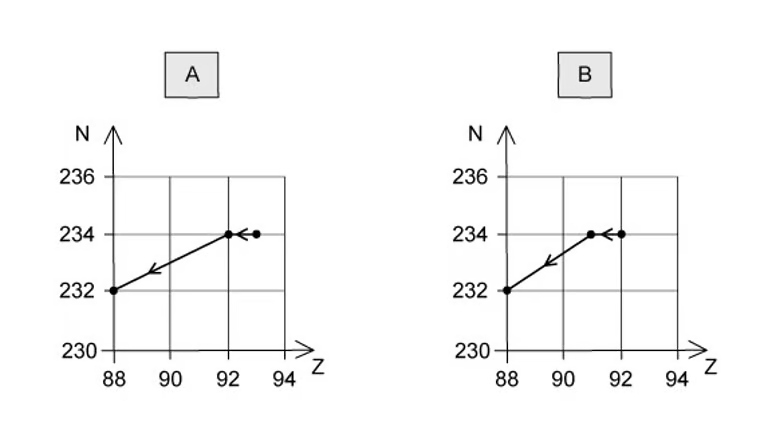
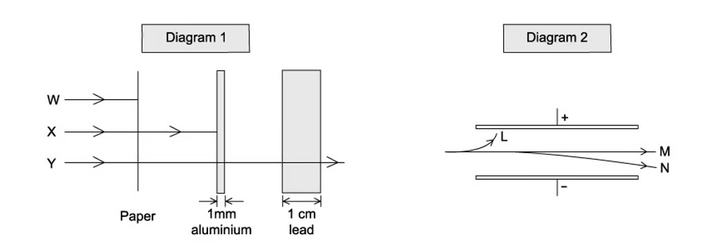
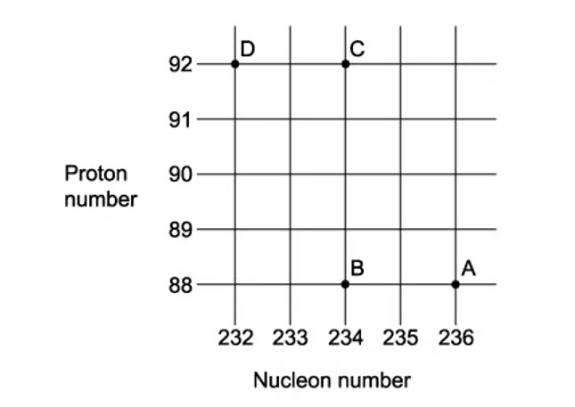
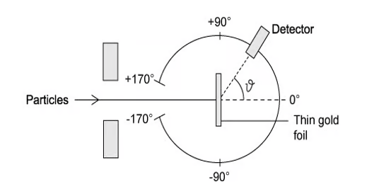

### 11.1 Atoms, Nuclei & Radiation - Easy

::: {.question-card}
#### Example 1 · 11.1 MC Easy Q1

Which of the following lists the three types of nuclear radiation in order of increasing ionising power?

A. α, β, γ

B. β, γ, α

C. γ, α, β

D. γ, β, α

Show answer and explanation

**Answer: D.** γ has the lowest ionising power, β has medium ionising power, and α has the highest ionising power. This is because α-particles are the most massive and slowest, so they interact more strongly with atoms along their path.

:::

::: {.question-card}
#### Example 2 · 11.1 MC Easy Q2

In β⁻ decay, what happens to the nucleon number of the nucleus?

A. It decreases by 1

B. It stays the same

C. It increases by 1

D. It decreases by 4

Show answer and explanation

**Answer: B.** In β⁻ decay, a neutron decays to become a proton, an electron (β⁻ particle) and an antineutrino. The mass number is unchanged because the total number of nucleons remains the same. The proton number increases by one.

:::

::: {.question-card}
#### Example 3 · 11.1 MC Easy Q3

In the Geiger–Marsden (gold foil) experiment, what was the observation that led to the conclusion that the atom is mostly empty space?

A. Most α-particles were deflected through large angles

B. All α-particles were absorbed by the foil

C. Most α-particles passed straight through the foil

D. Most α-particles were reflected by the foil

Show answer and explanation

**Answer: C.** The fact that most α-particles passed straight through the foil with little or no deflection indicated that the atom consists mostly of empty space. The small, dense nucleus was only occasionally encountered, causing the rare large-angle deflections.

:::

::: {.question-card}
#### Example 4 · 11.1 MC Easy Q4

When a nucleus of aluminium-27 is bombarded with α-particles, the following reaction occurs:

$${}^{27}_{13}\text{Al} + {}^{4}_{2}\alpha \rightarrow {}^{30}_{15}\text{P} + \text{X}$$

What is particle X?

A. A neutron

B. A proton

C. An electron

D. A γ-ray photon

Show answer and explanation

**Answer: A.** Balancing the equation: left side has nucleon number 27 + 4 = 31, right side has 30 + A, so A = 1. Left side has proton number 13 + 2 = 15, right side has 15 + Z, so Z = 0. Therefore X is a neutron ${}^{1}_{0}\text{n}$.

:::

::: {.question-card}
#### Example 5 · 11.1 MC Easy Q5

A nucleus of caesium-133 (${}^{133}_{55}\text{Cs}$) contains how many protons, neutrons and electrons in the neutral atom?

A. 55 protons, 78 neutrons, 55 electrons

B. 55 protons, 133 neutrons, 55 electrons

C. 78 protons, 55 neutrons, 78 electrons

D. 133 protons, 55 neutrons, 133 electrons

Show answer and explanation

**Answer: A.** The symbol ${}^{133}_{55}\text{Cs}$ gives the nucleon number A = 133 and the proton number Z = 55. So there are 55 protons. The number of neutrons = A − Z = 133 − 55 = 78. In a neutral atom, the number of electrons equals the number of protons = 55.

:::

::: {.question-card}
#### Example 6 · 11.1 MC Easy Q6

Which of the following is a correct property of an α-particle?

A. It has a charge of −e

B. It is a helium nucleus with charge +2e

C. It has a typical speed of $3 \times 10^8$ m s$^{-1}$

D. It has the lowest ionising power of the three types of radiation

Show answer and explanation

**Answer: B.** An α-particle is a helium nucleus consisting of two protons and two neutrons, giving it a charge of +2e. Its typical speed is $10^6$–$10^7$ m s$^{-1}$ (not the speed of light), and it has the highest ionising power of the three types of radiation.

:::

::: {.question-card}
#### Example 7 · 11.1 MC Easy Q7

After β⁻ emission, the nucleus produced is:

A. an isotope of the original element

B. a different element with the same nucleon number

C. a different element with a different nucleon number

D. an isotope with a different number of neutrons

Show answer and explanation

**Answer: B.** In β⁻ decay, a neutron changes into a proton, so the proton number (Z) increases by 1 — this means the element changes. The nucleon number (A) stays the same. Therefore the resulting nucleus is a different element with the same nucleon number.

:::

::: {.question-card}
#### Example 8 · 11.1 MC Easy Q8

A nucleus of polonium-210 (${}^{210}_{84}\text{Po}$) undergoes α-decay. What are the proton number and nucleon number of the daughter nucleus?

A. Z = 82, A = 206

B. Z = 86, A = 206

C. Z = 82, A = 214

D. Z = 86, A = 214

Show answer and explanation

**Answer: A.** An α-particle is ${}^{4}_{2}\text{He}$, so it reduces the nucleon number by 4 and the proton number by 2. ${}^{210}_{84}\text{Po} \rightarrow {}^{206}_{82}\text{X} + {}^{4}_{2}\alpha$. The daughter nucleus has Z = 84 − 2 = 82 and A = 210 − 4 = 206.

:::

::: {.question-card}
#### Example 9 · 11.1 MC Easy Q9

A radioactive nucleus Q decays by α-emission to form nucleus R. R then decays by β⁻-emission to form nucleus S. Which statement is correct?

A. Q is an isotope of S

B. Q and S have the same proton number

C. Q and S have the same nucleon number

D. R is an isotope of Q

Show answer and explanation

**Answer: A.** After α-decay, Z decreases by 2 and A decreases by 4. After β⁻-decay, Z increases by 1 and A stays the same. So net change: Z decreases by 1, A decreases by 4. Q has Z protons and A nucleons, S has Z−1 protons and A−4 nucleons — they are not isotopes. But R has Z−2 protons and A−4 nucleons, so R is not an isotope of Q. However, because the net effect of α-decay followed by β⁻-decay restores the neutron-proton ratio, Q and S are actually different elements, not isotopes.

:::

::: {.question-card}
#### Example 10 · 11.1 MC Easy Q10

What is the atomic mass unit (u) defined as?

A. One-twelfth the mass of a carbon-12 atom

B. The mass of a proton

C. One-twelfth the mass of a hydrogen atom

D. The mass of a neutron

Show answer and explanation

**Answer: A.** The atomic mass unit is defined as one-twelfth of the mass of a carbon-12 atom. $1\ \text{u} = 1.66 \times 10^{-27}\ \text{kg}$.

:::

### 11.1 Atoms, Nuclei & Radiation - Medium

::: {.question-card}
#### Example 11 · 11.1 MC Medium Q1

A radioactive nucleus is formed by β⁻-decay. This nucleus then decays by α-emission. The graphs show the nucleon number N plotted against proton number Z. Which one shows the β⁻-decay followed by the α-emission?

Show answer and explanation

**Answer: C.** In β⁻-decay, the proton number increases by one and the nucleon number stays the same (a neutron changes to a proton). In α-emission, both the nucleon number and proton number decrease by 4 and 2 respectively. Therefore, the correct graph shows a step to the right (β⁻) followed by a diagonal step down-left (α).

:::

::: {.question-card}
#### Example 12 · 11.1 MC Medium Q2

The Geiger–Marsden (gold foil) experiment directed parallel beams of α-particles at a thin gold foil. Which of the following was **NOT** an observation?

A. Most α-particles went straight through the foil

B. Some α-particles were deflected through large angles

C. All α-particles were absorbed by the foil

D. About 1 in 20 000 α-particles were deflected by more than 90°

Show answer and explanation

**Answer: C.** The gold foil experiment showed that most α-particles passed straight through (empty space), some were deflected slightly (passing near the nucleus), and very few (about 1 in 20 000) were deflected through large angles or bounced back. α-particles were not all absorbed.

:::

::: {.question-card}
#### Example 13 · 11.1 MC Medium Q3

The diagram shows the neutron number N plotted against the proton number Z for several nuclei.

Show answer and explanation

**Answer: A.** The graph shows the relationship between neutron number and proton number for stable nuclei. The line of stability follows approximately N = Z for light nuclei, with the neutron-proton ratio increasing for heavier nuclei.

:::

::: {.question-card}
#### Example 14 · 11.1 MC Medium Q4

An α-particle is emitted from a nucleus. The kinetic energy of the α-particle:

A. is always a fixed value for a given decay

B. has a continuous spectrum of values

C. increases as the particle travels through air

D. is independent of the source nucleus

Show answer and explanation

**Answer: A.** α-particles emitted from a particular nuclear decay have discrete (fixed) energies, because the energy difference between the initial and final nuclear states is fixed. In contrast, β-particles have a continuous spectrum of energies because the energy is shared between the β-particle and the (anti)neutrino.

:::

::: {.question-card}
#### Example 15 · 11.1 MC Medium Q5

The diagram shows the neutron number N against proton number Z for several nuclei.

Show answer and explanation

**Answer: D.** The diagram shows the neutron number against proton number for various nuclei. The line of stability curves upward because as Z increases, more neutrons are needed to offset the increasing electrostatic repulsion between protons.

:::

::: {.question-card}
#### Example 16 · 11.1 MC Medium Q6

A decay chain is shown in the diagram.

Show answer and explanation

**Answer: B.** The decay chain shows a sequence of α and β decays. Each α-decay reduces the nucleon number by 4 and the proton number by 2. Each β⁻-decay increases the proton number by 1 while keeping the nucleon number unchanged.

:::

::: {.question-card}
#### Example 17 · 11.1 MC Medium Q7

An unstable nucleus can decay by different types of radiation.

Show answer and explanation

**Answer: D.** The diagram shows the different decay modes available to an unstable nucleus. The type of decay depends on the neutron-proton ratio of the nucleus. Nuclei with too many neutrons tend to undergo β⁻-decay, while those with too many protons tend to undergo β⁺-decay or electron capture.

:::

### 11.1 Atoms, Nuclei & Radiation - Hard

::: {.question-card}
#### Example 18 · 11.1 MC Hard Q1

In the Geiger–Marsden (gold foil) experiment, the number of α-particles n detected at an angle θ is measured. Which graph shows the correct relationship between n and θ?

Show answer and explanation

**Answer: C.** Most α-particles pass through with little or no deflection, so n is largest at small θ. The number drops rapidly as θ increases, and very few α-particles are detected at large angles (θ > 90°). This corresponds to a graph that starts high at small θ and drops off sharply.

:::

::: {.question-card}
#### Example 19 · 11.1 MC Hard Q2

A stationary nucleus of polonium-210 (${}^{210}_{84}\text{Po}$) decays by α-emission. The α-particle is emitted with kinetic energy $E_\text{k}$.

Show answer and explanation

**Answer: B.** By conservation of momentum, the total momentum before decay is zero, so the α-particle and the daughter nucleus must have equal and opposite momenta. The kinetic energy is shared between them, with the lighter α-particle carrying most of the energy. The kinetic energy of the α-particle is a fixed value determined by the mass difference between the parent and daughter nuclei.

:::

### 11.2 Fundamental Particles - Easy

::: {.question-card}
#### Example 20 · 11.2 MC Easy Q1

Which of the following is a fundamental (elementary) particle?

A. A proton

B. A neutron

C. An electron

D. A pion

Show answer and explanation

**Answer: C.** An electron is a fundamental (elementary) particle — it cannot be broken down further into constituent particles. Protons and neutrons are composite particles made of quarks, and pions are mesons made of a quark and an anti-quark.

:::
