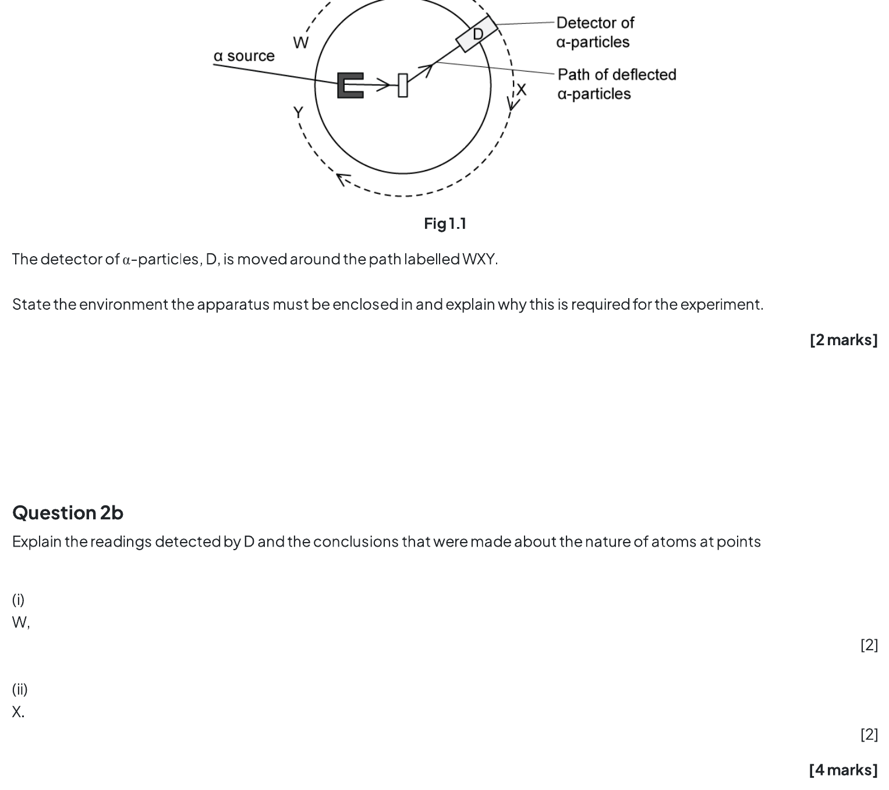

### 11.1 Atoms, Nuclei & Radiation - Medium

::: {.question-card}
#### Example 1 · 11.1 SQ Medium Q1

A nucleus X decays by emitting a β⁺ particle to form a new nucleus, ${}^{23}_{11}\text{Na}$.

(a) State the number of protons and the number of neutrons in nucleus X.

Show answer and explanation

- **(a)** Mass number of X = 23 + 0 = 23. Number of protons = 11 + 1 = 12 protons `[1]`
- Number of neutrons = 23 − 12 = 11 neutrons `[1]`

**Total: 2 marks**

:::

::: {.question-card}
#### Example 2 · 11.1 SQ Medium Q2

The diagram shows the Geiger–Marsden (gold foil) experiment, where α-particles are directed at a thin gold foil and detected by detector D at various positions.

(a) State the environment the apparatus must be enclosed in and explain why this is required for the experiment.

(b) Explain the readings detected by D and the conclusions that were made about the nature of atoms at points:

(i) W

(ii) X

(c) State what the readings detected by D at position Y conclude about the charge of the nucleus. Explain why.

(d) Calculate the number of α-particles per second passing a point in the beam if the current is 3.5 pA.

Show answer and explanation

- **(a)** The apparatus must be enclosed in a vacuum `[1]` because α-particles travel / are absorbed by a short distance in air `[1]` **Total: 2 marks**

- **(b)(i)** A very small proportion deviated in the backwards direction / at large angles `[1]`. This shows that the mass and charge are concentrated in a (very small) nucleus `[1]` **Subtotal: 2 marks**

- **(b)(ii)** The majority went straight through `[1]`. This shows that most of the atom is empty space / the nucleus is very small compared with the atom `[1]` **Subtotal: 2 marks**

- **(c)** The charge of the nucleus is positive `[1]`. Because the α-particle is positive AND it is repelled / deflected (at an angle) `[1]` **Total: 2 marks**

- **(d)** Using $I = Q/t$: $I = 3.5 \times 10^{-12}$ A `[1]`. An α-particle has charge $2e = 2 \times 1.60 \times 10^{-19}$ C. Number per second $n/t = I/(2e) = (3.5 \times 10^{-12})/(3.2 \times 10^{-19}) = 1.1 \times 10^6$ s$^{-1}$ `[1]` **Total: 3 marks**

:::

::: {.question-card}
#### Example 3 · 11.1 SQ Medium Q3

The nuclear equation for the fission of a plutonium-239 nucleus is:

$${}^{239}_{94}\text{Pu} + a\,{}^{b}_{0}\text{n} \rightarrow {}^{x}_{54}\text{Xe} + {}^{103}_{y}\text{Zr} + 3\,{}^{a}_{b}\text{n}$$

(a) Determine the values of a, b, x and y.

(b) State three quantities that are conserved in the fission reaction.

(c) Calculate the radius of a plutonium-239 nucleus, given that the mean density of nuclear matter is $1.3 \times 10^{17}$ kg m$^{-3}$.

(d) Aside from their structure, distinguish between an α-particle and a β-particle.

Show answer and explanation

- **(a)** a = 1 AND b = 0 `[1]`. Calculating x: 239 + 1 = x + 103 + (3 × 1), so x = 240 − 106 = 134 `[1]`. Calculating y: 94 + 0 = 54 + y + (3 × 0), so y = 94 − 54 = 40 `[1]` **Total: 3 marks**

- **(b)** Three quantities conserved: mass and energy / mass–energy `[1]`; momentum `[1]`; charge `[1]` **Total: 2 marks** (any two)

- **(c)** Mass of nucleus = 239 × 1 u = 239 × (1.66 × 10$^{-27}$) = 3.9674 × 10$^{-25}$ kg `[1]`. Using $\rho = m/V = m/(\frac{4}{3}\pi r^3)$: $r = \sqrt[3]{\frac{3m}{4\pi\rho}} = \sqrt[3]{\frac{3 \times 3.9674 \times 10^{-25}}{4\pi \times 1.3 \times 10^{17}}}$ `[1]` = 9.0 × 10$^{-15}$ m `[1]` **Total: 3 marks**

- **(d)** Any three from: speed of α < speed of β `[1]`; α has discrete energies while β has continuous spectrum `[1]`; α has greater ionising power than β (or β has shorter range) `[1]`; α is positive while β is negative `[1]` **Total: 3 marks**

:::

### 11.2 Fundamental Particles - Medium

::: {.question-card}
#### Example 4 · 11.2 SQ Medium Q1

Carbon-10 (${}^{10}_{6}\text{C}$) is an isotope that decays to boron (symbol B) by the emission of a β⁺ particle.

(a) (i) Complete the nuclear equation for this decay, including the proton and nucleon numbers of all the particles involved.

(ii) During the decay, a quark in the carbon-10 nucleus changes into a different type. State the change of quark that occurs.

(b) State the two leptons in this decay.

(c) State and explain why a hadron with a charge of −3e cannot exist.

(d) State a possible quark combination for a hadron of charge +2e.

Show answer and explanation

- **(a)(i)** ${}^{10}_{6}\text{C} \rightarrow {}^{10}_{5}\text{B} + {}^{0}_{+1}\beta + {}^{0}_{0}\nu_\text{e}$ `[1]` for boron, `[1]` for β⁺, `[1]` for neutrino **Total: 3 marks**

- **(a)(ii)** Up quark to down quark `[1]` **Total: 1 mark**

- **(b)** Beta-plus particle / β⁺ / positron `[1]` and (electron) neutrino `[1]` **Total: 2 marks**

- **(c)** Quarks can only have charge $\pm\frac{1}{3}e$ or $\pm\frac{2}{3}e$ `[1]`. A meson contains a quark and an anti-quark so can only have charge 0 or $\pm1e$ `[1]`. A baryon contains three (anti)quarks so can only have charge 0, $\pm1e$ or $\pm2e$ `[1]`. Therefore a charge of −3e is impossible. **Total: 3 marks**

- **(d)** Any one from: uuu / three up quarks `[1]`; ttt / three top quarks `[1]`; ccc / three charm quarks `[1]` **Total: 1 mark**

:::

::: {.question-card}
#### Example 5 · 11.2 SQ Medium Q2

(a) Determine the quark composition of an α-particle.

(b) Use the quark model to show that the charge on the anti-neutron is 0.

(c) State the quark composition of $\Sigma^+$, $\Sigma^0$ and $\Sigma^-$ (the sigma particles with charges +1, 0 and −1 respectively).

(d) A baryon with the quark composition $u\,\bar{d}\,s$ cannot exist. Explain why.

Show answer and explanation

- **(a)** An α-particle has 2 protons (uud) and 2 neutrons (udd) `[1]`. So its quark composition is 6 up (u) AND 6 down (d) quarks `[1]` **Total: 2 marks**

- **(b)** The anti-neutron has quark structure $\bar{u}\,\bar{d}\,\bar{d}$ `[1]`. Charge = $(-\frac{2}{3}) + (+\frac{1}{3}) + (+\frac{1}{3}) = 0$ `[1]` **Total: 2 marks**

- **(c)** $\Sigma^+ = uus$ `[1]`; $\Sigma^0 = uds$ `[1]`; $\Sigma^- = dds$ `[1]` **Total: 3 marks**

- **(d)** A baryon can only be made up of three quarks or three anti-quarks `[1]`. A baryon cannot consist of a mix of quarks and anti-quarks **Total: 1 mark**

:::

::: {.question-card}
#### Example 6 · 11.2 SQ Medium Q3

(a) Determine the number of 'up' quarks in the nucleus of ${}^{27}_{13}\text{Al}$.

(b) (i) State the classification of the D particle.

(ii) Show that the charge on the D particle is 0.

(c) Using the quark model, show that the magnitude of the charge of a proton is equal to the charge of an electron.

(d) Using the quark model for β⁺ decay, prove that charge is conserved.

Show answer and explanation

- **(a)** ${}^{27}_{13}\text{Al}$ has 13 protons and 27 − 13 = 14 neutrons `[1]`. A proton (uud) has 2 up quarks, a neutron (udd) has 1 up quark. Number of up quarks = (13 × 2) + (14 × 1) = 40 `[1]` **Total: 1 mark**

- **(b)(i)** The D particle is a meson `[1]` **Total: 1 mark**

- **(b)(ii)** The D particle has quark composition $u\,\bar{c}$ `[1]`. Charge = $+\frac{2}{3}e + (-\frac{2}{3}e) = 0$ `[1]` **Total: 2 marks**

- **(c)** Proton composition is uud `[1]`. Charge = $+\frac{2}{3}e + \frac{2}{3}e + (-\frac{1}{3}e) = +1e$ `[1]` **Total: 1 mark**

- **(d)** β⁺ decay: $p \rightarrow n + e^+ + \nu_\text{e}$; quark change: $u \rightarrow d + e^+ + \nu_\text{e}$ `[1]`. Compare charges: LHS = $+\frac{2}{3}e$, RHS = $-\frac{1}{3}e + (+1e) + 0 = +\frac{2}{3}e$ `[1]`. LHS = RHS, therefore charge is conserved `[1]` **Total: 3 marks**

:::
