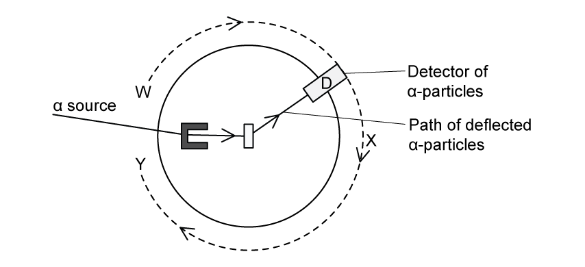

### 11.1 Atoms, Nuclei & Radiation - Medium

::: {.question-card}
#### Example 1 · 11.1 SQ Medium Q1

A nucleus X decays by emitting a β⁺ particle to form a new nucleus, ${}^{23}_{11}\text{Na}$.

**(a)** State the number of protons and the number of neutrons in nucleus X.

number of protons = ____________

number of neutrons = ____________

`[2 marks]`

**(b)** State one similarity between a β⁺ particle and a β⁻ particle. `[1 mark]`

**(c)** State the quark composition of a meson. `[1 mark]`

**(d)** A hadron consists of two down quarks and a charm quark.

Determine the charge of the hadron. Show your working.

charge = ____________ `[2 marks]`

Show mark scheme / model answer

- **(a)** In β⁺-decay the proton number decreases by 1 and the nucleon number is unchanged. ${}^{23}_{11}\text{Na}$ has 11 protons, so X has $11+1=12$ protons `[1]` and $23-12=11$ neutrons. `[1]`
- **(b)** They have the same rest mass (and the same magnitude of charge). `[1]`
- **(c)** A meson consists of one quark and one antiquark. `[1]`
- **(d)** Down quark charge $=-\frac{1}{3}e$, charm quark charge $=+\frac{2}{3}e$. `[1]` Total charge $=-\frac{1}{3}-\frac{1}{3}+\frac{2}{3}=0$. `[1]`

`[Total: 6 marks]`

:::

::: {.question-card}
#### Example 2 · 11.1 SQ Medium Q2

The deflection of α-particles by a thin metal foil is investigated with the arrangement shown in Fig. 1.1.

{.question-figure fig-alt="An alpha source with a detector D moved along a path WXY around a thin metal foil"}

The detector of α-particles, D, is moved around the path labelled WXY.

**(a)** State the environment the apparatus must be enclosed in and explain why this is required for the experiment. `[2 marks]`

**(b)** Explain the readings detected by D and the conclusions that were made about the nature of atoms at points

**(i)** W; `[2]`

**(ii)** X. `[2]`

`[4 marks]`

**(c)** State what the readings detected by D at position Y conclude about the charge of the nucleus. Explain why. `[2 marks]`

**(d)** A beam of α-particles produces a current of 3.5 pA.

Calculate the number of α-particles per second passing a point in the beam. `[3 marks]`

Show mark scheme / model answer

- **(a)** The apparatus must be enclosed in a vacuum `[1]` because α-particles travel only a short distance in air / are absorbed by air. `[1]`
- **(b)(i)** At W (behind the foil, in line with the source), the majority of the α-particles went straight through. `[1]` This shows that most of the atom is empty space / the nucleus is very small compared with the atom. `[1]`
- **(b)(ii)** At X (to the side), a small number of α-particles are deflected through small angles. `[1]` This shows that the nucleus is positively charged (repelling the positive α-particles). `[1]`
- **(c)** The charge of the nucleus is positive. `[1]` A few α-particles are repelled backwards, which can only happen if they approach a very small, dense, positively charged nucleus. `[1]`
- **(d)** Current $I=Q/t=n\times 2e$. `[1]` $n=I/(2e)=3.5\times10^{-12}/(2\times1.6\times10^{-19})$. `[1]` $n=1.1\times10^{7}\ \mathrm{s^{-1}}$. `[1]`

`[Total: 11 marks]`

:::

::: {.question-card}
#### Example 3 · 11.1 SQ Medium Q3

When a nucleus of plutonium-239 absorbs a neutron, the following reaction may take place.

$${}^{239}_{94}\text{Pu} + {}^{1}_{0}\text{n} \rightarrow {}^{a}_{b}\text{Xe} + {}^{103}_{38}\text{Sr} + 3{}^{1}_{0}\text{n}$$

**(a)** State the values of $a$, $b$, $x$ and $y$. `[3 marks]`

**(b)** State two quantities, other than the proton and neutron number, that are conserved in the fission reaction in part (a). `[2 marks]`

**(c)** A plutonium-239 nucleus has a mean density of $1.3\times10^{17}\ \mathrm{kg\,m^{-3}}$.

Show that the radius of a plutonium-239 nucleus is $9.0\times10^{-15}\ \mathrm{m}$. `[3 marks]`

**(d)** Plutonium-239 is an α-emitter whilst uranium-237 is a β-emitter.

Aside from their structure, distinguish between an α-particle and a β-particle. `[3 marks]`

Show mark scheme / model answer

- **(a)** $a=134$ and $b=54$. `[1]` $x=239+1-134-103-3=0$, so $x=0$. `[1]` $y=40$. `[1]`
- **(b)** Any two from: mass–energy; `[1]` charge; `[1]` momentum / nucleon number. `[1]`
- **(c)** Mass of nucleus $=239\times1.66\times10^{-27}=3.97\times10^{-25}\ \mathrm{kg}$. `[1]` Volume $V=m/\rho=3.97\times10^{-25}/(1.3\times10^{17})=3.05\times10^{-42}\ \mathrm{m^3}$. `[1]` $V=\frac{4}{3}\pi r^3$, so $r=(3V/4\pi)^{1/3}=9.0\times10^{-15}\ \mathrm{m}$. `[1]`
- **(d)** The α-particle has a charge of $+2e$ while the β⁻-particle has a charge of $-e$; `[1]` the α-particle has much greater mass; `[1]` the α-particle has greater ionising power but less penetrating power. `[1]`

`[Total: 11 marks]`

:::

### 11.2 Fundamental Particles - Medium

::: {.question-card}
#### Example 4 · 11.2 SQ Medium Q1

Carbon-10 (${}^{10}_{6}\text{C}$) is an isotope that decays to an isotope of boron (symbol B) by the emission of a β⁺ particle.

**(a)** Complete the nuclear equation for this decay, including the proton and nucleon numbers of all the particles involved.

$${}^{10}_{6}\text{C} \rightarrow \rule{2cm}{0.4pt} + \rule{2cm}{0.4pt}$$

`[3]`

**(ii)** During the decay, a quark in the carbon-10 nucleus changes into a different type.

State the change of quark that occurs. `[1]`

`[4 marks]`

**(b)** State the two leptons in this decay. `[2 marks]`

**(c)** State and explain why a hadron with charge $-3e$ cannot exist. $e$ is the elementary charge. `[3 marks]`

**(d)** State the possible quark combination for a hadron of charge $+2e$. `[1 mark]`

Show mark scheme / model answer

- **(a)** ${}^{10}_{6}\text{C} \rightarrow {}^{10}_{5}\text{B} + {}^{0}_{+1}\beta^{+} + \nu_\text{e}$. `[3]` (1 mark for each correctly placed term)
- **(a)(ii)** An up quark changes into a down quark. `[1]`
- **(b)** The positron (β⁺ particle) `[1]` and the (electron) neutrino. `[1]`
- **(c)** Quarks have charges of only $+\frac{2}{3}e$ or $-\frac{1}{3}e$. `[1]` A meson contains a quark and an antiquark, so can only have charge 0 or $\pm e$. `[1]` A baryon contains three quarks, so can only have charge 0, $\pm e$ or $\pm 2e$ – never $-3e$. `[1]`
- **(d)** Any valid three-quark combination summing to $+2e$, e.g. uuu (three up quarks). `[1]`

`[Total: 10 marks]`

:::

::: {.question-card}
#### Example 5 · 11.2 SQ Medium Q2

**(a)** State the quark composition of an alpha particle. `[2 marks]`

**(b)** Use the quark model to show that the charge on the anti-neutron is 0. `[2 marks]`

**(c)** A sigma baryon $\Sigma$ is a hadron that consists of an up (u) quark, a down (d) quark and a strange (s) quark.

State the quark composition of $\Sigma^{+}$, $\Sigma^{0}$ and $\Sigma^{-}$. `[3 marks]`

**(d)** Explain why a baryon with the quark composition uds cannot exist. `[1 mark]`

Show mark scheme / model answer

- **(a)** An alpha particle has 2 protons (uud) and 2 neutrons (udd). `[1]` So its quark composition is 6 up quarks and 6 down quarks. `[1]`
- **(b)** The anti-neutron has quark composition $\bar{u}\bar{d}\bar{d}$. `[1]` Charge $=-\frac{2}{3}e+\frac{1}{3}e+\frac{1}{3}e=0$. `[1]`
- **(c)** $\Sigma^{+}$ = uus; `[1]` $\Sigma^{0}$ = uds; `[1]` $\Sigma^{-}$ = dds. `[1]`
- **(d)** A baryon can only be made of three quarks or three antiquarks – it cannot contain a mixture of quarks and antiquarks (uds contains no antiquarks, but the statement refers to the composition of $\bar{u}\bar{d}\bar{s}$ which is an antibaryon, not a baryon). `[1]`

`[Total: 8 marks]`

:::

::: {.question-card}
#### Example 6 · 11.2 SQ Medium Q3

**(a)** State the number of 'up' quarks in the nucleus of ${}^{27}_{13}\text{Al}$. `[1 mark]`

**(b)** The D particle has a quark structure $u\bar{c}$.

Determine

**(i)** the classification of the D particle; `[1]`

**(ii)** the charge on the particle. `[1]`

`[2 marks]`

**(c)** Using the quark model, show that the magnitude of the charge of a proton is equal to the charge of an electron. `[1 mark]`

**(d)** Using the quark model for β⁺ decay, show that charge is conserved in this decay. `[3 marks]`

Show mark scheme / model answer

- **(a)** ${}^{27}_{13}\text{Al}$ has 13 protons and 14 neutrons. Each proton (uud) has 2 up quarks and each neutron (udd) has 1 up quark: $(13\times2)+(14\times1)=40$ up quarks. `[1]`
- **(b)(i)** The D particle is a meson (one quark and one antiquark). `[1]`
- **(b)(ii)** Charge $=+\frac{2}{3}e-\frac{2}{3}e=0$. `[1]`
- **(c)** Proton = uud: charge $=+\frac{2}{3}+\frac{2}{3}-\frac{1}{3}=+e$. `[1]` The electron has charge $-e$, so the magnitudes are equal.
- **(d)** In β⁺-decay, an up quark changes to a down quark: $u \rightarrow d + e^{+} + \nu_\text{e}$. `[1]` Charge on the left: $+\frac{2}{3}e$. `[1]` Charge on the right: $-\frac{1}{3}e+e+0=+\frac{2}{3}e$. `[1]` Charge is conserved.

`[Total: 7 marks]`

:::
